# 01. Two Pointers

1. [Introduction to Two Pointers](#introduction-to-two-pointers)
2. [Pair Sum Sorted](#pair-sum---sorted)
3. [Triplet Sum](#triplet-sum)
4. [Is Palindrome Valid](#is-palindrome-valid)
5. [Largest Container](#largest-container)
6. [Shift Zeros To The End](#shift-zeros-to-the-end)
7. [Next Lexicographical Sequence](#next-lexicographical-sequence)

---

# Introduction to Two Pointers
## Intuition
As the name implies, a two-pointer pattern refers to an algorithm that utilizes two pointers. But what is a pointer? It's a variable that represents an index or position within a data structure, like an array or linked list. Many algorithms just use a single pointer to attain or keep track of a single element:

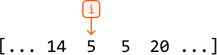

Introducing a second pointer opens a new world of possibilities. Most importantly, we can now make **comparisons.** With pointers at two different positions, we can compare the elements at those positions and make decisions based on the comparison:

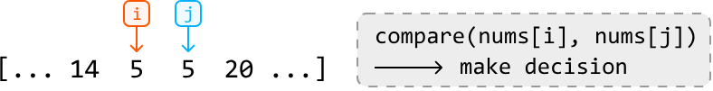

In many cases, such comparisons are made using two nested for-loops, which takes $O(n^2)$ time, where n denotes the length of the data structure. In the code snippet below, i and j are two pointers used to compare every two elements of an array:

### Python
```python
for i in range(n):
    for j in range(i + 1, n):
        compare(nums[i], nums[j])
```
### Javascript
``` javascript
for (let i = 0; i < n; i++) {
  for (let j = i + 1; j < n; j++) {
    compare(nums[i], nums[j])
  }
}
```
### Java
``` java
for (int i = 0; i < n; i++) {
    for (int j = i + 1; j < n; j++) {
        compare(nums[i], nums[j])
    }
}
```
### C++
``` cpp
for (int i = 0; i < n; i++) {
    for (int j = i + 1; j < n; j++) {
        compare(nums[i], nums[j])
    }
}
```

Often, this approach does not take advantage of **predictable dynamics** that might exist in a data structure. An example of a data structure with predictable dynamics is a sorted array: when we move a pointer in a sorted array, we can predict whether the value being moved to is greater or smaller. For example, moving a pointer to the right in an ascending array guarantees we're moving to a value greater than or equal to the current one:

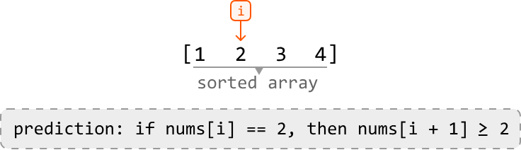

As you can see, data structures with predictable dynamics let us move pointers in a logical way. Taking advantage of this predictability can lead to improved time and space complexity, which we will illustrate with real interview problems in this chapter.

## Two-pointer Strategies
Two-pointer algorithms usually take only O(n) time by eliminating the need for nested for-loops. There are three main strategies for using two pointers.
### Inward traversal
This approach has pointers starting at opposite ends of the data structure and moving inward toward each other:

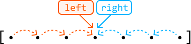

The pointers move toward the center, adjusting their positions based on comparisons, until a certain condition is met, or they meet/cross each other. This is ideal for problems where we need to compare elements from different ends of a data structure.

### Unidirectional traversal
In this approach, both pointers start at the same end of the data structure (usually the beginning) and move in the same direction:

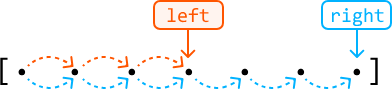

These pointers generally serve two different but supplementary purposes. A common application of this is when we want one pointer to find information (usually the right pointer) and another to keep track of information (usually the left pointer).

### Staged traversal
In this approach, we traverse with one pointer, and when it lands on an element that meets a certain condition, we traverse with the second pointer:

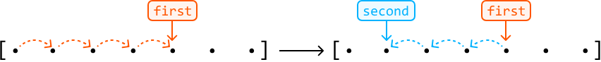

Similar to unidirectional traversal, both pointers serve different purposes. Here, the first pointer is used to search for something, and once found, a second pointer finds additional information concerning the value at the first pointer.

We discuss all of these techniques in detail throughout the problems in this chapter.

## When To Use Two Pointers?

A two-pointer algorithm usually requires a linear data structure, such as an array or linked list. Otherwise, an indication that a problem can be solved using the two-pointer algorithm, is when the input follows a predictable dynamic, such as a **sorted array.**

Predictable dynamics can take many forms. Take, for instance, a palindromic string. Its symmetrical pattern allows us to logically move two pointers toward the center. As you work through the problems in this chapter, you'll learn to recognize these predictable dynamics more easily.

Another potential indicator that a problem can be solved using two pointers is if the problem asks for a **pair of values** or a result that can be generated from two values.

## Real-world Example

**Garbage collection algorithms:** In memory compaction – which is a key part of garbage collection – the goal is to free up contiguous memory space by eliminating gaps left by deallocated (aka dead) objects. A two-pointer technique helps achieve this efficiently: a 'scan' pointer traverses the heap to identify live objects, while a 'free' pointer keeps track of the next available space to where live objects should be relocated. As the 'scan' pointer moves, it skips over dead objects and shifts live objects to the position indicated by the 'free' pointer, compacting the memory by grouping all live objects together and freeing up continuous blocks of memory.

## Chapter Outline

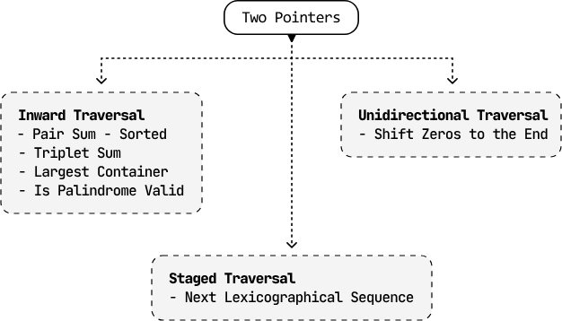

The two-pointer pattern is very versatile and, consequently, quite broad. As such, we want to cover more specialized variants of this algorithm in separate chapters, such as Fast and Slow Pointers and Sliding Windows.


# Pair Sum - Sorted
Given an array of integers sorted in ascending order and a target value, return the indexes of any pair of numbers in the array that sum to the target. The order of the indexes in the result doesn't matter. If no pair is found, return an empty array.

### Example 1:
``` 
Input: nums = [-5, -2, 3, 4, 6], target = 7
Output: [2, 3]
```


### Example 2:
``` 
Input: nums = [1, 1, 1], target = 2
Output: [0, 1]
```

Explanation: other valid outputs could be `[1, 0]`, `[0, 2]`, `[2, 0]`, `[1, 2]` or `[2, 1]`.

## Intuition

The brute force solution to this problem involves checking all possible pairs. This is done using two nested loops: an outer loop that traverses the array for the first element of the pair, and an inner loop that traverses the rest of the array to find the second element. Below is the code snippet for this approach:

### Python
```python
from typing import List
  
def pair_sum_sorted_brute_force(nums: List[int], target: int) -> List[int]:
    n = len(nums)
    for i in range(n):
        for j in range(i + 1, n):
            if nums[i] + nums[j] == target:
                return [i, j]
    return []
```
### Javascript
``` javascript
export function pair_sum_sorted_brute_force(nums, target) {
  for (let i = 0; i < nums.length; i++) {
    for (let j = i + 1; j < nums.length; j++) {
      if (nums[i] + nums[j] === target) {
        return [i, j]
      }
    }
  }
  return []
}
```
### Java
``` java
import java.util.ArrayList;

public class Main {
    public ArrayList<Integer> pair_sum_sorted_brute_force(ArrayList<Integer> nums, int target) {
        int n = nums.size();
        for (int i = 0; i < n; i++) {
            for (int j = i + 1; j < n; j++) {
                if (nums.get(i) + nums.get(j) == target) {
                    ArrayList<Integer> result = new ArrayList<>();
                    result.add(i);
                    result.add(j);
                    return result;
                }
            }
        }
        return new ArrayList<>();
    }
}
```

This approach has a time complexity of $O(n^2)$,where n denotes the length of the array. This approach does not take into account that the input array is sorted. Could we use this fact to come up with a more efficient solution?

A **two-pointer approach** is worth considering here because a sorted array allows us to move the pointers in a logical way. Let's see how this works in the example below:

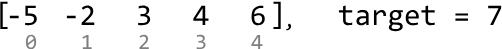

A good place to start is by looking at the smallest and largest values: the first and last elements, respectively. The sum of these two values is 1.

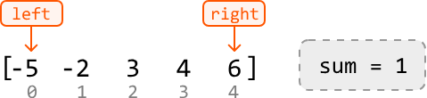

Since 1 is less than the target, we need to **move one of our pointers** to find a new pair with a larger sum.

- Left pointer: The left pointer will always point to a value less than or equal to the value at the right pointer because the array is sorted. Incrementing it would result in a sum greater than or equal to the current sum of 1.

- Right pointer: Decrementing the right pointer would result in a sum that’s less than or equal to 1.

Therefore, we should increment the left pointer to find a larger sum:

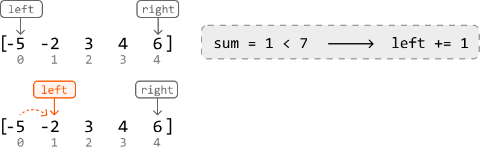

Again, the sum of the values at those two pointers (4) is too small. So, let's increment the left pointer:

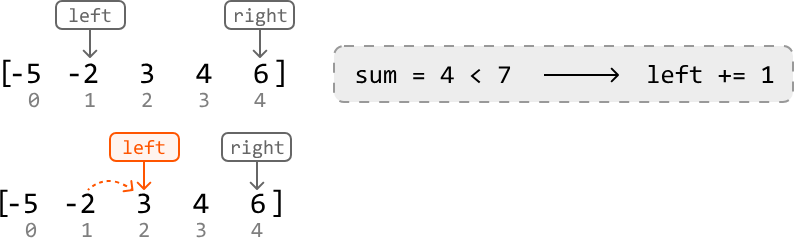

Now, the sum (9) is too large. So, we should decrement the right pointer to find a pair of values with a smaller sum:

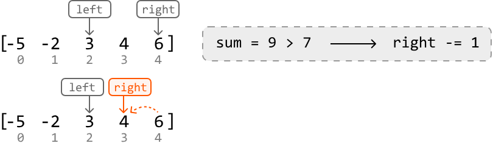

Finally, we found two numbers that yield a sum equal to the target. Let’s return their indexes:

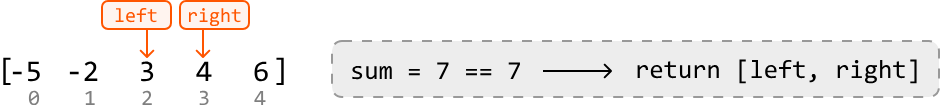

Above, we’ve demonstrated a two-pointer algorithm using inward traversal. Let’s summarize this logic. For any pair of values at left and right:

- If their sum is less than the target, increment left, aiming to increase the sum towards the target value.

- If their sum is greater than the target, decrement right, aiming to decrease the sum towards the target value.

- If their sum is equal to the target value, return [left, right].

We can stop moving the left and right pointers when they meet, as this indicates no pair summing to the target was found.

# Implementation

### Python
```python
from typing import List
       
def pair_sum_sorted(nums: List[int], target: int) -> List[int]:
    left, right = 0, len(nums) - 1
    while left < right:
        sum = nums[left] + nums[right]
        # If the sum is smaller, increment the left pointer, aiming to increase the
        # sum towards the target value.
        if sum < target:
            left += 1
        # If the sum is larger, decrement the right pointer, aiming to decrease the
        # sum towards the target value.
        elif sum > target:
            right -= 1
        # If the target pair is found, return its indexes.
        else:
            return [left, right]
    return []
```
### Javascript
``` javascript
export function pair_sum_sorted(nums, target) {
  let left = 0
  let right = nums.length - 1
  while (left < right) {
    const sum = nums[left] + nums[right]
    // If the sum is smaller, increment the left pointer, aiming to increase the
    // sum towards the target value.
    if (sum < target) {
      left += 1
    }
    // If the sum is larger, decrement the right pointer, aiming to decrease the
    // sum towards the target value.
    else if (sum > target) {
      right -= 1
    }
    // If the target pair is found, return its indexes.
    else {
      return [left, right]
    }
  }
  return []
}
```
### Java
``` java
import java.util.ArrayList;

public class Main {
    public ArrayList<Integer> pair_sum_sorted(ArrayList<Integer> nums, int target) {
        int left = 0, right = nums.size() - 1;
        while (left < right) {
            int sum = nums.get(left) + nums.get(right);
            // If the sum is smaller, increment the left pointer, aiming to increase the
            // sum towards the target value.
            if (sum < target) {
                left++;
            }
            // If the sum is larger, decrement the right pointer, aiming to decrease the
            // sum towards the target value.
            else if (sum > target) {
                right--;
            }
            // If the target pair is found, return its indexes.
            else {
                ArrayList<Integer> result = new ArrayList<>();
                result.add(left);
                result.add(right);
                return result;
            }
        }
        return new ArrayList<>();
    }
}
```

# Complexity Analysis

**Time complexity:** The time complexity of pair_sum_sorted is O(n) because we perform approximately n iterations using the two-pointer technique in the worst case.

**Space complexity:** We only allocated a constant number of variables, so the space complexity is O(1).

# Test Cases

In addition to the examples already discussed, here are some other test cases you can use. These extra test cases cover different contexts to ensure the code works well across a range of inputs. Testing is important because it helps identify mistakes in your code, ensures the solution works for uncommon inputs, and brings attention to cases you might have overlooked.

| Input                             | Expected Output     | Description                                                                 |
|-----------------------------------|---------------------|-----------------------------------------------------------------------------|
| nums = [] target = 0              | []                  | Tests an empty array.                                                       |
| nums = [1] target = 1             | []                  | Tests an array with just one element.                                       |
| nums = [2, 3] target = 5          | [0, 1]              | Tests a two-element array that contains a pair that sums to the target.     |
| nums = [2, 4] target = 5          | []                  | Tests a two-element array that doesn’t contain a valid pair.                |
| nums = [2, 2, 3] target = 5       | [0, 2] or [1, 2]    | Tests an array with duplicate values.                                       |
| nums = [-1, 2, 3] target = 2      | [0, 2]              | Tests handling of negative numbers in the pair.                             |
| nums = [-3, -2, -1] target = -5   | [0, 1]              | Tests when both numbers in the pair are negative.                           |


# Interview Tip
**Tip:** Consider all information provided.
When interviewers pose a problem, they sometimes provide only the minimum amount of information required for you to start solving it. Consequently, it’s crucial to thoroughly evaluate all that information to determine which details are essential for solving the problem efficiently. In this problem, the key to arriving at the optimal solution is recognizing that the input is sorted.


# Triplet Sum
 
Given an array of integers, return all triplets `[a, b, c]` such that `a + b + c = 0`. The solution must not contain duplicate triplets (e.g., `[1, 2, 3]` and `[2, 3, 1]` are considered duplicates). If no such triplets are found, return an empty array.
 
Each triplet can be arranged in any order, and the output can be returned in any order.
 
**Example:**
 
```
Input:  nums = [0, -1, 2, -3, 1]
Output: [[-3, 1, 2], [-1, 0, 1]]
```
 
## Intuition
 
A brute force solution involves checking every possible triplet in the array to see if they sum to zero. This can be done using three nested loops, iterating through each combination of three elements.
 
Duplicate triplets can be avoided by sorting each triplet, which ensures that identical triplets with different representations (e.g., `[1, 3, 2]` and `[3, 2, 1]`) are ordered consistently (e.g., `[1, 2, 3]`). Once sorted, we can add these triplets to a hash set. This way, if the same triplet is encountered again, the hash set will only keep one instance. Below is the code snippet for this approach:

# Implementation

### Python
```python
from typing import List
   
def triplet_sum_brute_force(nums: List[int]) -> List[List[int]]:
    n = len(nums)
    # Use a hash set to ensure we don't add duplicate triplets.
    triplets = set()
    # Iterate through the indexes of all triplets.
    for i in range(n):
        for j in range(i + 1, n):
            for k in range(j + 1, n):
                if nums[i] + nums[j] + nums[k] == 0:
                    # Sort the triplet before including it in the hash set.
                    triplet = tuple(sorted([nums[i], nums[j], nums[k]]))
                    triplets.add(triplet)
    return [list(triplet) for triplet in triplets]
    ```
### Javascript
```javascript
export function triplet_sum_brute_force(nums) {
  const n = nums.length
  // Use a hash set to ensure we don't add duplicate triplets.
  const triplets = new Set()
  // Iterate through the indexes of all triplets.
  for (let i = 0; i < n; i++) {
    for (let j = i + 1; j < n; j++) {
      for (let k = j + 1; k < n; k++) {
        if (nums[i] + nums[j] + nums[k] === 0) {
          // Sort the triplet before including it in the hash set.
          const triplet = [nums[i], nums[j], nums[k]].sort((a, b) => a - b)
          triplets.add(triplet.toString()) // Convert to string to store in the set
        }
      }
    }
  }
  // Convert the string representations back to arrays of numbers
  return Array.from(triplets).map((t) => t.split(',').map(Number))
}
```
### Java
``` java
import java.util.ArrayList;
import java.util.HashSet;
import java.util.Collections;

public class Main {
    public ArrayList<ArrayList<Integer>> triplet_sum_brute_force(ArrayList<Integer> nums) {
        int n = nums.size();
        // Use a hash set to ensure we don't add duplicate triplets.
        HashSet<ArrayList<Integer>> triplets = new HashSet<>();
        // Iterate through the indexes of all triplets.
        for (int i = 0; i < n; i++) {
            for (int j = i + 1; j < n; j++) {
                for (int k = j + 1; k < n; k++) {
                    if (nums.get(i) + nums.get(j) + nums.get(k) == 0) {
                        // Sort the triplet before including it in the hash set.
                        ArrayList<Integer> triplet = new ArrayList<>();
                        triplet.add(nums.get(i));
                        triplet.add(nums.get(j));
                        triplet.add(nums.get(k));
                        Collections.sort(triplet);
                        triplets.add(triplet);
                    }
                }
            }
        }
        return new ArrayList<>(triplets);
    }
}
```
This solution is quite inefficient with a time complexity of O(n³), where n denotes the length of the input array. How can we do better?

Let's see if we can find at least one triplet that sums to 0. Notice that if we fix one of the numbers in a triplet, the problem can be reduced to finding the other two. This leads to the following observation:

For any triplet `[a, b, c]`, if we fix `'a'`, we can focus on finding a pair `[b, c]` that sums to `'-a'` (`a + b + c = 0` → `b + c = -a`).

Sound familiar? That's because the problem of finding a pair of numbers that sum to a target has already been addressed by **Pair Sum - Sorted**. However, we can only use that algorithm on a sorted array. So, the first thing we should do is sort the input. Consider the following example:

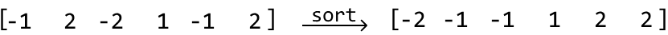

Now, starting at the first element, `-2` (i.e., `'a'`), we'll use the `pair_sum_sorted` method on the rest of the array to find a pair whose sum equals `2` (i.e., `'-a'`):

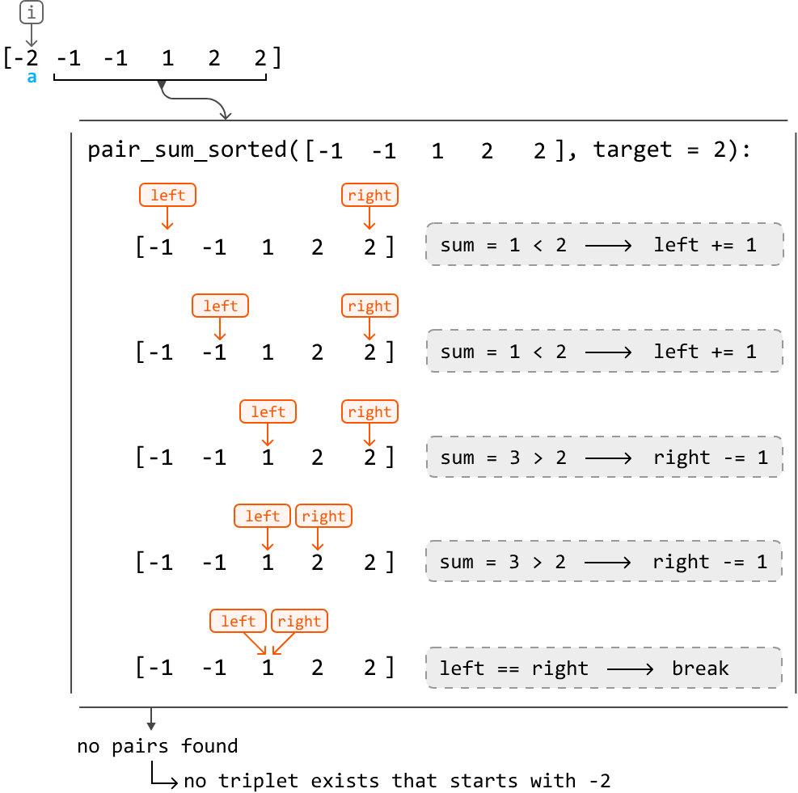

As you can see, when we called `pair_sum_sorted`, we did not find a pair with a sum of `2`. This indicates that there are no triplets starting with `-2` that add up to `0`.

So, let's increment our main pointer, `i`, and try again.

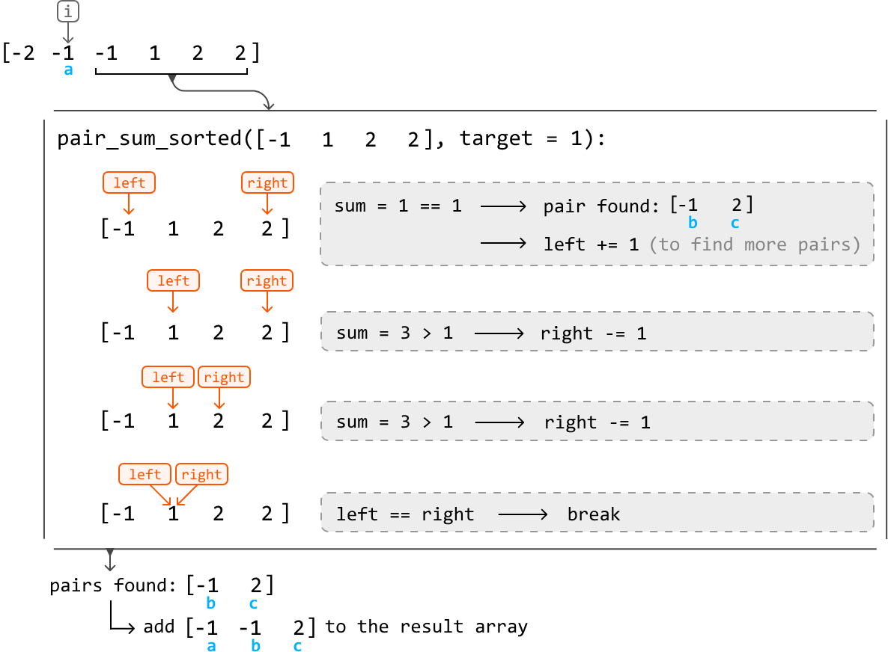

This time, we found one pair that resulted in a valid triplet.

If we continue this process for the rest of the array, we find that `[-1, -1, 2]` is the only triplet whose sum is `0`.

There's an important difference between the `pair_sum_sorted` implementation in **Pair Sum - Sorted** and the one in this problem: for this problem, we don't stop when we find one pair, we keep going until all target pairs are found.

---

## Handling duplicate triplets

Something we previously glossed over is how to avoid adding duplicate triplets. There are two cases in which this happens. Consider the example below:

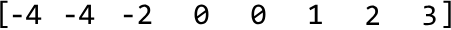

### Case 1: duplicate `'a'` values

The first instance where duplicates may occur is when seeking pairs for triplets that start with the same `'a'` value:

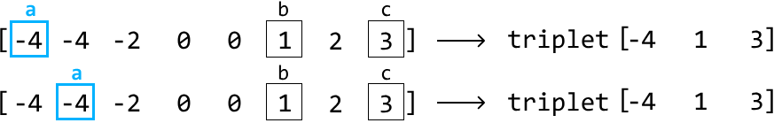

Since `pair_sum_sorted` would look for pairs that sum `'-a'` in both instances, we'd naturally end up with the same pairs and, hence, the same triplets.

To avoid picking the same `'a'` value, we keep increasing `i` (where `num[i]` represents the value `'a'`) until it reaches a different number from the previous one. We do this before we start looking for pairs using the `pair_sum_sorted` method. This logic works because the array is sorted, meaning equal numbers are next to each other. The code snippet for checking duplicate `'a'` values looks like this:
### Python
```python
# To prevent duplicate triplets, ensure 'a' is not a repeat of the previous element
# in the sorted array.
if i > 0 and nums[i] == nums[i - 1]:
    continue
... Find triplets ...
    ```
### Javascript
``` javascript
// To prevent duplicate triplets, ensure 'a' is not a repeat of the previous element
// in the sorted array.
if (i > 0 && nums[i] === nums[i - 1]) {
    continue;
}
... Find triplets ...
```
### Java
``` java
// To prevent duplicate triplets, ensure 'a' is not a repeat of the previous element
// in the sorted array.
if (i > 0 && nums[i] == nums[i - 1]) {
    continue;
}
... Find triplets ...
```
### Case 2: duplicate `'b'` values

As for the second case, consider what happens during `pair_sum_sorted` when we encounter a similar issue. For a fixed target value (`'-a'`), pairs that start with the same number `'b'` will always be the same:

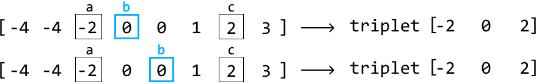

The remedy for this is the same as before: ensure the current `'b'` value isn't the same as the previous value.

It's important to note that we don't need to explicitly handle duplicate `'c'` values. The adjustments made to avoid duplicate `'a'` and `'b'` values ensure each pair `[a, b]` is unique. Since `'c'` is determined by the equation `c = -(a + b)`, each unique `[a, b]` pair will result in a unique `'c'` value. Therefore, by just avoiding duplicates in `'a'` and `'b'`, we automatically avoid duplicates in the `[a, b, c]` triplets.

---

## Optimization

An interesting observation is that triplets that sum to `0` cannot be formed using positive numbers alone. Therefore, we can stop trying to find triplets once we reach a positive `'a'` value since this implies that `'b'` and `'c'` would also be positive.

---

## Try it yourself

Write your solution to the problem before checking the reference implementation.

---

## Implementation

From the above intuition, we know we need to slightly modify the `pair_sum_sorted` function to avoid duplicate triplets. We also need to pass in a `start` value to indicate the beginning of the subarray on which we want to perform the pair-sum algorithm. Otherwise, the two-pointer logic remains nearly identical to that of **Pair Sum - Sorted**.

### Python
```python
from typing import List

def triplet_sum(nums: List[int]) -> List[List[int]]:
    triplets = []
    nums.sort()
    for i in range(len(nums)):
        # Optimization: triplets consisting of only positive numbers will never sum
        # to 0.
        if nums[i] > 0:
            break
        # To avoid duplicate triplets, skip 'a' if it's the same as the previous
        # number.
        if i > 0 and nums[i] == nums[i - 1]:
            continue
        # Find all pairs that sum to a target of '-a' ('-nums[i]').
        pairs = pair_sum_sorted_all_pairs(nums, i + 1, -nums[i])
        for pair in pairs:
            triplets.append([nums[i]] + pair)
    return triplets

def pair_sum_sorted_all_pairs(nums: List[int], start: int, target: int) -> List[int]:
    pairs = []
    left, right = start, len(nums) - 1
    while left < right:
        sum = nums[left] + nums[right]
        if sum == target:
            pairs.append([nums[left], nums[right]])
            left += 1
            # To avoid duplicate '[b, c]' pairs, skip 'b' if it's the same as the
            # previous number.
            while left < right and nums[left] == nums[left - 1]:
                left += 1
        elif sum < target:
            left += 1
        else:
            right -= 1
    return pairs
```
### Javascript
``` javascript
export function triplet_sum(nums) {
  const triplets = []
  nums.sort((a, b) => a - b)
  for (let i = 0; i < nums.length; i++) {
    // Optimization: triplets consisting of only positive numbers will never sum
    // to 0.
    if (nums[i] > 0) break
    // To avoid duplicate triplets, skip 'a' if it's the same as the previous
    // number.
    if (i > 0 && nums[i] === nums[i - 1]) continue
    // Find all pairs that sum to a target of '-a' ('-nums[i]').
    const pairs = pair_sum_sorted_all_pairs(nums, i + 1, -nums[i])
    for (const pair of pairs) {
      triplets.push([nums[i], ...pair])
    }
  }
  return triplets
}

function pair_sum_sorted_all_pairs(nums, start, target) {
  const pairs = []
  let left = start,
    right = nums.length - 1
  while (left < right) {
    const sum = nums[left] + nums[right]
    if (sum === target) {
      pairs.push([nums[left], nums[right]])
      left++
      // To avoid duplicate '[b, c]' pairs, skip 'b' if it’s the same as the
      // previous number.
      while (left < right && nums[left] === nums[left - 1]) {
        left++
      }
    } else if (sum < target) {
      left++
    } else {
      right--
    }
  }
  return pairs
}
```
### Java
``` java
import java.util.ArrayList;
import java.util.Collections;

public class Main {
    public ArrayList<ArrayList<Integer>> triplet_sum(ArrayList<Integer> nums) {
        ArrayList<ArrayList<Integer>> triplets = new ArrayList<>();
        // Sort the input list.
        Collections.sort(nums);
        for (int i = 0; i < nums.size(); i++) {
            // Optimization: triplets consisting of only positive numbers will never sum
            // to 0.
            if (nums.get(i) > 0) {
                break;
            }
            // To avoid duplicate triplets, skip 'a' if it's the same as the previous
            // number.
            if (i > 0 && nums.get(i).equals(nums.get(i - 1))) {
                continue;
            }
            // Find all pairs that sum to a target of '-a' ('-nums[i]').
            ArrayList<ArrayList<Integer>> pairs = pair_sum_sorted_all_pairs(nums, i + 1, -nums.get(i));
            for (ArrayList<Integer> pair : pairs) {
                ArrayList<Integer> triplet = new ArrayList<>();
                triplet.add(nums.get(i));
                triplet.addAll(pair);
                triplets.add(triplet);
            }
        }
        return triplets;
    }

    public ArrayList<ArrayList<Integer>> pair_sum_sorted_all_pairs(ArrayList<Integer> nums, int start, int target) {
        ArrayList<ArrayList<Integer>> pairs = new ArrayList<>();
        int left = start;
        int right = nums.size() - 1;
        while (left < right) {
            int sum = nums.get(left) + nums.get(right);
            if (sum == target) {
                ArrayList<Integer> pair = new ArrayList<>();
                pair.add(nums.get(left));
                pair.add(nums.get(right));
                pairs.add(pair);
                left += 1;
                // To avoid duplicate '[b, c]' pairs, skip 'b' if it’s the same as the
                // previous number.
                while (left < right && nums.get(left).equals(nums.get(left - 1))) {
                    left += 1;
                }
            } else if (sum < target) {
                left += 1;
            } else {
                right -= 1;
            }
        }
        return pairs;
    }
}
```
---

## Complexity Analysis

**Time complexity:** The time complexity of `triplet_sum` is O(n²). Here's why:

- We first sort the array, which takes O(n log(n)) time.
- Then, for each of the n elements in the array, we call `pair_sum_sorted_all_pairs` at most once, which runs in O(n) time.
- Therefore, the overall time complexity is O(log(n)) + O(n²) = **O(n²)**.

**Space complexity:** The space complexity is O(n) due to the space taken up by Python's sorting algorithm. It's important to note that this complexity does not include the output array `triplets` because we're only concerned with the additional space used by the algorithm, not the space needed for the output itself.

If the interviewer asks what the space complexity would be if we included the output array, it would be O(n²). This is because the `pair_sum_sorted_all_pairs` function, in the worst case, can add approximately n pairs to the output. Since this function is called approximately n times, the overall space complexity is O(n²).

---

## Test Cases

In addition to the examples already covered in this explanation, below are some others to consider when testing your code.

| Input | Expected output | Description |
|---|---|---|
| `nums = []` | `[]` | Tests an empty array. |
| `nums = [0]` | `[]` | Tests a single-element array. |
| `nums = [1, -1]` | `[]` | Tests a two-element array. |
| `nums = [0, 0, 0]` | `[[0, 0, 0]]` | Tests an array where all three of its values are the same. |
| `nums = [1, 0, 1]` | `[]` | Tests an array with no triplets that sum to 0. |
| `nums = [0, 0, 1, -1, 1, -1]` | `[[-1, 0, 1]]` | Tests an array with duplicate triplets. |


# Is Palindrome Valid

A palindrome is a sequence of characters that reads the same forward and backward.

Given a string, determine if it's a palindrome after removing all non-alphanumeric characters. A character is alphanumeric if it's either a letter or a number.

**Example 1:**
```
Input:  s = 'a dog! a panic in a pagoda.'
Output: True
```

**Example 2:**
```
Input:  s = 'abc123'
Output: False
```

**Constraints:**
- The string may include a combination of lowercase English letters, numbers, spaces, and punctuations.

---

## Intuition

### Identifying palindromes

A string is a palindrome if it remains identical when read from left to right or right to left. In other words, if we reverse the string, it should still read the same, disregarding spaces and punctuation:

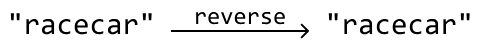

An important observation is that if a string is a palindrome, the first character would be the same as the last, the second character would be the same as the second-to-last, etc:

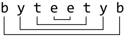

A palindrome of odd length is different because it has a middle character. In this case, the middle character can be ignored since it has no "mirror" character elsewhere in the string.

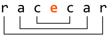

Palindromes provides an ideal scenario for using two pointers (`left` and `right`). By initially setting the pointers at the beginning and end of the string, we can compare the characters at these positions. Ignoring non-alphanumeric characters for the moment, the logic can be summarized as follows:

- If the alphanumeric characters at `left` and `right` are the same, move both pointers inward to process the next pair of characters.
- If not, the string is not a palindrome: return `false`.
- If we successfully compare all character pairs without returning `false`, the string is a palindrome, and we should return `true`.

### Processing non-alphanumeric characters

Now, let's explore how to find palindromes that include non-alphanumeric characters.

Since non-alphanumeric characters don't affect whether a string is a palindrome, we should skip them. This can be achieved with the following approach, which ensures the `left` and `right` pointers are adjusted to focus only on alphanumeric characters:

- Increment `left` until the character it points to is alphanumeric.
- Decrement `right` until the character it points to is alphanumeric.

With this in mind, let's check if the string below is a palindrome using all the information we know so far:

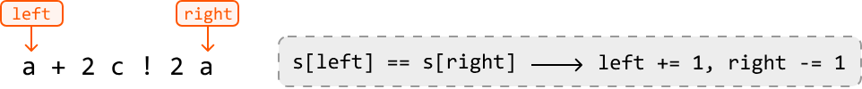

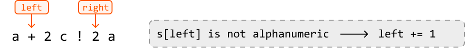

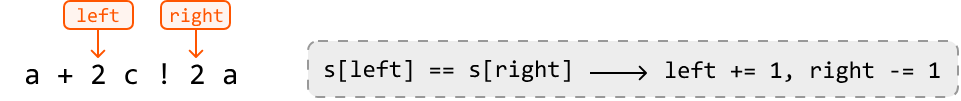

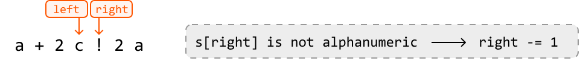

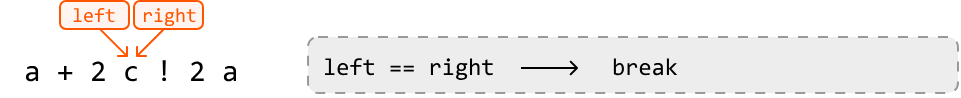

As shown above, when the `left` and `right` pointers meet, it signals our exit condition. When these pointers meet, we've reached the middle character of the palindrome, at which point we can exit the loop since the middle character doesn't need to be evaluated. However, we need to keep in mind that exiting when `left` equals `right` won't always be sufficient as an exit condition. For example, if the number of alphanumeric characters is even, the pointers won't meet. This can be observed below:

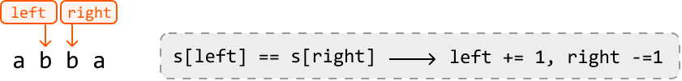

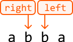

Therefore, we need to ensure we exit the loop when `left` equals `right`, or when `left` passes `right`. In other words, the algorithm continues while `left` is less than `right`:

```python
while left < right:
```

---

## Try it yourself

Write your solution to the problem before checking the reference implementation.

---

## Implementation

In Python, we can use the inbuilt `isalnum` method to check if a character is alphanumeric.

### Python
```python
def is_palindrome_valid(s: str) -> bool:
    left, right = 0, len(s) - 1
    while left < right:
        # Skip non-alphanumeric characters from the left.
        while left < right and not s[left].isalnum():
            left += 1
        # Skip non-alphanumeric characters from the right.
        while left < right and not s[right].isalnum():
            right -= 1
        # If the characters at the left and right pointers don't match, the string is
        # not a palindrome.
        if s[left] != s[right]:
            return False
        left += 1
        right -= 1
    return True
```
### Javascript
``` javascript
export function is_palindrome_valid(s) {
  let left = 0
  let right = s.length - 1
  while (left < right) {
    // Skip non-alphanumeric characters from the left.
    while (left < right && !isAlphanumeric(s[left])) {
      left++
    }
    // Skip non-alphanumeric characters from the right.
    while (left < right && !isAlphanumeric(s[right])) {
      right--
    }
    // If the characters at the left and right pointers don’t match, the string is
    // not a palindrome.
    if (s[left] !== s[right]) {
      return false
    }
    left++
    right--
  }
  return true
}

function isAlphanumeric(char) {
  return /^[a-z0-9]$/.test(char)
}
```
### Java
``` java
public class Main {
    public Boolean is_palindrome_valid(String s) {
        int left = 0, right = s.length() - 1;
        while (left < right) {
            // Skip non-alphanumeric characters from the left.
            while (left < right && !Character.isLetterOrDigit(s.charAt(left))) {
                left++;
            }
            // Skip non-alphanumeric characters from the right.
            while (left < right && !Character.isLetterOrDigit(s.charAt(right))) {
                right--;
            }
            // If the characters at the left and right pointers don’t match, the string is
            // not a palindrome.
            if (Character.toLowerCase(s.charAt(left)) != Character.toLowerCase(s.charAt(right))) {
                return false;
            }
            left++;
            right--;
        }
        return true;
    }
}
```

---

## Complexity Analysis

**Time complexity:** The time complexity of `is_palindrome_valid` is O(n), where n denotes the length of the string. This is because we perform approximately n iterations using the two-pointer technique.

**Space complexity:** We only allocated a constant number of variables, so the space complexity is O(1).

---

## Test Cases

In addition to the examples discussed, below are more examples to consider when testing your code.

| Input | Expected output | Description |
|---|---|---|
| `s = ""` | `True` | Tests an empty string. |
| `s = "a"` | `True` | Tests a single-character string. |
| `s = "aa"` | `True` | Tests a palindrome with two characters. |
| `s = "ab"` | `False` | Tests a non-palindrome with two characters. |
| `s = "!, (?)"` | `True` | Tests a string with no alphanumeric characters. |
| `s = "12.02.2021"` | `True` | Tests a palindrome with punctuation and numbers. |
| `s = "21.02.2021"` | `False` | Tests a non-palindrome with punctuation and numbers. |
| `s = "hello, world!"` | `False` | Tests a non-palindrome with punctuation. |

---

## Interview Tips

**Tip 1: Clarify problem constraints.**

It's common to not receive all the details of a problem from an interviewer. For example, you might only be asked to "check if a string is a palindrome." But before diving into a solution, it's important to clarify details with the interviewer, such as the presence of non-alphanumeric characters, their treatment, the role of numbers, the case sensitivity of letters, and other relevant details.

**Tip 2: Confirm before using significant in-built functions.**

This problem is made easier by using in-built functions such as `.isalnum` (or equivalent). Before using an in-built function that simplifies the implementation, ask the interviewer if it's okay to use it, or if they would prefer you implement it yourself.

The interviewer will most likely allow the use of an in-built function, or ask you to implement it as an exercise for later in the interview. If you use an in-built function, make sure you understand its time and space complexity.

Remember that interviewers are looking for team players, and this shows them you're considerate of their preferences and can adapt your approach based on the requirements.

# Largest Container

You are given an array of numbers, each representing the height of a vertical line on a graph. A container can be formed with any pair of these lines, along with the x-axis of the graph. Return the amount of water which the largest container can hold.

**Example:**

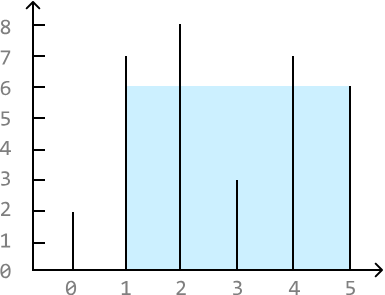

```
Input:  heights = [2, 7, 8, 3, 7, 6]
Output: 24
```

---

## Intuition

If we have two vertical lines, `heights[i]` and `heights[j]`, the amount of water that can be contained between these two lines is `min(heights[i], heights[j]) * (j - i)`, where `j - i` represents the width of the container. We take the minimum height because filling water above this height would result in overflow.

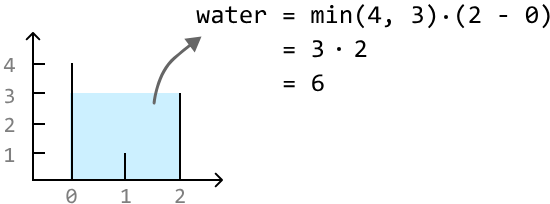

In other words, the area of the container depends on two things:

- The **width** of the rectangle.
- The **height** of the rectangle, as dictated by the shorter of the two lines.

The brute force approach to this problem involves checking all pairs of lines, and returning the largest area found between each pair:

### Python
```python
from typing import List

def largest_container_brute_force(heights: List[int]) -> int:
    n = len(heights)
    max_water = 0
    # Find the maximum amount of water stored between all pairs of lines.
    for i in range(n):
        for j in range(i + 1, n):
            water = min(heights[i], heights[j]) * (j - i)
            max_water = max(max_water, water)
    return max_water
```
### JavaScript
```javascript
export function largest_container(heights) {
  const n = heights.length
  let maxWater = 0
  // Find the maximum amount of water stored between all pairs of lines.
  for (let i = 0; i < n; i++) {
    for (let j = i + 1; j < n; j++) {
      const water = Math.min(heights[i], heights[j]) * (j - i)
      maxWater = Math.max(maxWater, water)
    }
  }
  return maxWater
}
```
### Java
```java
import java.util.ArrayList;

public class Main {
    public int largest_container_brute_force(ArrayList<Integer> heights) {
        int n = heights.size();
        int max_water = 0;
        // Find the maximum amount of water stored between all pairs of lines.
        for (int i = 0; i < n; i++) {
            for (int j = i + 1; j < n; j++) {
                int water = Math.min(heights.get(i), heights.get(j)) * (j - i);
                max_water = Math.max(max_water, water);
            }
        }
        return max_water;
    }
}
```


Searching through all possible pairs of values takes O(n²) time, where n denotes the length of the array. Let's look for a more efficient solution.

We would like both the height and width to be as large as possible to have the largest container.

It's not immediately obvious how to find the container with the largest height, as the heights of the lines in the array don't follow a clear pattern. However, we do know the container with the maximum width: the one starting at index `0` and ending at index `n - 1`.

So, we could start by maximizing the width by setting a pointer at each end of the array. Then, we can gradually reduce the width by moving these two pointers inward, hoping to find a container with a larger height that potentially yields a larger area. This suggests we can use the **two-pointer pattern** to solve the problem.

Moving a pointer inward means shifting either the left pointer to the right, or the right pointer to the left, effectively narrowing the gap between them.

Consider the following example:

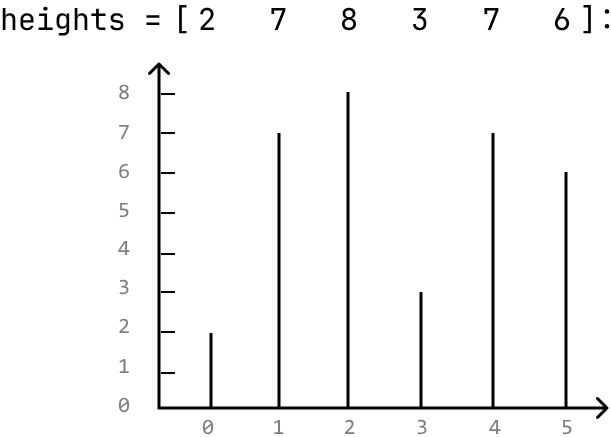

The widest container can store an area of water equal to `10`. Since this is the largest container we've found so far, let's set `max_water` to `10`.

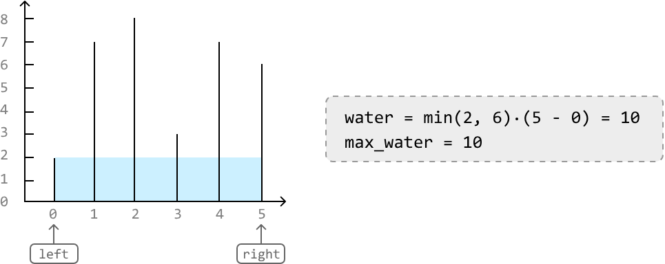

How should we proceed? Moving either pointer inward yields a container with a shorter width. This leaves height as the determining factor. In this case, the left line is shorter than the right line, which means that the left line limits the water's height. Therefore, to find a larger container, let's move the left pointer inward:

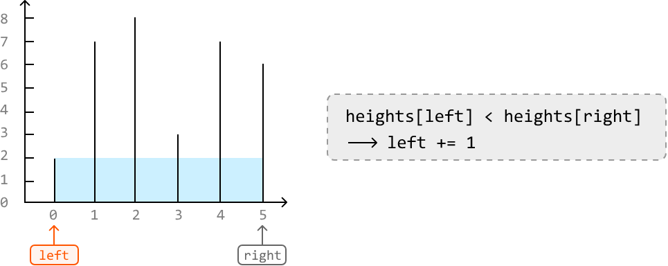

The current container can hold `24` units of water, the largest amount so far. So, let's update `max_water` to `24`. Here, the right line is shorter, limiting the water's height. To find a larger container, move the right pointer inward:

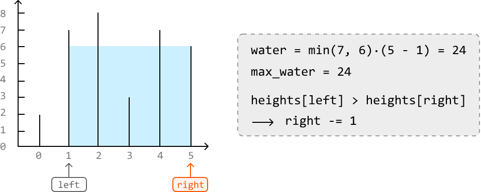

After this, we encounter a situation where the height of the left and right lines are equal. In this situation, which pointer should we move inward? Well, regardless of which one, the next container is guaranteed to store less water than the current one. Let's try to understand why.

Moving either pointer inward yields a container of shorter width, leaving height as the determining factor. However, regardless of which pointer we move inward, the other pointer remains at the same line. So, even if a pointer is moved to a taller line, the other pointer will restrict the height of the water, as we take the minimum of the two lines.

Therefore, since we can't increase height by moving just one pointer, we can just move both pointers inward:

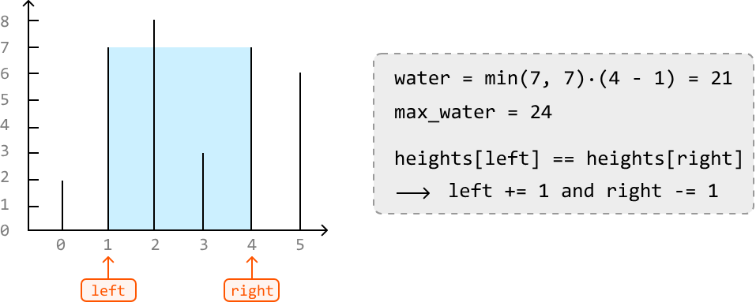

Now, the right line is limiting the height of the water. So, we move the right pointer inward:

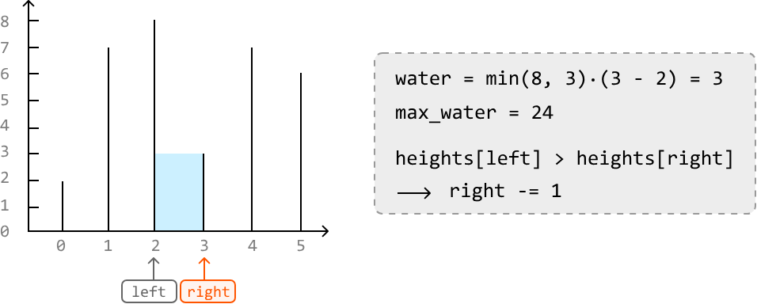

Finally, the left and right pointers meet. We can conclude our search here and return `max_water`:

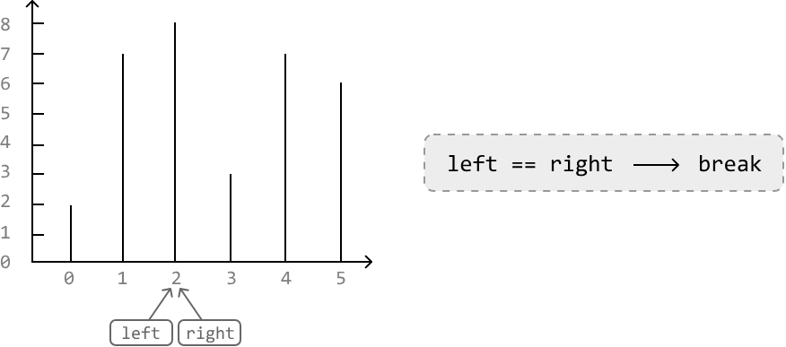

Based on the decisions taken in the example, we can summarize the logic:

- If the **left** line is smaller, move the **left** pointer inward.
- If the **right** line is smaller, move the **right** pointer inward.
- If both lines have the **same height**, move **both** pointers inward.

---

## Try it yourself

Write your solution to the problem before checking the reference implementation.

---

## Implementation
### Python
```python
from typing import List

def largest_container(heights: List[int]) -> int:
    max_water = 0
    left, right = 0, len(heights) - 1
    while (left < right):
        # Calculate the water contained between the current pair of lines.
        water = min(heights[left], heights[right]) * (right - left)
        max_water = max(max_water, water)
        # Move the pointers inward, always moving the pointer at the shorter line. If
        # both lines have the same height, move both pointers inward.
        if (heights[left] < heights[right]):
            left += 1
        elif (heights[left] > heights[right]):
            right -= 1
        else:
            left += 1
            right -= 1
    return max_water
```
### JavaScript
```javascript
export function largest_container(heights) {
  let maxWater = 0
  let left = 0
  let right = heights.length - 1
  while (left < right) {
    // Calculate the water contained between the current pair of lines.
    const water = Math.min(heights[left], heights[right]) * (right - left)
    maxWater = Math.max(maxWater, water)
    // Move the pointers inward, always moving the pointer at the shorter line. If
    // both lines have the same height, move both pointers inward.
    if (heights[left] < heights[right]) {
      left += 1
    } else if (heights[left] > heights[right]) {
      right -= 1
    } else {
      left += 1
      right -= 1
    }
  }
  return maxWater
}
```

### Java
```java
import java.util.ArrayList;

public class Main {
    public int largest_container(ArrayList<Integer> heights) {
        int max_water = 0;
        int left = 0, right = heights.size() - 1;
        while (left < right) {
            // Calculate the water contained between the current pair of lines.
            int water = Math.min(heights.get(left), heights.get(right)) * (right - left);
            max_water = Math.max(max_water, water);
            // Move the pointers inward, always moving the pointer at the shorter line. If
            // both lines have the same height, move both pointers inward.
            if (heights.get(left) < heights.get(right)) {
                left++;
            } else if (heights.get(left) > heights.get(right)) {
                right--;
            } else {
                left++;
                right--;
            }
        }
        return max_water;
    }
}
```
---

## Complexity Analysis

**Time complexity:** The time complexity of `largest_container` is O(n) because we perform approximately n iterations using the two-pointer technique.

**Space complexity:** We only allocated a constant number of variables, so the space complexity is O(1).

---

## Test Cases

In addition to the examples discussed throughout this explanation, below are some other examples to consider when testing your code.

| Input | Expected output | Description |
|---|---|---|
| `heights = []` | `0` | Tests an empty array. |
| `heights = [1]` | `0` | Tests an array with just one element. |
| `heights = [0, 1, 0]` | `0` | Tests an array with no containers that can contain water. |
| `heights = [3, 3, 3, 3]` | `9` | Tests an array where all heights are the same. |
| `heights = [1, 2, 3]` | `2` | Tests an array with strictly increasing heights. |
| `heights = [3, 2, 1]` | `2` | Tests an array with strictly decreasing heights. |


# Shift Zeros to the End

Given an array of integers, modify the array in place to move all zeros to the end while maintaining the relative order of non-zero elements.

**Example:**

```
Input:  nums = [0, 1, 0, 3, 2]
Output: [1, 3, 2, 0, 0]
```

---

## Intuition

This problem has three main requirements:

1. Move all zeros to the end of the array.
2. Maintain the relative order of the non-zero elements.
3. Perform the modification in place.

A naive approach to this problem is to build the output using a separate array (`temp`). We can add all non-zero elements from the left of `nums` to this temporary array and leave the rest of it as zeros. Then, we just set the input array equal to `temp`.

By identifying and moving the non-zero elements from the left side of the array first, we ensure their order is preserved when we add them to the output:

### Python
```python
def shift_zeros_to_the_end_naive(nums: List[int]) -> None:
    temp = [0] * len(nums)
    i = 0
    # Add all non-zero elements to the left of 'temp'.
    for num in nums:
        if num != 0:
            temp[i] = num
            i += 1
    # Set 'nums' to 'temp'.
    for j in range(len(nums)):
        nums[j] = temp[j]
```
### JavaScript
```javascript
export function shift_zeros_to_the_end_naive(nums) {
  const temp = new Array(nums.length).fill(0)
  let i = 0
  // Add all non-zero elements to the left of 'temp'.
  for (const num of nums) {
    if (num !== 0) {
      temp[i] = num
      i += 1
    }
  }
  // Set 'nums' to 'temp'.
  for (let j = 0; j < nums.length; j++) {
    nums[j] = temp[j]
  }
}
```

### Java
```java
import java.util.ArrayList;

class UserCode {
    public static void shiftZerosToTheEndNaive(ArrayList<Integer> nums) {
        ArrayList<Integer> temp = new ArrayList<>();
        // Add all non-zero elements to the left of 'temp'.
        for (int num : nums) {
            if (num != 0) {
                temp.add(num);
            }
        }
        // Fill the rest of 'temp' with zeros.
        while (temp.size() < nums.size()) {
            temp.add(0);
        }
        // Set 'nums' to 'temp'.
        for (int i = 0; i < nums.size(); i++) {
            nums.set(i, temp.get(i));
        }
    }
}
```

Unfortunately, this solution breaks the third requirement of modifying the input array in place.

However, there's still valuable insight to be gained from this approach. In particular, notice that this solution focuses on the non-zero elements instead of zeros. This means if we change our goal to move all non-zero elements to the left of the array, the zeros will consequently end up on the right. Therefore, we only need to focus on non-zero elements:

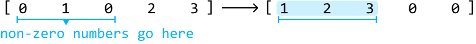

If there was a way to iterate over the above range of the array where the non-zero elements go, we could iteratively place each non-zero element in that range.

---

### Two pointers

We can use two pointers for this:

- A **left** pointer to iterate over the left of the array where the non-zero elements should be placed.
- A **right** pointer to find non-zero elements.

Consider the example below. Start by placing the `left` and `right` pointers at the start of the array. Before we move non-zero elements to the left, we need the `right` pointer to be pointing at a non-zero element. So, we ignore the zero at the first element and increment `right`:

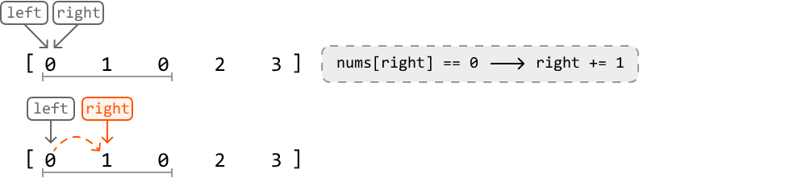

Remember, we only use the `left` pointer to keep track of where non-zero elements should be placed. So, until we find a non-zero element, we shouldn't move this pointer.

Now, the value at the `right` pointer is non-zero. Let's discuss how to handle this case.

**1. Swap the elements at `left` and `right`:** First, we'd like to move the element at the `right` pointer to the left of the array. So, we swap it with the element at the `left` pointer.

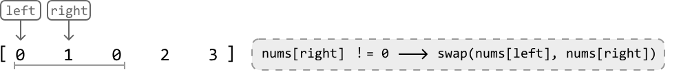

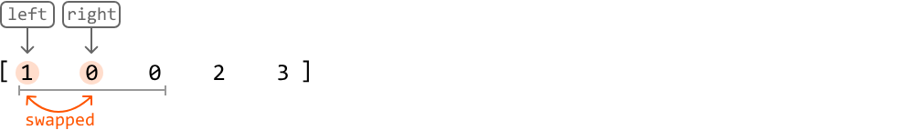

**2. Increment the pointers:**

- After the swap is complete, we should increment the `left` pointer to position it where the next non-zero element should go.
- Let's also increment the `right` pointer in search of the next non-zero element.

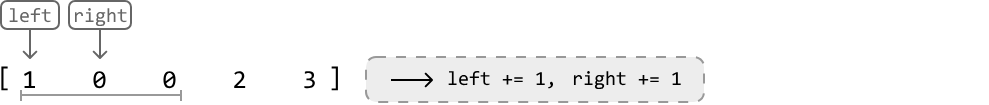 

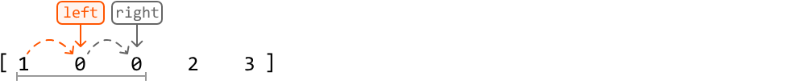

We can apply this logic to the rest of the array, incrementing the `right` pointer at each step to find the next non-zero element:

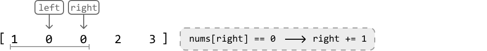

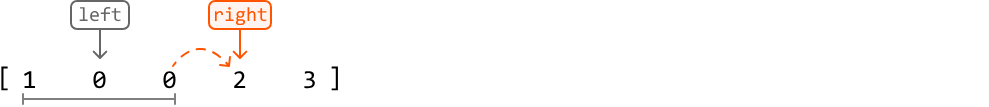

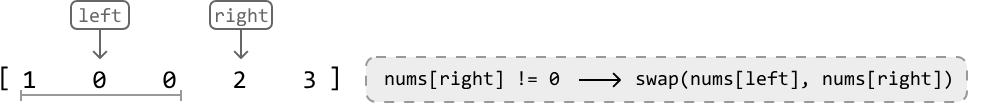

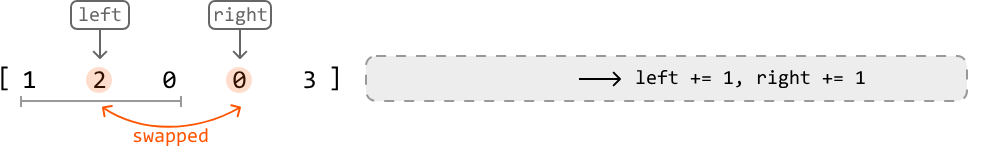

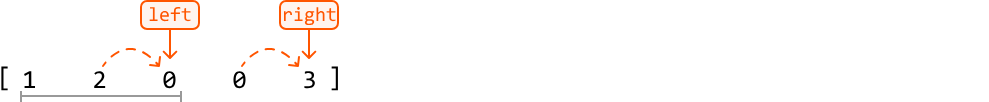

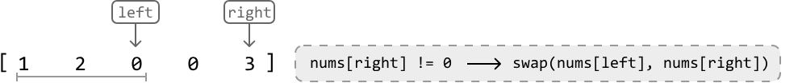


Once all swapping is done, all zeros will end up at the right end of the array as intended, without disturbing the order of the non-zero elements. The two-pointer strategy used in this problem is **unidirectional traversal**.

---

## Try it yourself

Write your solution to the problem before checking the reference implementation.

---

## Implementation

You might have noticed that we always move the `right` pointer forward, regardless of whether it points to a zero or a non-zero. This allows us to use a `for`-loop to iterate the `right` pointer.

### Python
```python
def shift_zeros_to_the_end(nums: List[int]) -> None:
    # The 'left' pointer is used to position non-zero elements.
    left = 0
    # Iterate through the array using a 'right' pointer to locate non-zero
    # elements.
    for right in range(len(nums)):
        if nums[right] != 0:
            if right != left:
                nums[left], nums[right] = nums[right], nums[left]
            # Increment 'left' since it now points to a position already occupied
            # by a non-zero element.
            left += 1
```

### JavaScript
```javascript
export function shift_zeros_to_the_end(nums) {
  // The 'left' pointer is used to position non-zero elements.
  let left = 0
  // Iterate through the array using a 'right' pointer to locate non-zero
  // elements.
  for (let right = 0; right < nums.length; right++) {
    if (nums[right] !== 0) {
      if (right !== left) {
        // Swap elements at left and right positions
        ;[nums[left], nums[right]] = [nums[right], nums[left]]
      }
      // Increment 'left' since it now points to a position already occupied
      // by a non-zero element.
      left += 1
    }
  }
}
```

### Java
```java
import java.util.ArrayList;

class UserCode {
    public static void shiftZerosToTheEnd(ArrayList<Integer> nums) {
        // The 'left' pointer is used to position non-zero elements.
        int left = 0;
        // Iterate through the array using a 'right' pointer to locate non-zero
        // elements.
        for (int right = 0; right < nums.size(); right++) {
            if (nums.get(right) != 0) {
                if (right != left) {
                    // Swap nums[left] and nums[right].
                    int temp = nums.get(left);
                    nums.set(left, nums.get(right));
                    nums.set(right, temp);
                }
            // Increment 'left' since it now points to a position already occupied
            // by a non-zero element.
            left++;
            }
        }
    }
}
```
---

## Complexity Analysis

**Time complexity:** The time complexity of `shift_zeros_to_the_end` is O(n), where n denotes the length of the array. This is because we iterate through the input array once.

**Space complexity:** The space complexity is O(1) because shifting is done in place.

---

## Test Cases

In addition to the examples discussed, below are more examples to consider when testing your code.

| Input | Expected output | Description |
|---|---|---|
| `nums = []` | `[]` | Tests an empty array. |
| `nums = [0]` | `[0]` | Tests an array with one 0. |
| `nums = [1]` | `[1]` | Tests an array with one 1. |
| `nums = [0, 0, 0]` | `[0, 0, 0]` | Tests an array with all 0s. |
| `nums = [1, 3, 2]` | `[1, 3, 2]` | Tests an array with all non-zeros. |
| `nums = [1, 1, 1, 0, 0]` | `[1, 1, 1, 0, 0]` | Tests an array with all zeros already at the end. |
| `nums = [0, 0, 1, 1, 1]` | `[1, 1, 1, 0, 0]` | Tests an array with all zeros at the start. |


# Next Lexicographical Sequence

Given a string of lowercase English letters, rearrange the characters to form a new string representing the next immediate sequence in lexicographical (alphabetical) order. If the given string is already last in lexicographical order among all possible arrangements, return the arrangement that's first in lexicographical order.

**Example 1:**
```
Input:  s = 'abcd'
Output: 'abdc'
Explanation: "abdc" is the next sequence in lexicographical order after rearranging "abcd".
```

**Example 2:**
```
Input:  s = 'dcba'
Output: 'abcd'
Explanation: Since "dcba" is the last sequence in lexicographical order, we return the first sequence: "abcd".
```

**Constraints:**
- The string contains at least one character.

---

## Intuition

Before devising a solution, let's first make sure we understand what the next lexicographical sequence of a string is.

An important detail is that a string's next lexicographical sequence is lexicographically larger than the original string. Consider the string "abc" and all its permutations in a lexicographically ordered sequence:


We can see the increasing order of the strings in the sequence when we translate each letter to its position in the alphabet:


From this, we also notice the next string in the sequence after "abc" is "acb", which is the first string larger than the original string:


This gives us some indication of what we need to find. The next lexicographical string:

- Incurs the smallest possible lexicographical increase from the original string.
- Uses the same letters as the original string.

### Identifying which characters to rearrange

Since our goal is to make the smallest possible increase, we need to somehow rearrange the characters on the right side of the string.

To understand why, imagine trying to "increase" a string's value. Increasing the rightmost letter causes the resulting string to be closer to the original string lexicographically than increasing the leftmost letter does:


Therefore, we should focus on rearranging characters on the right-hand side of the string first, if possible.

A key insight is that the last string in a lexicographical sequence (i.e., the largest permutation) will always follow a non-increasing order. We can see this with the string "abcc", for example, with its largest possible permutation being "ccba":


How does this help us? We know we need to rearrange the characters on the right of the string, but we don't know how many to rearrange. From now on, let's refer to the rightmost characters that should be rearranged as the **suffix**.

Take the string "abcedda" as an example. We traverse it from right to left with the goal of finding the shortest suffix that can be rearranged to form a larger permutation. The last 4 characters form a non-increasing suffix, and cannot be rearranged to make the string larger:


However, the next character, `'c'`, breaks the non-increasing sequence:


Let's call this character the **pivot**:


If no pivot is found, it means the string is already the last lexicographical sequence. In this case, we need to obtain its first lexicographical permutation as the problem states. This can be done by reversing the string:


### Rearranging characters

Having identified the shortest suffix to rearrange, the next objective is to rearrange this suffix to make the smallest increase possible. We have to start the rearrangement at the pivot since the rest of the suffix is already arranged in its largest permutation.

To make the character at the pivot position larger, we'd need to swap the pivot with a character larger than it on the right.

In our example, which character should our pivot (`'c'`) swap with? We want to swap it with a character larger than `'c'`, but not too much larger because the increase should be as small as possible. Let's figure out how we find such a character.

Since the substring after the pivot is lexicographically non-increasing, we can find the closest character larger than `'c'` by traversing this suffix from right to left and stopping at the first character larger than it. In other words, we're finding the **rightmost successor** to the pivot, which is `'d'`:


Now, we swap the pivot and the rightmost successor:


The character at the pivot has increased, so to get the next permutation, we should make the substring after the pivot as small as possible. After the swap shown above, we see that substring "edca" is not at its smallest permutation. So, we need to minimize the permutation of this substring.

An important observation is that after the previous swap, the substring after the pivot is still lexicographically non-increasing:


This means we can minimize this substring's permutation by reversing it:


And just like that, we found the next lexicographical sequence! The two-pointer strategy used in this problem is **staged traversal**, where we first identify the pivot, and then identify the rightmost successor relative to it.

Many steps are involved in identifying the next lexicographical sequence. So, here's a summary:

1. **Locate the pivot.**
   - The pivot is the first character that breaks the non-increasing sequence from the right of the string.
   - If no pivot is found, the string is already at its last lexicographical sequence, and the result is just the reverse of the string.
2. **Find the rightmost successor to the pivot.**
3. **Swap the rightmost successor with the pivot** to increase the lexicographical order of the suffix.
4. **Reverse the suffix after the pivot** to minimize its permutation.

---

## Try it yourself

Write your solution to the problem before checking the reference implementation.

---

## Implementation
### Python
```python
def next_lexicographical_sequence(s: str) -> str:
    letters = list(s)
    # Locate the pivot, which is the first character from the right that breaks
    # non-increasing order. Start searching from the second-to-last position.
    pivot = len(letters) - 2
    while pivot >= 0 and letters[pivot] >= letters[pivot + 1]:
        pivot -= 1
    # If pivot is not found, the string is already in its largest permutation. In
    # this case, reverse the string to obtain the smallest permutation.
    if pivot == -1:
        return ''.join(reversed(letters))
    # Find the rightmost successor to the pivot.
    rightmost_successor = len(letters) - 1
    while letters[rightmost_successor] <= letters[pivot]:
        rightmost_successor -= 1
    # Swap the rightmost successor with the pivot to increase the lexicographical
    # order of the suffix.
    letters[pivot], letters[rightmost_successor] = (letters[rightmost_successor], letters[pivot])
    # Reverse the suffix after the pivot to minimize its permutation.
    letters[pivot + 1:] = reversed(letters[pivot + 1:])
    return ''.join(letters)
```

### JavaScript
```javascript
export function next_lexicographical_sequence(s) {
  const letters = s.split('')
  // Locate the pivot, which is the first character from the right that breaks
  // non-increasing order. Start searching from the second-to-last position.
  let pivot = letters.length - 2
  while (pivot >= 0 && letters[pivot] >= letters[pivot + 1]) {
    pivot -= 1
  }
  // If pivot is not found, the string is already in its largest permutation. In
  // this case, reverse the string to obtain the smallest permutation.
  if (pivot === -1) {
    return letters.reverse().join('')
  }
  // Find the rightmost successor to the pivot.
  let rightmostSuccessor = letters.length - 1
  while (letters[rightmostSuccessor] <= letters[pivot]) {
    rightmostSuccessor -= 1
  }
  // Swap the rightmost successor with the pivot to increase the lexicographical
  // order of the suffix.
  ;[letters[pivot], letters[rightmostSuccessor]] = [
    letters[rightmostSuccessor],
    letters[pivot],
  ]
  // Reverse the suffix after the pivot to minimize its permutation.
  const suffix = letters.splice(pivot + 1).reverse()
  return letters.concat(suffix).join('')
}
```

### Java
```java
public class Main {
    public static String next_lexicographical_sequence(String s) {
        char[] letters = s.toCharArray();
        // Locate the pivot, which is the first character from the right that breaks
        // non-increasing order. Start searching from the second-to-last position.
        int pivot = letters.length - 2;
        while (pivot >= 0 && letters[pivot] >= letters[pivot + 1]) {
            pivot--;
        }
        // If pivot is not found, the string is already in its largest permutation. In
        // this case, reverse the string to obtain the smallest permutation.
        if (pivot == -1) {
            reverse(letters, 0, letters.length - 1);
            return new String(letters);
        }
        // Find the rightmost successor to the pivot.
        int rightmostSuccessor = letters.length - 1;
        while (letters[rightmostSuccessor] <= letters[pivot]) {
            rightmostSuccessor--;
        }
        // Swap the rightmost successor with the pivot to increase the lexicographical
        // order of the suffix.
        char temp = letters[pivot];
        letters[pivot] = letters[rightmostSuccessor];
        letters[rightmostSuccessor] = temp;
        // Reverse the suffix after the pivot to minimize its permutation.
        reverse(letters, pivot + 1, letters.length - 1);
        return new String(letters);
    }

    private static void reverse(char[] arr, int left, int right) {
        while (left < right) {
            char temp = arr[left];
            arr[left] = arr[right];
            arr[right] = temp;
            left++;
            right--;
        }
    }
}
```

---

## Complexity Analysis

**Time complexity:** The time complexity of `next_lexicographical_sequence` is O(n), where n denotes the length of the input string. This is because we perform a maximum of two iterations across the string: one to find the pivot and another to find the rightmost character in the suffix that's greater in value than the pivot. We also perform one reversal, which takes O(n) time.

**Space complexity:** The space complexity is O(n) due to the space taken up by the `letters` list. In Python, this additional space is used because strings are immutable, which necessitates storing the input string as a list.

---

## Test Cases

In addition to the examples discussed, below are more examples to consider when testing your code.

| Input | Expected output | Description |
|---|---|---|
| `s = 'a'` | `'a'` | Tests a string with a single character. |
| `s = 'aaaa'` | `'aaaa'` | Tests a string with a repeated character. |
| `s = 'ynitsed'` | `'ynsdeit'` | Tests a string with a random pivot character. |

---

## Interview Tip

**Tip: Be precise with your language.** It's crucial to be precise with your choice of words during an interview, especially for technical descriptions. For instance, in this problem, we use "non-increasing" instead of "decreasing," as "decreasing" implies each term is strictly smaller than the previous one, which isn't true in this case since adjacent characters can be equal.