# 02. Hash Maps and Sets

1. [Introduction to Hash Maps and Sets](#introduction-to-hash-maps-and-sets)
2. [Pair Sum - Unsorted](#pair-sum---unsorted)
3. [Verify Sudoku Board](#verify-sudoku-board)
4. [Zero Striping](#zero-striping)
5. [Longest Chain of Consecutive Numbers](#longest-chain-of-consecutive-numbers)
6. [Geometric Sequence Triplets](#geometric-sequence-triplets)

---

# Introduction to Hash Maps and Sets

## Intuition

Picture working in a grocery store. A customer asks for the price of a fruit. If you just have a paper list of all the fruits, you would need to look through it to find the specific fruit, which can be time-consuming. However, by memorizing the list, you can know the prices of all fruits instantly, enabling you to promptly give the correct price to the customer. This is similar to how hash maps work, enabling quick access to information.

## Hash Maps

A hash map – also known as a hash table or dictionary, depending on the language – is a data structure that pairs keys with values. For example, a fruit price lookup:

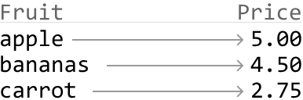

Having a mental map of fruit prices is conceptually similar to being able to instantly access fruit prices using a hash map, where the fruit name is the key, and its price is the value. When we look up a price using the fruit's name as the key, the hash map will immediately return its price.
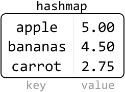
Hash maps are incredibly efficient for lookups, insertions, and deletions, as they typically perform these operations in constant time: **O(1)**. They are one of the most versatile, widely-used data structures in computer science, used for tasks such as counting the frequency of elements, caching data, and more.

### Properties of Hash Maps

- Data is stored in the form of key-value pairs.
- Hash maps don't store duplicates. Every key in a hash map is unique, ensuring each value can be distinctly identified and accessed.
- Hash maps are unordered data structures, meaning keys are not stored in any specific order.

### Time Complexity Breakdown

Below, *n* denotes the number of entries in the hash map.

| Operation | Average Case | Worst Case | Description |
|-----------|-------------|------------|-------------|
| Insert    | O(1)        | O(n)       | Add a key-value pair to the hash map. |
| Access    | O(1)        | O(n)       | Find or retrieve an element. |
| Delete    | O(1)        | O(n)       | Delete a key-value pair. |

In coding interviews, we generally consider hash map operations to have a fast average time complexity of **O(1)**, as opposed to their worst-case complexities. This is based on the assumption that an efficient hash function minimizes collisions. However, in the worst-case scenario where a poorly optimized hash function results in frequent collisions, the time complexity can deteriorate to **O(n)**, necessitating a linear search through all entries.

## Hash Sets

Hash sets are a simpler form of hash maps. Instead of storing key-value pairs, they store only the keys. Using the grocery store analogy, a hash set is like having a mental checklist of fruits without their prices. It's useful for quickly checking the presence or absence of an item, like checking whether a particular fruit is in stock.

## When to Use Hash Maps or Sets

Common use cases of **hash maps** include implementing dictionaries, counting frequencies, storing key-value pairs, and handling scenarios requiring quick lookups.

Common use cases of **hash sets** include storing unique elements, marking elements as used or visited, and checking for duplicates.

In the description of a problem, pay attention to keywords like *"frequency"*, *"unique"*, *"map"*, *"dictionary"*, or *"fast lookup"*, because these often indicate that hash maps or sets could be useful.

## Essential Concepts for Mastering Hash Maps and Sets

This chapter discusses the practical uses of hash maps and sets. For a more complete understanding of how they work and why they're so efficient, please explore topics that go beyond the scope of this chapter, such as:

- **Hash functions:** explore the intricacies of how keys are mapped to specific values in a hash table.
- **Collision and collision-handling techniques:** understand methods like chaining, or open addressing for resolving hash collisions.
- **Load factors and rehashing:** these make it easier to understand how hash tables grow and change size.

## Real-World Example

**Web browser cache:** Hash maps and sets are used everywhere in real-world systems. A classic example of hash maps in action is in caching systems within web browsers. When you visit a website, your browser stores data such as images, HTML, and CSS files in a cache so it can load much faster on future visits.

## Chapter Outline

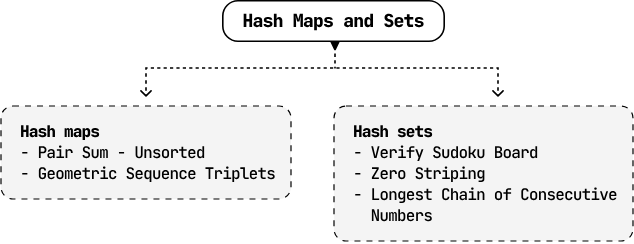

This chapter includes problems involving the most popular use cases of hash maps and sets, aiming to improve your understanding and effectiveness in utilizing them.

---

# Pair Sum - Unsorted

Given an array of integers, return the indexes of any two numbers that add up to a target. The order of the indexes in the result doesn't matter. If no pair is found, return an empty array.

**Example:**

```
Input: nums = [-1, 3, 4, 2], target = 3
Output: [0, 2]
Explanation: nums[0] + nums[2] = -1 + 4 = 3
```

**Constraints:** The same index cannot be used twice in the result.

## Intuition

A brute force approach is to iterate through every possible pair in the array to see if their sum is equal to the target. This has a time complexity of **O(n²)**, where *n* is the length of the array. We could also sort the array and then perform the two-pointer algorithm, which would take **O(n log(n))** time due to sorting. Let's see if we can find an even faster solution.

## Complement

We're asked to find a pair (x, y) such that `x + y == target`. An important observation is that if we know one of these numbers, we can easily calculate what the other number should be.

For each number `x` in `nums`, we need to find another number `y` such that `x + y = target`, or in other words, `y = target - x`. We can call this number the **complement** of `x`.

## Hash Map

A hash map works great because we can store and look up values in **O(1)** time. Each number and its index can be stored in the hash map as key-value pairs:

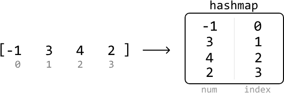
This allows us to retrieve the index of any number’s complement efficiently. Notice that duplicate numbers don’t need to be considered here since only one valid pair needs to be found.

The most intuitive way to incorporate a hash map is to:

1. In the first pass, populate the hash map with each number and its corresponding index.
2. In the second pass, scan through the array to check if each number's complement exists in the hash map. If it does, return the indexes of that number and its complement.

**Two-pass approach:**
### Python
```python
from typing import List

def pair_sum_unsorted_two_pass(nums: List[int], target: int) -> List[int]:
    num_map = {}
    # First pass: Populate the hash map with each number and its index.
    for i, num in enumerate(nums):
        num_map[num] = i
    # Second pass: Check for each number's complement in the hash map.
    for i, num in enumerate(nums):
        complement = target - num
        if complement in num_map and num_map[complement] != i:
            return [i, num_map[complement]]
    return []
```
### JavaScript
```javascript
export function pair_sum_unsorted_two_pass(nums, target) {
  const numMap = {}
  // First pass: Populate the hash map with each number and its index.
  for (let i = 0; i < nums.length; i++) {
    numMap[nums[i]] = i
  }
  // Second pass: Check for each number's complement in the hash map.
  for (let i = 0; i < nums.length; i++) {
    const complement = target - nums[i]
    if (complement in numMap && numMap[complement] !== i) {
      return [i, numMap[complement]]
    }
  }
  return []
}
```

### Java
```java
import java.util.ArrayList;
import java.util.HashMap;

public class Main {
    public ArrayList<Integer> pair_sum_unsorted_two_pass(ArrayList<Integer> nums, int target) {
        // First pass: Populate the hash map with each number and its index.
        HashMap<Integer, Integer> numMap = new HashMap<>();
        for (int i = 0; i < nums.size(); i++) {
            numMap.put(nums.get(i), i);
        }
        // Second pass: Check for each number's complement in the hash map.
        for (int i = 0; i < nums.size(); i++) {
            int complement = target - nums.get(i);
            if (numMap.containsKey(complement) && numMap.get(complement) != i) {
                ArrayList<Integer> result = new ArrayList<>();
                result.add(i);
                result.add(numMap.get(complement));
                return result;
            }
        }
        return new ArrayList<>();
    }
}
```

This algorithm requires two passes. A one-pass solution implies that we would need to populate the hash map while searching for complements. Is this possible? Consider the example below:
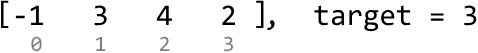
Start at index 0. Its complement would be 3 - (-1) = 4. Does our hash map have 4 in it? No, it's empty at the moment. So, let's add -1 and its index to the hash map:
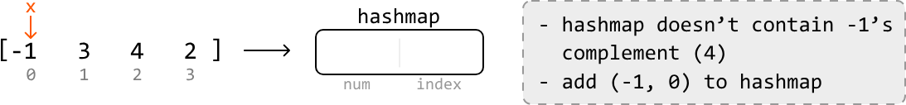
Next, let’s look at index 1. Its complement (0) does not exist in the hash map. So, just add 3 and its index to the hash map:
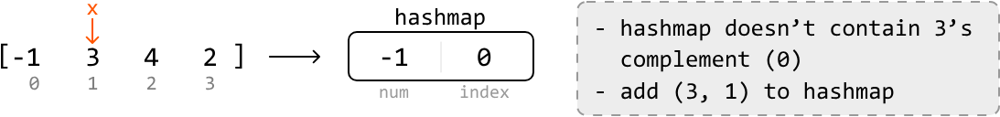
At index 2, we notice 4's complement (-1) exists in the hash map. This means we found a pair that sums to the target:
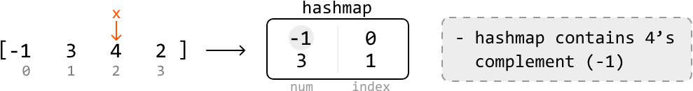
Now, we can return the indexes of the two values. Fetch the index of 4 from the input array and the index of its complement from the hash map:
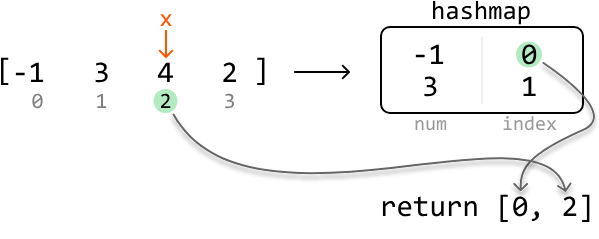

## Implementation
### Python
```python
from typing import List

def pair_sum_unsorted(nums: List[int], target: int) -> List[int]:
    hashmap = {}
    for i, x in enumerate(nums):
        if target - x in hashmap:
            return [hashmap[target - x], i]
        hashmap[x] = i
    return []
```
### JavaScript
```javascript
export function pair_sum_unsorted(nums, target) {
  const hashmap = {}
  for (let i = 0; i < nums.length; i++) {
    const x = nums[i]
    if (target - x in hashmap) {
      return [hashmap[target - x], i]
    }
    hashmap[x] = i
  }
  return []
}
```
### Java
```java
import java.util.ArrayList;
import java.util.HashMap;

public class Main {
    public ArrayList<Integer> pair_sum_unsorted(ArrayList<Integer> nums, int target) {
        HashMap<Integer, Integer> hashmap = new HashMap<>();
        for (int i = 0; i < nums.size(); i++) {
            int x = nums.get(i);
            if (hashmap.containsKey(target - x)) {
                ArrayList<Integer> result = new ArrayList<>();
                result.add(hashmap.get(target - x));
                result.add(i);
                return result;
            }
            hashmap.put(x, i);
        }
        return new ArrayList<>();
    }
}
```

## Complexity Analysis

- **Time complexity:** **O(n)** — we iterate through each element in the `nums` array once and perform constant-time hash map operations during each iteration.
- **Space complexity:** **O(n)** — the hash map can grow up to *n* in size.

> **Interview Tip — Iterate through solutions:** Don't always jump straight to the most optimal or clever solution, as this won't give the interviewer much insight into your problem-solving process. Consider multiple approaches, starting with the more straightforward ones, and gradually refine them.

---

# Verify Sudoku Board

Given a partially completed 9×9 Sudoku board, determine if the current state of the board adheres to the rules of the game:

- Each row and column must contain unique numbers between 1 and 9, or be empty (represented as 0).
- Each of the nine 3×3 subgrids that compose the grid must contain unique numbers between 1 and 9, or be empty.

> **Note:** You are asked to determine whether the current state of the board is valid given these rules, not whether the board is solvable.
### Example:
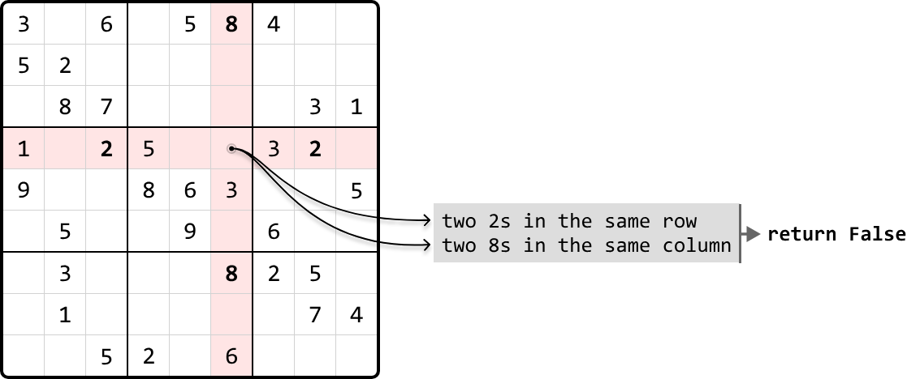
**Output:** `False`

**Constraints:** Assume each integer on the board falls in the range of [0, 9].

## Intuition

Our primary objective is to check every row, column, and each of the nine 3x3 subgrids, for any duplicate numbers. Let's first discuss the mechanism for finding duplicate elements, then look into how we can apply this to rows, columns, and subgrids.


### Checking for Duplicates
Let’s start by figuring out how to check for duplicates on a single row of the board:
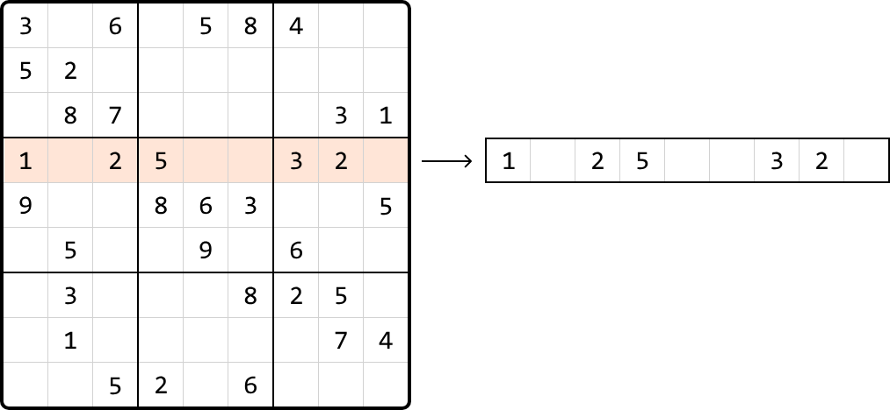

A naive way to check for duplicates in a row is to take each number and search the row again to see if it appears. Performing a linear search for each number results in **O(n²)** time complexity to check all numbers in one row, which is quite time consuming.

We can use a **hash set** to improve the time complexity. By using a hash set, we can keep track of which numbers were previously visited as we iterate through the row. When we encounter a new number, we can check if it's already in the set in **O(1)** time. If it is, then it's a duplicate.
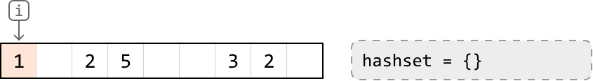
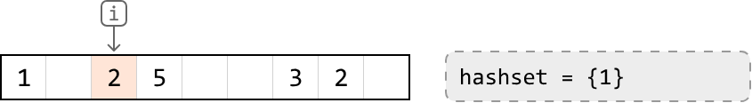
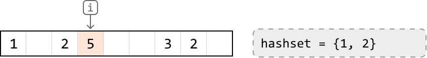
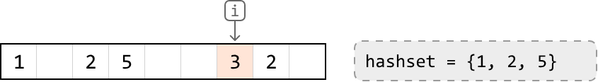
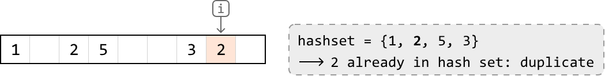
If we had a hash set for each of the 9 rows, we could keep track of duplicates in each row separately. We can do this for columns and subgrids as well, with one hash set for each column, and one hash set for each subgrid. The challenge here is determining which hash sets correspond to each cell's row, column, and subgrid, so we know which hash sets to reference:
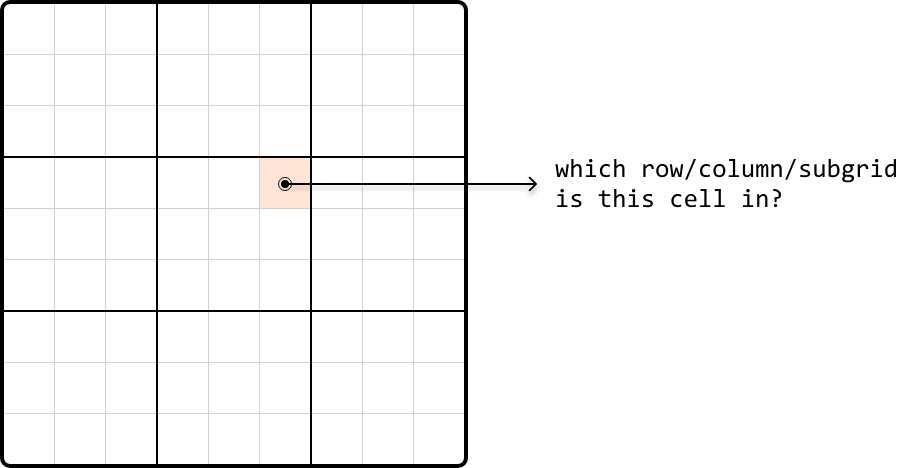
So, let’s discuss how we can identify a cell’s row, column, or subgrid.
### Identifying Rows and Columns

Identifying rows is straightforward because each row has an index. The same applies to columns. Therefore, we can create an array of 9 hash sets, one for each row, allowing us to access a row’s hash set directly by its index. Similarly, we can set up an array of hash sets for each column.


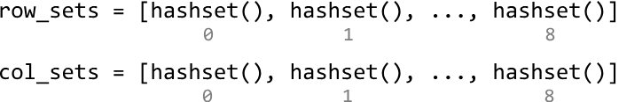

### Identifying Subgrids

Subgrids pose an interesting challenge because we can’t immediately identify which subgrid a cell belongs to, unlike the straightforward index-based identification for rows and columns.

That said, as with rows and columns, there are still only 9 subgrids. If we visualize the subgrids, we can see them displayed in a 3x3 grid:
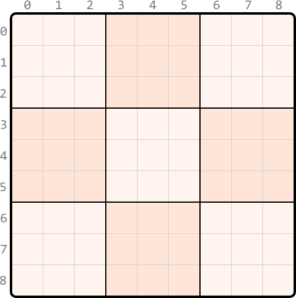
What we'd like is a way to index each of these subgrids as if indexing a 3x3 matrix. To do this, we require a method to convert the indexes ranging from 0 to 8 to the corresponding adjusted indexes from 0 to 2, as illustrated below:
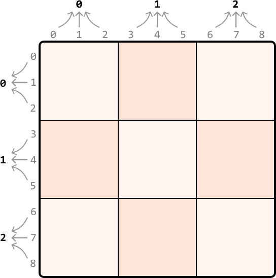
Since we got these adjusted indexes from shrinking a 9x9 grid to a 3x3 grid – which is effectively dividing the number of rows and columns by 3 – we can get the new subgrid row and column indexes by dividing by 3 (using integer division), as well:
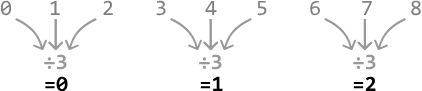

With these modified indexes, we can organize nine hash sets within a 3x3 table, one for each subgrid. Each cell in this table represents the corresponding subgrid in the above 3x3 representation. So, we can access the hash set of a subgrid at any cell by using our adjusted indexes `(i.e., subgrid_sets[r // 3][c // 3] (the // operator performs integer division).`

### One-Pass Sudoku Verification

We now have everything needed for a one-pass solution. We can start by initializing hash sets, 9 for each row, 9 for each column, and 9 for each subgrid, using a 3x3 array.

As we iterate through each cell in the grid, we check if a previously encountered number already exists in the current row, column, or subgrid, by querying the appropriate hash sets:
- If the number is in any of these hash sets → return `False`.
- Otherwise, add it to the corresponding row, column, and subgrid hash sets.

This process helps us keep track of numbers in each row, column, and subgrid. If we successfully iterate through the board without encountering any duplicates, it indicates the Sudoku board is valid. Therefore, we can return `True`.

## Implementation
###Python
```python
from typing import List

def verify_sudoku_board(board: List[List[int]]) -> bool:
    # Create hash sets for each row, column, and subgrid to keep track of numbers
    # previously seen on any given row, column, or subgrid.
    row_sets = [set() for _ in range(9)]
    column_sets = [set() for _ in range(9)]
    subgrid_sets = [[set() for _ in range(3)] for _ in range(3)]
    for r in range(9):
        for c in range(9):
            num = board[r][c]
            if num == 0:
                continue
            # Check if 'num' has been seen in the current row, column, or subgrid.
            if num in row_sets[r]:
                return False
            if num in column_sets[c]:
                return False
            if num in subgrid_sets[r // 3][c // 3]:
                return False
            # If we passed the above checks, mark this value as seen by adding it to
            # its corresponding hash sets.
            row_sets[r].add(num)
            column_sets[c].add(num)
            subgrid_sets[r // 3][c // 3].add(num)
    return True
```
### JavaScript
```javascript
export function verify_sudoku_board(board) {
  // Create hash sets for each row, column, and subgrid to keep track of numbers
  // previously seen on any given row, column, or subgrid.
  const rowSets = Array(9)
    .fill()
    .map(() => new Set())
  const columnSets = Array(9)
    .fill()
    .map(() => new Set())
  const subgridSets = Array(3)
    .fill()
    .map(() =>
      Array(3)
        .fill()
        .map(() => new Set())
    )
  for (let r = 0; r < 9; r++) {
    for (let c = 0; c < 9; c++) {
      const num = board[r][c]
      if (num === 0) {
        continue
      }
      // Check if 'num' has been seen in the current row, column, or subgrid.
      if (rowSets[r].has(num)) {
        return false
      }
      if (columnSets[c].has(num)) {
        return false
      }
      if (subgridSets[Math.floor(r / 3)][Math.floor(c / 3)].has(num)) {
        return false
      }
      // If we passed the above checks, mark this value as seen by adding it to
      // its corresponding hash sets.
      rowSets[r].add(num)
      columnSets[c].add(num)
      subgridSets[Math.floor(r / 3)][Math.floor(c / 3)].add(num)
    }
  }
  return true
}
```
### Java
```java
import java.util.ArrayList;
import java.util.HashSet;

public class Main {
    public boolean verify_sudoku_board(ArrayList<ArrayList<Integer>> board) {
        // Create hash sets for each row, column, and subgrid to keep track of numbers
        // previously seen on any given row, column, or subgrid.
        ArrayList<HashSet<Integer>> row_sets = new ArrayList<>();
        ArrayList<HashSet<Integer>> column_sets = new ArrayList<>();
        HashSet<Integer>[][] subgrid_sets = new HashSet[3][3];
        for (int i = 0; i < 9; i++) {
            row_sets.add(new HashSet<>());
            column_sets.add(new HashSet<>());
        }
        for (int i = 0; i < 3; i++) {
            for (int j = 0; j < 3; j++) {
                subgrid_sets[i][j] = new HashSet<>();
            }
        }
        for (int r = 0; r < 9; r++) {
            for (int c = 0; c < 9; c++) {
                int num = board.get(r).get(c);
                if (num == 0) {
                    continue;
                }
                // Check if 'num' has been seen in the current row, column, or subgrid.
                if (row_sets.get(r).contains(num)) {
                    return false;
                }
                if (column_sets.get(c).contains(num)) {
                    return false;
                }
                if (subgrid_sets[r / 3][c / 3].contains(num)) {
                    return false;
                }
                // If we passed the above checks, mark this value as seen by adding it to
                // its corresponding hash sets.
                row_sets.get(r).add(num);
                column_sets.get(c).add(num);
                subgrid_sets[r / 3][c / 3].add(num);
            }
        }
        return true;
    }
}
```
## Complexity Analysis

In this problem, the length of the board is fixed at 9, effectively reducing all approaches to a time and space complexity of **O(1)**. However, to better understand the efficiency of our algorithm in a broader context, let's use *n* to denote the board's length, allowing us to evaluate the algorithm's performance against arbitrary board sizes.
- **Time complexity:** The time complexity of verify_sudoku_board is **O(n²)** because we iterate through each cell in the board once, and perform constant-time hash set operations.

- **Space complexity:** The space complexity is **O(n²)** due to the row_sets, column_sets, and subgrid_sets arrays. Each array contains *n* hash sets, and each hash set is capable of growing to a size of *n*.
---

# Zero Striping

For each zero in an m × n matrix, set its entire row and column to zero in place.
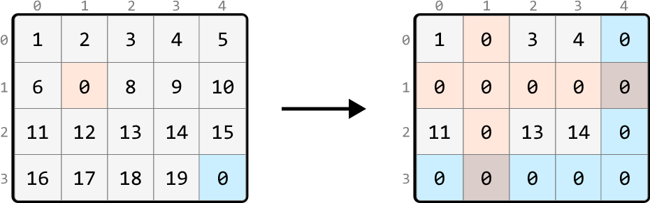
## Intuition — Hash Sets

A brute-force solution involves recording the positions of all 0s initially in the matrix and, for each of these 0s, iterating over their row and column to set them to zero. However, imagine an input array that's filled with many zeros. In the worst case, iterating over every row and column for each zero will take O(m⋅n(m+n)), where m⋅n denotes the number of 0s, and (m+n) represents the total number of cells in a row and column combined. This approach is quite inefficient, so let’s look for a better solution.

Imagine any cell in the matrix. After the matrix is transformed, this cell will either retain its original value, or become zero. Is there a way to tell if a cell is going to become zero?

The key observation is that if a cell is in a row or column containing a zero, that cell will become zero.

We could search a cell’s row and column to check if they contain a zero, meaning each search would take O(m+n) time. But it would be more efficient if we had a way to check this in constant time, and this is where hash sets would be useful. If we create two hash sets – one to track all the rows containing a zero and another to track all the columns containing a zero – we can determine if a specific cell's row or column contains a zero in O(1) time.

With these hash sets created, the next step is to populate them. As we iterate through the matrix, when encountering a cell containing zero, we:

- Add its row index to the row hash set (zero_rows).
- Add its column index to the column hash set (zero_cols).
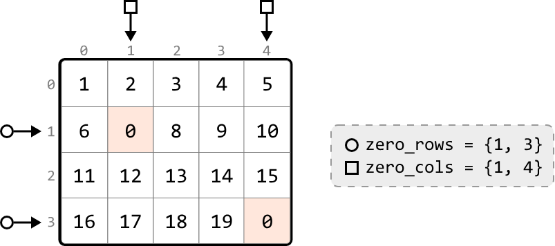
Next, we identify the cells whose row or column indexes are present in the respective hash sets, and change their values to zero. Let’s look at how this works with a few examples:
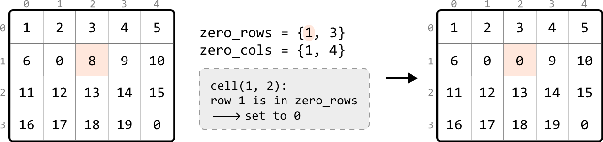
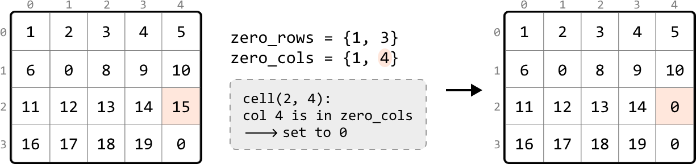
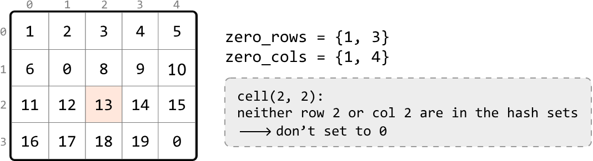
This provides a general strategy:

- In one pass of the matrix, identify each cell containing a zero and add its row and column indexes to the zero_rows and zero_cols hash sets, respectively.

- In a second pass, set any cell to zero if its row index is in zero_rows or its column index is in zero_cols.


## Implementation — Hash Sets
### Python
```python
from typing import List

def zero_striping_hash_sets(matrix: List[List[int]]) -> None:
    if not matrix or not matrix[0]:
        return
    m, n = len(matrix), len(matrix[0])
    zero_rows, zero_cols = set(), set()
    # Pass 1: Traverse through the matrix to identify the rows and columns
    # containing zeros and store their indexes in the appropriate hash sets.
    for r in range(m):
        for c in range(n):
            if matrix[r][c] == 0:
                zero_rows.add(r)
                zero_cols.add(c)
    # Pass 2: Set any cell in the matrix to zero if its row index is in 'zero_rows'
    # or its column index is in 'zero_cols'.
    for r in range(m):
        for c in range(n):
            if r in zero_rows or c in zero_cols:
                matrix[r][c] = 0
```
### JavaScript
```javascript
export function zero_striping_hash_sets(matrix) {
  if (!matrix || !matrix.length || !matrix[0].length) {
    return
  }
  const m = matrix.length
  const n = matrix[0].length
  const zeroRows = new Set()
  const zeroCols = new Set()
  // Pass 1: Traverse through the matrix to identify the rows and columns
  // containing zeros and store their indexes in the appropriate hash sets.
  for (let r = 0; r < m; r++) {
    for (let c = 0; c < n; c++) {
      if (matrix[r][c] === 0) {
        zeroRows.add(r)
        zeroCols.add(c)
      }
    }
  }
  // Pass 2: Set any cell in the matrix to zero if its row index is in 'zeroRows'
  // or its column index is in 'zeroCols'.
  for (let r = 0; r < m; r++) {
    for (let c = 0; c < n; c++) {
      if (zeroRows.has(r) || zeroCols.has(c)) {
        matrix[r][c] = 0
      }
    }
  }
}
```
**Complexity Analysis:**
- **Time complexity:** The time complexity of zero_striping_hash_sets is O(m⋅n) because we perform two passes over the matrix and perform constant-time operations in each pass.

- **Space complexity:** The space complexity is O(m+n) due to the growth of the hash sets used to track zeros: one hash set scales with the number of rows, and the other scales with the number of columns. In the worst case, every row and column has a zero.

## Intuition — In-place Zero Tracking

The previous solution was time efficient mainly due to the use of hash sets. However, this came at the cost of extra space used to store the hash set values. Is there an alternate way to keep track of which rows and columns contain a zero?

A key observation is that if a row or column contains a zero, all the cells in that row or column will be eventually replaced by zero. Therefore, there's no need to preserve the values in these rows or columns.

A strategy we can try is to use the first row and column (row 0 and column 0) as markers to track which rows and columns contain zeros.

To understand how this would work, consider the example below. For rows, we can use the first column to mark the rows that contain a zero. Specifically, this means if any cell in a row is zero, we set the corresponding cell in the first column to zero. This zero in the first column serves as a marker to indicate the entire row should eventually be set to zeros.

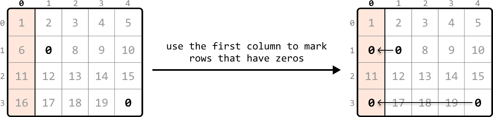
Similarly to how we marked rows, we can mark columns containing zeros using the first row:
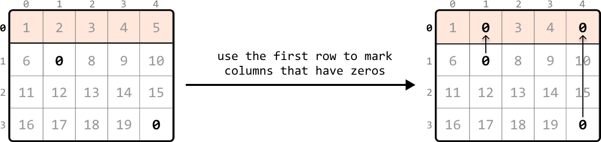
To set markers for the first row and first column, we can begin searching the rest of the matrix, excluding the first row and first column, for any zero-valued cells. Let’s refer to this part of the matrix as the ‘submatrix.’ When we find a zero, we set the corresponding cell in the first row and column to zero. Scanning every cell in the submatrix for zeros allows us to set markers in the first row and first column:
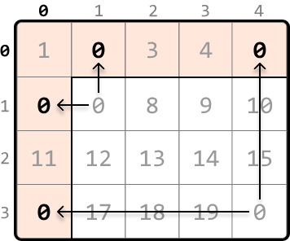
Now, we should start converting cells in the submatrix to zeros based on their corresponding markers. We can assess any cell in the submatrix by checking:

Whether its corresponding marker in the first column is zero.
Whether its corresponding marker in the first row is zero.
If either of these conditions are met, we should set that cell’s value to zero, as shown below:
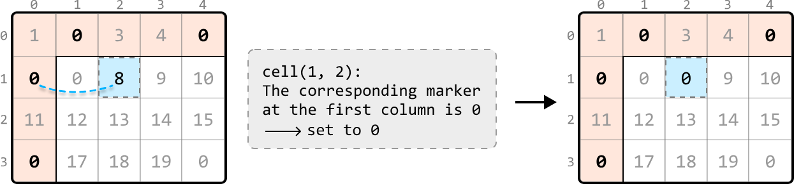
To update this submatrix, we can iterate from the second row and column and update cell values based on the logic we just mentioned:
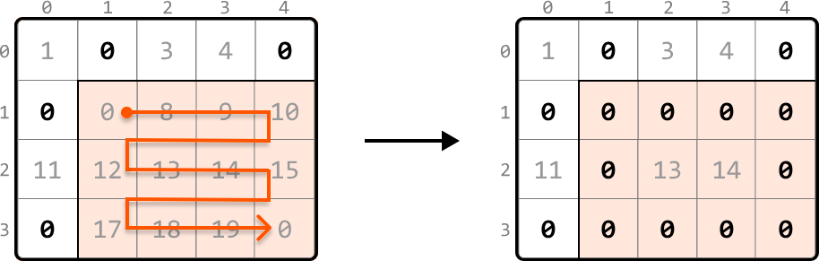
### Handling zeros in the first row and column
After completing the previous step, there’s just one issue to address. What if the first row or column originally had a zero, like in the example below?
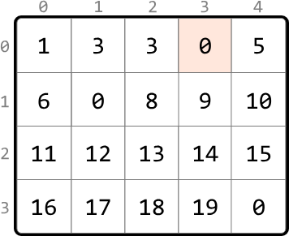
Here, we can’t distinguish which zero in the first row was originally present, or resulted from being used as a marker. This means we won’t know if the first row should be zeroed:
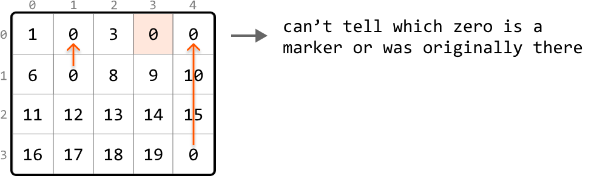
The remedy for this is to flag whether a zero exists in the first row or first column before using them as markers.
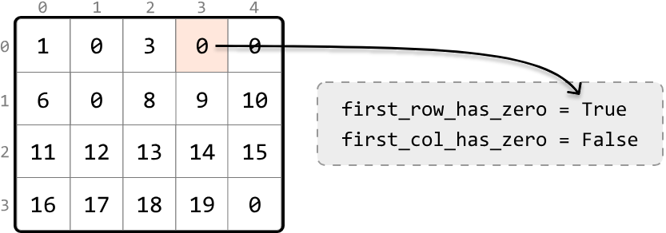
Once we've filled the first row and column with markers, as shown in matrix X below, and set the appropriate cell values in the submatrix to zero, as shown in matrix Y, we then evaluate the first row and column separately. The first row was initially marked as containing a zero, so we convert all cells in the first row to zero (matrix Z). The first column was not flagged for having a zero initially, so it remains unaltered at this step:
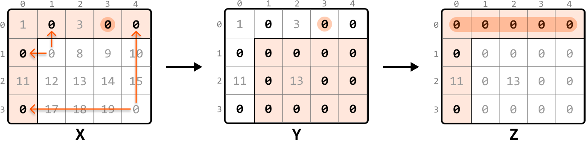

### In-place Zero-Marking Strategy

1. Use a flag to indicate if the first row initially contains any zero.

2. Use a flag to indicate if the first column initially contains any zero.

3. Traverse the submatrix, setting zeros in the first row and column to serve as markers for rows and columns that contain zeros.

4. Apply zeros based on markers: iterate through the submatrix that starts from the second row and second column. For each cell, check if its corresponding marker in the first row or column is marked with a zero. If so, set that element to zero.

5. If the first row was initially marked as containing a zero, set all elements in the first row to zero.

6. If the first column was initially marked as having a zero, set all elements in the first column to zero.

## Implementation — In-place Zero Tracking
### Python
```python
from typing import List

def zero_striping(matrix: List[List[int]]) -> None:
    if not matrix or not matrix[0]:
        return
    m, n = len(matrix), len(matrix[0])
    # Check if the first row initially contains a zero.
    first_row_has_zero = False
    for c in range(n):
        if matrix[0][c] == 0:
            first_row_has_zero = True
            break
    # Check if the first column initially contains a zero.
    first_col_has_zero = False
    for r in range(m):
        if matrix[r][0] == 0:
            first_col_has_zero = True
            break
    # Use the first row and column as markers. If an element in the submatrix is zero,
    # mark its corresponding row and column in the first row and column as 0.
    for r in range(1, m):
        for c in range(1, n):
            if matrix[r][c] == 0:
                matrix[0][c] = 0
                matrix[r][0] = 0
    # Update the submatrix using the markers in the first row and column.
    for r in range(1, m):
        for c in range(1, n):
            if matrix[0][c] == 0 or matrix[r][0] == 0:
                matrix[r][c] = 0
    # If the first row had a zero initially, set all elements in the first row to zero.
    if first_row_has_zero:
        for c in range(n):
            matrix[0][c] = 0
    # If the first column had a zero initially, set all elements in the first column to zero.
    if first_col_has_zero:
        for r in range(m):
            matrix[r][0] = 0
```
### JavaScript
```javascript
export function zero_striping(matrix) {
  if (!matrix || !matrix.length || !matrix[0].length) {
    return
  }
  const m = matrix.length
  const n = matrix[0].length
  // Check if the first row initially contains a zero.
  let firstRowHasZero = false
  for (let c = 0; c < n; c++) {
    if (matrix[0][c] === 0) {
      firstRowHasZero = true
      break
    }
  }
  // Check if the first column initially contains a zero.
  let firstColHasZero = false
  for (let r = 0; r < m; r++) {
    if (matrix[r][0] === 0) {
      firstColHasZero = true
      break
    }
  }
  // Use the first row and column as markers. If an element in the submatrix is zero,
  // mark its corresponding row and column in the first row and column as 0.
  for (let r = 1; r < m; r++) {
    for (let c = 1; c < n; c++) {
      if (matrix[r][c] === 0) {
        matrix[0][c] = 0
        matrix[r][0] = 0
      }
    }
  }
  // Update the submatrix using the markers in the first row and column.
  for (let r = 1; r < m; r++) {
    for (let c = 1; c < n; c++) {
      if (matrix[0][c] === 0 || matrix[r][0] === 0) {
        matrix[r][c] = 0
      }
    }
  }
  // If the first row had a zero initially, set all elements in the first row to
  // zero.
  if (firstRowHasZero) {
    for (let c = 0; c < n; c++) {
      matrix[0][c] = 0
    }
  }
  // If the first column had a zero initially, set all elements in the first column
  // to zero.
  if (firstColHasZero) {
    for (let r = 0; r < m; r++) {
      matrix[r][0] = 0
    }
  }
}
```
### Java
```java
import java.util.ArrayList;

class UserCode {
    public static void zeroStriping(ArrayList<ArrayList<Integer>> matrix) {
        if (matrix == null || matrix.size() == 0 || matrix.get(0).size() == 0) {
            return;
        }
        int m = matrix.size();
        int n = matrix.get(0).size();
        // Check if the first row initially contains a zero.
        boolean firstRowHasZero = false;
        for (int c = 0; c < n; c++) {
            if (matrix.get(0).get(c) == 0) {
                firstRowHasZero = true;
                break;
            }
        }
        // Check if the first column initially contains a zero.
        boolean firstColHasZero = false;
        for (int r = 0; r < m; r++) {
            if (matrix.get(r).get(0) == 0) {
                firstColHasZero = true;
                break;
            }
        }
        // Use the first row and column as markers. If an element in the submatrix is zero,
        // mark its corresponding row and column in the first row and column as 0.
        for (int r = 1; r < m; r++) {
            for (int c = 1; c < n; c++) {
                if (matrix.get(r).get(c) == 0) {
                    matrix.get(0).set(c, 0);
                    matrix.get(r).set(0, 0);
                }
            }
        }
        // Update the submatrix using the markers in the first row and column.
        for (int r = 1; r < m; r++) {
            for (int c = 1; c < n; c++) {
                if (matrix.get(0).get(c) == 0 || matrix.get(r).get(0) == 0) {
                    matrix.get(r).set(c, 0);
                }
            }
        }
        // If the first row had a zero initially, set all elements in the first row to zero.
        if (firstRowHasZero) {
            for (int c = 0; c < n; c++) {
                matrix.get(0).set(c, 0);
            }
        }
        // If the first column had a zero initially, set all elements in the first column to zero.
        if (firstColHasZero) {
            for (int r = 0; r < m; r++) {
                matrix.get(r).set(0, 0);
            }
        }
    }
}
```
**Complexity Analysis:**
**Time complexity:** The time complexity of zero_striping is O(m⋅n). Here’s why:

- Checking the first row for zeros takes O(m) time, and checking the first column takes O(n) time.
- Then, we perform two passes of the entire matrix, one to mark 0s and another to update the matrix based on those markers. Each pass takes O(m⋅n) time.
- Finally, we iterate through the first row and first column up to once each, which takes O(m) and O(n) time, respectively.
Therefore, the overall time complexity is O(m)+O(n)+O(m⋅n)=O(m⋅n).

**Space complexity:** The space complexity is O(1) because we use the first row and column as markers to track which rows and columns contain zeros, instead of using auxiliary data structures.


---

# Longest Chain of Consecutive Numbers

Find the longest chain of consecutive numbers in an array. Two numbers are consecutive if they have a difference of 1.

**Example:**

```
Input: nums = [1, 6, 2, 5, 8, 7, 10, 3]
Output: 4
Explanation: The longest chain of consecutive numbers is 5, 6, 7, 8.
```

## Intuition

A naive approach to this problem is to sort the array. When all numbers are arranged in ascending order, consecutive numbers will be placed next to each other. This allows us to iterate through the array to identify the longest sequence of consecutive numbers.

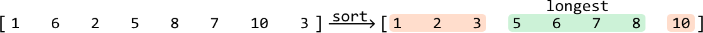

This approach requires sorting, which takes O(nlog(n)) time, where n denotes the length of the array. Let’s see how we could do better.

It’s important to understand that every number in the array can represent the start of some consecutive chain. One approach is to treat each number as the start of a chain and search through the array to identify the rest of its chain.

To do this, we can leverage the fact that for any number num, its next consecutive number will be num + 1. This means we’ll always know which number to look for when trying to find the next number in a sequence. The code snippet for this approach is provided below:

### Python
```python
from typing import List

def longest_chain_of_consecutive_numbers_brute_force(nums: List[int]) -> int:
    if not nums:
        return 0
    longest_chain = 0
    # Look for chains of consecutive numbers that start from each number.
    for num in nums:
        current_num = num
        current_chain = 1
        # Continue to find the next consecutive numbers in the chain.
        while (current_num + 1) in nums:
            current_num += 1
            current_chain += 1
        longest_chain = max(longest_chain, current_chain)
    return longest_chain
```
### JavaScript
```javascript
export function longest_chain_of_consecutive_numbers_brute_force(nums) {
  if (!nums || nums.length === 0) {
    return 0
  }
  let longestChain = 0
  // Look for chains of consecutive numbers that start from each number.
  for (const num of nums) {
    let currentNum = num
    let currentChain = 1
    // Continue to find the next consecutive numbers in the chain.
    while (nums.includes(currentNum + 1)) {
      currentNum += 1
      currentChain += 1
    }
    longestChain = Math.max(longestChain, currentChain)
  }
  return longestChain
}
```
### Java
```java
import java.util.ArrayList;

public class Main {
    public int longest_chain_of_consecutive_numbers_brute_force(ArrayList<Integer> nums) {
        if (nums == null || nums.size() == 0) {
            return 0;
        }
        int longestChain = 0;
        // Look for chains of consecutive numbers that start from each number.
        for (int num : nums) {
            int currentNum = num;
            int currentChain = 1;
            // Continue to find the next consecutive numbers in the chain.
            while (nums.contains(currentNum + 1)) {
                currentNum += 1;
                currentChain += 1;
            }
            longestChain = Math.max(longestChain, currentChain);
        }
        return longestChain;
    }
}
```
This brute force takes **O(n³)** time because of the nested operations involved:
- The outer for-loop iterates through each element, which takes O(n) time.

- For each element, the inner while-loop can potentially run up to n iterations if there is a long consecutive sequence starting from the current number.

- For each, while-loop iteration, an O(n) check is performed to see if the next consecutive number exists in the array.

This is slower than the sorting approach, but we can make a couple of optimizations to improve the time complexity. Let’s discuss these.

### Optimization — Hash Set

To find the next number in a sequence, we perform a linear search through the array. However, by storing all the numbers in a hash set, we can instead query this hash set in constant time to check if a number exists.

This reduces the time complexity from **O(n³)** to **O(n²)**.

### Optimization — Identifying the Start of Each Chain

In the brute force approach, we treat each number as the start of a chain. This becomes quite expensive because we perform a linear search for every number to find the rest of its chain:
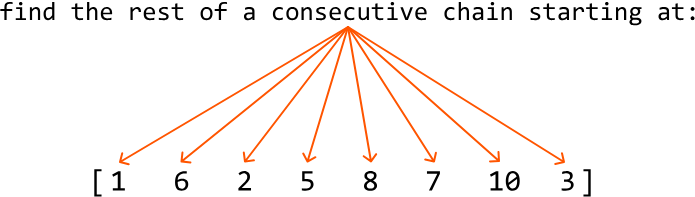
The key observation here is that we don’t need to perform this search for every number in a chain. Instead, we only need to perform it for the smallest number in each chain since this number identifies the start of its chain:
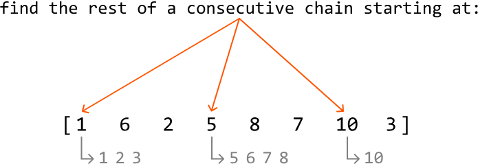
We can determine if a number is the smallest number in its chain by checking the array doesn’t contain the number that precedes it (curr_num - 1). We can also use the hash set for this check.
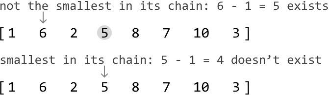
This reduces the time complexity from **O(n²)** to **O(n)**, as now every chain is searched through only once. This is explained in more detail in the complexity analysis.


## Implementation
### Python
```python
from typing import List

def longest_chain_of_consecutive_numbers(nums: List[int]) -> int:
    if not nums:
        return 0
    num_set = set(nums)
    longest_chain = 0
    for num in num_set:
        # If the current number is the smallest number in its chain, search for
        # the length of its chain.
        if num - 1 not in num_set:
            current_num = num
            current_chain = 1
            # Continue to find the next consecutive numbers in the chain.
            while current_num + 1 in num_set:
                current_num += 1
                current_chain += 1
            longest_chain = max(longest_chain, current_chain)
    return longest_chain
```
### JavaScript
```javascript
export function longest_chain_of_consecutive_numbers(nums) {
  if (!nums || nums.length === 0) {
    return 0
  }
  // Convert array to a Set for O(1) lookups
  const numSet = new Set(nums)
  let longestChain = 0
  for (const num of numSet) {
    // If the current number is the smallest number in its chain, search for
    // the length of its chain.
    if (!numSet.has(num - 1)) {
      let currentNum = num
      let currentChain = 1
      // Continue to find the next consecutive numbers in the chain.
      while (numSet.has(currentNum + 1)) {
        currentNum += 1
        currentChain += 1
      }
      longestChain = Math.max(longestChain, currentChain)
    }
  }
  return longestChain
}
```
### Java
```java
import java.util.ArrayList;
import java.util.HashSet;

public class Main {
    public int longest_chain_of_consecutive_numbers(ArrayList<Integer> nums) {
        if (nums == null || nums.size() == 0) {
            return 0;
        }
        HashSet<Integer> numSet = new HashSet<>(nums);
        int longestChain = 0;
        for (int num : numSet) {
            // If the current number is the smallest number in its chain, search for
            // the length of its chain.
            if (!numSet.contains(num - 1)) {
                int currentNum = num;
                int currentChain = 1;
                // Continue to find the next consecutive numbers in the chain.
                while (numSet.contains(currentNum + 1)) {
                    currentNum += 1;
                    currentChain += 1;
                }
                longestChain = Math.max(longestChain, currentChain);
            }
        }
        return longestChain;
    }
}
```
## Complexity Analysis

- **Time complexity:** The time complexity of longest_chain_of_consecutive_numbers is O(n) because, although there are two loops, the inner loop is only executed when the current number is the start of a chain. This ensures that each chain is iterated through only once in the inner while-loop. Thus, the total number of iterations for both loops combined is O(n): the outer for-loop runs n times, and the inner while-loop runs a total of n times across all iterations, resulting in a combined time complexity of O(n+n)=O(n).

- **Space complexity:** The space complexity is O(n) since the hash set stores each unique number from the array.

---

# Geometric Sequence Triplets

A geometric sequence triplet is a sequence of three numbers where each successive number is obtained by multiplying the preceding number by a constant called the **common ratio**.

Let's examine three triplets to understand how this works:

1. **(1, 2, 4)**  
   This is a geometric sequence with a ratio of \(2\).  
   Explanation:  
   (i.e., [1, 1⋅\(2\) = 2, 2⋅\(2\) = 4]).

2. **(5, 15, 45)**  
   This is a geometric sequence with a ratio of \(3\).  
   Explanation:  
   (i.e., [5, 5⋅\(3\) = 15, 15⋅\(3\)= 45]).

3. **(2, 3, 4)**  
   This is **not** a geometric sequence.

Given an array of integers and a common ratio `r`, find all triplets of indexes (i, j, k) that follow a geometric sequence for `i < j < k`. It's possible to encounter duplicate triplets in the array.

**Example:**
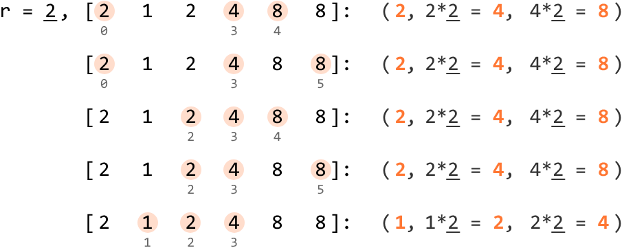
```
Input: nums = [2, 1, 2, 4, 8, 8], r = 2
Output: 5
Explanation:
  Triplet [2, 4, 8] occurs at indexes (0, 3, 4), (0, 3, 5), (2, 3, 4), (2, 3, 5).
  Triplet [1, 2, 4] occurs at indexes (1, 2, 3).
```

## Intuition

For a triplet to form a geometric sequence, it has to adhere to two main rules:

It consists of three values that follow a geometric sequence with a common ratio r.

The three values forming the triplet must appear in the same order within the array as they do in the geometric sequence. This means for a geometric triplet (nums[i], nums[j], nums[k]), the indexes must follow the order i < j < k.

How can we represent a geometric sequence so that it follows rule 1? Let’s say the first number is x. The second number is the first number multiplied by r (i.e., x⋅r), and the third is the second number multiplied by r (i.e., x⋅r⋅r = x⋅r^2). So, a triplet in a geometric sequence can be represented as (x, x⋅r, x⋅r^2).

A brute force approach is to iterate over every possible triplet in the array and check if any of these triplets follow a geometric progression. However, it would take three nested for-loops to search through all the triplets, resulting in a time complexity of **O(n³)** where n denotes the length of the input array. Can we do better?

An important observation here is that if we know one value of a triplet, we can calculate what the other two values should be.

This is because all three values are related by the common ratio r. So, for any number x in the array, we just need to find the values x⋅r and x⋅r^2 to form a geometric triplet (x, x⋅r, x⋅r^2). However, we could run into issues when using this triplet representation. While it’s clear the values x⋅r and x⋅r^2 must be positioned to the right of x, we have to be careful since the order of these values matters: we don’t want to accidentally identify a triplet such as (x, x⋅r^2, x⋅r), which is invalid:
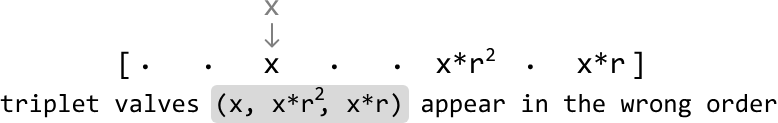
We can work around this issue by using the (x/r, x, x⋅r) triplet representation, which allows us to always maintain order by looking for x/r to the left of x and x⋅r to the right:
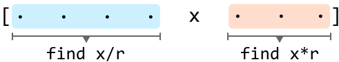
One way we can find the x/r and x⋅r values is by linearly searching through the left and right subarrays. This linear search would need to be done for each number in the array, resulting in an **O(n²)** time complexity. While this is an improvement from the brute force solution, it would be great if we had a way to find those values faster.


## Hash Maps

A hash map would be a great way to solve this problem, as it allows us to query specific values in constant time.

What we would need are two hash maps:

- A hash map that contains numbers to the left of each x (left_map).
- A hash map that contains numbers to the right of each x (right_map).
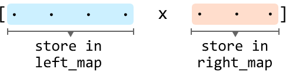

Hash maps allow us to query for both x/r in the left hash map and query for x⋅r in the right hash map in constant time on average. Note that a hash map would be preferred over a hash set because hash maps can also store the frequency of each value it stores. This is crucial since the array might contain duplicates, and we need to know the frequency of each value to accurately identify all possible triplets.


### Finding All (x/r, x, x·r) Triplets

Our goal is to find all triplets that follow a geometric sequence, representing each number in the array as the middle (x) number of a triplet.

Before we find a triplet’s x/r value, we need to check if x is divisible by r. If it’s not, it’s impossible to form a triplet from the current value of x. Otherwise, we can proceed to look for the triplet.

For any element x, there could be multiple instances of x/r in left_map and multiple instances of x⋅r in right_map, implying that multiple triplets can be formed using x as the middle value. So, to get the total number of triplets that can be formed with x in the middle, multiply the frequencies of x⋅r and x/r:
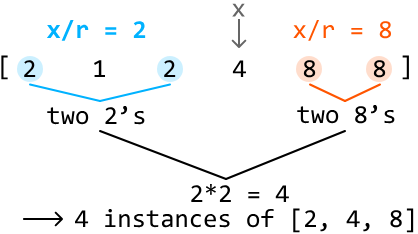
This overall methodology can be summarized in the following steps:
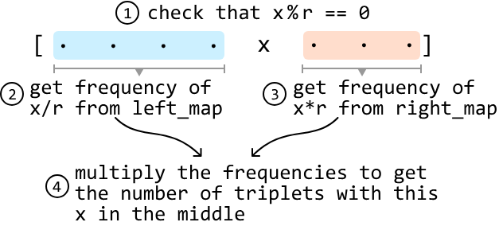
Note that if either x/r or x⋅r are not found in their hash maps, their frequency is 0 by default.

Let’s implement this strategy using the example below:
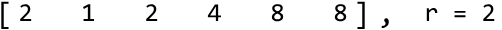
To ensure the hash maps always contain the correct values, we’d need to incorporate a dynamic strategy that involves updating the hash maps as we go because the values in both hash maps will be different depending on the position of x in the array.

Since we're traversing the array from left to right, we should initially fill the right hash map with all values in the array. This is because, before the start of the iteration, every element is a potential candidate for x⋅r. Meanwhile, the left hash map is initially empty because there are no preceding elements to consider as potential x/r values:
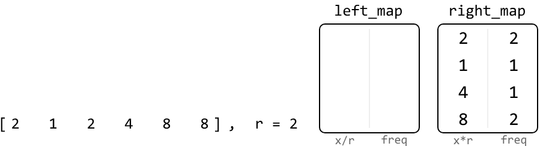
Now let’s look for triplets. Start by representing the first value as the middle value (x) of a triplet.

First, let’s update right_map. We should remove the current value (2) from right_map since this 2 is not to the right of itself. There are two 2’s in right_map, so let’s reduce its frequency to 1:
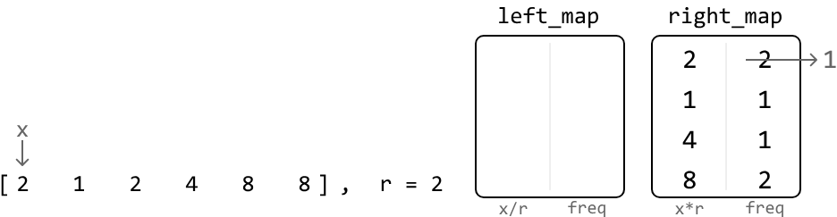
Next, check if x/r is an integer. In this case, it is, so let’s find the number of triplets with x as the middle number by multiplying the frequencies of x/r and x⋅r, which we can get from the respective hash maps. Since left_map doesn’t contain x/r at this point, its frequency is 0:
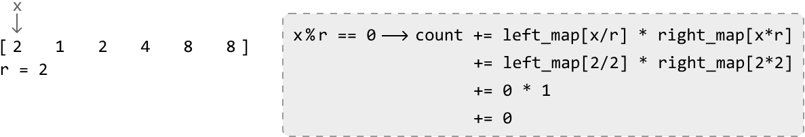
Before moving on to the next value, let’s add the current number to the left_map because it now becomes a potential x/r value for future triplets in the array:
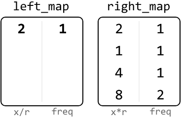
Repeating this process for the rest of the array allows us to find all geometric triplets with a ratio of r. To clarify, the hash maps in the upcoming diagrams represent their state at the current position of x in the array. This means that left_map includes values to the left of the current x, and the right_map includes values to the right of it.


## Implementation
### Python
```python
from typing import List
from collections import defaultdict

def geometric_sequence_triplets(nums: List[int], r: int) -> int:
    # Use 'defaultdict' to ensure the default value of 0 is returned when
    # accessing a key that doesn't exist in the hash map. This effectively sets
    # the default frequency of all elements to 0.
    left_map = defaultdict(int)
    right_map = defaultdict(int)
    count = 0
    # Populate 'right_map' with the frequency of each element in the array.
    for x in nums:
        right_map[x] += 1
    # Search for geometric triplets that have x as the center.
    for x in nums:
        # Decrement the frequency of x in 'right_map' since x is now being
        # processed and is no longer to the right.
        right_map[x] -= 1
        if x % r == 0:
            count += left_map[x // r] * right_map[x * r]
        # Increment the frequency of x in 'left_map' since it'll be a part of the
        # left side of the array once we iterate to the next value of `x`.
        left_map[x] += 1
    return count
```
### JavaScript
```javascript
export function geometric_sequence_triplets(nums, r) {
  // Use Maps to track frequencies, similar to defaultdict in Python
  const leftMap = new Map()
  const rightMap = new Map()
  let count = 0
  // Populate 'rightMap' with the frequency of each element in the array
  for (const x of nums) {
    rightMap.set(x, (rightMap.get(x) || 0) + 1)
  }
  // Search for geometric triplets that have x as the center
  for (const x of nums) {
    // Decrement the frequency of x in 'rightMap' since x is now being
    // processed and is no longer to the right
    rightMap.set(x, rightMap.get(x) - 1)
    if (x % r === 0) {
      // Get frequencies of potential left and right elements
      const leftFreq = leftMap.get(x / r) || 0
      const rightFreq = rightMap.get(x * r) || 0
      // Add the number of triplets formed with x as the middle element
      count += leftFreq * rightFreq
    }
    // Increment the frequency of x in 'leftMap' since it'll be a part of the
    // left side of the array once we iterate to the next value of `x`
    leftMap.set(x, (leftMap.get(x) || 0) + 1)
  }
  return count
}
```
### Java
```java
import java.util.ArrayList;
import java.util.HashMap;

public class Main {
    public int geometric_sequence_triplets(ArrayList<Integer> nums, int r) {
        // Use 'HashMap' to ensure the default value of 0 is returned when
        // accessing a key that doesn’t exist in the hash map. This effectively sets
        // the default frequency of all elements to 0.
        HashMap<Long, Long> leftMap = new HashMap<>();
        HashMap<Long, Long> rightMap = new HashMap<>();
        long count = 0;
        // Populate 'rightMap' with the frequency of each element in the array.
        for (int num : nums) {
            long x = (long) num;
            rightMap.put(x, rightMap.getOrDefault(x, 0L) + 1);
        }
        // Search for geometric triplets that have x as the center.
        for (int num : nums) {
            long x = (long) num;
            // Decrement the frequency of x in 'rightMap' since x is now being
            // processed and is no longer to the right.
            rightMap.put(x, rightMap.get(x) - 1);
            if (x % r == 0) {
                count += leftMap.getOrDefault(x / r, 0L) * rightMap.getOrDefault(x * r, 0L);
            }
            // Increment the frequency of x in 'leftMap' since it'll be a part of the
            // left side of the array once we iterate to the next value of `x`.
            leftMap.put(x, leftMap.getOrDefault(x, 0L) + 1);
        }
        return (int) count;
    }
}
```

## Complexity Analysis

- **Time complexity:** The time complexity of geometric_sequence_triplets is **O(n)** because we iterate through the nums array and perform constant-time hash map operations at each iteration.


- **Space complexity:** The space complexity is **O(n)** because the hash maps can grow up to *n* in size.


