# 03. Linked List

1. [Introduction to Linked Lists](#introduction-to-linked-lists)
2. [Linked List Reversal](#linked-list-reversal)
3. [Remove the Kth Last Node From a Linked List](#remove-the-kth-last-node-from-a-linked-list)
4. [Linked List Intersection](#linked-list-intersection)
5. [LRU Cache](#lru-cache)
6. [Palindromic Linked List](#palindromic-linked-list)
7. [Flatten a Multi-Level Linked List](#flatten-a-multi-level-linked-list)

---

# Introduction to Linked Lists

## Intuition

A linked list is a data structure consisting of a sequence of nodes, where each node is linked to the next. A node in a linked list has two main components: the data it stores (`val`) and a reference to the next node (`next`) in the sequence:

 
We define a node using the `ListNode` class, as below:
### Python
```python
class ListNode:
   def __init__(self, val: int, next: ListNode):
       self.val = val
       self.next = next
```
### JavaScript
```javascript
class ListNode {
  constructor(val = null, next = null) {
    this.val = val
    this.next = next
  }
}
```
### Java
```java
class ListNode<T> {
    T val;
    ListNode next;
    ListNode(T val) {
        this.val = val;
        this.next = null;
    }
}
```
## Singly linked list

The simplest form of a linked list is a singly linked list, where each node points to the next node in the linked list, and the last node points to nothing (`null`), indicating the end of the linked list. The start of the linked list is called the 'head,' which is generally the only node we initially have immediate access to.

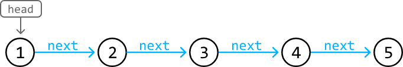

To access the other nodes in a linked list, we would need to traverse it starting at the head.

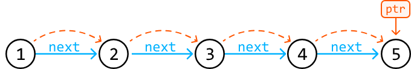

Singly linked lists can be used to store a collection of data. One of their main benefits lies in their dynamic sizing capability, since they can grow or shrink in size flexibly, unlike arrays which are fixed in size. Additionally, singly linked lists excel in scenarios requiring frequent insertions and deletions, as these operations can be performed more efficiently than in arrays, which need to shift elements to perform insertion or deletion.
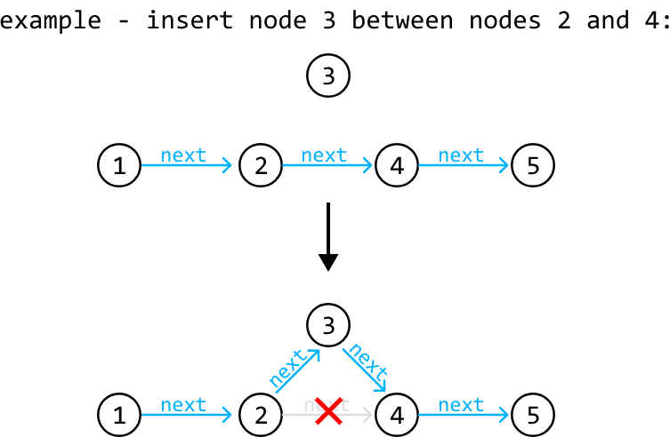

The efficiency of these operations comes at the cost of the inability to perform random access, as nodes can't be accessed by indexes like in an array. This trade-off may be acceptable in many use cases where the benefits of dynamic sizing and the efficiency of insertion/deletion outweigh the main performance benefits of random access.

## Doubly linked list

A doubly linked list is an extended version of the linked list where each node contains two references: one to the next node (`next`), and one to the previous node (`prev`). In most implementations, doubly linked lists have immediate access to both the head node and the tail node.

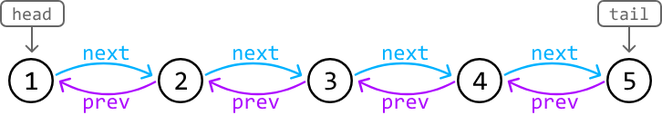

A big advantage of doubly linked list is that it allows for bidirectional traversal. Additionally, deleting nodes in a doubly linked list is generally more straightforward because we have references to both the next and previous nodes.

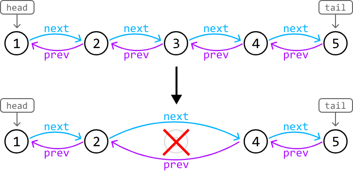

## Pointer Manipulation

Many linked list interview problems require traversing or restructuring a linked list. Understanding and being proficient at pointer manipulation is essential to solving these problems. A useful tip is to visualize pointers as arrows that point from one node to another, and observe how these arrows should be moved to reflect the structural change. For example, this is how we would visualize a node insertion:

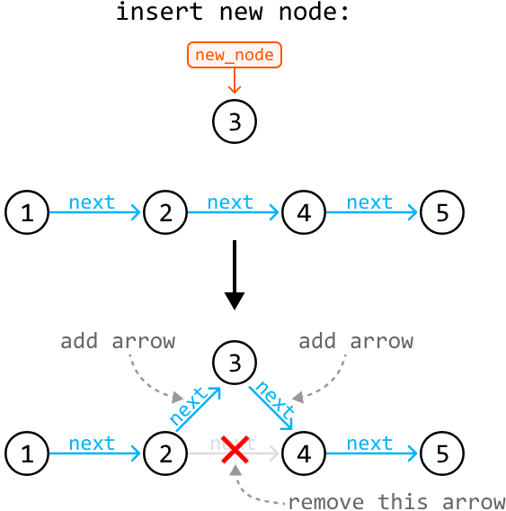

## Real-world Example

**Music Playlist:** Music player applications often use linked lists to implement playlists, particularly doubly linked lists, where each song node links to the next and previous songs. This structure enables efficient addition, removal, and reordering of songs because only the pointers between nodes need to be updated, rather than moving the song data in memory.

## Chapter Outline

This chapter explores problems involving both singly and doubly linked lists, as well as the unique challenge of restructuring a multi-level linked list.

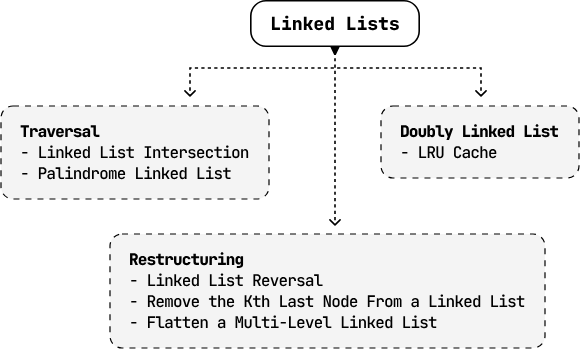
---

# Linked List Reversal

Reverse a singly linked list.

**Example:**


## Intuition - Iterative

A naive strategy is to store the values of the linked list in an array and reconstruct the linked list by traversing the array in reverse order. However, this solution does not reverse the original linked list; it just creates a new one. Could we try performing the reversal in place?


Let’s think about the problem in terms of pointer manipulation. The key observation here is that if we "flip" the direction of the pointers, we're effectively reversing the linked list:

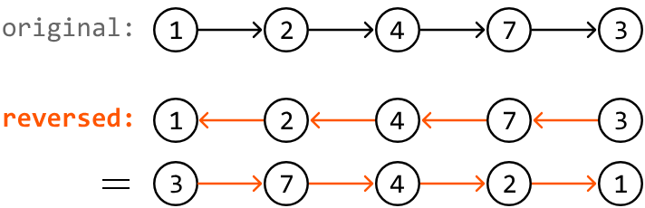

Now, we just need to figure out how to perform this pointer manipulation. Consider the example below:


To reverse the direction of all pointers, we iterate through the nodes one by one. In this process, we need access to the current node (curr_node) and the previous node (prev_node) to adjust the current node's next pointer to the previous node. Note that prev_node will initially point at null since the first node has no previous node:
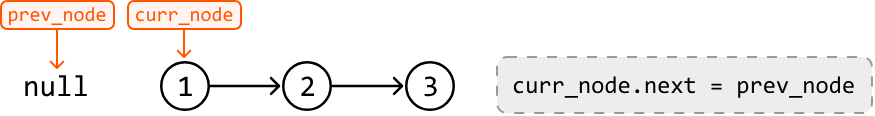
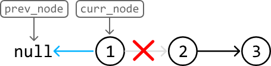
To reverse the next pointer, we'll need a way to shift the curr_node and prev_node pointers one node over. To shift prev_node, we can set it to the position of curr_node. However, we can't move curr_node to node 2 because we lost our reference to node 2:
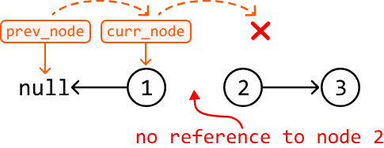
This suggests we should have preserved a reference to node 2 before reversing the curr_node. This can be done by creating a variable next_node and setting it to curr_node.next. Let’s assume we did this. Now, we can advance prev_node and curr_node forward by one:
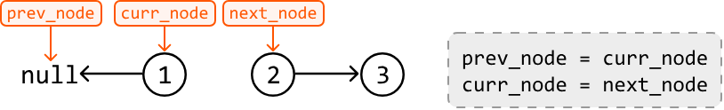
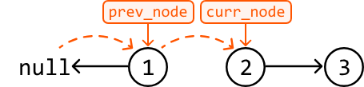

Note, we don't need to shift next_node, as it can be set by curr_node.next in the next iteration.

We can summarize this logic in three steps. At each node in the linked list:

1. Save a reference to the next node (next_node = curr_node.next).

2. Change the current node’s next pointer to link to the previous node (curr_node.next = prev_node).

3. Move both prev_node and curr_node forward by one (prev_node = curr_node,curr_node = next_node).

Let's repeat these steps for the rest of the linked list:
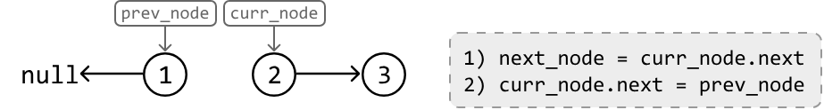
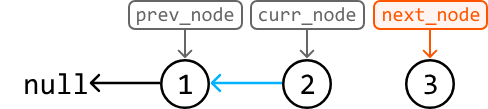
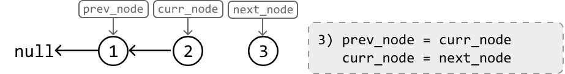
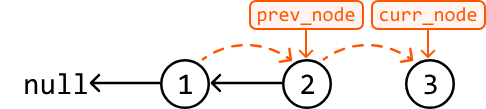
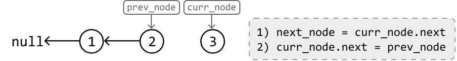
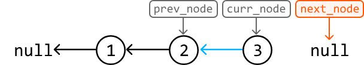
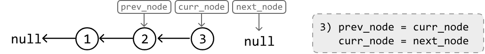
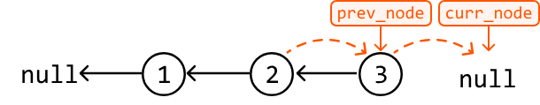
We can stop the reversal when curr_node becomes null, indicating there are no more nodes to reverse.

The final step is to return the head of the reversed linked list, which is pointed to by prev_node once curr_node becomes null.
 

## Implementation - Iterative
### Python
```python
from ds import ListNode
   
def linked_list_reversal(head: ListNode) -> ListNode:
    curr_node, prev_node = head, None
    # Reverse the direction of each node's pointer until 'curr_node' is null.
    while curr_node:
        next_node = curr_node.next
        curr_node.next = prev_node
        prev_node = curr_node
        curr_node = next_node
    # 'prev_node' will be pointing at the head of the reversed linked list.
    return prev_node
```
### JavaScript
```javascript
import { ListNode } from './ds.js'

export function linked_list_reversal(head) {
  let currNode = head
  let prevNode = null
  // Reverse the direction of each node's pointer until 'currNode' is null.
  while (currNode) {
    const nextNode = currNode.next
    currNode.next = prevNode
    prevNode = currNode
    currNode = nextNode
  }
  // 'prevNode' will be pointing at the head of the reversed linked list.
  return prevNode
}
```
### Java
```java
import core.LinkedList.ListNode;

public class Main {
    public static ListNode<Integer> linked_list_reversal(ListNode<Integer> head) {
        ListNode<Integer> currNode = head;
        ListNode<Integer> prevNode = null;
        // Reverse the direction of each node's pointer until 'currNode' is null.
        while (currNode != null) {
            ListNode<Integer> nextNode = currNode.next;
            currNode.next = prevNode;
            prevNode = currNode;
            currNode = nextNode;
        }
        // 'prevNode' will be pointing at the head of the reversed linked list.
        return prevNode;
    }
}
```
## Complexity Analysis

- **Time complexity:** The time complexity of linked_list_reversal is O(n), where n denotes the length of the linked list. This is because we perform constant-time pointer manipulation at each node of the linked list.
- **Space complexity:** The space complexity is O(1).

## Intuition - Recursive

Sometimes, the interviewer may want the problem solved using recursion. Let’s see what a recursive solution to this problem would look like.

In a recursive solution, the problem is solved by solving smaller instances of the same problem. To solve these smaller subproblems, we would need to use the linked list reversal function (linked_list_reversal) in its own implementation. The process of solving smaller problems using recursive calls continues until the smallest version of the problem is solved.

The smallest version of this problem involves reversing a linked list of size 0 or 1. These are linked lists which are inherently the same as their reverse. So, these can be our base cases.

With this in mind, let's try crafting the logic of the recursive function using the example below:
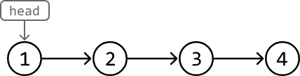
Think about which subproblem we should solve. To reverse the entire linked list, we can use our linked_list_reversal function to reverse the sublist after the current node. This way, we only need to focus on reversing the pointer of the current node. Let’s see how this works.

As mentioned, let’s first recursively call linked_list_reversal on the sublist starting at head.next. Let’s assume this recursive call reverses this sublist and returns its head as intended.

When designing a recursive function, assume any recursive call to that function will behave as intended, even if the function hasn’t been fully implemented.
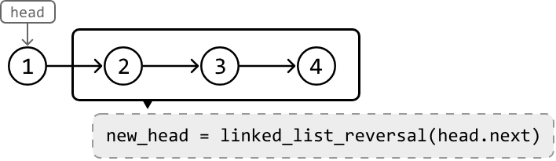
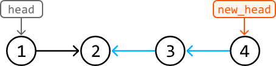
Next, we need the tail of the reversed sublist (node 2) to point to node 1. We can reference node 2 using head.next. So, all we need to do is set head.next.next to head as illustrated below:
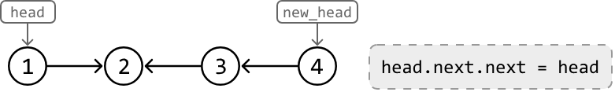
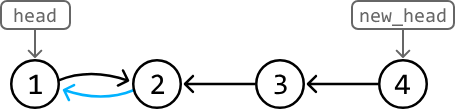
The linked list is almost fully reversed now, but node 1 is still pointing to node 2. To remove this link, just set head.next to null. Then, we can return new_head, which is the head of the reversed linked list:
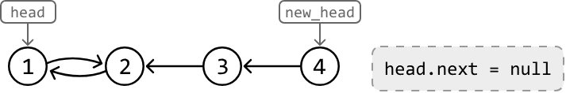
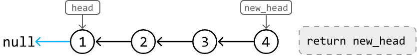


## Implementation - Recursive
### Python
```python
from ds import ListNode
   
def linked_list_reversal_recursive(head: ListNode) -> ListNode:
    # Base cases.
    if (not head) or (not head.next):
        return head
    # Recursively reverse the sublist starting at the next node.
    new_head = linked_list_reversal_recursive(head.next)
    # Connect the reversed sublist to the head node to fully reverse the entire linked list.
    head.next.next = head
    head.next = None
    return new_head
```
### JavaScript
```javascript
import { ListNode } from './ds.js'

export function linked_list_reversal_recursive(head) {
  // Base cases.
  if (!head || !head.next) {
    return head;
  }
  // Recursively reverse the sublist starting at the next node.
  const newHead = linked_list_reversal_recursive(head.next);
  // Connect the reversed sublist to the head node to fully reverse the entire linked list.
  head.next.next = head;
  head.next = null;
  return newHead;
}
```


## Complexity Analysis (Recursive)

- **Time complexity:** The time complexity of linked_list_reversal_recursive is O(n) because it involves a single recursive traversal through the linked list, visiting each node exactly once.
- **Space complexity:** The space complexity is O(n) due to the stack space taken up by the recursive call stack, which grows up to n levels deep because n recursive calls are made.

## Interview Tip

> **Tip: Visualize pointer manipulations.**  
> Often, it can be tricky to figure out exactly what to do when dealing with linked list manipulation. Drawing pointers as arrows between nodes can be quite helpful. By observing how these arrows should be reoriented to represent changes in the linked list's structure, we can deduce the necessary pointer manipulation logic. This approach also helps identify which nodes we need references to when making these changes.

---

# Remove the Kth Last Node From a Linked List

Return the head of a singly linked list after removing the kth node from the end of it.

**Example:**

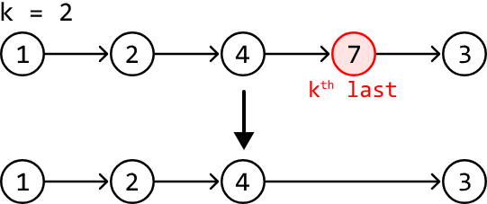

**Constraints:**
- The linked list contains at least one node.

## Intuition

We can divide this problem into two objectives:

1. Find the position of the kth last node.
2. Remove this node.

Let’s first understand how node removal works. Consider the example below, where we need to remove node b. To do this, we need access to the node preceding it (node a), so we can redirect the pointer of node a to skip over node b. This ensures node b is no longer reachable through linked list traversal:

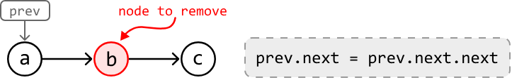
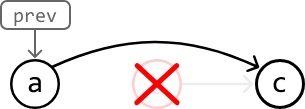

A naive solution to this problem is to first obtain the length of the linked list (n) by traversing it. Then, use this length to determine the number of steps required to arrive at the node before the kth last node, which is just n - k - 1 steps. This solution involves two for-loops, but is there a cleaner way to approach this problem?

The challenge with navigating a singly linked list in a single for-loop is that as we traverse, it’s hard to tell how far we are from the final node. The only way we’d know this is when we reach the final node itself, since its next node is null. How can we make use of this information?

Consider using two pointers instead of one. Could we create a scenario where, by the time one pointer reaches the end of the linked list, another pointer is positioned before the kth last node? Let’s explore this logic using the following example:
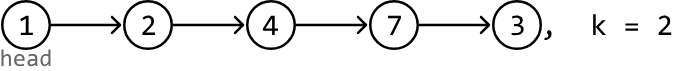
We denote the first pointer as leader and the pointer that follows it as trailer. When the leader pointer reaches the last node of the linked list, we want the trailer pointer to end up at node 4 (the node right before the kth last node) to prepare for deletion. In other words, the leader should be k nodes in front of the trailer when the leader reaches the last node.
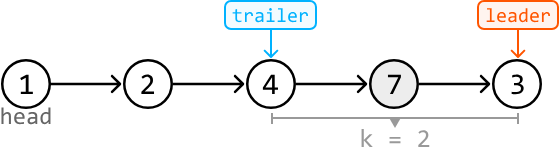
To achieve this, we can start by advancing the leader pointer through the linked list for k steps. When the leader pointer is k nodes ahead of the trailer, we can advance both pointers together until the leader reaches the last node. This process will be explained in more detail soon.

However, there’s an important edge case to consider first: what if the head itself is the node we need to remove? In this case, there’s no node before the head, so we cannot perform the removal, as mentioned earlier. To circumvent this, we can create a dummy node, place it before the head node, and start our traversal from there.
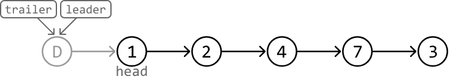

Let’s now try incorporating our strategy into the example.

First, advance the leader pointer k (2) times so it’s k nodes ahead of the trailer pointer:
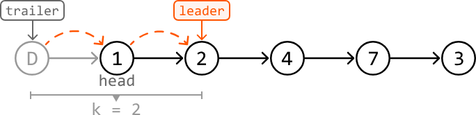 

With the leader k nodes ahead, we can move both the trailer and leader pointers until the leader reaches the last node:
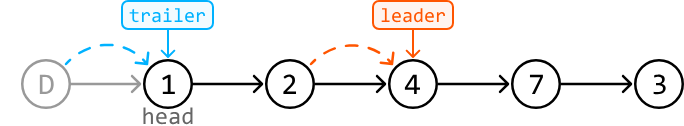
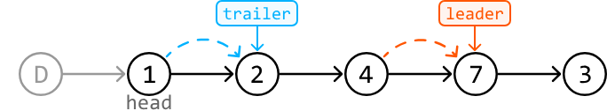
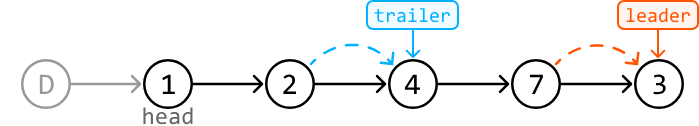
With the trailer pointer at the ideal position, we can remove node 7:
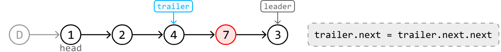
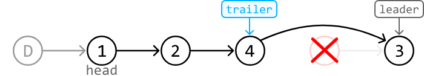
After this removal, we just return dummy.next, which points at the head of the modified linked list.


## Implementation
### Python
```python
from ds import ListNode
    
def remove_kth_last_node(head: ListNode, k: int) -> ListNode:
    # A dummy node to ensure there's a node before 'head' in case we need to remove
    # the head node.
    dummy = ListNode(-1)
    dummy.next = head
    trailer = leader = dummy
    # Advance 'leader' k steps ahead.
    for _ in range(k):
        leader = leader.next
        # If k is larger than the length of the linked list, no node needs to be removed.
        if not leader:
            return head
    # Move 'leader' to the end of the linked list, keeping 'trailer' k nodes behind.
    while leader.next:
        leader = leader.next
        trailer = trailer.next
    # Remove the kth node from the end.
    trailer.next = trailer.next.next
    return dummy.next
```
### JavaScript
```javascript
import { ListNode } from './ds.js'

export function remove_kth_last_node(head, k) {
  // A dummy node to ensure there's a node before 'head' in case we need to remove
  // the head node.
  const dummy = new ListNode(-1)
  dummy.next = head
  let trailer = dummy
  let leader = dummy
  // Advance 'leader' k steps ahead.
  for (let i = 0; i < k; i++) {
    leader = leader.next
    // If k is larger than the length of the linked list, no node needs to be
    // removed.
    if (!leader) {
      return head
    }
  }
  // Move 'leader' to the end of the linked list, keeping 'trailer' k nodes behind.
  while (leader.next) {
    leader = leader.next
    trailer = trailer.next
  }
  // Remove the kth node from the end.
  trailer.next = trailer.next.next
  return dummy.next
}
```
### Java
```java
import core.LinkedList.ListNode;

public class Main {
    public ListNode<Integer> remove_kth_last_node(ListNode<Integer> head, int k) {
        // A dummy node to ensure there's a node before 'head' in case we need to remove
        // the head node.
        ListNode<Integer> dummy = new ListNode<>(-1);
        dummy.next = head;
        ListNode<Integer> trailer = dummy;
        ListNode<Integer> leader = dummy;
        // Advance 'leader' k steps ahead.
        for (int i = 0; i < k; i++) {
            leader = leader.next;
            // If k is larger than the length of the linked list, no node needs to be
            // removed.
            if (leader == null) {
                return head;
            }
        }
        // Move 'leader' to the end of the linked list, keeping 'trailer' k nodes behind.
        while (leader.next != null) {
            leader = leader.next;
            trailer = trailer.next;
        }
        // Remove the kth node from the end.
        trailer.next = trailer.next.next;
        return dummy.next;
    }
}
```

## Complexity Analysis

- **Time complexity:** The time complexity of remove_kth_last_node is O(n). This is because the algorithm first traverses at most n nodes of the linked list, and then two pointers traverse the linked list at most once each.
- **Space complexity:** The space complexity is O(1).

---

# Linked List Intersection

Return the node where two singly linked lists intersect. If the linked lists don't intersect, return `null`.

**Example:**

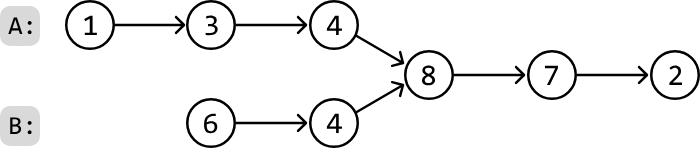
> Output: Node 8

## Intuition

Let’s first understand what an intersection between two linked lists is.

An intersection occurs when two linked lists converge at a shared node and, from that point onwards, share all subsequent nodes.

Note, this intersection has nothing to do with the values of the nodes.

A naive approach is to use a hash set. We can traverse the first linked list once and store each node in a hash set. Next, we traverse the second linked list until we find the first node that exists in the hash set, signifying the intersection point since it’s the first node shared between the two linked lists. This approach solves the problem linearly, but can we find a solution that uses constant space?

Consider the following example:

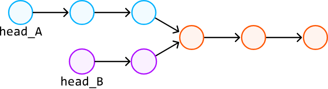

Treating these as two separate linked lists can get confusing with the above visualization. Instead, let’s visualize the input as two linked lists to help us think about the problem more clearly. Note that the tail nodes are still shared between the two linked lists, we’re just visualizing them separately:
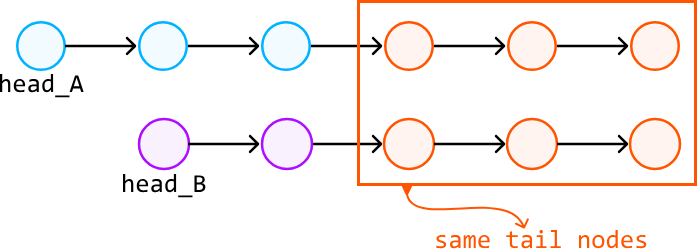
Notice that this problem is easier to solve if the two linked lists are of equal length. This is because the intersection node can be found at the same position from the heads of both linked lists. In other words, when we iterate through two linked lists of the same length, we’re guaranteed to reach the intersection node at the same time:
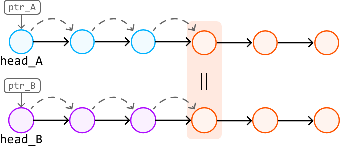
Could we somehow replicate this behavior when dealing with linked lists of varying lengths? The key observation is that, while two linked lists ‘list A’ and ‘list B’ may have different lengths, ‘list A → list B’ has the same length as ‘list B → list A’ (where ‘→’ represents the connection of two lists). Conveniently, these combined linked lists also share the same tail nodes:
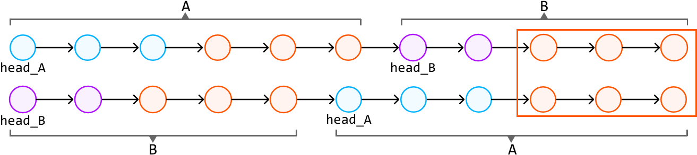
We’ve now set up a scenario where we have two combined linked lists of the same length, which share the same tail nodes. By traversing these combined linked lists, we’ll eventually reach the intersection node simultaneously on both linked lists (if one exists).

To do this, we can traverse both combined linked lists with two pointers, and stop once the nodes at both pointers are the same. This node would be the intersection node:
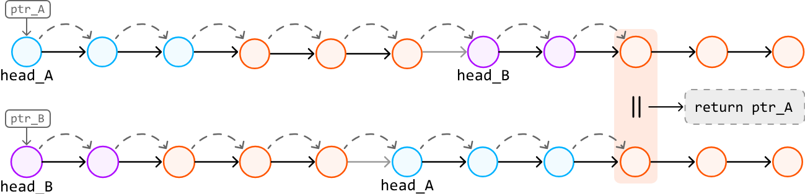
If no intersection exists, both pointers will end up stopping at null nodes:
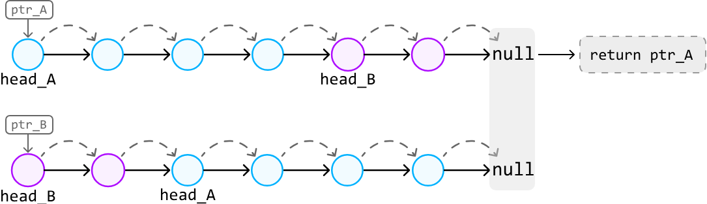

 
**Traversal technique:** An important observation is that to traverse through 'list A → list B', we don't actually need to connect these two linked lists together. Instead, we can traverse 'list A' and, upon reaching its end, continue by traversing 'list B':

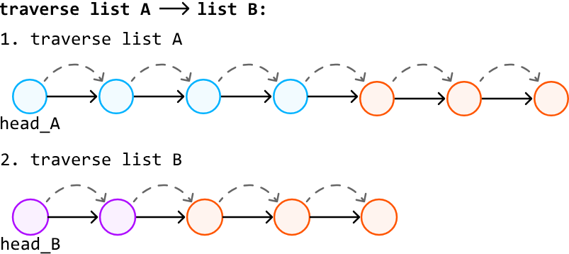

## Implementation
### Python
```python
from ds import ListNode
   
def linked_list_intersection(head_A: ListNode, head_B: ListNode) -> ListNode:
    ptr_A, ptr_B = head_A, head_B
    # Traverse through list A with 'ptr_A' and list B with 'ptr_B' until they meet.
    while ptr_A != ptr_B:
        # Traverse list A -> list B by first traversing 'ptr_A' and then, upon
        # reaching the end of list A, continue the traversal from the head of list B.
        ptr_A = ptr_A.next if ptr_A else head_B
        # Simultaneously, traverse list B -> list A.
        ptr_B = ptr_B.next if ptr_B else head_A
    # At this point, 'ptr_A' and 'ptr_B' either point to the intersection node or both
    # are null if the lists do not intersect. Return either pointer.
    return ptr_A
```
### JavaScript
```javascript
import { ListNode } from './ds.js'

export function linked_list_intersection(head_A, head_B) {
  let ptrA = head_A
  let ptrB = head_B
  // Traverse both lists until the two pointers meet
  while (ptrA !== ptrB) {
    // Move to the next node or switch to the other list's head
    ptrA = ptrA ? ptrA.next : head_B
    ptrB = ptrB ? ptrB.next : head_A
  }
  // Return the intersection node or null
  return ptrA
}
```
### Java
```java
import core.LinkedList.ListNode;

class UserCode {
    public static ListNode<Integer> linked_list_intersection(ListNode<Integer> head_A, ListNode<Integer> head_B) {
        ListNode<Integer> ptr_A = head_A;
        ListNode<Integer> ptr_B = head_B;
        // Traverse through list A with 'ptr_A' and list B with 'ptr_B' until they meet.
        while (ptr_A != ptr_B) {
            // Traverse list A -> list B by first traversing 'ptr_A' and then, upon
            // reaching the end of list A, continue the traversal from the head of list B.
            ptr_A = (ptr_A != null) ? ptr_A.next : head_B;
            // Simultaneously, traverse list B -> list A.
            ptr_B = (ptr_B != null) ? ptr_B.next : head_A;
        }
        // At this point, 'ptr_A' and 'ptr_B' either point to the intersection node or both
        // are null if the lists do not intersect. Return either pointer.
        return ptr_A;
    }
}
```

## Complexity Analysis

- **Time complexity:** The time complexity of linked_list_intersection is O(n + m), where n and m denote the lengths of list A and B, respectively.This is because pointers linearly traverse both linked lists sequentially.


- **Space complexity:** The space complexity is O(1).

---

# LRU Cache

Design and implement a data structure for the Least Recently Used (LRU) cache that supports the following operations:

- `LRUCache(capacity: int)`: Initialize an LRU cache with the specified capacity.
- `get(key: int) -> int`: Return the value associated with a key. Return -1 if the key doesn't exist.
- `put(key: int, value: int) -> None`: Add a key and its value to the cache. If adding the key would result in the cache exceeding its size capacity, evict the least recently used element. If the key already exists in the cache, update its value.

**Example:**

```
Input: [
  put(1, 100),
  put(2, 250),
  get(2),
  put(4, 300),
  put(3, 200),
  get(4),
  get(1),
],
  capacity = 3
Output: [250, 300, -1]
```

**Explanation:**
```
put(1, 100)  # cache is [1: 100]
put(2, 250)  # cache is [1: 100, 2: 250]
get(2)       # return 250
put(4, 300)  # cache is [1: 100, 2: 250, 4: 300]
put(3, 200)  # cache is [2: 250, 4: 300, 3: 200]
get(4)       # return 300
get(1)       # key 1 was evicted when adding key 3 due to the capacity limit: return -1
```

**Constraints:**
- All keys and values are positive integers.
- The cache capacity is positive.

## Intuition

When presented with a design problem, the first steps usually involve understanding the problem and deciding which data structures to use. Let's start by understanding how an LRU cache works at a high level.

Consider the LRU cache described below. It currently holds 3 elements and has reached full capacity. Assume that in this representation, the key-value pairs are ordered from the least recently used (left) to the most recently used (right):
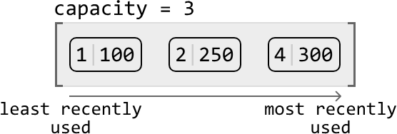
Let's try putting a new key-value pair into the cache:
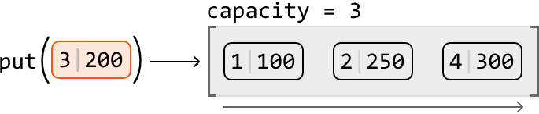
This new pair would effectively be the most recent in the cache, so we know it should be added at the most-recently-used end of the cache. Since the cache is currently at maximum capacity, we need to make room for the new pair by first evicting the least recently used pair:

From this high-level overview, we can summarize operations we need to implement the put function:

1. Remove a key-value pair from the least recently used end of the cache.

2. Add a key-value pair to the most recently used end of the cache.

Now, let's try retrieving a value from this example cache. If we perform get(2), we expect it to return 250. Accessing this pair would effectively make it the most recently used pair. So, we should move it to the most recently used end of the cache:


From this example, we identified two key operations for the get function:

3. Move a key-value pair to the most recent end of the cache.

4. Access a value using its key.

We’ve now narrowed the design down to the four main operations listed above. These will help us identify which data structures we can employ to design the LRU cache.

## Choosing Data Structures

### Operations 1 & 2 — Adding/Removing from ends

The first two operations involve adding and removing key-value pairs. Specifically, we need the ability to remove a key-value pair from one end of a data structure (representing the least recently used end) and add a key-value pair to the other.

Which data structure allows us to efficiently add or remove an element from it? A suitable data structure for these operations is a linked list, particularly because we can add and remove a node in constant time if we have a reference to that node. But should we use a singly or doubly linked list?


**Singly vs. doubly linked list:** Adding or removing a node from the head of a linked list takes O(1) time, whether it’s a singly or doubly linked list. However, removing the tail node from a singly linked list takes O(n) time, even with a reference to the tail, because we need to traverse the list to access the node before the tail. In contrast, a doubly linked list allows O(1) removal of the tail because each node has a reference to its previous node, enabling direct access without traversal. So, let’s choose the doubly linked list.

An important feature we need is the ability to access both ends of the doubly linked list when adding or removing nodes. With this in mind, let's establish some definitions:

- The tail of the linked list signifies the most frequently used node.
- The head of the linked list signifies the least recently used node.
To reference the ends of the linked list, we can establish head and tail nodes, where head points to the least recently used node, and tail points to the most recently used node:


### Operations 3 & 4 — Moving a node and key lookup

Operation 3 indicates that we’ll need to be able to move a node to the most recently-used end of the cache, and that this node doesn’t necessarily need to be at the head or tail of the linked list. If this node was somewhere in the middle, we’d need to traverse the linked list to find it. Is there a way we could access this node in O(1) time? Since this node is associated with a key, we could use a hash map to store key-node pairs. This allows us to access a node by its key in constant time. The diagram below illustrates how the hash map's values are references to nodes in the linked list:


Using a hash map also addresses operation 4 regarding efficient access to values from their keys.

Now we’ve decided on using a doubly linked list and a hash map to represent the LRU cache, let’s examine how the put and get functions would be implemented.


## `put(key: int, val: int) -> None:` 
Below is the flow for adding a new key-value pair to the cache. This involves correctly updating the linked list and the hash map, while ensuring the cache does not exceed its capacity:

To better understand how to add a new node to a doubly linked list that’s at maximum capacity, check out the following example:

As you can see, we’ll need a function to remove a node (remove_node), as well as a function to add a node to the tail of the linked list (add_to_tail). We discuss these functions in more detail in the implementation section.
## `get(key: int) -> int:` 
Below is the process for retrieving a key's value from the cache:

Now let’s take a look at an example of how the doubly linked list is updated during a get function call:

Now that we understand how the doubly linked list and hash map are used to design the LRU cache, let's dive into its implementation details, including the details of the helper methods remove_node and add_to_tail.
 
## Implementation
We can use the custom class below to represent a node in a doubly linked list:
### Python
```python
class DoublyLinkedListNode:
   def __init__(self, key: int, val: int):
       self.key = key
       self.val = val
       self.next = self.prev = None
```
### JavaScript
```javascript
class DoublyLinkedListNode {
  constructor(key, val) {
    this.key = key
    this.val = val
    this.prev = this.next = null
  }
}
```
### Java
```java
class DoublyLinkedListNode {
    int key;
    int val;
    DoublyLinkedListNode next;
    DoublyLinkedListNode prev;

    public DoublyLinkedListNode(int key, int val) {
        this.key = key;
        this.val = val;
        this.next = null;
        this.prev = null;
    }
}
```
The example below illustrates how to add a node to the tail of the linked list. Let's refer to the node before the tail as prev_node.

The new node should appear after prev_node and before the tail node. Let’s set the new node’s prev and next pointers to reflect this:

Now connect prev_node and tail to the new node:

Below is the implementation of this function:

## Implementation

### Python
```python
def add_to_tail(self, node: DoublyLinkedListNode) -> None:
    prev_node = self.tail.prev
    node.prev = prev_node
    node.next = self.tail
    prev_node.next = node
    self.tail.prev = node
```
### JavaScript
```javascript
addToTail(node) {
    const prevNode = this.tail.prev;
    node.prev = prevNode;
    node.next = this.tail;
    prevNode.next = node;
    this.tail.prev = node;
}
```
### Java
```java
private void addToTail(DoublyLinkedListNode node) {
    DoublyLinkedListNode prevNode = tail.prev;
    node.prev = prevNode;
    node.next = tail;
    prevNode.next = node;
    tail.prev = node;
}
```
The example below illustrates how to remove a node from the doubly linked list:

To remove a node, we make its two adjacent nodes point at each other, effectively excluding the node to be removed from the linked list:


Below is the implementation of this function:


## Implementation

### Python
```python
def remove_node(self, node: DoublyLinkedListNode) -> None:
    node.prev.next = node.next
    node.next.prev = node.prev
```
### JavaScript
```javascript
removeNode(node) {
    node.prev.next = node.next;
    node.next.prev = node.prev;
}
```
### Java
```java
private void removeNode(DoublyLinkedListNode node) {
    node.prev.next = node.next;
    node.next.prev = node.prev;
}
```
With the help of the above two functions, we can complete the full implementation of the LRU cache.

### LRU Cache


## Implementation

### Python
```python
class DoublyLinkedListNode:
    def __init__(self, key: int, val: int):
        self.key = key
        self.val = val
        self.next = self.prev = None

class LRUCache:
    def __init__(self, capacity: int):
        self.capacity = capacity
        # A hash map that maps keys to nodes.
        self.hashmap = {}
        # Initialize the head and tail dummy nodes and connect them to
        # each other to establish a basic two-node doubly linked list.
        self.head = DoublyLinkedListNode(-1, -1)
        self.tail = DoublyLinkedListNode(-1, -1)
        self.head.next = self.tail
        self.tail.prev = self.head

    def get(self, key: int) -> int:
        if key not in self.hashmap:
            return -1
        # To make this key the most recently used, remove its node and
        # re-add it to the tail of the linked list.
        self.remove_node(self.hashmap[key])
        self.add_to_tail(self.hashmap[key])
        return self.hashmap[key].val

    def put(self, key: int, value: int) -> None:
        # If a node with this key already exists, remove it from the linked list.
        if key in self.hashmap:
            self.remove_node(self.hashmap[key])
        node = DoublyLinkedListNode(key, value)
        self.hashmap[key] = node
        # Remove the least recently used node from the cache if adding
        # this new node will result in an overflow.
        if len(self.hashmap) > self.capacity:
            del self.hashmap[self.head.next.key]
            self.remove_node(self.head.next)
        self.add_to_tail(node)

    def add_to_tail(self, node: DoublyLinkedListNode) -> None:
        prev_node = self.tail.prev
        node.prev = prev_node
        node.next = self.tail
        prev_node.next = node
        self.tail.prev = node

    def remove_node(self, node: DoublyLinkedListNode) -> None:
        node.prev.next = node.next
        node.next.prev = node.prev
```
### JavaScript
```javascript
class DoublyLinkedListNode {
  constructor(key, val) {
    this.key = key
    this.val = val
    this.prev = this.next = null
  }
}

export class LRUCache {
  constructor(capacity) {
    this.capacity = capacity
    // A hash map that maps keys to nodes.
    this.hashmap = new Map()
    // Initialize the head and tail dummy nodes and connect them to each other to
    // establish a basic two-node doubly linked list.
    this.head = this.tail = new DoublyLinkedListNode(-1, -1)
    this.head.next = this.tail
    this.tail.prev = this.head
  }

  get(key) {
    if (!this.hashmap.has(key)) {
      return -1
    }
    // To make this key the most recently used, remove its node and re-add it to
    // the tail of the linked list.
    const node = this.hashmap.get(key)
    this.removeNode(node)
    this.addToTail(node)
    return node.val
  }

  put(key, value) {
    // If a node with this key already exists, remove it from the linked list.
    if (this.hashmap.has(key)) {
      this.removeNode(this.hashmap.get(key))
    }
    const node = new DoublyLinkedListNode(key, value)
    this.hashmap.set(key, node)
    // Remove the least recently used node from the cache if adding this new node
    // will result in an overflow.
    if (this.hashmap.size > this.capacity) {
      const lru = this.head.next
      this.removeNode(lru)
      this.hashmap.delete(lru.key)
    }
    this.addToTail(node)
  }

  // Removes a node from the doubly linked list.
  removeNode(node) {
    node.prev.next = node.next
    node.next.prev = node.prev
  }

  // Adds a node to the end (tail) of the doubly linked list.
  addToTail(node) {
    const prevNode = this.tail.prev
    node.prev = prevNode
    node.next = this.tail
    prevNode.next = node
    this.tail.prev = node
  }
}
```
### Java
```java
import java.util.HashMap;

class DoublyLinkedListNode {
    int key;
    int val;
    DoublyLinkedListNode prev;
    DoublyLinkedListNode next;

    public DoublyLinkedListNode(int key, int val) {
        this.key = key;
        this.val = val;
        this.prev = null;
        this.next = null;
    }
}

class LRUCache {
    private int capacity;
    // A hash map that maps keys to nodes.
    private HashMap<Integer, DoublyLinkedListNode> hashmap;
    // Initialize the head and tail dummy nodes and connect them to
    // each other to establish a basic two-node doubly linked list.
    private DoublyLinkedListNode head;
    private DoublyLinkedListNode tail;

    public LRUCache(Integer capacity) {
        this.capacity = capacity;
        this.hashmap = new HashMap<>();
        this.head = new DoublyLinkedListNode(-1, -1);
        this.tail = new DoublyLinkedListNode(-1, -1);
        this.head.next = this.tail;
        this.tail.prev = this.head;
    }

    public Integer get(Integer key) {
        if (!hashmap.containsKey(key)) {
            return -1;
        }
        // To make this key the most recently used, remove its node and
        // re-add it to the tail of the linked list.
        DoublyLinkedListNode node = hashmap.get(key);
        removeNode(node);
        addToTail(node);
        return node.val;
    }

    public void put(Integer key, Integer value) {
        // If a node with this key already exists, remove it from the
        // linked list.
        if (hashmap.containsKey(key)) {
            removeNode(hashmap.get(key));
        }
        DoublyLinkedListNode node = new DoublyLinkedListNode(key, value);
        hashmap.put(key, node);
        // Remove the least recently used node from the cache if adding
        // this new node will result in an overflow.
        if (hashmap.size() > capacity) {
            DoublyLinkedListNode lru = head.next;
            hashmap.remove(lru.key);
            removeNode(lru);
        }
        addToTail(node);
    }

    private void addToTail(DoublyLinkedListNode node) {
        DoublyLinkedListNode prevNode = tail.prev;
        node.prev = prevNode;
        node.next = tail;
        prevNode.next = node;
        tail.prev = node;
    }

    private void removeNode(DoublyLinkedListNode node) {
        node.prev.next = node.next;
        node.next.prev = node.prev;
    }
}
```
## Complexity Analysis

- **Time complexity:** The time complexity for the helper functions remove_node and add_tail_node is O(1) because they perform constant-time operations on a doubly linked list. The put and get functions utilize these helper functions, while also performing constant-time hash map operations. Consequently, they also have an O(1) time complexity.
- **Space complexity:** The overall space complexity of this solution is O(n), where n is the capacity of the cache.This is because both the doubly linked list and hash map can each occupy O(n) space.

## Interview Tip

> **Tip: Explore how combining data structures can help achieve certain functionality.**  
> It's possible to encounter situations where no single data structure provides the functionality required for your solution. In such cases, try to work out if this functionality can be achieved using a combination of data structures. For instance, in this problem we combined a doubly-linked list and a hash map to achieve the functionality required for the LRU cache.

---

# Palindromic Linked List

Given the head of a singly linked list, determine if it's a palindrome.

**Example 1:**

 
> Output: `True`

**Example 2:**


> Output: `False`

## Intuition

A linked list would be palindromic if its values read the same forward and backward. A naive way to check this would be to store all the values of the linked list in an array, allowing us to freely traverse these values forward and backward to confirm if it’s palindromic. However, this takes linear space. Instead, it would be better if we had a way to traverse the linked list in reverse order to confirm if it's a palindrome. Is there a way to go about this?

Going off the above definition, we know that if a linked list is a palindrome, reversing it would result in the same sequence of values.

This means we could create a copy of the linked list, reverse it, and compare its values with the original linked list. However, this would still take up linear space. Can we adjust this idea to avoid creating a new linked list?

An important observation is that we only need to compare the first half of the original linked list with the reverse of the second half (if there are an odd number of elements, we can just include the middle node in both halves) to check if the linked list is a palindrome:

Before we can perform this comparison, we need to:

1. Find the middle of the linked list to get the head of the second half.
2. Reverse the second half of the linked list from this middle node.
Notice that step 2 involves modifying the input. In this problem, let’s assume this is acceptable. However, it's always good to check with the interviewer if changing the input is allowed before moving forward with the solution.

Now, let’s see how these two steps can be applied. Start by obtaining the middle node (mid) of the linked list.

To learn how to get to the middle of a linked list, read the explanation in the Linked List Midpoint problem in the Fast and Slow Pointers chapter.

Then, reverse the second half of the linked list starting at mid. The last node of the original linked list becomes the head of the second half. This second head is used to traverse the newly reversed second half.


To learn how to reverse a linked list in O(n) time, read the explanation in the Reverse Linked List problem in this chapter.

The last thing we need to do is check if the first half matches the now-reversed second half. We can do this by simultaneously traversing both halves node by node, and comparing each node from the first half to the corresponding node from the second half. If at any point the node values don't match, it indicates the linked list is not a palindrome.

We can use two pointers (ptr1 and ptr2) to iterate through the first and the reversed second half of the linked list, respectively:


## Implementation
### Python
```python
from ds import ListNode
    
def palindromic_linked_list(head: ListNode) -> bool:
    # Find the middle of the linked list and then reverse the second half of the
    # linked list starting at this midpoint.
    mid = find_middle(head)
    second_head = reverse_list(mid)
    # Compare the first half and the reversed second half of the list.
    ptr1, ptr2 = head, second_head
    res = True
    while ptr2:
        if ptr1.val != ptr2.val:
            res = False
        ptr1, ptr2 = ptr1.next, ptr2.next
    return res

# From the 'Reverse Linked List' problem.
def reverse_list(head: ListNode) -> ListNode:
    prevNode, currNode = None, head
    while currNode:
        nextNode = currNode.next
        currNode.next = prevNode
        prevNode = currNode
        currNode = nextNode
    return prevNode

# From the 'Linked List Midpoint' problem.
def find_middle(head: ListNode) -> ListNode:
    slow = fast = head
    while fast and fast.next:
        slow = slow.next
        fast = fast.next.next
    return slow
```
### JavaScript
```javascript
import { ListNode } from './ds.js'

export function palindromic_linked_list(head) {
  // Find the middle of the linked list and then reverse the second half.
  const mid = find_middle(head)
  const secondHead = reverse_list(mid)
  // Compare the first half and the reversed second half of the list.
  let ptr1 = head
  let ptr2 = secondHead
  let isPalindrome = true
  while (ptr2 !== null) {
    if (ptr1.val !== ptr2.val) {
      isPalindrome = false
      break
    }
    ptr1 = ptr1.next
    ptr2 = ptr2.next
  }
  return isPalindrome
}

// Reverses a linked list.
function reverse_list(head) {
  let prevNode = null
  let currNode = head
  while (currNode !== null) {
    const nextNode = currNode.next
    currNode.next = prevNode
    prevNode = currNode
    currNode = nextNode
  }
  return prevNode
}

// Finds the midpoint of a linked list.
function find_middle(head) {
  let slow = head
  let fast = head
  while (fast !== null && fast.next !== null) {
    slow = slow.next
    fast = fast.next.next
  }
  return slow
}
```
### Java
```java
import core.LinkedList.ListNode;

public class Main {
    public static Boolean palindromic_linked_list(ListNode<Integer> head) {
        // Find the middle of the linked list and then reverse the second half of the
        // linked list starting at this midpoint.
        ListNode<Integer> mid = findMiddle(head);
        ListNode<Integer> secondHead = reverseList(mid);
        // Compare the first half and the reversed second half of the list
        ListNode<Integer> ptr1 = head;
        ListNode<Integer> ptr2 = secondHead;
        boolean res = true;
        while (ptr2 != null) {
            if (!ptr1.val.equals(ptr2.val)) {
                res = false;
                break;
            }
            ptr1 = ptr1.next;
            ptr2 = ptr2.next;
        }
        return res;
    }

    // From the 'Reverse Linked List' problem.
    public static ListNode<Integer> reverseList(ListNode<Integer> head) {
        ListNode<Integer> prevNode = null;
        ListNode<Integer> currNode = head;
        while (currNode != null) {
            ListNode<Integer> nextNode = currNode.next;
            currNode.next = prevNode;
            prevNode = currNode;
            currNode = nextNode;
        }
        return prevNode;
    }

    // From the 'Linked List Midpoint' problem.
    public static ListNode<Integer> findMiddle(ListNode<Integer> head) {
        ListNode<Integer> slow = head;
        ListNode<Integer> fast = head;
        while (fast != null && fast.next != null) {
            slow = slow.next;
            fast = fast.next.next;
        }
        return slow;
    }
}
```

## Complexity Analysis

- **Time complexity:** The time complexity of palindromic_linked_list is O(n), where n denotes the length of the linked list. This is because it involves iterating through the linked list three times: once to find the middle node, once to reverse the second half, and once more to compare the two halves.


- **Space complexity:** The space complexity is O(1).

## Interview Tip

> **Tip: Confirm if it's acceptable to modify the linked list.**  
> input’s initial structure. Why does this matter? Oftentimes, the input data structure should not be modified, particularly if it's shared or accessed concurrently. As such, it’s important to confirm with your interviewer whether input modification is acceptable and to briefly address the implications of this.


---

# Flatten a Multi-Level Linked List

In a multi-level linked list, each node has a next pointer and child pointer. The next pointer connects to the subsequent node in the same linked list, while the child pointer points to the head of a new linked list under it. This creates multiple levels of linked lists. If a node does not have a child list, its child attribute is set to null.

Flatten the multi-level linked list into a single-level linked list by linking the end of each level to the start of the next one.


**Example:**


## Intuition

Consider the Two conditions required to form the flattened linked list:

1. The order of nodes on each level needs to be preserved.
2. All nodes in one level must connect before appending nodes from the next level.

The challenge with this problem is figuring out how we process linked lists in lower levels. One strategy that might come to mind is level-order traversal using breadth-first search. However, breadth-first search usually involves the use of a queue, which would result in at least a linear space complexity. Is there a way we could merge the levels of the linked lists in place?

A key observation is that for any level of the multi-level linked list, we have direct access to all the nodes on the next level. This is because each node’s child node at any given level ‘L’ has direct access to nodes on the next level ‘L + 1’:

How can we connect the nodes on level ‘L + 1’ to the end of level ‘L’? Since we have access to the nodes at the next level from the current level’s child pointers, we can append each child linked list to the end of the current level, which effectively merges these two levels into one.

So, with all the nodes on level ‘L + 1’ appended to level ‘L’, we can continue this process by appending nodes from level ‘L + 2’ to level ‘L + 1’, and so on.

Now that we have a high-level idea about what we should do, let’s try this strategy on the following example:

We’ll start by appending level 2’s nodes to the end of level 1. Before we can do this, we would need a reference to level 1’s tail node so we can easily add nodes to the end of the linked list. To set this reference, we'll create a tail pointer and advance it through level 1's linked list until it reaches the last node, which happens when tail.next is equal to null:

Now, let’s add the child linked lists (5 → 6 and 7 → 8) to the tail node. We must keep the tail pointer fixed at the end of the linked list, so let’s introduce a separate pointer, curr, to traverse the linked list. Whenever curr encounters a node with a child node that isn’t null, we know we’ve found a child linked list. In the example, the first node (node 1) has a child linked list, which we want to add to the tail node:

To add this child linked list to the end of the tail node, set tail.next to the head of the child list:


Before incrementing curr to find the next node with a child linked list, we need to readjust the position of the tail pointer so it’s pointing at the last node of the newly extended linked list (node 6 in this case). Again, we can do this by iterating the tail pointer until its next node is null:

With the tail pointer now repositioned, we can continue this process of:

- Finding the next node with a child linked list using the curr pointer.
- Adding the child linked list to the tail node.
- Advancing the tail pointer to the last node of the flattened linked list.


After the process is complete, we can return head, which is the head of the flattened linked list.

One last important detail to mention is that after appending any child linked list to the tail, we should nullify the child attribute to ensure the linked list is fully flattened.
### Implementation
The definition of the MultiLevelListNode class is provided below:


### Python
```python
class MultiLevelListNode:
    def __init__(self, val, next, child):
        self.val = val
        self.next = next
        self.child = child
```
### JavaScript
```javascript
class MultiLevelListNode {
  constructor(val = null, next = null, child = null) {
    this.val = val
    this.next = next
    this.child = child
  }
}
```
### Java
```java
public class MultiLevelListNode<T> {
    T val;
    MultiLevelListNode<T> next;
    MultiLevelListNode<T> child;
}
```
```python
from ds import MultiLevelListNode
   
def flatten_multi_level_list(head: MultiLevelListNode) -> MultiLevelListNode:
    if not head:
        return None
    tail = head
    # Find the tail of the linked list at the first level.
    while tail.next:
        tail = tail.next
    curr = head
    # Process each node at the current level. If a node has a child linked list,
    # append it to the tail and then update the tail to the end of the extended linked
    # list. Continue until all nodes at the current level are processed.
    while curr:
        if curr.child:
            tail.next = curr.child
            curr.child = None
            while tail.next:
                tail = tail.next
        curr = curr.next
    return head
```
### JavaScript
```javascript
import { MultiLevelListNode } from './ds.js'

export function flatten_multi_level_list(head) {
  if (!head) {
    return null
  }
  let tail = head
  // Find the tail of the linked list at the first level.
  while (tail.next) {
    tail = tail.next
  }
  let curr = head
  // Process each node at the current level. If a node has a child linked list,
  // append it to the tail and then update the tail to the end of the extended
  // linked list. Continue until all nodes at the current level are processed.
  while (curr) {
    if (curr.child) {
      tail.next = curr.child
      // Disconnect the child linked list from the current node.
      curr.child = null
      while (tail.next) {
        tail = tail.next
      }
    }
    curr = curr.next
  }
  return head
}
```
### Java
```java
public class Main {
    public static MultiLevelListNode flatten_multi_level_list(MultiLevelListNode head) {
        if (head == null) {
            return null;
        }
        MultiLevelListNode tail = head;
        // Find the tail of the linked list at the first level.
        while (tail.next != null) {
            tail = tail.next;
        }
        MultiLevelListNode curr = head;
        // Process each node at the current level. If a node has a child linked list,
        // append it to the tail and then update the tail to the end of the extended linked
        // list. Continue until all nodes at the current level are processed.
        while (curr != null) {
            if (curr.child != null) {
                tail.next = curr.child;
                curr.child = null;
                while (tail.next != null) {
                    tail = tail.next;
                }
            }
            curr = curr.next;
        }
        return head;
    }
}
```
## Complexity Analysis

- **Time complexity:** The time complexity of flatten_multi_level_list is O(n), where n denotes the number of nodes in the multi-level linked list. This is because we iterate through each node in the multi-level linked list at most twice: once to iterate tail and once to iterate curr.


- **Space complexity:** We only allocated a constant number of variables, so the space complexity is  O(1).