# 04. Fast and Slow Pointers

1. [Introduction to Fast and Slow Pointers](#introduction-to-fast-and-slow-pointers)
2. [Linked List Loop](#linked-list-loop)
3. [Linked List Midpoint](#linked-list-midpoint)
4. [Happy Number](#happy-number)

---

# Introduction to Fast and Slow Pointers

## Intuition

The fast and slow pointer technique is a specialized variant of the two-pointer pattern, characterized by the differing speeds at which two pointers traverse a data structure. In this technique, we designate a fast pointer and a slow pointer:

* Usually, the slow pointer moves one step in each iteration.
* Usually, the fast pointer moves two steps in each iteration.

This creates a dynamic in which the fast pointer moves at twice the speed of the slow pointer:
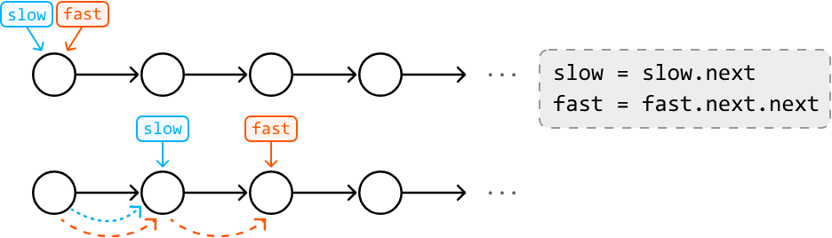
Keep in mind these pointers aren't limited to just one and two steps. As long as the fast pointer advances more steps than the slow pointer does, the logic of the fast and slow pointer technique still applies.

## Real-world Example

**Detecting cycles in symlinks:** Symlinks are shortcuts that point to files or directories in a file system. A real-world example of using the fast and slow pointer technique is detecting cycles in symlinks.

In this process, the slow pointer follows each symlink one step at a time, while the fast pointer moves two steps at a time. If the fast pointer catches up to the slow pointer, it indicates a loop in the symlinks, which can cause infinite loops or errors when accessing files. To understand how fast and slow pointers detect cycles in this way, study the Linked List Loop problem.

## Chapter Outline

Fast and slow pointers are particularly beneficial in data structures like linked lists, where index-based access isn't available. They allow us to gather crucial information about the data structure's elements through the relative positions of the two pointers, rather than with indexing. This will become clearer as we explore some common use cases in this chapter.
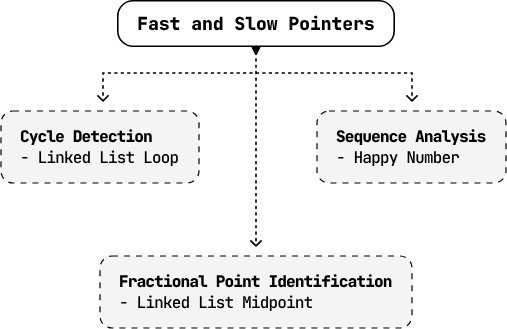

---

# Linked List Loop

Given a singly linked list, determine if it contains a cycle. A cycle occurs if a node's next pointer references an earlier node in the linked list, causing a loop.

**Example:**

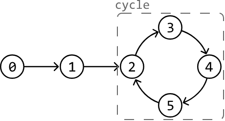

**Output:** `True`


## Intuition

A straightforward approach is to iterate through the linked list while keeping track of the nodes that were already visited in a hash set. Encountering a previously-visited node during the traversal indicates the presence of a cycle. Below is the code snippet for this approach:
### Python
```python
from ds import ListNode
    
def linked_list_loop_naive(head: ListNode) -> bool:
    visited = set()
    curr = head
    while curr:
        # Cycle detected if the current node has already been visited.
        if curr in visited:
            return True
        visited.add(curr)
        curr = curr.next
    return False
```
### JavaScript
```javascript
import { ListNode } from './ds.js'

export function linked_list_loop_naive(head) {
  const visited = new Set()
  let curr = head
  while (curr) {
    // Cycle detected if the current node has already been visited.
    if (visited.has(curr)) {
      return true
    }
    visited.add(curr)
    curr = curr.next
  }
  return false
}
```
### Java
```java
import core.LinkedList.ListNode;
import java.util.HashSet;
import java.util.Set;

class Main {
    public static Boolean linked_list_loop_naive(ListNode<Integer> head) {
        Set<ListNode<Integer>> visited = new HashSet<>();
        ListNode<Integer> curr = head;
        while (curr != null) {
            // Cycle detected if the current node has already been visited.
            if (visited.contains(curr)) {
                return true;
            }
            visited.add(curr);
            curr = curr.next;
        }
        return false;
    }
}
```
This solution takes **O(n)** time, where **n** is the number of nodes in the linked list, since each node is visited once. However, this comes at the cost of **O(n)** extra space due to the hash set. Is there a way to achieve a linear time complexity while using constant space?

---

Imagine a race track represented as a circular linked list (i.e., a linked list with a perfect cycle) where two runners start at the same node.
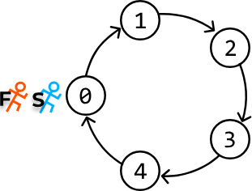
If both runners move at the same speed, they will always be together at each node. However, consider what happens when one runner (the **slow runner**) moves one step at a time, while the other runner (the **fast runner**) moves two steps at a time. In this scenario, the fast runner will overtake the slow runner at some point since the track is cyclic. But how can we use this information to detect a cycle?

In a linked list, detecting whether the fast runner has overtaken the slow runner is difficult due to the lack of positional indicators (like indexes in an array). A better way to find a cycle is to see if the fast runner **reunites** with the slow runner by both landing on the same node at some point. This would be a clear sign the linked list has a cycle.

The question now is, will the fast runner reunite with the slow runner, or is there a chance for the fast runner to consistently bypass the slow runner without ever converging on the same node? To answer this, let's start by looking at some examples.

---

### Perfect Cycle

First, let's check whether the two runners, represented as a slow pointer and a fast pointer, will reunite in a linked list that forms a perfect cycle. As we can see, the pointers will eventually meet.

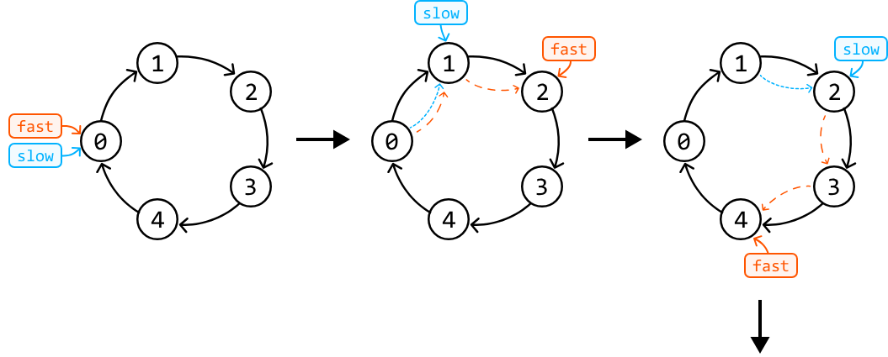
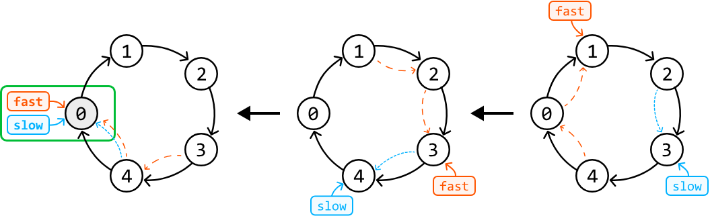
---

### Delayed Cycle

What about when the cycle doesn't start immediately in the linked list? Consider simulating the fast and slow pointer technique over the following example:

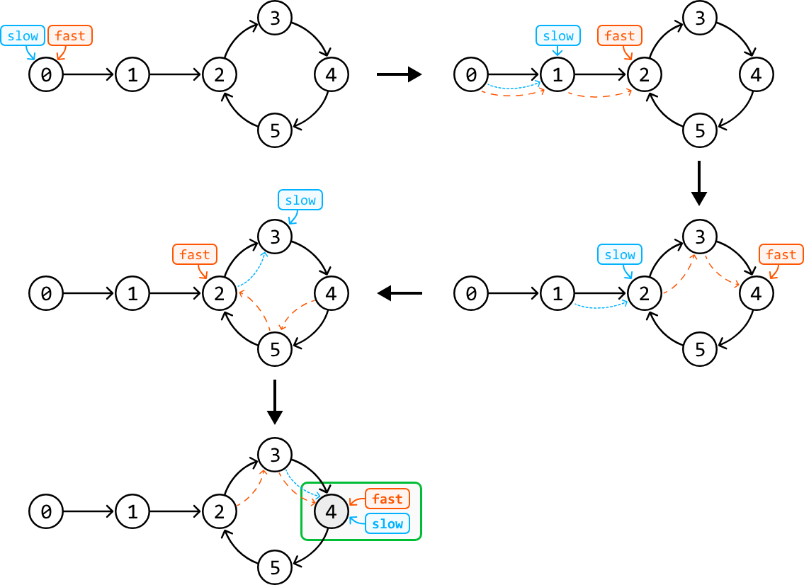

Again, the pointers eventually met in the cycle despite the fact that fast and slow entered the cycle at different times.

---

### Will fast always catch up with slow?

In both cases, it might seem like the fast pointer could keep overtaking the slow pointer without ever meeting it, but this isn't true. Here's an easier way to understand why they will meet.

The fast pointer moves 2 steps at a time, and the slow pointer moves 1 step at a time, so the **fast pointer will gain a distance of 1 node over the slow pointer at each iteration**. This means the distance between the fast and slow pointers reduces by one in each iteration until they inevitably meet.

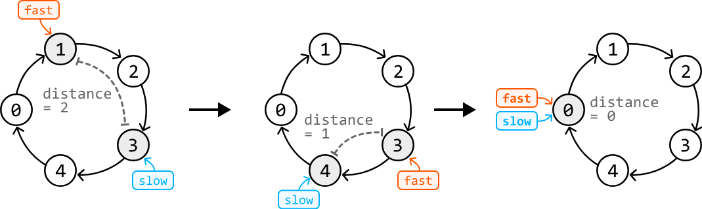

Therefore, the maximal number of steps required for the fast pointer to catch up with the slow pointer is **k** steps (once both are in the cycle), where **k** is the length of the cycle. In the worst case, the cycle will contain all the linked list's nodes, and the pointers will eventually meet in **n** steps.

---

### No Cycle

The final case is when there is no cycle. In this case, the fast pointer will eventually reach the end of the list and exit the while-loop.

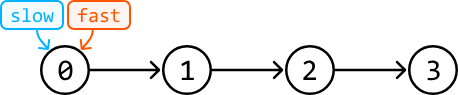
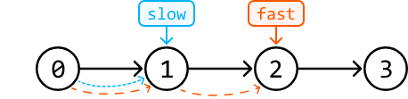
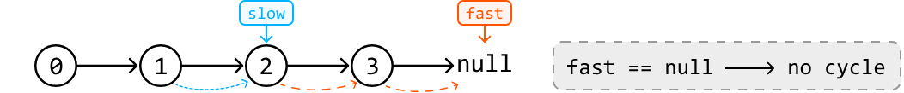
---

## Try it yourself

Write your solution to the problem before checking the reference implementation.

---

## Implementation

This algorithm is formally known as **Floyd's Cycle Detection** algorithm.
### Python
```python
from ds import ListNode
    
def linked_list_loop(head: ListNode) -> bool:
    slow = fast = head
    # Check both 'fast' and 'fast.next' to avoid null pointer exceptions when we
    # perform 'fast.next' and 'fast.next.next'.
    while fast and fast.next:
        slow = slow.next
        fast = fast.next.next
        if fast == slow:
            return True
    return False
```
### Javascript
```javascript
import { ListNode } from './ds.js'

export function linked_list_loop(head) {
  let slow = head
  let fast = head
  // Check both 'fast' and 'fast.next' to avoid null pointer exceptions when we
  // perform 'fast.next' and 'fast.next.next'.
  while (fast && fast.next) {
    slow = slow.next
    fast = fast.next.next
    if (fast === slow) {
      return true
    }
  }
  return false
}
```
### Java
```java
import core.LinkedList.ListNode;

public class Main {
    public static boolean linked_list_loop(ListNode<Integer> head) {
        ListNode<Integer> slow = head;
        ListNode<Integer> fast = head;
        // Check both 'fast' and 'fast.next' to avoid null pointer exceptions when we
        // perform 'fast.next' and 'fast.next.next'.
        while (fast != null && fast.next != null) {
            slow = slow.next;
            fast = fast.next.next;
            if (fast == slow) {
                return true;
            }
        }
        return false;
    }
}
```
---

## Complexity Analysis

- **Time complexity:** The time complexity of linked_list_loop is O(n) — because the fast pointer will meet the slow pointer in a linear number of steps, as described.
- **Space complexity:** The space complexity is O(1).

---

# Linked List Midpoint

Given a singly linked list, find and return its middle node. If there are two middle nodes, return the second one.

**Example 1:**


**Output:** Node 4

**Example 2:**


**Output:** Node 4

**Constraints:**
- The linked list contains at least one node.
- The linked list contains unique values.

---

## Intuition

The most intuitive approach to solve this problem is to traverse the linked list to find its length (**n**), and then traverse the linked list a second time to find the middle node (**n / 2**).
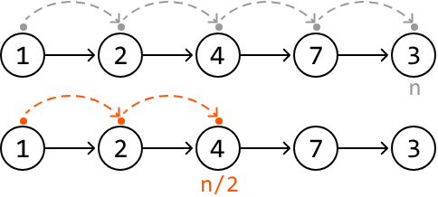
This approach solves the problem in **O(n)** time, but requires two iterations to find the midpoint. However, there's a cleaner approach that uses only a single iteration.

When iterating through the linked list, our exact position is unclear. We only know where we are when we reach the final node. Is it possible to create a scenario where, as soon as one pointer reaches the end of the linked list, the other pointer is positioned at the middle node?

If we had one pointer move at half the speed of the other, by the time the faster pointer reaches the end of the list, the slower one will be at the middle of the linked list.

We can achieve this by using the **fast and slow pointer technique**:

* Move a **slow pointer** one node at a time.
* Move a **fast pointer** two nodes at a time.

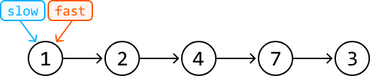
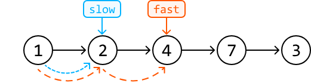
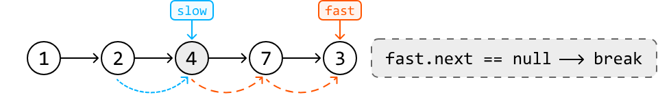
One thing we must be careful about is when we should stop advancing the fast pointer. We need to stop when the slow pointer reaches the middle node. When the list length is **odd**, this happens when `fast.next` equals `null`, as we can see above.

What about when the length of the linked list is **even**? Consider the below example:
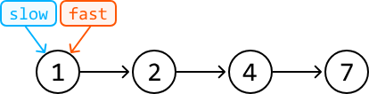
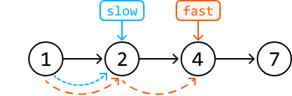
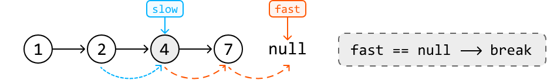
As you can see, to have `slow` point at the second middle node, we'd need to stop `fast` when it reaches a `null` node.

---

## Try it yourself

Write your solution to the problem before checking the reference implementation.

---

## Implementation
### Python
```python
from ds import ListNode
    
def linked_list_midpoint(head: ListNode) -> ListNode:
    slow = fast = head
    # When the fast pointer reaches the end of the list, the slow pointer will be at
    # the midpoint of the linked list.
    while fast and fast.next:
        slow = slow.next
        fast = fast.next.next
    return slow
```
### JavaScript
```javascript
import { ListNode } from './ds.js'

export function linked_list_midpoint(head) {
  let slow = head
  let fast = head
  // When the fast pointer reaches the end of the list, the slow pointer will be at
  // the midpoint of the linked list.
  while (fast && fast.next) {
    slow = slow.next
    fast = fast.next.next
  }
  return slow
}
```
### Java
```java
import core.LinkedList.ListNode;

class UserCode {
    public static ListNode<Integer> linked_list_midpoint(ListNode<Integer> head) {
        ListNode<Integer> slow = head;
        ListNode<Integer> fast = head;
        // When the fast pointer reaches the end of the list, the slow pointer will be at
        // the midpoint of the linked list.
        while (fast != null && fast.next != null) {
            slow = slow.next;
            fast = fast.next.next;
        }
        return slow;
    }
}
```
---

## Complexity Analysis

- **Time complexity:** The time complexity of linked_list_midpoint is O(n) — we traverse the linked list linearly using two pointers.
- **Space complexity:** The space complexity is O(1)

---

## Stop and Think

**What if you were asked to modify your algorithm to return the first middle node when the linked list is of even length?**

**Answer:** Following the same method, we should stop advancing the fast pointer when `fast.next.next` is `null`. This way, `slow` will end up pointing to the first middle node.

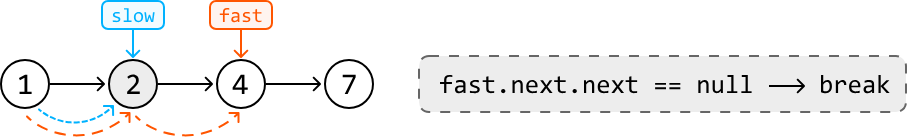

---

## Interview Tip

> **Tip: Be prepared to address potential gaps in the information provided.**
>
> During an interview, it's possible the interviewer won't specify which middle node should be returned for linked lists of even length, leaving it up to you to recognize and address this special scenario. You might be expected to identify ambiguities like this and actively engage with the interviewer to discuss a suitable resolution.

---

# Happy Number

In number theory, a happy number is defined as a number that, when repeatedly subjected to the process of squaring its digits and summing those squares, eventually leads to 1. An unhappy number will never reach 1 during this process, and will get stuck in an infinite loop [1](https://en.wikipedia.org/wiki/Happy_number).

Given an integer, determine if it's a happy number.

**Example:**

Input: `n = 23`  
Output: `True`  
Explanation: 2² + 3² = 13 ⇒ 1² + 3² = 10 ⇒ 1² + 0² = 1

---

## Intuition

We can simulate the process of identifying a happy number by repeatedly summing the squares of each digit of a number, and then applying the same process to the resulting sum.

According to the problem statement, this process could conclude in one of two ways:

- **Case 1:** the process continues until the final number is 1.
- **Case 2:** the process gets stuck in an infinite loop.

If we diagram both scenarios, we observe something interesting:

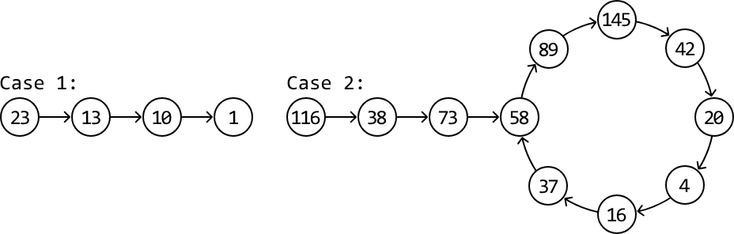

This looks quite similar to a linked list problem. In particular, the problem of determining if a linked list has a cycle (case 2) or doesn't (case 1).

We can reduce this problem to the same cycle detection challenge as the **Linked List Loop** problem. By applying the fast and slow pointer technique (i.e., Floyd's Cycle Detection algorithm), we can efficiently determine if a cycle exists.

However, in this problem, we don't have an actual linked list to perform the fast and slow pointer algorithm on. Therefore, we need to find a way to traverse the sequence of numbers generated in the happy number process.

Conveniently, we already know what the "next" number in the sequence is for any number `x`. As described in the problem statement, the next number can be calculated by summing the square of each digit of `x`. So, if each number were a node in a linked list, we could get the "next" node by calculating the next number in the sequence.

---

## Getting the next number in the sequence

To calculate the next number of `x`, we need a way to access each digit of `x`. This can be done in two steps:

1. The modulo operation (`x % 10`) is used to extract the last digit of a number `x`.
2. Divide `x` by 10 (`x = x / 10`) to truncate the last digit, positioning the next digit as the new last digit.

We can see this unfold in full below for `x = 123`:

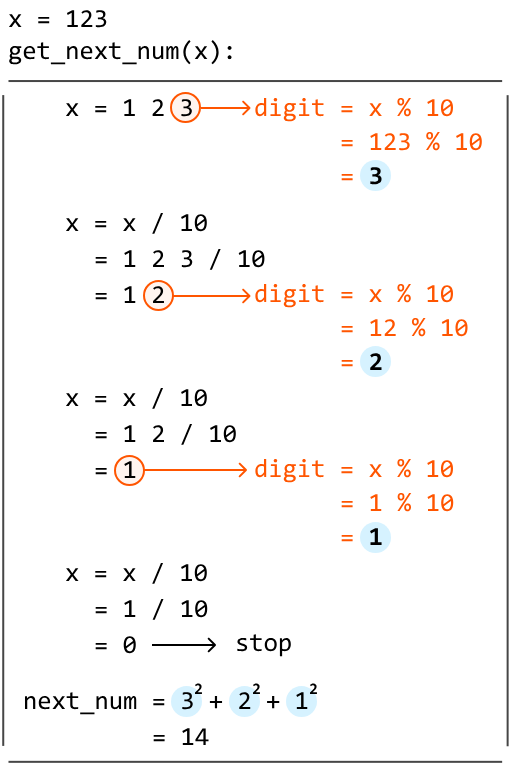

---

Now that we have a way to traverse the sequence, we can implement Floyd's Cycle Detection algorithm. To start, set the fast and slow pointers at the start of this sequence. Then move the pointers as follows:

- Advance the **slow pointer** one number at a time: `slow = get_next_num(slow)`
- Advance the **fast pointer** two numbers at a time: `fast = get_next_num(get_next_num(fast))`

If the fast and slow pointers meet during the process, it indicates the presence of a cycle, meaning the number is **not** a happy number. Otherwise, the algorithm will end when we reach 1, in which case the number **is** a happy number.

---

## Try it yourself

Write your solution to the problem before checking the reference implementation.

---

## Implementation
### Python
```python
def happy_number(n: int) -> bool:
    slow = fast = n
    while True:
        slow = get_next_num(slow)
        fast = get_next_num(get_next_num(fast))
        if fast == 1:
            return True
        # If the fast and slow pointers meet, a cycle is detected. Hence, 'n' is not
        # a happy number.
        elif fast == slow:
            return False
    
def get_next_num(x: int) -> int:
    next_num = 0
    while x > 0:
        # Extract the last digit of 'x'.
        digit = x % 10
        # Truncate (remove) the last digit from 'x' using floor division.
        x //= 10
        # Add the square of the extracted digit to the sum.
        next_num += digit ** 2
    return next_num
```
### JavaScript
```javascript
export function happy_number(n) {
  let slow = n
  let fast = n
  while (true) {
    slow = get_next_num(slow)
    fast = get_next_num(get_next_num(fast))
    if (fast === 1) {
      return true
    }
    // If the fast and slow pointers meet, a cycle is detected. Hence, 'n' is not
    // a happy number.
    if (fast === slow) {
      return false
    }
  }
}

function get_next_num(x) {
  let next_num = 0
  while (x > 0) {
    // Extract the last digit of 'x'.
    let digit = x % 10
    // Truncate (remove) the last digit from 'x' using floor division.
    x = Math.floor(x / 10)
    // Add the square of the extracted digit to the sum.
    next_num += digit ** 2
  }
  return next_num
}
```
### Java
```java
public class Main {
    public boolean happy_number(int n) {
        int slow = n;
        int fast = n;
        while (true) {
            slow = getNextNum(slow);
            fast = getNextNum(getNextNum(fast));
            if (fast == 1) {
                return true;
            }
            // If the fast and slow pointers meet, a cycle is detected. Hence, 'n' is not
            // a happy number.
            if (fast == slow) {
                return false;
            }
        }
    }

    private int getNextNum(int x) {
        int next_num = 0;
        while (x > 0) {
            // Extract the last digit of 'x'.
            int digit = x % 10;
            // Truncate (remove) the last digit from 'x' using floor division.
            x /= 10;
            // Add the square of the extracted digit to the sum.
            next_num += digit * digit;
        }
        return next_num;
    }
}
```
---

## Complexity Analysis

- **Time complexity:** The time complexity of happy_number is O(log(n)). The full analysis of this time complexity is quite complicated and beyond the scope of interviews. See the detailed analysis below.
- **Space complexity:** The space complexity is O(1)

---

## Interview Tip

> **Tip: Visualize the problem.**
>
> At first glance, this problem seems like it requires mathematical reasoning to solve. However, when we visualized the problem, we were able to formulate a solution using an algorithm we already know (Floyd's Cycle Detection). Visualizing a problem can help uncover hidden patterns or data structures that can lead to the solution.

---

## Happy Number Time Complexity Analysis

The following time complexity analysis establishes an upper bound on the steps required to determine a happy number. In this analysis, we define the "next number" of a number **n** as the result obtained by summing the squares of the digits of **n**.

**1) Upper limit for the next number**

For any number **n** with a fixed number of digits, the maximum value for its successor is achieved when all its digits are 9. For instance, the maximum next number from a 3-digit number happens when this 3-digit number is 999.

**2) Size of the next number relative to the number of digits**

- If a number **n** has 1 or 2 digits, it's possible for the next number to be larger than **n** (e.g., the next number of 99 is 162, which is one digit longer).
- If a number **n** has 3 or more digits, the next number is always smaller than the original value of **n**. The table below highlights how the largest number with 3 or more digits has a smaller next number.

| Digits | Largest Number | Next Number |
|--------|---------------|-------------|
| 1      | 9             | 81          |
| 2      | 99            | 162         |
| 3      | 999           | 243         |
| 4      | 9999          | 324         |
| 5      | 99999         | 405         |
| 6      | 999999        | 486         |
| ...    | ...           | ...         |

**3) Implications for cycles**

Since the next number is always smaller for numbers with three or more digits, a cycle can only commence in the happy number process once the number falls below 243 (the next number of 999). Any number **n** larger than 243 will have the next number smaller than **n**. However, once we fall below 243, the next number can potentially be larger, potentially cycling back to a previous number.

**4) Time complexity for numbers less than 243**

Once a number falls below 243, the algorithm will take less than 243 steps to either converge to 1 or to cycle back to a previous number in the sequence. Therefore, since the length of the cycle or the number of steps to reach 1 is bounded by 243, the time complexity of Floyd's cycle detection algorithm for numbers less than 243 is **O(1)**.

**5) Time complexity for numbers greater than 243**

The number of digits in a number is approximately equal to log(n) (base 10). So, the calculation of the next number of **n** will take approximately log(n) steps (i.e., `get_next_num` will take log(n) steps to execute).

Let's call **n**'s next number **n₂**. The next number after **n₂** (**n₃**) will take approximately log(n₂) steps to calculate. The next number after **n₃** (**n₄**) will take approximately log(n₃) steps to calculate, and so on. From this, we can summarize the time complexity of this process as:

**O(log(n) + log(n₂) + log(n₃) + …)**

Since we've established that n > n₂ > … > nₖ where nₖ is the last number greater than 243, the dominant component of this time complexity is **O(log(n))**. So, the time complexity for numbers greater than 243 is **O(log(n))**.

**Conclusion**

When **n** is less than 243, the time complexity is O(1), and when **n** is greater than 243, the time complexity is O(log(n)). Therefore, the overall time complexity of the algorithm is **O(log(n))**.

---

## Interview Tip

> **Tip: Don't waste time on complex proofs if it isn't an important part of the interview.**
>
> During an interview, correctly deciphering the exact time of an algorithm like the one used to solve this problem isn't usually expected. In situations like this, you can instead make an educated guess about how the algorithm's runtime would grow with larger inputs based on the behavior of the algorithm. Mention any assumptions you make when discussing your estimates. It might also be helpful to mention what parts of the problem or the solution make it difficult to analyze the time complexity. In this problem, it's initially unclear how many steps the happy number process would take before reaching 1 or revealing a cycle.