# 05. Sliding Windows

1. [Introduction to Sliding Windows](#introduction-to-sliding-windows)
2. [Substring Anagrams](#substring-anagrams)
3. [Longest Substring With Unique Characters](#longest-substring-with-unique-characters)
4. [Longest Uniform Substring After Replacements](#longest-uniform-substring-after-replacements)

---

# Introduction to Sliding Windows

## Intuition

The sliding window technique is a subset of the two-pointer pattern, as it uses two pointers (generally **left** and **right**) to define the bounds of a "window" in iterable data structures like arrays. The window defines a subcomponent of the data structure (e.g., a subarray or substring), and it slides across the data structure unidirectionally, typically searching for a subcomponent that meets a certain requirement.
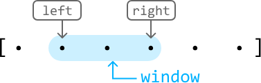
Sliding windows are particularly valuable in scenarios where algorithms might otherwise rely on using two nested loops to search through all possible subcomponents to find an answer, resulting in an $O(n^2)$ time complexity, or worse. When using a sliding window, the subcomponent(s) we're looking for can usually be found in $O(n)$ time, in comparison. But before discussing how they work, let's establish some terminology:

**To expand the window** is to advance the right pointer.
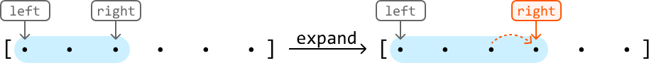
**To shrink the window** is to advance the left pointer.
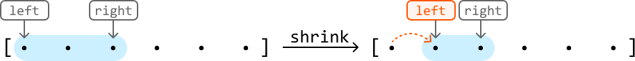
**To slide the window** is to advance both the left and right pointers.
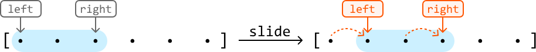
> Note that sliding is equivalent to expanding and shrinking the window at the same time.

Now, let's break down the two main types of sliding window algorithms:

1. Fixed sliding window.
2. Dynamic sliding window.

---

## Fixed Sliding Window

A fixed sliding window maintains a specific length as it slides across a data structure.
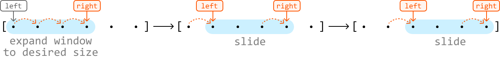
We use the fixed sliding window technique when the problem asks us to find a subcomponent of a certain length. If we know what this length is, we can fix our window to that length and slide it through the array.

If a fixed window of length `k` traverses a data structure from start to finish, it's guaranteed to see every subcomponent of length `k` in that data structure.

Below is a generic template of how a fixed sliding window traverses a data structure.
### Python
```python
left = right = 0
while right < n:
    # If the window has reached the expected fixed length, we slide the window (move
    # both left and right).
    if right - left + 1 == fixed_window_size:
        # Process the current window.
        result = process_current_window()
        left += 1
    right += 1
```
### JavaScript
```javascript
let left = 0
let right = 0
while (right < n) {
  // If the window has reached the expected fixed length, we slide the window (move
  // both left and right).
  if (right - left + 1 === fixed_window_size) {
    // Process the current window.
    result = process_current_window()
    left += 1
  }
  right += 1
}
```
### Java
```java
int left = 0, right = 0;
while (right < n) {
    // If the window has reached the expected fixed length, we slide the window (move
    // both left and right).
    if (right - left + 1 == fixedWindowSize) {
        // Process the current window.
        ResultType result = processCurrentWindow();
        left++;
    }
    right++;
}
```
---

## Dynamic Sliding Window

Unlike fixed sliding windows, dynamic windows can expand or shrink in length as they traverse a data structure.
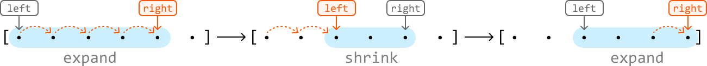
Generally, dynamic sliding windows can be applied to problems that ask us to find the **longest** or **shortest** subcomponent that satisfies a condition (for example, a condition could be that the numbers in the window must be greater than 10).

When finding the longest subcomponent, the dynamics of expanding and shrinking are typically as follows:

- If a window **satisfies** the condition, **expand** it to see if we can find a longer window that also meets the condition.
- If the condition is **violated**, **shrink** the window until the condition is met again.

Below is a generic template demonstrating how this works:
### Python
```python
left = right = 0
while right < n:
    # While the condition is violated, the window is invalid, so shrink the window by
    # advancing the left pointer.
    while condition is violated:
        left += 1
    # Once the window is valid, process it and then expand the window by advancing the
    # right pointer.
    result = process_current_window()
    right += 1
```
### JavaScript
```javascript
let left = 0;
let right = 0;
while (right < n) {
  // While the condition is violated, the window is invalid, so shrink the window by
  // advancing the left pointer.
  while (condition is violated) {
    left += 1;
  }
  // Once the window is valid, process it and then expand the window by advancing the
  // right pointer.
  result = process_current_window();
  right += 1;
}
```

### Java
```java
int left = 0, right = 0;
while (right < n) {
    // While the condition is violated, the window is invalid, so shrink the window by
    // advancing the left pointer.
    while (conditionIsViolated()) {
        left++;
    }
    // Once the window is valid, process it and then expand the window by advancing the
    // right pointer.
    ResultType result = processCurrentWindow();
    right++;
}
```
> Note that the provided templates for fixed and dynamic windows primarily emphasize the movement of the left and right pointers rather than the specifics of updating the window itself. If the problem requires updating the window, the logic around it will be highly context-dependent. This is explored in detail through specific problems in this chapter.

---

## Real-world Example

**Buffering in video streaming:** In video streaming, a dynamic sliding window can be used to manage buffering and ensure smooth playback.

For instance, when streaming a video, the player downloads chunks of the video data and stores them in a buffer. A sliding window controls which part of the video is buffered, with the window "sliding" forward as the video plays. The sliding window ensures the video player can adapt to varying network conditions by dynamically adjusting the buffer size and position, leading to a smoother streaming experience for the viewer.

---

## Chapter Outline

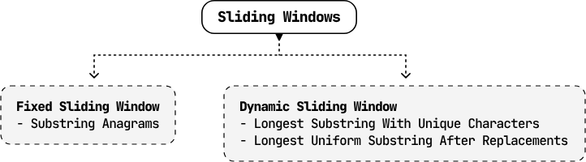

---

# Substring Anagrams

Given two strings, `s` and `t`, both consisting of lowercase English letters, return the number of substrings in `s` that are anagrams of `t`.

> An anagram is a word or phrase formed by rearranging the letters of another word or phrase, using all the original letters exactly once.

**Example:**
```
Input:  s = 'caabab', t = 'aba'
Output: 2
Explanation: There is an anagram of t starting at index 1 ("c[aab]ab") and another starting at index 2 ("ca[aba]b")
```

---

## Intuition

We can reframe how we think about an anagram by altering the provided definition. A substring of `s` qualifies as an anagram of `t` if it contains exactly the same characters as `t` in any order.

For a substring in `s` to be an anagram of `t`, it must have the same length as `t` (denoted as `len_t`). This means we only need to consider substrings of `s` that match the length `len_t`, which saves us from examining every possible substring.

To examine all substrings of a fixed length, `len_t`, we can use the **fixed sliding window** technique because a window of `len_t` is guaranteed to slide through every substring of this length. With `len_t = 3`, the window slides as follows over `'caabab'`:

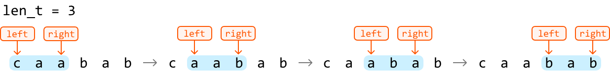

Now, we just need a way to check if a window is an anagram of `t`. Remember that in an anagram, the order of the letters doesn't matter; only the **frequency** of each letter does. By comparing the frequency of each character in a window against the frequencies of characters in string `t`, we can determine if that window is an anagram of `t`.

Let's explore this reasoning with an example. Before starting the sliding window algorithm, we need a way to store the frequencies of the characters in string t. We could use a hash map for this, or an array, expected_freqs, to store the frequencies of each character in string t.

expected_freqs is an integer array of size 26, with each index representing one of the lowercase English letters (0 for 'a', 1 for 'b', and so on, up to 25 for 'z').
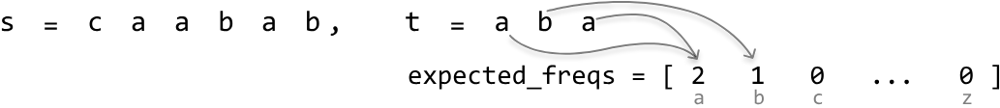

To set up the sliding window algorithm, let’s define the following components:

- Left and right pointers: Initialize both at the start of the string to define the window's boundaries.

- window_freqs: Use an array of size 26 to keep track of the frequencies of characters within the window.

- count: Maintain a variable to count the number of anagrams detected.

Before we slide the window, we first need to expand it to a fixed length of len_t. This can be done by advancing the right pointer until the window length is equal to len_t. As we expand, ensure to keep window_freqs updated to reflect the frequencies of the characters in the window:
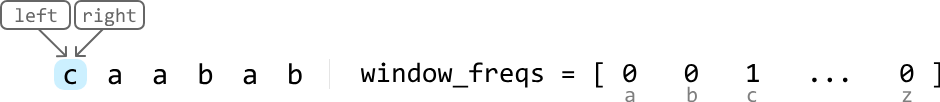
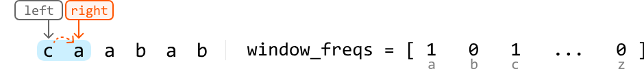
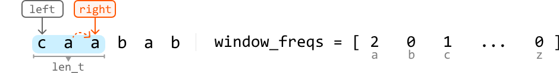
Once the window is at the fixed length of len_t, we can check if it’s an anagram of t by checking if the expected_freqs and window_freqs arrays are the same. This can be done in constant time since it requires only 26 comparisons, one for each lowercase English letter.

To slide this window across the string, advance both the left and right pointers one step in each iteration. Ensure to keep window_freqs updated by incrementing the frequency of each new character at the right pointer and decrementing the frequency of the character at the left pointer as we move past this left character:
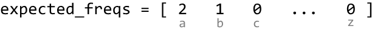
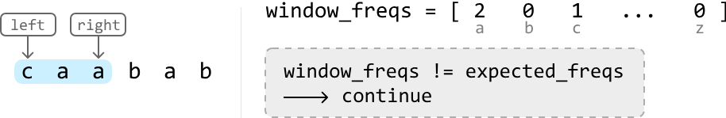
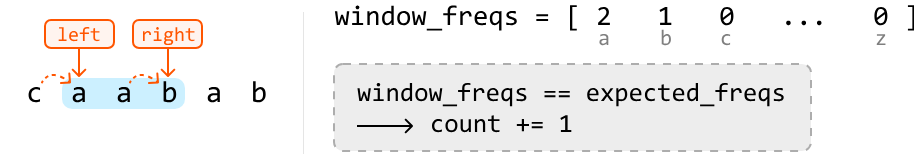
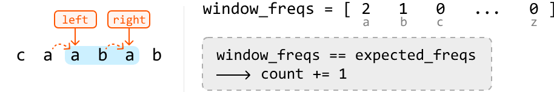
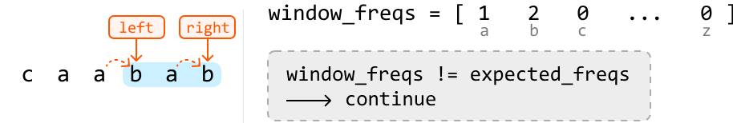
Once we’ve finished processing all substrings of length len_t, we can return count, which represents the number of anagrams found.

A small optimization we can make is returning 0 if t's length exceeds the length of s because forming an anagram of t from the substrings of s is impossible if t is longer.


---


## Implementation

In Python, `ord(character) - ord('a')` gives the index of a lowercase English letter in an array of size 26. The `ord` function returns the ASCII value of a character, and this formula calculates the distance from `'a'`, resulting in an index between `0` and `25`.
### Python
```python
def substring_anagrams(s: str, t: str) -> int:
    len_s, len_t = len(s), len(t)
    if len_t > len_s:
        return 0
    count = 0
    expected_freqs, window_freqs = [0] * 26, [0] * 26
    # Populate 'expected_freqs' with the characters in string 't'.
    for c in t:
        expected_freqs[ord(c) - ord('a')] += 1
    left = right = 0
    while right < len_s:
        # Add the character at the right pointer to 'window_freqs' before sliding the
        # window.
        window_freqs[ord(s[right]) - ord('a')] += 1
        # If the window has reached the expected fixed length, we advance the left
        # pointer as well as the right pointer to slide the window.
        if right - left + 1 == len_t:
            if window_freqs == expected_freqs:
                count += 1
            # Remove the character at the left pointer from 'window_freqs' before
            # advancing the left pointer.
            window_freqs[ord(s[left]) - ord('a')] -= 1
            left += 1
        right += 1
    return count
```
### JavaScript
```javascript
export function substring_anagrams(s, t) {
  const len_s = s.length
  const len_t = t.length
  if (len_t > len_s) {
    return 0
  }
  let count = 0
  const expected_freqs = Array(26).fill(0)
  const window_freqs = Array(26).fill(0)
  // Populate 'expected_freqs' with the characters in string 't'.
  for (let c of t) {
    expected_freqs[c.charCodeAt(0) - 'a'.charCodeAt(0)] += 1
  }
  let left = 0
  let right = 0
  while (right < len_s) {
    // Add the character at the right pointer to 'window_freqs' before sliding the window.
    window_freqs[s.charCodeAt(right) - 'a'.charCodeAt(0)] += 1
    // If the window has reached the expected fixed length, we advance the left
    // pointer as well as the right pointer to slide the window.
    if (right - left + 1 === len_t) {
      if (arrays_equal(window_freqs, expected_freqs)) {
        count += 1
      }
      // Remove the character at the left pointer from 'window_freqs' before advancing the left pointer.
      window_freqs[s.charCodeAt(left) - 'a'.charCodeAt(0)] -= 1
      left += 1
    }
    right += 1
  }
  return count
}

function arrays_equal(arr1, arr2) {
  for (let i = 0; i < 26; i++) {
    if (arr1[i] !== arr2[i]) {
      return false
    }
  }
  return true
}
```

### Java
```java
public class Main {
    public Integer substring_anagrams(String s, String t) {
        int lenS = s.length(), lenT = t.length();
        if (lenT > lenS) {
            return 0;
        }
        int count = 0;
        int[] expectedFreqs = new int[26];
        int[] windowFreqs = new int[26];
        // Populate 'expectedFreqs' with the characters in string 't'.
        for (char c : t.toCharArray()) {
            expectedFreqs[c - 'a'] += 1;
        }
        int left = 0, right = 0;
        while (right < lenS) {
            // Add the character at the right pointer to 'windowFreqs' before sliding the
            // window.
            windowFreqs[s.charAt(right) - 'a'] += 1;
            // If the window has reached the expected fixed length, we advance the left
            // pointer as well as the right pointer to slide the window.
            if (right - left + 1 == lenT) {
                boolean isMatch = true;
                for (int i = 0; i < 26; i++) {
                    if (windowFreqs[i] != expectedFreqs[i]) {
                        isMatch = false;
                        break;
                    }
                }
                if (isMatch) {
                    count += 1;
                }
                // Remove the character at the left pointer from 'windowFreqs' before
                // advancing the left pointer.
                windowFreqs[s.charAt(left) - 'a'] -= 1;
                left += 1;
            }
            right += 1;
        }

        return count;
    }
}
``` 

---

## Complexity Analysis

**Time complexity:** The time complexity of substring_anagrams is $O(n)$, where $n$ denotes the length of `s`. Here’s why:

- Populating `expected_freqs` array takes $O(m)$ time, where $m$ denotes the length of t. Since m is guaranteed to be less than or equal to n at this point, it’s not a dominant term in the time complexity.

- Then, we traverse string s linearly with two pointers, which takes $O(n)$ time.
- Note that at each iteration, the comparison performed between the two frequency arrays `expected_freqs` and `window_freqs` takes $O(1)$ time because each array contains only 26 elements.

**Space complexity:** The space complexity is $O(1)$, because each frequency array contains only 26 elements.

---

# Longest Substring With Unique Characters

Given a string, determine the length of its longest substring that consists only of unique characters.

**Example:**
```
Input:  s = 'abcba'
Output: 3
Explanation: Substring "abc" is the longest substring of length 3 that contains unique characters ("cba" also fits this description).
```

---

## Intuition

The brute force approach involves examining all possible substrings and checking if any consist of exclusively unique characters. Let's break down this approach:

- Checking a substring for uniqueness can be done in $O(n)$ time by scanning the substring and using a hash set to keep track of each character, where n denotes the length of s. If we encounter a character already in the hash set, we know it's a duplicate character.
- Iterating through all possible substrings takes $O(n^2)$ time.

This means the brute force approach would take $O(n^3)$ time overall. This is quite slow, largely because we look through every substring. Is there a way to reduce the number of substrings we examine?

---

## Sliding Window

Sliding window approaches can be quite useful for problems that involve substrings. In particular, because we're looking for the longest substring that satisfies a specific condition (i.e., contains unique characters), a dynamic sliding window algorithm might be the way to go, as discussed in the introduction.

We can categorize any window in two ways. A window either:

**A.** Consists only of unique characters (a window with no duplicate characters).
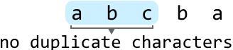
**B.** Contains at least one character of a frequency greater than 1.
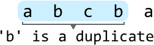
- If **A** is true, we should **expand** the window by advancing the right pointer to find a longer window that also contains no duplicates.
- If **B** is true because we encounter a duplicate character in the window, we should **shrink** the window by advancing the left pointer until it no longer contains a duplicate.

Let's try this strategy over the following example. We initialize a hash set to keep track of the characters in a window.

To implement the sliding window technique, we should establish the following:

- **Left and right pointers:** Initialize both at the start of the string to define the window's boundaries.
- **`hash_set`:** Maintain a hash set to record the unique characters within the window, updating it as the window expands. Note, the hash set shown in the diagram displays its state before the character at the right pointer is added to it.

Now, let's start looking for the longest window. Expand the window from the beginning of the string by advancing the right pointer. Keep expanding until a duplicate character is found:

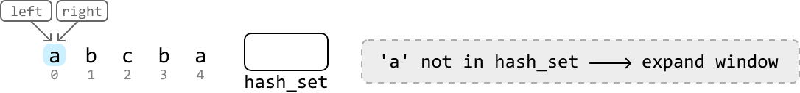
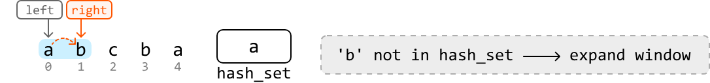
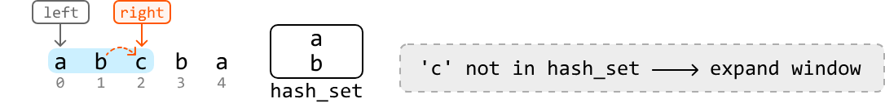
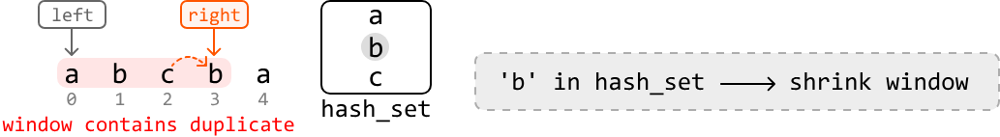
We see above that the `'b'` at index 3 is a duplicate character in the window because `'b'` is already in the hash set.

Now that we found a duplicate, we should shrink the window by advancing the left pointer until the window no longer contains a duplicate `'b'`. Once the window is valid again, continue expanding:

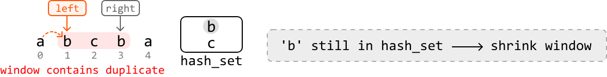
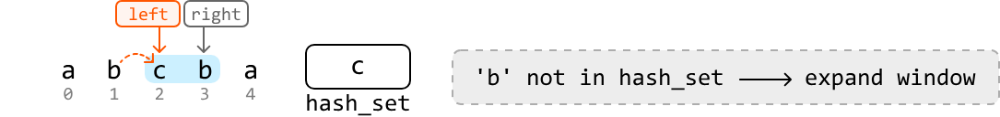
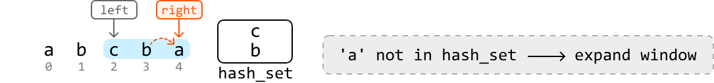
Expanding the window any further will cause the right pointer to exceed the string's boundary, at which point we end our search. The longest substring we've found with no duplicates is of length 3. We can use the variable `max_len` to keep track of this length during our search.

---


## Implementation
### Python
```python
def longest_substring_with_unique_chars(s: str) -> int:
    max_len = 0
    hash_set = set()
    left = right = 0
    while right < len(s):
        # If we encounter a duplicate character in the window, shrink the window until
        # it's no longer a duplicate.
        while s[right] in hash_set:
            hash_set.remove(s[left])
            left += 1
        # Once there are no more duplicates in the window, update 'max_len' if the
        # current window is larger.
        max_len = max(max_len, right - left + 1)
        hash_set.add(s[right])
        # Expand the window.
        right += 1
    return max_len
```
### JavaScript
```javascript
export function longest_substring_with_unique_chars(s) {
  let maxLen = 0
  const hashSet = new Set()
  let left = 0
  let right = 0
  while (right < s.length) {
    // If we encounter a duplicate character in the window, shrink the window until
    // it’s no longer a duplicate.
    while (hashSet.has(s[right])) {
      hashSet.delete(s[left])
      left += 1
    }

    // Once there are no more duplicates in the window, update 'maxLen' if the
    // current window is larger.
    maxLen = Math.max(maxLen, right - left + 1)
    hashSet.add(s[right])
    // Expand the window.
    right += 1
  }
  return maxLen
}
```
### Java
```java
import java.util.HashSet;

public class Main {
    public Integer longest_substring_with_unique_chars(String s) {
        int maxLen = 0;
        HashSet<Character> hashSet = new HashSet<>();
        int left = 0, right = 0;
        while (right < s.length()) {
            // If we encounter a duplicate character in the window, shrink the window until
            // it’s no longer a duplicate.
            while (hashSet.contains(s.charAt(right))) {
                hashSet.remove(s.charAt(left));
                left += 1;
            }
            // Once there are no more duplicates in the window, update 'maxLen' if the
            // current window is larger.
            maxLen = Math.max(maxLen, right - left + 1);
            hashSet.add(s.charAt(right));
            // Expand the window.
            right += 1;
        }
        return maxLen;
    }
}
```

---

## Complexity Analysis

**Time complexity:** The time complexity of `longest_substring_with_unique_chars` is $O(n)$ because we traverse the string linearly with two pointers.

**Space complexity:** The space complexity is $O(m)$ because we use a hash set to store unique characters, where $m$ represents the total number of unique characters within the string.

---

## Optimization

The above approach solves the problem, but we can still optimize it. The optimization has to do with how we shrink the window when encountering a duplicate character. Consider the following example, where the right pointer encounters a duplicate `'c'`:

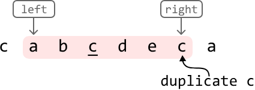

In the previous approach, we respond to encountering a duplicate by continuously advancing the left pointer to shrink the window until the window no longer contains a duplicate:

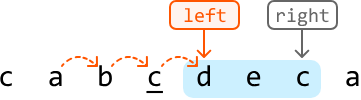

The crucial insight here is that we advanced the left pointer until it passed the **previous occurrence** of `'c'` in the window. This indicates that if we know the index of the previous occurrence of `'c'`, we can move our left pointer immediately past that index to remove it from the window:

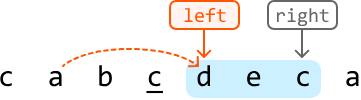

This gives us a new strategy for advancing the left pointer: if the right pointer encounters a character whose **previous index** (i.e., previous occurrence) is in the window, move the left pointer one index past that previous index.

We can use a hash map (`prev_indexes`) to store the previous index of each character in the string.

Now we just need to ensure the previous index of a character is in the window. To do this, we compare its index to the left pointer:

- If this index is **after** the left pointer, it's **inside** the window.
- If it is **before** the left pointer, it's **outside** the window.
Below is a visual of how to check whether a character is inside the window:
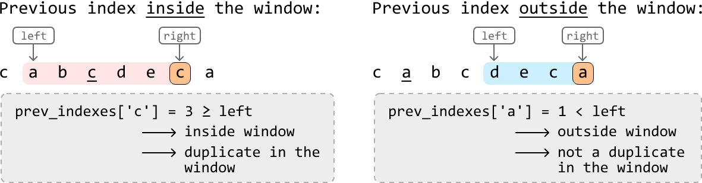

---

## Implementation — Optimized Approach
### Python
```python
def longest_substring_with_unique_chars_optimized(s: str) -> int:
    max_len = 0
    prev_indexes = {}
    left = right = 0
    while right < len(s):
        # If a previous index of the current character is present in the current
        # window, it's a duplicate character in the window.
        if s[right] in prev_indexes and prev_indexes[s[right]] >= left:
            # Shrink the window to exclude the previous occurrence of this character.
            left = prev_indexes[s[right]] + 1
        # Update 'max_len' if the current window is larger.
        max_len = max(max_len, right - left + 1)
        prev_indexes[s[right]] = right
        # Expand the window.
        right += 1
    return max_len
```
### JavaScript
```javascript
export function longest_substring_with_unique_chars(s) {
  let maxLen = 0
  const prevIndexes = {}
  let left = 0
  let right = 0
  while (right < s.length) {
    // If a previous index of the current character is present in the current
    // window, it's a duplicate character in the window.
    if (s[right] in prevIndexes && prevIndexes[s[right]] >= left) {
      // Shrink the window to exclude the previous occurrence of this character.
      left = prevIndexes[s[right]] + 1
    }
    // Update 'maxLen' if the current window is larger.
    maxLen = Math.max(maxLen, right - left + 1)
    prevIndexes[s[right]] = right
    // Expand the window.
    right += 1
  }
  return maxLen
}
```
### Java
```java
import java.util.HashMap;

public class Main {
    public Integer longest_substring_with_unique_chars_optimized(String s) {
        int maxLen = 0;
        HashMap<Character, Integer> prevIndexes = new HashMap<>();
        int left = 0, right = 0;
        while (right < s.length()) {
            char currChar = s.charAt(right);
            // If a previous index of the current character is present in the current
            // window, it's a duplicate character in the window.
            if (prevIndexes.containsKey(currChar) && prevIndexes.get(currChar) >= left) {
                // Shrink the window to exclude the previous occurrence of this character.
                left = prevIndexes.get(currChar) + 1;
            }
            // Update 'maxLen' if the current window is larger.
            maxLen = Math.max(maxLen, right - left + 1);
            prevIndexes.put(currChar, right);
            // Expand the window.
            right++;
        }
        return maxLen;
    }
}
```
---

## Complexity Analysis

**Time complexity:** The time complexity of the optimized implementation is $O(n)$ because we traverse the string linearly with two pointers.

**Space complexity:** The space complexity is $O(m)$ because we use a hash map to store unique characters, where $m$ represents the total number of unique characters within the string.

---

# Longest Uniform Substring After Replacements

A uniform substring is one in which all characters are identical. Given a string, determine the length of the longest uniform substring that can be formed by replacing up to k characters.

**Example:**

```
Input:  s = 'aabcdcca', k = 2
Output: 5
Explanation: if we can only replace 2 characters, the longest uniform substring we can achieve is "ccccc", obtained by replacing 'b' and 'd' with 'c'.
```

---

## Intuition

### Determining if a substring is uniform

Before we try finding the longest uniform substring, let's first determine the most efficient way to make a string uniform with the fewest character replacements. Consider the example below:


Which characters should we replace to ensure the minimum number of replacements are performed to make the string uniform? There are three main choices: make the string all `'a'`s, or all `'b'`s, or all `'c'`s. The most efficient choice, requiring the fewest replacements, is to make all characters `'a'`, which involves just three replacements:

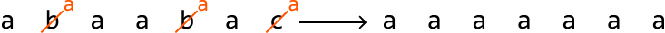

The key observation is that the minimum number of replacements needed to achieve uniformity is obtained by **replacing all characters except the most frequent one**.

This suggests that if we know the highest frequency of a character in a substring, we can determine if our value of `k` is sufficient to make that substring uniform. The number of characters that need to be replaced (`num_chars_to_replace`) can be found by subtracting this highest frequency from the total number of characters in the substring:

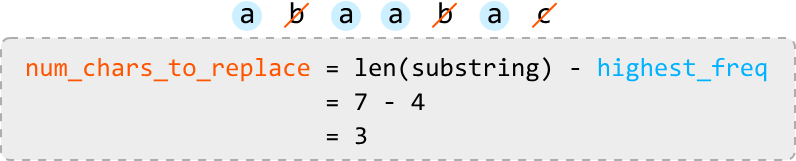

Once we've calculated `num_chars_to_replace` for a given substring, we can assess if the substring can be made uniform:

- If `num_chars_to_replace <= k`, the substring **can** be made uniform.
- If `num_chars_to_replace > k`, the substring **cannot** be made uniform.

To calculate `num_chars_to_replace`, we need to know the value of `highest_freq`. This requires tracking the frequency of each character, which can be efficiently managed using a hash map (`freqs`). This hash map allows us to update `highest_freq` whenever we encounter a character with a higher frequency. Below is an illustration of how `freqs` is updated:

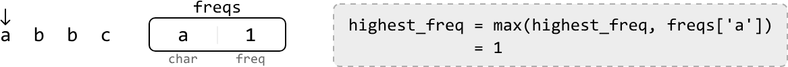
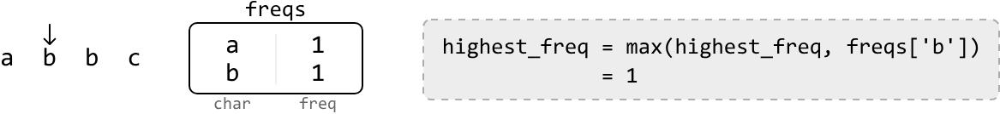
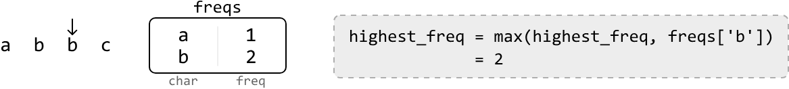
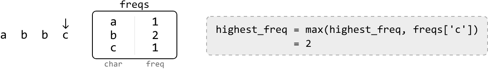

Now that we have the tools to determine if a substring can be made uniform, the next step is to figure out how to identify the longest uniform substring. Let's explore a technique that lets us do this.

---

## Dynamic Sliding Window

We know sliding windows can be useful for solving problems involving substrings. This problem requires that we find the longest substring that satisfies a specific condition:

```
num_chars_to_replace <= k
```

So, a dynamic sliding window might be appropriate, as discussed in the chapter introduction.

We can use the above condition to determine how to expand or shrink the window:

- If the condition is **met** (i.e., the window is valid), we **expand** the window to find a longer window that still meets this condition.
- If the condition is **violated** (i.e., the window is invalid), we **shrink** the window until it meets the condition again.

Let's see how this works over the example below:

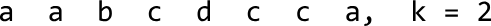

Start by defining the left and right boundaries of the window at index 0. Continue expanding the window for as long as it satisfies our condition (`num_chars_to_replace <= k`):

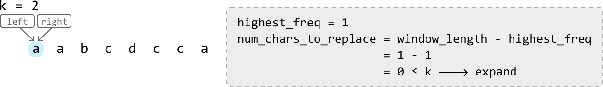
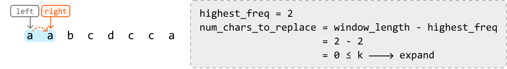
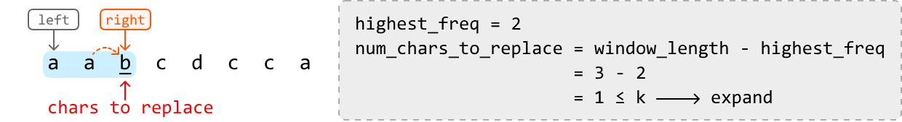
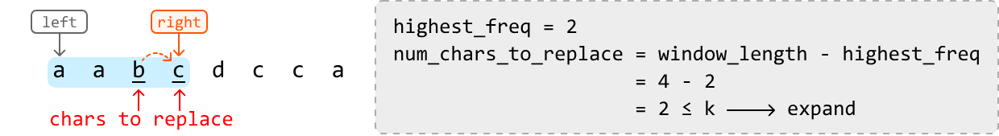

Once the window expands to the fifth character (`'d'`), it will contain 3 characters that must be replaced to make the window uniform. Since we can only replace up to `k = 2` characters, the window is invalid. So, we shrink the window:

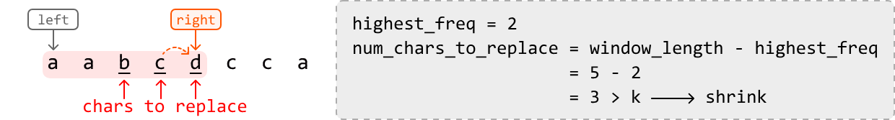
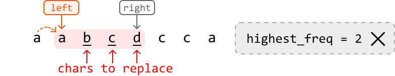

Notice that after shrinking the window, the value of `highest_freq` is still 2, which is no longer correct. Recall that our current method for updating `highest_freq` only increases it when encountering a character with a higher frequency, meaning `highest_freq` can only remain the same or increase, but it can **never decrease**.

One way to work around this is to develop a new method for updating `highest_freq` that accurately decreases it when the highest frequency in a window decreases. However, our goal is to find the **longest** substring that meets the condition, so shrinking the window might not even be necessary. The crucial point here is that when we find a valid window of a certain length, no shorter window will provide a longer uniform substring.

This means we can just **slide** the window instead of shrinking it whenever we encounter an invalid window, effectively maintaining the length of the current window.

With this observation, we should correct our previous logic:

- If the window **satisfies** the condition: **expand**.
- If the window **doesn't satisfy** the condition: **slide**.

Let's correct the action taken in the first invalid window above by sliding instead of shrinking. Then, we can continue processing the rest of the string.

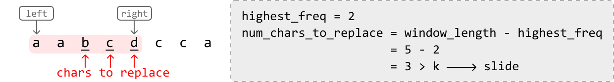

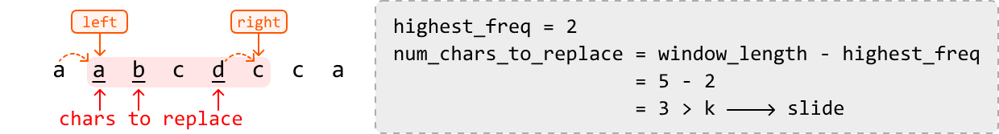

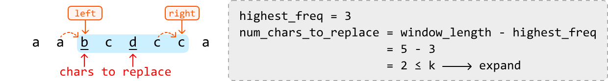

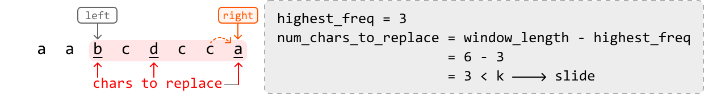

The above window is the final window because we cannot expand or slide it any further. The longest valid window encountered during this process is a window of length **5**.

---

 

## Implementation
### Python
```python
def longest_uniform_substring_after_replacements(s: str, k: int) -> int:
    freqs = {}
    highest_freq = max_len = 0
    left = right = 0
    while right < len(s):
        # Update the frequency of the character at the right pointer and the highest
        # frequency for the current window.
        freqs[s[right]] = freqs.get(s[right], 0) + 1
        highest_freq = max(highest_freq, freqs[s[right]])
        # Calculate replacements needed for the current window.
        num_chars_to_replace = (right - left + 1) - highest_freq
        # Slide the window if the number of replacements needed exceeds 'k'.
        # The right pointer always gets advanced, so we just need to advance 'left'.
        if num_chars_to_replace > k:
            # Remove the character at the left pointer from the hash map before
            # advancing the left pointer.
            freqs[s[left]] -= 1
            left += 1
        # Since the length of the current window increases or stays the same, assign
        # the length of the current window to 'max_len'.
        max_len = right - left + 1
        # Expand the window.
        right += 1
    return max_len
```
### JavaScript
```javascript
export function longest_uniform_substring_after_replacements(s, k) {
  const freqs = {}
  let highestFreq = 0
  let maxLen = 0
  let left = 0
  let right = 0
  while (right < s.length) {
    // Update the frequency of the character at the right pointer and the highest
    // frequency for the current window.
    const char = s[right]
    freqs[char] = (freqs[char] || 0) + 1
    highestFreq = Math.max(highestFreq, freqs[char])
    // Calculate replacements needed for the current window.
    const numCharsToReplace = right - left + 1 - highestFreq
    // Slide the window if the number of replacements needed exceeds 'k'.
    // The right pointer always gets advanced, so we just need to advance 'left'.
    if (numCharsToReplace > k) {
      freqs[s[left]] -= 1
      left += 1
    }
    // Since the length of the current window increases or stays the same, assign
    // the length of the current window to 'maxLen'.
    maxLen = right - left + 1
    // Expand the window.
    right += 1
  }
  return maxLen
}
```
### Java
```java
import java.util.HashMap;

public class Main {
    public int longest_uniform_substring_after_replacements(String s, int k) {
        HashMap<Character, Integer> freqs = new HashMap<>();
        int highestFreq = 0;
        int maxLen = 0;
        int left = 0, right = 0;
        while (right < s.length()) {
            // Update the frequency of the character at the right pointer and the highest
            // frequency for the current window.
            char ch = s.charAt(right);
            freqs.put(ch, freqs.getOrDefault(ch, 0) + 1);
            highestFreq = Math.max(highestFreq, freqs.get(ch));
            // Calculate replacements needed for the current window.
            int numCharsToReplace = (right - left + 1) - highestFreq;
            // Slide the window if the number of replacements needed exceeds 'k'.
            // The right pointer always gets advanced, so we just need to advance 'left'.
            if (numCharsToReplace > k) {
                char leftChar = s.charAt(left);
                freqs.put(leftChar, freqs.get(leftChar) - 1);
                left++;
            }
            // Since the length of the current window increases or stays the same, assign
            // the length of the current window to 'max_len'.
            maxLen = right - left + 1;
            // Expand the window.
            right++;
        }
        return maxLen;
    }
}
```

---

## Complexity Analysis

**Time complexity:** The time complexity of `longest_uniform_substring_after_replacements` is $O(n)$, where $n$ is the length of the input string. This is because we traverse the string linearly with two pointers.

**Space complexity:** The space complexity is $O(m)$, where $m$ is the number of unique characters in the string stored in the hash map `freqs`.