# 06. Binary Search

1. [Introduction to Binary Search](#introduction-to-binary-search)
2. [Find the Insertion Index](#find-the-insertion-index)
3. [First and Last Occurrences of a Number](#first-and-last-occurrences-of-a-number)
4. [Cutting Wood](#cutting-wood)
5. [Find the Target in a Rotated Sorted Array](#find-the-target-in-a-rotated-sorted-array)
6. [Find the Median From Two Sorted Arrays](#find-the-median-from-two-sorted-arrays)
7. [Matrix Search](#matrix-search)
8. [Local Maxima in Array](#local-maxima-in-array)
9. [Weighted Random Selection](#weighted-random-selection)

# Introduction to Binary Search

## Intuition

Let's say you have a standard, hard-copy English dictionary, and you want to find the definition of the word "inheritance." How could we do this?

One approach is to flick through it page by page, until reaching the page with "inheritance." But this is inefficient, and realistically, you're more likely to immediately open a page somewhere in the middle.

Let's say you do this and land on a page of words beginning with "M." Realizing that "inheritance" is somewhere to the left of "M" in the alphabet, you open a page somewhere between the letters "A" and "M." You continue this process of checking if "inheritance" is to the right or left of the current page, and narrowing the search down until you find the correct page. With this method, you've significantly reduced the number of pages to be searched, in contrast to linearly turning every page in order. This is the fundamental concept of binary search.

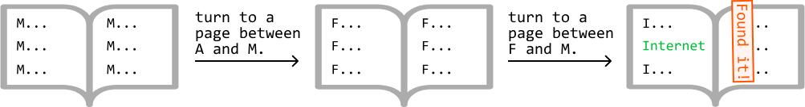

## Implementing Binary Search

Binary search is an algorithm that searches for a value in a sorted data set.

Even experienced developers can find it quite tricky to implement binary search correctly because "the devil's in the detail."

- How should the boundary variables `left` and `right` be initialized?
- Should we use `left < right` or `left ≤ right` as the exit condition in our while-loop?
- How should the boundary variables be updated? Should we choose `left = mid`, `left = mid + 1`, `right = mid`, or `right = mid - 1`?

This chapter offers clear, intuitive guidance on how to master these challenges, and confidently handle even the trickiest edge case.

To begin any binary search implementation, do the following:

1. Define the search space.
2. Define the behavior inside the loop for narrowing the search space.
3. Choose an exit condition for the while-loop.
4. Return the correct value.

Let's break down these steps.

### 1. Defining the search space

The search space encompasses all possible values that may include the value we're searching for. For instance, when searching for a target in a sorted array, the search space should cover the entire array, as the target could be anywhere within it. This is illustrated in the array below, where the `left` and `right` pointers define the search space:

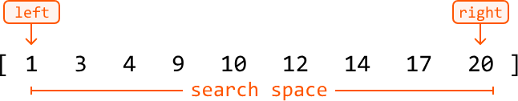

### 2. Narrowing the search space

Narrowing the search space involves progressively moving the `left` or `right` pointer inward until the search space is reduced to one element or none.

At each point in the binary search, we need to decide how we narrow our search space. We can either:

- Narrow the search space toward the left (by moving the `right` pointer inward):

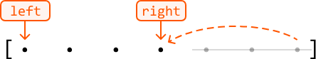

- Narrow the search space toward the right (by moving the `left` pointer inward):

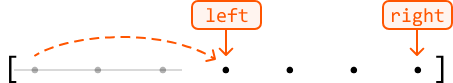

#### Using the midpoint

We decide whether to move the `left` or `right` pointer based on the value in the middle of the search space, indicated by the midpoint variable (`mid`).

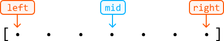

The main question to ask at each iteration of binary search is: is the value being searched for to the left or the right of the midpoint?

Here's the general idea: if the value we're looking for is to the right of the midpoint, narrow the search space toward the right. Otherwise, narrow the search space toward the left.

To narrow the search space towards the right, there are two options:

- `left = mid + 1`

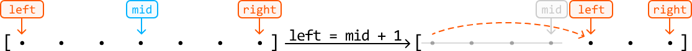

  We do this if the midpoint value is definitively not the value we're looking for and should excluded from the search space.

- `left = mid`

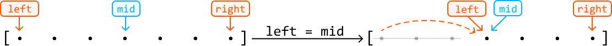

  We do this if the midpoint value itself could potentially be the value we're looking for and should still be included in the search space.

The exclude/include logic applies when narrowing the search space towards the left, as well (i.e., between `right = mid - 1` and `right = mid`).

#### Calculating the midpoint

In most cases, the midpoint is calculated using `mid = (left + right) // 2` in Python.[^1] To lower the risk of integer overflow, `mid = left + (right - left) // 2` is preferred in many other languages.

### 3. Choosing an exit condition

Choosing an exit condition for when the while-loop should terminate can be tricky. Our choices are primarily between `left < right` and `left ≤ right`. Both conditions are applicable in different situations.

When the exit condition is `left < right`, the while-loop will break when `left` and `right` meet.[^2]

On the other hand, `left ≤ right` ends once `left` has surpassed `right`.

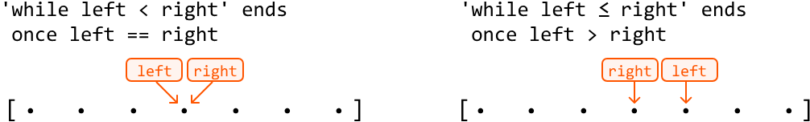

When the `left` and `right` pointers meet after exiting the `left < right` condition, both converge to a single value. This is the final value in the search space after the binary search process is complete. This will be the exit condition we use throughout this chapter.

### 4. Returning the correct value

As previously mentioned, the while-loop terminates once we've narrowed the search space down to a final value (assuming no value was returned during earlier iterations), pointed at by both `left` and `right`:

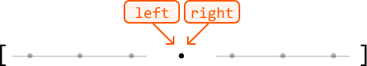

This final value is the answer we're looking for, assuming a valid answer exists.

## Time Complexity

The time complexity of the binary search is $O(\log(n))$, where $n$ is the number of values in the search space. The algorithm is logarithmic because, in each iteration of the algorithm, it divides the search space in half until a single value is located, or no value is found. This reduction by half in each step is characteristic of logarithmic behavior.

## Real-world Example

**Transaction search in financial systems:** In financial systems, a binary search can be used to quickly find a transaction or record by narrowing down the search range, as the data is typically stored in order. This makes it efficient to retrieve specific entries without searching through the entire database.

## Chapter Outline

Binary search has many applications, and we explore a range of problems covering various uses.

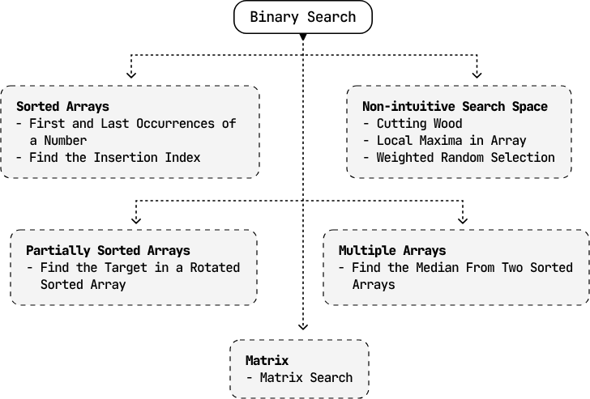


## Footnotes

[^1]: In rare cases, we calculate the midpoint differently, such as when doing an upper-bound binary search. The details are explained in the First and Last Occurrences of a Number problem.

[^2]: There are some rare situations where `left` and `right` will cross, which is also explored in the First and Last Occurrences of a Number problem.

---


# Find the Insertion Index

You are given a sorted array that contains unique values, along with an integer target.

- If the array contains the target value, return its index.
- Otherwise, return the insertion index. This is the index where the target would be if it were inserted in order, maintaining the sorted sequence of the array.

**Example 1:**
Input: nums = [1, 2, 4, 5, 7, 8, 9], target = 4
Output: 2

**Example 2:**
Input: nums = [1, 2, 4, 5, 7, 8, 9], target = 6
Output: 4
Explanation: 6 would be inserted at index 4 to be positioned between 5 and 7: [1, 2, 4, 5, 6, 7, 8, 9].

## Intuition

The goal of this problem varies depending on whether the sorted input array contains the target value or not. If it does, we should return its index. If it doesn't, we return its insertion index.

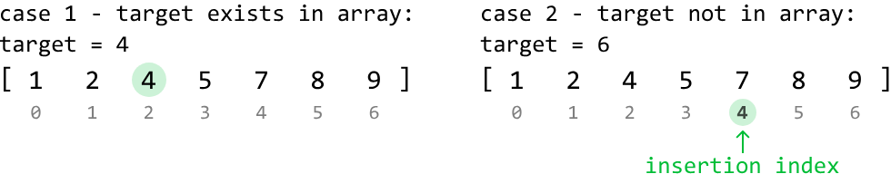

When the target doesn't exist in the array, we observe the insertion index is found at the first value in the array greater than the target, as can be seen in the second diagram above, where the first value larger than the target of 6, is 7.

Since we don't know if the target exists in the array before we start looking for it, we can combine both cases by finding the first value greater than or equal to the target. This gives us a universal objective regardless of whether the target is in the array or not.

As the array is sorted, we can use binary search to find the desired index.

## Binary search

In this binary search, we're effectively looking for the first value that matches a condition, where the condition is that the number is greater than or equal to the target. Let's visualize which values of the array meet this condition and which don't:

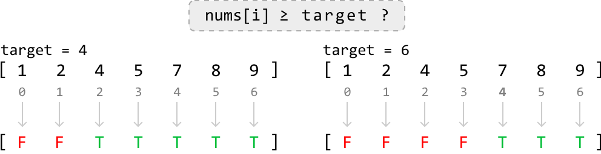

From this diagram, we can see the value we want to find is effectively the lower bound of values that satisfy this condition:

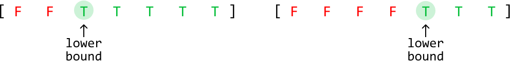

Note that finding the lower bound is equivalent to finding the leftmost value. With this in mind, let's come up with an algorithm.

First, define the search space. If the target exists in the array, it could be located at any index within the range from 0 to n - 1. However, if the target is not in the array and is larger than all the elements, its insertion index is n. Therefore, our search space should cover all indexes in the range [0, n].

To figure out how we narrow the search space, let's first explore an example array that contains the target, then dive into an example where the array doesn't contain the target.

### Target exists in the array

Consider searching for target value 4 in the following sorted array.

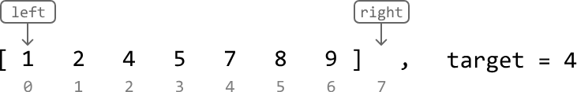

Initially, the midpoint is positioned at element 5, which is a number that satisfies our condition of being greater than or equal to the target. This means the lower bound is either at this midpoint, or to its left since the lower bound is the leftmost value that satisfies the condition.

So, narrow the search space toward the left, while including the midpoint (i.e., `right = mid`):

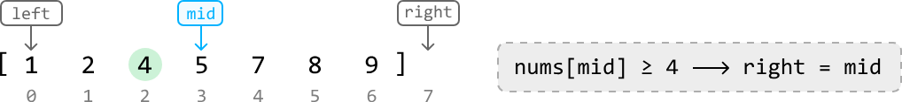

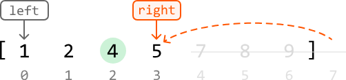

Now, the midpoint is positioned at element 2. The lower bound should be a value greater than or equal to the target (4), which means the current midpoint is too small. To look for a larger value, we need to search to the right of the midpoint.

So, narrow the search space toward the right while excluding the midpoint:

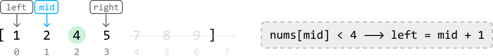

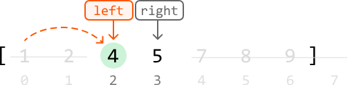

Now, the midpoint is positioned at element 4, which satisfies the condition of being greater than or equal to the target. So, narrow the search space toward the left while including the midpoint:

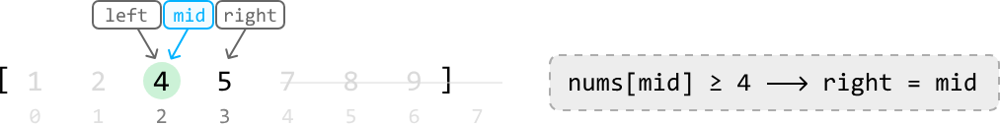

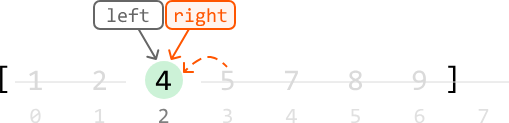

Once the `left` and `right` pointers meet, the lower bound is located, which is the first value greater than or equal to the target. Now, we just return `left` to return this value's index.

### Target doesn't exist in the array

Let's test the above logic in the following example where the target is not in the array:

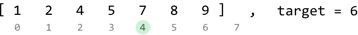

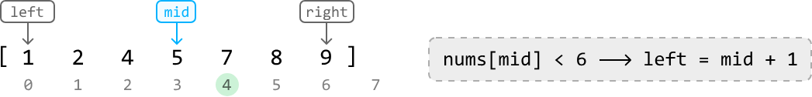

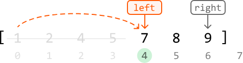

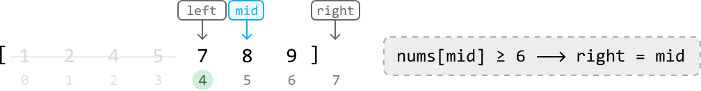

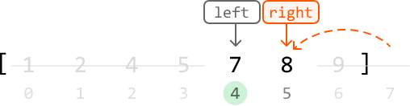

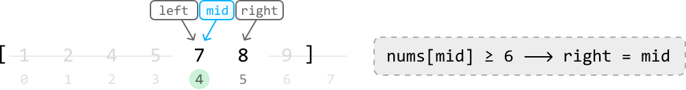

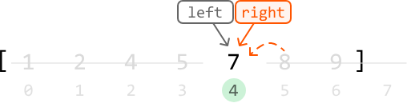

As we can see, by the end of the binary search, we've narrowed down the search space to a single value, identifying index 4 as the insertion index. Return `left`.

## Summary

For clarity, let's summarize the two main scenarios we encounter while narrowing down the search space.

**Case 1:** The midpoint value is greater than or equal to the target, indicating the lower bound is either at the midpoint, or to its left. In this case, we narrow the search space toward the left, ensuring the midpoint is included:

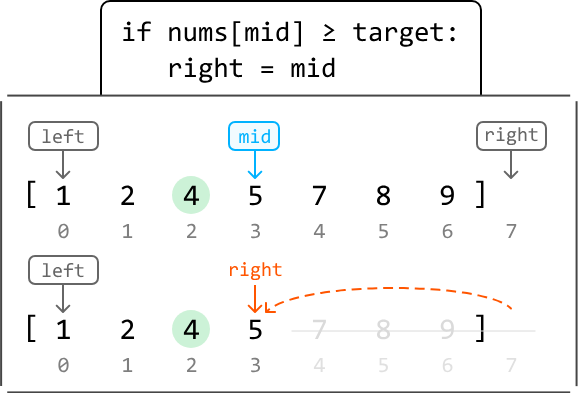

**Case 2:** The midpoint value is less than the target, indicating the lower bound is somewhere to the right. In this case, we narrow the search space toward the right, ensuring the midpoint is excluded:

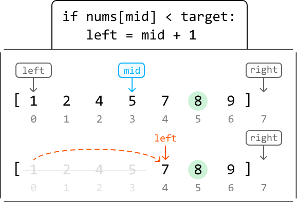

## Try it yourself

Write your solution to the problem before checking the reference implementation.

## Implementation

### Python | JavaScript | Java

```python
from typing import List
    
def find_the_insertion_index(nums: List[int], target: int) -> int:
    left, right = 0, len(nums)
    while left < right:
        mid = (left + right) // 2
        # If the midpoint value is greater than or equal to the target, the lower
        # bound is either at the midpoint, or to its left.
        if nums[mid] >= target:
            right = mid
        # The midpoint value is less than the target, indicating the lower bound is
        # somewhere to the right.
        else:
            left = mid + 1
    return left
```
### JavaScript
```javascript
export function find_the_insertion_index(nums, target) {
  let left = 0
  let right = nums.length
  while (left < right) {
    const mid = Math.floor((left + right) / 2)
    // If the midpoint value is greater than or equal to the target, the lower
    // bound is either at the midpoint, or to its left.
    if (nums[mid] >= target) {
      right = mid
    }
    // The midpoint value is less than the target, indicating the lower bound is
    // somewhere to the right.
    else {
      left = mid + 1
    }
  }
  return left
}
```
### Java
```java
import java.util.ArrayList;

public class Main {
    public int find_the_insertion_index(ArrayList<Integer> nums, int target) {
        int left = 0, right = nums.size();
        while (left < right) {
            int mid = (left + right) / 2;
            // If the midpoint value is greater than or equal to the target, the lower
            // bound is either at the midpoint, or to its left.
            if (nums.get(mid) >= target) {
                right = mid;
            }
            // The midpoint value is less than the target, indicating the lower bound is
            // somewhere to the right.
            else {
                left = mid + 1;
            }
        }
        return left;
    }
}
```


## Complexity Analysis

**Time complexity:** The time complexity of `find_the_insertion_index` is $O(\log(n))$ because it performs a binary search over a search space of size $n+1$.

**Space complexity:** The space complexity is $O(1)$.

---


# First and Last Occurrences of a Number

Given an array of integers sorted in non-decreasing order, return the first and last indexes of a target number. If the target is not found, return `[-1, -1]`.

**Example 1:**
Input: nums = [1, 2, 3, 4, 4, 4, 5, 6, 7, 8, 9, 10, 11],
       target = 4
Output: [3, 5]
Explanation: The first and last occurrences of number 4 are indexes 3 and 5, respectively.

## Intuition

A brute-force solution to this problem involves a linear search to find the first and last occurrences of the target number. However, since the array is sorted, we can try searching for these two occurrences using binary search.

The challenge of using binary search here is that we need to find two separate occurrences of the same number. This means that a standard binary search alone isn't sufficient.

To help us find a solution, it's important to understand that the problem is effectively asking us to find the lower and upper bound of a number in the array:

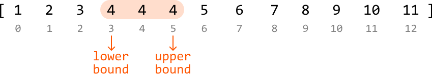

This indicates we can solve this problem in two main steps:

1. Perform a binary search to find the lower bound of the target.
2. Perform a binary search to find the upper bound of the target.

## Lower-bound binary search

To find the start position of the target, let's first define the search space. The target could be anywhere in the array, so the search space should encompass all the array's indexes.

Next, let's figure out how to narrow the search space. At each point in the binary search, there are three conditions to consider based on the midpoint value:

- when it's greater than the target
- when it's less than the target
- when it's equal to the target

In each of these cases, think about where the target is in relation to the midpoint. Note that we're effectively looking for the leftmost occurrence of the target value.

### Midpoint value is greater than the target

If the midpoint value is greater, it means the target is to the left of this number. So, narrow the search space toward the left.

When we do this, we can exclude the midpoint from the search space (i.e., `right = mid - 1`) because its value is not equal to the target:

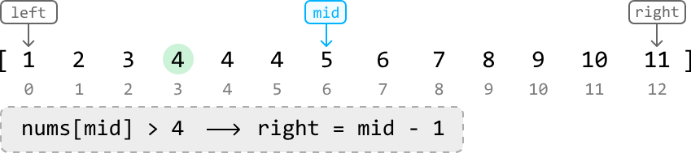

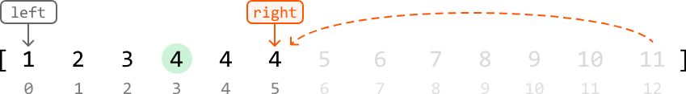

### Midpoint value is less than the target

If the midpoint value is smaller, it means the target is to the right of this number. So, narrow the search space toward the right. Again, we can exclude the midpoint from the search space (i.e., `left = mid + 1`) because its value is not equal to the target:

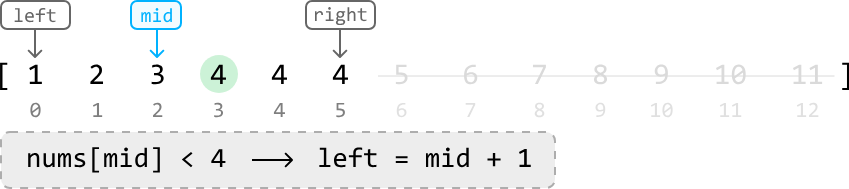

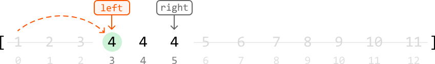

### Midpoint value is equal to the target

Now is when things get interesting. When the midpoint value is equal to the target, there are two possibilities:

1. This is the lower bound of the target value.
2. This is not the lower bound, so the lower bound is somewhere further to the left.

We don't know which possibility is true at the moment, so we should narrow the search space toward the left to continue looking for the lower bound, while also including the midpoint itself in the search space (i.e., `right = mid`).

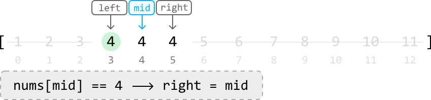

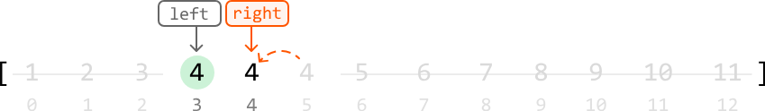

Continue this reasoning for the next midpoint as it's also equal to the target:

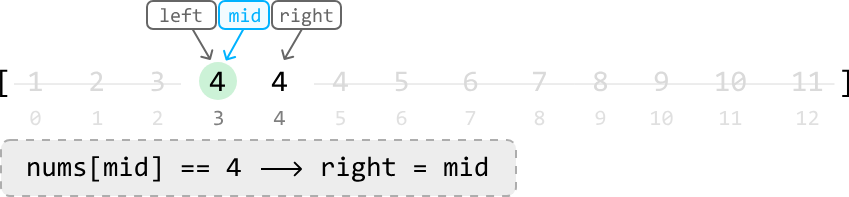

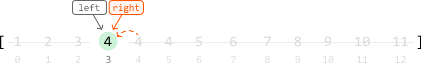

The final value, once the `left` and `right` pointers meet, is the lower bound of the target.

## Upper-bound binary search

There's a lot of similarity between this and lower-bound binary search. For starters, the search space is identical. Additionally, the cases when the midpoint value is greater than or less than the target are handled the same. This makes sense because, in both binary searches, we're seeking the same target value. So, when the midpoint value is not equal to the target, the actions we take will be the same as the actions taken in the lower-bound binary search.

The difference in logic occurs when the midpoint is equal to the target, as we're now looking for the rightmost value of the target, instead of the leftmost value. As such, let's just focus on the logic for when the midpoint value is equal to the target.

### Midpoint value is equal to the target

Similar to lower-bound binary search, there are two possibilities: either this is the upper bound, or it's not. Again, we're not sure which is true. So, let's narrow the search space toward the right to continue looking for an upper bound while including the midpoint in the search space (i.e., `left = mid`):

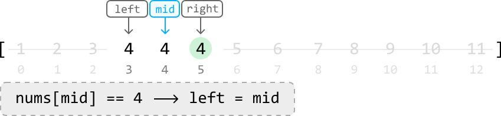

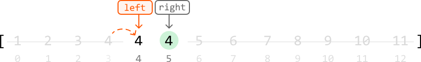

When we continue this logic for the next midpoint values, we notice something peculiar happen:

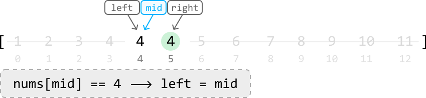

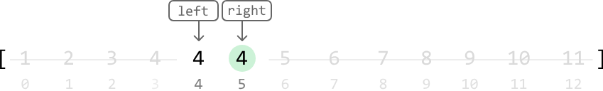


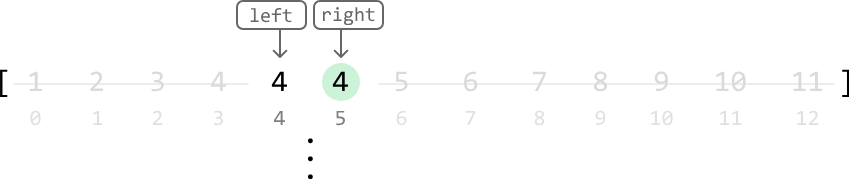

It looks like we just got stuck in an infinite loop, where the position of the `left` pointer keeps getting set to `mid` when they're both at the same index. Why does this happen?

### Debugging the infinite loop

When the `left` and `right` pointers are directly next to each other, `mid` ends up being positioned where the `left` pointer is:

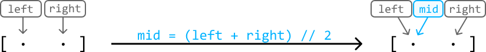

Since one of our operations is `left = mid`, we get stuck in an infinite loop where `left` and `mid` are continuously set to each other's positions, which means progress cannot be made. The reason this wasn't a problem during lower-bound binary search was that we never had `left = mid` as an operation in the logic. One way to avoid this issue is by biasing the midpoint to the right.

When the midpoint is biased to the right, we avoid an infinite loop during upper-bound binary search.

- We no longer need to worry about the `left` pointer since `mid` is now being positioned at the `right` pointer when the search space has two elements.
- We won't encounter any infinite loops with the `right` pointer because it never gets set to the midpoint's position, as we use `right = mid - 1`.

A right bias of the midpoint can be achieved using `mid = (left + right) // 2 + 1`:

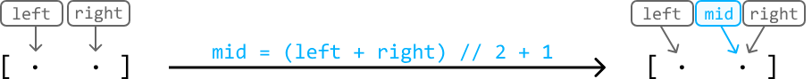

Now, performing `left = mid` allows us to properly narrow the search space.

> As a general rule, in upper-bound binary search, we should bias `mid` to the right.

Let's apply this change to the same example and see what happens:


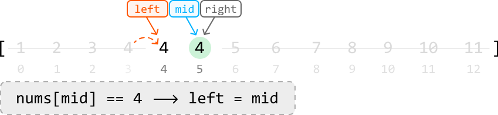

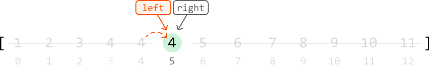

As we can see, we've avoided an infinite loop, with the `left` and `right` pointers meeting at the upper bound of the target.

## If the target doesn't exist

The last step in both algorithms is to check that the final values located are equal to the target. If the target does not exist in the array, the final values in both binary search algorithms won't be equal to the target. In this case, we should return `-1`.

## Try it yourself

Write your solution to the problem before checking the reference implementation.

## Implementation

### Python | JavaScript | Java

```python
from typing import List
    
def first_and_last_occurrences_of_a_number(nums: List[int], target: int) -> List[int]:
    lower_bound = lower_bound_binary_search(nums, target)
    upper_bound = upper_bound_binary_search(nums, target)
    return [lower_bound, upper_bound]
    
def lower_bound_binary_search(nums: List[int], target: int) -> int:
    left, right = 0, len(nums) - 1
    while left < right:
        mid = (left + right) // 2
        if nums[mid] > target:
            right = mid - 1
        elif nums[mid] < target:
            left = mid + 1
        else:
            right = mid
    return left if nums and nums[left] == target else -1
    
def upper_bound_binary_search(nums: List[int], target: int) -> int:
    left, right = 0, len(nums) - 1
    while left < right:
        # In upper-bound binary search, bias the midpoint to the right.
        mid = (left + right) // 2 + 1
        if nums[mid] > target:
            right = mid - 1
        elif nums[mid] < target:
            left = mid + 1
        else:
            left = mid
    # If the target doesn't exist in the array, then it's possible that
    # 'left = mid + 1' places the left pointer outside the array when `mid == n - 1`.
    # So, we use the right pointer in the return statement instead.
    return right if nums and nums[right] == target else -1
```

### JavaScript
```javascript
export function first_and_last_occurrences_of_a_number(nums, target) {
  const lowerBound = lowerBoundBinarySearch(nums, target)
  const upperBound = upperBoundBinarySearch(nums, target)
  return [lowerBound, upperBound]
}

function lowerBoundBinarySearch(nums, target) {
  let left = 0
  let right = nums.length - 1
  while (left < right) {
    const mid = Math.floor((left + right) / 2)
    if (nums[mid] > target) {
      right = mid - 1
    } else if (nums[mid] < target) {
      left = mid + 1
    } else {
      right = mid
    }
  }
  return nums.length && nums[left] === target ? left : -1
}

function upperBoundBinarySearch(nums, target) {
  let left = 0
  let right = nums.length - 1
  while (left < right) {
    // In upper-bound binary search, bias the midpoint to the right.
    const mid = Math.floor((left + right) / 2) + 1
    if (nums[mid] > target) {
      right = mid - 1
    } else if (nums[mid] < target) {
      left = mid + 1
    } else {
      left = mid
    }
  }
  // Handle out-of-bound access if the target doesn’t exist
  return nums.length && nums[right] === target ? right : -1
}
```


### Java
```java
import java.util.ArrayList;

public class Main {
    public ArrayList<Integer> first_and_last_occurrences_of_a_number(ArrayList<Integer> nums, int target) {
        int lower = lower_bound_binary_search(nums, target);
        int upper = upper_bound_binary_search(nums, target);
        ArrayList<Integer> result = new ArrayList<>();
        result.add(lower);
        result.add(upper);
        return result;
    }

    public int lower_bound_binary_search(ArrayList<Integer> nums, int target) {
        int left = 0, right = nums.size() - 1;
        while (left < right) {
            int mid = (left + right) / 2;
            if (nums.get(mid) > target) {
                right = mid - 1;
            } else if (nums.get(mid) < target) {
                left = mid + 1;
            } else {
                right = mid;
            }
        }
        return !nums.isEmpty() && nums.get(left) == target ? left : -1;
    }

    public int upper_bound_binary_search(ArrayList<Integer> nums, int target) {
        int left = 0, right = nums.size() - 1;
        while (left < right) {
            // In upper-bound binary search, bias the midpoint to the right.
            int mid = (left + right) / 2 + 1;
            if (nums.get(mid) > target) {
                right = mid - 1;
            } else if (nums.get(mid) < target) {
                left = mid + 1;
            } else {
                left = mid;
            }
        }
        // If the target doesn’t exist in the array, then it's possible that
        // 'left = mid + 1' places the left pointer outside the array when `mid == n - 1`.
        // So, we use the right pointer in the return statement instead.
        return !nums.isEmpty() && nums.get(right) == target ? right : -1;
    }
}
```

## Complexity Analysis

**Time complexity:** The time complexity of both the `lower_bound_binary_search` and `upper_bound_binary_search` helper functions is $O(\log(n))$, where $n$ is the length of the input array. This is because each function performs a binary search over the entire array. Therefore, `first_and_last_occurrences_of_a_number` is also $O(\log(n))$ because it calls each helper function once.

**Space complexity:** The space complexity is $O(1)$.

## Interview Tip

> **Tip: Always test your algorithm.**
> Binary search can be a tricky algorithm to implement. The best way to uncover unexpected errors is to test your code. The infinite loop encountered during the upper-bound binary search problem is quite easy to miss while designing the algorithm. If you're unable to recognize this issue during implementation, manual testing can help reveal it. In binary search, an infinite loop can be uncovered when testing a search space that contains just two elements, similar to what we did in the explanation.


---


# Cutting Wood

You are given an array representing the heights of trees, and an integer k representing the total length of wood that needs to be cut.

For this task, a woodcutting machine is set to a certain height, H. The machine cuts off the top part of all trees taller than H, while trees shorter than H remain untouched. Determine the highest possible setting of the woodcutter (H) so that it cuts at least k meters of wood.

Assume the woodcutter cannot be set higher than the height of the tallest tree in the array.

**Example:**

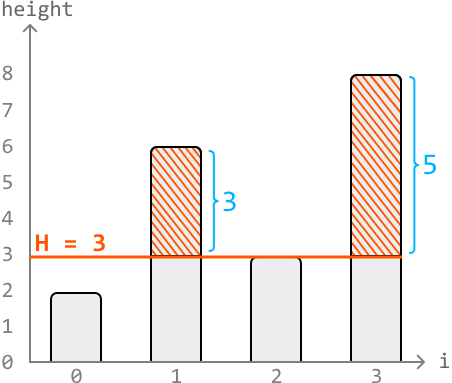

Input: heights = [2, 6, 3, 8], k = 7
Output: 3
Explanation: The highest possible height setting that yields at least k = 7 meters of wood is 3, which yields 8 meters of wood. Any height setting higher than this will yield less than 7 meters of wood.

**Constraints:**
- It's always possible to attain at least k meters of wood.
- There's at least one tree.

## Intuition

At first, it might strike you as strange that this problem is in the Binary Search chapter. The given input array isn't necessarily sorted, so how is binary search applicable here? Well, this is an example of a common application of binary search, where the search space does not encompass the input array.

Let's consider a visualization of four trees of heights [2, 6, 3, 8] and assume k = 7:

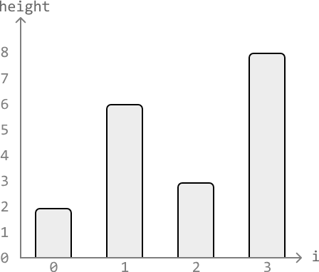

The tallest tree above has a height of 8. So the height setting, H, can be set to any height between 0 and 8.

- The most amount of wood is cut at H = 0, where all trees are cut from the bottom.
- The least amount of wood is cut at H = 8, where no wood is cut at all.

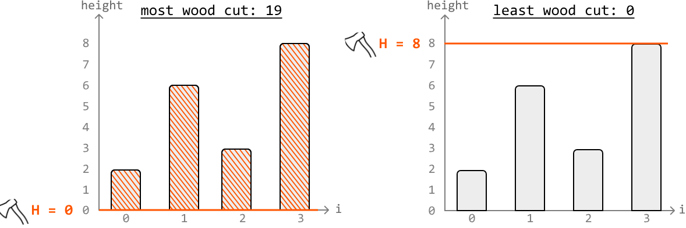

Gradually increasing the height setting of the woodcutter from H = 0 to H = 8 yields less and less wood, and our goal is to find the highest value of H that gives us at least k meters of wood.

## Determining if a height setting yields enough wood

We need a function that determines if any given height setting H yields at least k meters of wood.

Let's name this function `cuts_enough_wood(H, k)`, which will calculate the total wood obtained by cutting the trees taller than H, and return true if this total meets or exceeds k. Below is a visual representation of how to determine if a height setting of 3 yields enough wood in the example:


Applying this function to all possible values of H (from 0 to 8) gives us the outcome below, where heights 0 to 3 yield at least k meters of wood and heights 4 to 8 are too high and don't yield enough. Note that here, we visualize which H values make the function `cuts_enough_wood` return true, and which will result in false.


We could call `cuts_enough_wood` on each value of H from 0 to 8 until we reach the highest value that still causes `cuts_enough_wood` to return true. However, a key observation is that the above sequence of boolean outcomes is effectively a sorted sequence, since all true outcomes are positioned before false ones.

As this is a sorted sequence, we should try using binary search.

## Binary search

The goal is to find the last value of H that cuts at least k meters of wood. In other words, we're looking for the upper bound value of H that satisfies this condition.


As such, we should use upper-bound binary search. This means we'll need to calculate the midpoint using `mid = (left + right) // 2 + 1`, as mentioned in the First and Last Occurrences of a Number problem.

Let's first define the search space. Our search space should encompass all values of H between 0 and the height of the tallest tree in the array, as these are all possible answers.

To figure out how to narrow the search space, let's use the example below, setting `left` and `right` pointers at the ends of the search space:


Initially, the midpoint is set to H = 4. When we call `cuts_enough_wood(4, k)`, it returns false. This means the height setting is not yielding enough wood and is, hence, set too high. To find a lower height setting, we should narrow our search space toward the left:


The next midpoint is set to H = 2. When we call `cuts_enough_wood(2, k)`, it returns true. This means the upper bound is either at the midpoint or to its right, as the upper bound is the rightmost height setting that cuts enough wood.

So, narrow the search space toward the right while including the midpoint:


The next midpoint is set to H = 3. When we call `cuts_enough_wood(3, k)`, it returns true. So, narrow the search space toward the right while including the midpoint:


Once the `left` and `right` pointers meet, we have located the upper bound height setting that yields at least k meters of wood.

## Summary

**Case 1:** The midpoint is set at a height that allows us to cut at least k meters of wood, indicating the upper bound is somewhere to the right. Narrow the search space to the right while including the midpoint:


**Case 2:** The midpoint is at a height that doesn't allow us to cut enough wood, indicating the upper bound is somewhere to the left. Narrow the search space to the left while excluding the midpoint:


## Try it yourself

Write your solution to the problem before checking the reference implementation.

## Implementation

### Python | JavaScript | Java

```python
from typing import List
    
def cutting_wood(heights: List[int], k: int) -> int:
    left, right = 0, max(heights)
    while left < right:
        # Bias the midpoint to the right during the upper-bound binary search.
        mid = (left + right) // 2 + 1
        if cuts_enough_wood(mid, k, heights):
            left = mid
        else:
            right = mid - 1
    return right
    
# Determine if the current value of 'H' cuts at least 'k' meters of wood.
def cuts_enough_wood(H: int, k: int, heights: List[int]) -> bool:
    wood_collected = 0
    for height in heights:
        if height > H:
            wood_collected += (height - H)
    return wood_collected >= k
```

### JavaScript
```javascript
export function cutting_wood(heights, k) {
  let left = 0
  let right = Math.max(...heights)
  while (left < right) {
    // Bias the midpoint to the right during the upper-bound binary search.
    const mid = Math.floor((left + right) / 2) + 1

    if (cutsEnoughWood(mid, k, heights)) {
      left = mid
    } else {
      right = mid - 1
    }
  }
  return right
}

// Determine if the current value of 'H' cuts at least 'k' meters of wood.
function cutsEnoughWood(H, k, heights) {
  let wood_collected = 0
  for (const height of heights) {
    if (height > H) {
      wood_collected += height - H
    }
  }
  return wood_collected >= k
}
```

### Java
```java
import java.util.ArrayList;

public class Main {
    public int cutting_wood(ArrayList<Integer> heights, int k) {
        int left = 0;
        int right = max(heights);
        while (left < right) {
            // Bias the midpoint to the right during the upper-bound binary search.
            int mid = (left + right) / 2 + 1;
            if (cutsEnoughWood(mid, k, heights)) {
                left = mid;
            } else {
                right = mid - 1;
            }
        }
        return right;
    }

    // Determine if the current value of 'H' cuts at least 'k' meters of wood.
    public boolean cutsEnoughWood(int H, int k, ArrayList<Integer> heights) {
        int wood_collected = 0;
        for (int height : heights) {
            if (height > H) {
                wood_collected += (height - H);
            }
        }
        return wood_collected >= k;
    }

    private int max(ArrayList<Integer> list) {
        int maxVal = Integer.MIN_VALUE;
        for (int num : list) {
            if (num > maxVal) {
                maxVal = num;
            }
        }
        return maxVal;
    }
}
```

## Complexity Analysis

**Time complexity:** The time complexity of `cutting_wood` is $O(n\log(m))$, where $m$ is the maximum height of the trees. This is because we perform a binary search over the range [0, $m$]. Each iteration of the binary search calls the `cuts_enough_wood` function, which runs in $O(n)$ time, where $n$ is the number of trees. This results in an overall time complexity of $O(\log(m)) \cdot O(n) = O(n\log(m))$.

**Space complexity:** The space complexity is $O(1)$.

---


# Find the Target in a Rotated Sorted Array

A rotated sorted array is an array of numbers sorted in ascending order, in which a portion of the array is moved from the beginning to the end. For example, a possible rotation of [1, 2, 3, 4, 5] is [3, 4, 5, 1, 2], where the first two numbers are moved to the end.

Given a rotated sorted array of unique numbers, return the index of a target value. If the target value is not present, return `-1`.

**Example:**
Input: nums = [8, 9, 1, 2, 3, 4, 5, 6, 7], target = 1
Output: 2

## Intuition

A naive solution is to iterate through the input array until we find the target number. This strategy takes linear time, and doesn't take into account that the input is a rotated sorted array. Given the array was sorted before it was rotated, we should figure out how binary search might be useful in finding the target.

First, let's define the search space for the binary search. Since the target value could exist anywhere in the array, the search space should encompass the entire array.

Now, let's figure out how to narrow the search space, which is an interesting challenge considering the array isn't perfectly sorted. Let's work through this by exploring an example:


Let's set `left` and `right` pointers at the boundaries of the array and consider the first midpoint value:


In a normal sorted array, we'd be able to logically assess whether to search to the left or the right of the midpoint, based solely on the midpoint value and the target. In a rotated sorted array, it's much less straightforward to determine which side the target value is on.

To decide whether to narrow the search space toward the left or right of the midpoint, let's visualize the height of each number in the array and pay attention to subarrays `[left : mid]` and `[mid : right]` separately. Note, we include the midpoint in both subarrays since the midpoint is used to decide which subarray to narrow the search space towards:


Here, we see the subarray `[mid : right]` is sorted in ascending order. Since it's sorted, we know what the smallest and largest numbers in that range are: 3 and 7, respectively. This means we can check if the target is in this subarray by checking if it's in between 3 and 7. The target (1) is not in this range, so therefore, it must be in the left subarray.

So, we should narrow the search space toward the left, excluding the midpoint (`right = mid - 1`):


The reason we excluded the midpoint value was because it wasn't equal to the target, and so should no longer be considered in the search space.

Let's continue with the example.


This time, the sorted subarray is the left subarray, `[left : mid]`. So, we can use this subarray to check where the target value is. Since the target (1) doesn't fall within the range between 8 and 9, it indicates the target resides in the right subarray. Therefore, we narrow our search space toward the right, excluding the midpoint (`left = mid + 1`):


Again, we excluded the midpoint value (9) as it was not equal to the target.

Finally, we've found the target at the midpoint, so we can return its index (`mid`):


## Summary

From our discussion above, an important strategy emerges: between the two subarrays, `[left : mid]` and `[mid : right]`, we can use the sorted one to determine where the target is.

Before examining the subarrays, let's first compare the target with the value at the midpoint. If they match, we've found our target at `mid`. If not, then we decide where to adjust our search depending on which subarray is sorted, as detailed in the following two test cases:

**Case 1: the left subarray, `[left : mid]`, is sorted**

- If the target falls in the range of this left subarray, we narrow the search space toward the left.
- Otherwise, we narrow the search space toward the right.


**Case 2: the right subarray, `[mid : right]` is sorted**

- If the target falls in the range of this right subarray, we narrow the search space toward the right.
- Otherwise, narrow the search space toward the left.


It's possible to encounter a situation where both subarrays are sorted. In this case, it doesn't matter which subarray we use to check where the target is.

One final thing to note is that the array might not contain the target value at all. In this case, once the binary search terminates and narrows down to a single value, we need to check if this value is the target. If not, it indicates the target is not present in the array, and we return `-1`.

## Try it yourself

Write your solution to the problem before checking the reference implementation.

## Implementation

### Python | JavaScript | Java

```python
from typing import List
    
def find_the_target_in_a_rotated_sorted_array(nums: List[int], target: int) -> int:
    left, right = 0, len(nums) - 1
    while left < right:
        mid = (left + right) // 2
        if nums[mid] == target:
            return mid
        # If the left subarray [left : mid] is sorted, check if the target falls in
        # this range. If it does, search the left subarray. Otherwise, search the
        # right.
        elif nums[left] <= nums[mid]:
            if nums[left] <= target < nums[mid]:
                right = mid - 1
            else:
                left = mid + 1
        # If the right subarray [mid : right] is sorted, check if the target falls
        # in this range. If it does, search the right subarray. Otherwise, search the
        # left.
        else:
            if nums[mid] < target <= nums[right]:
                left = mid + 1
            else:
                right = mid - 1
    # If the target is found in the array, return it's index. Otherwise, return -1.
    return left if nums and nums[left] == target else -1
```

### JavaScript
```javascript
export function find_the_target_in_a_rotated_sorted_array(nums, target) {
  let left = 0
  let right = nums.length - 1
  while (left < right) {
    const mid = Math.floor((left + right) / 2)
    if (nums[mid] === target) {
      return mid
    }
    // If the left subarray [left : mid] is sorted, check if the target falls in this range.
    if (nums[left] <= nums[mid]) {
      if (nums[left] <= target && target < nums[mid]) {
        right = mid - 1
      } else {
        left = mid + 1
      }
    }
    // If the right subarray [mid : right] is sorted, check if the target falls in this range.
    else {
      if (nums[mid] < target && target <= nums[right]) {
        left = mid + 1
      } else {
        right = mid - 1
      }
    }
  }
  // If the target is found in the array, return its index. Otherwise, return -1.
  return nums[left] === target ? left : -1
}
```

### Java
```java
import java.util.ArrayList;

public class Main {
    public int find_the_target_in_a_rotated_sorted_array(ArrayList<Integer> nums, int target) {
        int left = 0, right = nums.size() - 1;
        while (left < right) {
            int mid = (left + right) / 2;
            if (nums.get(mid) == target) {
                return mid;
            }
            // If the left subarray [left : mid] is sorted, check if the target falls in
            // this range. If it does, search the left subarray. Otherwise, search the
            // right.
            else if (nums.get(left) <= nums.get(mid)) {
                if (nums.get(left) <= target && target < nums.get(mid)) {
                    right = mid - 1;
                } else {
                    left = mid + 1;
                }
            }
            // If the right subarray [mid : right] is sorted, check if the target falls
            // in this range. If it does, search the right subarray. Otherwise, search the
            // left.
            else {
                if (nums.get(mid) < target && target <= nums.get(right)) {
                    left = mid + 1;
                } else {
                    right = mid - 1;
                }
            }
        }
        // If the target is found in the array, return it’s index. Otherwise, return -1.
        return (!nums.isEmpty() && nums.get(left) == target) ? left : -1;
    }
}
```

## Complexity Analysis

**Time complexity:** The time complexity of `find_the_target_in_a_rotated_sorted_array` is $O(\log(n))$ because we're performing a binary search over an array of length $n$.

**Space complexity:** The space complexity is $O(1)$.

---


# Find the Median From Two Sorted Arrays

Given two sorted integer arrays, find their median value as if they were merged into a single sorted sequence.

**Example 1:**
Input: nums1 = [0, 2, 5, 6, 8], nums2 = [1, 3, 7]
Output: 4.0
Explanation: Merging both arrays results in [0, 1, 2, 3, 5, 6, 7, 8], which has a median of (3 + 5) / 2 = 4.0.

**Example 2:**
Input: nums1 = [0, 2, 5, 6, 8], nums2 = [1, 3, 7, 9]
Output: 5.0
Explanation: Merging both arrays results in [0, 1, 2, 3, 5, 6, 7, 8, 9], which has a median of 5.

**Constraints:**
- At least one of the input arrays will contain an element.

## Intuition

The brute force approach to this problem involves merging both arrays and finding the median in this merged array. This approach takes $O((m+n)\log(m+n))$ time where $m$ and $n$ denote the lengths of each array, respectively. This complexity is primarily due to the cost of sorting the merged array of length $m+n$. This approach can be improved to $O(m+n)$ time by merging both arrays in order, which is possible because both arrays are already sorted. However, is there a way to find the median without merging the two arrays?

In this explanation, we use "total length" to refer to the combined length of both input arrays. Let's discuss odd and even total lengths separately, as these result in two different types of medians.

Consider the following two arrays that have an even total length:


Below is what these two arrays would look like when merged. Let's see if we can draw any insights from this.


Observe that the merged array can be divided into two halves, which reveals the median values on the inner edge of each half.


A challenge here is identifying which values in either input array belongs to the left half of the merged array, and which belong to the right half. One thing we do know is the size of each half of the merged array: half of the total length.

## Slicing both arrays

To figure out which values belong to each half, we can try "slicing" both arrays into two segments, where the left segments of both arrays and the right segments of both arrays each have 4 total values. Let's refer to the values on the left and right of the slice as the "left partition" and "right partition." Below are three examples of what this slice could look like:


As we can see, there are several ways to slice the arrays to produce two partitions of equal size (4). However, only one of these slices corresponds to the halves of the merged array. In our example, it's this slice:


Let's refer to this as the "correct slice." We'll explain how to identify the correct slice shortly, but first, let's consider how to identify which slice correctly corresponds to the halves of the merged array.

### Determining the correct slice

An important observation is that all values in the left partition must be less than or equal to the values in the right partition.

We can assess this by comparing the two end values of the left partition with the start values of the right partition (illustrated below). Let's refer to the end values of the left partition as L1 and L2, respectively. Similarly, let's call the start values of the right partition R1 and R2.


Since the values in each array are sorted, we know that conditions L1 ≤ R1 and L2 ≤ R2 are always true. Then, all we have to do is check that L1 ≤ R2 and L2 ≤ R1. We can observe how this comparison reveals the correct slice from the previous three example slices:


Notice that in the third example above, the second array does not contribute any values to the left partition. So, to work around this, we set the second array's left value to -∞ so that L2 ≤ R1 is true by default.

### Searching for the correct slice

Now, our goal is to search through all possible slices until we find the correct one. We do this by searching through all possible placements of L1, R1, L2, and R2. Note that we only need to search for L1 since the other three values can be inferred based on L1's index.

Let's take a closer look at how this works. Once we identify L1's index, we can calculate L2's index based on L1's index, which is demonstrated in the diagram below. R1 and R2 are just the values immediately to the right of L1 and L2, respectively.


Since we search for L1 over `nums1`, which is a sorted array, we can use binary search instead of searching for it linearly. The search space will encompass all values of the `nums1`.

Let's figure out how to narrow the search space. Here, we'll define the midpoint as `L1_index`, since it's also the index of L1. Let's discuss how the search space is narrowed based on these conditions:

If L1 > R2, then L1 is larger than it should be because we expect L1 to be less than or equal to R2. To search for a smaller L1, narrow the search space toward the left:


If L2 > R1, then R1 is smaller than it should be because we expect R1 to be less than or equal to L2. To search for a larger R1, narrow the search space toward the right:


If L1 ≤ R2, and L2 ≤ R1, the correct slice has been located:


**Search space optimization** A small optimization here is to ensure that `nums1` is the smallest array between the two input arrays. This ensures our search space is as small as possible. If `nums2` is smaller than `nums1`, we can just swap the two arrays, allowing `nums1` to always be the smaller array.

### Returning the median

Once binary search has identified the correct slice, we need to return the median. With an even total length, the median is calculated using the array's two middle values. From our set of partition slice values (L1, R1, L2, and R2), which of them are the middle two? We know one of the median values is from the left partition and the other is from the right partition. From the left partition, the largest value between L1 and L2 will be closest to the middle. From the right, the smallest value between R1 and R2 is closer to the middle:


So, to return the median, we just return the sum of these two values, divided by 2 using floating-point division.

### What if the total length of both arrays is odd?

The main difference when the total length of both arrays is odd compared to an even length is that we can no longer slice the arrays into two equal halves. One half must have an additional value.


The diagram above shows that the right half ends up with one extra value. This is because when we calculate the slice position, we ensure the left half has a size of half the total length. In this example, this calculation using integer division gives us a left half size of (5 + 4) // 2 = 4. Consequently, this means the right half ends up with 5 values. When the total length is odd, the median can be found in the right half:


So, after the binary search narrows down the correct slice, we can just return the smallest value between R1 and R2.


## Try it yourself

Write your solution to the problem before checking the reference implementation.

## Implementation

### Python

```python
from typing import List
   
def find_the_median_from_two_sorted_arrays(nums1: List[int], nums2: List[int]) -> float:
    # Optimization: ensure 'nums1' is the smaller array.
    if len(nums2) < len(nums1):
        nums1, nums2 = nums2, nums1
    m, n = len(nums1), len(nums2)
    half_total_len = (m + n) // 2
    left, right = 0, m - 1
    # A median always exists in a non-empty array, so continue binary search until
    # it's found.
    while True:
        L1_index = (left + right) // 2
        L2_index = half_total_len - (L1_index + 1) - 1
        # Set to -infinity or +infinity if out of bounds.
        L1 = float('-inf') if L1_index < 0 else nums1[L1_index]
        R1 = float('inf') if L1_index >= m - 1 else nums1[L1_index + 1]
        L2 = float('-inf') if L2_index < 0 else nums2[L2_index]
        R2 = float('inf') if L2_index >= n - 1 else nums2[L2_index + 1]
        # If 'L1 > R2', then 'L1' is too far to the right. Narrow the search space
        # toward the left.
        if L1 > R2:
            right = L1_index - 1
        # If 'L2 > R1', then 'L1' is too far to the left. Narrow the search space
        # toward the right.
        elif L2 > R1:
            left = L1_index + 1
        # If both 'L1' and 'L2' are less than or equal to both 'R1' and 'R2', we
        # found the correct slice.
        else:
            if (m + n) % 2 == 0:
                return (max(L1, L2) + min(R1, R2)) / 2.0
            else:
                return min(R1, R2)
```
### JavaScript
```javascript
export function find_the_median_from_two_sorted_arrays(nums1, nums2) {
  // Optimization: ensure 'nums1' is the smaller array.
  if (nums2.length < nums1.length) {
    ;[nums1, nums2] = [nums2, nums1]
  }
  const m = nums1.length
  const n = nums2.length
  const halfTotalLen = Math.floor((m + n) / 2)
  let left = 0,
    right = m - 1
  // A median always exists in a non-empty array, so continue binary search until
  // it's found.
  while (true) {
    const L1Index = Math.floor((left + right) / 2)
    const L2Index = halfTotalLen - (L1Index + 1) - 1
    // Set to -infinity or +infinity if out of bounds.
    const L1 = L1Index < 0 ? -Infinity : nums1[L1Index]
    const R1 = L1Index >= m - 1 ? Infinity : nums1[L1Index + 1]
    const L2 = L2Index < 0 ? -Infinity : nums2[L2Index]
    const R2 = L2Index >= n - 1 ? Infinity : nums2[L2Index + 1]
    // If 'L1 > R2', then 'L1' is too far to the right. Narrow the search space
    // toward the left.
    if (L1 > R2) {
      right = L1Index - 1
    }
    // If 'L2 > R1', then 'L1' is too far to the left. Narrow the search space
    // toward the right.
    else if (L2 > R1) {
      left = L1Index + 1
    }
    // If both 'L1' and 'L2' are less than or equal to both 'R1' and 'R2', we
    // found the correct slice.
    else {
      if ((m + n) % 2 === 0) {
        return (Math.max(L1, L2) + Math.min(R1, R2)) / 2
      } else {
        return Math.min(R1, R2)
      }
    }
  }
}
```

### Java
```java
import java.util.ArrayList;

public class Main {
    public double find_the_median_from_two_sorted_arrays(ArrayList<Integer> nums1, ArrayList<Integer> nums2) {
        if (nums2.size() < nums1.size()) {
            ArrayList<Integer> temp = nums1;
            nums1 = nums2;
            nums2 = temp;
        }
        int m = nums1.size();
        int n = nums2.size();
        int half_total_len = (m + n) / 2;
        int left = 0, right = m;
        // A median always exists in a non-empty array, so continue binary search until it's found.
        while (true) {
            int L1_index = (left + right) / 2 - 1;
            int L2_index = half_total_len - (L1_index + 1) - 1;
            // Set to -infinity or +infinity if out of bounds.
            int L1 = (L1_index < 0) ? Integer.MIN_VALUE : nums1.get(L1_index);
            int R1 = (L1_index + 1 >= m) ? Integer.MAX_VALUE : nums1.get(L1_index + 1);
            int L2 = (L2_index < 0) ? Integer.MIN_VALUE : nums2.get(L2_index);
            int R2 = (L2_index + 1 >= n) ? Integer.MAX_VALUE : nums2.get(L2_index + 1);
            // If 'L1 > R2', then 'L1' is too far to the right. Narrow the search space toward the left.
            if (L1 > R2) {
                right = (L1_index + 1) - 1;
            }
            // If 'L2 > R1', then 'L1' is too far to the left. Narrow the search space toward the right.
            else if (L2 > R1) {
                left = (L1_index + 1) + 1;
            }
            // If both 'L1' and 'L2' are less than or equal to both 'R1' and 'R2', we found the correct slice.
            else {
                if ((m + n) % 2 == 0) {
                    return (Math.max(L1, L2) + Math.min(R1, R2)) / 2.0;
                } else {
                    return Math.min(R1, R2);
                }
            }
        }
    }
}
```

## Complexity Analysis

**Time complexity:** The time complexity of `find_the_median_from_two_sorted_arrays` is $O(\log(\min(m, n)))$ because we perform binary search over the smaller of the two input arrays.

**Space complexity:** The space complexity is $O(1)$.


**Note:** this explanation refers to the two middle values as "median values" to keep things simple. However, it's important to understand that these two values aren't technically "medians," as there's only ever one median. These are just the two values used to calculate the median.

---


# Matrix Search

Determine if a target value exists in a matrix. Each row of the matrix is sorted in non-decreasing order, and the first value of each row is greater than or equal to the last value of the previous row.

**Example:**


Output: True

## Intuition

A naive solution to this problem is to linearly scan the matrix until we encounter the target value. However, this isn't taking advantage of the sorted properties of the matrix.

A key observation is that all values in a given row are greater than or equal to all values in the previous row. This indicates the entire matrix can be considered as a single, continuous, sorted sequence of values:


If we were able to flatten this matrix into a single, sorted array, we could perform a binary search on the array. Creating a separate array and populating it with the matrix's values still takes $O(m \cdot n)$ time, and also takes $O(m \cdot n)$ space, where $m$ and $n$ are the dimensions of the matrix. Is there a way to perform a binary search on the matrix without flattening it?

Let's map the indexes of the flattened array to their corresponding cells in the matrix:


This index mapping would give us a way to access the elements of the matrix in a similar way to how we would access them in the flattened array. To figure out how to do this, let's find a way to map any cell (r, c) to its corresponding index in the flattened array.

Let's start by examining the mapped indexes of each row of the matrix:

- Row 0 starts at index 0.
- Row 1 starts at index n.
- Row 2 starts at index 2n.

From the above observations, we see a pattern: for any row r, the first cell of the row corresponds to the index r⋅n.


When we also consider the column value c, we can conclude that for any cell (r, c), the corresponding index in the flattened array is r⋅n + c.

Now that we understand how the 2D matrix maps to the 1D flattened array, let's work backward to obtain the row and column indexes from an index in the flattened array. Let i = r⋅n + c. The row and column values are:

```
r = i // n
c = i % n
```

We can see how these are obtained below:


Now that we have these formulas, let's use binary search to find the target.

## Binary search

To define the search space, we need the first and last indexes of the flattened array. The first index is 0, and the last index is m⋅n - 1. So, we set the `left` and `right` pointers to 0 and m⋅n - 1 respectively.

To figure out how to narrow the search space, let's explore an example matrix that contains the target of 21.

We can calculate `mid` using the formula: `mid = (left + right) // 2`. Then, determine the corresponding row and column values. Here, the value at the midpoint (10) is less than the target, which means the target is to the right of the midpoint. So, let's narrow the search space toward the right:


The new midpoint value is still less than the target, so let's narrow the search space towards the right:


The midpoint value is now larger than the target, which means the target is to the left of the midpoint. So, let's move the search space to the left:


Now, the midpoint is equal to the target, so we return true to conclude the search.


Note that our exit condition should be `while left ≤ right` in order to also examine the above search space when `left == right`.

## Try it yourself

Write your solution to the problem before checking the reference implementation.

## Implementation

### Python

```python
from typing import List
    
def matrix_search(matrix: List[List[int]], target: int) -> bool:
    m, n = len(matrix), len(matrix[0])
    left, right = 0, m * n - 1
    # Perform binary search to find the target.
    while left <= right:
        mid = (left + right) // 2
        r, c = mid // n, mid % n
        if matrix[r][c] == target:
            return True
        elif matrix[r][c] > target:
            right = mid - 1
        else:
            left = mid + 1
    return False
```
### JavaScript
```javascript
export function matrix_search(matrix, target) {
  const m = matrix.length
  const n = matrix[0].length
  let left = 0,
    right = m * n - 1
  // Perform binary search to find the target.
  while (left <= right) {
    const mid = Math.floor((left + right) / 2)
    const r = Math.floor(mid / n)
    const c = mid % n
    if (matrix[r][c] === target) {
      return true
    } else if (matrix[r][c] > target) {
      right = mid - 1
    } else {
      left = mid + 1
    }
  }
  return false
}
```

### Java
```java
import java.util.ArrayList;

public class Main {
    public static boolean matrix_search(ArrayList<ArrayList<Integer>> matrix, int target) {
        int m = matrix.size();
        int n = matrix.get(0).size();
        int left = 0, right = m * n - 1;
        // Perform binary search to find the target.
        while (left <= right) {
            int mid = (left + right) / 2;
            int r = mid / n;
            int c = mid % n;
            int value = matrix.get(r).get(c);
            if (value == target) {
                return true;
            } else if (value > target) {
                right = mid - 1;
            } else {
                left = mid + 1;
            }
        }
        return false;
    }
}
```

## Complexity Analysis

**Time complexity:** The time complexity of `matrix_search` is $O(\log(m \cdot n))$ because it performs a binary search over a search space of size $m \cdot n$.

**Space complexity:** The space complexity is $O(1)$.


---


# Local Maxima in Array

A local maxima is a value greater than both its immediate neighbors. Return any local maxima in an array. You may assume that an element is always considered to be strictly greater than a neighbor that is outside the array.

## Example

> Input: nums = [1, 4, 3, 2, 3]
> Output: 1 # index 4 is also acceptable

## Constraints

- No two adjacent elements in the array are equal.

## Intuition

A naive way to solve this problem is to linearly search for a local maxima by iteratively comparing each value to its neighbors and returning the first local maxima we find. A linear solution isn't terrible, but since we can return any maxima, there's likely a more efficient approach.

The first important thing to notice is that since this is an array with no adjacent duplicates, it will always contain at least one local maxima. If it's not at one of the edges of the array, there'll be at least one somewhere in the middle:


Now, let's say we're at some random index in the array, index `i`. An interesting observation is that if the next number (at index `i + 1`) is greater than the current, there's definitely a local maxima somewhere to the right of `i`. This is because the two points at index `i` and `i + 1` form an ascending slope, and this slope would be heading upwards towards some maxima:


The opposite applies if points `i` and `i + 1` form a descending slope. This would imply a maxima exists somewhere to the left or at `i`. Notice here that the point at index `i` itself could be a maxima too:


Once we know whether a local maxima exists to the left or to the right, we can continue searching in that direction until we find it. In other words, we narrow our search toward the direction of the maxima. Doesn't this type of reasoning sound similar to how we narrow search space in a binary search? This indicates that it might be possible to find a local maxima using binary search.

## Binary Search

First, let's define the search space. A local maxima could exist at any index of the array. So, the search space should encompass the entire array.

To figure out how we narrow the search space, let's use the below example, setting `left` and `right` pointers at the boundaries of the array:


The midpoint is initially set at index 3, which forms a descending slope with its right neighbor since `nums[mid] > nums[mid + 1]`. This suggests that either a maxima exists to the left of index 3 or that index 3 itself is a maxima. So, we should continue our search to the left, while including the midpoint in the search space:


The next midpoint is set at index 1, which forms an ascending slope with its right neighbor since `nums[mid] < nums[mid + 1]`. This suggests that a maxima exists somewhere to the right of the midpoint. So, let's continue the search to the right, while excluding the midpoint:


The next midpoint is set at index 2, which forms a descending slope with its right neighbor. So, we continue by searching to the left, while including the midpoint:


Now that the left and right pointers have met, locating index 2 as a local maxima, we return this maxima's index (`left`).

## Summary

**Case 1:** The midpoint forms a descending slope with its right neighbor, indicating the midpoint is a local maxima, or that a local maxima exists to the left. Narrow the search space toward the left while including the midpoint:


**Case 2:** The midpoint forms an ascending slope with its right neighbor, indicating a local maxima exists to the right. Narrow the search space toward the right while excluding the midpoint:


## Try it yourself

Write your solution to the problem before checking the reference implementation.

## Implementation

### Python

```python
from typing import List
    
def local_maxima_in_array(nums: List[int]) -> int:
    left, right = 0, len(nums) - 1
    while left < right:
        mid = (left + right) // 2
        if nums[mid] > nums[mid + 1]:
            right = mid
        else:
            left = mid + 1
    return left
```
### JavaScript
```javascript
export function local_maxima_in_array(nums) {
  let left = 0
  let right = nums.length - 1
  while (left < right) {
    const mid = Math.floor((left + right) / 2)
    if (nums[mid] > nums[mid + 1]) {
      right = mid
    } else {
      left = mid + 1
    }
  }
  return left
}
```

### Java
```java
import java.util.ArrayList;

public class Main {
    public int local_maxima_in_array(ArrayList<Integer> nums) {
        int left = 0, right = nums.size() - 1;
        while (left < right) {
            int mid = (left + right) / 2;
            if (nums.get(mid) > nums.get(mid + 1)) {
                right = mid;
            } else {
                left = mid + 1;
            }
        }
        return left;
    }
}
```

## Complexity Analysis

- **Time complexity:** The time complexity of `local_maxima_in_array` is **O(log(n))**, where **n** denotes the length of the array. This is because we use binary search to find a local maxima.

- **Space complexity:** The space complexity is **O(1)**.

---


# Weighted Random Selection

Given an array of items, each with a corresponding weight, implement a function that randomly selects an item from the array, where the probability of selecting any item is proportional to its weight.

In other words, the probability of picking the item at index i is:
`weights[i] / sum(weights)`.

Return the index of the selected item.

## Example

```
Input: weights = [3, 1, 2, 4]
Explanation:
sum(weights) = 10
3 has a 3/10 probability of being selected.
1 has a 1/10 probability of being selected.
2 has a 2/10 probability of being selected.
4 has a 4/10 probability of being selected.
For example, we expect index 0 to be returned 30% of the time.
```

## Constraints

- The weights array contains at least one element.

## Intuition

A completely uniform random selection implies every index has an equal chance of being selected. A weighted random selection means some items are more likely to be picked than others. If we repeatedly perform a random selection many times, the frequency of each index being picked will match their expected probabilities.

The challenge with this problem is determining a method to randomly select an index based on its probability.

Let's say we had weights 1 and 4 for indexes 0 and 1, respectively:


Here, index 1 should be selected with a probability of 4/5, significantly higher than index 0's probability of 1/5:


A useful observation is that all probabilities have the same denominator (which is 5 in this case). Now, imagine we had a line with the same length as this denominator, and we divided this line into two segments of size 1 and 4, respectively:


If we were to randomly pick a number on this line, we'd pick the first segment with a probability of 1/5 and the second segment 4/5 times. Now, imagine index 0 represents the first segment, and index 1 represents the second segment:


If we randomly select a number on this line, we'll select index 0 with a probability of 1/5, and index 1 with a probability of 4/5. This reflects their expected probabilities.

What we need now is a way to identify which numbers on the number line correspond to which index so that when we pick a random number on this line, we know which index to return.

Before we continue, let's establish the definitions of terms used in this explanation:

- **"Weights"** refers to the values of the elements in the weights array.
- **"Indexes"** refers to the indexes of the weights array.
- **"Numbers" or "numbers on the number line"** refers to the numbers from 1 to sum(weights).

### Determining which numbers on the number line correspond to which indexes

As mentioned before, to know which index to return, we need a way to tell which index our random number line number corresponds to. Consider a larger distribution of weights:


One strategy is to use a hash map. In this hash map, each number on the line is a key, and its corresponding index is the value:


This method uses a lot of space because we need to store a key-value pair for each number on the number line. Let's consider some other more space-efficient methods.

A more efficient strategy is to store only the endpoints of each segment instead.


Naturally, the endpoint of a segment marks where that segment ends. It also helps us know where the next segment begins, as each new segment starts right after the previous one ends. This way, we can determine the start and end of each index's segment.

By storing only the endpoints, we need to keep just n values, one for each endpoint. When storing these endpoints in an array, the array index of each endpoint is the same as its index value on the number line:


The question now is, how do we find these endpoints?

### Obtaining the endpoints of each index's segment on the line

A key observation is that the endpoint of a segment is equal to the length of all previous segments, plus the length of the current segment. We can see how this works below:


This demonstrates that each endpoint is a cumulative sum, suggesting we can obtain the endpoint of each segment by obtaining the prefix sums of the array of weights:


As we can see, the prefix sums array stores the endpoint of each segment.

Now, let's see how the prefix sums array helps us. When we pick a random number from 1 to 10, we need to determine which index it corresponds to using the prefix sum array. Let's see how we can do this.

### Using the prefix sums to determine which numbers correspond to which indexes

Let's say we pick a random number from 1 to 10 and get 5. How can we use the prefix sum array to determine which index that 5 corresponds to? To determine the segment, we'll need to find its corresponding endpoint. We know that:

- Either 5 itself is the endpoint, since 5 could be the endpoint of its own segment, or:
- The endpoint is somewhere to the right of 5 since its endpoint cannot be to the left.

Among all the endpoints to the right of 5, the closest one to 5 will be the endpoint of its segment. Endpoints farther away belong to different segments:


This means for any target, we're looking for the first prefix sum (endpoint) greater than or equal to the target. Below, we can see which prefix sum first meets this condition for a target of 5:


As we can see, the first prefix sum that satisfies this condition is the same as the lower-bound prefix sum that satisfies this condition. Therefore, we can perform a lower-bound binary search to find it.

Let's see how this works over our example with a random target of 5. The search space should encompass all prefix sum values:


Let's begin narrowing the search space. Remember that we're looking for the lower-bound prefix sum which satisfies the condition `prefix_sums[mid] ≥ target`.

The initial midpoint value is 4, which is less than the target of 5. This means the lower bound is somewhere to the right of the midpoint, so let's narrow the search space toward the right:


The midpoint value is now 6, which is greater than the target. This midpoint satisfies our condition, so it could be the lower bound. If it isn't, then the lower bound is somewhere further to the left. So, let's narrow the search space toward the left while including the midpoint:


Now, the left and right pointers have met with the search space consisting of a single value which represents the lower bound. So, we can exit the binary search and return the index that corresponds to this prefix sum: `left`:


## Try it yourself

Write your solution to the problem before checking the reference implementation.

## Implementation

### Python

```python
from typing import List
import random
    
class WeightedRandomSelection:
    def __init__(self, weights: List[int]):
        self.prefix_sums = [weights[0]]
        for i in range(1, len(weights)):
            self.prefix_sums.append(self.prefix_sums[-1] + weights[i])
      
    def select(self) -> int:
        # Pick a random target between 1 and the largest endpoint on the number
        # line.
        target = random.randint(1, self.prefix_sums[-1])
        left, right = 0, len(self.prefix_sums) - 1
        # Perform lower-bound binary search to find which endpoint (i.e., prefix
        # sum value) corresponds to the target.
        while left < right:
            mid = (left + right) // 2
            if self.prefix_sums[mid] < target:
                left = mid + 1
            else:
                right = mid
        return left
```
### JavaScript
```javascript
export class WeightedRandomSelection {
  constructor(weights) {
    this.prefixSums = [weights[0]]
    for (let i = 1; i < weights.length; i++) {
      this.prefixSums.push(this.prefixSums[i - 1] + weights[i])
    }
  }

  select() {
    // Pick a random target between 1 and the largest endpoint on the number line.
    const total = this.prefixSums[this.prefixSums.length - 1]
    const target = Math.floor(Math.random() * total) + 1
    let left = 0
    let right = this.prefixSums.length - 1
    // Perform lower-bound binary search to find which endpoint (i.e., prefix sum value) corresponds
    // to the target.
    while (left < right) {
      const mid = Math.floor((left + right) / 2)
      if (this.prefixSums[mid] < target) {
        left = mid + 1
      } else {
        right = mid
      }
    }
    return left
  }
}
```

### Java
```java
import java.util.ArrayList;
import java.util.Random;

class WeightedRandomSelection {
    private ArrayList<Integer> prefixSums;
    private Random rand;

    public WeightedRandomSelection(ArrayList<Integer> weights) {
        // Initialize prefix sums
        prefixSums = new ArrayList<>();
        prefixSums.add(weights.get(0));
        for (int i = 1; i < weights.size(); i++) {
            prefixSums.add(prefixSums.get(i - 1) + weights.get(i));
        }
        rand = new Random();
    }

    public int select() {
        // Pick a random target between 1 and the largest endpoint on the number line.
        int target = rand.nextInt(prefixSums.get(prefixSums.size() - 1)) + 1;

        // Perform lower-bound binary search to find which endpoint (i.e., prefix sum value) corresponds to the target.
        int left = 0, right = prefixSums.size() - 1;
        while (left < right) {
            int mid = (left + right) / 2;
            if (prefixSums.get(mid) < target) {
                left = mid + 1;
            } else {
                right = mid;
            }
        }
        return left;
    }
}
```

## Complexity Analysis

- **Time complexity:** The time complexity of the constructor is **O(n)** because we iterate through each weight in the weights array once. The time complexity of `select` is **O(log(n))** since we perform binary search over the `prefix_sums` array.

- **Space complexity:** The space complexity of the constructor is **O(n)** due to the `prefix_sums` array. The space complexity of `select` is **O(1)**.