# 07. Stacks

1. [Introduction to Stacks](#introduction-to-stacks)
2. [Valid Parenthesis Expression](#valid-parenthesis-expression)
3. [Next Largest Number to the Right](#next-largest-number-to-the-right)
4. [Evaluate Expression](#evaluate-expression)
5. [Repeated Removal of Adjacent Duplicates](#repeated-removal-of-adjacent-duplicates)
6. [Implement a Queue using Stacks](#implement-a-queue-using-stacks)
7. [Maximums of Sliding Window](#maximums-of-sliding-window)

# Introduction to Stacks

## Intuition

Imagine a stack of plates. You can only add a new plate to the top of the stack, and when you need a plate, you take the one from the top. It's not possible to take a plate from the bottom or middle without first removing all the plates above it.
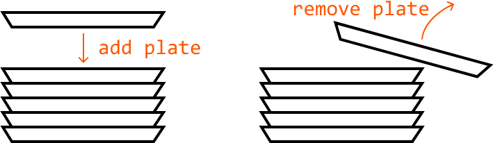
This analogy encapsulates the essence of the stack data structure. Adding a plate to and taking a plate from the top of the stack, physically demonstrates the two main stack operations:

- **Push** (adds an element to the top of the stack).
- **Pop** (removes and returns the element at the top of the stack).
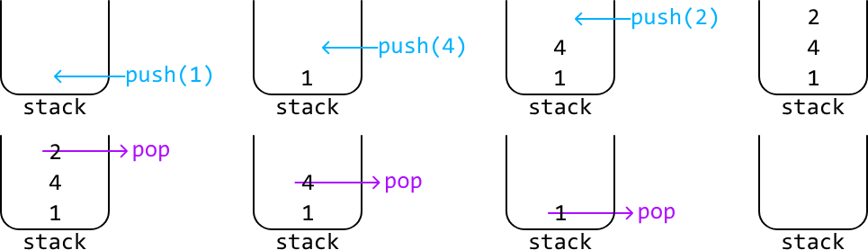
**LIFO (Last‐In‐First‐Out)** Stacks follow the LIFO principle, meaning the most recently added item is the first to be removed. This unique characteristic makes stacks particularly useful in various scenarios where the order of processing or removal is critical. Here are a few key applications:

- **Handling nested structures:** Stacks are a good option for parsing or validating nested structures such as nested parentheses in a string (e.g., `(())()"`). They allow us to process the innermost nested structures first due to the LIFO principle.
- **Reverse order:** When elements are added (pushed) onto a stack and then removed (popped), they come out in the reverse order of how they were added. This property is useful for reversing sequences.
- **Substitute for recursion:** Recursive algorithms use the recursive call stack to manage recursive calls. Ultimately, this recursive call stack is itself a stack. As such, we can often implement recursive functions iteratively using the stack data structure.
- **Monotonic stacks:** These special‐purpose stacks maintain elements in a consistent, increasing or decreasing sorted order. Before adding a new element to the stack, any elements that break this order are removed from the top of the stack, ensuring the stack remains sorted.

Some examples of the above applications are explored in this chapter.

Below is a time complexity breakdown of common stack operations:

| Operation | Worst case | Description |
|-----------|------------|-------------|
| Push      | O(1)       | Adds an element to the top of the stack. |
| Pop       | O(1)       | Removes and returns the element at the top of the stack. |
| Peek      | O(1)       | Returns the element at the top of the stack without removing it. |
| IsEmpty   | O(1)       | Checks if the stack is empty. |

## Real-world Example

**Function call management:** As hinted above, a common real‐world example of stacks is in function call management within operating systems or programming languages.

When a function is called, the program pushes the function's state (including its parameters, local variables, and the return address) onto the call stack. As functions call other functions, their states are also pushed onto the stack. When a function completes, its state is popped off the stack, and the program returns to the calling function. This stack‐based approach ensures that functions return control in the correct order, managing nested or recursive function calls efficiently.

## Chapter Outline

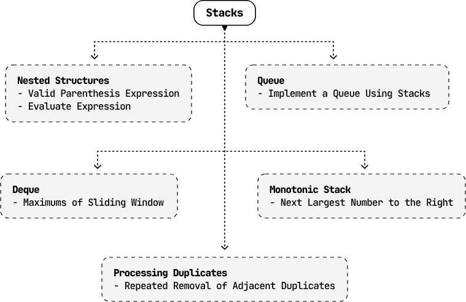

This chapter explores a variety of problems, offering detailed explanations for how to use stacks in problem solving. Additionally, we briefly introduce queues and deques, which are two data structures that share similarities with stacks, but operate on different principles.

---


# Valid Parenthesis Expression

Given a string representing an expression of parentheses containing the characters `(`, `)`, `[`, `]`, `{`, or `}`, determine if the expression forms a valid sequence of parentheses.

A sequence of parentheses is valid if every opening parenthesis has a corresponding closing parenthesis, and no closing parenthesis appears before its matching opening parenthesis.

## Example 1

```
Input: s = '([]{})'
Output: True
```

## Example 2

```
Input: s = '([]{)}'
Output: False
Explanation: The '(' parenthesis is closed before its nested '{' parenthesis is closed.
```

## Intuition

An early observation is that for each type of parenthesis, the number of opening and closing parenthesis must be identical. However, to check if an expression is valid, this observation alone isn't enough. For example, the string `"())("` has the same number of opening and closing parentheses, but is still invalid. This means we need a way to account for the order of parentheses.

Consider the string `"()"`. The first parenthesis is opening, and we're waiting for it to be closing. Upon reaching the second parenthesis, the first parenthesis gets closed.
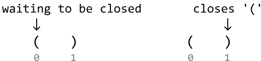
Now, consider the string `"[(])"`. When we reach index 1, we have two opening parentheses waiting to be closed. In particular, we expect `(` to be closed before `[`. The first closing parenthesis we encounter is `]`, which does not close `(`. Therefore, this string is invalid.
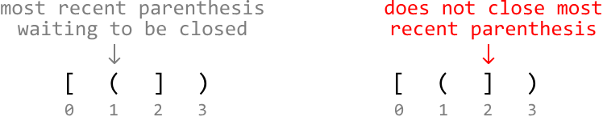
The key observation here is that the most recent opening parenthesis we encounter should be the first parenthesis that gets closed. So, opening parentheses are processed from most recent to least recent, which is indicative of a last-in-first-out (LIFO) dynamic. This leads to the idea that a stack can be used to solve this problem.

## Stack

Here's a high-level strategy:

1. Add each opening parenthesis we encounter to the stack. This way, the most recent parenthesis is always at the top of the stack.

2. When encountering a closing parenthesis, check if it can close the most recent opening parenthesis.
   - If it can, close that pair of parenthesis by popping off the top of the stack.
   - If not, the string is invalid.

Let's see how this strategy works over an example:

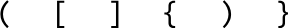

For each opening parenthesis we encounter, push it to the top of the stack:

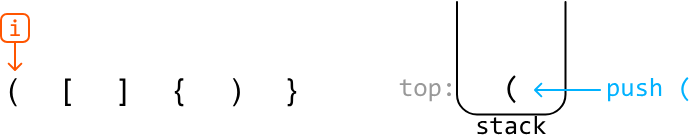

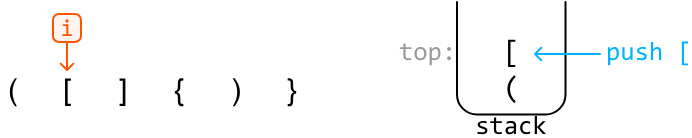

Next, we encounter a closing parenthesis. Comparing it to the opening parenthesis at the top of the stack, we see that it correctly closes that opening parenthesis. So, we can pop off the opening parenthesis at the top of the stack:

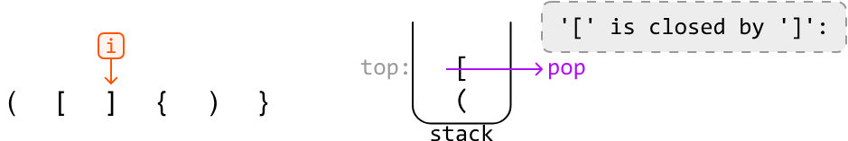

The next character is an opening parenthesis, which we just push to the top of the stack:

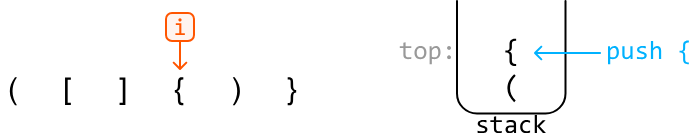

The next character is a closing parenthesis, `)`, which does not close the opening parenthesis at the top of the stack, `{`. This means this parenthesis expression is invalid. As such, we return false.

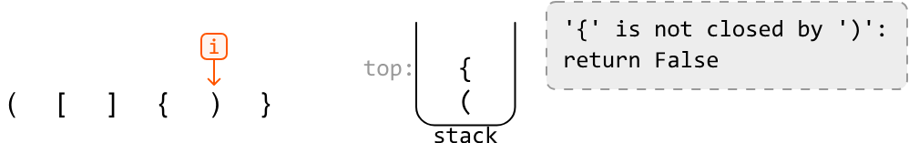

If we've iterated over the entire string without returning false, that means we've accounted for all closing parentheses in the string.

### Edge case: extra opening parentheses

We only check for invalidity at closing parenthesis, so need to perform a final check to ensure there aren't any opening parentheses in the string left unclosed. This can be done by checking if the stack is empty after processing the whole input string, as a non-empty stack indicates opening parentheses remain in the stack.

### Managing three types of parentheses

In our algorithm, we need a way to ensure we compare the correct types of opening and closing parentheses. We can use a hash map for this, which maps each type of opening parenthesis to its corresponding closing parenthesis:

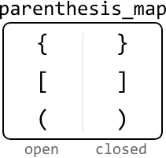

This hash map can also be used as a way to check if a parenthesis is an opening or a closing one: if the parenthesis exists in this hash map as a key, it's an opening parenthesis.

## Try it yourself

Write your solution to the problem before checking the reference implementation.

## Implementation

### Python

```python
def valid_parenthesis_expression(s: str) -> bool:
    parentheses_map = {'(': ')', '{': '}', '[': ']'}
    stack = []
    for c in s:
        # If the current character is an opening parenthesis, push it onto the stack.
        if c in parentheses_map:
            stack.append(c)
        # If the current character is a closing parenthesis, check if it closes the
        # opening parenthesis at the top of the stack.
        else:
            if stack and parentheses_map[stack[-1]] == c:
                stack.pop()
            else:
                return False
    # If the stack is empty, all opening parentheses were successfully closed.
    return not stack
```
### JavaScript
```javascript
export function valid_parenthesis_expression(s) {
  const parenthesesMap = { '(': ')', '{': '}', '[': ']' }
  const stack = []
  for (const c of s) {
    // If the current character is an opening parenthesis, push it onto the stack.
    if (c in parenthesesMap) {
      stack.push(c)
    } else {
      // If the current character is a closing parenthesis, check if it closes
      // the opening parenthesis at the top of the stack.
      if (stack.length && parenthesesMap[stack[stack.length - 1]] === c) {
        stack.pop()
      } else {
        return false
      }
    }
  }
  // If the stack is empty, all opening parentheses were successfully closed.
  return stack.length === 0
}
```

### Java
```java
import java.util.HashMap;
import java.util.Stack;

public class Main {
    public Boolean valid_parenthesis_expression(String s) {
        HashMap<Character, Character> parenthesesMap = new HashMap<>();
        parenthesesMap.put('(', ')');
        parenthesesMap.put('{', '}');
        parenthesesMap.put('[', ']');
        Stack<Character> stack = new Stack<>();
        for (char c : s.toCharArray()) {
            // If the current character is an opening parenthesis, push it onto the stack.
            if (parenthesesMap.containsKey(c)) {
                stack.push(c);
            }
            // If the current character is a closing parenthesis, check if it closes the
            // opening parenthesis at the top of the stack.
            else {
                if (!stack.isEmpty() && parenthesesMap.get(stack.peek()) == c) {
                    stack.pop();
                } else {
                    return false;
                }
            }
        }
        // If the stack is empty, all opening parentheses were successfully closed.
        return stack.isEmpty();
    }
}
```

## Complexity Analysis

- **Time complexity:** The time complexity of `valid_parenthesis_expression` is **O(n)** because we traverse the entire string once. For each character, we perform a constant-time operation, either pushing an opening parenthesis onto the stack or popping it off for a matching closing parenthesis.

- **Space complexity:** The space complexity is **O(n)** because the stack stores at most **n** characters, and the hash map takes up **O(1)** space.

---


# Next Largest Number to the Right

Given an integer array `nums`, return an output array `res` where, for each value `nums[i]`, `res[i]` is the first number to the right that's larger than `nums[i]`. If no larger number exists to the right of `nums[i]`, set `res[i]` to ‐1.

## Example
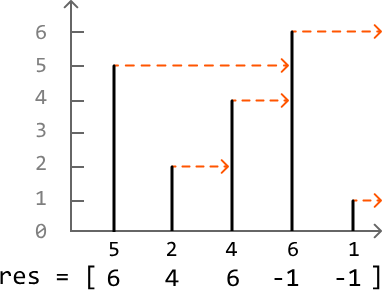
```
Input:  nums = [5, 2, 4, 6, 1]
Output: res  = [6, 4, 6, -1, -1]
```

## Intuition

A brute-force solution to this problem involves iterating through each number in the array and, for each of these numbers, linearly searching to their right to find the first larger number. This approach takes **O(n²)** time, where **n** denotes the length of the array. Can we think of something better?

Let's approach this problem from a different perspective. Instead of finding the next largest number for each value, what if we check whether the value itself is the next largest number for any value(s) to its left? For example, can we figure out which values in the following example have 6 as their next largest number?

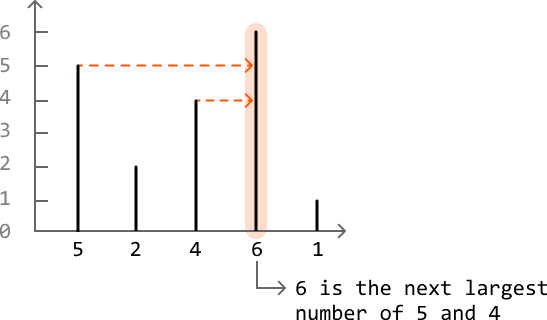

With this shift in perspective, we should search the array from right to left: certain values we encounter from the right could potentially be the next largest number of values to their left. Let's call these values "candidates." But how do we determine which numbers qualify as candidates?

Consider the example below:

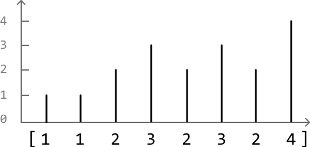

Let's start at the rightmost index, where the only value we know initially is 4:

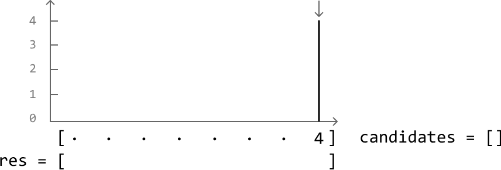

Right now, we can say 4 is a candidate as it might be the next largest number of values to its left. No candidates have been encountered before 4 because it's the rightmost element, so we should mark the result for 4 in `res` as -1:

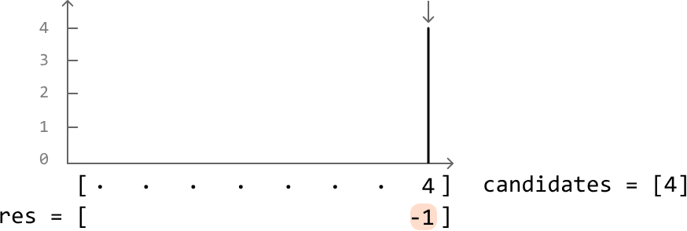

Next, we encounter a 2. The next largest number of 2 is the most recently added candidate that's larger than it. In this case, the rightmost candidate in the candidates list represents the most recently added candidate, which is 4 in this case.

Record 4 as the next largest number of 2 in `res`, and then add 2 to the candidates list because it could be the next largest number of elements to its left:

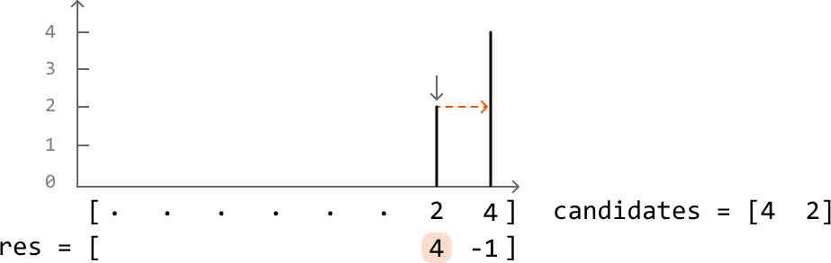

The next number is 3. Notice that with the introduction of 3, number 2 should no longer be considered a candidate. This is because it's now impossible for 2 to be the next largest number of any value to its left. Since 3 is both larger and further to the left, it will always be prioritized over 2 as the next largest number. So, let's remove 2 from the candidates list, as well as any other candidate that's less than or equal to 3:

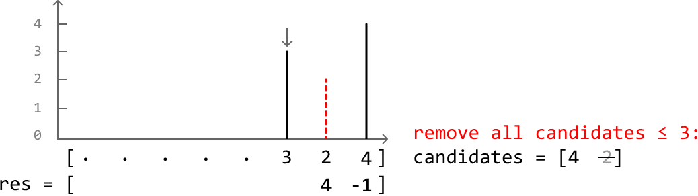

Since we removed all candidates smaller than 3, the rightmost candidate is now 4. So, let's record 4 as the next largest number of 3 in `res` and add 3 to the candidates list:

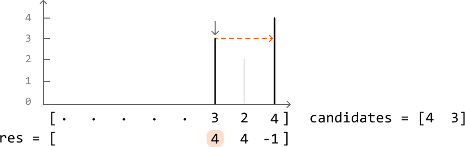

This provides a crucial insight:

> Whenever we move to a new number, all candidates less than or equal to this number should be removed from the candidates list.

Another key observation is that the list of candidates always maintains a strictly decreasing order of values. This is because we always remove candidates less than or equal to each new value, ensuring values are added in decreasing order. We can see this more clearly in the final state of the candidates list of the previous example:

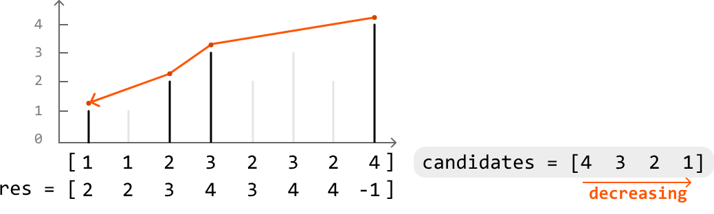

This indicates a stack is the ideal data structure for storing the candidates list, since stacks can be used to efficiently maintain a monotonic decreasing order of values, as mentioned in the introduction.

The top of the stack represents the most recent candidate to the right of each new number encountered. Given this, here's how to use the stack to add and remove candidates at each value:

1. Pop off all candidates from the top of the stack less than or equal to the current value.

2. The top of the stack will then represent the next largest number of the current value.

3. Record the top of the stack as the answer for the current value.
   - If the stack is empty, there's no next largest number for the current value. So, record -1.

4. Add the current value as a new candidate by pushing it to the top of the stack.

## Try it yourself

Write your solution to the problem before checking the reference implementation.

## Implementation

### Python

```python
from typing import List
    
def next_largest_number_to_the_right(nums: List[int]) -> List[int]:
    res = [0] * len(nums)
    stack = []
    # Find the next largest number of each element, starting with the rightmost
    # element.
    for i in range(len(nums) - 1, -1, -1):
        # Pop values from the top of the stack until the current value's next largest
        # number is at the top.
        while stack and stack[-1] <= nums[i]:
            stack.pop()
        # Record the current value's next largest number, which is at the top of the
        # stack. If the stack is empty, record -1.
        res[i] = stack[-1] if stack else -1
        stack.append(nums[i])
    return res
```
### JavaScript
```javascript
export function next_largest_number_to_the_right(nums) {
  const res = new Array(nums.length).fill(0)
  const stack = []
  // Find the next largest number for each element, starting from the right.
  for (let i = nums.length - 1; i >= 0; i--) {
    // Pop values from the stack until the current value's next largest
    // number is found or the stack is empty.
    while (stack.length && stack[stack.length - 1] <= nums[i]) {
      stack.pop()
    }
    // If the stack is empty, no greater number to the right exists.
    res[i] = stack.length ? stack[stack.length - 1] : -1

    // Push the current number onto the stack.
    stack.push(nums[i])
  }
  return res
}
```

### Java
```java
import java.util.ArrayList;
import java.util.Stack;

public class Main {
    public ArrayList<Integer> next_largest_number_to_the_right(ArrayList<Integer> nums) {
        ArrayList<Integer> res = new ArrayList<>();
        Stack<Integer> stack = new Stack<>();
        // Initialize result list with zeros.
        for (int i = 0; i < nums.size(); i++) {
            res.add(0);
        }
        // Find the next largest number of each element, starting with the rightmost
        // element.
        for (int i = nums.size() - 1; i >= 0; i--) {
            // Pop values from the top of the stack until the current value's next largest
            // number is at the top.
            while (!stack.isEmpty() && stack.peek() <= nums.get(i)) {
                stack.pop();
            }
            // Record the current value's next largest number, which is at the top of the
            // stack. If the stack is empty, record -1.
            res.set(i, stack.isEmpty() ? -1 : stack.peek());
            stack.push(nums.get(i));
        }
        return res;
    }
}
```

## Complexity Analysis

- **Time complexity:** The time complexity of `next_largest_number_to_the_right` is **O(n)**. This is because each value of `nums` is pushed and popped from the stack at most once.

- **Space complexity:** The space complexity is **O(n)** because the stack can potentially store all **n** values.


---


# Evaluate Expression

Given a string representing a mathematical expression containing integers, parentheses, addition, and subtraction operators, evaluate and return the result of the expression.

## Example

```
Input: s = '18-(7+(2-4))'
Output: 13
```

## Intuition

At first, it might seem overwhelming to deal with expressions that include a variety of elements like negative numbers, nested expressions inside parentheses, and numbers with multiple digits. The key to managing this complexity is to break down the problem into smaller, more manageable parts. Let's first focus on evaluating simple expressions that contain no parentheses.

### Handling positive and negative signs

Consider the following expression:

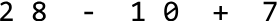

There's already some complexity in this expression with there being two signs to consider: plus and minus. An immediate simplification we can make is to treat all expressions as ones of pure addition. This is possible when we assign signs to each number (1 representing + and -1 representing -). This sign can be multiplied by the number to attain its correct value. This allows us to just focus on performing additions:

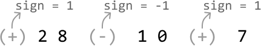

### Processing numbers with multiple digits

Another complexity in this expression is that some numbers have multiple digits. We'll need a way to build numbers digit by digit until we reach the end of the number. We can build a number using the variable `curr_num`, which is initially set to 0. Every time we encounter a new digit, we multiply `curr_num` by 10 and add the new digit to it, effectively shifting all digits to the left and appending the new digit.

We can see this process play out for the string `"123"` in the following illustration:

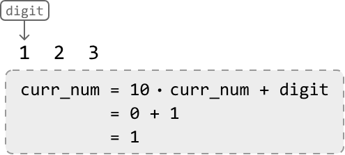
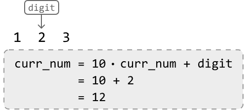
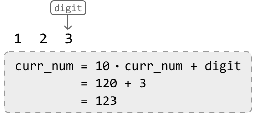

We can stop building this number once we encounter a non-digit character, indicating the end of the number.

### Evaluating an expression without parentheses

With the information from the section above, let's evaluate the following expression, which contains no parentheses. We'll start off with a sign of 1:

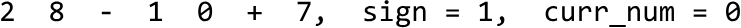

Upon reaching the `-` operator, we've reached the end of the first number (28). So, let's:

1. Multiply the current number (28) by its sign (1).
2. Add the resulting product (28) to the result.
3. Update the sign to -1 since the current operator is a minus sign.
4. Reset `curr_num` to 0 before building the next number.

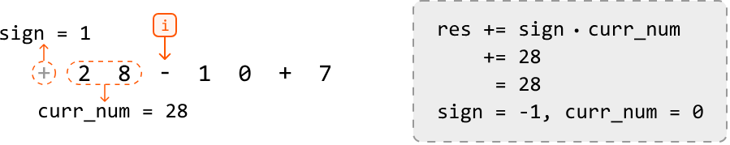

Once we reach the second operator, we multiply the current number (10) by its sign of -1 before adding the resulting product (-10) to the result. This effectively subtracts 10 from the result:
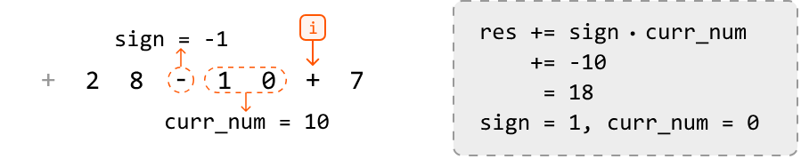

Finally, once we've reached the end of the string, we just add the final number (7) to the result after multiplying it by its sign of 1:

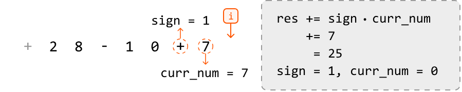

## Evaluating expressions containing parentheses

Now that we can solve simple expressions, it's time to bring parentheses into the discussion. Moving forward, we define a nested expression as one that's inside a pair of parentheses.

One challenge is that we need to evaluate the results of nested expressions before we can calculate the original expression. Once all nested expressions are evaluated, we can evaluate the original expression.

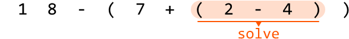

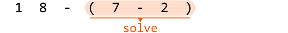

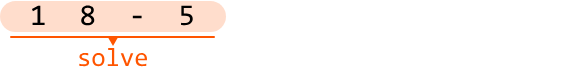

Consider another problem in this chapter that also contains parentheses: Valid Parenthesis Expression. In that problem, we used a stack to process nested parentheses in the right order. This suggests a stack might also help us evaluate nested expressions in the right order. Let's explore this idea further.

Similar to Valid Parenthesis Expression, an opening parenthesis `(` indicates the start of a new nested expression, whereas a closing parenthesis `)` indicates the end of one. Understanding this, let's try to use a stack to solve the following expression.

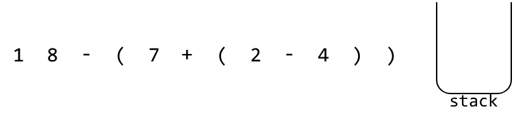

We already know how to evaluate expressions without parentheses, so let's just focus on what to do when we encounter a parenthesis.

At the first opening parenthesis, we know a nested expression has started. Before we evaluate the nested expression, we'll need to save the running result (`res`) of the current expression, as well as the sign of this upcoming nested expression. This way, once we're done evaluating the nested expression, we can resume where we were in the current expression.

Here are the steps for when we encounter an opening parenthesis:

1. `stack.push(res)`: Save the running result on the stack.
2. `stack.push(sign)`: Save the sign of the upcoming nested expression on the stack.
3. `res = 0, sign = 1`: Reset these variables because we're about to begin calculating a new expression.

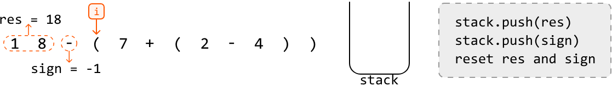

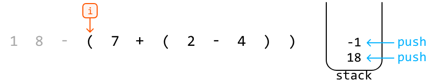

The next parenthesis we encounter is an opening parenthesis. Again, this indicates the start of a new nested expression. Let's save the current result and sign on the stack, before resetting them to evaluate the upcoming nested expression:

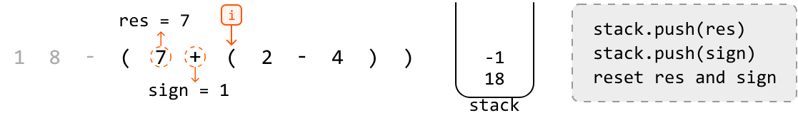
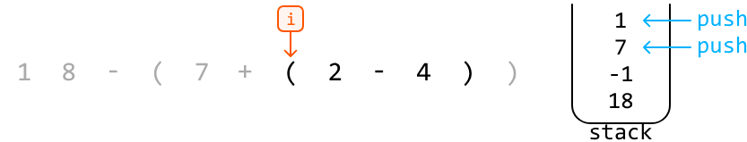

The next parenthesis we encounter is a closing parenthesis. This means the current nested expression just ended, and we need to merge its result with the outer expression. Here's how we do this:

1. `res *= stack.pop()`: Apply the sign of the current nested expression to its result.
2. `res += stack.pop()`: Add the result of the outer expression to the result of the current nested expression.

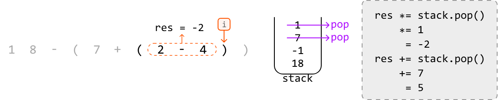

 

After applying those operations, the value of `res` will be 5, representing the result of the highlighted part of the expression below:

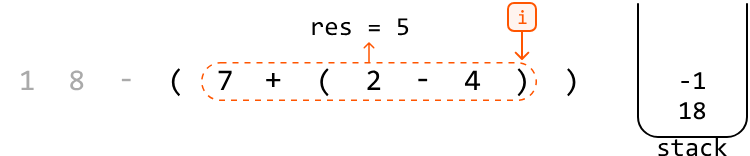

At the final closing parenthesis, we can apply the same steps:

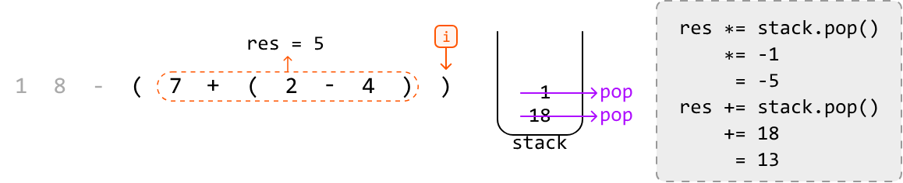

Finally, the value of `res` will be 13, representing the result of the entire expression:

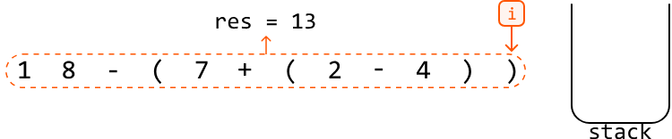

Now that we've reached the end of the string, we can return `res`.

## Try it yourself

Write your solution to the problem before checking the reference implementation.

## Implementation

### Python

```python
def evaluate_expression(s: str) -> int:
    stack = []
    curr_num, sign, res = 0, 1, 0
    for c in s:
        if c.isdigit():
            curr_num = curr_num * 10 + int(c)
        # If the current character is an operator, add 'curr_num' to the result
        # after multiplying it by its sign.
        elif c == '+' or c == '-':
            res += curr_num * sign
            # Update the sign and reset 'curr_num'.
            sign = -1 if c == '-' else 1
            curr_num = 0
        # If the current character is an opening parenthesis, a new nested expression
        # is starting.
        elif c == '(':
            # Save the current 'res' and 'sign' values by pushing them onto
            # the stack, then reset their values to start calculating the new nested
            # expression.
            stack.append(res)
            stack.append(sign)
            res, sign = 0, 1
        # If the current character is a closing parenthesis, a nested expression has
        # ended.
        elif c == ')':
            # Finalize the result of the current nested expression.
            res += sign * curr_num
            # Apply the sign of the current nested expression's result before adding
            # this result to the result of the outer expression.
            res *= stack.pop()
            res += stack.pop()
            curr_num = 0
    # Finalize the result of the overall expression.
    return res + curr_num * sign
```
### JavaScript
```javascript
export function evaluate_expression(s) {
  const stack = []
  let currNum = 0,
    sign = 1,
    res = 0
  for (let c of s) {
    if (/\d/.test(c)) {
      currNum = currNum * 10 + parseInt(c)
    }
    // If the current character is an operator, add 'currNum' to the result
    // after multiplying it by its sign.
    else if (c === '+' || c === '-') {
      res += currNum * sign
      // Update the sign and reset 'currNum'.
      sign = c === '-' ? -1 : 1
      currNum = 0
    }
    // If the current character is an opening parenthesis, a new nested expression
    // is starting.
    else if (c === '(') {
      // Save the current 'res' and 'sign' values by pushing them onto
      // the stack, then reset their values to start calculating the new nested
      // expression.
      stack.push(res)
      stack.push(sign)
      res = 0
      sign = 1
    }
    // If the current character is a closing parenthesis, a nested expression has
    // ended.
    else if (c === ')') {
      // Finalize the result of the current nested expression.
      res += sign * currNum
      // Apply the sign of the current nested expression’s result before adding
      // this result to the result of the outer expression.
      res *= stack.pop()
      res += stack.pop()
      currNum = 0
    }
  }
  // Finalize the result of the overall expression.
  return res + currNum * sign
}
```

### Java
```java
import java.util.Stack;

public class Main {
    public Integer evaluate_expression(String s) {
        Stack<Integer> stack = new Stack<>();
        int currNum = 0, sign = 1, res = 0;
        for (char c : s.toCharArray()) {
            if (Character.isDigit(c)) {
                currNum = currNum * 10 + (c - '0');
            }
            // If the current character is an operator, add 'currNum' to the result
            // after multiplying it by its sign.
            else if (c == '+' || c == '-') {
                res += currNum * sign;
                // Update the sign and reset 'currNum'.
                sign = (c == '-') ? -1 : 1;
                currNum = 0;
            }
            // If the current character is an opening parenthesis, a new nested expression
            // is starting.
            else if (c == '(') {
                // Save the current 'res' and 'sign' values by pushing them onto
                // the stack, then reset their values to start calculating the new nested
                // expression.
                stack.push(res);
                stack.push(sign);
                res = 0;
                sign = 1;
            }
            // If the current character is a closing parenthesis, a nested expression has
            // ended.
            else if (c == ')') {
                // Finalize the result of the current nested expression.
                res += sign * currNum;
                // Apply the sign of the current nested expression’s result before adding
                // this result to the result of the outer expression.
                res *= stack.pop();
                res += stack.pop();
                currNum = 0;
            }
        }
        // Finalize the result of the overall expression.
        return res + currNum * sign;
    }
}
```

## Complexity Analysis

- **Time complexity:** The time complexity of `evaluate_expression` is **O(n)** because we traverse each character of the expression once, processing nested expressions using the stack, where each stack push or pop operation takes **O(1)** time.

- **Space complexity:** The space complexity is **O(n)** because the stack can grow proportionally to the length of the expression.


---


# Repeated Removal of Adjacent Duplicates

Given a string, continually perform the following operation: remove a pair of adjacent duplicates from the string. Continue performing this operation until the string no longer contains pairs of adjacent duplicates. Return the final string.

## Example 1
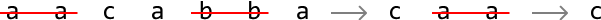
```
Input: s = 'aacabba'
Output: 'c'

aa c abba  →  c aa c  →  c
(remove 'aa' and 'bb', then remove resulting 'aa')
```

## Example 2
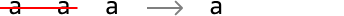
```
Input: s = 'aaa'
Output: 'a'

aa a  →  a
(remove first pair 'aa', leaving 'a')
```

## Intuition

One challenge in solving this problem is how we handle characters which aren't currently adjacent duplicates but will be in the future.

A solution we can try is to iteratively build the string character by character and immediately remove each pair of adjacent duplicates that get formed as we're building the string.

It's also possible an adjacent duplicate may be formed after another adjacent duplicate gets removed. For example, with the string `"abba"`, removing `"bb"` will result in `"aa"`. Building the string character by character ensures the formation of `"aa"` gets noticed and removed. To better understand how this works, let's dive into an example.

Consider the following string:

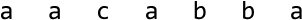
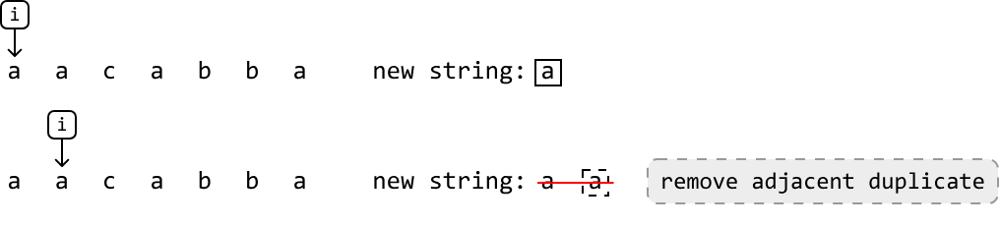
At the second `'a'`, we notice that adding it would result in an adjacent duplicate forming (i.e., `"aa"`). So, let's remove this duplicate before adding any new characters. We'll do this for all adjacent duplicates we come across as we build the string:

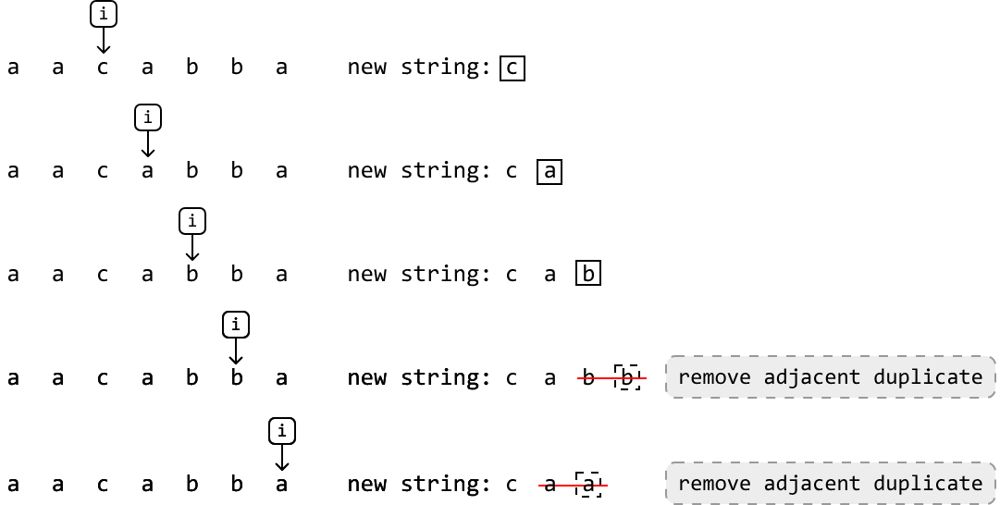

Once the smoke clears, the resulting string we were building ends up just being `"c"`, which is the expected output.

Now that we know how this strategy works, we just need a data structure that'll allow us to:

- Add letters to one end of it.
- Remove letters from the same end.

The stack data structure is a strong option because it allows for both operations.

As we push characters onto the stack, the top of the stack will represent the previous/most recently added character. Given this, to mimic the process of building the "new string" as shown in the example, we:

- **Push** the current character onto the stack if it's different from the character at the top (i.e., not a duplicate character.)
- **Pop** off the character at the top of the stack if it's the same as the current character (i.e., a duplicate.)

Once all characters have been processed, the last thing to do is return the content of the stack as a string, since the final state of the stack will contain all characters that weren't removed.

## Try it yourself

Write your solution to the problem before checking the reference implementation.

## Implementation

### Python

```python
def repeated_removal_of_adjacent_duplicates(s: str) -> str:
    stack = []
    for c in s:
        # If the current character is the same as the top character on the stack,
        # a pair of adjacent duplicates has been formed. So, pop the top character
        # from the stack.
        if stack and c == stack[-1]:
            stack.pop()
        # Otherwise, push the current character onto the stack.
        else:
            stack.append(c)
    # Return the remaining characters as a string.
    return ''.join(stack)
```
### JavaScript
```javascript
export function repeated_removal_of_adjacent_duplicates(s) {
  const stack = []
  for (let c of s) {
    // If the current character is the same as the top character on the stack,
    // a pair of adjacent duplicates has been formed. So, pop the top character
    // from the stack.
    if (stack.length && c === stack[stack.length - 1]) {
      stack.pop()
    }
    // Otherwise, push the current character onto the stack.
    else {
      stack.push(c)
    }
  }
  // Return the remaining characters as a string.
  return stack.join('')
}
```

### Java
```java
import java.util.Stack;

public class Main {
    public static String repeated_removal_of_adjacent_duplicates(String s) {
        Stack<Character> stack = new Stack<>();
        for (char c : s.toCharArray()) {
            // If the current character is the same as the top character on the stack,
            // a pair of adjacent duplicates has been formed. So, pop the top character
            // from the stack.
            if (!stack.isEmpty() && c == stack.peek()) {
                stack.pop();
            }
            // Otherwise, push the current character onto the stack.
            else {
                stack.push(c);
            }
        }
        // Return the remaining characters as a string.
        StringBuilder result = new StringBuilder();
        for (char c : stack) {
            result.append(c);
        }
        return result.toString();
    }
}
```
## Complexity Analysis

- **Time complexity:** The time complexity of the `repeated_removal_of_adjacent_duplicates` function is **O(n)** where **n** denotes the length of the string. This is because we traverse the entire string, and we perform a join operation of up to **n** characters in the stack. The stack push and pop operations contribute **O(1)** time.

- **Space complexity:** The space complexity is **O(n)** because the stack can store at most **n** characters.


---


# Implement a Queue using Stacks

Implement a queue using the stack data structure. Include the following functions:

- `enqueue(x: int) -> None`: adds x to the end of the queue.
- `dequeue() -> int`: removes and returns the element from the front of the queue.
- `peek() -> int`: returns the front element of the queue.

You may not use any other data structures to implement the queue.

## Example

```
Input:  [enqueue(1), enqueue(2), dequeue(), enqueue(3), peek()]
Output: [1, 2]
```

## Constraints

- The dequeue and peek operations will only be called on a non-empty queue.

## Intuition

A queue is a first-in-first-out (FIFO) data structure, whereas stacks are a first-in-last-out (FILO) data structure:

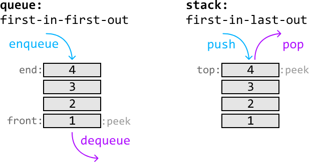

The main difference between these data structures is how items are evicted from them. In a queue, the first value to enter is the first to leave, whereas it would be the last to leave in a stack.

Now that we understand how they work, let's dive into the problem. Let's start by seeing if it's possible to replicate the functionality of a queue with just one stack.

Consider the following stack where we push values 1, 2, and 3 to it after receiving `enqueue(1)`, `enqueue(2)`, and `enqueue(3)`:

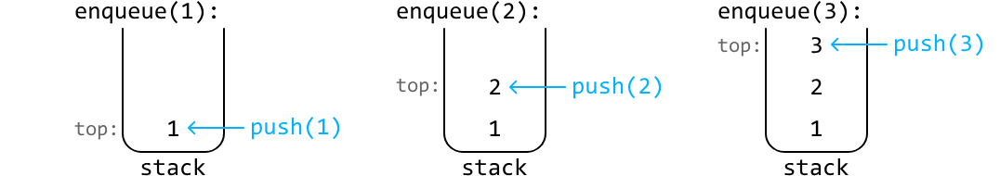

We now encounter a problem with attempting a dequeue operation since popping off the top of the stack would return 3. The value we actually want popped off is 1, since it was the first value that entered the data structure. However, 1 is all the way at the bottom of the stack.

To get to the bottom, we need to pop off all the values from the top of the stack and temporarily store these values in a separate data structure (`temp`) so we can add them back to the stack later:

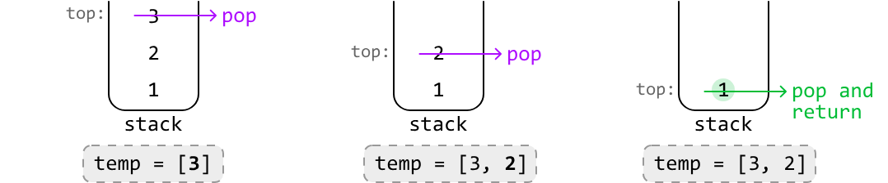

Once we've popped and returned the bottom value (1), push the values stored in `temp` back onto the stack in reverse order to ensure they're added back correctly:


We know that if we were to use a data structure such as `temp`, it'd have to be a stack, since the problem specifies only stacks can be used. In this temporary data structure, we remove values in the opposite order in which we added them. In other words, it follows the LIFO principle, which is conveniently how a stack works. This means we can use a stack for our temporary storage.

Now, even though we have a solution that works, having to pop off every single value from the top of the stack whenever we want to access the bottom value is quite time-consuming. To find a way around this, let's have a closer look at the state of our two stacks right after we've moved the stack values to `temp`:


In our original solution, we would now move the values from `temp` back to the main stack. However, notice the top of the `temp` stack now contains the next value we expect to return. This is because it's the second value to have entered the data structure, and according to the FIFO eviction policy, it should be the next one to be removed.

So, instead of adding these values back to the main stack, we could just leave them in `temp` and return the stack's top value at the next dequeue call.

In the above logic, we ended up using two stacks which each serve a unique purpose. In particular, we used:

- A stack to push values onto during each enqueue call (`enqueue_stack`).
- A stack to pop values from during each dequeue call (`dequeue_stack`).

An important thing to realize here is that the dequeue stack won't always be populated with values. So, what should we do when it's empty? We can just populate it by moving all the values from the enqueue stack to the dequeue stack, just like we did in the example. To understand this more clearly, let's dive into a full example.

Let's start with two enqueue calls and push each number onto the enqueue stack.


Now, let's try processing a dequeue call. The first step is to pop off each element from the enqueue stack and push them onto the dequeue stack:


Then, we just return the top value from the dequeue stack:


Let's enqueue one more value:


If we call dequeue again, we return the value from the top of the dequeue stack:

Now, what happens when we call dequeue and the dequeue stack is empty? We need to repopulate it by popping all the values from the enqueue stack and pushing them into the dequeue stack. Once this is done, we return the top of the dequeue stack as usual:


Regarding the `peek` function, we follow the same logic as the `dequeue` function, but instead, we return the top element of the dequeue stack without popping it.

## Try it yourself

Write your solution to the problem before checking the reference implementation.

## Implementation

As mentioned before, the `dequeue` and `peek` functions have mostly the same behavior, with the only difference being that `dequeue` pops the top value while `peek` does not. To avoid duplicate code, the common logic between these functions for transferring values from the enqueue stack to the dequeue stack has been extracted into a separate function, `transfer_enqueue_to_dequeue`.

### Python

```python
class Queue:
    def __init__(self):
        self.enqueue_stack = []
        self.dequeue_stack = []

    def enqueue(self, x: int) -> None:
        self.enqueue_stack.append(x)

    def transfer_enqueue_to_dequeue(self) -> None:
        # If the dequeue stack is empty, push all elements from the enqueue stack
        # onto the dequeue stack. This ensures the top of the dequeue stack
        # contains the most recent value.
        if not self.dequeue_stack:
            while self.enqueue_stack:
                self.dequeue_stack.append(self.enqueue_stack.pop())

    def dequeue(self) -> int:
        self.transfer_enqueue_to_dequeue()
        # Pop and return the value at the top of the dequeue stack.
        return self.dequeue_stack.pop() if self.dequeue_stack else None

    def peek(self) -> int:
        self.transfer_enqueue_to_dequeue()
        return self.dequeue_stack[-1] if self.dequeue_stack else None
```
### JavaScript
```javascript
export class Queue {
  constructor() {
    this.enqueueStack = []
    this.dequeueStack = []
  }

  enqueue(x) {
    this.enqueueStack.push(x)
  }

  transferEnqueueToDequeue() {
    // If the dequeue stack is empty, push all elements from the enqueue stack
    // onto the dequeue stack. This ensures the top of the dequeue stack
    // contains the most recent value.
    if (this.dequeueStack.length === 0) {
      while (this.enqueueStack.length > 0) {
        this.dequeueStack.push(this.enqueueStack.pop())
      }
    }
  }

  dequeue() {
    this.transferEnqueueToDequeue()
    // Pop and return the value at the top of the dequeue stack.
    return this.dequeueStack.length > 0 ? this.dequeueStack.pop() : null
  }

  peek() {
    this.transferEnqueueToDequeue()
    return this.dequeueStack.length > 0
      ? this.dequeueStack[this.dequeueStack.length - 1]
      : null
  }
}
```

### Java
```java
import java.util.LinkedList;
import java.util.Deque;

class Queue {
    private Deque<Integer> enqueueStack;
    private Deque<Integer> dequeueStack;

    public Queue() {
        enqueueStack = new LinkedList<>();
        dequeueStack = new LinkedList<>();
    }

    public void enqueue(Integer x) {
        enqueueStack.push(x);
    }

    private void transferEnqueueToDequeue() {
        // If the dequeue stack is empty, push all elements from the enqueue stack
        // onto the dequeue stack. This ensures the top of the dequeue stack
        // contains the most recent value.
        if (dequeueStack.isEmpty()) {
            while (!enqueueStack.isEmpty()) {
                dequeueStack.push(enqueueStack.pop());
            }
        }
    }

    public Integer dequeue() {
        transferEnqueueToDequeue();
        // Pop and return the value at the top of the dequeue stack.
        return dequeueStack.isEmpty() ? null : dequeueStack.pop();
    }

    public Integer peek() {
        transferEnqueueToDequeue();
        return dequeueStack.isEmpty() ? null : dequeueStack.peek();
    }
}
```

## Complexity Analysis

**Time complexity:**

- `enqueue` is **O(1)** because we add one element to the enqueue stack in constant time.

- `dequeue` is amortized **O(1)**.
  - In the worst case, all elements from the enqueue stack are moved to the dequeue stack. This takes **O(n)** time, where **n** denotes the number of elements in the enqueue queue.
  - However, each element is only ever moved once during its lifetime. So, over **n** dequeue calls, at most **n** elements are moved between stacks, averaging the cost to **O(1)** time per dequeue operation.

- `peek` is amortized **O(1)** for the same reasons as `dequeue`.

**Space complexity:** The space complexity is **O(n)** since we maintain two stacks that collectively store all elements of the queue at any given time.


---


# Maximums of Sliding Window

There's a sliding window of size k that slides through an integer array from left to right. Create a new array that records the largest number found in each window as it slides through.

## Example

```
Input: nums = [3, 2, 4, 1, 2, 1, 1], k = 4
Output: [4, 4, 4, 2]
```

## Intuition

A brute-force approach to solving this problem involves iterating through each element within a window to find the maximum value of that window. Repeating this for each window will take **O(n⋅k)** time because we traverse **k** elements for up to **n** windows.

The main issue is that as we slide the window, we keep re-examining the same elements we've already looked at in previous windows. This is because two adjacent windows share mostly the same values.


A more efficient solution likely involves keeping track of values we see in any given window so that at the next window, we don't have to iterate over previously seen values again. Specifically, at each window, we should only maintain a record of values that have the potential to become the maximum of a future window. Let's call these values **candidates**, where all the values that aren't candidates can no longer contribute to a maximum. How can we determine which numbers are candidates?

Consider the window of size 4 in the following array. We'll use `left` and `right` pointers to define the window:


To identify the candidates for the next window, let's look at each number individually.

- **3:** Number 3 is a candidate for the current window, but once we move to the next window, we can ignore it since it will no longer be included in the window.

- **2:** Could number 2 be a maximum of a future window? The answer is no. This is because of the 4 to its right: all future windows which contain this 2 will also contain 4, and since 4 is larger, it means 2 could never be a maximum of any future windows.

- **4:** This is the maximum value in the current window, and it'll be included in some future windows. Therefore, 4 could potentially be a maximum for a future window.

- **1:** Could 1 become the maximum of a future window? The answer is yes. While 4 is larger in the current window, it's positioned to the left of 1. As the window shifts to the right, there will eventually be a point where 1 remains in the window while 4 is excluded, making 1 a potential maximum in the future.

Based on the above analysis, we can derive the following strategy whenever the window encounters a new candidate:

1. **Remove smaller or equal candidates:** Any existing candidates less than or equal to the new candidate should be discarded because they can no longer be maximums of future windows.
2. **Adding the new candidate:** Once smaller candidates are discarded, the new value can be added as a new candidate.
3. **Removing outdated candidates:** When the window moves past a value, that value should be discarded to ensure we don't consider values outside the window.

Observe how this strategy is applied to the list of candidates below as the window advances one index to the right:


An important observation is that candidate values always maintain a **decreasing order**. This is because each new candidate we encounter removes smaller and equal candidates to its left, ensuring the list of candidates is kept in a decreasing order.

This consequently means the **maximum value for a window is always the first value in the candidate list**.

Therefore, to store the candidates, we need a data structure that can maintain a monotonic decreasing order of values.

## Deque

We know that typically, a stack allows us to maintain a monotonic decreasing order of values, but in this case, it has a critical limitation: it doesn't provide a way to remove outdated candidates. A stack is a last-in-first-out (LIFO) data structure, which means we only have access to the last (i.e., most recent) end of the data structure. From the diagram above, we know we need access to both ends of the list of candidates, so a stack won't be sufficient.

Is there a data structure that allows us to add and remove from both ends? A **double-ended queue**, or **deque** for short, is a great candidate for this. A deque is essentially a doubly linked list under the hood. It allows us to push and pop values from both ends of the data structure in **O(1)** time.

Despite its name, it's easier to think of a deque as a double-ended stack:


Now that we have our data structure, let's see how we can use it over the following example. Note that our deque will store tuples containing both a value and its corresponding index. We keep track of indexes in the deque because they allow us to determine whether a value has moved outside the window. We'll see how this works later in the example.


Start by expanding the window until it's of length k. For each candidate we encounter, we need to ensure the values in the deque maintain a monotonic decreasing order before pushing it in:


When we reach 4, we can't add it to the deque straight away because adding it would violate the decreasing order of the deque. So, let's pop any candidates from the right of the deque that are less than 4 before pushing 4 in.


The next expansion of the window will set it at the expected fixed size of k:


Now that the window is of length k, it's time to begin recording the maximum value of each window. As mentioned earlier, the maximum value is the first value in the candidate list (i.e., the leftmost value of the deque.) The **maximum value of this window is 4** since it's the leftmost candidate value.

With the window now at a fixed size of k, our approach shifts from expanding the window to sliding it. As we slide, we should remove any values from the deque whose index is before the `left` pointer, since those values will be outside the window:


The **maximum value of the above window** after the three operations are performed is revealed to be **4**, as it's the leftmost candidate value.


The **maximum value of the above window** after the three operations are performed is also **4**, as it's the leftmost candidate value.


Before recording the maximum value of this window, we ensured 4 was removed from the deque because its index (index 2) occurs before the left pointer (index 3), indicating it's no longer within the current window. The **maximum value for this window** after this removal is revealed to be **2**.

## Try it yourself

Write your solution to the problem before checking the reference implementation.

## Implementation

### Python

```python
from typing import List
from collections import deque
    
def maximums_of_sliding_window(nums: List[int], k: int) -> List[int]:
    res = []
    dq = deque()
    left = right = 0
    while right < len(nums):
        # 1) Ensure the values of the deque maintain a monotonic decreasing order
        # by removing candidates <= the current candidate.
        while dq and dq[-1][0] <= nums[right]:
            dq.pop()
        # 2) Add the current candidate.
        dq.append((nums[right], right))
        # If the window is of length 'k', record the maximum of the window.
        if right - left + 1 == k:
            # 3) Remove values whose indexes occur outside the window.
            if dq and dq[0][1] < left:
                dq.popleft()
            # The maximum value of this window is the leftmost value in the
            # deque.
            res.append(dq[0][0])
            # Slide the window by advancing both 'left' and 'right'. The right
            # pointer always gets advanced so we just need to advance 'left'
            left += 1
        right += 1
    return res
```
### JavaScript
```javascript
export function maximums_of_sliding_window(nums, k) {
  const res = []
  const dq = []
  let left = 0,
    right = 0
  while (right < nums.length) {
    // 1) Ensure the values of the deque maintain a monotonic decreasing order
    // by removing candidates <= the current candidate.
    while (dq.length > 0 && dq[dq.length - 1][0] <= nums[right]) {
      dq.pop()
    }
    // 2) Add the current candidate.
    dq.push([nums[right], right])
    // If the window is of length 'k', record the maximum of the window.
    if (right - left + 1 === k) {
      // 3) Remove values whose indexes occur outside the window.
      if (dq.length > 0 && dq[0][1] < left) {
        dq.shift()
      }
      // The maximum value of this window is the leftmost value in the
      // deque.
      res.push(dq[0][0])
      // Slide the window by advancing both 'left' and 'right'. The right
      // pointer always gets advanced so we just need to advance 'left'
      left += 1
    }
    right += 1
  }
  return res
}
```

### Java
```java
import java.util.ArrayList;
import java.util.Deque;
import java.util.LinkedList;

public class Main {
    public ArrayList<Integer> maximums_of_sliding_window(ArrayList<Integer> nums, int k) {
        ArrayList<Integer> res = new ArrayList<>();
        Deque<int[]> dq = new LinkedList<>();
        int left = 0, right = 0;
        while (right < nums.size()) {
            // 1) Ensure the values of the deque maintain a monotonic decreasing order
            // by removing candidates <= the current candidate.
            while (!dq.isEmpty() && dq.peekLast()[0] <= nums.get(right)) {
                dq.pollLast();
            }
            // 2) Add the current candidate.
            dq.offerLast(new int[] {nums.get(right), right});
            // If the window is of length 'k', record the maximum of the window.
            if (right - left + 1 == k) {
                // 3) Remove values whose indexes occur outside the window.
                if (!dq.isEmpty() && dq.peekFirst()[1] < left) {
                    dq.pollFirst();
                }
                // The maximum value of this window is the leftmost value in the deque.
                res.add(dq.peekFirst()[0]);
                // Slide the window by advancing both 'left' and 'right'. The right
                // pointer always gets advanced so we just need to advance 'left'
                left++;
            }
            right++;
        }
        return res;
    }
}
```

## Complexity Analysis

- **Time complexity:** The time complexity of `maximums_of_sliding_window` is **O(n)** because we slide over the array in linear time, and we push and pop values of `nums` into the deque at most once for each number.

- **Space complexity:** The space complexity is **O(k)** because the deque can store up to **k** elements.

## Interview Tip

> **Tip:** If you're unsure about what data structure to use for a problem, first identify what attributes or operations you want from the data structure. Use these attributes and operations to pinpoint a data structure that satisfies them and can be used to solve the problem. In this problem, we wanted a data structure that could add and remove elements from both ends of it efficiently, and the best data structure that matched these requirements was a deque.