# 08. Heaps

1. [Introduction to Heaps](#introduction-to-heaps)
2. [K Most Frequent Strings](#k-most-frequent-strings)
3. [Combine Sorted Linked Lists](#combine-sorted-linked-lists)
4. [Median of an Integer Stream](#median-of-an-integer-stream)
5. [Sort a K-Sorted Array](#sort-a-k-sorted-array)

# Introduction to Heaps

## Intuition

A heap is a data structure that organizes elements based on priority, ensuring the highest-priority element is always at the top of the heap. This allows for efficient access to the highest-priority element at any time. There are two main types of heaps:

- **Min-heap:** prioritizes the smallest element by keeping it at the top of the heap.
- **Max-heap:** prioritizes the largest element by keeping it at the top of the heap.

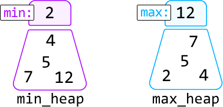

Efficient prioritization is possible due to how heaps are structured. A heap is essentially a binary tree. In the case of a min-heap, for example, each node's value is less than or equal to that of its children. This guarantees the root of this tree (the top of the heap) is always the smallest element:

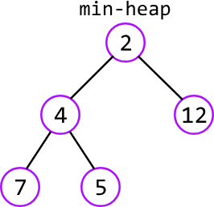

Here's a time complexity breakdown of common heap operations:

| Operation | Time complexity | Description |
|-----------|----------------|-------------|
| Insert    | O(log(n))      | Adds an element to the heap, ensuring the binary tree remains correctly ordered. |
| Deletion  | O(log(n))      | Removes the element at the top of the heap, then restructures the heap to replace the top element. |
| Peek      | O(1)           | Retrieves the top element of the heap without removing it. |
| Heapify   | O(n)           | Transforms an unsorted list of values into a heap [1]. |

This chapter discusses the practical uses of heaps. For a deeper understanding of how a heap works, we recommend diving into the details behind its internal implementation, and how its binary tree structure is consistently maintained during various operations [2].

## Priority queue

A priority queue is a special type of heap that follows the structure of min-heaps or max-heaps but allows customization in how elements are prioritized (e.g., prioritizing strings with a higher number of vowels).

## Real-world Example

**Managing tasks in operating systems:** Operating systems often use a priority queue to manage the execution of tasks, and a heap is commonly used to implement this priority queue efficiently.

For example, when multiple processes are running on a computer, each process might be assigned a priority level. The operating system needs to schedule the processes so that higher-priority tasks are executed before lower-priority ones. A heap is ideal for this because it allows the system to quickly access the highest-priority task and efficiently re-arrange the priorities as new tasks are added or existing tasks are completed.

## Chapter Outline

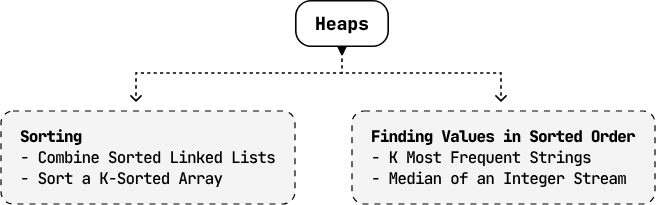


---


# K Most Frequent Strings

Find the k most frequently occurring strings in an array, and return them sorted by frequency in descending order. If two strings have the same frequency, sort them in lexicographical order.

## Example

```
Input: strs = ['go', 'coding', 'byte', 'byte', 'go', 'interview', 'go'], k = 2
Output: ['go', 'byte']
Explanation: The strings "go" and "byte" appear the most frequently, with frequencies of 3 and 2, respectively.
```

## Constraints

- k ≤ n, where n denotes the length of the array.

## Intuition - Max-Heap

The two main challenges to this problem are:

1. Identifying the k most frequent strings.
2. Sorting those strings first by frequency and then lexicographically.

For now, let's concentrate on identifying the most frequent strings and address lexicographical ordering afterward.

First, we need a way to keep track of the frequencies of each string. We can use a hash map for this, where the keys represent the strings and the values represent frequencies:

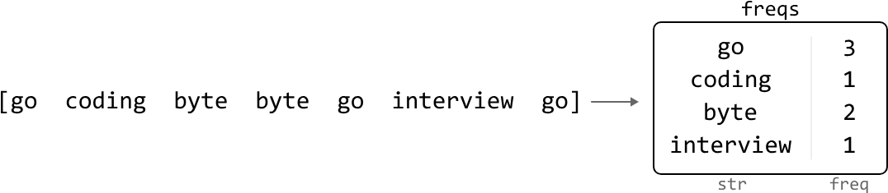

The most straightforward approach is to obtain an array containing the strings from the hash map, sorted by frequency in descending order. The k most frequent strings would be the first k strings in this array.

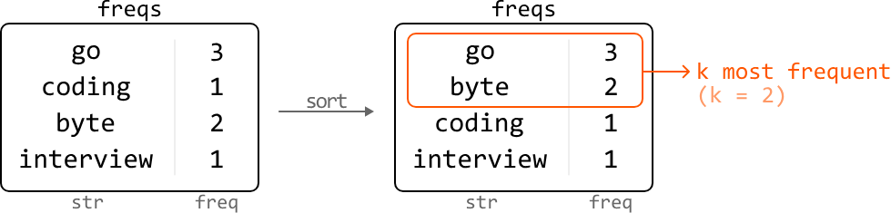

The main inefficiency of this solution is that it involves sorting all n strings, even though we only need the top k frequent ones to be sorted.

Something useful to consider: if we remove the most frequent string, the new most frequent string after this removal represents the second-most frequent overall. By repeatedly identifying and removing the most frequent string k times, we efficiently obtain our answer.

To implement this idea, we need a data structure that allows efficient access to the most frequent string at any time. A max-heap is perfect for this.

### Max-heap

Let's find the k most frequent strings from the previous input, this time using a max-heap. First, populate the heap with each string along with their frequencies.

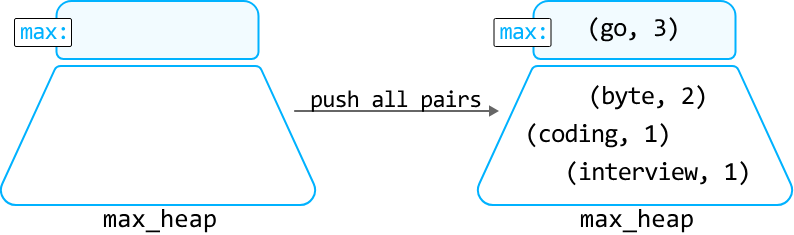

One way to populate the heap is to push all n strings into it one by one, which will take **O(n log(n))** time. Instead, we can perform the heapify operation on an array containing all the string-frequency pairs to create the max-heap in **O(n)** time.

To collect the k most frequent strings, pop off the top element from the heap k times and store the corresponding strings in the output array `res`:

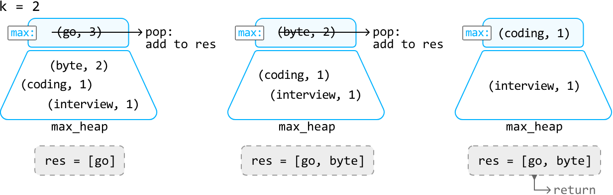

Now, we just need to ensure that when two strings have the same frequency, the one that comes first lexicographically has a higher priority in the heap. To do this, we can define a custom comparator for the heap that prioritizes strings lexicographically when their frequencies match, as demonstrated in the implementation below.

## Try it yourself

Write your solution to the problem before checking the reference implementation.

## Implementation - Max-Heap

We create a `Pair` class for string-frequency pairs, enabling us to customize priority using a custom comparator.

### Python

```python
from typing import List
from collections import Counter
import heapq
    
class Pair:
   def __init__(self, str, freq):
       self.str = str
       self.freq = freq
    
   # Define a custom comparator.
   def __lt__(self, other):
       # Prioritize lexicographical order for strings with equal frequencies.
       if self.freq == other.freq:
           return self.str < other.str
       # Otherwise, prioritize strings with higher frequencies.
       return self.freq > other.freq
    
def k_most_frequent_strings_max_heap(strs: List[str], k: int) -> List[str]:
   # We use 'Counter' to create a hash map that counts the frequency of each string.
   freqs = Counter(strs)
   # Create the max heap by performing heapify on all string-frequency pairs.
   max_heap = [Pair(str, freq) for str, freq in freqs.items()]
   heapq.heapify(max_heap)
   # Pop the most frequent string off the heap 'k' times and return these 'k' most
   # frequent strings.
   return [heapq.heappop(max_heap).str for _ in range(k)]
```
### Java
```java
import java.util.ArrayList;
import java.util.HashMap;
import java.util.Map;
import java.util.PriorityQueue;

class Pair {
    String str;
    int freq;

    public Pair(String str, int freq) {
        this.str = str;
        this.freq = freq;
    }
}

public class Main {
    public ArrayList<String> k_most_frequent_strings_max_heap(ArrayList<String> strs, int k) {
        // We use a HashMap to count the frequency of each string.
        Map<String, Integer> freqs = new HashMap<>();
        for (String s : strs) {
            freqs.put(s, freqs.getOrDefault(s, 0) + 1);
        }
        // Create a max heap using a custom comparator.
        PriorityQueue<Pair> maxHeap = new PriorityQueue<>((a, b) -> {
            // Prioritize strings with higher frequencies.
            if (a.freq != b.freq) {
                return b.freq - a.freq;
            }
            // If frequencies are equal, prioritize lexicographically smaller strings.
            return a.str.compareTo(b.str);
        });
        // Add all string-frequency pairs to the max heap.
        for (Map.Entry<String, Integer> entry : freqs.entrySet()) {
            maxHeap.offer(new Pair(entry.getKey(), entry.getValue()));
        }
        // Pop the most frequent strings off the heap 'k' times.
        ArrayList<String> result = new ArrayList<>();
        for (int i = 0; i < k && !maxHeap.isEmpty(); i++) {
            result.add(maxHeap.poll().str);
        }
        return result;
    }
}
```
## Complexity Analysis

**Time complexity:** The time complexity of `k_most_frequent_strings_max_heap` is **O(n + k log(n))**.

- It takes **O(n)** time to count the frequency of each string using `Counter`, and to build the `max_heap`.
- We also pop off the top of the heap **k** times, with each pop operation taking **O(log(n))** time.
- Therefore, the overall time complexity is O(n) + k·O(log(n)) = **O(n + k log(n))**.

**Space complexity:** The space complexity is **O(n)** because the hash map and heap store at most **n** pairs. Note that the output array is not considered in the space complexity.

## Intuition - Min-Heap

As a follow up, your interviewer may ask you to modify your solution to reduce the space used by the heap.

In the previous approach, we ended up storing up to n items in the heap. However, since we only need the k most frequent characters, is there a way to maintain a heap with a space complexity of **O(k)**?

An important observation is that when our heap exceeds size k, we can discard the lowest frequency strings until the heap's size is reduced to k again. We can do this because those discarded strings definitely won't be among the k most frequent strings.

However, we can't implement this strategy with a max-heap because we won't have access to the lowest frequency string. Instead, we need to use a **min-heap**.

Let's observe how this works over an example:

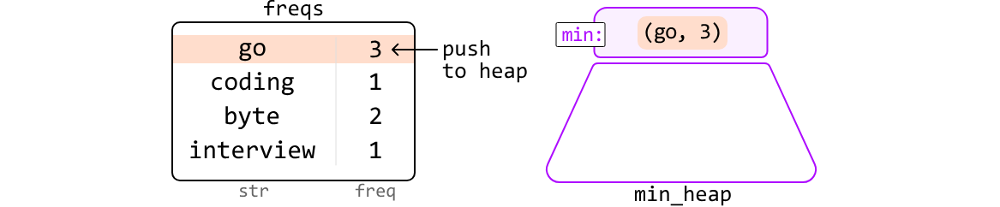

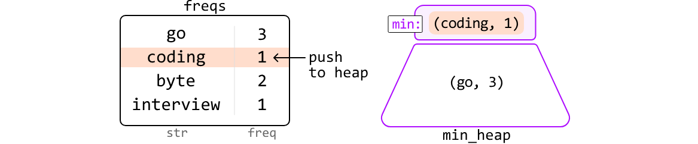

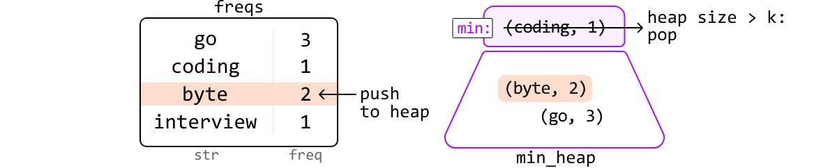

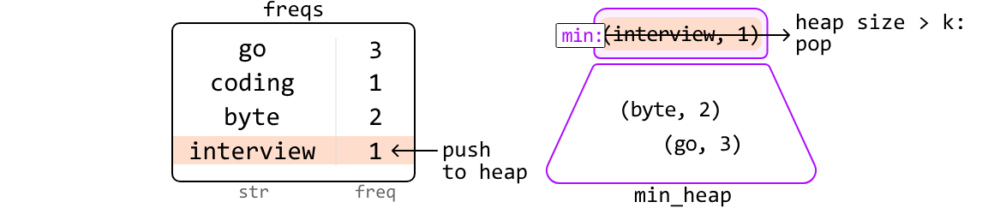

In the end, the strings remaining in the heap are our top k frequent strings:

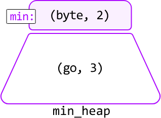

To retrieve these strings, pop them from the heap until it's empty. Because we're using a min-heap, we're popping off the less frequent strings first. So, we need to reverse the order of the retrieved strings before returning the result:

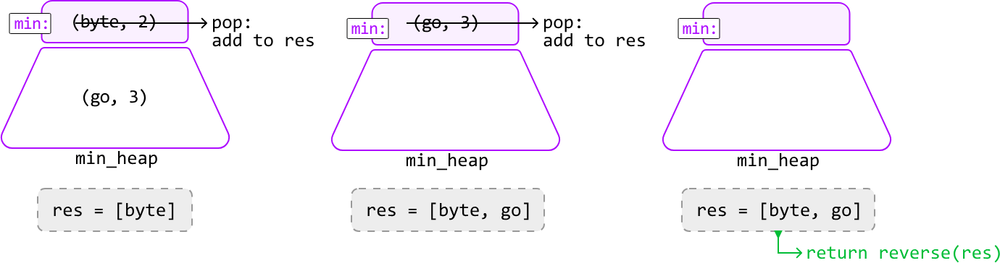

### Python

```python
from typing import List
from collections import Counter
import heapq
    
class Pair:
    def __init__(self, str, freq):
        self.str = str
        self.freq = freq
    # Since this is a min-heap comparator, we can use the same comparator as the one
    # used in the max-heap, but reversing the inequality signs to invert the priority.
    def __lt__(self, other):
        if self.freq == other.freq:
            return self.str > other.str
        return self.freq < other.freq
    
def k_most_frequent_strings_min_heap(strs: List[str], k: int) -> List[str]:
    freqs = Counter(strs)
    min_heap = []
    for str, freq in freqs.items():
        heapq.heappush(min_heap, Pair(str, freq))
        # If heap size exceeds 'k', pop the lowest frequency string to ensure the heap
        # only contains the 'k' most frequent words so far.
        if len(min_heap) > k:
            heapq.heappop(min_heap)
    # Return the 'k' most frequent strings by popping the remaining 'k' strings from
    # the heap. Since we're using a min-heap, we need to reverse the result after
    # popping the elements to ensure the most frequent strings are listed first.
    res = [heapq.heappop(min_heap).str for _ in range(k)]
    res.reverse()
    return res
```
### Java
```java
import java.util.ArrayList;
import java.util.HashMap;
import java.util.Map;
import java.util.PriorityQueue;

class Pair {
    String str;
    int freq;

    public Pair(String str, int freq) {
        this.str = str;
        this.freq = freq;
    }
}

public class Main {
    public ArrayList<String> k_most_frequent_strings_min_heap(ArrayList<String> strs, int k) {
        // Count the frequency of each string.
        Map<String, Integer> freqs = new HashMap<>();
        for (String s : strs) {
            freqs.put(s, freqs.getOrDefault(s, 0) + 1);
        }
        // Min-heap with a custom comparator: lower frequencies have higher priority.
        PriorityQueue<Pair> minHeap = new PriorityQueue<>((a, b) -> {
            // If frequencies are equal, prioritize lexicographically larger strings.
            if (a.freq == b.freq) {
                return b.str.compareTo(a.str);
            }
            return a.freq - b.freq;
        });
        // Maintain a heap of size 'k' with the most frequent strings so far.
        for (Map.Entry<String, Integer> entry : freqs.entrySet()) {
            minHeap.offer(new Pair(entry.getKey(), entry.getValue()));
            if (minHeap.size() > k) {
                minHeap.poll();
            }
        }
        // Pop elements from the heap and reverse the result to return most frequent first.
        ArrayList<String> res = new ArrayList<>();
        while (!minHeap.isEmpty()) {
            res.add(minHeap.poll().str);
        }
        // Reverse the list since it's a min-heap and we want the most frequent first.
        ArrayList<String> reversed = new ArrayList<>();
        for (int i = res.size() - 1; i >= 0; i--) {
            reversed.add(res.get(i));
        }
        return reversed;
    }
}
```
## Complexity Analysis

**Time complexity:** The time complexity of `k_most_frequent_strings_min_heap` is **O(n log(k))**.

- It takes **O(n)** time to count the frequency of each string using `Counter`.
- To populate the heap, we push **n** words onto it, with each push and pop operation taking **O(log(k))** time. This takes **O(n log(k))** time.
- Then, we extract **k** strings from the heap by performing the pop operation **k** times. This takes **O(k log(k))** time.
- Finally, we reverse the output array, which takes **O(k)** time.
- Therefore, the overall time complexity is O(n) + O(n log(k)) + O(k log(k)) + O(k) = **O(n log(k))**.

**Space complexity:** The space complexity is **O(n)** because the hash map stores at most **n** pairs, whereas the heap only takes up **O(k)** space. The `res` array is not considered in the space complexity.


---


# Combine Sorted Linked Lists

Given k singly linked lists, each sorted in ascending order, combine them into one sorted linked list.

## Example

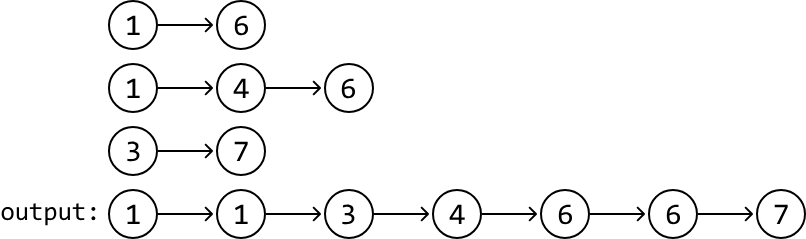

## Intuition

A good place to start with this problem is by figuring out how to merge just two sorted linked lists. We can do this by initiating a pointer at the start of both linked lists. Comparing the nodes at these pointers, add the smaller one to the output linked list and advance the corresponding pointer. This results in a combined sorted linked list:

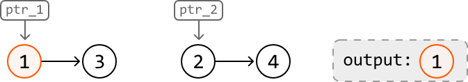
---

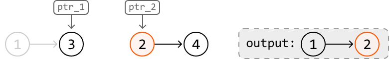

---

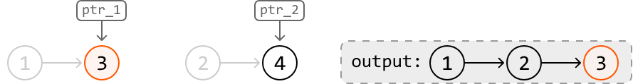

---

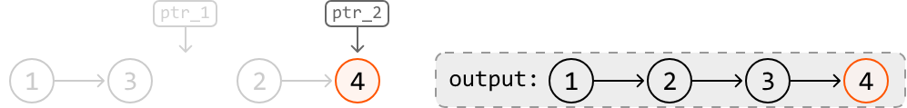

But what if we have more than two linked lists? Combining two linked lists involves comparing two nodes at each iteration, but combining k linked lists would require k comparisons per iteration.

The reason we need to make so many comparisons is that we don't know which node has the smallest value at any point in the iteration, requiring us to search for it. Wouldn't it be nice to have an efficient way to access the smallest-valued node at any given point? A **min-heap** is perfect for this.

We can essentially do the same thing as in our initial approach, but instead of using pointers to determine the smallest node, we use a min-heap. Let's see how this works over the three sorted linked lists below:

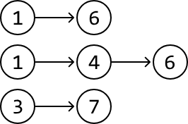

To start, populate the heap with the head nodes of all the linked lists, so they're ready for comparison:

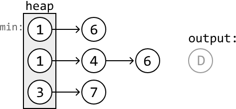

Then, let's implement our strategy of adding the smallest-valued node to the output linked list, using the heap to identify it. We'll use a dummy node to help build the output linked list (denoted as 'node D' in the above diagram).

After a node is popped off, the subsequent node from its linked list is added to the heap.

Now, let's go through the example. First, we pop off the smallest-valued node from the heap and connect it to the tail of the output list:

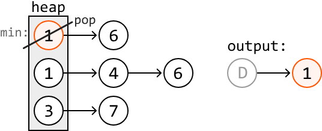

Then, add the subsequent node from the same linked list to the heap:

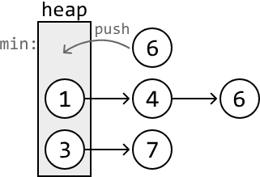

Continue this until we've added each node from all k linked lists to the output linked list:

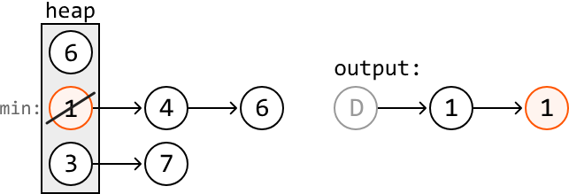

---

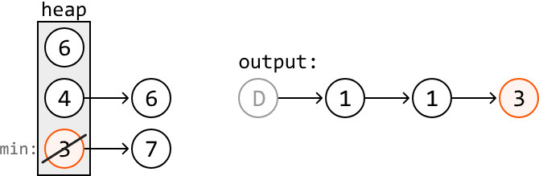

---

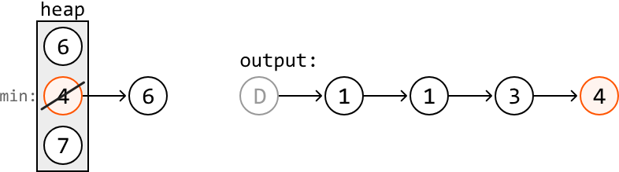

---

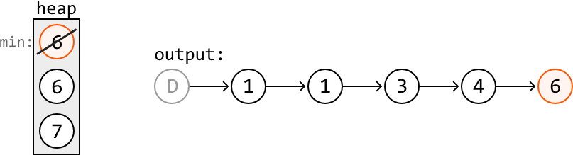

---

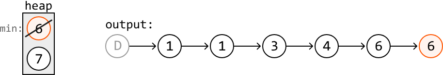

---

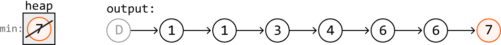

Once the heap is empty, we can return `dummy.next`, which is the head of the combined linked list.

## Try it yourself

Write your solution to the problem before checking the reference implementation.

## Implementation

Note that in the implementation below, we modify the `ListNode` class globally to simplify the solution. It's important to confirm with your interviewer that global variables are acceptable.

### Python

```python
from typing import List
from ds import ListNode
import heapq
    
def combine_sorted_linked_lists(lists: List[ListNode]) -> ListNode:
    # Define a custom comparator for 'ListNode', enabling the min-heap to prioritize
    # nodes with smaller values.
    ListNode.__lt__ = lambda self, other: self.val < other.val
    heap = []
    # Push the head of each linked list into the heap.
    for head in lists:
        if head:
            heapq.heappush(heap, head)
    # Set a dummy node to point to the head of the output linked list.
    dummy = ListNode(-1)
    # Create a pointer to iterate through the combined linked list as we add nodes to
    # it.
    curr = dummy
    while heap:
        # Pop the node with the smallest value from the heap and add it to the output
        # linked list.
        smallest_node = heapq.heappop(heap)
        curr.next = smallest_node
        curr = curr.next
        # Push the popped node's subsequent node to the heap.
        if smallest_node.next:
            heapq.heappush(heap, smallest_node.next)
    return dummy.next
```
### JavaScript
```javascript
import { ListNode } from './ds.js'
import { MinPriorityQueue } from './helpers/heap/MinPriorityQueue.js'

export function combine_sorted_linked_lists(lists) {
  // Create a min-heap that compares nodes by their value
  const heap = new MinPriorityQueue((node) => node.val)
  // Push the head of each linked list into the heap
  for (const head of lists) {
    if (head) {
      heap.enqueue(head)
    }
  }
  // Set a dummy node to point to the head of the output linked list
  const dummy = new ListNode(-1)
  // Create a pointer to iterate through the combined linked list
  let curr = dummy
  while (!heap.isEmpty()) {
    // Pop the node with the smallest value from the heap and add it to the output
    const smallestNode = heap.dequeue()
    curr.next = smallestNode
    curr = curr.next
    // Push the popped node's next node into the heap (if it exists)
    if (smallestNode.next) {
      heap.enqueue(smallestNode.next)
    }
  }
  return dummy.next
}
```
### Java
```java
import java.util.ArrayList;
import java.util.PriorityQueue;
import core.LinkedList.ListNode;

class UserCode {
    public static ListNode<Integer> combineSortedLinkedLists(ArrayList<ListNode> lists) {
        // Define a custom comparator for 'ListNode', enabling the min-heap to prioritize
        // nodes with smaller values.
        PriorityQueue<ListNode<Integer>> heap = new PriorityQueue<>((a, b) -> a.val - b.val);
        // Push the head of each linked list into the heap.
        for (ListNode<Integer> head : lists) {
            if (head != null) {
                heap.offer(head);
            }
        }
        // Set a dummy node to point to the head of the output linked list.
        ListNode<Integer> dummy = new ListNode<>(-1);
        // Create a pointer to iterate through the combined linked list as we add nodes to
        // it.
        ListNode<Integer> curr = dummy;
        while (!heap.isEmpty()) {
            // Pop the node with the smallest value from the heap and add it to the output
            // linked list.
            ListNode<Integer> smallestNode = heap.poll();
            curr.next = smallestNode;
            curr = curr.next;

            // Push the popped node's subsequent node to the heap.
            if (smallestNode.next != null) {
                heap.offer(smallestNode.next);
            }
        }
        return dummy.next;
    }
}
```
## Complexity Analysis

**Time complexity:** The time complexity of `combine_sorted_linked_lists` is **O(n log(k))**, where **n** denotes the total number of nodes across the linked lists. Here's why:

- It takes **O(k log(k))** time to create the heap initially because we insert **k** nodes into the heap.
- Then, for all **n** nodes, we perform a push and pop operation on the heap, each taking **O(log(k))** time.
- This results in a total time complexity of O(k log(k)) + n·O(log(k)) = **O(n log(k))**.

**Space complexity:** The space complexity is **O(k)** because the heap stores up to one node from each of the **k** linked lists at any time.


---


# Median of an Integer Stream

Design a data structure that supports adding integers from a data stream and retrieving the median of all elements received at any point.

- `add(num: int) -> None`: adds an integer to the data structure.
- `get_median() -> float`: returns the median of all integers so far.

## Example

```
Input: [add(3), add(6), get_median(), add(1), get_median()]
Output: [4.5, 3.0]
Explanation:

add(3)        # data structure contains [3] when sorted
add(6)        # data structure contains [3, 6] when sorted
get_median()  # median is (3 + 6) / 2 = 4.5
add(1)        # data structure contains [1, 3, 6] when sorted
get_median()  # median is 3.0
```

## Constraints

- At least one value will have been added before `get_median` is called.

## Intuition

The median is always found in the middle of a sorted list of values. The challenge with this problem is that it's unclear how to keep all the values sorted as new values arrive, since the values don't necessarily arrive in sorted order.

A useful point to recognize is that we don't necessarily care if all the values are sorted. What really matters is that the median values are in their sorted positions. But is it possible to position these values in the middle without maintaining a fully sorted list of values? If it is, we'd need to find a way to differentiate the median values from the rest.

Consider the elements below, which contain an even number of values arranged in sorted order. The two values used to calculate the median are highlighted in the middle:

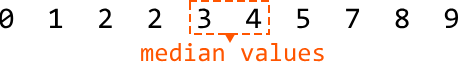

When a list contains two median values, we can make the following observations:

- The first median is the **largest value in the left half** of the sorted integers.
- The second median is the **smallest value in the right half** of the sorted integers.

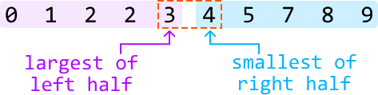

If we had a way to split the data into two halves, with one half containing the smaller values and the other half containing the larger values, we would just need an efficient method to identify the largest value in the smaller half, and the smallest value in the larger half. This is where heaps come in.

We can use a combination of a min-heap and a max-heap:

- A **max-heap** manages the left half, where the top value represents the first median value.
- A **min-heap** manages the right half, where the top value represents the second median value.

If the total number of elements is odd, there's only one median. In this case, we just need to use one of the heaps to store it. Let's designate the max-heap to store this median:

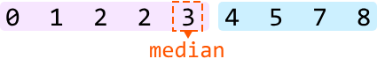

## Populating the heaps

Before identifying how we populate each heap, it's useful to understand the behavior they must follow. Here are a couple of observations we can make:

1. All values in the left half must be less than or equal to any value in the right half.
2. The two halves should contain an equal number of values, except when the total number of values is odd, in which case the left half has one more value, as specified earlier.

These observations help us define two rules for managing the heaps:

1. The maximum value of the max-heap (left half) must be less than or equal to the minimum value of the min-heap (right half), ensuring all values in the left half are less than or equal to those in the right half.
2. The heaps should be of equal size, but the max-heap can have one more element than the min-heap.

Let's figure out how to maintain these rules in an example in which we try to add number 3 to the heaps. Note, the heaps before adding this number meet the above rules.

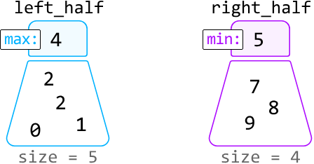

Since 3 is less than the maximum value of `left_half` (4), it belongs in the `left_half` heap. So, let's add 3 to this heap:

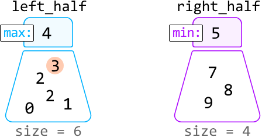

After adding 3, we notice rule 2 has been violated, since the size of the `left_half` heap is more than one element larger than the `right_half` heap. We can fix this by moving the max value of `left_half` to `right_half`:

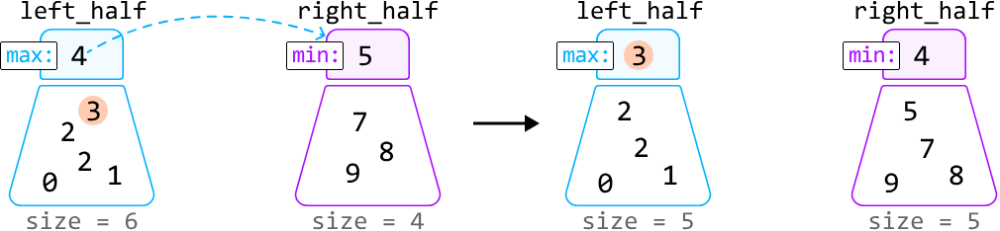

So, to ensure the sizes of the heaps don't violate rule 2, we need to rebalance the heaps after adding a value:

- If the `left_half` heap's size exceeds the `right_half` heap's size by more than one, rebalance the heaps by transferring `left_half`'s top value to `right_half`:

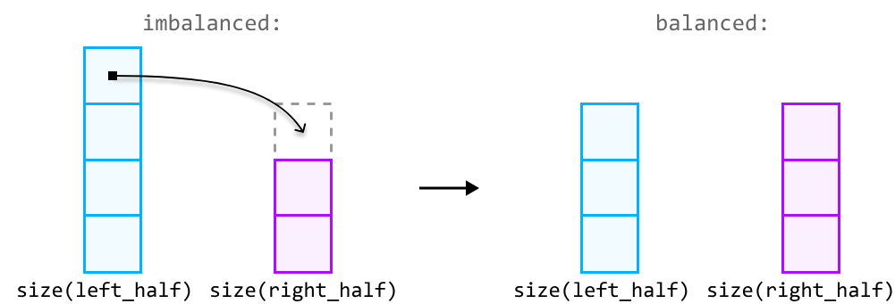

- If the `right_half` heap's size exceeds the `left_half` heap's size, rebalance the heaps by transferring its top value to the `left_half`:

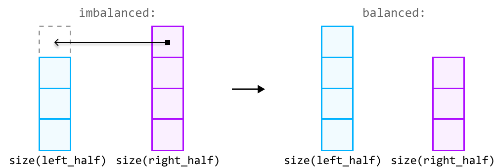

## Returning the median

With the median values at the top of the heaps, returning the median boils down to two cases:

- If the total number of elements is **even**, both median values can be found at the top of each heap. So, we return their sum divided by 2.
- If the total number of elements is **odd**, the median will be at the top of the `left_half` heap.

## Try it yourself

Write your solution to the problem before checking the reference implementation.

## Implementation

Note that in Python, heaps are min-heaps by default. To mimic the functionality of a max-heap, we can insert numbers as negatives in the `left_half` heap. This way, the largest original value becomes the smallest when negated, positioning it at the top of the heap. When we retrieve a value from this heap, we multiply it by -1 to get its original value.

### Python

```python
import heapq
    
class MedianOfAnIntegerStream:
    def __init__(self):
        # Max-heap for the values belonging to the left half.
        self.left_half = []
        # Min-heap for the values belonging to the right half.
        self.right_half = []
        
    def add(self, num: int) -> None:
        # If 'num' is less than or equal to the max of 'left_half', it belongs to the
        # left half.
        if not self.left_half or num <= -self.left_half[0]:
            heapq.heappush(self.left_half, -num)
            # Rebalance the heaps if the size of the 'left_half' exceeds the size of
            # the 'right_half' by more than one.
            if len(self.left_half) > len(self.right_half) + 1:
                heapq.heappush(self.right_half, -heapq.heappop(self.left_half))
        # Otherwise, it belongs to the right half.
        else:
            heapq.heappush(self.right_half, num)
            # Rebalance the heaps If 'right_half' is larger than 'left_half'.
            if len(self.left_half) < len(self.right_half):
                heapq.heappush(self.left_half, -heapq.heappop(self.right_half))
        
    def get_median(self) -> float:
        if len(self.left_half) == len(self.right_half):
            return (-self.left_half[0] + self.right_half[0]) / 2.0
        return -self.left_half[0]
```
### JavaScript
```javascript
import { MaxPriorityQueue } from './helpers/heap/MaxPriorityQueue.js'
import { MinPriorityQueue } from './helpers/heap/MinPriorityQueue.js'

export class MedianOfAnIntegerStream {
  constructor() {
    // Max-heap for the values belonging to the left half.
    this.leftHalf = new MaxPriorityQueue((n) => n)
    // Min-heap for the values belonging to the right half.
    this.rightHalf = new MinPriorityQueue((n) => n)
  }

  add(num) {
    // If 'num' is less than or equal to the max of 'leftHalf', it belongs to the left half.
    if (this.leftHalf.isEmpty() || num <= this.leftHalf.front()) {
      this.leftHalf.enqueue(num)
      // Rebalance: if leftHalf has more than one extra element
      if (this.leftHalf.size() > this.rightHalf.size() + 1) {
        this.rightHalf.enqueue(this.leftHalf.dequeue())
      }
    } else {
      // Otherwise, it belongs to the right half.
      this.rightHalf.enqueue(num)
      // Rebalance: if rightHalf has more elements than leftHalf
      if (this.rightHalf.size() > this.leftHalf.size()) {
        this.leftHalf.enqueue(this.rightHalf.dequeue())
      }
    }
  }

  get_median() {
    if (this.leftHalf.size() === this.rightHalf.size()) {
      return (this.leftHalf.front() + this.rightHalf.front()) / 2.0
    }
    return this.leftHalf.front()
  }
}
```
### Java
```java
import java.util.PriorityQueue;
import java.util.Collections;

class MedianOfAnIntegerStream {
    // Max-heap for the values belonging to the left half.
    private PriorityQueue<Integer> leftHalf;
    // Min-heap for the values belonging to the right half.
    private PriorityQueue<Integer> rightHalf;

    public MedianOfAnIntegerStream() {
        leftHalf = new PriorityQueue<>(Collections.reverseOrder());
        rightHalf = new PriorityQueue<>();
    }

    public void add(Integer num) {
        // If 'num' is less than or equal to the max of 'leftHalf', it belongs to the
        // left half.
        if (leftHalf.isEmpty() || num <= leftHalf.peek()) {
            leftHalf.offer(num);
            // Rebalance the heaps if the size of the 'leftHalf' exceeds the size of
            // the 'rightHalf' by more than one.
            if (leftHalf.size() > rightHalf.size() + 1) {
                rightHalf.offer(leftHalf.poll());
            }
        } else {
            // Otherwise, it belongs to the right half.
            rightHalf.offer(num);
            // Rebalance the heaps If 'rightHalf' is larger than 'leftHalf'.
            if (rightHalf.size() > leftHalf.size()) {
                leftHalf.offer(rightHalf.poll());
            }
        }
    }

    public Double getMedian() {
        if (leftHalf.size() == rightHalf.size()) {
            return (leftHalf.peek() + rightHalf.peek()) / 2.0;
        }
        return (double) leftHalf.peek();
    }
}
```
## Complexity Analysis

**Time complexity:**

- The time complexity of `add` is **O(log(n))**, where **n** denotes the number of values added to the data structure. This is because we first push a number to one of the heaps, which takes **O(log(n))** time. Then, if rebalancing is required, we also pop from one heap and push to the other, where both operations also take **O(log(n))** time.
- The time complexity of `get_median` is **O(1)** because accessing the top element of a heap takes **O(1)** time.

**Space complexity:** The space complexity is **O(n)** because the two heaps together store **n** elements.

> **Note:** this explanation refers to the two middle values as "median values" to keep things simple. However, it's important to understand that these two values aren't technically "medians," as there's only ever one median. These are just the two values used to calculate the median.


---


# Sort a K-Sorted Array

Given an integer array where each element is at most k positions away from its sorted position, sort the array in a non-decreasing order.

## Example

```
Input: nums = [5, 1, 9, 4, 7, 10], k = 2
Output: [1, 4, 5, 7, 9, 10]
```

## Intuition

In a k-sorted array, each element is at most k indexes away from where it would be in a fully sorted array. We can visualize this with the following example where k = 2, and no number is more than k indexes away from its sorted position:

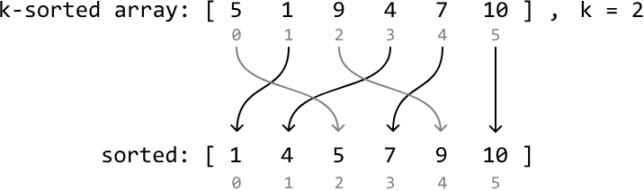

A trivial solution to this problem is to sort the array using a standard sorting algorithm. However, since the input is partially sorted (k-sorted), we should assume there's a faster way to sort the array.

We can think about this problem backward. For any index i, the element that belongs at index i in the sorted array is located within the range [i - k, i + k]. Below, we visualize how number 7, which is meant to be at index 3 when sorted, correctly falls within the range [3 - k, 3 + k] in the k-sorted array:

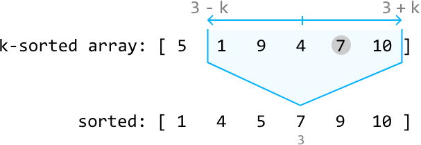

This is a good start, but we can reduce this range even further. Consider index 0 from the above array. We know the number which belongs at index 0 when sorted is somewhere in the range [0, 0 + k]:

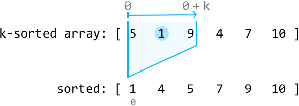

Note that the sorted array in the diagrams is purely provided as a reference point. We don't yet know which number in the range [0, 0 + k] belongs at index 0. However, one fact remains consistent: in a sorted array, index 0 always holds the smallest number. This means the value needed at index 0 is also the smallest number within the range [0, 0 + k] of the k-sorted array, which is 1 in this example.

So, let's swap 1 with the number at index 0 to position 1 as the first value in the sorted array:

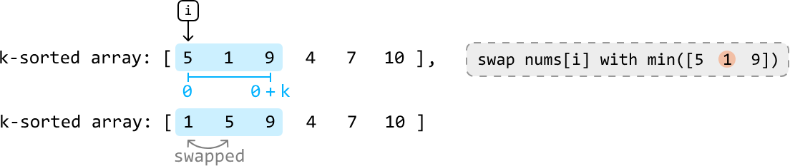

Now let's find the number that belongs at index 1: the second smallest number. Since index 0 currently contains the smallest value in the array, we won't need to consider index 0 in our search. Therefore, we can find the value that belongs at index 1 in the range [1, 1 + k]. The smallest value in this range will be the second smallest value overall, which is 4 in this case.

So, let's swap 4 with the number at index 1 to position 4 as the second value in the sorted array:

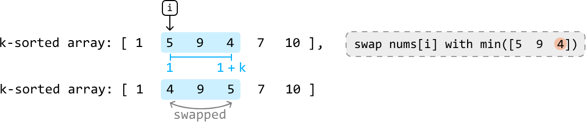

If we continue this process for the rest of the array, we'll successfully sort the k-sorted array.

The main inefficiency with this approach is finding the minimum number in the range [i, i + k] at each index i. Linearly searching for it will take **O(k)** time at each index.

To improve this approach, we'd need a way to efficiently access the minimum value at each of these ranges. A **min-heap** would be perfect for this.

## Min-heap

For a min-heap to determine the minimum value within each range [i, i + k], it will always need to be populated with the values in these ranges as we iterate through the array. Let's see how this works over the same example.

Before we can determine which value belongs at index 0, we'll need to populate the heap with all the values in the range [0, k], which are the first k + 1 values (where k = 2 in this example):

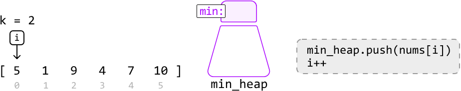
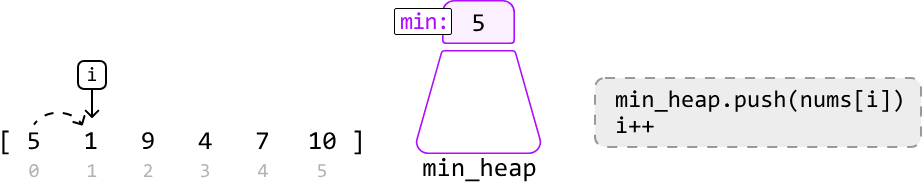
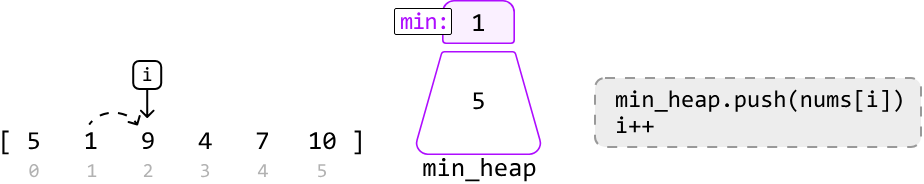
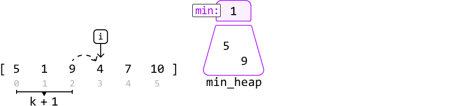

An alternative way to create a heap of the first k + 1 elements is to heapify a list of the first k + 1 elements.

Now, let's begin inserting the smallest elements from the heap into the array, using the `insert_index` pointer. The value that belongs at index 0 in sorted order is the value currently at the top of the heap, which is 1:

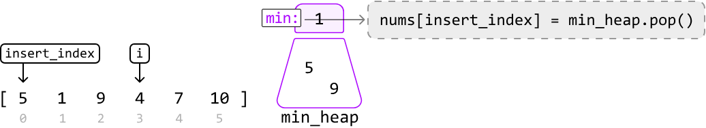

Once we insert 1 at index 0, push the value at index i to the heap before incrementing both pointers:

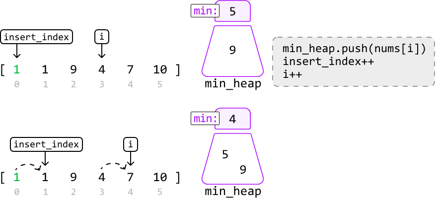

Let's continue this process for the remaining numbers:

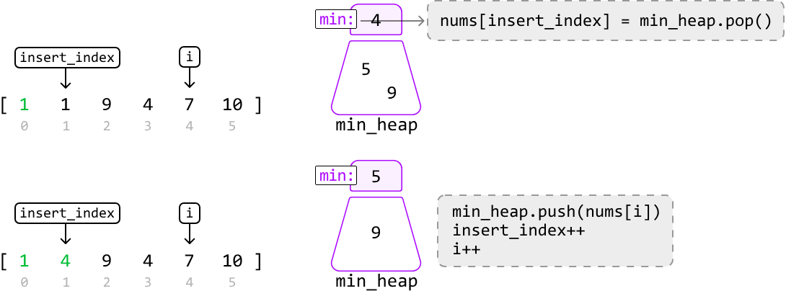

---

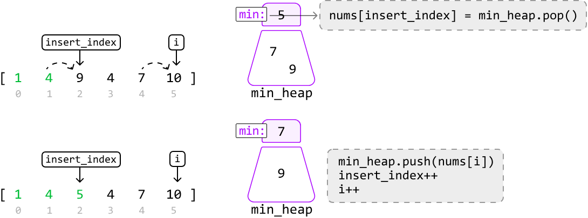

---

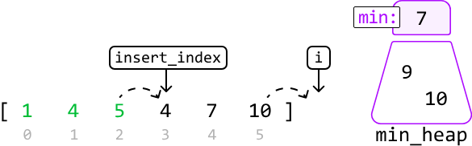

Once there are no more elements to push into the heap, the rest of the array can be sorted by inserting the remaining values from the heap:


---


---


---


---


Once the heap is empty, the array is sorted.

```
min_heap: []
nums = [1, 4, 5, 7, 9, 10]  ✓
```

## Try it yourself

Write your solution to the problem before checking the reference implementation.

## Implementation

### Python

```python
from typing import List
import heapq
        
def sort_a_k_sorted_array(nums: List[int], k: int) -> List[int]:
    # Populate a min-heap with the first k + 1 values in 'nums'.
    min_heap = nums[:k+1]
    heapq.heapify(min_heap)
    # Replace elements in the array with the minimum from the heap at each
    # iteration.
    insert_index = 0
    for i in range(k + 1, len(nums)):
        nums[insert_index] = heapq.heappop(min_heap)
        insert_index += 1
        heapq.heappush(min_heap, nums[i])
    # Pop the remaining elements from the heap to finish sorting the array.
    while min_heap:
        nums[insert_index] = heapq.heappop(min_heap)
        insert_index += 1
    return nums
```
### JavaScript
```javascript
import { MinPriorityQueue } from './helpers/heap/index.js'

export function sort_a_k_sorted_array(nums, k) {
  // Populate a min-heap with the first k + 1 values in 'nums'.
  const minHeap = new MinPriorityQueue((x) => x)
  for (let i = 0; i <= k && i < nums.length; i++) {
    minHeap.enqueue(nums[i])
  }
  // Replace elements in the array with the minimum from the heap at each iteration.
  let insertIndex = 0
  for (let i = k + 1; i < nums.length; i++) {
    nums[insertIndex] = minHeap.dequeue()
    insertIndex++
    minHeap.enqueue(nums[i])
  }
  // Pop the remaining elements from the heap to finish sorting the array.
  while (!minHeap.isEmpty()) {
    nums[insertIndex] = minHeap.dequeue()
    insertIndex++
  }
  return nums
}
```
### Java
```java
import java.util.ArrayList;
import java.util.PriorityQueue;

class Main {
    public ArrayList<Integer> sort_a_k_sorted_array(ArrayList<Integer> nums, int k) {
        // Populate a min-heap with the first k + 1 values in 'nums'.
        PriorityQueue<Integer> minHeap = new PriorityQueue<>();
        int n = nums.size();
        for (int i = 0; i <= Math.min(k, n - 1); i++) {
            minHeap.offer(nums.get(i));
        }
        // Replace elements in the array with the minimum from the heap at each
        // iteration.
        int insertIndex = 0;
        for (int i = k + 1; i < n; i++) {
            nums.set(insertIndex++, minHeap.poll());
            minHeap.offer(nums.get(i));
        }
        // Pop the remaining elements from the heap to finish sorting the array.
        while (!minHeap.isEmpty()) {
            nums.set(insertIndex++, minHeap.poll());
        }
        return nums;
    }
}
```
## Complexity Analysis

**Time complexity:** The time complexity of `sort_a_k_sorted_array` is **O(n log(k))**, where **n** denotes the length of the array. Here's why:

- We perform heapify on a `min_heap` of size **k + 1** which takes **O(k)** time. Note that **k** is upper-bounded by **n** in this operation since the heap won't have more than **n** values.

- Then, we perform push and pop operations on approximately **n - k** values using the heap. Since the heap can grow up to a size of **k + 1**, each push and pop operation takes **O(log(k))** time. Therefore, this loop takes **O(n log(k))** time in the worst case.

- The final while-loop runs in **O(k log(k))** time since we pop **k + 1** values from the heap. Note that **k** here is also upper-bounded by **n**.

- Therefore, the overall time complexity is O(k) + O(n log(k)) + O(k log(k)) = **O(n log(k))**.

**Space complexity:** The space complexity is **O(k)** since the heap can grow up to **k + 1** in size.