# 09. Intervals

1. [Introduction to Intervals](#introduction-to-intervals)
2. [Merge Overlapping Intervals](#merge-overlapping-intervals)
3. [Identify All Interval Overlaps](#identify-all-interval-overlaps)
4. [Largest Overlap of Intervals](#largest-overlap-of-intervals)

---

# Introduction to Intervals

## Intuition

An interval consists of two values: a start point and an end point. It represents a continuous segment on the number line that includes all values between these two points. It is often used to represent a line, time period, or a continuous range of values.

- An interval's **start point** indicates where the interval begins.
- An interval's **end point** indicates where the interval ends.


Intervals can be closed, open, or half-open, based on whether their start or end points are included in the interval.

- **Closed intervals:** Both the start and end points are included in the interval.

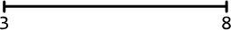

- **Open intervals:** The start and end points are not included in the interval.

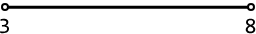

- **Half-open intervals:** Either the start or the end point is included, while the other is not.

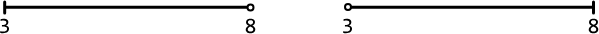

When presented with an interval problem in an interview, it's important to clarify whether the intervals are open, closed, or half-open, as this can change the nature of how intervals overlap.

## Overlapping intervals

Two intervals overlap if they share at least one common value.

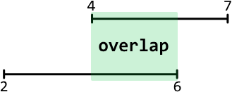

The central challenge in most interval problems involves managing overlapping intervals effectively. Whether identifying or merging overlapping intervals, it's important to determine how the overlap between intervals influences the desired outcome of the problem. The problems in this chapter involve handling overlapping intervals in varying situations.

## Sorting intervals

In most interval problems, sorting the intervals before solving the problem is quite helpful since it allows them to be processed in a certain order.

We usually sort intervals by their start point so they can be traversed in chronological order. When two or more intervals have the same start point, we might also need to consider each interval's end points during sorting.

## Separating start and end points

In certain scenarios, it might be beneficial to process the start and end points of intervals separately. This usually involves creating two sorted arrays: one containing all start points and another containing all end points. For example, this is needed in the sweeping line algorithm, which is explored in the Largest Overlap of Intervals problem.

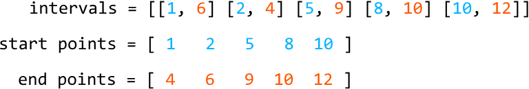

## Interval class definition

For the problems in this chapter, intervals are represented using the class below.

### Python

```python
class Interval:
   def __init__(self, start, end):
       self.start = start
       self.end = end
```
### JavaScript
```javascript
class Interval {
  constructor(start, end) {
    this.start = start
    this.end = end
  }
}
```
### Java
```java
class Interval {
    int start;
    int end;

    public Interval(int start, int end) {
        this.start = start;
        this.end = end;
    }
}
```
## Real-world Example

**Scheduling systems:** Intervals are widely used in scheduling systems. For instance, in a conference room booking system, each booking is represented as an interval. The interval representation is used if the system requires functionality, such as determining the maximum number of overlapping bookings to ensure sufficient room availability. By analyzing these intervals, the system can efficiently allocate resources and prevent double bookings.

## Chapter Outline

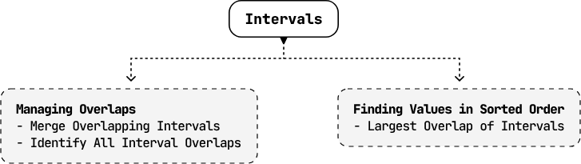


---


# Merge Overlapping Intervals

Merge an array of intervals so there are no overlapping intervals, and return the resultant merged intervals.

## Example
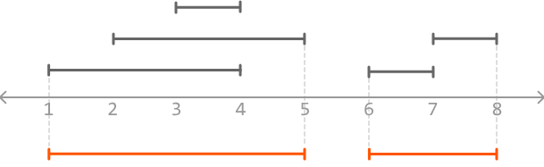
```
Input: intervals = [[3, 4], [7, 8], [2, 5], [6, 7], [1, 4]]
Output: [[1, 5], [6, 8]]
```

## Constraints

- The input contains at least one interval.
- For every index i in the array, `intervals[i].start ≤ intervals[i].end`.

## Intuition

There are two main challenges to this problem:

1. Identifying which intervals overlap each other.
2. Merging those intervals.

Let's start by tackling the first challenge. Consider two intervals, A and B, where interval A starts before B. Below, we visualize the case when these two intervals don't overlap:

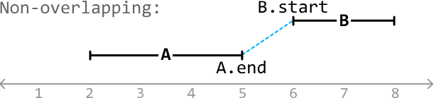

The dashed line above shows that interval A ends before interval B starts, which eliminates the possibility of B overlapping A. This indicates that intervals A and B will never overlap when `A.end < B.start`.

Now, consider a couple of cases where these two intervals do overlap:

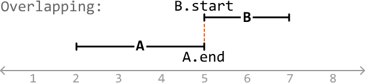
---

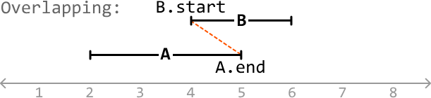

In these cases, we see that B starts before (or when) A ends (`A.end ≥ B.start`). In other words, some portion of B overlaps A since interval A hasn't ended before interval B starts. Therefore, intervals A and B overlap when `A.end ≥ B.start`.

We have now established the two cases that cover all overlapping and non-overlapping scenarios for two intervals, given interval A starts before interval B:

- If `A.end < B.start`, the intervals **don't overlap**.
- If `A.end ≥ B.start`, the intervals **overlap**.

To apply these conditions to any two intervals in the input, it's useful to have a way to identify which interval starts first. One idea is to sort the intervals by their start value, which will make it clear which one of each two adjacent intervals starts first.

## Merging intervals

With the above logic in mind, let's tackle an example. Consider the following intervals:

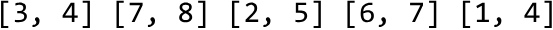

The first step is to sort these intervals by start value:

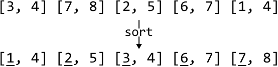

To aid the explanation, let's represent the intervals visually:

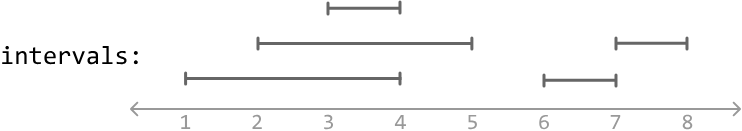

Let's add/merge each interval into a new array called `merged`, starting with the first one, which we can add to the `merged` array straight away as it's the first interval:

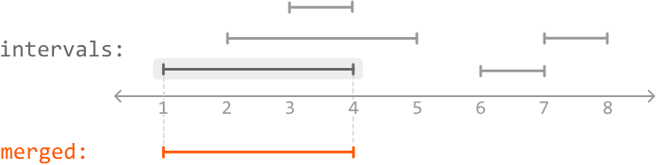

After the first interval is added, we start the process of merging. Let's define A as the last interval in the `merged` array and B as the current interval in the input. This makes sense since the interval in the `merged` array (A) starts before or at the same time as B.

We notice B starts before A ends, indicating an overlap. So, let's merge them:

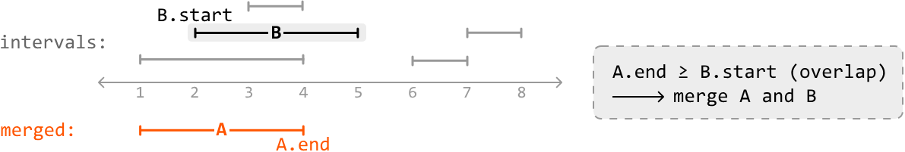

When merging A and B, we use the leftmost start value and the rightmost end value between them. Since A will always start before or at the same time as B, we always use `A.start` as the start point. This means we just need to identify the end point, which is the largest value between the end points of A and B:

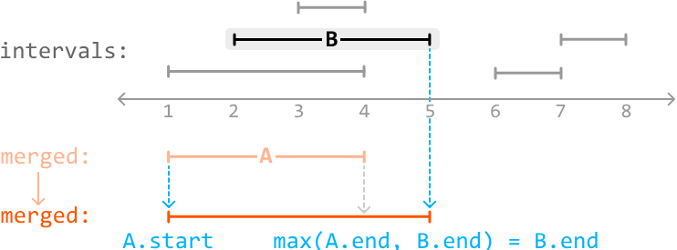

We can apply the same logic to the next interval:

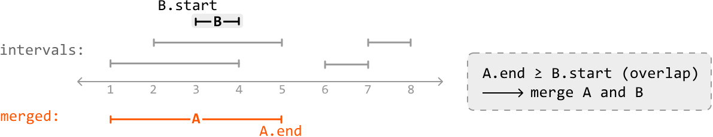

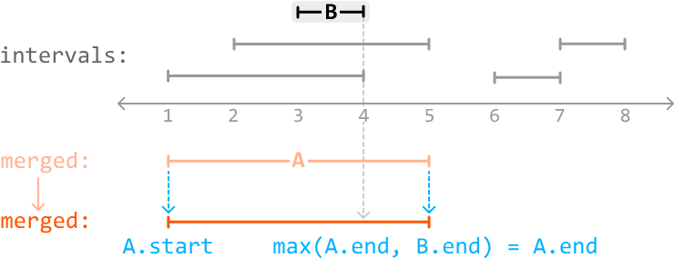

When we reach the fourth interval, we notice B starts after A ends, indicating there is no overlap.

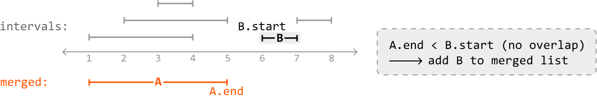

So, we just add it as a new interval to the `merged` array:

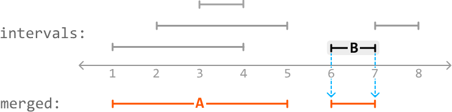

The next interval, B, overlaps the last interval in the `merged` array, A, since B starts when A ends (`A.end == B.start`).

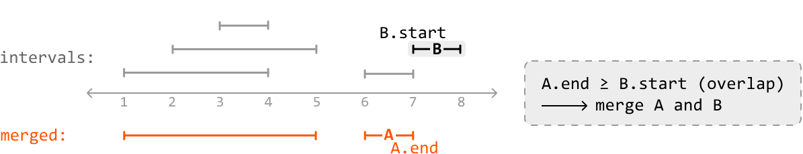

So, let's merge A with B:

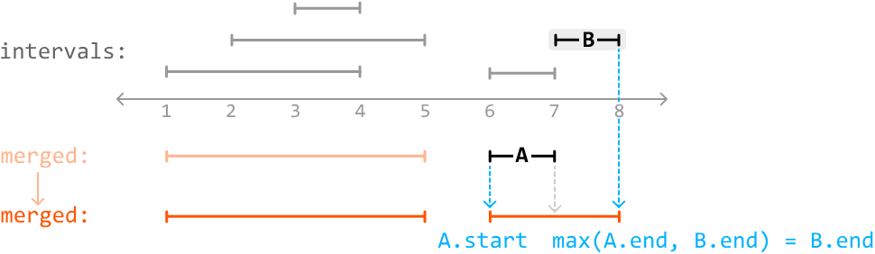

After processing the last interval, we've successfully merged all intervals.

 

## Try it yourself

Write your solution to the problem before checking the reference implementation.

## Implementation

### Python

```python
from typing import List
from ds import Interval
    
def merge_overlapping_intervals(intervals: List[Interval]) -> List[Interval]:
    intervals.sort(key=lambda x: x.start)
    merged = [intervals[0]]
    for B in intervals[1:]:
        A = merged[-1]
        # If A and B don't overlap, add B to the merged list.
        if A.end < B.start:
            merged.append(B)
        # If they do overlap, merge A with B.
        else:
            merged[-1] = Interval(A.start, max(A.end, B.end))
    return merged
```
### JavaScript
```javascript
 import { Interval } from './ds.js'

export function merge_overlapping_intervals(intervals) {
  if (intervals.length === 0) return []
  // Sort intervals by their start value
  intervals.sort((a, b) => a.start - b.start)
  const merged = [intervals[0]]
  for (let i = 1; i < intervals.length; i++) {
    const A = merged[merged.length - 1]
    const B = intervals[i]

    // If A and B don't overlap, add B to the merged list.
    if (A.end < B.start) {
      merged.push(B)
    } else {
      // If they do overlap, merge A with B.
      merged[merged.length - 1] = new Interval(A.start, Math.max(A.end, B.end))
    }
  }
  return merged
}
```
### Java
```java
import java.util.ArrayList;
import java.util.Collections;
import java.util.Comparator;
import core.Interval.Interval;

class Main {
    public static ArrayList<Interval> merge_overlapping_intervals(ArrayList<Interval> intervals) {
        if (intervals == null || intervals.size() == 0) return new ArrayList<>();
        // Sort intervals by their start time.
        intervals.sort(Comparator.comparingInt(a -> a.start));
        ArrayList<Interval> merged = new ArrayList<>();
        merged.add(intervals.get(0));
        for (int i = 1; i < intervals.size(); i++) {
            Interval B = intervals.get(i);
            Interval A = merged.get(merged.size() - 1);
            // If A and B don't overlap, add B to the merged list.
            if (A.end < B.start) {
                merged.add(B);
            }
            // If they do overlap, merge A with B.
            else {
                merged.set(merged.size() - 1, new Interval(A.start, Math.max(A.end, B.end)));
            }
        }
        return merged;
    }
}
```
## Complexity Analysis

- **Time complexity:** The time complexity of `merge_overlapping_intervals` is **O(n log(n))**, where **n** denotes the number of intervals. This is due to the sorting algorithm. The process of merging overlapping intervals itself takes **O(n)** time because we iterate over every interval.

- **Space complexity:** The space complexity depends on the space used by the sorting algorithm. In Python, the built-in sorting algorithm, Tim sort, uses **O(n)** space. Note that the `merged` array is not considered in the space complexity calculation because we're only concerned with extra space used, not space taken up by the output.

## Interview Tip

> **Tip: Visualize intervals to uncover logic and edge cases.**
> Managing intervals and handling edge cases is much easier when visualizing example inputs. Drawing examples also helps your interviewer follow along with your reasoning and understand your thought process.


---


# Identify All Interval Overlaps

Return an array of all overlaps between two arrays of intervals; `intervals1` and `intervals2`. Each individual interval array is sorted by start value, and contains no overlapping intervals within itself.

## Example
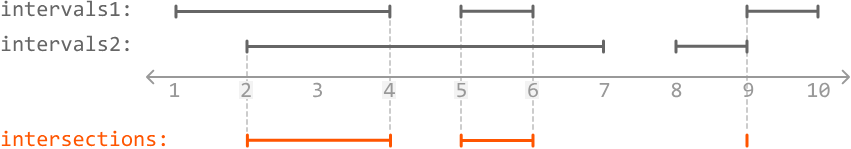
```
Input: intervals1 = [[1, 4], [5, 6], [9, 10]],
       intervals2 = [[2, 7], [8, 9]]
Output: [[2, 4], [5, 6], [9, 9]]

intervals1:  |_____|     |_|     |_|
intervals2:      |___________|  |_|
                 1  2  3  4  5  6  7  8  9  10

intersections:   |___|   |_|    |
                [2,4]   [5,6]  [9,9]
```

## Constraints

- For every index i in intervals1, `intervals1[i].start < intervals1[i].end`.
- For every index j in intervals2, `intervals2[j].start < intervals2[j].end`.

## Intuition

We're given two arrays of intervals, each containing non-overlapping intervals. This implies an overlap can only occur between an interval from the first array and an interval from the second array.

Let's start by learning how to identify an overlap between two overlapping intervals.

### Identifying the overlap between two overlapping intervals

We know from the Merge Overlapping Intervals problem that two intervals, A and B, overlap when `A.end ≥ B.start`, assuming we know A starts before B. Let's have a look at a couple of examples which each contain two overlapping intervals that match this condition:

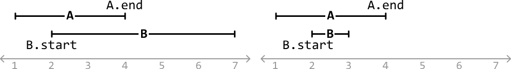

To extract the overlap between these two overlapping intervals, we'll need to identify when it starts and ends.

- The overlap **starts** at the furthest start point, which is always `B.start`.
- The overlap **ends** at the earliest end point (`min(A.end, B.end)`).

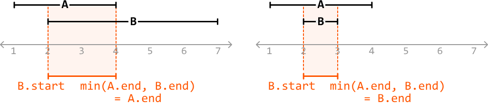

Therefore, when two intervals overlap, their overlap is defined by the range `[B.start, min(A.end, B.end)]`. Remember that in all these cases, interval A always starts first.

### Identifying all overlaps

Now, let's return to the two arrays of intervals. Consider this example:

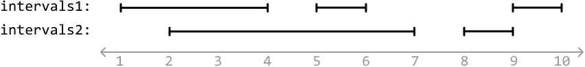

Let's start by considering the first interval from each array:

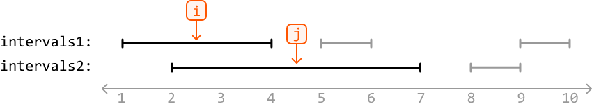

To check if these intervals overlap, we'll need to identify which interval between `intervals1[i]` and `intervals2[j]` starts first, so we can assign that interval as interval A and the other as interval B. The code snippet for this is provided below:
### Python
```python
# Set A to the interval that starts first and B to the other interval.
if intervals1[i].start <= intervals2[j].start:
    A, B = intervals1[i], intervals2[j]
else:
    A, B = intervals2[j], intervals1[i]
```

In this example, `intervals1[i]` starts first:

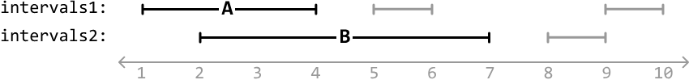

A and B overlap when `A.end ≥ B.start`, which is true here. Since they overlap, let's record their overlap: `[B.start, min(A.end, B.end)]`:

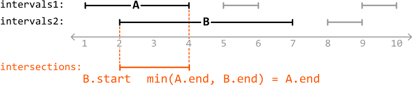

Now that we've identified the overlap between those two intervals, let's move on to the next pair by advancing the pointer at one of the interval arrays. Since `intervals1[i]` ends before `intervals2[j]`, we know that `intervals1[i]` won't overlap with any more intervals from the `intervals2` array, so let's increment the `intervals1` pointer (i) to move to the next interval in this array:

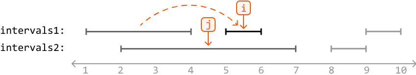

Note, we use `intervals1[i]` and `intervals2[j]` instead of A and B since we don't know which interval array A or B belongs to.

We've now identified a process that allows us to identify and record all overlaps while traversing the arrays of intervals. For the pair of intervals being considered at i and j:

1. Set A as the interval that starts first, and B as the other interval.

2. Check if `A.end ≥ B.start` to see if these intervals overlap. If they do, record the overlap as `[B.start, min(A.end, B.end)]`.

3. Whichever interval ends first, advance its corresponding pointer to move to the next interval.

Continue to apply these steps until either i or j have passed the end of their array. Once this happens, we know there won't be any more overlapping intervals.

## Try it yourself

Write your solution to the problem before checking the reference implementation.

## Implementation

### Python

```python
from typing import List
from ds import Interval
   
def identify_all_interval_overlaps(intervals1: List[Interval], intervals2: List[Interval]) -> List[Interval]:
   overlaps = []
   i = j = 0
   while i < len(intervals1) and j < len(intervals2):
       # Set A to the interval that starts first and B to the other interval.
       if intervals1[i].start <= intervals2[j].start:
           A, B = intervals1[i], intervals2[j]
       else:
           A, B = intervals2[j], intervals1[i]
       # If there's an overlap, add the overlap.
       if A.end >= B.start:
           overlaps.append(Interval(B.start, min(A.end, B.end)))
       # Advance the pointer associated with the interval that ends first.
       if intervals1[i].end < intervals2[j].end:
           i += 1
       else:
           j += 1
   return overlaps
```
### JavaScript
```javascript
import { Interval } from './ds.js'

export function identify_all_interval_overlaps(intervals1, intervals2) {
  const overlaps = []
  let i = 0,
    j = 0
  while (i < intervals1.length && j < intervals2.length) {
    // Set A to the interval that starts first and B to the other interval.
    let A = intervals1[i]
    let B = intervals2[j]
    if (intervals1[i].start > intervals2[j].start) {
      A = intervals2[j]
      B = intervals1[i]
    }
    // If there's an overlap, add the overlap.
    if (A.end >= B.start) {
      overlaps.push(new Interval(B.start, Math.min(A.end, B.end)))
    }
    // Advance the pointer associated with the interval that ends first.
    if (intervals1[i].end < intervals2[j].end) {
      i++
    } else {
      j++
    }
  }
  return overlaps
}
```
### Java
```java
import java.util.ArrayList;
import core.Interval.Interval;

public class Main {
    public static ArrayList<Interval> identify_all_interval_overlaps(ArrayList<Interval> intervals1, ArrayList<Interval> intervals2) {
        ArrayList<Interval> overlaps = new ArrayList<>();
        int i = 0, j = 0;
        while (i < intervals1.size() && j < intervals2.size()) {
            Interval A = intervals1.get(i);
            Interval B = intervals2.get(j);
            // Set A to the interval that starts first and B to the other interval.
            if (A.start > B.start) {
                Interval temp = A;
                A = B;
                B = temp;
            }
            // If there's an overlap, add the overlap.
            if (A.end >= B.start) {
                overlaps.add(new Interval(B.start, Math.min(A.end, B.end)));
            }
            // Advance the pointer associated with the interval that ends first.
            if (intervals1.get(i).end < intervals2.get(j).end) {
                i++;
            } else {
                j++;
            }
        }
        return overlaps;
    }
}
```
## Complexity Analysis

- **Time complexity:** The time complexity of `identify_all_interval_overlaps` is **O(n + m)** where **n** and **m** are the lengths of `intervals1` and `intervals2`, respectively. This is because we traverse each interval in both arrays exactly once.

- **Space complexity:** The space complexity is **O(1)**. Note that the `overlaps` array is not considered because space complexity is only concerned with extra space used and not space taken up by the output.


---


# Largest Overlap of Intervals

Given an array of intervals, determine the maximum number of intervals that overlap at any point. Each interval is half-open, meaning it includes the start point but excludes the end point.

## Example
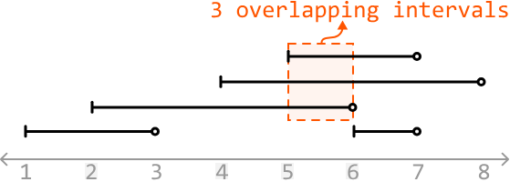
```
Input: intervals = [[1, 3], [5, 7], [2, 6], [4, 8]]
Output: 3

●───────○           [1, 3]
    ●───────────────○   [2, 6]
            ●───────────○   [4, 8]
                ●───○       [5, 7]
1   2   3   4   5   6   7   8
                [___]
            3 overlapping intervals
```

## Constraints

- The input will contain at least one interval.
- For every index i in the list, `intervals[i].start < intervals[i].end`.

## Intuition

Think about what it means when x intervals overlap at a certain point in time. This means at this point, there are x "active" intervals, where an interval is active if it has started but not ended.

In the example below, we see three active intervals at time 5 (intervals that started at or before this time, and haven't yet ended):

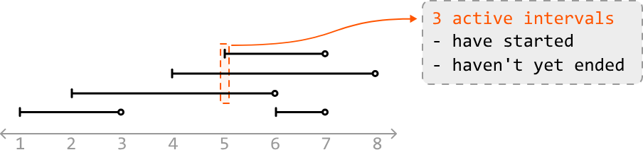

To find the number of active intervals at any point in time, we need to identify when an interval has started and when an interval has ended. The start point of an interval indicates the start of a new active interval, whereas an end point represents an active interval finishing. This suggests an approach which looks at start and end points individually could be useful. Let's explore this idea further.

## Processing start points and end points

Let's step through each point in the array of intervals in chronological order, and see if we can determine the number of active intervals at each point.

The first point is a start point, indicating the start of the first active interval. So, let's increment our counter:

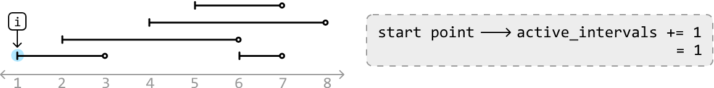

The next point is another start point. This is the start of the second active interval, so let's increment our counter again. Now, the number of active intervals is 2, which correctly corresponds with the number of overlapping intervals at this point:

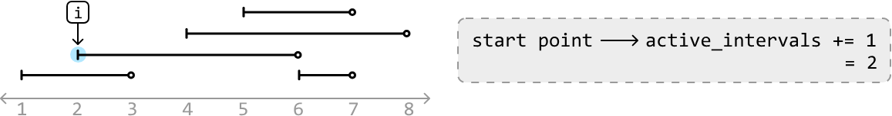

The next point is an end point, which means an active interval has just finished. So, let's decrement our counter. Now, the number of active intervals is 1, which also corresponds with the current number of overlapping intervals:

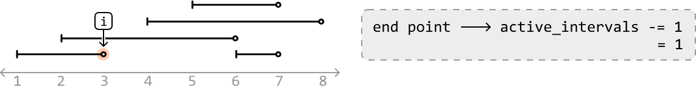

We've now rationalized what we need to do whenever we encounter a start point or end point:

- If we encounter a **start point**: increment `active_intervals`.
- If we encounter an **end point**: decrement `active_intervals`.

Processing the remaining points allows us to attain the number of active intervals at each point. The final answer is obtained by recording the largest value of `active_intervals`.

## Edge case: processing concurrent start and end points

An edge case to consider is when a start and end point occur simultaneously:

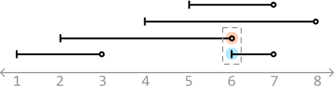

Which point should we process first? Keep in mind the value of `active_intervals` is 3 right before we reach time = 6 in the above example.

At time 6, if we process the start point first and increment `active_intervals`, we would update it to 4 first, which is incorrect as there are never 4 active intervals at this moment. This is an issue because our final answer is the largest value of `active_intervals` encountered, which means we'll incorrectly record 4 as the answer.

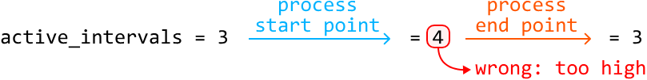

If we process the end point first, we won't encounter this issue:

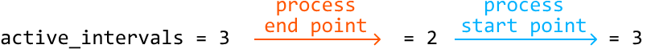

Therefore, for start and end points that occur simultaneously, we should **process end points before start points**.

## Iterating over interval points in order

We need a way to iterate through the start and end points in the order they should be processed. To do this, we can combine all start and end points into a single array and sort it. For start and end points of the same value, we ensure end points are prioritized before start points while the points are being sorted.

Let's use `'S'` and `'E'` to differentiate between start and end points, respectively:

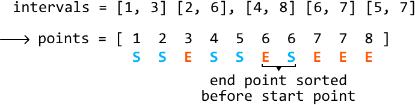

The algorithm we used to solve this problem is known as a **'sweeping line algorithm.'** It works by processing the start and end points of intervals in order, as if a vertical line was sweeping across them. This method efficiently handles the dynamic nature of interval overlaps by specifically focusing on start and end points, rather than individual intervals.

## Try it yourself

Write your solution to the problem before checking the reference implementation.

## Implementation

### Python

```python
from typing import List
from ds import Interval
    
def largest_overlap_of_intervals(intervals: List[Interval]) -> int:
   points = []
   for interval in intervals:
       points.append((interval.start, 'S'))
       points.append((interval.end, 'E'))
   # Sort in chronological order. If multiple points occur at the same time, ensure
   # end points are prioritized before start points in the sorting order.
   points.sort(key=lambda x: (x[0], x[1]))
   active_intervals = 0
   max_overlaps = 0
   for time, point_type in points:
       if point_type == 'S':
           active_intervals += 1
       else:
           active_intervals -= 1
       max_overlaps = max(max_overlaps, active_intervals)
   return max_overlaps
```
### JavaScript
```javascript
import { Interval } from './ds.js'

export function largest_overlap_of_intervals(intervals) {
  const points = []
  for (const interval of intervals) {
    points.push([interval.start, 'S'])
    points.push([interval.end, 'E'])
  }
  // Sort in chronological order. Prioritize 'E' before 'S' if times are equal
  points.sort((a, b) => {
    if (a[0] === b[0]) {
      return a[1] === 'E' ? -1 : 1
    }
    return a[0] - b[0]
  })
  let active_intervals = 0
  let max_overlaps = 0
  for (const [time, pointType] of points) {
    if (pointType === 'S') {
      active_intervals += 1
    } else {
      active_intervals -= 1
    }
    max_overlaps = Math.max(max_overlaps, active_intervals)
  }
  return max_overlaps
}
```
### Java
```java
import java.util.ArrayList;
import java.util.Collections;
import java.util.Comparator;
import core.Interval.Interval;

public class Main {
    public int largest_overlap_of_intervals(ArrayList<Interval> intervals) {
        ArrayList<EventPoint> points = new ArrayList<>();
        for (Interval interval : intervals) {
            points.add(new EventPoint(interval.start, 'S'));
            points.add(new EventPoint(interval.end, 'E'));
        }
        // Sort in chronological order. If multiple points occur at the same time, ensure
        // end points are prioritized before start points in the sorting order.
        Collections.sort(points, new Comparator<EventPoint>() {
            @Override
            public int compare(EventPoint a, EventPoint b) {
                if (a.time != b.time) {
                    return Integer.compare(a.time, b.time);
                }
                return Character.compare(a.type, b.type); // 'E' < 'S' in ASCII
            }
        });
        int active_intervals = 0;
        int max_overlaps = 0;
        for (EventPoint point : points) {
            if (point.type == 'S') {
                active_intervals += 1;
            } else {
                active_intervals -= 1;
            }
            max_overlaps = Math.max(max_overlaps, active_intervals);
        }
        return max_overlaps;
    }

    // Helper class to represent an event point (either start or end of an interval)
    class EventPoint {
        int time;
        char type;

        EventPoint(int time, char type) {
            this.time = time;
            this.type = type;
        }
    }
}
```
## Complexity Analysis

- **Time complexity:** The time complexity of `largest_overlap_of_intervals` is **O(n log(n))**, where **n** denotes the number of intervals. This is because we sort the `points` array of size **2n** before iterating over it in **O(n)** time.

- **Space complexity:** The space complexity is **O(n)** due to the space taken up by the `points` array.