# 10. Prefix Sums

1. [Introduction to Prefix Sums](#introduction-to-prefix-sums)
2. [Sum Between Range](#sum-between-range)
3. [K-Sum Subarrays](#k-sum-subarrays)
4. [Product Array Without Current Element](#product-array-without-current-element)

---

# Introduction to Prefix Sums

## Intuition

Imagine keeping track of how much money you spend on takeout meals each day over a period of days.

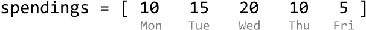

Let's say you want to know the total spent on takeout food up until a particular day. For example, you might like to know that the total you've spent up until Wednesday is $45 ($10 + $15 + $20). This is information which a prefix sum array can store. For an array of integers, a prefix sum array maintains the running sum of values up to each index in the array.

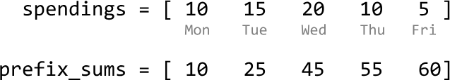

To obtain the prefix sum at each index, we just add the current number from the input array to the prefix sum from the previous index.

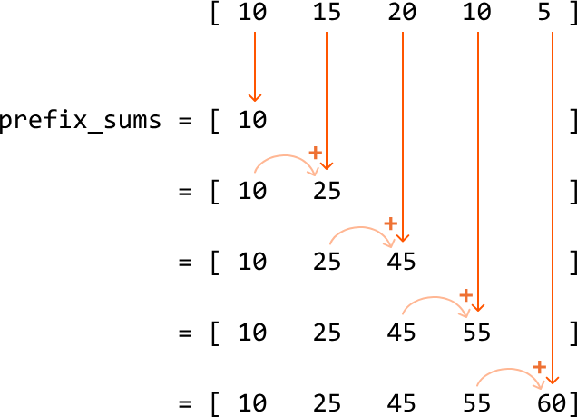

In code, the above process looks like this:

### Python

```python
def compute_prefix_sums(nums):
    # Start by adding the first number to the prefix sums array.
    prefix_sum = [nums[0]]
    # For all remaining indexes, add 'nums[i]' to the cumulative sum from the previous
    # index.
    for i in range(1, len(nums)):
        prefix_sum.append(prefix_sum[-1] + nums[i])
```
### JavaScript
```javascript
function compute_prefix_sums(nums) {
  const prefix_sum = [nums[0]]
  for (let i = 1; i < nums.length; i++) {
    prefix_sum.push(prefix_sum[prefix_sum.length - 1] + nums[i])
  }
  return prefix_sum
}
```
### Java
```java
import java.util.ArrayList;

public class Main {
    public static ArrayList<Integer> compute_prefix_sums(ArrayList<Integer> nums) {
        ArrayList<Integer> prefix_sum = new ArrayList<>();
        // Start by adding the first number to the prefix sums array.
        prefix_sum.add(nums.get(0));
        // For all remaining indexes, add 'nums[i]' to the cumulative sum from the previous
        // index.
        for (int i = 1; i < nums.size(); i++) {
            prefix_sum.add(prefix_sum.get(i - 1) + nums.get(i));
        }
        return prefix_sum;
    }
}
```
As you can see, building a prefix sum array takes $O(n)$ time and $O(n)$ space, where $n$ denotes the length of the array.

## Applications of prefix sums

Aside from allowing us to have constant-time access to running sums at any index within an array, prefix sums are commonly used to efficiently determine the sum of subarrays. This application is examined in depth in the problems in this chapter.

Another interesting variant of prefix sums is prefix products, which populates an array with a running product instead of a running sum. Similar to prefix sums, prefix products provide an efficient way to determine the product of subarrays.

## Real-world Example

**Financial analysis:** As hinted at earlier, a real-world use of prefix sums is for financial analysis, particularly in calculating cumulative earnings or expenses over time.

For instance, consider a company's daily revenue over a month. A prefix sum array can be used to quickly calculate the total revenue for any given period within that month. By precomputing the prefix sums, the company can instantly determine the revenue from day 5 to day 20 without having to sum each day's revenue individually. This is especially useful for generating financial reports, where quick calculations over various periods are necessary to analyze trends.

## Chapter Outline

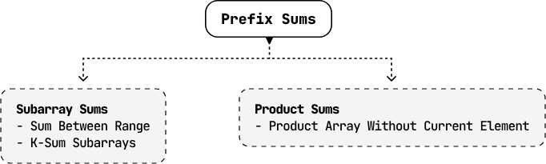


---


# Sum Between Range

Given an integer array, write a function which returns the sum of values between two indexes.

**Example:**

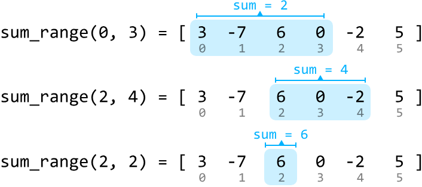

Input: nums = [3, -7, 6, 0, -2, 5],
       [sum_range(0, 3), sum_range(2, 4), sum_range(2, 2)]
Output: [2, 4, 6]

**Constraints:**
- `nums` contains at least one element.
- Each `sum_range` operation will query a valid range of the input array.

## Intuition

We need to code a function `sum_range(i, j)`, where `i` and `j` are the indexes defining the boundaries of the range to be summed up.

A naive solution is to iteratively sum the array values from index `i` to `j`, which takes linear time for each call to `sum_range`. Since we have access to the input array before any calls to `sum_range` are made, we should consider if any preprocessing can be done to improve the efficiency of `sum_range`.

This problem deals with subarray sums, so it might be useful to think about how prefix sums can be applied to solve it. Consider the integer array below and its prefix sums:

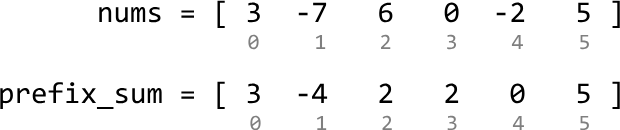

We already notice that the prefix sum array has some use: the prefix sum up to any index `j` essentially gives the answer to `sum_range(0, j)`. For example, the sum of the range [0, 3] is just the prefix sum up to index 3:

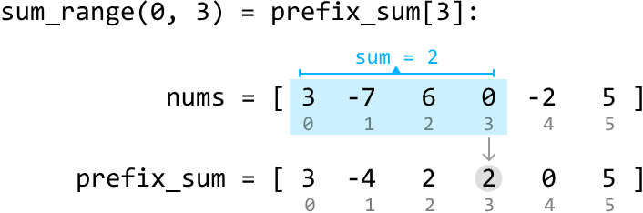

Therefore, when `i == 0`:

```
sum_range(0, j) = prefix_sum[j]
```

What about when the requested range doesn't start at 0? Let's say we want to find the sum in the range [2, 4]:

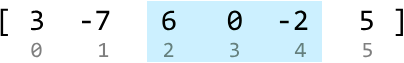

Is there a way to get this using only prefix sums? All prefix sum values are sums for ranges that start at index 0. So, let's see how we could make use of these ranges. Consider the sum of the range [0, 4], which corresponds to `prefix_sum[4]`:

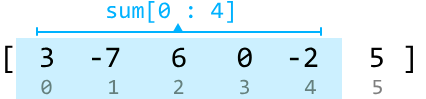

The key observation here is that the sum of the range [2, 4] can be obtained by subtracting the sum of the range [0, 1] from the sum above. This can be visualized:

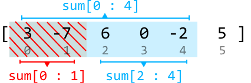

Since the sums of ranges [0, 4] and [0, 1] are both values in our prefix sum array, we can obtain the sum of the range [2, 4] from the following expression: `prefix_sum[4] - prefix_sum[1]`.

Therefore, when `i > 0`:

```
sum_range(i, j) = prefix_sum[j] - prefix_sum[i - 1]
```

## Try it yourself

Write your solution to the problem before checking the reference implementation.

## Implementation

### Python 
```python
from typing import List
    
class SumBetweenRange:
    def __init__(self, nums: List[int]):
        self.prefix_sum = [nums[0]]
        for i in range(1, len(nums)):
            self.prefix_sum.append(self.prefix_sum[-1] + nums[i])
    
    def sum_range(self, i: int, j: int) -> int:
        if i == 0:
            return self.prefix_sum[j]
        return self.prefix_sum[j] - self.prefix_sum[i - 1]
```
### JavaScript
```javascript
export class SumBetweenRange {
  constructor(nums) {
    this.prefixSum = [nums[0]]
    for (let i = 1; i < nums.length; i++) {
      this.prefixSum.push(this.prefixSum[i - 1] + nums[i])
    }
  }

  sumRange(i, j) {
    if (i === 0) {
      return this.prefixSum[j]
    }
    return this.prefixSum[j] - this.prefixSum[i - 1]
  }
}
```
### Java
```java
import java.util.ArrayList;

class SumBetweenRange {
    private ArrayList<Integer> prefixSum;

    public SumBetweenRange(ArrayList<Integer> nums) {
        // Start by adding the first number to the prefix sums array.
        prefixSum = new ArrayList<>();
        prefixSum.add(nums.get(0));
        // For all remaining indexes, add 'nums[i]' to the cumulative sum from the previous index.
        for (int i = 1; i < nums.size(); i++) {
            prefixSum.add(prefixSum.get(i - 1) + nums.get(i));
        }
    }

    public Integer sumRange(Integer i, Integer j) {
        // If i == 0, return the prefix sum directly.
        if (i == 0) {
            return prefixSum.get(j);
        }
        // Otherwise, subtract the prefix sum up to index i - 1.
        return prefixSum.get(j) - prefixSum.get(i - 1);
    }
}
```
## Complexity Analysis

**Time complexity:** The time complexity of the constructor is $O(n)$, where $n$ denotes the length of the array. This is because we populate a `prefix_sum` array of length $n$. The time complexity of `sum_range` is $O(1)$.

**Space complexity:** The space complexity is $O(n)$ due to the space taken up by the `prefix_sum` array.


---


# K-Sum Subarrays

Find the number of subarrays in an integer array that sum to k.

**Example:**

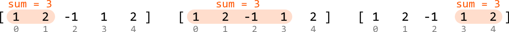

Input: nums = [1, 2, -1, 1, 2], k = 3
Output: 3

## Intuition

The brute force solution to this problem involves iterating through every possible subarray and checking if their sum equals k. It takes $O(n^2)$ time to iterate over all subarrays, and finding the sum of each subarray takes $O(n)$ time, resulting in an overall time complexity of $O(n^3)$, where $n$ denotes the length of the array. This solution is quite inefficient, so let's think of something better.

Since we're working with subarray sums, it's worth considering how prefix sums can be used to solve this problem.

## Prefix sums

As described in the Sum Between Range problem in this chapter, the sum of a subarray between two indexes, i and j, can be calculated with the following formula:

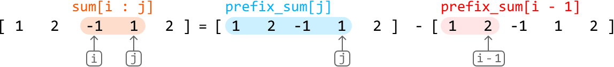

For subarrays which start at the beginning of the array (i.e., when i = 0), the formula is just:

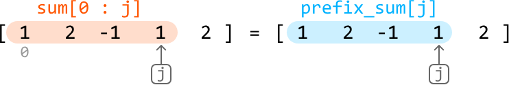

In this problem, we already know the sum we're looking for (k), meaning our goal is to find:

- All pairs of i and j such that `prefix_sum[j] - prefix_sum[i - 1] == k` when `i > 0`.
- All values of j such that `prefix_sum[j] == k` when `i == 0`.

We can unify both cases by recognizing that the formula `prefix_sum[j] == k` is the same as the formula `prefix_sum[j] - prefix_sum[i - 1] == k` when `prefix_sum[i - 1]` equals 0 (i.e., `prefix_sum[j] - 0 == k`).

One issue with this is when `i == 0`, index `i - 1` is invalid. To make this unification possible while avoiding the out-of-bounds issue, we can prepend `[0]` to the prefix sums array, making it possible for `prefix_sum[i - 1]` to equal 0 when `i - 1 == 0`.

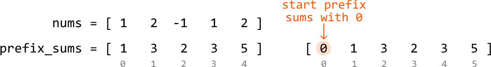

Keep in mind that we should iterate over the array from index 1 because we added this 0 to the start of the prefix sum array.

Here's the code snippet for this approach:

### Python 
```python
from typing import List
    
def k_sum_subarrays(nums: List[int], k: int) -> int:
    n = len(nums)
    count = 0
    # Populate the prefix sum array, setting its first element to 0.
    prefix_sum = [0]
    for i in range(0, n):
        prefix_sum.append(prefix_sum[-1] + nums[i])
    # Loop through all valid pairs of prefix sum values to find all subarrays that sum
    # to 'k'.
    for j in range(1, n + 1):
        for i in range(1, j + 1):
            if prefix_sum[j] - prefix_sum[i - 1] == k:
                count += 1
    return count
```
### JavaScript
```javascript
export function k_sum_subarrays(nums, k) {
  const n = nums.length
  let count = 0
  // Populate the prefix sum array, setting its first element to 0.
  const prefixSum = [0]
  for (let i = 0; i < n; i++) {
    prefixSum.push(prefixSum[prefixSum.length - 1] + nums[i])
  }
  // Loop through all valid pairs of prefix sum values to find all subarrays that sum to 'k'.
  for (let j = 1; j <= n; j++) {
    for (let i = 1; i <= j; i++) {
      if (prefixSum[j] - prefixSum[i - 1] === k) {
        count++
      }
    }
  }
  return count
}
```
### Java
```java
import java.util.ArrayList;

public class Main {
    public int k_sum_subarrays(ArrayList<Integer> nums, int k) {
        int n = nums.size();
        int count = 0;
        // Populate the prefix sum array, setting its first element to 0.
        ArrayList<Integer> prefixSum = new ArrayList<>();
        prefixSum.add(0);
        for (int i = 0; i < n; i++) {
            prefixSum.add(prefixSum.get(prefixSum.size() - 1) + nums.get(i));
        }
        // Loop through all valid pairs of prefix sum values to find all subarrays that sum to 'k'.
        for (int j = 1; j <= n; j++) {
            for (int i = 1; i <= j; i++) {
                if (prefixSum.get(j) - prefixSum.get(i - 1) == k) {
                    count++;
                }
            }
        }
        return count;
    }
}
``` 
This is an improvement on the brute force solution, which reduces the time complexity to $O(n^2)$. Can we optimize this solution further?

## Optimization - hash map

An important point is that we don't need to treat both `prefix_sum[j]` and `prefix_sum[i - 1]` as unknowns in the formula. If we know the value of `prefix_sum[j]`, we can find `prefix_sum[i - 1]` using `prefix_sum[i - 1] = prefix_sum[j] - k`.

Therefore, for each prefix sum (`curr_prefix_sum`), we need to find the number of times `curr_prefix_sum - k` previously appeared as a prefix sum before.

This is similar to the problem presented in Pair Sum - Unsorted in the Hash Maps and Sets chapter, where we learn a hash map is useful for implementing the above idea efficiently. In this context, if we store encountered prefix sum values in a hash map, we can check if `curr_prefix_sum - k` was encountered before in constant time.

Note, it's also important to track the frequency of each prefix sum we encounter using the hash map, as the same prefix sum may appear multiple times.

Let's try using a hash map (`prefix_sum_map`) on the example below with k = 3. Initialize `prefix_sum_map` with one zero for the same reason we prepended 0 to the prefix sum array in the $O(n^2)$ solution discussed earlier:

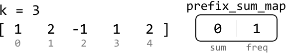

We're using a hash map to keep track of prefix sums, we no longer need a separate array to store each individual prefix sum.

Initially, the prefix sum (`curr_prefix_sum`) is equal to 1. Its complement, -2, is not in the hash map as illustrated below. So, we continue:

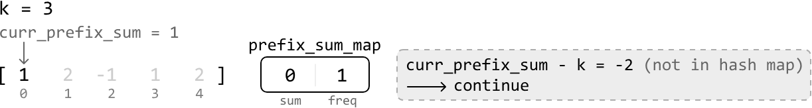

Store the (`curr_prefix_sum`, freq) pair (1, 1) in the hash map before moving to the next prefix sum.

The next `curr_prefix_sum` value is 3 (1 + 2). Its complement, 0, exists in the hash map with a frequency of 1. This means we found 1 subarray of sum k. So, we add 1 to our count:

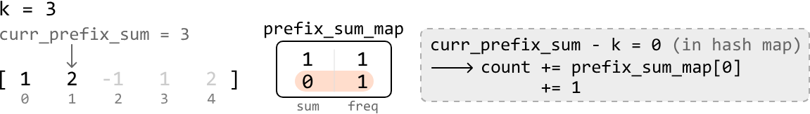

Store the (`curr_prefix_sum`, freq) pair (3, 1) in the hash map before moving on to the next value.

We now have a strategy for processing each value in the array:

1. Update `curr_prefix_sum` by adding the current value of the array to it
2. If `curr_prefix_sum - k` exists in the hash map, add its frequency (`prefix_sum_map[curr_prefix_sum - k]`) to `count`
3. Add (`curr_prefix_sum`, freq) to the hash map. If the key is already present, increase its frequency; if not, set it to 1.

Repeat this process for the rest of the array:

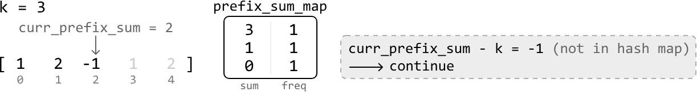

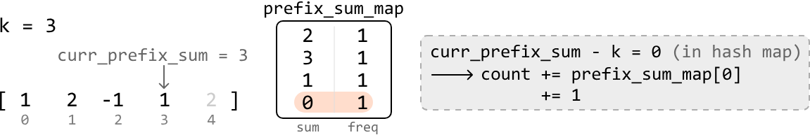

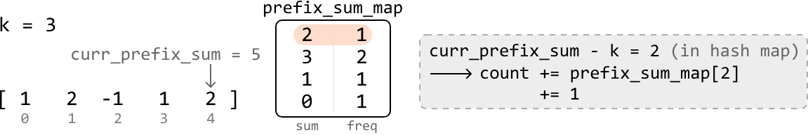

Once we've processed all the prefix sum values, we return `count`, which stores the number of subarrays that sum to k.

## Try it yourself

Write your solution to the problem before checking the reference implementation.

## Implementation

### Python 
```python
from typing import List
    
def k_sum_subarrays_optimized(nums: List[int], k: int) -> int:
    count = 0
    # Initialize the map with 0 to handle subarrays that sum to 'k' from the start of
    # the array.
    prefix_sum_map = {0: 1}
    curr_prefix_sum = 0
    for num in nums:
        # Update the running prefix sum by adding the current number
        curr_prefix_sum += num
        # If a subarray with sum 'k' exists, increment 'count' by the number of times
        # it has been found.
        if curr_prefix_sum - k in prefix_sum_map:
            count += prefix_sum_map[curr_prefix_sum - k]
        # Store the 'curr_prefix_sum' value in the hash map.
        prefix_sum_map[curr_prefix_sum] = prefix_sum_map.get(curr_prefix_sum, 0) + 1
    return count
```
### JavaScript
```javascript
export function k_sum_subarrays_optimized(nums, k) {
  let count = 0
  const prefixSumMap = new Map()
  prefixSumMap.set(0, 1) // To handle subarrays that sum to 'k' from the start
  let currPrefixSum = 0
  for (const num of nums) {
    // Update the running prefix sum by adding the current number
    currPrefixSum += num
    // If a subarray with sum 'k' exists, increment 'count' by the number of times it has been found
    if (prefixSumMap.has(currPrefixSum - k)) {
      count += prefixSumMap.get(currPrefixSum - k)
    }
    // Store the 'currPrefixSum' value in the hash map
    prefixSumMap.set(currPrefixSum, (prefixSumMap.get(currPrefixSum) || 0) + 1)
  }
  return count
}
```
### Java
```java
import java.util.ArrayList;
import java.util.HashMap;
import java.util.Map;

public class Main {
    public int k_sum_subarrays(ArrayList<Integer> nums, int k) {
        int count = 0;
        // Initialize the map with 0 to handle subarrays that sum to 'k' from the start of the array.
        Map<Integer, Integer> prefixSumMap = new HashMap<>();
        prefixSumMap.put(0, 1);
        int currPrefixSum = 0;
        for (int num : nums) {
            // Update the running prefix sum by adding the current number
            currPrefixSum += num;
            // If a subarray with sum 'k' exists, increment 'count' by the number of times it has been found.
            if (prefixSumMap.containsKey(currPrefixSum - k)) {
                count += prefixSumMap.get(currPrefixSum - k);
            }
            // Store the 'currPrefixSum' value in the hash map.
            prefixSumMap.put(currPrefixSum, prefixSumMap.getOrDefault(currPrefixSum, 0) + 1);
        }
        return count;
    }
}
```
## Complexity Analysis

**Time complexity:** The time complexity of `k_sum_subarrays_optimized` is $O(n)$ because we iterate through each value in the `nums` array.

**Space complexity:** The space complexity is $O(n)$ due to the space taken up by the hash map.


---


# Product Array Without Current Element

Given an array of integers, return an array `res` so that `res[i]` is equal to the product of all the elements of the input array except `nums[i]` itself.

**Example:**
Input: nums = [2, 3, 1, 4, 5]
Output: [60, 40, 120, 30, 24]
Explanation: The output value at index 0 is the product of all numbers except nums[0] (3⋅1⋅4⋅5 = 60). The same logic applies to the rest of the output.

## Intuition

The straightforward solution to this problem is to find the total product of the array and divide it by each of the values in `nums` individually to get the output array:

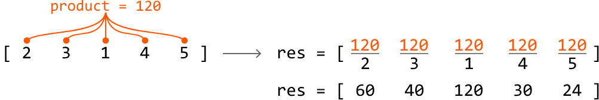

This approach allows us to solve the problem in linear time and constant space. However, a potential follow-up question by an interviewer is: what if we can't use division? Let's explore a solution to this.

### Avoiding division

A brute force approach involves calculating the output value for each index one by one. This would take $O(n)$ time per index, leading to an overall time complexity of $O(n^2)$, where $n$ denotes the length of the array. This is inefficient, so let's look at other approaches.

An important insight is that the output for any given index can be determined by multiplying two things:

- The product of all numbers to the left of the index.
- The product of all numbers to the right of the index.

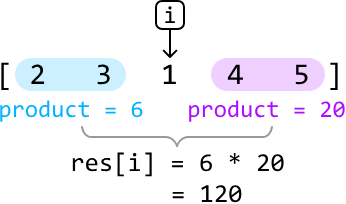

Why is this helpful? If we have precomputed the products of all values to the left and right of each index, we can quickly calculate the output for each index. More specifically, we would need two arrays that contain the left and right products of each index, respectively:

- `left_products`: an array where `left_products[i]` is the product of all values to the left of `i`.
- `right_products`: an array where `right_products[i]` is the product of all values to the right of `i`.

To obtain the `left_products` array, we need to keep track of a cumulative product of all elements we encounter as we move from left to right. The value of this product at a specific index should represent the product of all values to its left. The same is true of the `right_products` array, but the cumulative products start from the right. Once we have these arrays, multiplying the left and right product values at each index gives us the output value of that index.

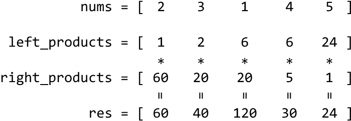

Since the left and right product arrays are formed through cumulative multiplication, this leads us to the concept of prefix products.

## Prefix products

Prefix products are created in the same way as a prefix sum array, with two key differences:

- Instead of cumulative addition, we use cumulative multiplication.
- We initialize the prefix product array with 1 instead of 0, to avoid multiplying the cumulative products by 0.

Let's try creating the `left_products` array, initializing it with 1 at index 0:

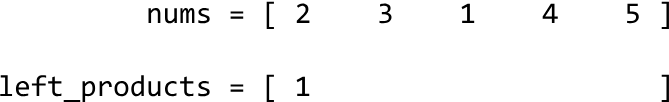

For each subsequent index in the `left_products` array, we calculate its value by multiplying the running product by the previous value in the `nums` array:

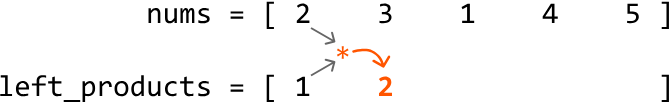

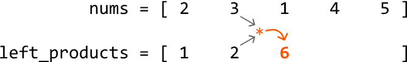

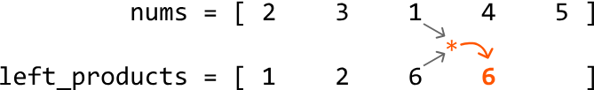

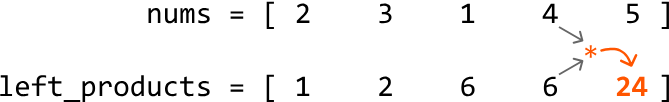

The same can be done for the `right_products` array, but starting on the right and moving leftward:

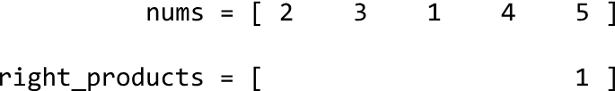

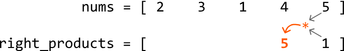

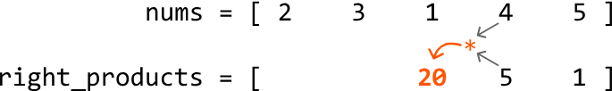

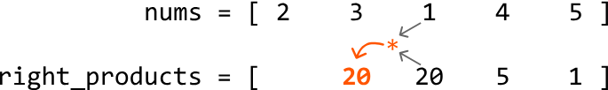

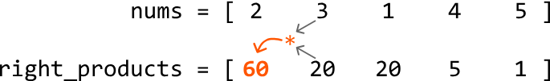

Once both arrays are populated, we can compute each value of the output array, where `res[i]` is equal to the product of `left_products[i]` and `right_products[i]`, as previously demonstrated.

## Reducing space

We have successfully found a solution that doesn't involve division and runs in linear time. However, this solution takes up linear space due to the left and right product arrays. Can we compute the output array in place without taking up extra space?

An important thing to realize is that we don't necessarily need to create the left and right product arrays to populate the output array. Instead, we can directly compute and store the left and right products in the output array as we calculate them.

This can be done in two steps:

1. First, populate the output array (`res`) the same way we populated `left_products`. This prepares the output array to be multiplied by the right products:

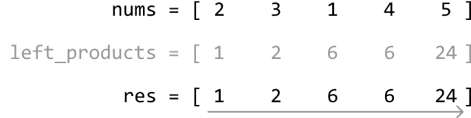

2. Then, instead of populating a `right_products` array, we directly multiply the running product from the right (`right_product`) into the output array:

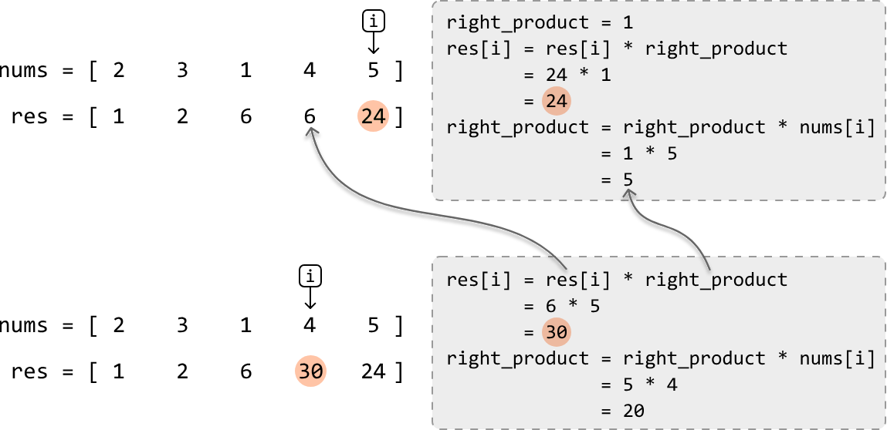

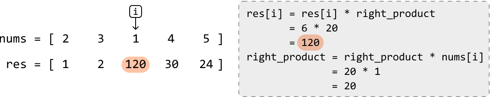

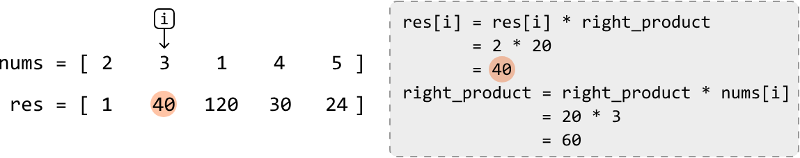

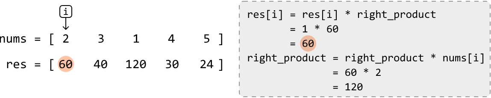

## Try it yourself

Write your solution to the problem before checking the reference implementation.

## Implementation

### Python
```python
from typing import List
    
def product_array_without_current_element(nums: List[int]) -> List[int]:
    n = len(nums)
    res = [1] * n
    # Populate the output with the running left product.
    for i in range(1, n):
        res[i] = res[i - 1] * nums[i - 1]
    # Multiply the output with the running right product, from right to left.
    right_product = 1
    for i in range(n - 1, -1, -1):
        res[i] *= right_product
        right_product *= nums[i]
    return res
```
### JavaScript
```javascript
export function product_array_without_current_element(nums) {
  const n = nums.length
  const res = Array(n).fill(1)
  // Populate the output with the running left product.
  for (let i = 1; i < n; i++) {
    res[i] = res[i - 1] * nums[i - 1]
  }
  // Multiply the output with the running right product, from right to left.
  let rightProduct = 1
  for (let i = n - 1; i >= 0; i--) {
    res[i] *= rightProduct
    rightProduct *= nums[i]
  }
  return res
}
```
### Java
```java
import java.util.ArrayList;

class Main {
    public static ArrayList<Integer> product_array_without_current_element(ArrayList<Integer> nums) {
        int n = nums.size();
        ArrayList<Integer> res = new ArrayList<>();
        // Initialize result array with 1s
        for (int i = 0; i < n; i++) {
            res.add(1);
        }
        // Populate the output with the running left product.
        for (int i = 1; i < n; i++) {
            res.set(i, res.get(i - 1) * nums.get(i - 1));
        }
        // Multiply the output with the running right product, from right to left.
        int rightProduct = 1;
        for (int i = n - 1; i >= 0; i--) {
            res.set(i, res.get(i) * rightProduct);
            rightProduct *= nums.get(i);
        }
        return res;
    }
}
```
## Complexity Analysis

**Time complexity:** The time complexity of `product_array_without_current_element` is $O(n)$ because we iterate over the `nums` array twice.

**Space complexity:** The space complexity is $O(1)$. The `res` array is not included in the space complexity analysis.