# 11. Trees

1. [Introduction to Trees](#introduction-to-trees)
2. [Invert Binary Tree](#invert-binary-tree)
3. [Balanced Binary Tree Validation](#balanced-binary-tree-validation)
4. [Rightmost Nodes of a Binary Tree](#rightmost-nodes-of-a-binary-tree)
5. [Widest Binary Tree Level](#widest-binary-tree-level)
6. [Binary Search Tree Validation](#binary-search-tree-validation)
7. [Lowest Common Ancestor](#lowest-common-ancestor)
8. [Build Binary Tree From Preorder and Inorder Traversals](#build-binary-tree-from-preorder-and-inorder-traversals)
9. [Maximum Sum of a Continuous Path in a Binary Tree](#maximum-sum-of-a-continuous-path-in-a-binary-tree)
10. [Binary Tree Symmetry](#binary-tree-symmetry)
11. [Binary Tree Columns](#binary-tree-columns)
12. [Kth Smallest Number in a Binary Search Tree](#kth-smallest-number-in-a-binary-search-tree)
13. [Serialize and Deserialize a Binary Tree](#serialize-and-deserialize-a-binary-tree)

---

# Introduction to Trees

## Intuition

A tree is a hierarchical data structure composed of nodes, where each node connects to one or more child nodes. Each node in a tree contains the data it stores (`val`) and references to its child nodes. The most common type of tree is a binary tree, in which each node connects to up to two children: a left child and a right child.

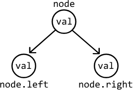

Below is the implementation of the `TreeNode` class:

### Python
```python
class TreeNode:
    def __init__(self, val):
        self.val = val
        self.left = None
        self.right = None
```
### JavaScript
```javascript
class TreeNode {
  constructor(val) {
    this.val = val
    this.left = null
    this.right = null
  }
}
```
### Java
```java
class TreeNode {
    int val;
    TreeNode left;
    TreeNode right;

    public TreeNode(int val) {
        this.val = val;
        this.left = null;
        this.right = null;
    }
}
```
**Terminology:**

- **Parent:** a node with one or more children.
- **Child:** a node that has a parent.
- **Subtree:** a tree formed by a node and its descendants.
- **Path:** a single, continuous sequence of nodes connected by edges.
- **Depth:** the number of edges from the root to a given node.

**Attributes of a tree:**

- **Root:** the topmost node of the tree and the only node without a parent.
- **Intermediate node:** a node with a parent node and at least one child.
- **Leaf:** a node with no children.
- **Edge:** the connection between two nodes. Trees usually have directed edges, meaning the edges only point from parent to child.
- **Height:** the length of the longest path from the root to a leaf.[^1]

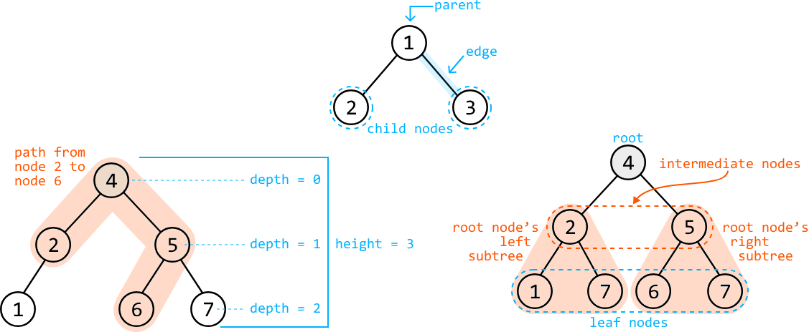

In the following discussions, we primarily focus on binary trees.

## Tree Traversals

### Depth-first search (DFS)

DFS is a method for exploring all nodes of a tree by starting at the root and moving as far down a branch as possible, before backtracking to explore other branches.

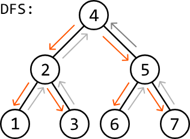

DFS is typically implemented recursively, following a structure similar to the code snippet below:

### Python
```python
def dfs(node: TreeNode):
    if node is None:
        return
    process(node)       # Process the current node.
    dfs(node.left)      # Traverse the left subtree.
    dfs(node.right)     # Traverse the right subtree.
```
### JavaScript
```javascript
function dfs(node) {
  if (node === null) {
    return
  }
  process(node) // Process the current node.
  dfs(node.left) // Traverse the left subtree.
  dfs(node.right) // Traverse the right subtree.
}
```
### Java
```java
public void dfs(TreeNode node) {
    if (node == null) {
        return;
    }
    process(node);       // Process the current node.
    dfs(node.left);      // Traverse the left subtree.
    dfs(node.right);     // Traverse the right subtree.
}
```
The above recursive implementation follows the order of preorder traversal. Two other common DFS traversal techniques include inorder traversal and postorder traversal. Here's how they differ:

| Preorder traversal | Inorder traversal | Postorder traversal |
|--------------------|-------------------|---------------------|
| `process(node)` | `dfs(node.left)` | `dfs(node.left)` |
| `dfs(node.left)` | `process(node)` | `dfs(node.right)` |
| `dfs(node.right)` | `dfs(node.right)` | `process(node)` |

DFS has many use cases and is the most common choice for tree traversal.

- **Preorder traversal** is the most common type of DFS traversal. It's also used when we need to process the root node of each subtree before its children.
- **Inorder traversal** is used when we want to process the nodes of a tree from left to right.
- **Postorder traversal** is the least frequently used traversal method, but is important when each node's subtrees must be processed before their root.

The problems in this chapter explore the use cases of DFS in more detail, providing practical examples of when and how to apply these traversal methods.

### Breadth-first search (BFS)

BFS traverses the nodes of a tree level by level. It processes the nodes at the present level before moving on to nodes at the next depth level.

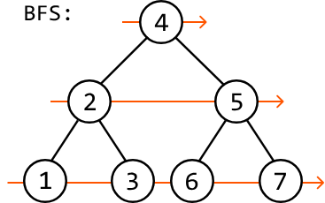

BFS is typically implemented iteratively using a queue, and the reason for this will become clear as we explore the problems in this chapter. The basic structure of BFS is reflected in the following code snippet:

### Python
```python
def bfs(root: TreeNode):
    if root is None:
        return
    queue = deque([root])
    while queue:
        node = queue.popleft()
        process(node)  # Process the current node.
        if node.left:
            queue.append(node.left)  # Add the left child to the queue.
        if node.right:
            queue.append(node.right)  # Add the right child to the queue.
```
### JavaScript
```javascript
function bfs(root) {
  if (root === null) {
    return
  }
  const queue = [root]
  while (queue.length > 0) {
    const node = queue.shift() // Remove the node from the front of the queue
    process(node) // Process the current node
    if (node.left) {
      queue.push(node.left) // Add the left child to the queue
    }
    if (node.right) {
      queue.push(node.right) // Add the right child to the queue
    }
  }
}
```
### Java
```java
public void bfs(TreeNode root) {
    if (root == null) {
        return;
    }
    Queue<TreeNode> queue = new LinkedList<>();
    queue.offer(root);
    while (!queue.isEmpty()) {
        TreeNode node = queue.poll();
        process(node); // Process the current node.
        if (node.left != null) {
            queue.offer(node.left); // Add the left child to the queue.
        }
        if (node.right != null) {
            queue.offer(node.right); // Add the right child to the queue.
        }
    }
}
```
BFS is commonly used to find the shortest path to a specific destination in a tree, or to process the tree level by level. When it's important to know the specific level of each node during traversal, we use a variant of BFS called level-order traversal, which is discussed in detail in this chapter.

### Complexity breakdown

Below, $n$ denotes the number of nodes in the tree, and $h$ denotes the height of the tree.

| Operation | Time | Space | Description |
|-----------|------|-------|-------------|
| DFS | $O(n)$ | $O(h)$ | DFS visits each node, resulting in an $O(n)$ time complexity. The space complexity is determined by the maximum depth of the recursive call stack, which can be as deep as the height of the tree, $h$. In the worst case, the height of the tree is $n$. In a balanced tree whose height is minimized, the height of the tree is approximately $\log(n)$. |
| BFS | $O(n)$ | $O(n)$ | BFS visits each node, resulting in an $O(n)$ time complexity. The space complexity is determined by the maximum number of nodes stored in the queue at any time. In the worst case, the queue can store the entire bottom level of the tree, which could contain around $n/2$ nodes. |

## Real-world Example

**File systems:** In many operating systems, the file system is organized as a hierarchical tree structure. The root directory is the root of the tree, and every file or folder in the system is a node. Folders can have subfolders or files as child nodes, and this structure allows for efficient organization, navigation, and retrieval of files. When you browse through folders on a computer, you're essentially navigating a tree structure.

## Chapter Outline

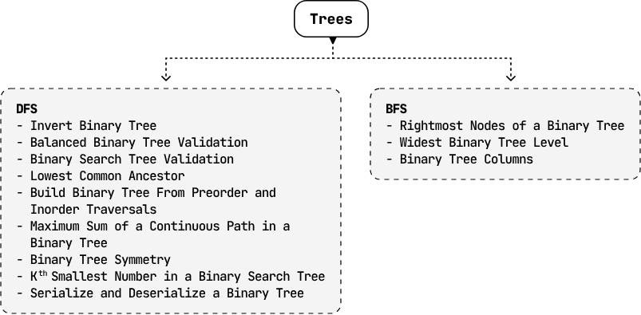

Note that some of the problems listed under DFS can be solved using BFS or other traversal algorithms, too. The same applies to the problems under BFS.

---

## Footnotes

[^1]: Some sources may define the height of a tree differently. In this book, we use a definition that makes designing recursive algorithms more intuitive. Here, the height of a tree with just one node is considered 1.


---


# Invert Binary Tree

Invert a binary tree and return its root. When a binary tree is inverted, it becomes the mirror image of itself.

**Example:**

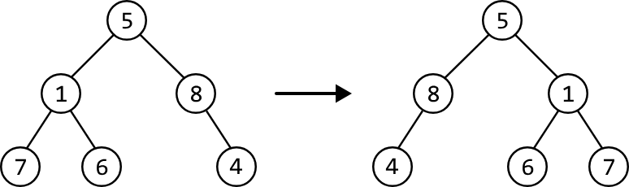

## Intuition - Recursive

To invert a binary tree is to essentially "flip" the tree along a vertical axis, as visualized below:

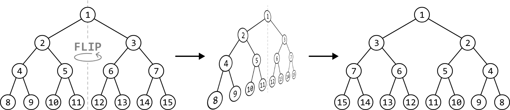

To understand how we invert a binary tree algorithmically, let's focus on how the positions of nodes change after the inversion. For example, pay attention to nodes 8 and 9 in the above tree. After the tree is inverted, we see that they've swapped places relative to their parent node:

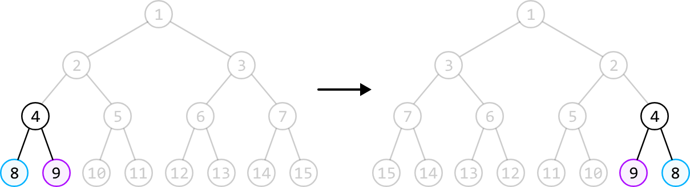

The key observation is that this swap of the left and right child happens to each node in the binary tree during inversion.

It's also important to note that when a left child node moves to the right, all nodes under it move as well, and the same happens when a right child moves to the left. In other words, we swap the left subtree and the right subtree of each node. This indicates we're not just swapping the left and right node values, but the nodes themselves.

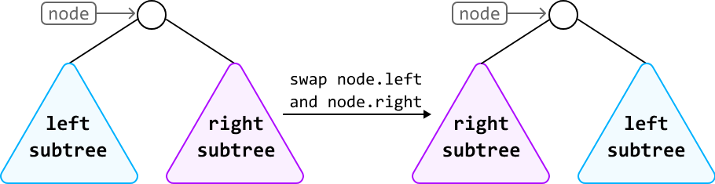

Therefore, to invert a binary tree, we swap the left and right children of every node. Now, let's explore a tree traversal algorithm that allows us to do this.

### Depth-first search

Our strategy is to visit every node in the binary tree and swap its left and right children. There's no particular order in which we need to visit the nodes. This means we can employ any tree traversal algorithm, as long as every node is visited.

Let's tackle this problem recursively using DFS. After swapping the left and right children of the root node, we recursively call our invert function on the left and right children to invert their subtrees as well.

## Try it yourself

Write your solution to the problem before checking the reference implementation.

## Implementation - Recursive

### Python 
```python
from ds import TreeNode
    
def invert_binary_tree_recursive(root: TreeNode) -> TreeNode:
    # Base case: If the node is null, there's nothing to invert.
    if not root:
        return None
    # Swap the left and right subtrees of the current node.
    root.left, root.right = root.right, root.left
    # Recursively invert the left and right subtrees.
    invert_binary_tree_recursive(root.left)
    invert_binary_tree_recursive(root.right)
    return root
```
### JavaScript
```javascript
import { TreeNode } from './ds.js'

export function invert_binary_tree_recursive(root) {
  // Base case: If the node is null, there's nothing to invert.
  if (!root) {
    return null
  }
  // Swap the left and right subtrees of the current node.
  ;[root.left, root.right] = [root.right, root.left]
  // Recursively invert the left and right subtrees.
  invert_binary_tree_recursive(root.left)
  invert_binary_tree_recursive(root.right)
  return root
}
```
### Java
```java
import core.BinaryTree.TreeNode;

public class Main {
    public static TreeNode invert_binary_tree_recursive(TreeNode root) {
        // Base case: If the node is null, there's nothing to invert.
        if (root == null) {
            return null;
        }
        // Swap the left and right subtrees of the current node.
        TreeNode temp = root.left;
        root.left = root.right;
        root.right = temp;
        // Recursively invert the left and right subtrees.
        invert_binary_tree(root.left);
        invert_binary_tree(root.right);
        return root;
    }
}
```
## Complexity Analysis

**Time complexity:** The time complexity of `invert_binary_tree_recursive` is $O(n)$, where $n$ denotes the number of nodes in the tree. This is because the algorithm traverses each node of the binary tree exactly once.

**Space complexity:** The space complexity is $O(n)$ due to the space taken up by the recursive call stack, which can grow as large as the height of the binary tree. The largest possible height of a binary tree is $n$.

## Intuition - Iterative

As a starting point, we can try developing an iterative DFS solution by using the recursive DFS solution as a reference. In the recursive solution, each time a call is made to the left or right child, it's added to a recursive call stack.

Ultimately, the recursive call stack is a stack, which means we can use a stack to mimic the recursive approach. Let's try using a stack on the following tree. Start by adding the root node to the stack:

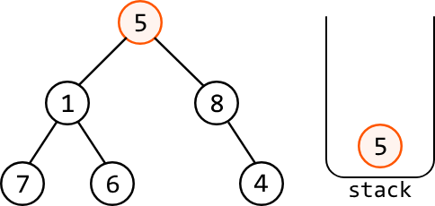

The top of the stack contains the root node, node 5. Let's pop it off so we can swap its left and right subtrees:

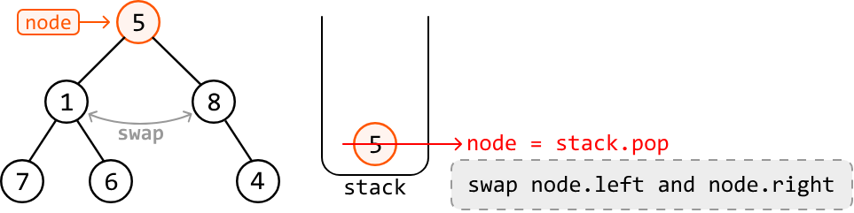

After the swap, let's add node 5's left and right children to the stack so their subtrees can be inverted in future iterations:

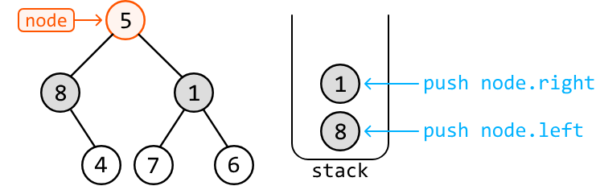

The node at the top of the stack is now node 1, which we should pop off to swap its left and right subtrees and add its children to the stack:

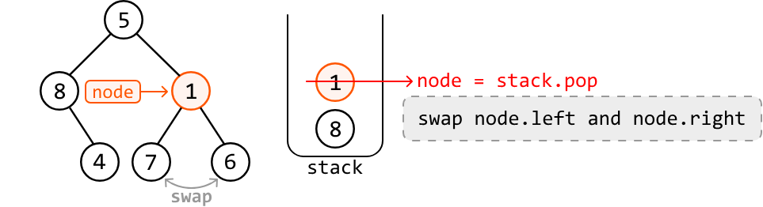

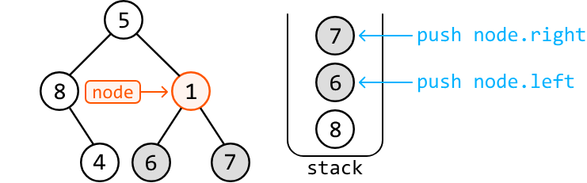

We repeat the above process of iteratively swapping left and right subtrees until the stack is empty, indicating that all nodes have been processed.

### Python 
```python
from ds import TreeNode
    
def invert_binary_tree_iterative(root: TreeNode) -> TreeNode:
    if not root:
        return None
    stack = [root]
    while stack:
        node = stack.pop()
        # Swap the left and right subtrees of the current node.
        node.left, node.right = node.right, node.left
        # Push the left and right subtrees onto the stack.
        if node.left:
            stack.append(node.left)
        if node.right:
            stack.append(node.right)
    return root
```
### JavaScript
```javascript
import { TreeNode } from './ds.js'

export function invert_binary_tree_iterative(root) {
  if (!root) {
    return null
  }
  const stack = [root]
  while (stack.length > 0) {
    const node = stack.pop()
    // Swap the left and right subtrees of the current node.
    ;[node.left, node.right] = [node.right, node.left]
    // Push the left and right subtrees onto the stack.
    if (node.left) {
      stack.push(node.left)
    }
    if (node.right) {
      stack.push(node.right)
    }
  }
  return root
}
```
### Java
```java
import core.BinaryTree.TreeNode;
import java.util.Stack;

public class Main {
    public static TreeNode invert_binary_tree_iterative(TreeNode root) {
        if (root == null) {
            return null;
        }
        Stack<TreeNode> stack = new Stack<>();
        stack.push(root);
        while (!stack.isEmpty()) {
            TreeNode node = stack.pop();
            // Swap the left and right subtrees of the current node.
            TreeNode temp = node.left;
            node.left = node.right;
            node.right = temp;
            // Push the left and right subtrees onto the stack.
            if (node.left != null) {
                stack.push(node.left);
            }
            if (node.right != null) {
                stack.push(node.right);
            }
        }
        return root;
    }
}
```
## Complexity Analysis

**Time complexity:** The time complexity of `invert_binary_tree_iterative` is $O(n)$ because it processes each node in the binary tree exactly once.

**Space complexity:** The space complexity is $O(n)$ due to the space taken up by the stack, which can grow as large as the height of the binary tree. The largest possible height of a binary tree is $n$.

## Interview Tip

> **Tip: Use a stack to convert a recursive solution to an iterative one.**
> A common follow-up an interviewer may ask is to solve a problem iteratively rather than recursively. This approach is particularly useful when the tree's height can be large, and we want to avoid potential stack overflow errors. For example, this could happen in Python, where the maximum recursion depth is set to 1000 by default. It's useful to understand that a stack can often be used to transform recursive solutions into iterative ones.


---


# Balanced Binary Tree Validation

Determine if a binary tree is height-balanced, meaning no node's left subtree and right subtree have a height difference greater than 1.

**Example:**

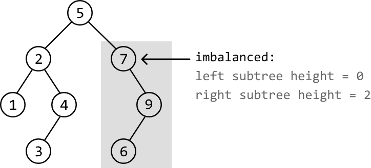

Output: False

## Intuition

For a binary tree to be balanced, all its subtrees would need to be balanced too. This implies that the height difference between the left and right subtrees of each node should be at most 1. A difference greater than 1 indicates a height imbalance.

This suggests we need a way to determine the heights of the left and right subtrees at each node in order to evaluate if the subtree rooting from that node is balanced or not.

A key insight is that the height of a tree is equal to the depth of its deepest subtree, plus 1, to include the tree's root node.

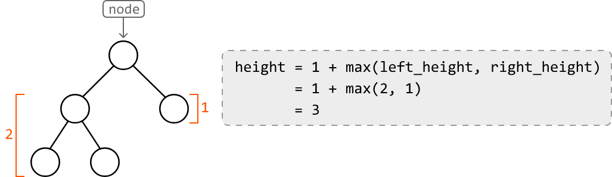

The above formula reveals a recursive relationship, where we can recursively determine the heights of the left and right subtrees to calculate the height of the current subtree. The base case of the recursion would be returning 0 upon encountering a null node, since they have a height of 0.

The diagram below displays the heights returned from the left and right children of each node, and shows how we determine if a subtree is imbalanced. This highlights the recursive process, where values bubble up from the bottom and make their way up to the root node. At each node, we also evaluate whether that node represents a height-balanced subtree. This reveals an imbalance at node 7:

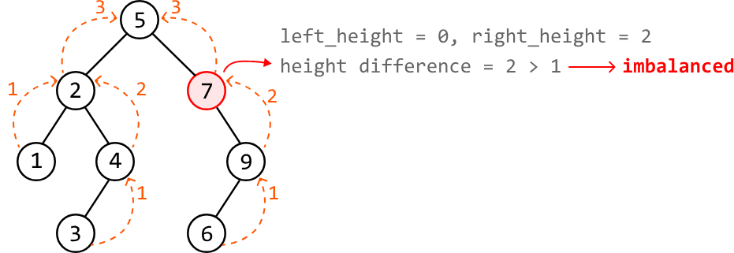

However, there's a flaw in only returning the subtree's height at each node: upon detecting node 7 is imbalanced, all we did about this was return its height to its parent node. This consequently means its parent node (node 5) could be mistakenly considered balanced.

An important thing to remember is that if one subtree is imbalanced, the entire tree is considered imbalanced. This means node 5 should also be marked as imbalanced. We can fix this by returning `-1` upon encountering an imbalanced node, essentially informing parent nodes of this imbalance:

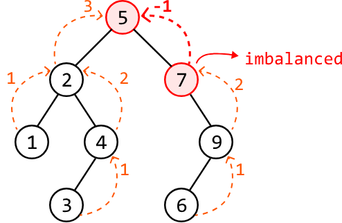

To finalize our answer, we return false if the root node of the binary tree returns `-1`, and true otherwise.

## Try it yourself

Write your solution to the problem before checking the reference implementation.

## Implementation

### Python 
```python
from ds import TreeNode
    
def balanced_binary_tree_validation(root: TreeNode) -> bool:
    return get_height_imbalance(root) != -1
    
def get_height_imbalance(node: TreeNode) -> int:
    # Base case: if the node is null, its height is 0.
    if not node:
        return 0
    # Recursively get the height of the left and right subtrees. If either subtree
    # is imbalanced, propagate -1 up the tree.
    left_height = get_height_imbalance(node.left)
    right_height = get_height_imbalance(node.right)
    if left_height == -1 or right_height == -1:
        return -1
    # If the current node's subtree is imbalanced (height difference > 1), return -1.
    if abs(left_height - right_height) > 1:
        return -1
    # Return the height of the current subtree.
    return 1 + max(left_height, right_height)
```
### JavaScript
```javascript
import { TreeNode } from './ds.js'

export function balanced_binary_tree_validation(root) {
  return getHeightImbalance(root) !== -1
}

function getHeightImbalance(node) {
  // Base case: if the node is null, its height is 0.
  if (!node) {
    return 0
  }
  // Recursively get the height of the left and right subtrees. If either subtree
  // is imbalanced, propagate -1 up the tree.
  const left_height = getHeightImbalance(node.left)
  const right_height = getHeightImbalance(node.right)
  // If either subtree is imbalanced, propagate -1 up the tree.
  if (left_height === -1 || right_height === -1) {
    return -1
  }
  // If the current node's subtree is imbalanced (height difference > 1), return -1.
  if (Math.abs(left_height - right_height) > 1) {
    return -1
  }
  // Return the height of the current subtree.
  return 1 + Math.max(left_height, right_height)
}
```
### Java
```java
import core.BinaryTree.TreeNode;

class Main {
    public static Boolean balanced_binary_tree_validation(TreeNode<Integer> root) {
        return get_height_imbalance(root) != -1;
    }

    public static int get_height_imbalance(TreeNode<Integer> node) {
        // Base case: if the node is null, its height is 0.
        if (node == null) {
            return 0;
        }
        // Recursively get the height of the left and right subtrees. If either subtree
        // is imbalanced, propagate -1 up the tree.
        int leftHeight = get_height_imbalance(node.left);
        int rightHeight = get_height_imbalance(node.right);
        if (leftHeight == -1 || rightHeight == -1) {
            return -1;
        }
        // If the current node's subtree is imbalanced (height difference > 1), return -1.
        if (Math.abs(leftHeight - rightHeight) > 1) {
            return -1;
        }
        // Return the height of the current subtree.
        return 1 + Math.max(leftHeight, rightHeight);
    }
}
```
## Complexity Analysis

**Time complexity:** The time complexity of `balanced_binary_tree_validation` is $O(n)$, where $n$ denotes the number of nodes in the tree. This is because it recursively traverses each node of the tree once.

**Space complexity:** The space complexity is $O(n)$ due to the space taken up by the recursive call stack, which can grow as large as the height of the binary tree. The largest possible height of a binary tree is $n$.


---


# Rightmost Nodes of a Binary Tree

Return an array containing the values of the rightmost nodes at each level of a binary tree.

**Example:**

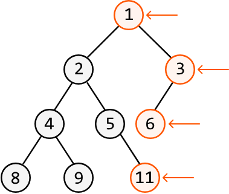

Output: [1, 3, 6, 11]

## Intuition

At first glance, the solution to this problem might seem as simple as traversing the rightmost branch of the tree until we reach a leaf node. But this doesn't work. Why not? Consider the tree below. We see that traversing just the rightmost branch results in missing the rightmost node at the fourth level of the tree:

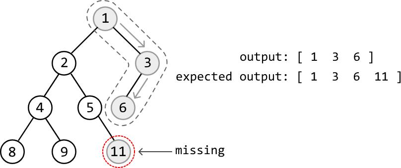

This means we need to consider the entire tree to attain the correct output, and not just a single branch. What would be useful is a way to traverse the tree level by level, allowing us to identify and retrieve the last (i.e., rightmost) node at each level.

We know BFS traverses nodes level by level. However, standard BFS doesn't provide explicit markers for when one level ends and another begins. In contrast, there is a type of BFS traversal that allows us to process one level at a time. This algorithm is called level-order traversal.

## Level-order traversal

The core idea of level-order traversal is that at any level of the tree, the children of the nodes at that level comprise the next level. This means the children of level 1's nodes make up level 2, and likewise, the children of level 2's nodes make up level 3, and so on. To see how this works, consider the binary tree below, with the BFS queue initialized with the tree's root node:

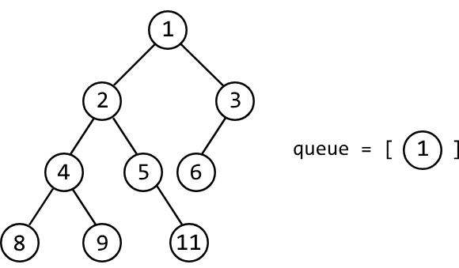

We know level 1 consists of only the root node. So, the children of the root make up the nodes of the second level. Let's pop the root node off and then add its children to the queue:

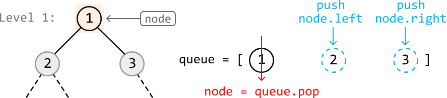

Since we've removed the only level 1 node from the queue and added its children, the queue now only contains the nodes of level 2. Therefore, the size of the queue currently corresponds to the number of nodes in level 2.

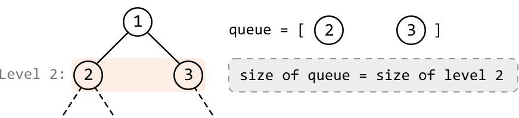

The current queue size is 2, indicating the second level has 2 nodes. So, let's pop off the next 2 nodes in the queue and add their children to the queue:

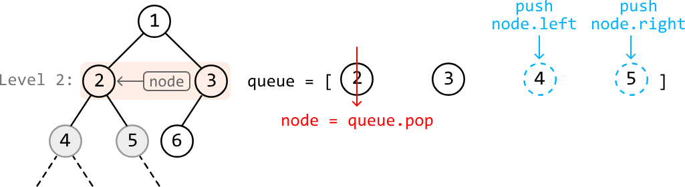

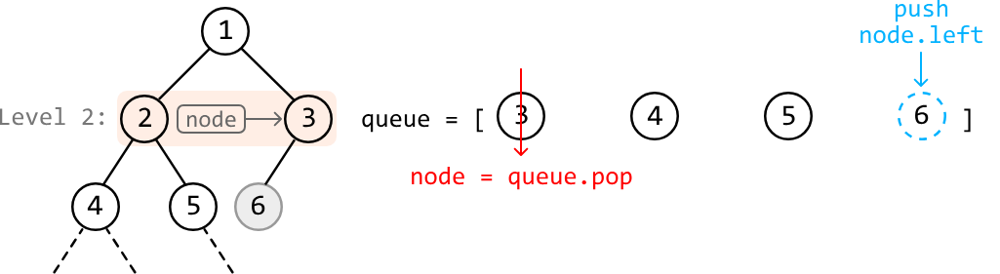

After the two nodes on the second level have been popped off the queue, the remaining nodes in the queue represent the third level.

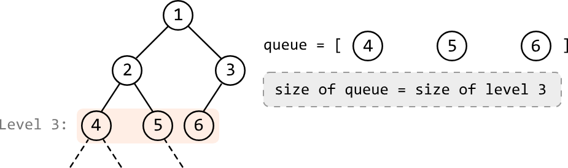

The size of the queue is 3, meaning that to process the third level, we must process the next 3 nodes.

To summarize this process, we start by placing the root node in the queue, where the root node represents the first level. Then, begin BFS by entering a while-loop that continues until the queue is empty, meaning all nodes in the tree have been visited. For level-order traversal:

1. **Determine the level size:** Collect the current size of the queue (`level_size`) to find the number of nodes in the current level. Initially, the queue will only contain the root node, indicating the first level is of size 1.

2. **Process the current level:** For each node at this level, pop it from the queue and add its children to the queue.

After processing all nodes of the current level, the queue contains all the nodes of the next level. Repeat steps 1 and 2 to process the next level. When the queue is empty, all levels have been processed.

Once we know how to traverse the tree level by level, the rightmost node at each level is obtained by collecting that level's last node:

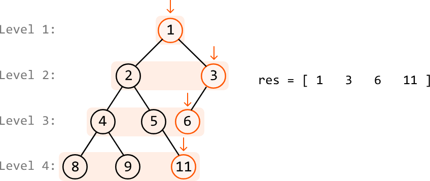

## Try it yourself

Write your solution to the problem before checking the reference implementation.

## Implementation

### Python 
```python
from ds import TreeNode
    
def rightmost_nodes_of_a_binary_tree(root: TreeNode) -> List[int]:
    if not root:
        return []
    res = []
    queue = deque([root])
    while queue:
        level_size = len(queue)
        # Add all the non-null child nodes of the current level to the queue.
        for i in range(level_size):
            node = queue.popleft()
            if node.left:
                queue.append(node.left)
            if node.right:
                queue.append(node.right)
            # Record this level's last node to the result array.
            if i == level_size - 1:
                res.append(node.val)
    return res
```
### JavaScript
```javascript
import { TreeNode } from './ds.js'

export function rightmost_nodes_of_a_binary_tree(root) {
  if (!root) {
    return []
  }
  const res = []
  const queue = [root]
  while (queue.length > 0) {
    const levelSize = queue.length
    // Add all the non-null child nodes of the current level to the queue.
    for (let i = 0; i < levelSize; i++) {
      const node = queue.shift()
      if (node.left) {
        queue.push(node.left)
      }
      if (node.right) {
        queue.push(node.right)
      }
      // Record this level's last node to the result array.
      if (i === levelSize - 1) {
        res.push(node.val)
      }
    }
  }
  return res
}
```
### Java
```java
import java.util.ArrayList;
import java.util.LinkedList;
import java.util.Queue;
import core.BinaryTree.TreeNode;

class Main {
    public static ArrayList<Integer> rightmost_nodes_of_a_binary_tree(TreeNode<Integer> root) {
        // If the tree is empty, return an empty list.
        if (root == null) {
            return new ArrayList<>();
        }
        ArrayList<Integer> res = new ArrayList<>();
        Queue<TreeNode<Integer>> queue = new LinkedList<>();
        queue.offer(root);
        while (!queue.isEmpty()) {
            int levelSize = queue.size();
            // Add all the non-null child nodes of the current level to the queue.
            for (int i = 0; i < levelSize; i++) {
                TreeNode<Integer> node = queue.poll();
                if (node.left != null) {
                    queue.offer(node.left);
                }
                if (node.right != null) {
                    queue.offer(node.right);
                }
                // Record this level's last node to the result array.
                if (i == levelSize - 1) {
                    res.add(node.val);
                }
            }
        }
        return res;
    }
}
```
## Complexity Analysis

**Time complexity:** The time complexity of `rightmost_nodes_of_a_binary_tree` is $O(n)$, where $n$ denotes the number of nodes in the tree. This is because we process each node of the tree once during the level-order traversal.

**Space complexity:** The space complexity is $O(n)$ due to the space taken up by the queue. The queue's size will grow as large as the level with the most nodes. In the worst case, this occurs at the final level when all the last-level nodes are non-null, totaling approximately $n/2$ nodes. Note that the `res` array does not contribute to the space complexity.


---


# Widest Binary Tree Level

Return the width of the widest level in a binary tree, where the width of a level is defined as the distance between its leftmost and rightmost non-null nodes.

**Example:**

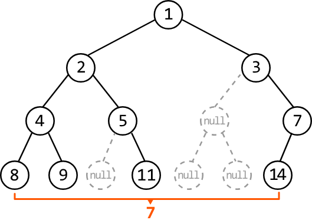
**Output:** 7

## Intuition

Let's first understand how width is defined in a binary tree. An important distinction to make is that the width of a level is not necessarily equivalent to the number of nodes in that level.

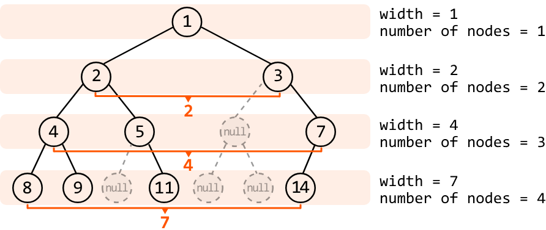

As we can see, the null nodes between the leftmost and rightmost nodes are considered in the width, as well.

Think about a data structure in which determining the width or distance between two elements is simple, such as an array, where the distance of two elements can be obtained by the difference between their indexes. If our binary tree also has indexes, it would similarly be possible to obtain the width between two nodes at a level. Let's explore a method to assign an index to each node.

## Indexing a binary tree

Below, we see how indexes can be assigned at each node, starting with index 0 for the root node:

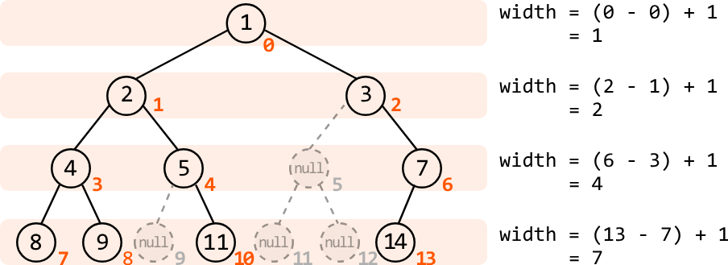

These indexes enable us to calculate the width of a level using `rightmost_index - leftmost_index + 1`, as shown in the diagram above. Note, the indexes at the null nodes are added only for visualization.

But how can we set up something like this? The key observation is that each node's index can be determined from its parent's index. We can derive the following relationship for any node at index `i`:

- Its left child will be at index `2*i + 1`.
- Its right child will be at index `2*i + 2`.

Now, we just need a way to traverse each level of the tree to determine the width at individual levels, allowing us to obtain the width of the widest level in the tree. We can use level-order traversal for this.

## Level-order traversal

If you're unfamiliar with the level-order traversal algorithm, study the Rightmost Nodes of a Binary Tree problem before continuing.

Remember, level-order traversal utilizes a queue to process the binary tree nodes. In this problem, whenever we push a node into this queue, we also push its respective index along with it, to know which index it's associated with.

The width of a level can be calculated using `rightmost_index - leftmost_index + 1`. To perform this calculation, we need the index of the first (leftmost) and last (rightmost) nodes of that level. Here's how we obtain these indexes:

1. Set `leftmost_index` to the index at the first node of the level.

2. Start `rightmost_index` at the same point as `leftmost_index` and update it as we traverse the level. This way, it will eventually be set to the last index after traversing the level.

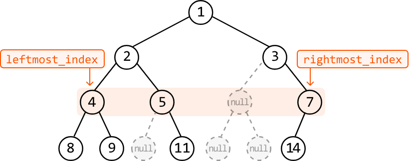

As we calculate the width at each level, we keep track of the largest width using `max_width`, representing the width of the widest level in the binary tree.

## Try it yourself

Write your solution to the problem before checking the reference implementation.

## Implementation

### Python
```python
from ds import TreeNode
    
def widest_binary_tree_level(root: TreeNode) -> int:
    if not root:
        return 0
    max_width = 0
    queue = deque([(root, 0)])  # Stores (node, index) pairs.
    while queue:
        level_size = len(queue)
        # Set the 'leftmost_index' to the index of the first node in this level. Start
        # 'rightmost_index' at the same point as 'leftmost_index' and update it as we
        # traverse the level, eventually positioning it at the last node.
        leftmost_index = queue[0][1]
        rightmost_index = leftmost_index
        # Process all nodes at the current level.
        for _ in range(level_size):
            node, i = queue.popleft()
            if node.left:
                queue.append((node.left, 2*i + 1))
            if node.right:
                queue.append((node.right, 2*i + 2))
            rightmost_index = i
        max_width = max(max_width, rightmost_index - leftmost_index + 1)
    return max_width
```
### JavaScript
```javascript
import { TreeNode } from './ds.js'

export function widest_binary_tree_level(root) {
  if (!root) {
    return 0
  }
  let maxWidth = 0
  const queue = [[root, 0]] // Stores [node, index] pairs
  while (queue.length > 0) {
    const levelSize = queue.length
    // Set the 'leftmost_index' to the index of the first node in this level. Start
    // 'rightmost_index' at the same point as 'leftmost_index' and update it as we
    // traverse the level, eventually positioning it at the last node.
    let leftmostIndex = queue[0][1]
    let rightmostIndex = leftmostIndex
    // Process all nodes at the current level.
    for (let i = 0; i < levelSize; i++) {
      const [node, index] = queue.shift()
      if (node.left) {
        queue.push([node.left, 2 * index + 1])
      }
      if (node.right) {
        queue.push([node.right, 2 * index + 2])
      }
      rightmostIndex = index
    }
    maxWidth = Math.max(maxWidth, rightmostIndex - leftmostIndex + 1)
  }
  return maxWidth
}
```
### Java
```java
import java.util.LinkedList;
import java.util.Queue;
import core.BinaryTree.TreeNode;

class Pair<K, V> {
    public K key;
    public V val;

    public Pair(K key, V val) {
        this.key = key;
        this.val = val;
    }
}

class Main {
    public int widest_binary_tree_level(TreeNode<Integer> root) {
        // If the tree is empty, return width 0.
        if (root == null) {
            return 0;
        }
        int maxWidth = 0;
        // Queue stores (node, index) pairs.
        Queue<Pair<TreeNode<Integer>, Integer>> queue = new LinkedList<>();
        queue.offer(new Pair<>(root, 0));
        while (!queue.isEmpty()) {
            int levelSize = queue.size();
            // Set the 'leftmostIndex' to the index of the first node in this level.
            int leftmostIndex = queue.peek().val;
            int rightmostIndex = leftmostIndex;
            // Process all nodes at the current level.
            for (int i = 0; i < levelSize; i++) {
                Pair<TreeNode<Integer>, Integer> pair = queue.poll();
                TreeNode<Integer> node = pair.key;
                int index = pair.val;

                if (node.left != null) {
                    queue.offer(new Pair<>(node.left, 2 * index + 1));
                }
                if (node.right != null) {
                    queue.offer(new Pair<>(node.right, 2 * index + 2));
                }
                rightmostIndex = index;
            }
            maxWidth = Math.max(maxWidth, rightmostIndex - leftmostIndex + 1);
        }
        return maxWidth;
    }
}
```
## Complexity Analysis

**Time complexity:** The time complexity of `widest_binary_tree_level` is O(n), where n denotes the number of nodes in the tree. This is because we process each node once during level-order traversal.

**Space complexity:** The space complexity is O(n) due to the space taken up by the queue. The queue's size will grow as large as the level with the most nodes. In the worst case, this occurs at the last level when all the last-level nodes are non-null, totaling approximately n/2 nodes.


---


# Binary Search Tree Validation

Verify whether a binary tree is a valid binary search tree (BST). A BST is a binary tree where each node meets the following criteria:

- A node's left subtree contains only nodes of lower values than the node's value.

- A node's right subtree contains only nodes of greater values than the node's value.

**Example:**

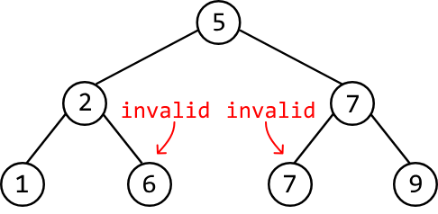

**Output:** False

**Explanation:** This tree has two violations of the BST criteria:

- Node 5's left subtree contains node 6, and node 6's value is greater than 5.
- Node 7 has a left child with the same value of 7.

## Intuition

A BST maintains a logically sorted order of values by complying with the criteria specified in the problem description. That is, the left subtree of a node with value x must consist of values less than x, and its right subtree must consist of values strictly greater than x.

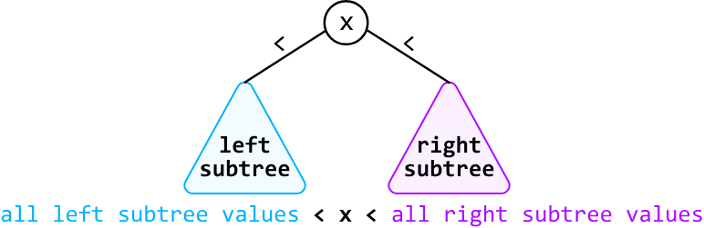

In addition, all nodes in the left and right subtrees of the above diagram must follow these criteria, too.

Since evaluating subtrees is important in determining if a tree is a BST, let's try a recursive DFS approach to solve this problem.

Consider this example:

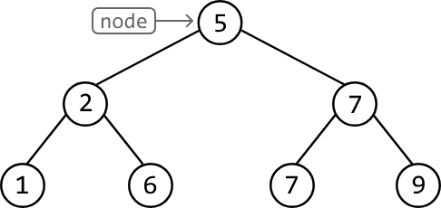

There's nothing to assess at the root node because it can contain any value. So, let's have a look at its children. Here's how we assess these nodes based on the BST rules:

- All nodes to the left of node 5 should be less than 5. So, when we make a recursive call to its left child, we pass in an upper bound of 5.

- All nodes to the right of node 5 should be greater than 5. So, when we make a recursive call to its right child, we pass in a lower bound of 5.

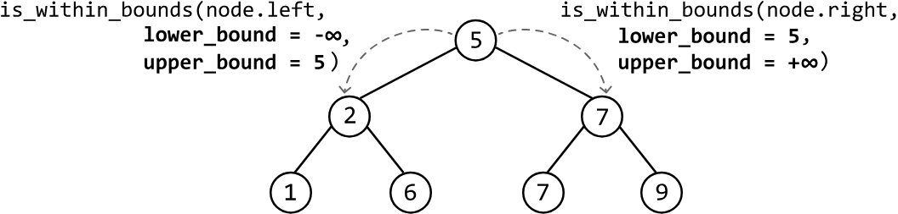

Let's now consider node 2. It satisfies its specified lower and upper bounds of - and 5, respectively. So, let's verify its subtrees. Applying the same logic as before, node 2's left child should have an upper bound of 2, while its right child should have a lower bound of 2.

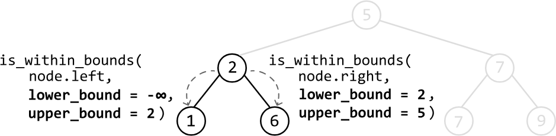

Above, we see that node 6 violates its expected upper bound of 5 (since 6 > 5). This violation indicates we're dealing with an invalid binary tree. Note, node 6 has an upper bound of 5 because it's a left descendant of node 5.

We now have a strategy for our DFS function, `is_within_bounds(node, lower_bound, upper_bound)`:

1. Check if the `node.val` falls between `lower_bound` and `upper_bound`. If it does, continue to the next step. If not, the tree is an invalid BST: return false.

2. Call `is_within_bounds` on the left child with an updated upper bound set to the current node's value: `is_within_bounds(node.left, lower_bound, node.val)`.

3. Call `is_within_bounds` on the right child with an updated lower bound set to the current node's value: `is_within_bounds(node.right, node.val, upper_bound)`.

4. If both recursive calls return true, then the current node's subtree is a valid BST: return true.

A minor optimization to make here is to check if the value we get from the recursive call at step 2 is false. If it's false, we don't have to perform step 3 and can just return false straight away, as we already know this tree isn't a BST.

## Try it yourself

Write your solution to the problem before checking the reference implementation.

## Implementation

### Python 
```python
from ds import TreeNode
    
def binary_search_tree_validation(root: TreeNode) -> bool:
    # Start validation at the root node. The root node can contain any value, so set
    # the initial lower and upper bounds to -infinity and +infinity, respectively.
    return is_within_bounds(root, float('-inf'), float('inf'))
    
def is_within_bounds(node: TreeNode, lower_bound: int, upper_bound: int) -> bool:
    # Base case: if the node is null, it satisfies the BST condition.
    if not node:
        return True
    # If the current node's value is not within the valid bounds, this tree is not a
    # valid BST.
    if not lower_bound < node.val < upper_bound:
        return False
    # If the left subtree isn't a BST, this tree isn't a BST.
    if not is_within_bounds(node.left, lower_bound, node.val):
        return False
    # Otherwise, return true if the right subtree is also a BST.
    return is_within_bounds(node.right, node.val, upper_bound)
```
### JavaScript
```javascript
import { TreeNode } from './ds.js'

export function binary_search_tree_validation(root) {
  // Start validation at the root node. The root node can contain any value, so set
  // the initial lower and upper bounds to -infinity and +infinity, respectively.
  return isWithinBounds(root, -Infinity, Infinity)
}

function isWithinBounds(node, lowerBound, upperBound) {
  // Base case: if the node is null, it satisfies the BST condition.
  if (!node) {
    return true
  }
  // If the current node's value is not within the valid bounds, this tree is not a
  // valid BST.
  if (node.val <= lowerBound || node.val >= upperBound) {
    return false
  }
  // If the left subtree isn't a BST, this tree isn't a BST.
  if (!isWithinBounds(node.left, lowerBound, node.val)) {
    return false
  }
  // Otherwise, return true if the right subtree is also a BST.
  return isWithinBounds(node.right, node.val, upperBound)
}
```
### Java
```java
import core.BinaryTree.TreeNode;

class Main {
    public static boolean binary_search_tree_validation(TreeNode<Integer> root) {
        // Start validation at the root node. The root node can contain any value, so set
        // the initial lower and upper bounds to -infinity and +infinity, respectively.
        return is_within_bounds(root, Long.MIN_VALUE, Long.MAX_VALUE);
    }

    public static boolean is_within_bounds(TreeNode<Integer> node, long lower_bound, long upper_bound) {
        // Base case: if the node is null, it satisfies the BST condition.
        if (node == null) {
            return true;
        }
        // If the current node's value is not within the valid bounds, this tree is not a
        // valid BST.
        if (!(lower_bound < node.val && node.val < upper_bound)) {
            return false;
        }
        // If the left subtree isn't a BST, this tree isn't a BST.
        if (!is_within_bounds(node.left, lower_bound, node.val)) {
            return false;
        }
        // Otherwise, return true if the right subtree is also a BST.
        return is_within_bounds(node.right, node.val, upper_bound);
    }
}
```
## Complexity Analysis

**Time complexity:** The time complexity of `binary_search_tree_validation` is O(n), where n denotes the number of nodes in the tree. This is because we process each node recursively at most once.

**Space complexity:** The space complexity is O(n) due to the space taken up by the recursive call stack, which can grow as large as the height of the binary tree. The largest possible height of a binary tree is n.

## Detailed Recursive Demonstration

You may be curious why recursion works for problems like this. When we make a recursive DFS call in the middle of the code, how is the program able to return to this code and continue running the rest of it, after this recursive call finishes? This problem provides an excellent opportunity to demonstrate how this is possible.

The answer is that recursion makes use of a recursive call stack to manage each instance of a recursive function call. To illustrate this, we'll revisit the binary tree example discussed earlier, stepping through the recursive calls for the first few nodes. We'll also display the recursive call stack to help track the state of each call more clearly.

The first DFS call is made to the root node, which is given a lower and upper bound of -∞ and +∞, respectively:

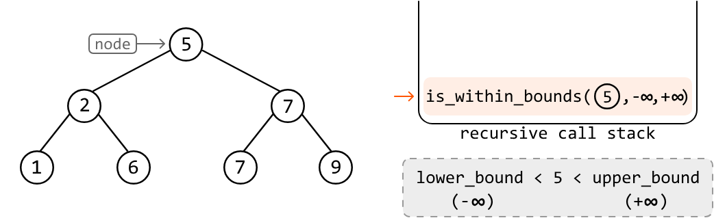

We see that node 5 satisfies its specified lower and upper bounds.

At each node, after we confirm that its value falls within its expected lower and upper bounds, we make a recursive call to its left child before any right children are processed:

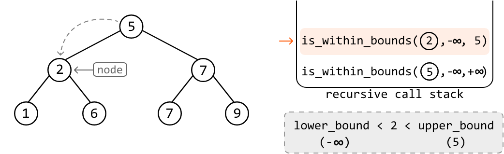

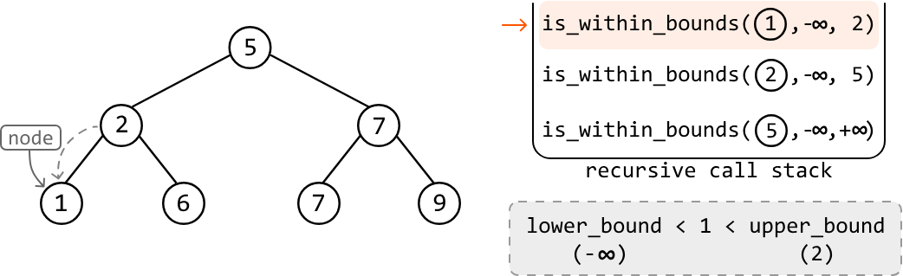

After processing node 1, which has no children, recursion naturally progresses back to the recursive call to node 2, which is now at the top of the stack:

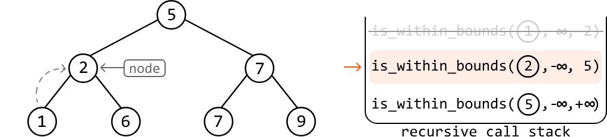

Continuing from where we left off at this instance, it now processes its right child by making a recursive call to it:

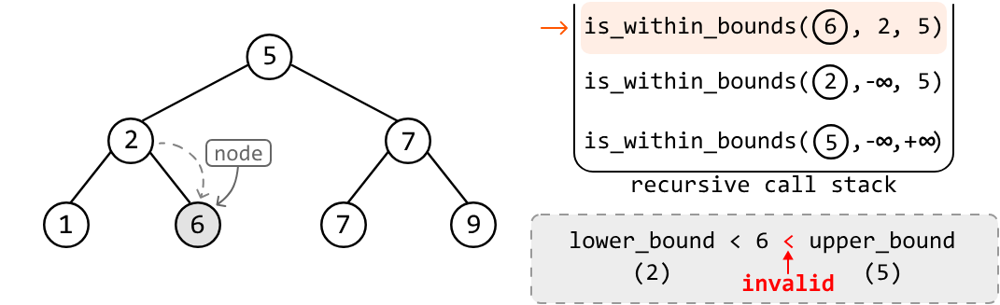

Once we reach node 6, the algorithm notices that its value violates its expected upper bound. As such, it returns false.

In this DFS solution, the recursion starts at the root node, but values start being returned from the leaf nodes and bubble upwards to their parent nodes. Below is a diagram showing how the boolean result at each node moves up from the leaf nodes to the root:

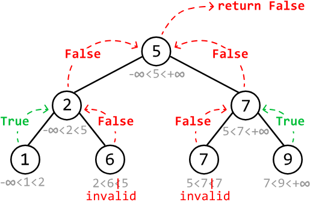

Note that nodes 5, 2, and 7 return false because, while their values fall within their bounds, at least one node in their subtrees does not.


---


# Lowest Common Ancestor

Return the lowest common ancestor (LCA) of two nodes, p and q, in a binary tree. The LCA is defined as the lowest node that has both p and q as descendants. A node can be considered an ancestor of itself.

**Example:**

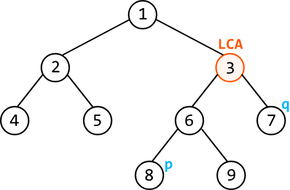

**Constraints:**

- The tree contains at least two nodes.
- All node values are unique.
- p and q represent different nodes in the tree.

## Intuition

One strategy to solve this problem is to traverse each node in the tree and evaluate whether the current node at any point is the LCA of p and q. To make this evaluation, it's crucial to know the conditions a node needs to meet to be the LCA.

Let's start by discussing where p or q would need to be for the current node to be at least an ancestor of both.

## Identifying when the current node is an ancestor of p and q

Consider the following binary tree. Let's explore where p and q would need to be for node 3 to be an ancestor.

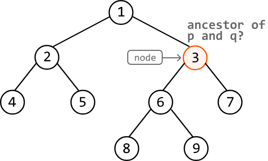

Node 3 is only an ancestor of p and q when both nodes are in node 3's subtree. If they were anywhere else, they would not be descendants of node 3.

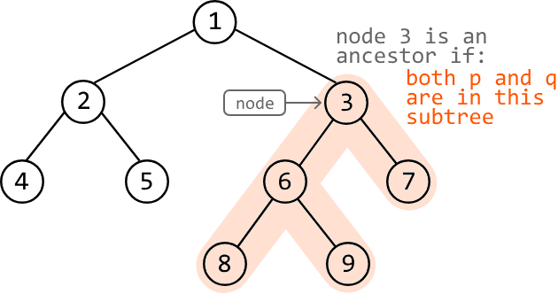

Now, let's examine the conditions in which a node is the lowest common ancestor of p and q.

## Identifying when the current node is the LCA of p and q

Let's identify where in the subtree p and q should be to qualify node 3 as the lowest ancestor of them both.

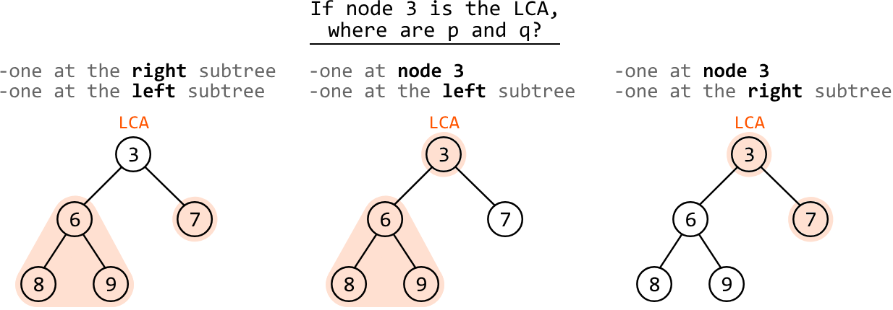

As we can see above, there are three possible cases where node 3 is the LCA. This is because in each case, there isn't a node lower than node 3 that contains both p and q as descendants, making node 3 the LCA.

Note that if both p and q were in just one of node 3's subtrees (e.g., the left subtree), node 3 would not be the LCA because there would be a node lower in the left subtree that's an ancestor of both p and q:

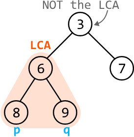

What can we derive from these observations? In the three cases where the current node is the LCA, p and q were found in exactly two of the following three locations:

- The current node itself.
- The current node's left subtree.
- The current node's right subtree.

This indicates that by traversing the tree and checking if p and q are present in two of these locations for each node, we can effectively identify the LCA.

## Depth-first search

Recursive DFS is well-suited for traversal in this problem, as it enables us to recursively check each node's left and right subtrees to determine if they contain p or q.

In the implementation, we can assess the existence of p and q in the three locations previously mentioned, by attaining the following three boolean variables at each node:

```
node_is_p_or_q = (node == p or node == q)
left_contains_p_or_q = dfs(node.left)
right_contains_p_or_q = dfs(node.right)
```

Again, two of these variables need to be true for the current node to be the LCA.

## Return statement

Whenever we make a recursive DFS call, such as `dfs(node.left)`, we expect that call to return true if the subtree rooting from `node.left` contains p or q. This means the return statement of our DFS function should return true if either p or q exists anywhere in the current subtree.

To do this, we return true if any of the above three variables are true, as this would indicate either p or q is somewhere in the current subtree.

The diagram below shows how the boolean values returned from each node's left and right subtrees help to identify the LCA:

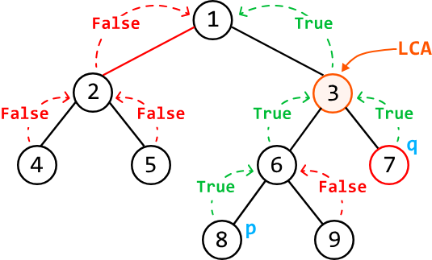

## Try it yourself

Write your solution to the problem before checking the reference implementation.

## Implementation

Note, this implementation uses a global variable because it leads to a more readable solution. However, it's important to confirm with your interviewer that global variables are acceptable. If not, you may need to adjust the solution to avoid using them, such as passing the variable as an argument, or finding an alternative approach.

### Python 
```python
from ds import TreeNode
    
def lowest_common_ancestor(root: TreeNode, p: TreeNode, q: TreeNode) -> TreeNode:
    dfs(root, p, q)
    return lca
    
def dfs(node: TreeNode, p: TreeNode, q: TreeNode) -> bool:
    global lca
    # Base case: a null node is neither p nor q.
    if not node:
        return False
    node_is_p_or_q = node == p or node == q
    # Recursively determine if the left and right subtrees contain 'p' or 'q'.
    left_contains_p_or_q = dfs(node.left, p, q)
    right_contains_p_or_q = dfs(node.right, p, q)
    # If two of the above three variables are true, the current node is the LCA.
    if node_is_p_or_q + left_contains_p_or_q + right_contains_p_or_q == 2:
        lca = node
    # Return true if the current subtree contains 'p' or 'q'.
    return node_is_p_or_q or left_contains_p_or_q or right_contains_p_or_q
```
### JavaScript
```javascript
import { TreeNode } from './ds.js'

let lca = null

export function lowest_common_ancestor(root, p, q) {
  dfs(root, p, q)
  return lca
}

function dfs(node, p, q) {
  // Base case: a null node is neither p nor q.
  if (!node) return false
  const nodeIsPOrQ = node === p || node === q
  // Recursively determine if the left and right subtrees contain 'p' or 'q'.
  const leftContainsPOrQ = dfs(node.left, p, q)
  const rightContainsPOrQ = dfs(node.right, p, q)
  // If two of the above three variables are true, the current node is the LCA.
  if (
    (nodeIsPOrQ ? 1 : 0) +
      (leftContainsPOrQ ? 1 : 0) +
      (rightContainsPOrQ ? 1 : 0) ===
    2
  ) {
    lca = node
  }
  // Return true if the current subtree contains either 'p' or 'q'.
  return nodeIsPOrQ || leftContainsPOrQ || rightContainsPOrQ
}
```
### Java
```java
import core.BinaryTree.TreeNode;

class UserCode {
    private static TreeNode<Integer> lca = null;

    public static TreeNode<Integer> lowestCommonAncestor(TreeNode<Integer> root, TreeNode<Integer> p, TreeNode<Integer> q) {
        dfs(root, p, q);
        return lca;
    }

    private static boolean dfs(TreeNode<Integer> node, TreeNode<Integer> p, TreeNode<Integer> q) {
        // Base case: a null node is neither p nor q.
        if (node == null) {
            return false;
        }
        boolean nodeIsPOrQ = (node == p || node == q);
        // Recursively determine if the left and right subtrees contain 'p' or 'q'.
        boolean leftContainsPOrQ = dfs(node.left, p, q);
        boolean rightContainsPOrQ = dfs(node.right, p, q);
        // If two of the above three variables are true, the current node is the LCA.
        if ((nodeIsPOrQ ? 1 : 0) + (leftContainsPOrQ ? 1 : 0) + (rightContainsPOrQ ? 1 : 0) == 2) {
            lca = node;
        }
        // Return true if the current subtree contains 'p' or 'q'.
        return nodeIsPOrQ || leftContainsPOrQ || rightContainsPOrQ;
    }
}
```
## Complexity Analysis

**Time complexity:** The time complexity of `lowest_common_ancestor` is O(n), where n denotes the number of nodes in the tree. This is because the algorithm traverses each node of the tree once.

**Space complexity:** The space complexity is O(n) due to the space taken up by the recursive call stack, which can grow as large as the height of the binary tree. The largest possible height of a binary tree is n.


---


# Build Binary Tree From Preorder and Inorder Traversals

Construct a binary tree using arrays of values obtained after a preorder traversal and an inorder traversal of the tree.

**Example:**

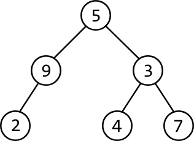

**Input:** preorder = [5, 9, 2, 3, 4, 7], inorder = [2, 9, 5, 4, 3, 7]

**Constraints:**

- The tree consists of unique values.

## Intuition

The first question that might come to mind is why both the preorder and inorder arrays are needed to solve this problem. Can't we just use one of them? The reason is that each individual traversal order could represent multiple possible trees. For example, below are some trees that correspond to the following inorder traversal:

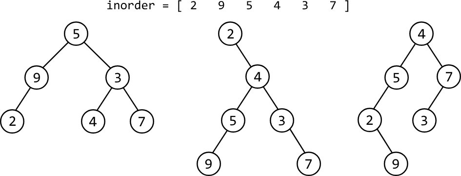

If one traversal array isn't enough, it might be possible to build the tree using an additional traversal array as a reference point, to help identify how each node should be placed.

## The root node

Whatever our approach, we initially need a way to access the root node since the root node is necessary to construct the rest of the tree.

To identify where the root node is, let's first remind ourselves how nodes are processed during each traversal algorithm.

| Preorder traversal | Inorder traversal |
|---|---|
| 1. Process the current node | 1. Process the left subtree |
| 2. Process the left subtree | 2. Process the current node |
| 3. Process the right subtree | 3. Process the right subtree |

Notice that during preorder traversal, the current node is processed before its subtrees. From this, we can infer that preorder traversal processes the root node first, meaning the first value in the preorder array is the value of the root node.

With this established, let's find a method to build the rest of the tree.

## Building the tree

Consider the preorder and inorder traversal arrays below and the corresponding binary tree:

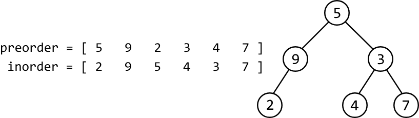

As mentioned above, we know the first value of the preorder array, 5, is the value of the root node.

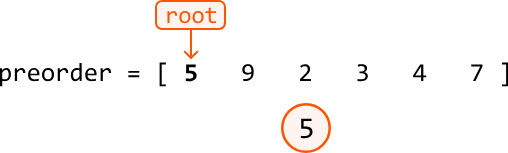

Now the question is, what node should be placed next? The preorder array alone isn't enough to determine this. So, we should consult the inorder array.

Inorder traversal first visits a node's left subtree before processing the node itself, so we can deduce that all values in the inorder array to the left of 5 are part of its left subtree. Similarly, all values to the right of 5 in the inorder array belong to its right subtree:

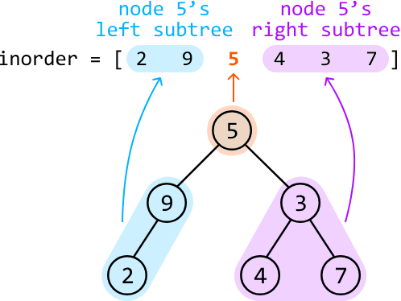

Now what? With the root node placed, we have two subtrees to build: node 5's left and right subtrees.

If we build the tree starting with the already-created root node, followed by the left subtree and then the right subtree, we're effectively building the tree using preorder traversal. This is useful because we happen to have an array of values from a preorder traversal, which means we know the exact order in which the nodes should be created.

As we're building the tree using preorder traversal, the next node to be created at any point will be the next value in the preorder array. This means we can iterate through the preorder array to place each new node.

Based on this, we know the next node to be placed will have a value of 9. But how do we know if node 9 is a left child or a right child of 5?

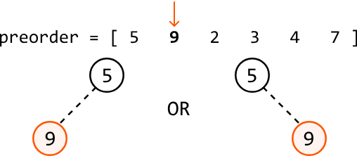

This is where the inorder array comes in, as it helps us determine the structure of the tree. Consider the left subtree:

- When we want to build the left subtree of a node, we look at the part of the inorder array that corresponds to the left subtree. In our example, this is the subarray [2, 9].

- If this subarray is not empty, we proceed to build the left subtree, starting with node 9.

- If this subarray is empty, it means there is no left subtree, so the current node's left child is null.

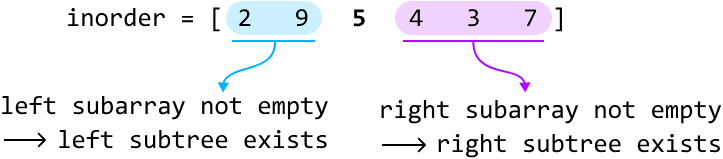

The same logic applies to the right subtree: we only build it if its corresponding inorder subarray isn't empty.

Now, let's devise a strategy for our algorithm. To utilize the two traversal arrays, we can assign a pointer to each:

- A `preorder_index` points to the value of the current subtree's root node. Once this node is created, increment `preorder_index` so it points to the value of the next node to be created.

- An `inorder_index` is used to determine the position of the same value in the inorder array. We can find the index of this value by searching through the inorder array.

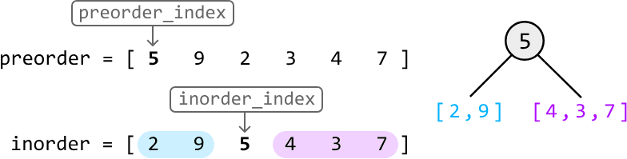

At each recursive call, once these indexes are obtained, we:

1. Create the current node using the value pointed at by `preorder_index`.

2. Increment `preorder_index` so it points to the value of the next node to be created.

3. Make a recursive call to build the current node's left and right subtrees:

   - Pass in the subarray `inorder[0, inorder_index - 1]` to build the left subtree.
   - Pass in the subarray `inorder[inorder_index + 1, n - 1]` to build the right subtree.

## Optimization - left and right pointers

One inefficiency of the above approach is that we extract entire subarrays out of the inorder array whenever we make a recursive call, which takes O(n) time each time we do this, where n denotes the length of each input array. A more efficient approach is to define the range of each inorder subarray using left and right pointers. Specifically:

- The left subtree contains the values in the range [left, inorder_index - 1].

- The right subtree contains the values in the range [inorder_index + 1, right].

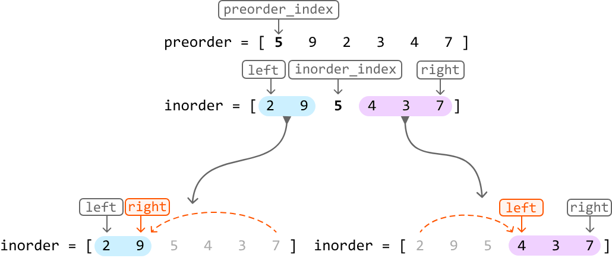

This allows us to define subarrays by just moving pointers, as opposed to creating completely new subarrays.

## Optimization - hash map

At each node, it's necessary to set `inorder_index` to the position of the same value pointed at by `preorder_index`. Performing a linear search for this value would take O(n) time for each node. Instead, we can use a hash map to store the inorder array values and their indexes, allowing us to retrieve any value's index from the inorder array in O(1) time.

## Try it yourself

Write your solution to the problem before checking the reference implementation.

## Implementation

### Python 
```python
from ds import TreeNode
from typing import List
    
preorder_index = 0
inorder_indexes_map = {}
    
def build_binary_tree(preorder: List[int], inorder: List[int]) -> TreeNode:
    global inorder_indexes_map
    # Populate the hash map with the inorder values and their indexes.
    for i, val in enumerate(inorder):
        inorder_indexes_map[val] = i
    # Build the tree and return its root node.
    return build_subtree(0, len(inorder) - 1, preorder, inorder)
    
def build_subtree(left, right, preorder, inorder):
    global preorder_index, inorder_indexes_map
    # Base case: if no elements are in this range, return None.
    if left > right:
        return None
    val = preorder[preorder_index]
    # Set 'inorder_index' to the index of the same value pointed at by
    # 'preorder_index'.
    inorder_index = inorder_indexes_map[val]
    node = TreeNode(val)
    # Advance 'preorder_index' so it points to the value of the next node to be
    # created.
    preorder_index += 1
    # Build the left and right subtrees and connect them to the current node.
    node.left = build_subtree(left, inorder_index - 1, preorder, inorder)
    node.right = build_subtree(inorder_index + 1, right, preorder, inorder)
    return node
```
### JavaScript
```javascript
import { TreeNode } from './ds.js'

let preorderIndex = 0
let inorderIndexesMap = new Map()

export function build_binary_tree(preorder, inorder) {
  preorderIndex = 0
  inorderIndexesMap.clear()
  // Populate the map with inorder values and their indexes.
  for (let i = 0; i < inorder.length; i++) {
    inorderIndexesMap.set(inorder[i], i)
  }
  // Build the tree and return its root node.
  return buildSubtree(0, inorder.length - 1, preorder, inorder)
}

export function buildSubtree(left, right, preorder, inorder) {
  // Base case: if no elements are in this range, return null.
  if (left > right) {
    return null
  }
  const val = preorder[preorderIndex]
  // Set 'inorder_index' to the index of the same value pointed at by
  // 'preorder_index'.
  const inorderIndex = inorderIndexesMap.get(val)
  const node = new TreeNode(val)
  // Advance preorderIndex to point to the next node to be created.
  preorderIndex++
  // Build the left and right subtrees and connect them to the current node.
  node.left = buildSubtree(left, inorderIndex - 1, preorder, inorder)
  node.right = buildSubtree(inorderIndex + 1, right, preorder, inorder)
  return node
}
```
### Java
```java
import core.BinaryTree.TreeNode;
import java.util.ArrayList;
import java.util.HashMap;
import java.util.Map;

public class Main {
    private int preorderIndex = 0;
    private Map<Integer, Integer> inorderIndexesMap = new HashMap<>();

    public TreeNode<Integer> build_binary_tree(ArrayList<Integer> preorder, ArrayList<Integer> inorder) {
        // Populate the hash map with the inorder values and their indexes.
        for (int i = 0; i < inorder.size(); i++) {
            inorderIndexesMap.put(inorder.get(i), i);
        }
        // Build the tree and return its root node.
        return build_subtree(0, inorder.size() - 1, preorder);
    }

    private TreeNode<Integer> build_subtree(int left, int right, ArrayList<Integer> preorder) {
        // Base case: if no elements are in this range, return null.
        if (left > right) {
            return null;
        }
        int val = preorder.get(preorderIndex);
        // Set 'inorderIndex' to the index of the same value pointed at by 'preorderIndex'.
        int inorderIndex = inorderIndexesMap.get(val);
        TreeNode<Integer> node = new TreeNode<>(val);
        // Advance 'preorderIndex' so it points to the value of the next node to be created.
        preorderIndex++;
        // Build the left and right subtrees and connect them to the current node.
        node.left = build_subtree(left, inorderIndex - 1, preorder);
        node.right = build_subtree(inorderIndex + 1, right, preorder);
        return node;
    }
}
```
## Complexity Analysis

**Time complexity:** The time complexity of `build_binary_tree` is O(n), as it makes one call to the `build_subtree` function, which recursively traverses each element in the preorder and inorder arrays once, resulting in an O(n) runtime.

**Space complexity:** The space complexity is O(n) due to the space taken up by the recursive call stack, which can grow as large as the height of the binary tree. The largest possible height of a binary tree is n. The hash map `inorder_indexes_map` also takes up O(n) space.


---


# Maximum Sum of a Continuous Path in a Binary Tree

Return the maximum sum of a continuous path in a binary tree. A path is defined by the following characteristics:

- Consists of a sequence of nodes that can begin and end at any node in the tree.
- Each consecutive pair of nodes in the sequence is connected by an edge.
- The path must be a single continuous sequence of nodes that doesn't split into multiple paths.

**Example:**

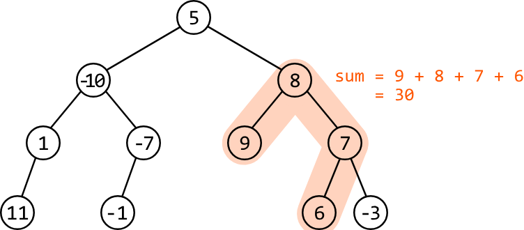

**Output:** 30

**Constraints:**

- The tree contains at least one node.

## Intuition

Let's first understand what a path is in a binary tree. An important thing to note is that all paths have a root node. Consider the following binary tree:

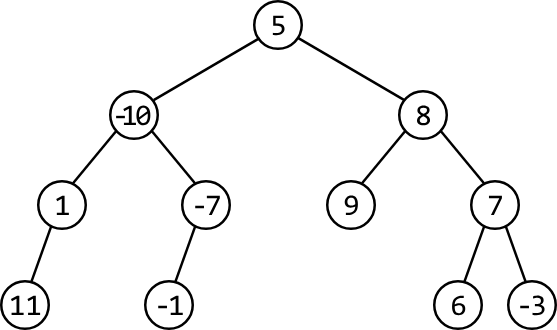

Every path that exists in this tree has a corresponding root node, as shown in the three examples below:

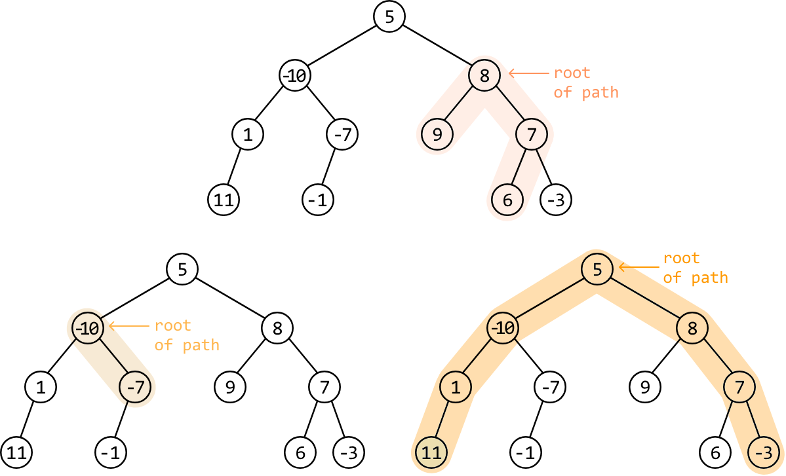

Inversely, this means that every node in the tree is the root of some path(s). For example, node 7 in the tree below is the root of four paths. The largest sum rooting from node 7 is 13:

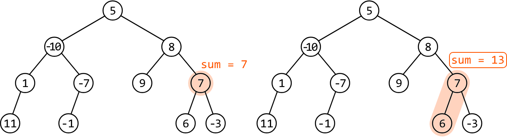

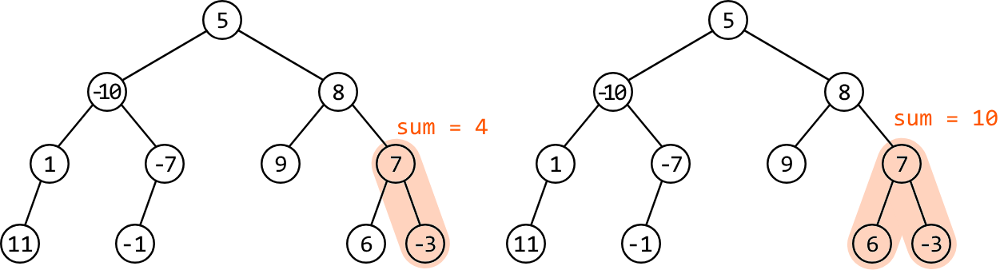

So, to find the maximum path sum, we calculate the maximum sum rooting from each node and return the largest of these sums.

## Calculating the maximum path sum at any node

Let's try adopting a recursive strategy for this. Consider the root node of our example. The maximum sum of a path rooting from node 5 involves the maximum gain we can attain from its left subtree and its right subtree.

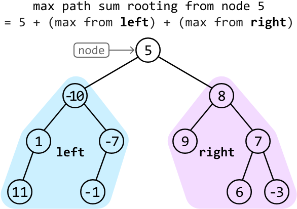

Which sums do we expect node 5's left and right subtrees to return? Consider what happens when the maximum path sums of these subtrees are returned to node 5:

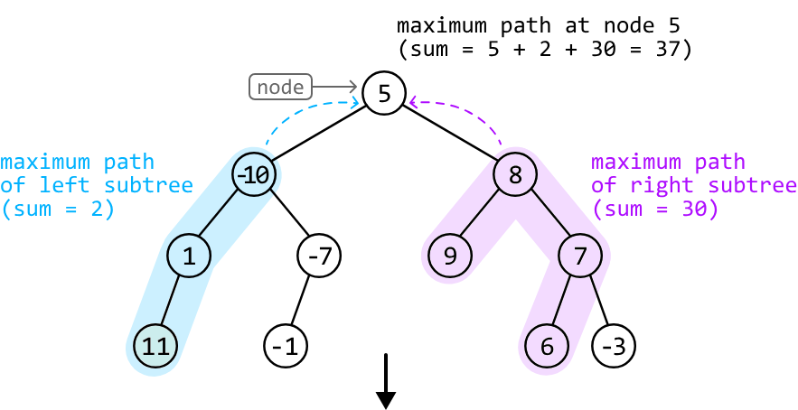

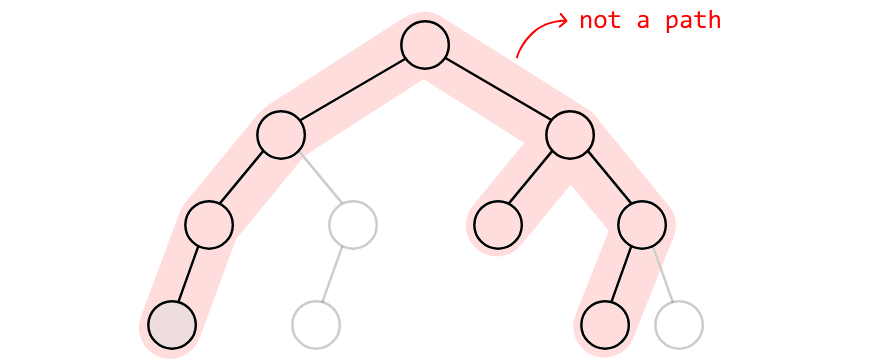

As we can see, when we received the maximum path sum from a recursive call made to node 8, we received the sum of a path with multiple branches. This results in an invalid path formed at node 5.

Below, we can see what we actually want. The sums of the two paths returned here correctly give us the maximum path sum rooting from node 5:

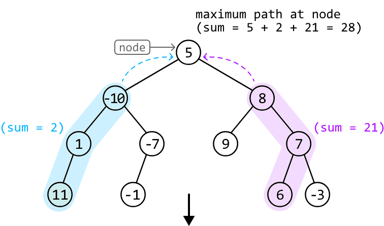

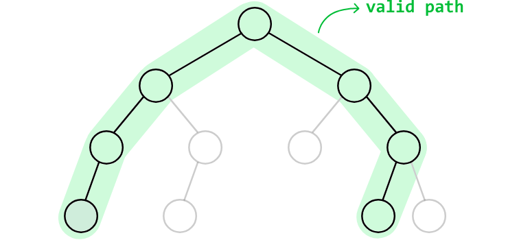

The difference between the valid and invalid paths above lies in the type of path returned by the recursive call to node 8. We can see this difference clearly in the diagram below.

In the left diagram below, an invalid path is formed at node 5 because at node 8, we return node 8's maximum path sum, which is from a path with two branches.

In the right diagram, a valid path is formed at node 5 because we return the largest sum of a path with a single branch.

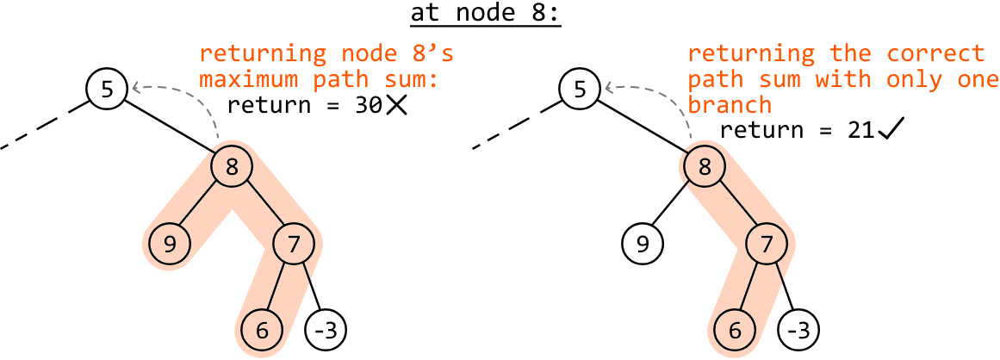

This observation highlights that we can't just return the maximum path sum of a node. So, let's have a closer look at which path sum we should return, instead.

## Identifying the value returned during recursion

Consider node 8 from the above example. The maximum path sum rooting from node 8 is 30. We know from the discussion above that we can't just return this maximum path sum value:

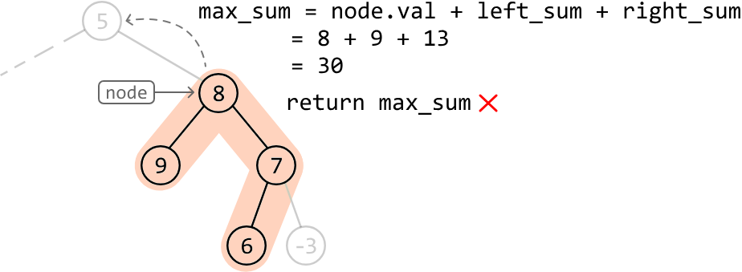

We know we need to make sure we return a single, continuous path from node 8. This would mean returning a path with node 8 as an end point, which leaves us with two main choices for values we could return:

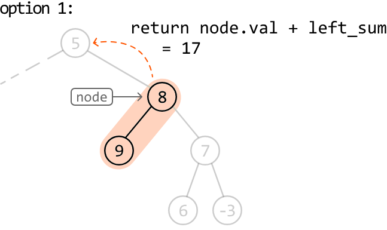

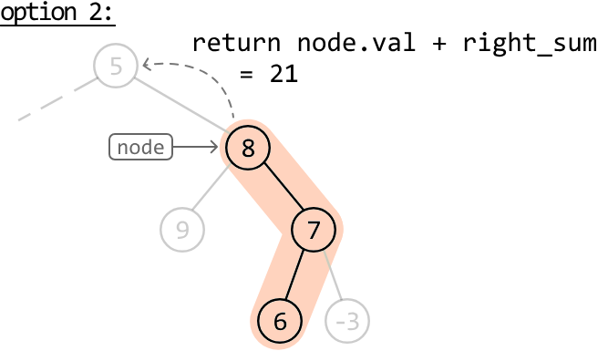

Between the above two paths, we just return whichever of their sums is larger. Therefore, our return statement is:

```
return node.val + max(left_sum, right_sum)
```

Now that we're getting single continuous path sums from the left and right subtrees, the maximum path sum rooting from a node can be calculated using `node.val + left_sum + right_sum`. This is done separately from the return statement.

The maximum path sum of the entire tree is found by keeping track of the largest path sum formed at every node.

## Handling negative path sums

One final thing to note is that we shouldn't include the values of `left_sum` or `right_sum` if either is negative, as they wouldn't contribute to a maximum sum. We can do this by setting their values to 0 if they're negative, which is the same as excluding the left or right path from the sum.

## Try it yourself

Write your solution to the problem before checking the reference implementation.

## Implementation

### Python 
```python
from ds import TreeNode
    
max_sum = float('-inf')
    
def max_path_sum(root: TreeNode) -> int:
   global max_sum
   max_path_sum_helper(root)
   return max_sum
    
def max_path_sum_helper(node: TreeNode) -> int:
   global max_sum
   # Base case: null nodes have no path sum.
   if not node:
       return 0
   # Collect the maximum gain we can attain from the left and right subtrees, setting
   # them to 0 if they're negative.
   left_sum = max(max_path_sum_helper(node.left), 0)
   right_sum = max(max_path_sum_helper(node.right), 0)
   # Update the overall maximum path sum if the current path sum is larger.
   max_sum = max(max_sum, node.val + left_sum + right_sum)
   # Return the maximum sum of a single, continuous path with the current node as an
   # endpoint.
   return node.val + max(left_sum, right_sum)
```
### JavaScript
```javascript
import { TreeNode } from './ds.js'

let maxSum = -Infinity

export function max_path_sum(root) {
  maxSum = -Infinity
  maxPathSumHelper(root)
  return maxSum
}

function maxPathSumHelper(node) {
  // Base case: null nodes have no path sum.
  if (!node) return 0
  // Collect the maximum gain we can attain from the left and right subtrees,
  // setting them to 0 if they’re negative.
  const leftSum = Math.max(maxPathSumHelper(node.left), 0)
  const rightSum = Math.max(maxPathSumHelper(node.right), 0)

  // Update the overall maximum path sum if the current path sum is larger.
  maxSum = Math.max(maxSum, node.val + leftSum + rightSum)
  // Return the maximum sum of a single, continuous path with the current node
  // as an endpoint.
  return node.val + Math.max(leftSum, rightSum)
}
```
### Java
```java
import core.BinaryTree.TreeNode;

class Main {
    private static int maxSum = Integer.MIN_VALUE;

    public static int max_path_sum(TreeNode<Integer> root) {
        // Start the recursive traversal and return the maximum path sum.
        max_path_sum_helper(root);
        return maxSum;
    }

    private static int max_path_sum_helper(TreeNode<Integer> node) {
        // Base case: null nodes have no path sum.
        if (node == null) {
            return 0;
        }
        // Collect the maximum gain we can attain from the left and right subtrees, setting
        // them to 0 if they’re negative.
        int leftSum = Math.max(max_path_sum_helper(node.left), 0);
        int rightSum = Math.max(max_path_sum_helper(node.right), 0);
        // Update the overall maximum path sum if the current path sum is larger.
        maxSum = Math.max(maxSum, node.val + leftSum + rightSum);
        // Return the maximum sum of a single, continuous path with the current node as an
        // endpoint.
        return node.val + Math.max(leftSum, rightSum);
    }
}
```
## Complexity Analysis

**Time complexity:** The time complexity of `max_path_sum` is O(n), where n denotes the number of nodes in the tree. This is because it traverses each node of the tree once.

**Space complexity:** The space complexity is O(n) due to the space taken up by the recursive call stack, which can grow as large as the height of the binary tree. The largest possible height of a binary tree is n.


---


# Binary Tree Symmetry

Determine if a binary tree is vertically symmetric. That is, the left subtree of the root node is a mirror of the right subtree.

**Example:**

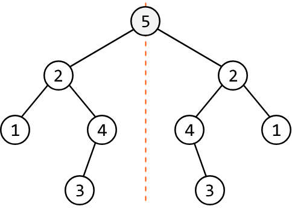

**Output:** True

## Intuition

To check a binary tree's symmetry, we need to assess its left and right subtrees. The first thing to note is that the root node itself doesn't affect the symmetry of the tree. Therefore, we don't need to consider the root node. We now have the task of comparing two subtrees to check if one vertically mirrors the other.

Consider the root node's left and right subtrees in the following example:

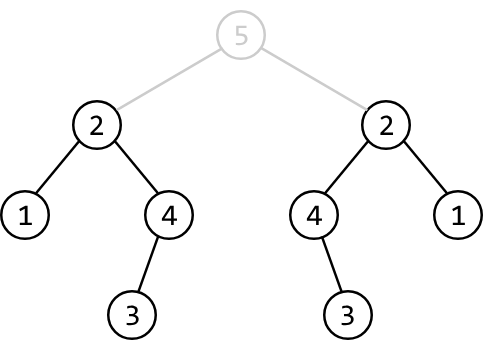

The key observation here is that the right subtree is an inverted version of the left subtree.

We've learned from the problem Invert Binary Tree that an inversion is performed by swapping the left and right child of every node. This suggests the value of each node's left child in the left subtree should match the value of the right child of the corresponding node in the right subtree, and vice versa.

We can start by using DFS to traverse both subtrees. During this traversal, we compare the left and right children of each node in the left subtree with the right and left children of its corresponding node in the right subtree, respectively.

- If the values of any two nodes being compared are not the same, the tree is not symmetric.

- If, at any point, one of the child nodes being compared is null while the other isn't, the tree is also not symmetric.

Initially, we see the values of the root nodes of the left and right subtrees are equal:

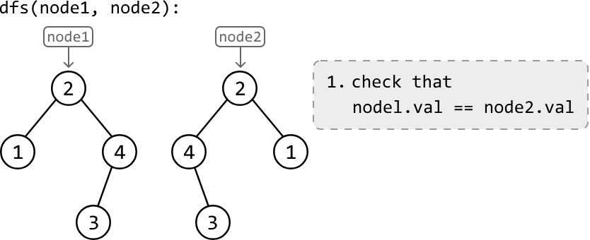

Since they're equal, proceed by comparing their children through recursive DFS calls. Specifically, make two recursive DFS calls to compare the left child of one node with the right child of the other. This checks that node2's children contain the same values as node1's children, but inverted.

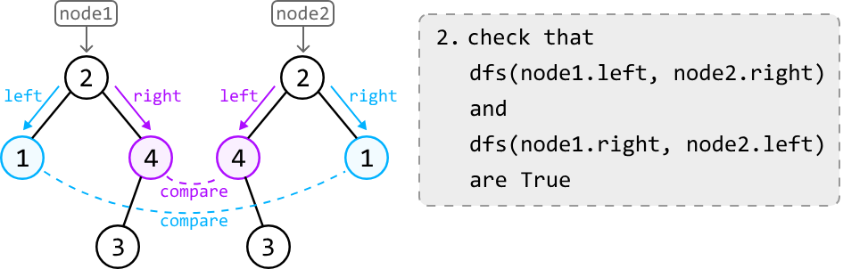

If either DFS call returns false, the subtrees are not symmetric. If both DFS calls return true, the subtrees are symmetric. This process is repeated for the entire tree.

## Try it yourself

Write your solution to the problem before checking the reference implementation.

## Implementation

### Python 
```python
from ds import TreeNode
    
def binary_tree_symmetry(root: TreeNode) -> bool:
    if not root:
        return True
    return compare_trees(root.left, root.right)
    
def compare_trees(node1: TreeNode, node2: TreeNode) -> bool:
    # Base case: if both nodes are null, they're symmetric.
    if not node1 and not node2:
        return True
    # If one node is null and the other isn't, they aren't symmetric.
    if not node1 or not node2:
        return False
    # If the values of the current nodes don't match, trees aren't symmetric.
    if node1.val != node2.val:
        return False
    # Compare the 'node1's left subtree with 'node2's right subtree. If these
    # aren't symmetric, the whole tree is not symmetric.
    if not compare_trees(node1.left, node2.right):
        return False
    # Compare the 'node1's right subtree with 'node2's left subtree.
    return compare_trees(node1.right, node2.left)
```
### JavaScript
```javascript
import { TreeNode } from './ds.js'

export function binary_tree_symmetry(root) {
  if (!root) {
    return true
  }
  return compare_trees(root.left, root.right)
}

function compare_trees(node1, node2) {
  // Base case: if both nodes are null, they're symmetric.
  if (!node1 && !node2) {
    return true
  }
  // If one node is null and the other isn't, they aren't symmetric.
  if (!node1 || !node2) {
    return false
  }
  // If the values of the current nodes don't match, trees aren't symmetric.
  if (node1.val !== node2.val) {
    return false
  }
  // Compare the 'node1's left subtree with 'node2's right subtree.
  if (!compare_trees(node1.left, node2.right)) {
    return false
  }
  // Compare the 'node1's right subtree with 'node2's left subtree.
  return compare_trees(node1.right, node2.left)
}
```
### Java
```java
import core.BinaryTree.TreeNode;

class Main {
    public static Boolean binary_tree_symmetry(TreeNode<Integer> root) {
        // A null tree is symmetric.
        if (root == null) {
            return true;
        }
        // Start the recursive comparison of left and right subtrees.
        return isMirror(root.left, root.right);
    }

    private static boolean isMirror(TreeNode<Integer> node1, TreeNode<Integer> node2) {
        // Both nodes are null – it's symmetric at this level.
        if (node1 == null && node2 == null) {
            return true;
        }
        // One is null and the other isn't – not symmetric.
        if (node1 == null || node2 == null) {
            return false;
        }
        // The values must match, and the outer and inner children must be symmetric.
        return node1.val.equals(node2.val) &&
               isMirror(node1.left, node2.right) &&
               isMirror(node1.right, node2.left);
    }
}
```
## Complexity Analysis

**Time complexity:** The time complexity of `binary_tree_symmetry` is O(n), where n denotes the number of nodes in the tree. This is because we process each node recursively at most once.

**Space complexity:** The space complexity is O(n) due to the space taken up by the recursive call stack, which can grow as large as the height of the binary tree. The largest possible height of a binary tree is n.

## Interview Tip

**Tip:** Cover null cases. Always check for null or empty inputs before using their attributes in a function. In this problem, the main `binary_tree_symmetry` function itself accesses the left and right attributes of the input node, necessitating an initial null check.


---


# Binary Tree Columns

Given the root of a binary tree, return a list of arrays where each array represents a vertical column of the tree. Nodes in the same column should be ordered from top to bottom. Nodes in the same row and column should be ordered from left to right.

**Example:**

**Output:** [[2], [9], [5, 1, 4], [3], [7]]

## Intuition

First and foremost, to get the columns of a binary tree, we'll need a way to identify what column each node is in.

## Column ids

One way to distinguish between different columns is to represent each column by a distinct numerical value: an id. Initially, we don't know how many columns there are to the left or to the right of the root node, but we at least know the column which contains the root node itself. Let's give this column an id of 0. This lets us set positive column ids for nodes to the right of the root and negative ids to the left:

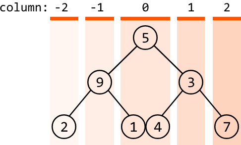

How can we identify what column id a node is associated with? A handy observation is that every time we move to the right, the column id increases by 1, and every time we move to the left, it decreases by 1. This allows us to assign ids as we traverse the tree: for any node, the column ids of `node.left` and `node.right` are `column - 1` and `column + 1`, respectively:

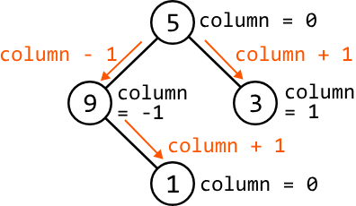

## Tracking node values by their column id

Now that we have a way to determine a node's column, we'll need a way to keep track of which node values belong to which columns. This can be done using a hash map where keys are column ids and the value of each column id is a list of the node values at that column.

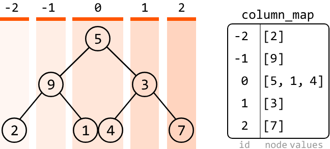

Now, let's consider what traversal algorithm we should use to populate this hash map.

## Breadth-first search

In general, we can employ any traversal method to assign column ids to each node, as long as we increment the column id whenever we move right and decrement it whenever we move left. However, we need to be cautious about the following two requirements:

- Nodes in the same column should be ordered from top to bottom.

- Nodes in the same row and column should be ordered from left to right.

So, we'll need an algorithm that traverses the tree from top to bottom and then from left to right. This calls for BFS.

BFS processes nodes level by level, starting from the root and moving horizontally across the tree at each level. This method ensures nodes are visited from top to bottom, and for nodes in the same row (level), they are visited from left to right.

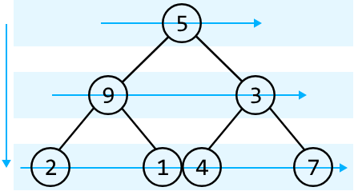

Traversing the tree this way ensures node values are added to the hash map in the desired order, complying with the two requirements above.

We can see how the hash map is populated level by level below:

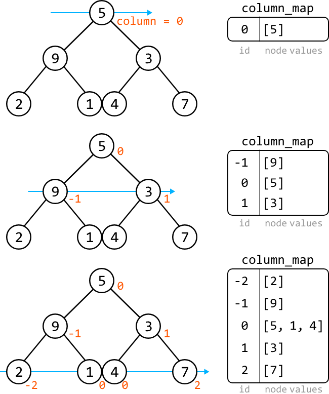

Once BFS concludes, the hash map is populated with lists of values for each column id. However, the hash map itself is not the expected output. So, let's discuss what to do next.

## Creating the output

This problem expects us to return the column ids from left to right. As we know, a hash map does not inherently maintain the order of its keys (column ids), which means we'll need to find a way to attain the output in the desired order.

To retrieve the column ids in the desired order, it would be useful to know the leftmost column id and the rightmost column id. This allows us to increment through all ids in the range [leftmost_column, rightmost_column], ensuring we can build the output in the desired order.

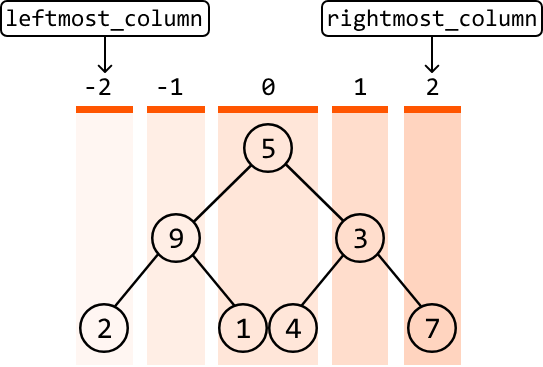

## Try it yourself

Write your solution to the problem before checking the reference implementation.

## Implementation

### Python 
```python
from ds import TreeNode
from typing import List
from collections import defaultdict, deque
    
def binary_tree_columns(root: TreeNode) -> List[List[int]]:
    if not root:
        return []
    column_map = defaultdict(list)
    leftmost_column = rightmost_column = 0
    queue = deque([(root, 0)])
    while queue:
        node, column = queue.popleft()
        if node:
            # Add the current node's value to its corresponding list in the hash
            # map.
            column_map[column].append(node.val)
            leftmost_column = min(leftmost_column, column)
            rightmost_column = max(rightmost_column, column)
            # Add the current node's children to the queue with their respective
            # column ids.
            queue.append((node.left, column - 1))
            queue.append((node.right, column + 1))
    # Construct the output list by collecting values from each column in the hash
    # map in the correct order.
    return [column_map[i] for i in range(leftmost_column, rightmost_column + 1)]
```
### JavaScript
```javascript
import { TreeNode } from './ds.js'

export function binary_tree_columns(root) {
  if (!root) {
    return []
  }
  const columnMap = new Map()
  let leftmostColumn = 0
  let rightmostColumn = 0
  const queue = [[root, 0]]
  while (queue.length > 0) {
    const [node, column] = queue.shift()
    if (node) {
      // Add the current node's value to its corresponding list in the hash
      // map.
      if (!columnMap.has(column)) {
        columnMap.set(column, [])
      }
      columnMap.get(column).push(node.val)
      leftmostColumn = Math.min(leftmostColumn, column)
      rightmostColumn = Math.max(rightmostColumn, column)
      // Add the current node's children to the queue with their respective
      // column ids.
      queue.push([node.left, column - 1])
      queue.push([node.right, column + 1])
    }
  }
  // Construct the output list by collecting values from each column in the hash
  // map in the correct order.
  const result = []
  for (let i = leftmostColumn; i <= rightmostColumn; i++) {
    result.push(columnMap.get(i))
  }
  return result
}
```
### Java
```java
import java.util.ArrayList;
import java.util.HashMap;
import java.util.LinkedList;
import java.util.Queue;
import java.util.Map;
import core.BinaryTree.TreeNode;

// Helper class to store a node and its column index.
class Pair {
    TreeNode<Integer> node;
    int column;

    public Pair(TreeNode<Integer> node, int column) {
        this.node = node;
        this.column = column;
    }
}

class Main {
    public ArrayList<ArrayList<Integer>> binary_tree_columns(TreeNode<Integer> root) {
        if (root == null) {
            return new ArrayList<>();
        }
        // Add the current node's value to its corresponding list in the hash map.
        Map<Integer, ArrayList<Integer>> columnMap = new HashMap<>();
        int leftmostColumn = 0, rightmostColumn = 0;
        // Use a queue to perform BFS; store (node, column index) pairs.
        Queue<Pair> queue = new LinkedList<>();
        queue.offer(new Pair(root, 0));
        while (!queue.isEmpty()) {
            Pair current = queue.poll();
            TreeNode<Integer> node = current.node;
            int column = current.column;
            columnMap.putIfAbsent(column, new ArrayList<>());
            columnMap.get(column).add(node.val);
            leftmostColumn = Math.min(leftmostColumn, column);
            rightmostColumn = Math.max(rightmostColumn, column);
            // Add the current node's children to the queue with their respective column ids.
            if (node.left != null) {
                queue.offer(new Pair(node.left, column - 1));
            }
            if (node.right != null) {
                queue.offer(new Pair(node.right, column + 1));
            }
        }
        // Construct the output list by collecting values from each column in the hash map in the correct order.
        ArrayList<ArrayList<Integer>> result = new ArrayList<>();
        for (int i = leftmostColumn; i <= rightmostColumn; i++) {
            result.add(columnMap.get(i));
        }
        return result;
    }
}
```
## Complexity Analysis

**Time complexity:** The time complexity of `binary_tree_columns` is O(n) where n denotes the number of nodes in the tree. This is because we process each node of the tree once during the level‐order traversal.

**Space complexity:** The space complexity is O(n) due to the space taken up by the queue. The queue's size will grow as large as the level with the most nodes. In the worst case, this occurs at the final level when all the last‐level nodes are non‐null, totaling approximately n/2 nodes. Note that the output array created at the return statement does not contribute to the space complexity.

---


# Kth Smallest Number in a Binary Search Tree

Given the root of a binary search tree (BST) and an integer k, find the kth smallest node value.

**Example:**

Given the BST below and k = 5:


**Output:** 6

**Constraints:**

- n ≥ 1, where n denotes the number of nodes in the tree.
- 1 ≤ k ≤ n

## Intuition - Recursive

A naive approach to this problem is to traverse the tree and store all the nodes in an array, sort the array, and return the kth element. This approach, however, does not take advantage of the fact that we're dealing with a BST.

Consider again the BST from the example:

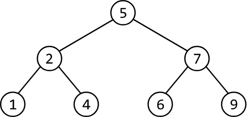

We know that in a BST, each node's value is larger than all the nodes to its left and smaller than all the nodes to its right. This structure means that BSTs inherently possess a sorted order. Given this, it should be possible to construct a sorted array of the tree's values by traversing the tree, without the need for additional sorting.

We now need a method to traverse the binary tree that allows us to encounter the nodes in their sorted order.

What are our options? We can immediately rule out any traversal algorithms that process the root node first, such as breadth-first search and preorder traversal, since the root node is not guaranteed to have the smallest value in a BST. This also indicates that we need an algorithm that starts with the leftmost node since this is always the smallest node in a BST. Additionally, the algorithm should end at the rightmost node since this would be the largest node.

This leads us to an ideal traversal algorithm: inorder traversal, where for each node, the left subtree is processed first, followed by the current node, and then the right subtree.

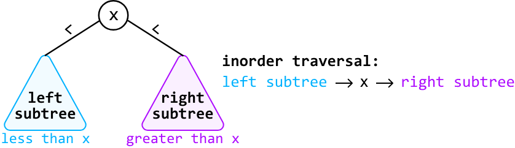

To build the sorted list of values using inorder traversal, we can design a recursive function. When called on the root node, it returns a sorted list of all the values in the BST.

When the function is called for any node during the recursive process, it constructs a sorted list of the values in the subtree rooting from that node. This is achieved by first obtaining the sorted values from its left subtree, then adding the current node's value, and finally appending the sorted values from its right subtree. This process is carried out through recursive calls to the left and right children.

Once we have the full list of sorted values, we can simply return the value at the (k - 1)th index to get the kth smallest value.

## Try it yourself

Write your solution to the problem before checking the reference implementation.

## Implementation - Recursive

### Python
```python
from ds import TreeNode
    
def kth_smallest_number_in_BST_recursive(root: TreeNode, k: int) -> int:
    sorted_list = inorder(root)
    return sorted_list[k - 1]
    
# Inorder traversal function to attain a sorted list of nodes from the BST.
def inorder(node: TreeNode) -> List[int]:
    if not node:
        return []
    return inorder(node.left) + [node.val] + inorder(node.right)
```
### JavaScript
```javascript
import { TreeNode } from './ds.js'

export function kth_smallest_number_in_BST_recursive(root, k) {
  const sortedList = inorder(root)
  return sortedList[k - 1]
}

// Inorder traversal function to attain a sorted list of nodes from the BST.
function inorder(node) {
  if (!node) {
    return []
  }
  return [...inorder(node.left), node.val, ...inorder(node.right)]
}
```
### Java
```java
import java.util.ArrayList;
import core.BinaryTree.TreeNode;

class Main {
    public int kth_smallest_number_in_BST_recursive(TreeNode<Integer> root, int k) {
        // Perform an inorder traversal to collect nodes in sorted order.
        ArrayList<Integer> sortedList = inorder(root);
        // Return the (k - 1)th element since list indexing is 0-based.
        return sortedList.get(k - 1);
    }

    // Inorder traversal function to attain a sorted list of nodes from the BST.
    private ArrayList<Integer> inorder(TreeNode<Integer> node) {
        ArrayList<Integer> result = new ArrayList<>();
        if (node == null) {
            return result;
        }
        result.addAll(inorder(node.left));
        result.add(node.val);
        result.addAll(inorder(node.right));
        return result;
    }
}
```
## Complexity Analysis

**Time complexity:** The time complexity of `kth_smallest_number_in_BST_recursive` is O(n), where n denotes the number of nodes in the tree. This is because we need to traverse through all n nodes of the tree to attain the sorted list.

**Space complexity:** The space complexity is O(n) due to the space taken up by `sorted_list`, as well as the recursive call stack, which can grow as large as the height of the binary tree. The largest possible height of a binary tree is n.

## Intuition - Iterative

Since we only need the kth smallest value, storing all n values in a list might not be necessary. Ideally, we'd like to find a way to traverse through k nodes instead of n. How can we modify our approach to achieve this?

If we had a way to stop inorder traversal once we've reached the kth node in the traversal, we would land on our answer. An iterative approach would allow for this since we'd be able to exit traversal once we've reached the kth node — something that's quite difficult to achieve using recursion.

We know inorder traversal is a DFS algorithm and that DFS algorithms can be implemented iteratively using a stack. Let's explore this idea further.

Consider what happened during recursive inorder traversal in the previous approach:

1. Make a recursive call to the left subtree.
2. Process the current node.
3. Make a recursive call to the right subtree.

Let's replicate the above steps iteratively using a stack.

1. Move as far left as possible, adding each node to the stack as we move left.

   We do this because, at the start of each recursive call in the recursive approach, a new call is made to the current node's left subtree, continuing until the base case (a null node) is reached. This implies that to mimic this process iteratively, we'll need to move as far left as possible.

   The reason we push nodes onto the stack as we go is so they can be processed later.

   The code snippet for this can be seen below:

### Python
   ```python
   while node:
       stack.append(node)
       node = node.left
   ```
### JavaScript
```javascript
while (node) {
  stack.push(node)
  node = node.left
}
```
2. Once we can no longer move left, we pop the node off the top of the stack. Let's call it the current node. Initially, this node will represent the smallest node. After this, the current node will subsequently represent the next smallest node, and so on until we reach the kth smallest node.

3. Decrement k, indicating that we now have one less node to visit until we reach the kth smallest node.

4. Once k == 0, we found the kth smallest node. Return the value of this node.

5. Move to the current node's right child.

## Try it yourself

Write your solution to the problem before checking the reference implementation.

## Implementation - Iterative

### Python 
```python
def kth_smallest_number_in_BST_iterative(root: TreeNode, k: int) -> int:
    stack = []
    node = root
    while stack or node:
        # Move to the leftmost node and add nodes to the stack as we go so they
        # can be processed in future iterations.
        while node:
            stack.append(node)
            node = node.left
        # Pop the top node from the stack to process it, and decrement 'k'.
        node = stack.pop()
        k -= 1
        # If we have processed 'k' nodes, return the value of the 'k'th smallest
        # node.
        if k == 0:
            return node.val
        # Move to the right subtree.
        node = node.right
```
### JavaScript
```javascript
export function kth_smallest_number_in_BST_iterative(root, k) {
  const stack = []
  let node = root
  while (stack.length > 0 || node !== null) {
    // Move to the leftmost node and add nodes to the stack as we go so they
    // can be processed in future iterations.
    while (node !== null) {
      stack.push(node)
      node = node.left
    }
    // Pop the top node from the stack to process it, and decrement 'k'.
    node = stack.pop()
    k -= 1
    // If we have processed 'k' nodes, return the value of the 'k'th smallest
    // node.
    if (k === 0) {
      return node.val
    }
    // Move to the right subtree.
    node = node.right
  }
  return -1 // Return -1 if k is invalid.
}
```
### Java
```java
import java.util.Stack;
import core.BinaryTree.TreeNode;

class Main {
    public int kth_smallest_number_in_BST_iterative(TreeNode<Integer> root, int k) {
        Stack<TreeNode<Integer>> stack = new Stack<>();
        TreeNode<Integer> node = root;
        while (!stack.isEmpty() || node != null) {
            // Move to the leftmost node and add nodes to the stack as we go so they
            // can be processed in future iterations.
            while (node != null) {
                stack.push(node);
                node = node.left;
            }
            // Pop the top node from the stack to process it, and decrement 'k'.
            node = stack.pop();
            k--;
            // If we have processed 'k' nodes, return the value of the 'k'th smallest
            // node.
            if (k == 0) {
                return node.val;
            }
            // Move to the right subtree.
            node = node.right;
        }
        return -1; // This line should never be reached if input is valid.
    }
}
```
## Complexity Analysis

**Time complexity:** The time complexity of `kth_smallest_number_in_BST_iterative` is O(k+h), where h denotes the height of the tree. Here's why:

- Iterative inorder traversal ensures we traverse k nodes, which takes at least O(k) time.

- Additionally, traversing to the leftmost node takes up to O(h) time, which should be considered separately since it's possible that h > k. In the worst case, the height of the tree is n, resulting in a time complexity of O(n), where n denotes the number of nodes in the tree.

**Space complexity:** The space complexity is O(h) since the stack can store up to O(h) during the traversal to the leftmost node. In the worst case, the height of the tree is n, resulting in a space complexity of O(n).


---


# Serialize and Deserialize a Binary Tree

Write a function to serialize a binary tree into a string, and another function to deserialize that string back into the original binary tree structure.

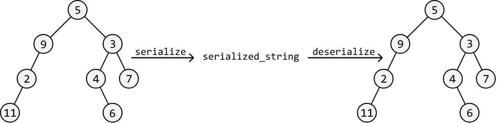

## Intuition

The primary challenge of this problem lies in how we serialize the tree into a string since this will determine if it's possible to reconstruct the tree using this string alone.

Let's first decide on a traversal strategy because the method we use to serialize the tree will impact how we deserialize the string. Two options:

- Use BFS to serialize the tree level by level.

- Use DFS. In this case, we'd need to choose between inorder, preorder, and postorder traversal.

There's flexibility in choosing the traversal algorithm because serializing with a specific traversal method allows us to rebuild (deserialize) the tree using the same traversal algorithm.

## Serialization

An important piece of information needed in our serialized string is the node values. In addition, we'll need to ensure we can identify the root node's value, since this is the first node to create when we deserialize the string.

As such, a traversal algorithm like preorder traversal is a good choice because it processes the root node first, then the left subtree, and finally the right subtree. This ensures the first value in our serialized string is the root node's value.

So, let's try serializing the following binary tree using preorder traversal, separating each node with a comma:

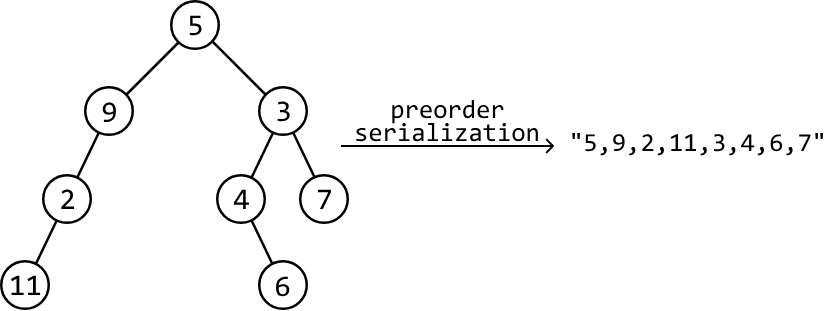

The issue with this serialization is that it doesn't guarantee we can reconstruct the exact original tree from its serialized string representation. This is because the string could represent multiple different trees, which means preorder deserialization could result in the creation of an invalid tree:

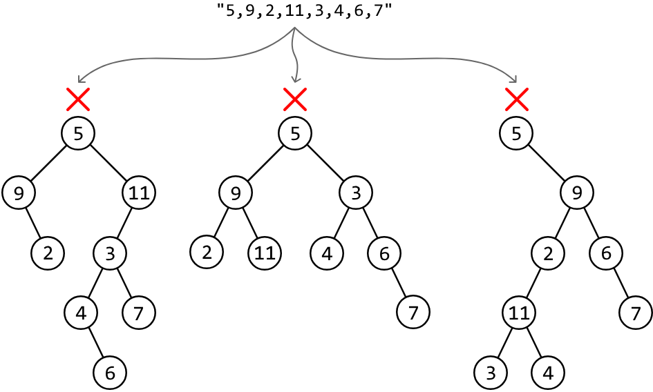

This is because the string is missing crucial information: null child nodes. For instance, after placing the root node with a value of 5 in the above example, we don't yet know where to place the node of value 9, which is the next value in the string. That is, we can't determine whether node 9 should be the left or right child of node 5:

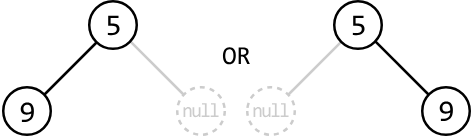

If the string indicates where the null child nodes are, we can correctly deserialize the tree because we have a complete representation of the tree's structure. Let's use the character '#' to represent a null node:

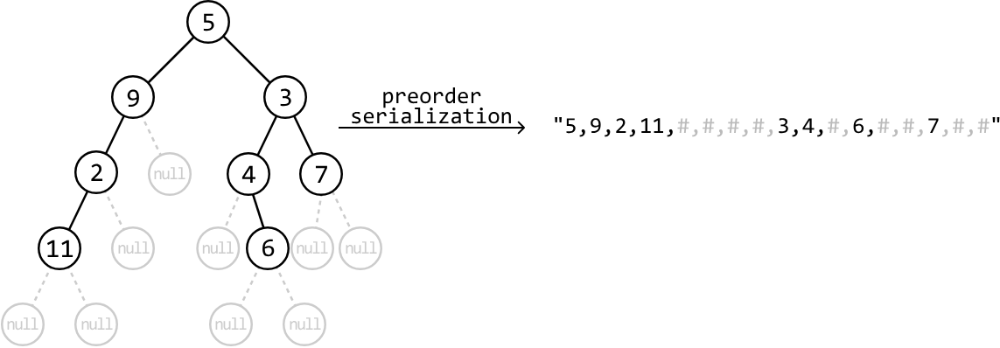

## Deserialization

To deserialize a string created with preorder traversal, we also need to use preorder traversal to reconstruct the tree.

The first step is to split the string using the comma delimiter, so each node value and '#' is in a list:

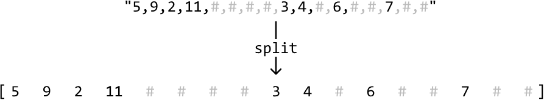

The first value in the list is the root node of the tree:

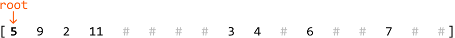

Starting from this root value, recursively construct the tree node by node using preorder traversal. Each new node will be created with the next value in the list of preorder values. Whenever we encounter a '#', we return null. The code snippet for this:

### Python 
```python
# Helper function to construct the tree using preorder traversal.
def build_tree(values: List[str]) -> TreeNode:
    val = next(values)
    # Base case: '#' indicates a null node.
    if val == '#':
        return None
    # Use preorder traversal to create the current node first, then the left and
    # right subtrees.
    node = TreeNode(int(val))
    node.left = build_tree(values)
    node.right = build_tree(values)
    return node
```
### JavaScript
```javascript
// Helper function to construct the tree using preorder traversal.
export function buildTree(values) {
  const next = () => values.shift() // Simulates Python's next()
  function helper() {
    const val = next()
    // Base case: '#' indicates a null node.
    if (val === '#') {
      return null
    }
    // Use preorder traversal to create the current node first, then the left and right subtrees.
    const node = new TreeNode(parseInt(val))
    node.left = helper()
    node.right = helper()
    return node
  }
  return helper()
}
```
### Java
```java
// Helper function to construct the tree using preorder traversal.
private static TreeNode<Integer> buildTree(Queue<String> values) {
    String val = values.poll();
    // Base case: '#' indicates a null node.
    if (val.equals("#")) {
        return null;
    }
    // Use preorder traversal processes the current node first, then the left and
    // right children.
    TreeNode<Integer> node = new TreeNode<>(Integer.parseInt(val));
    node.left = buildTree(values);
    node.right = buildTree(values);
    return node;
}
```
## Follow-up: what if you must use a different traversal algorithm?

It's possible to serialize and deserialize a binary tree using other traversal algorithms than preorder traversal. Let's explore some alternatives.

**Postorder Traversal:**

When we serialize the tree using postorder traversal, we get the following string (ignoring the null nodes in this discussion to focus on the node values and their order):

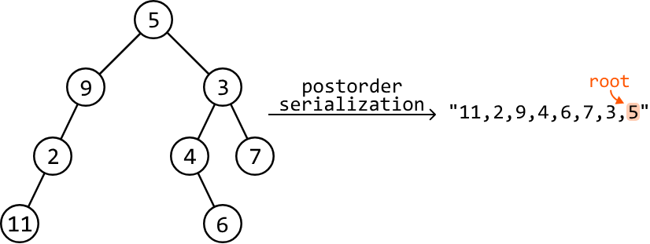

As we see, one big difference is that the root node will be the final value in the string, since postorder traversal processes the left subtree, then the right subtree, and finally the root node.

During deserialization, we'd build the tree by iterating through the node values from right to left instead of left to right, since the root value is at the right. In addition, we'd need to create each node's right subtree before we create its left subtree, as we go through the string in reverse.

**Inorder traversal:**

A lot more care needs to be taken when serializing a tree using inorder traversal. The main reason is that it's unclear where the root node of the tree is in the string, and where the root node of each subtree is, as we can see below:

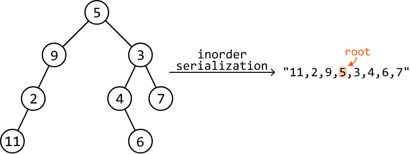

This doesn't make it impossible to use inorder traversal. It just means significantly more information needs to be provided in the serialized string to make deserialization possible. In particular, we need to include details about which value serves as the root node for each subtree as we iterate through them.

**Breadth-first search (BFS):**

BFS starts processing each node from the root of the tree, and traverses through it level by level, and from left to right. Serializing the tree using BFS gives the following order of values:

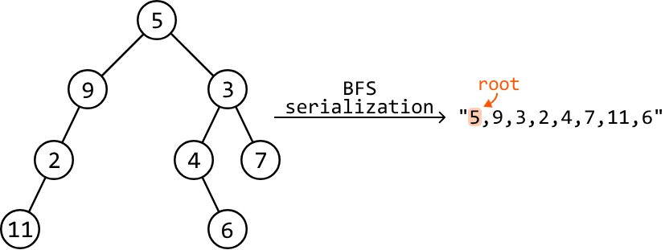

Similarly to preorder traversal, we just need to follow the exact traversal order for reconstructing the tree when deserializing the string.

## Try it yourself

Write your solution to the problem before checking the reference implementation.

## Implementation

In the following implementation, we opt for preorder traversal for serialization and deserialization.

### Python
```python
from ds import TreeNode
    
def serialize(root: TreeNode) -> str:
    # Perform a preorder traversal to add node values to a list, then convert the
    # list to a string.
    serialized_list = []
    preorder_serialize(root, serialized_list)
    # Convert the list to a string and separate each value using a comma
    # delimiter.
    return ','.join(serialized_list)
    
# Helper function to perform serialization through preorder traversal.
def preorder_serialize(node, serialized_list) -> None:
    # Base case: mark null nodes as '#'.
    if node is None:
        serialized_list.append('#')
        return
    # Preorder traversal processes the current node first, then the left and right
    # children.
    serialized_list.append(str(node.val))
    preorder_serialize(node.left, serialized_list)
    preorder_serialize(node.right, serialized_list)
    
def deserialize(data: str) -> TreeNode:
    # Obtain the node values by splitting the string using the comma delimiter.
    node_values = iter(data.split(','))
    return build_tree(node_values)
    
# Helper function to construct the tree using preorder traversal.
def build_tree(values: List[str]) -> TreeNode:
    val = next(values)
    # Base case: '#' indicates a null node.
    if val == '#':
        return None
    # Use preorder traversal processes the current node first, then the left and
    # right children.
    node = TreeNode(int(val))
    node.left = build_tree(values)
    node.right = build_tree(values)
    return node
```
### JavaScript
```javascript
import { TreeNode } from './ds.js'

export function serialize(root) {
  const serializedList = []
  preorderSerialize(root, serializedList)
  return serializedList.join(',')
}

// Helper function to perform serialization through preorder traversal.
function preorderSerialize(node, serializedList) {
  if (node === null) {
    serializedList.push('#')
    return
  }
  serializedList.push(String(node.val))
  preorderSerialize(node.left, serializedList)
  preorderSerialize(node.right, serializedList)
}

export function deserialize(data) {
  // Obtain the node values by splitting the string using the comma delimiter.
  const nodeValues = data.split(',')
  return buildTree(nodeValues)
}

// Helper function to construct the tree using preorder traversal.
function buildTree(values) {
  const val = values.shift()
  # Base case: '#' indicates a null node.
  if (val === '#') {
    return null
  }
  // Use preorder traversal processes the current node first, then the left and
  // right children.
  const node = new TreeNode(parseInt(val))
  node.left = buildTree(values)
  node.right = buildTree(values)
  return node
}
```
### Java
```java
import core.BinaryTree.TreeNode;
import java.util.ArrayList;
import java.util.Arrays;
import java.util.LinkedList;
import java.util.List;
import java.util.Queue;

class UserCode {
    public static String serialize(TreeNode<Integer> root) {
        // Perform a preorder traversal to add node values to a list, then convert the
        // list to a string.
        List<String> serializedList = new ArrayList<>();
        preorderSerialize(root, serializedList);
        // Convert the list to a string and separate each value using a comma
        // delimiter.
        return String.join(",", serializedList);
    }

    // Helper function to perform serialization through preorder traversal.
    private static void preorderSerialize(TreeNode<Integer> node, List<String> serializedList) {
        // Base case: mark null nodes as '#'.
        if (node == null) {
            serializedList.add("#");
            return;
        }
        // Preorder traversal processes the current node first, then the left and right
        // children.
        serializedList.add(String.valueOf(node.val));
        preorderSerialize(node.left, serializedList);
        preorderSerialize(node.right, serializedList);
    }

    public static TreeNode<Integer> deserialize(String data) {
        // Obtain the node values by splitting the string using the comma delimiter.
        Queue<String> values = new LinkedList<>(Arrays.asList(data.split(",")));
        return buildTree(values);
    }

    // Helper function to construct the tree using preorder traversal.
    private static TreeNode<Integer> buildTree(Queue<String> values) {
        String val = values.poll();
        // Base case: '#' indicates a null node.
        if (val.equals("#")) {
            return null;
        }
        // Use preorder traversal processes the current node first, then the left and
        // right children.
        TreeNode<Integer> node = new TreeNode<>(Integer.parseInt(val));
        node.left = buildTree(values);
        node.right = buildTree(values);
        return node;
    }
}
```
## Complexity Analysis

**Time complexity:** The time complexity of both `serialize` and `deserialize` is O(n), where n denotes the number of nodes in the tree. This is because we visit each of the n nodes in the binary tree exactly once during preorder traversal. The `serialize` function additionally converts the serialized list to a string, which also takes O(n) time.

**Space complexity:** The space complexity of both `serialize` and `deserialize` is O(n) due to the space taken up by the recursive call stack, which can grow as large as the height of the binary tree. The largest possible height of a binary tree is n.