# 12. Tries

1. [Introduction to Tries](#introduction-to-tries)
2. [Design a Trie](#design-a-trie)
3. [Insert and Search Words with Wildcards](#insert-and-search-words-with-wildcards)
4. [Find All Words on a Board](#find-all-words-on-a-board)

---

# Introduction to Tries

## Intuition

Tries, also known as prefix trees, are specialized tree-like data structures that efficiently store strings by taking advantage of shared prefixes.

To understand how a trie works, consider the string "internet". We can store this string as a sequence of connected nodes, where each node represents a character in the string:


Now, let's say we also want to store the word "interface". Instead of creating a separate sequence of nodes, we take advantage of their common prefix "inter". Both words can share the nodes for "inter", and the remainder of "interface" can branch out from the node 'r':

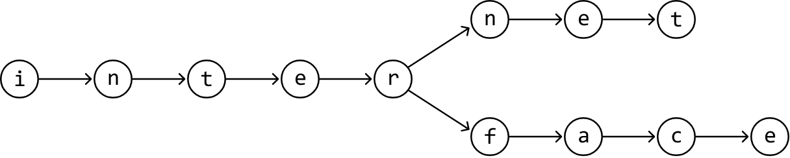

This is, in essence, how a trie works: by allowing words to reuse existing nodes based on shared prefixes, it efficiently stores strings in a way that minimizes redundancy.

## TrieNode

There are two attributes each TrieNode should have.

1. **Children:** Each TrieNode has a data structure to store references to its child nodes. A hash map is typically used for this, with a character as the key and its corresponding child node as the value.

   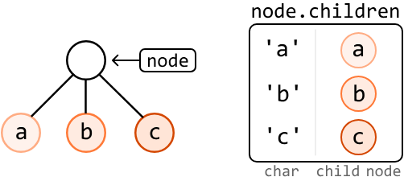

   Sometimes, an array is used instead of a hash map if the possible characters of words in the trie are limited and known in advance. For example, if they only contain lowercase English letters, an array of size 26 can be used, instead.

2. **End of word indicator:** Each TrieNode needs an attribute to indicate whether it marks the end of a word. This can be done in two ways:

   - A boolean attribute (`is_word`) to confirm if the node is the end of a word.
   - A string variable (`word`) that stores the word itself at the node. This is usually used if we also want to know the specific word that ends at this node.

## Trie structure

This is an example of a trie that's been populated by inserting the words "internet", "interface", "byte", "bytes", "dog", and "dig". Every word represented by the trie branches out of a root TrieNode, which does not represent any character.

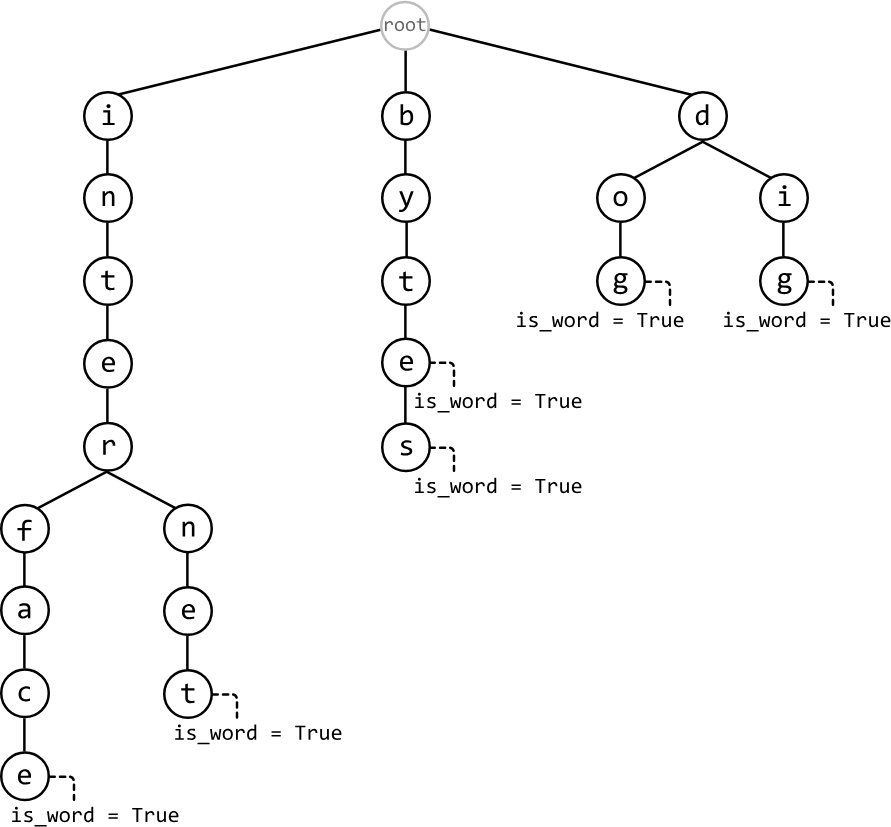

Below is the time complexity breakdown for trie operations involving a word of length k:

| Operation | Complexity | Description |
|---|---|---|
| Insert | O(k) | Insert a word into the trie. |
| Search | O(k) | Search for a word in the trie. |
| Search prefix | O(k) | Check if any word in the trie starts with a given prefix. |
| Delete | O(k) | Delete a word from the trie |

The implementation details of most of these functions are discussed in detail in the Design a Trie problem.

## When to use tries

The primary use of a trie is to handle efficient prefix searches. If an interview problem asks you to find all strings that share a common prefix, a trie is likely the ideal data structure. Tries are also useful for word validation, allowing us to quickly verify the existence of words within a set of strings. They also help optimize data storage by reducing redundancy through shared prefixes among strings.

## Real-world Example

**Autocomplete:** When you start typing a word, some systems use a trie to quickly suggest possible completions. Each node in the trie represents a character, and as you type, the system traverses the trie based on the input characters. This allows the system to efficiently retrieve all possible words or phrases that start with the entered prefix, enabling fast autocomplete suggestions.

## Chapter Outline

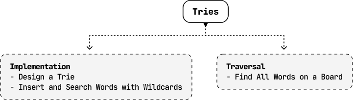


---


# Design a Trie

Design and implement a trie data structure that supports the following operations:

- `insert(word: str) -> None`: Inserts a word into the trie.
- `search(word: str) -> bool`: Returns true if a word exists in the trie, and false if not.
- `has_prefix(prefix: str) -> bool`: Returns true if the trie contains a word with the given prefix, and false if not.

**Example:**

```
Input: [
  insert('top'),
  insert('bye'),
  has_prefix('to'),
  search('to'),
  insert('to'),
  search('to')
]
Output: [True, False, True]
```

**Explanation:**

```
insert("top")    # trie has: "top"
insert("bye")    # trie has: "top" and "bye"
has_prefix("to") # prefix "to" exists in the string "top": return True
search("to")     # trie does not contain the word "to": return False
insert("to")     # trie has: "top", "bye", and "to"
search("to")     # trie contains the word "to": return True
```

**Constraints:**

- The words and prefixes consist only of lowercase English letters.
- The length of each word and prefix is at least one character.

## Intuition

Let's define a TrieNode using the same definition introduced in the introduction. In this implementation, the `is_word` attribute will be used to indicate whether a TrieNode marks the end of a word.

## Initializing the trie

To initialize the Trie, we define the root TrieNode in the constructor. All words inserted into the trie will branch out from this root node.

## Inserting a word into the trie

The `insert` function builds the trie word by word. What makes a trie useful is that it reduces redundancy by reusing existing nodes when possible. For example, if we insert "byte" when "bye" already exists in the trie, these two words should share the nodes that make up the prefix "by" to save space. This is an important point that will shape our implementation of this function.

To understand the insertion logic, let's walk through an example. Consider inserting the word "byte" into the trie below.

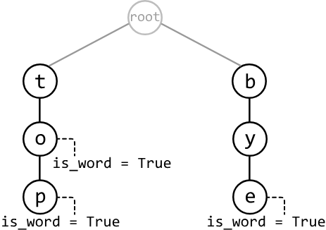

We first check if 'b', the first letter of the string, exists as a child of the root node by querying the hash map containing its children. In this case, it does. So, move to node 'b':

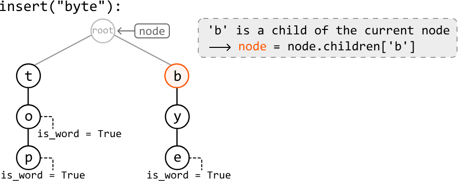

Now consider the second letter, 'y'. Similarly, node 'y' exists as a child of node 'b', so let's move to node 'y':

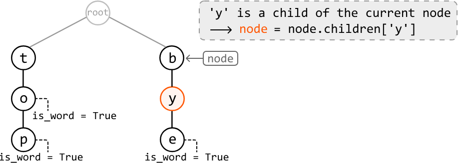

Now consider the next letter, 't'. Since node 't' doesn't exist as a child of node 'y', we need to create it and add it to node 'y's children hash map. Then, we can move to this newly created node 't':

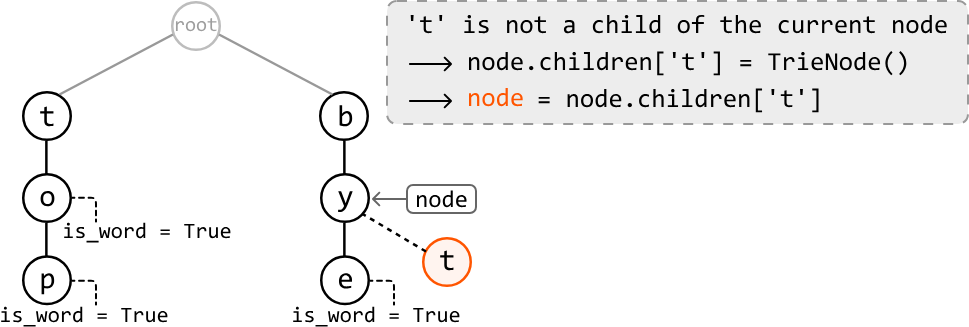

The last letter is 'e', which doesn't exist as a child of node 't'. So, let's create node 'e' and add it to node 't's children:

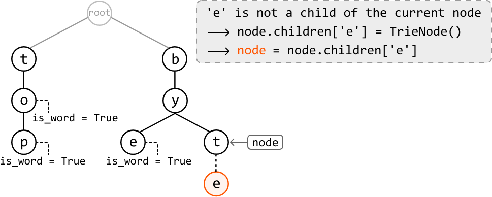

Now that we've reached the end of the word, we should set the `is_word` attribute of node 'e' to true, indicating that it marks the end of a word.

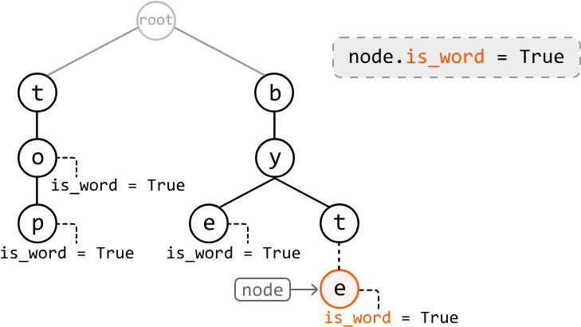

## Searching for a word

Searching for a word involves the same strategy as insertion, where we move node by node down the trie. The two main differences are:

- If a node corresponding to the current character in the word isn't found at any point, we return false because this would indicate the word doesn't exist in the trie.

- After traversing all characters of the search term, we return true only if the final node's `is_word` attribute is true.

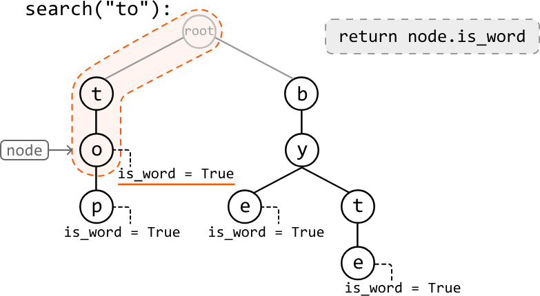

## Searching for a prefix

The logic for finding a prefix is nearly identical to the logic discussed above for the `search` function. The only difference is after successfully traversing all characters in our search term, we can just return true without checking the final node's `is_word` attribute, as a prefix doesn't need to end at the end of a word.

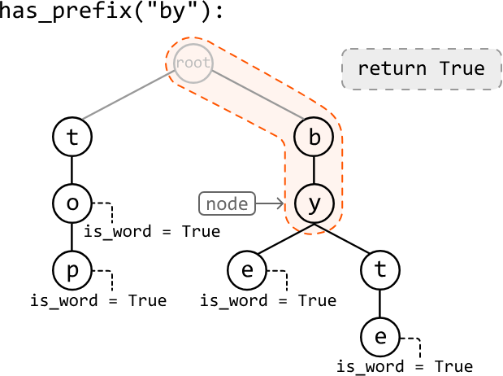

## Try it yourself

Write your solution to the problem before checking the reference implementation.

## Implementation

### Python 
```python
class TrieNode:
    def __init__(self):
        self.children = {}
        self.is_word = False
```
### JavaScript
```javascript
class TrieNode {
  constructor() {
    this.children = {}
    this.isWord = false
  }
}
```
### Java
```java
class TrieNode {
    public HashMap<Character, TrieNode> children;
    public boolean isWord;

    public TrieNode() {
        this.children = new HashMap<>();
        this.isWord = false;
    }
}
```
### Python
```python
class Trie:
   def __init__(self):
       self.root = TrieNode()
    
   def insert(self, word: str) -> None:
       node = self.root
       for c in word:
           # For each character in the word, if it's not a child of the current node,
           # create a new TrieNode for that character.
           if c not in node.children:
               node.children[c] = TrieNode()
           node = node.children[c]
       # Mark the last node as the end of a word.
       node.is_word = True
    
   def search(self, word: str) -> bool:
       node = self.root
       for c in word:
           # For each character in the word, if it's not a child of the current node,
           # the word doesn't exist in the Trie.
           if c not in node.children:
               return False
           node = node.children[c]
       # Return whether the current node is marked as the end of the word.
       return node.is_word
    
   def has_prefix(self, prefix: str) -> bool:
       node = self.root
       for c in prefix:
           if c not in node.children:
               return False
           node = node.children[c]
       # Once we've traversed the nodes corresponding to each character in the
       # prefix, return True.
       return True
```
### JavaScript
```javascript
export class Trie {
  constructor() {
    this.root = new TrieNode()
  }

  insert(word) {
    let node = this.root
    for (const c of word) {
      // For each character in the word, if it’s not a child of the current node,
      // create a new TrieNode for that character.
      if (!(c in node.children)) {
        node.children[c] = new TrieNode()
      }
      node = node.children[c]
    }
    // Mark the last node as the end of a word.
    node.isWord = true
  }

  search(word) {
    let node = this.root
    for (const c of word) {
      // For each character in the word, if it’s not a child of the current node,
      // the word doesn't exist in the Trie.
      if (!(c in node.children)) {
        return false
      }
      node = node.children[c]
    }
    // Return whether the current node is marked as the end of the word.
    return node.isWord
  }

  has_prefix(prefix) {
    let node = this.root
    for (const c of prefix) {
      if (!(c in node.children)) {
        return false
      }
      node = node.children[c]
    }
    // Once we’ve traversed the nodes corresponding to each character in the
    // prefix, return True.
    return true
  }
}
```
### Java
```java
import java.util.HashMap;

class Trie {
    private TrieNode root;

    public Trie() {
        this.root = new TrieNode();
    }

    public void insert(String word) {
        TrieNode node = root;
        for (char c : word.toCharArray()) {
            // For each character in the word, if it’s not a child of the current node,
            // create a new TrieNode for that character.
            if (!node.children.containsKey(c)) {
                node.children.put(c, new TrieNode());
            }
            node = node.children.get(c);
        }
        // Mark the last node as the end of a word.
        node.isWord = true;
    }

    public boolean search(String word) {
        TrieNode node = root;
        for (char c : word.toCharArray()) {
            // For each character in the word, if it’s not a child of the current node,
            // the word doesn't exist in the Trie.
            if (!node.children.containsKey(c)) {
                return false;
            }
            node = node.children.get(c);
        }
        // Return whether the current node is marked as the end of the word.
        return node.isWord;
    }

    public boolean hasPrefix(String prefix) {
        TrieNode node = root;
        for (char c : prefix.toCharArray()) {
            if (!node.children.containsKey(c)) {
                return false;
            }
            node = node.children.get(c);
        }
        // Once we’ve traversed the nodes corresponding to each character in the
        // prefix, return True.
        return true;
    }
}
```
## Complexity Analysis

**Time complexity:**

- The time complexity of `insert` is O(k), where k is the length of the word being inserted. This is because we traverse through or insert up to k nodes into the trie in each iteration.
- The time complexity of `search` and `has_prefix` is O(k) because we search through at most k characters in the trie.

**Space complexity:**

- The space complexity of `insert` is O(k) because in the worst case, the inserted word doesn't share any prefix with words already in the trie. In this case, k new nodes are created.
- The space complexity of `search` and `has_prefix` is O(1) because no additional space is used to traverse the search term in the trie.


---


# Insert and Search Words with Wildcards

Design and implement a data structure that supports the following operations:

- `insert(word: str) -> None`: Inserts a word into the data structure.
- `search(word: str) -> bool`: Returns true if a word exists in the data structure and false if not. The word may contain wildcards ('.') that can represent any letter.

**Example:**

```
Input: [
  insert('band'),
  insert('rat'),
  search('ra.'),
  search('b..'),
  insert('ran'),
  search('.an')
]
Output: [True, False, True]
```

**Explanation:**

```
insert("band") # data structure has: "band"
insert("rat")   # data structure has: "band" and "rat"
search("ra.")   # "ra." matches "rat": return True
search("b..")   # no three-letter word starting with 'b' in the
               # data structure: return False
insert("ran")  # data structure has: "band", "rat", and "ran"
search(".an")  # ".an" matches "ran": return True
```

**Constraints:**

- Words will only contain lowercase English letters and '.' characters.

## Intuition

The requirements of this data structure closely resemble those of a trie, as it needs to facilitate the insertion and search of words. What makes this problem unique is the requirement to support wildcards ('.') in searches. Let's learn how we would need to modify our trie functions to support wildcards.

## Inserting a word into the trie

The requirements for insertion in this problem match the requirements in a traditional trie. So, let's use the same implementation of `insert` as in the Design a Trie problem.

## Searching with wildcards

What does it mean to encounter a wildcard? Consider the following trie:

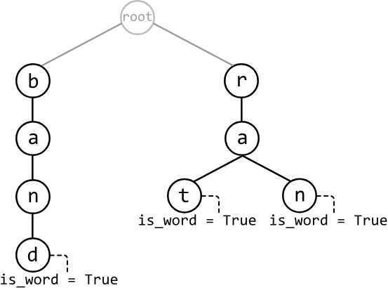

If we perform a search for "ra.", we know we can traverse down nodes 'r' and 'a' until we reach the wildcard character. Since the last letter is a wildcard, it could represent any letter. So, as long as there exists a node branching out from 'a' that represents the end of a word (i.e., has `is_word == True`), the word "ra." exists in the trie. In this case, both nodes 't' and 'n' meet the requirements of this wildcard:

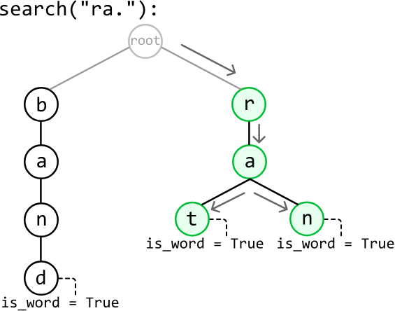

Now, let's say we perform a search for ".an". Since the first character is a wildcard, we need to cover all branches starting from every node representing the first character in the trie. This means starting a search from each child node of the root. We can do this by recursively calling the search function on these nodes, passing in the substring "an" because this substring contains the remaining characters to be searched for.

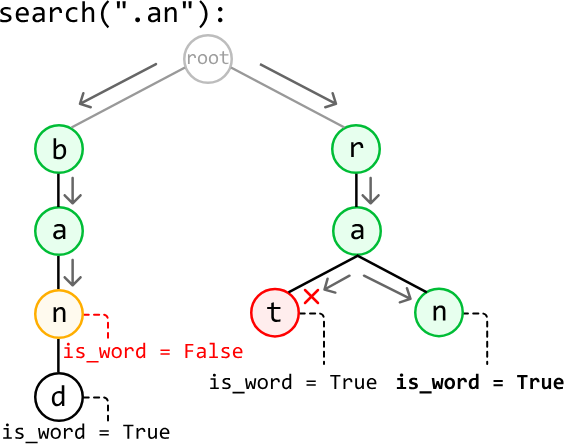

Notice the nodes forming the string "ban" will not satisfy the search term because node 'n' does not mark the end of a word.

So, at any point in the search, we need to handle two scenarios:

- When we encounter a letter, we proceed to the child of the current node that corresponds with this letter in the trie.

- When we encounter a wildcard, we explore all child nodes, as the '.' may match any character. We can perform a recursive call for each child node to search for the remainder of the word.

This strategy for handling wildcards allows us to search every possible branch for a word that matches the search term. As soon as we find one branch that represents a word matching the search term, we return true.

## Try it yourself

Write your solution to the problem before checking the reference implementation.

## Implementation

In this implementation, we use a helper function (`search_helper`) for searching because we need to pass in two extra parameters at each recursive call:

- An index that defines the start of the remaining substring that needs to be searched. We pass in an index instead because passing in the substring itself would necessitate creating that substring, which would take linear time for each recursive call.

- The TrieNode we're starting the search from. This ensures we don't restart each recursive call from the root node.

### Python
```python
class InsertAndSearchWordsWithWildcards:
   def __init__(self):
       self.root = TrieNode()
    
   def insert(self, word: str) -> None:
       node = self.root
       for c in word:
           if c not in node.children:
               node.children[c] = TrieNode()
           node = node.children[c]
       node.is_word = True
    
   def search(self, word: str) -> bool:
       # Start searching from the root of the trie.
       return self.search_helper(0, word, self.root)
    
   def search_helper(self, word_index: int, word: str, node: TrieNode) -> bool:
       for i in range(word_index, len(word)):
           c = word[i]
           # If a wildcard character is encountered, recursively search for the rest
           # of the word from each child node.
           if c == '.':
               for child in node.children.values():
                   # If a match is found, return true.
                   if self.search_helper(i + 1, word, child):
                       return True
               return False
           elif c in node.children:
               node = node.children[c]
           else:
               return False
       # After processing the last character, return true if we've reached the end
       # of a word.
       return node.is_word
```
### JavaScript
```javascript
export class InsertAndSearchWordsWithWildcards {
  constructor() {
    this.root = new TrieNode()
  }

  insert(word) {
    let node = this.root
    for (const c of word) {
      if (!(c in node.children)) {
        node.children[c] = new TrieNode()
      }
      node = node.children[c]
    }
    node.isWord = true
  }

  search(word) {
    // Start searching from the root of the trie.
    return this._searchHelper(0, word, this.root)
  }

  _searchHelper(wordIndex, word, node) {
    for (let i = wordIndex; i < word.length; i++) {
      const c = word[i]
      // If a wildcard character is encountered, recursively search for the rest
      // of the word from each child node.
      if (c === '.') {
        for (const child of Object.values(node.children)) {
          // If a match is found, return true.
          if (this._searchHelper(i + 1, word, child)) {
            return true
          }
        }
        return false
      } else if (c in node.children) {
        node = node.children[c]
      } else {
        return false
      }
    }
    // After processing the last character, return true if we've reached the end
    // of a word.
    return node.isWord
  }
}
```
### Java
```java
import java.util.HashMap;

class Trie {
    private TrieNode root;

    public Trie() {
        this.root = new TrieNode();
    }

    public void insert(String word) {
        TrieNode node = root;
        for (char c : word.toCharArray()) {
            if (!node.children.containsKey(c)) {
                node.children.put(c, new TrieNode());
            }
            node = node.children.get(c);
        }
        node.isWord = true;
    }

    public boolean search(String word) {
        // Start searching from the root of the trie.
        return searchHelper(0, word, root);
    }

    private boolean searchHelper(int wordIndex, String word, TrieNode node) {
        for (int i = wordIndex; i < word.length(); i++) {
            char c = word.charAt(i);
            // If a wildcard character is encountered, recursively search for the rest
            // of the word from each child node.
            if (c == '.') {
                for (TrieNode child : node.children.values()) {
                    // If a match is found, return true.
                    if (searchHelper(i + 1, word, child)) {
                        return true;
                    }
                }
                return false;
            } else if (node.children.containsKey(c)) {
                node = node.children.get(c);
            } else {
                return false;
            }
        }
        // After processing the last character, return true if we've reached the end
        // of a word.
        return node.isWord;
    }
}
```
## Complexity Analysis

**Time complexity:**

- The time complexity of `insert` is O(k), where k denotes the length of the word being inserted. This is because we traverse through or insert up to k nodes into the trie in each iteration.
- The time complexity of `search` is:
  - O(k) when word contains no wildcards because we search through at most k characters in the trie.
  - O(26^k) in the worst case, when word contains only wildcards. For each wildcard, we potentially need to explore up to 26 different characters (one for each lowercase English letter). With k wildcards, approximately 26^k recursive calls are made.

**Space complexity:**

- The space complexity of `insert` is O(k) because in the worst case, the inserted word doesn't share a prefix with words already in the trie. In this case, k new nodes are created.
- The space complexity of `search` is:
  - O(1) when word contains no wildcards.
  - O(k) in the worst case when word contains only wildcards due to the space taken up by the recursive call stack, which can grow up to k in size.


---


# Find All Words on a Board

Given a 2D board of characters and an array of words, find all the words in the array that can be formed by tracing a path through adjacent cells in the board. Adjacent cells are those which horizontally or vertically neighbor each other. We can't use the same cell more than once for a single word.

**Example:**

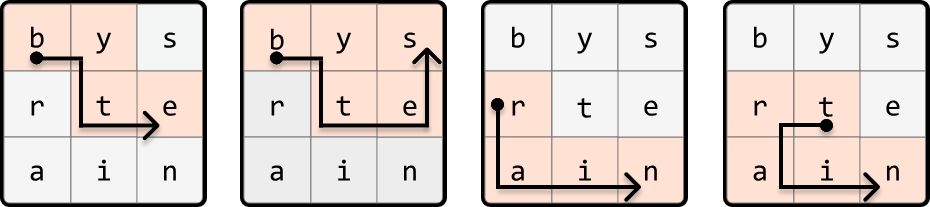

```
Input: board = [['b', 'y', 's'], ['r', 't', 'e'], ['a', 'i', 'n']],
       words = ['byte', 'bytes', 'rat', 'rain', 'trait', 'train']
Output: ['byte', 'bytes', 'rain', 'train']
```

## Intuition

There are many layers to this problem, so let's start by considering a simpler version where we're only required to search for one word on the board.

## Simplified problem: words array contains one word

With only one word to find, a straightforward approach is to iterate through each cell of the board. If any cell contains the first letter of the word, perform a DFS from that cell in all four directions (left, right, up, down) to find the rest of the word. This process involves backtracking from a cell when we cannot find the next letter of the word in any of its adjacent cells. The process continues until the word is found, or we can no longer find any more letters on the board.

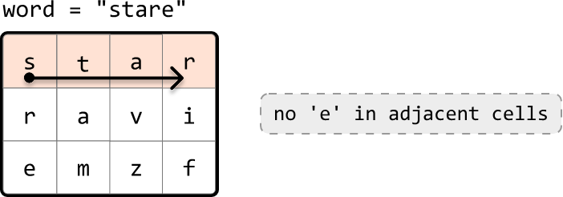

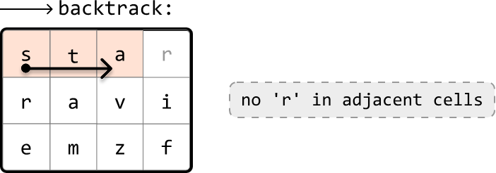

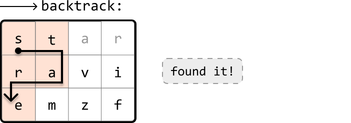

If you're not familiar with backtracking, it might be useful to review the Backtracking chapter before continuing with this problem.

## Original problem - words array contains multiple words

The above approach works well for one word, but repeating this process for every word in the array is quite expensive. Let's devise a way to make our search more efficient. Consider the following board:

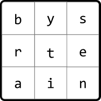

Let's say the words array contains the words "byte" and "bytes". Once we've found "byte", we'd ideally like to extend the search by just one more cell to also find the word "bytes":

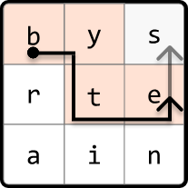

However, with our initial algorithm, we'd need to restart the search entirely to find "bytes." This is quite inefficient. What we want is a data structure that allows us to efficiently search words with shared prefixes, allowing us to find multiple words without restarting the search for each of them. This is where the trie data structure comes into play, as it is excellent for managing prefixes.

Let's begin creating the trie by inserting each word from the provided words array:

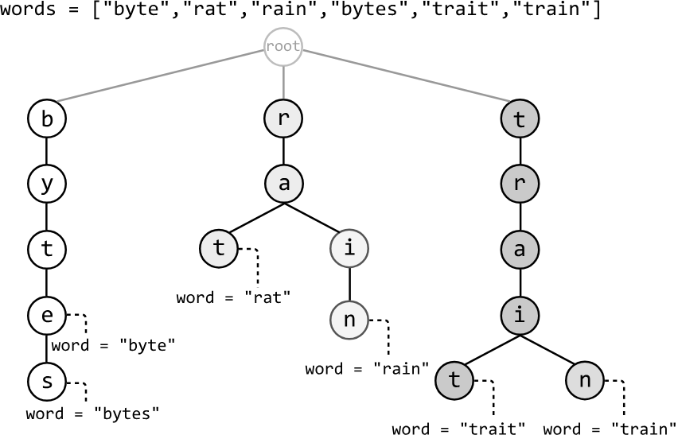

In this chapter's introduction, we discussed two options to mark the end of a word in a TrieNode. Here, we use the `word` attribute instead of `is_word` to determine if a TrieNode represents the end of a word, and to know which specific word has ended. This will be important later.

Let's now use this trie to search for words over the board. We do this by seeing if any paths in the trie correspond with any paths on the board:

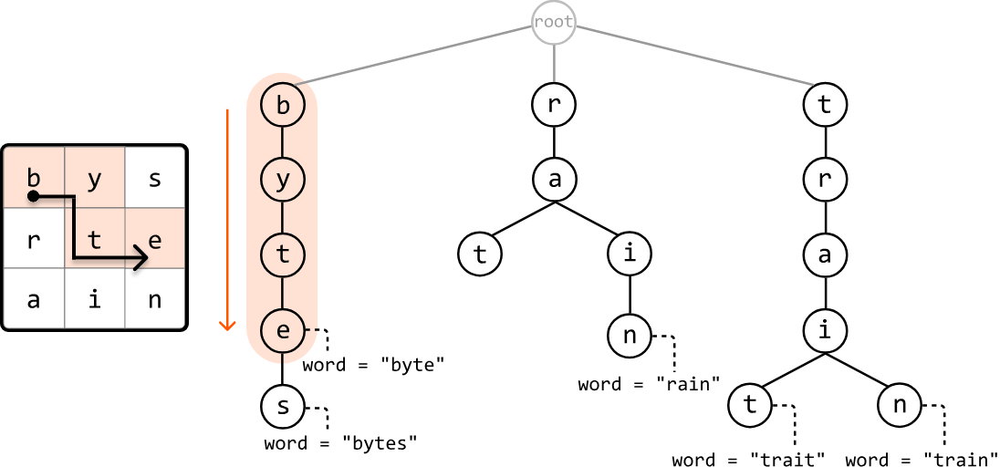

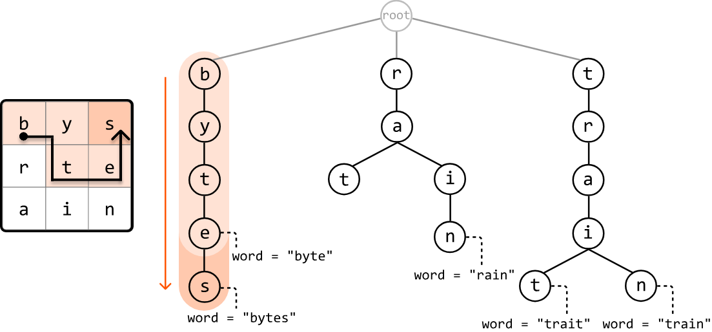

Similarly to how we used backtracking to search through the board when looking for a single word, we can also use backtracking here. Let's have a closer look at how this works.

## Backtracking using a trie

The first step is similar to what was discussed earlier: we go through the board until we find a cell whose character matches any of the root node's children in the trie, representing the first letter of a word.

As soon as we start going through the board, we notice that the top-left of the board, cell (0, 0), contains the character 'b', which is a child of the trie's root node.

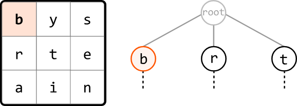

We can initiate DFS starting from this cell to see if the board contains the words formed by any of the paths branching from node 'b'.

Checking through the adjacent cells of cell 'b', we notice that one contains 'y', which corresponds to a child of node 'b'. So, let's make a DFS call to this cell to continue looking for the rest of this trie path on the board.

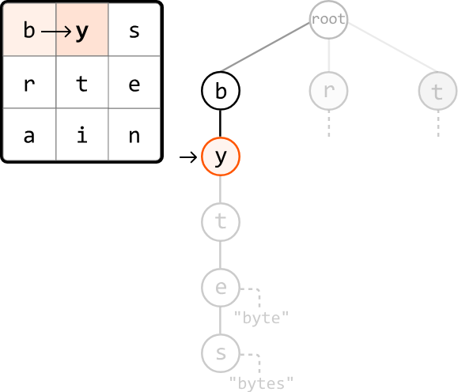

We continue this process until no more trie nodes can be found at an adjacent cell on the board. When this happens, we backtrack to the previous cell on the board to explore a different path.

If we ever reach a node that represents the end of the word (i.e., contains a non-null `word` attribute), we can record that word in our output:

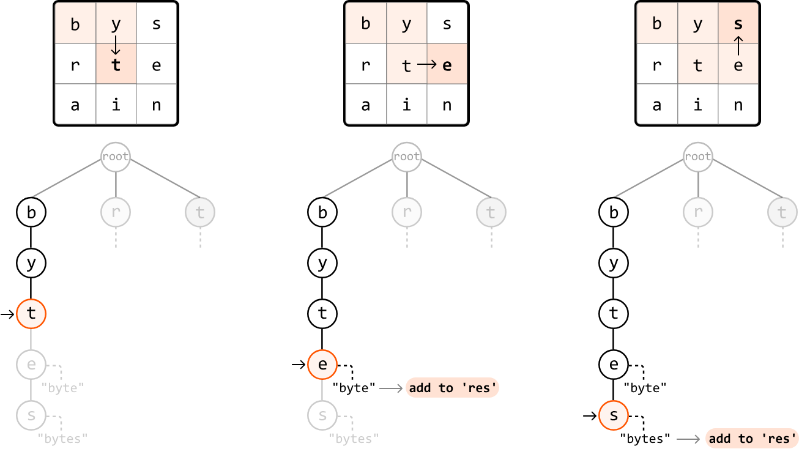

As shown, we found two words on the board from the DFS call that started at cell (0, 0). Now, we restart this process for any other cells on the board that match the character of one of the root node's children.

One important aspect of this backtracking approach is keeping track of visited cells as we explore the board. Without this, we might revisit a cell unintentionally. For example, when exploring both children of node 'i', we could end up revisiting cell 't':

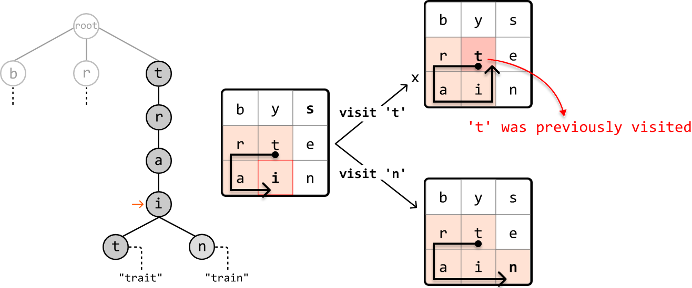

The remedy for this is to either keep track of visited cells using a hash set, or keep track of them in place by changing the visited cell to a special character (like '#') as we traverse:

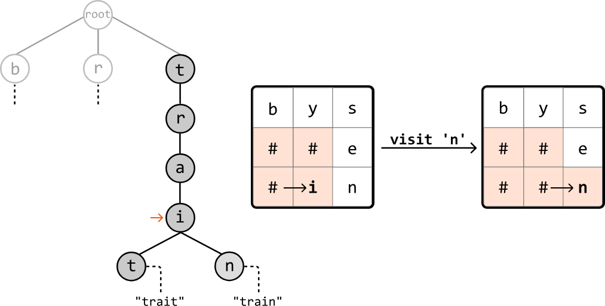

This shouldn't be a permanent change to the board. So, we should undo this change at the end of each recursive call, as demonstrated in the following code snippet:

### Python 
```python
def dfs(r, c, board, node):
    temp = board[r][c]
    board[r][c] = '#'  # Mark as visited.
    for next_r, next_c in adjacent_cells:
        if board[next_r][next_c] in node.children:
            dfs(next_r, next_c, board, node.children[board[next_r][next_c]])
    board[r][c] = temp  # Mark as unvisited.
```
### JavaScript
```javascript
function dfs(r, c, board, node, adjacentCells) {
  const temp = board[r][c]
  board[r][c] = '#' // Mark as visited.
  for (const [nextR, nextC] of adjacentCells) {
    if (
      board[nextR] &&
      board[nextR][nextC] &&
      node.children[board[nextR][nextC]]
    ) {
      dfs(
        nextR,
        nextC,
        board,
        node.children[board[nextR][nextC]],
        adjacentCells
      )
    }
  }
  board[r][c] = temp // Mark as unvisited.
}
```
### Java
```java
public void dfs(int r, int c, char[][] board, TrieNode node) {
    char temp = board[r][c];
    board[r][c] = '#'; // Mark as visited.
    for (int[] direction : adjacent_cells) {
        int nextR = r + direction[0];
        int nextC = c + direction[1];
        if (nextR >= 0 && nextR < board.length && nextC >= 0 && nextC < board[0].length
                && board[nextR][nextC] != '#' && node.children.containsKey(board[nextR][nextC])) {
            dfs(nextR, nextC, board, node.children.get(board[nextR][nextC]));
        }
    }
    board[r][c] = temp; // Mark as unvisited.
}
```
Now, let's walk through this process in detail.

For each cell on the board that matches a character of one of the root node's children, make a recursive DFS call to that cell, passing in the corresponding node. At each of these DFS calls:

1. Check if the current node represents the end of a word. If it does, add that word to the output.

2. Mark the current cell as visited by setting the cell to '#'.

3. Recursively explore all adjacent cells that correspond with a child of the current TrieNode.

4. Backtrack by reverting the cell back to its original character (i.e., marking it as unvisited).

## Handling multiple occurrences of the same word on the board

We need to be aware of the risk of adding duplicate words to the output, as the board may contain the same word in multiple locations. Remember that we use the `word` attribute on each TrieNode to check if it represents the end of a word. After recording a word in our output, we can set that node's `word` attribute to null, ensuring we cannot record the same word again.

## Try it yourself

Write your solution to the problem before checking the reference implementation.

## Implementation

### Python 
```python
class TrieNode:
    def __init__(self):
        self.children = {}
        self.word = None
```
### JavaScript
```javascript
class TrieNode {
  constructor() {
    this.children = {}
    this.word = null
  }
}
```
### Java
```java
class TrieNode {
    public HashMap<String, TrieNode> children;
    public boolean isWord;
    public String word;

    public TrieNode() {
        this.children = new HashMap<>();
        this.isWord = false;
        word = null;
    }
}
```
### Python 
```python
from typing import List
    
def find_all_words_on_a_board(board: List[List[str]], words: List[str]) -> List[str]:
    root = TrieNode()
    # Insert every word into the trie.
    for word in words:
        node = root
        for char in word:
            if char not in node.children:
                node.children[char] = TrieNode()
            node = node.children[char]
        node.word = word
    res = []
    # Start a DFS call from each cell of the board that contains a child of the root
    # node, which represents the first letter of a word in the trie.
    for r in range(len(board)):
        for c in range(len(board[0])):
            if board[r][c] in root.children:
                dfs(board, r, c, root.children[board[r][c]], res)
    return res
    
def dfs(board: List[List[str]], r: int, c: int, node: TrieNode, res: List[str]) -> None:
    # If the current node represents the end of a word, add the word to the result.
    if node.word:
        res.append(node.word)
        # Ensure the current word is only added once.
        node.word = None
    temp = board[r][c]
    # Mark the current cell as visited.
    board[r][c] = '#'
    # Explore all adjacent cells that correspond with a child of the current TrieNode.
    dirs = [(-1, 0), (1, 0), (0, -1), (0, 1)]
    for d in dirs:
        next_r, next_c = r + d[0], c + d[1]
        if is_within_bounds(next_r, next_c, board) and board[next_r][next_c] in node.children:
            dfs(board, next_r, next_c, node.children[board[next_r][next_c]], res)
    # Backtrack by reverting the cell back to its original character.
    board[r][c] = temp
    
def is_within_bounds(r: int, c: int, board: List[str]) -> bool:
    return 0 <= r < len(board) and 0 <= c < len(board[0])
```
### JavaScript
```javascript
export function find_all_words_on_a_board(board, words) {
  const root = new TrieNode()
  // Insert every word into the trie.
  for (const word of words) {
    let node = root
    for (const char of word) {
      if (!node.children[char]) {
        node.children[char] = new TrieNode()
      }
      node = node.children[char]
    }
    node.word = word
  }
  const res = []
  // Start a DFS call from each cell of the board that contains a child of the root
  // node, which represents the first letter of a word in the trie.
  for (let r = 0; r < board.length; r++) {
    for (let c = 0; c < board[0].length; c++) {
      const char = board[r][c]
      if (root.children[char]) {
        dfs(board, r, c, root.children[char], res)
      }
    }
  }
  return res
}

function dfs(board, r, c, node, res) {
  // If the current node represents the end of a word, add the word to the result.
  if (node.word !== null) {
    res.push(node.word)
    // Ensure the current word is only added once.
    node.word = null
  }
  const temp = board[r][c]
  // Mark the current cell as visited.
  board[r][c] = '#'
  const dirs = [
    [-1, 0],
    [1, 0],
    [0, -1],
    [0, 1],
  ]
  // Explore all adjacent cells that correspond with a child of the current TrieNode.
  for (const [dr, dc] of dirs) {
    const nr = r + dr
    const nc = c + dc
    if (isWithinBounds(nr, nc, board) && node.children[board[nr][nc]]) {
      dfs(board, nr, nc, node.children[board[nr][nc]], res)
    }
  }
  // Backtrack by reverting the cell back to its original character.
  board[r][c] = temp // Backtrack
}

function isWithinBounds(r, c, board) {
  return r >= 0 && r < board.length && c >= 0 && c < board[0].length
}
```
### Java
```java
import java.util.ArrayList;
import java.util.HashMap;

public class Main {
    public static ArrayList<String> find_all_words_on_a_board(ArrayList<ArrayList<String>> board, ArrayList<String> words) {
        TrieNode root = new TrieNode();
        // Insert every word into the trie.
        for (String word : words) {
            TrieNode node = root;
            for (int i = 0; i < word.length(); i++) {
                String ch = String.valueOf(word.charAt(i));
                if (!node.children.containsKey(ch)) {
                    node.children.put(ch, new TrieNode());
                }
                node = node.children.get(ch);
            }
            node.word = word;
        }
        ArrayList<String> res = new ArrayList<>();
        int m = board.size();
        int n = board.get(0).size();
        // Start a DFS call from each cell of the board that contains a child of the root
        // node, which represents the first letter of a word in the trie.
        for (int r = 0; r < m; r++) {
            for (int c = 0; c < n; c++) {
                String start = board.get(r).get(c);
                if (root.children.containsKey(start)) {
                    dfs(board, r, c, root.children.get(start), res);
                }
            }
        }
        return res;
    }

    public static void dfs(ArrayList<ArrayList<String>> board, int r, int c, TrieNode node, ArrayList<String> res) {
        // If the current node represents the end of a word, add the word to the result.
        if (node.word != null) {
            res.add(node.word);
            // Ensure the current word is only added once.
            node.word = null;
        }
        String temp = board.get(r).get(c);
        // Mark the current cell as visited.
        board.get(r).set(c, "#");
        // Explore all adjacent cells that correspond with a child of the current TrieNode.
        int[][] dirs = { {-1, 0}, {1, 0}, {0, -1}, {0, 1} };
        for (int[] d : dirs) {
            int next_r = r + d[0];
            int next_c = c + d[1];
            if (isWithinBounds(next_r, next_c, board)) {
                String next = board.get(next_r).get(next_c);
                if (node.children.containsKey(next)) {
                    dfs(board, next_r, next_c, node.children.get(next), res);
                }
            }
        }
        // Backtrack by reverting the cell back to its original character.
        board.get(r).set(c, temp);
    }

    public static boolean isWithinBounds(int r, int c, ArrayList<ArrayList<String>> board) {
        return r >= 0 && r < board.size() && c >= 0 && c < board.get(0).size();
    }
}
```
## Complexity Analysis

**Time complexity:** The time complexity of `find_all_words_on_a_board` is O(L + m⋅n⋅3^L) where N denotes the number of words in the words array, L denotes the length of the longest word, and m⋅n denotes the size of the board. Here's why:

- To build the trie, we insert each word from the input array into it, with each word containing a maximum of L characters. This takes O(N⋅L) time.

- Then, in the main search process, we perform a DFS for each of the mn cells on the board. Each DFS call takes O(3^L) time because, at each point in the DFS, we make up to 3 recursive calls: one for each of the 3 adjacent cells (this excludes the cell we came from). This is repeated for, at most, the length of the longest word, L.

- Therefore, the overall time complexity is O(N⋅L) + m⋅n⋅O(3⋅L) = O(N⋅L + m⋅n⋅3^L).

**Space complexity:** The space complexity is O(N⋅L). Here's why:

- The trie has a space complexity of O(N⋅L). In the worst case, if all words have unique prefixes, we store every character of every word in the trie. Each `word` attribute stored at the end of a path in the trie takes O(L) space, and with N words. This contributes an additional O(N⋅L) space.

- The maximum depth of the recursive call stack is L.

- Therefore, the overall space complexity is O(N⋅L) + O(L) = O(N⋅L).