# 13. Graphs

1. [Introduction to Graphs](#introduction-to-graphs)
2. [Graph Deep Copy](#graph-deep-copy)
3. [Count Islands](#count-islands)
4. [Matrix Infection](#matrix-infection)
5. [Bipartite Graph Validation](#bipartite-graph-validation)
6. [Longest Increasing Path](#longest-increasing-path)
7. [Shortest Transformation Sequence](#shortest-transformation-sequence)
8. [Merging Communities](#merging-communities)
9. [Prerequisites](#prerequisites)
10. [Shortest Path](#shortest-path)
11. [Connect the Dots](#connect-the-dots)

---

# Introduction to Graphs

## Intuition

A graph is a data structure composed of nodes (vertices) connected by edges. Graphs are used to model relationships, where the edges define the relationships.

Below is the implementation of the GraphNode class:

### Python 
```python
class GraphNode:
    def __init__(self, val):
        self.val = val
        self.neighbors = []
```
### JavaScript
```javascript
class GraphNode {
  constructor(val) {
    this.val = val
    this.neighbors = []
  }
}
```
### Java
```java
class GraphNode<T> {
    public T val;
    public List<GraphNode> neighbors;

    public GraphNode(int val) {
        this.val = val;
        this.neighbors = new ArrayList<GraphNode>();
    }
}
```
**Terminology:**

- **Adjacent node/neighbor:** two nodes are adjacent if there's an edge connecting them.
- **Degree:** the number of edges connected to a node.
- **Path:** a sequence of nodes connected by edges.

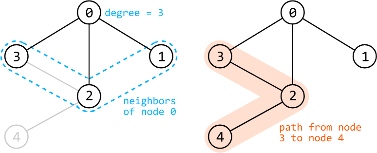


**Attributes:**

- **Directed vs. undirected:** in a directed graph, edges have a direction associated with them.

- **Weighted vs. unweighted:** in a weighted graph, edges have a weight associated with them, such as distance or cost.

- **Cyclic vs. acyclic:** A cyclic graph contains at least one cycle, which is a path that starts and ends at the same node.

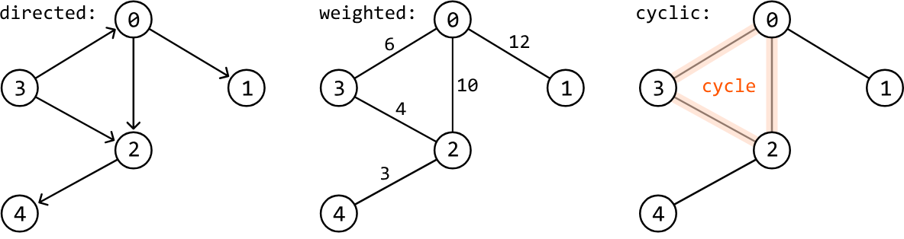

## Representations

In some problems, you might not be given the graph directly. In these situations, it's usually necessary to create your own representation of the graph. The two most common representations to choose from are an adjacency list and an adjacency matrix.

In an adjacency list, the neighbors of each node are stored as a list. Adjacency lists can be implemented using a hash map, where the key represents the node, and its corresponding value represents the list of that node's neighbors.

In an adjacency matrix, the graph is represented as a 2D matrix where `matrix[i][j]` indicates an edge between nodes i and j.

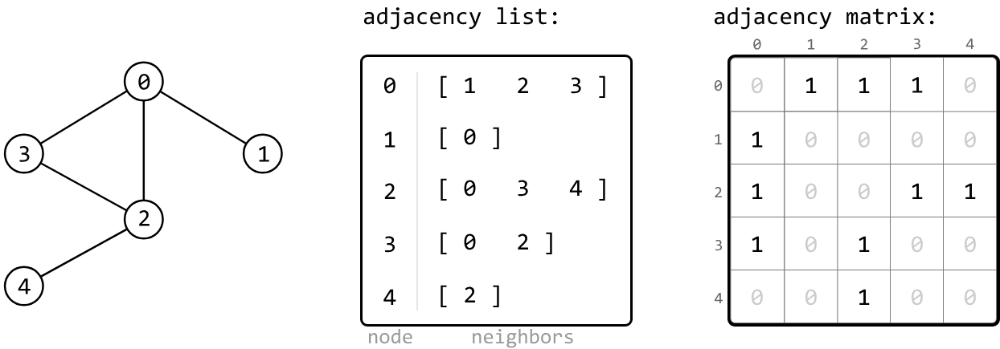

Adjacency lists are the most common choice for most implementations. They are preferred when representing sparse graphs and when we need to iterate over all the neighbors of a node efficiently.

Adjacency matrices are preferred when representing dense graphs, and frequent checks are needed for the existence of specific edges.

## Traversals

The primary graph traversal techniques are DFS and BFS, both of which have similar use cases when they're used on trees.

When traversing a graph, it might also be necessary to keep track of visited nodes using a data structure such as a hash set, to ensure each node is only visited once.

DFS is typically implemented recursively, as demonstrated in the code snippet below:

### Python
```python
def dfs(node: GraphNode, visited: Set[GraphNode]):
    visited.add(node)
    process(node)
    for neighbor in node.neighbors:
        if neighbor not in visited:
            dfs(neighbor, visited)
```
### JavaScript
```javascript
function dfs(node, visited = new Set()) {
  visited.add(node)
  process(node)
  for (const neighbor of node.neighbors) {
    if (!visited.has(neighbor)) {
      dfs(neighbor, visited)
    }
  }
}
```
### Java
```java
public void dfs(GraphNode node, Set<GraphNode> visited) {
    visited.add(node);
    process(node);
    for (GraphNode neighbor : node.neighbors) {
        if (!visited.contains(neighbor)) {
            dfs(neighbor, visited);
        }
    }
}
```
BFS is typically implemented iteratively, as demonstrated in the code snippet below:

### Python
```python
def bfs(node: GraphNode):
    visited = set()
    queue = deque([node])
    while queue:
        node = queue.popleft()
        if node not in visited:
            visited.add(node)
            process(node)
            for neighbor in node.neighbors:
                queue.append(neighbor)
```
### JavaScript
```javascript
function bfs(node) {
  const visited = new Set()
  const queue = [node]
  while (queue.length > 0) {
    const current = queue.shift()
    if (!visited.has(current)) {
      visited.add(current)
      process(current)
      for (const neighbor of current.neighbors) {
        queue.push(neighbor)
      }
    }
  }
}
```
### Java
```java
public void bfs(GraphNode node) {
   Set<GraphNode> visited = new HashSet<>();
   Queue<GraphNode> queue = new LinkedList<>();
   queue.add(node);
   while (!queue.isEmpty()) {
       GraphNode current = queue.poll();
       if (!visited.contains(current)) {
           visited.add(current);
           process(current);
           for (GraphNode neighbor : current.neighbors) {
               queue.add(neighbor);
           }
       }
   }
}
```
Both DFS and BFS have a time complexity of O(n+e), where n denotes the number of nodes and e denotes the number of edges. This is because during traversal, each node is visited once, and each edge is explored once.

They both also share a space complexity of O(n). For DFS, this is due to the space taken up by the recursive call stack, and for BFS, it's due to the space taken up by the queue.

## Real-world Example

**Social networks:** Users of social media sites like LinkedIn are typically represented as nodes, and connections or friendships between users are represented as edges. The graph structure allows platforms to analyze relationships, suggest new connections, and identify groups or communities within their networks.

## Chapter Outline

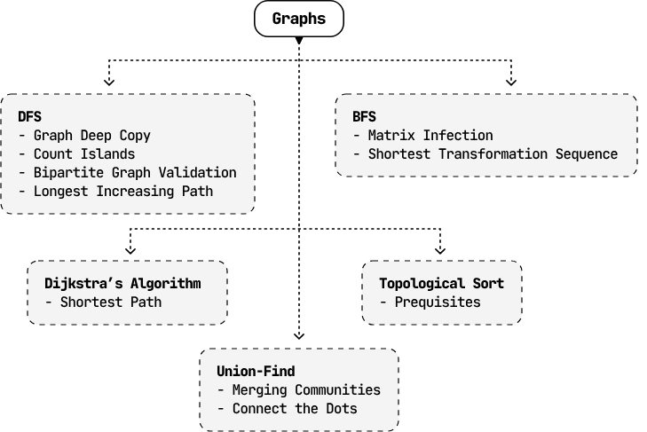


---


# Graph Deep Copy

Given a reference to a node within an undirected graph, create a deep copy (clone) of the graph. The copied graph must be completely independent of the original one. This means you need to make new nodes for the copied graph instead of reusing any nodes from the original graph.

**Example:**

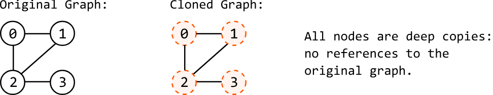

**Constraints:**

- The value of each node is unique.
- Every node in the graph is reachable from the given node.

## Intuition

Our strategy for this problem is to traverse the original graph and create the deep copy during the traversal, effectively cloning each node while we traverse. Any traversal method will suffice for this strategy. In this explanation, we'll use DFS.

## Traversing the graph

Start by defining exactly what we want our DFS function to do. When we call DFS on the input node, we expect it to create a deep copy of that node and all its neighbors. Let's break down this process.

The first thing our function will do is create a copy of its input node:

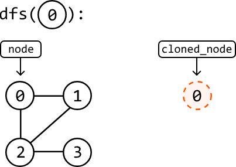

Next, we want to ensure this cloned node is connected to a clone of all its neighbors, mirroring the original node's neighbors. To achieve this, we'll call the DFS function on each of the original node's neighbors:

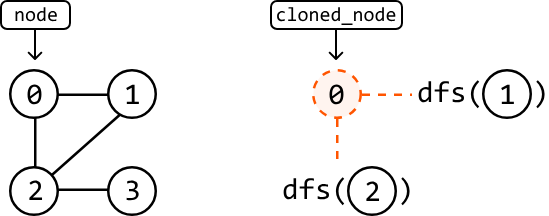

Each of these DFS instances will also do the same thing by creating a clone of their input node and returning it when it has been connected to its neighbors:

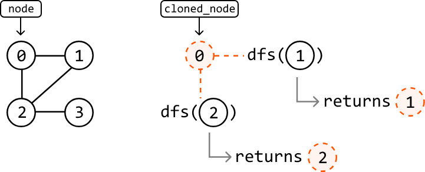

In pseudocode, this is what the process looks like:

```
dfs(node):
    cloned_node = new GraphNode(node)
    for neighbor in node.neighbors:
        cloned_neighbor = dfs(neighbor)
        cloned_node.neighbors.add(cloned_neighbor)
    return cloned_node
```

One more thing we should be mindful of is the possibility of cloning nodes that have already been cloned.

## Handling previously-cloned nodes

Consider node 2 in the following graph and cloned graphs. Its neighbors are nodes 0, 1, and 3. Let's say nodes 0 and 1 have already been cloned, but not node 3:

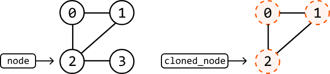

To link the cloned node 2 to its neighbors, we perform a DFS call to node 0, node 1, and node 3:

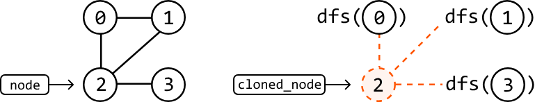

Since cloned copies of nodes 0 and 1 already exist, our DFS function should return these previously created nodes, instead of creating new ones:

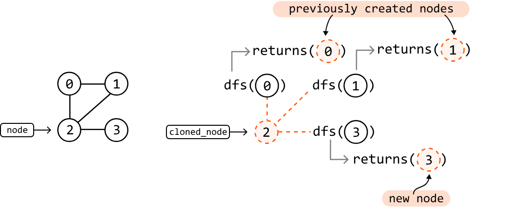

We can manage this by using a hash map where each original node is a key, and the corresponding cloned node is the value. This way, whenever we perform a DFS call on a node, we first check if it already has a clone in our hash map. If it does, we just return the existing clone. If it doesn't, we create a new clone and add it to the hash map.

## Try it yourself

Write your solution to the problem before checking the reference implementation.

## Implementation

### Python 
```python
from ds import GraphNode
    
def graph_deep_copy(node: GraphNode) -> GraphNode:
    if not node:
        return None
    return dfs(node)
    
def dfs(node: GraphNode, clone_map = {}) -> GraphNode:
    # If this node was already cloned, then return this previously cloned node.
    if node in clone_map:
        return clone_map[node]
    # Clone the current node.
    cloned_node = GraphNode(node.val)
    # Store the current clone to ensure it doesn't need to be created again in future
    # DFS calls.
    clone_map[node] = cloned_node
    # Iterate through the neighbors of the current node to connect their clones to the
    # current cloned node.
    for neighbor in node.neighbors:
        cloned_neighbor = dfs(neighbor, clone_map)
        cloned_node.neighbors.append(cloned_neighbor)
    return cloned_node
```
### JavaScript
```javascript
import { GraphNode } from './ds.js'

export function graphDeepCopy(node) {
  if (!node) return null
  return dfs(node, new Map())
}

function dfs(node, cloneMap) {
  // If this node was already cloned, then return this previously cloned node.
  if (cloneMap.has(node)) {
    return cloneMap.get(node)
  }
  // Clone the current node.
  const clonedNode = { val: node.val, neighbors: [] }
  // Store the current clone to ensure it doesn't need to be created again in future
  // DFS calls.
  cloneMap.set(node, clonedNode)
  // Iterate through the neighbors of the current node to connect their clones to the
  // current cloned node.
  for (const neighbor of node.neighbors) {
    const clonedNeighbor = dfs(neighbor, cloneMap)
    clonedNode.neighbors.push(clonedNeighbor)
  }
  return clonedNode
}
```
### Java
```java

import core.Graph.GraphNode;
import java.util.Map;
import java.util.HashMap;

class UserCode {
    public static GraphNode<Integer> graph_deep_copy(GraphNode<Integer> node) {
        if (node == null) {
            return null;
        }
        Map<GraphNode<Integer>, GraphNode<Integer>> visited = new HashMap<>();
        return dfs(node, visited);
    }

    private static GraphNode<Integer> dfs(GraphNode<Integer> node, Map<GraphNode<Integer>, GraphNode<Integer>> visited) {
        if (visited.containsKey(node)) {
            return visited.get(node);
        }
        GraphNode<Integer> clone = new GraphNode<>(node.val);
        visited.put(node, clone);
        for (GraphNode<Integer> neighbor : node.neighbors) {
            clone.neighbors.add(dfs(neighbor, visited));
        }
        return clone;
    }
}
```
## Complexity Analysis

**Time complexity:** The time complexity of `graph_deep_copy` is O(n+e), where n is the number of nodes and e is the number of edges of the graph. This is because we traverse through and create a clone of all n nodes of the original graph, and traverse across e edges during DFS.

**Space complexity:** The space complexity is O(n) due to the space taken up by the recursive call stack, which can grow as large as n. In addition, the `clone_map` hash map stores a key-value pair for each of the n nodes.


---


# Count Islands

Given a binary matrix representing 1s as land and 0s as water, return the number of islands.

An island is formed by connecting adjacent lands 4-directionally (up, down, left, and right).

**Example:**

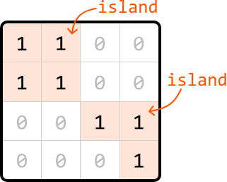

**Output: 2**

## Intuition

Before determining how to find all the islands in a matrix, let's consider an input that contains only one island.

### Matrix with just one island

Consider the following matrix containing one island:

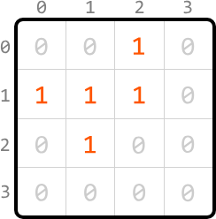

When we iterate through the matrix starting from the top left, the first land cell we encounter is cell (0, 2). From here, we'd like to find the rest of the island.

The key observation is that we should be able to access every land cell on the same island by moving horizontally or vertically through neighboring land cells. This means that all 1s forming an island are connected either directly or indirectly through adjacent 1s. Conceptually, this is similar to a graph, where each cell is a node, and each connection to an adjacent cell is an edge:

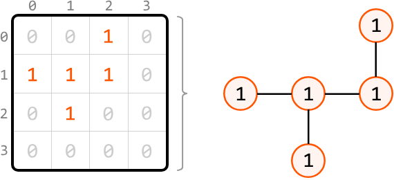

This demonstrates that we can identify the rest of the island by performing a graph traversal algorithm. Most traversal algorithms will suit this purpose. In this explanation, we'll use DFS.

### Depth-first search

For each cell we visit during the traversal, we need to mark that cell as visited to ensure it's not visited again. There are two ways to do this:

1. Use a separate data structure, such as a hash set, to keep track of the coordinates of visited cells.

2. Modify the matrix by changing the value of a visited cell from 1 to -1, ensuring it doesn't get revisited.

We'll proceed with the second option because it doesn't require the use of extra space.

Now, let's begin DFS traversal. Mark the first cell, (0, 2), as visited by modifying its value to -1. Then, continue exploring by calling DFS on any neighboring land cells. Here, the only neighboring land cell is cell (1, 2):

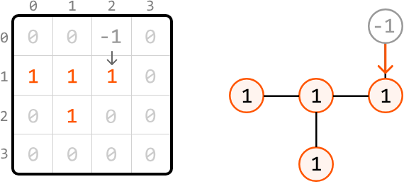

From cell (1, 2), we similarly mark it as visited and explore its neighboring land cells. Again, there's only one neighboring land cell: (1, 1). So, let's make a recursive DFS call to it:

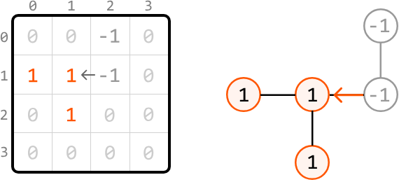

From cell (1, 1), mark it as visited and explore both of its neighboring land cells. Let's continue exploring from cell (1, 0) first:

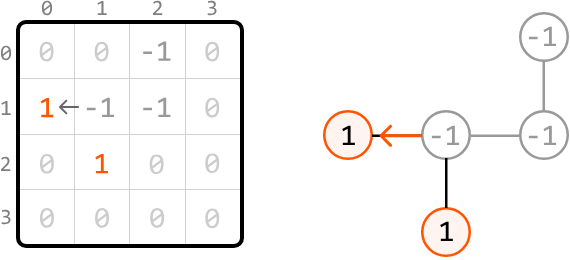

At (1, 0), there's no neighboring land. So, the recursive process naturally goes back to cell (1, 1) to continue exploring any other neighboring land cells:

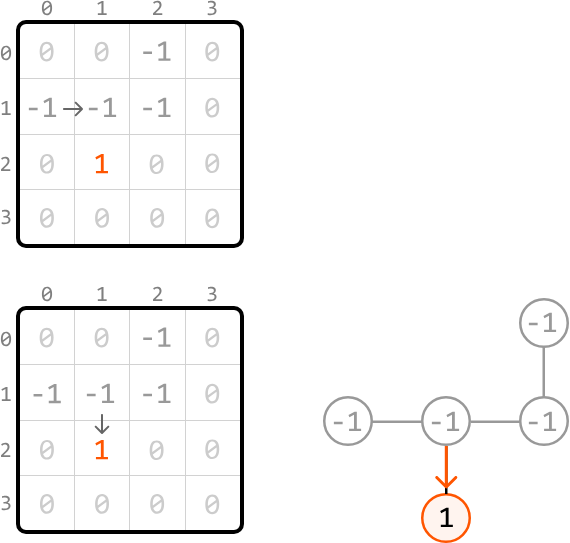

We've now finished exploring this island:

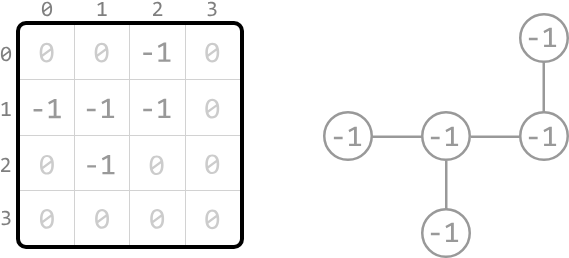

With this island completely explored, let's increment a variable `count` to indicate that one new island has been found. Now, let's consider the main problem where there could be multiple islands in the matrix.

### Matrix with multiple islands

We can identify all islands using the following steps:

1. Search through the matrix, starting from cell (0, 0), until we find a land cell.

2. Upon encountering a land cell, explore its island using DFS, marking each land cell we encounter as visited (-1) to avoid visiting them again.

3. Increment `count` by 1, indicating the discovery of the island we just explored.

4. Keep searching the matrix for any unvisited land cells. When we find one, repeat steps 2 to 4.

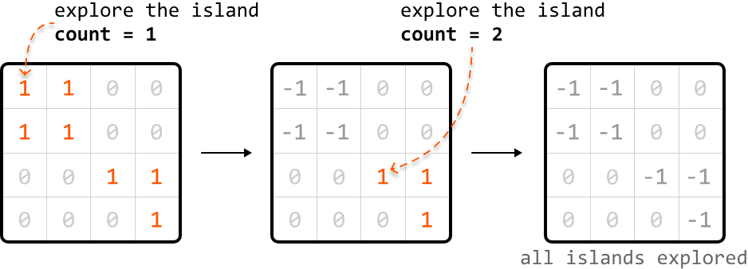

## Try it yourself

Write your solution to the problem before checking the reference implementation.

## Implementation

To traverse the matrix 4-directionally, we can use an array of direction vectors:

```
dirs = [(-1, 0), (1, 0), (0, -1), (0, 1)]
```

Each pair in the array represents the changes needed to move one step in a specific direction:

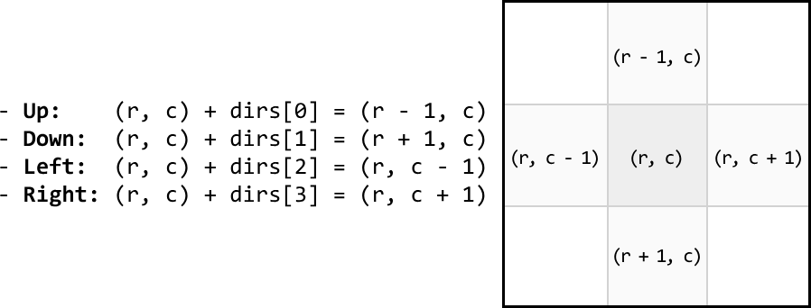

### Python
```python
from typing import List
    
def count_islands(matrix: List[List[int]]) -> int:
    if not matrix:
        return 0
    count = 0
    for r in range(len(matrix)):
        for c in range(len(matrix[0])):
            # If a land cell is found, perform DFS to explore the full island, and
            # include this island in our count.
            if matrix[r][c] == 1:
                dfs(r, c, matrix)
                count += 1
    return count
    
def dfs(r: int, c: int, matrix: List[List[int]]) -> None:
    # Mark the current land cell as visited.
    matrix[r][c] = -1
    # Define direction vectors for up, down, left, and right.
    dirs = [(-1, 0), (1, 0), (0, -1), (0, 1)]
    # Recursively call DFS on each neighboring land cell to continue exploring this
    # island.
    for d in dirs:
        next_r, next_c = r + d[0], c + d[1]
        if is_within_bounds(next_r, next_c, matrix) and matrix[next_r][next_c] == 1:
            dfs(next_r, next_c, matrix)
    
def is_within_bounds(r: int, c: int, matrix: List[List[int]]) -> bool:
    return 0 <= r < len(matrix) and 0 <= c < len(matrix[0])
```
### JavaScript
```javascript
export function count_islands(matrix) {
  if (!matrix || matrix.length === 0) return 0
  let count = 0
  for (let r = 0; r < matrix.length; r++) {
    for (let c = 0; c < matrix[0].length; c++) {
      // If a land cell is found, perform DFS to explore the island.
      if (matrix[r][c] === 1) {
        dfs(r, c, matrix)
        count++
      }
    }
  }
  return count
}

function dfs(r, c, matrix) {
  matrix[r][c] = -1 // Mark current cell as visited
  // Define direction vectors for up, down, left, and right.
  const dirs = [
    [-1, 0], // up
    [1, 0], // down
    [0, -1], // left
    [0, 1], // right
  ]
  // Recursively call DFS on each neighboring land cell to continue exploring this
  // island.
  for (const [dr, dc] of dirs) {
    const nextR = r + dr
    const nextC = c + dc
    if (isWithinBounds(nextR, nextC, matrix) && matrix[nextR][nextC] === 1) {
      dfs(nextR, nextC, matrix)
    }
  }
}

function isWithinBounds(r, c, matrix) {
  return r >= 0 && r < matrix.length && c >= 0 && c < matrix[0].length
}
```
### Java
```java
import java.util.ArrayList;

public class Main {
    public int count_islands(ArrayList<ArrayList<Integer>> matrix) {
        if (matrix == null || matrix.isEmpty()) return 0;
        int rows = matrix.size();
        int cols = matrix.get(0).size();
        int count = 0;
        for (int r = 0; r < rows; r++) {
            for (int c = 0; c < cols; c++) {
                // If a land cell is found, perform DFS to explore the full island,
                // and include this island in our count.
                if (matrix.get(r).get(c) == 1) {
                    dfs(r, c, matrix);
                    count++;
                }
            }
        }
        return count;
    }

    private void dfs(int r, int c, ArrayList<ArrayList<Integer>> matrix) {
        // Mark the current land cell as visited.
        matrix.get(r).set(c, -1);
        // Define direction vectors for up, down, left, and right.
        int[][] dirs = { {-1, 0}, {1, 0}, {0, -1}, {0, 1} };
        // Recursively call DFS on each neighboring land cell to continue exploring this island.
        for (int[] d : dirs) {
            int nextR = r + d[0];
            int nextC = c + d[1];
            if (isWithinBounds(nextR, nextC, matrix) && matrix.get(nextR).get(nextC) == 1) {
                dfs(nextR, nextC, matrix);
            }
        }
    }

    private boolean isWithinBounds(int r, int c, ArrayList<ArrayList<Integer>> matrix) {
        return r >= 0 && r < matrix.size() && c >= 0 && c < matrix.get(0).size();
    }
}
```
## Complexity Analysis

**Time complexity:** The time complexity of `count_islands` is O(m⋅n), where m denotes the number of rows and n denotes the number of columns. This is because each cell of the matrix is visited at most twice: once when searching for land cells in the `count_islands` function, and up to one more time during DFS.

**Space complexity:** The space complexity is O(m⋅n) mostly due to the recursive call stack during DFS, which can grow up to m⋅n in size.

## Interview Tip

> **Tip: Check with an interviewer if modifications to the input are acceptable.**
>
> During DFS, we marked cells as visited by modifying the input directly. However, in some situations, input modification may not be desirable. As such, it's worth confirming this with the interviewer before making in-place modifications to the input.


---


# Matrix Infection

You are given a matrix where each cell is either:

- 0: Empty
- 1: Uninfected
- 2: Infected

With each passing second, every infected cell (2) infects its uninfected neighboring cells (1) that are 4-directionally adjacent. Determine the number of seconds required for all uninfected cells to become infected. If this is impossible, return ‐1.

**Example:**

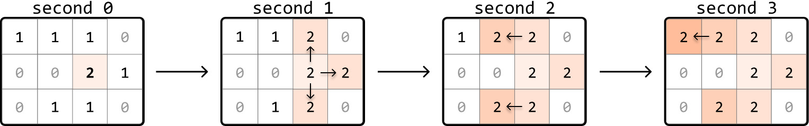

**Input:** `matrix = [[1, 1, 1, 0], [0, 0, 2, 1], [0, 1, 1, 0]]`

**Output:** 3

## Intuition

Let's begin tackling this problem by considering a simple case where the initial matrix contains only one infected cell.

### Matrix with one infected cell

Consider the following matrix, containing just one 2:

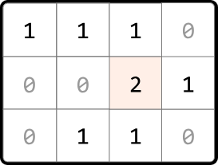

An observation is that each infected (2) and uninfected (1) cell can be considered as nodes in a graph, where edges exist between cells that are 4-directionally adjacent. Therefore, we can visualize these cells as a connected graph:

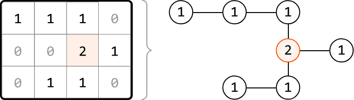

This helps us think about this problem as a graph traversal problem. Which traversal algorithm will allow us to simulate the infection process? To find out, let's observe how cells get infected each second.

After the first second, the adjacent uninfected neighbors of the first infected cell become infected. These cells are a distance of 1 away from the initially infected cell:

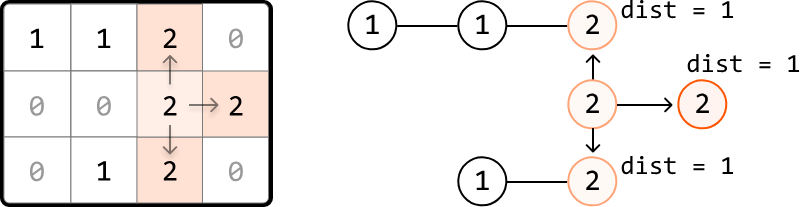

One second later, the neighbors of the most recently infected cells get infected. These cells are a distance of 2 from the initial infected cell:

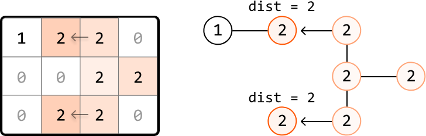

As we can see, the outward expansion from the initially infected cell is similar to how level-order traversal works in a tree, where each level represents nodes that are at a specific distance from the initially infected node.

So, let's perform a level-order traversal to infect cells, starting at the infected cell. Each level that gets traversed corresponds to 1-second passing in the infection process.

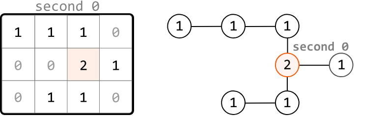

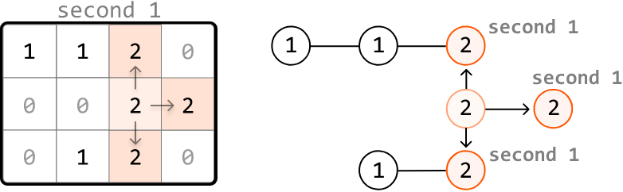

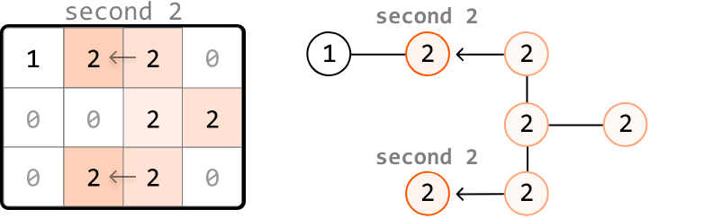

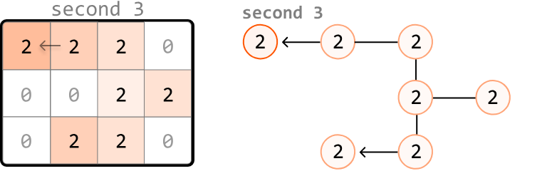

Regarding the implementation of this traversal, we know that level-order traversal is a modified version of BFS. So, we use a queue to implement this traversal. If you're unfamiliar with how this works, review the Rightmost Nodes of a Binary Tree problem from the Tree chapter, which implements a level-order traversal on a binary tree.

Now, let's consider how we would handle a matrix which initially contains multiple infected cells.

### Matrix with multiple infected cells

Consider the following example and its corresponding graph visualization:

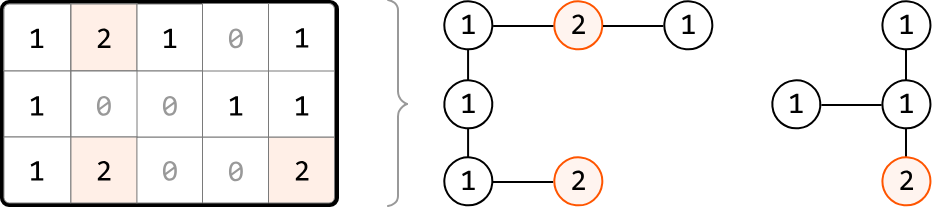

In this example, multiple cells are initially infected, meaning there are multiple cells at level 0 of the traversal.

To handle this, we use a pattern known as multi-source BFS. Instead of adding just one cell to the queue before performing level-order traversal, we add every initially infected cell to the queue. This way, the traversal starts with all initially infected cells as level 0, allowing the infection process to begin simultaneously from multiple starting points:

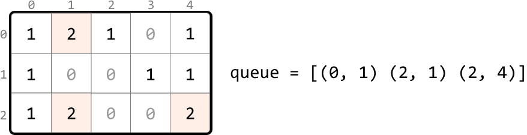

When we start with multiple cells in the queue, we can see what the level order process looks like:

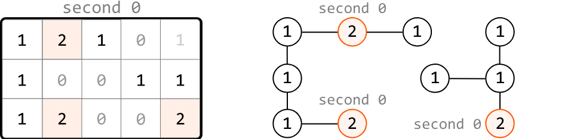

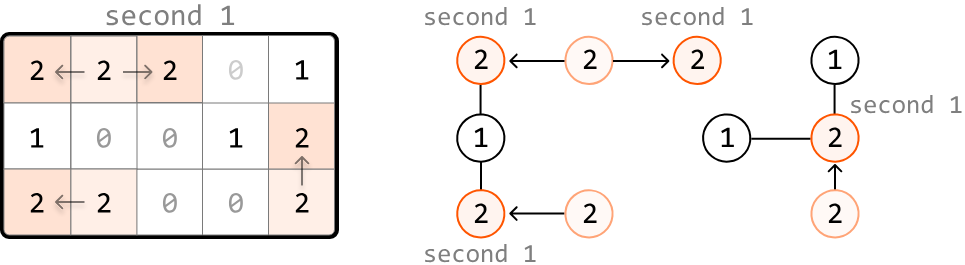

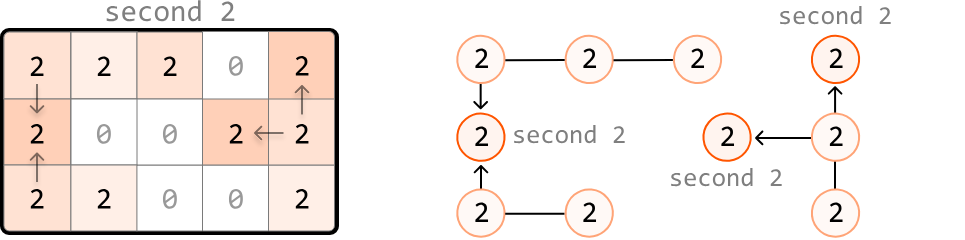

### Unreachable uninfected cells

It's important to keep in mind that it's not always possible to infect all uninfected cells. We could encounter situations where it's impossible to reach an uninfected cell, such as in the following example:

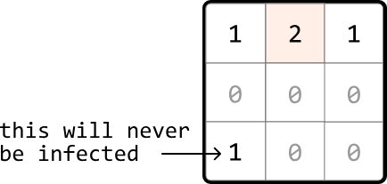

One way to account for this is to search through the matrix after level-order traversal and check if any 1s remain. However, there's a cleaner way to accomplish this. First, in the loop where we search for all the level 0 infected cells, we can also count how many 1s there are:

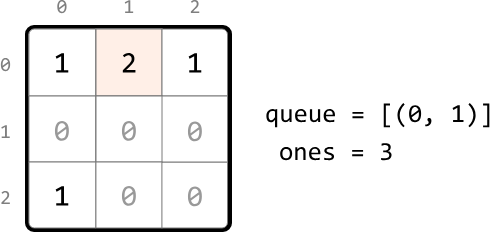

Then, as we perform the level-order traversal, we can decrement this count for each uninfected cell we infect. This way, the value of this count after the traversal will represent the number of cells that remained uninfected. We return -1 if this count is greater than 0:

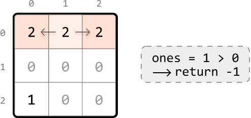

## Try it yourself

Write your solution to the problem before checking the reference implementation.

## Implementation

### Python
```python
from typing import List
from collections import deque
    
def matrix_infection(matrix: List[List[int]]) -> int:
   dirs = [(-1, 0), (1, 0), (0, -1), (0, 1)]
   queue = deque()
   ones = seconds = 0
   # Count the total number of uninfected cells and add each infected cell to the
   # queue to represent level 0 of the level-order traversal.
   for r in range(len(matrix)):
       for c in range(len(matrix[0])):
           if matrix[r][c] == 1:
               ones += 1
           elif matrix[r][c] == 2:
               queue.append((r, c))
   # Use level-order traversal to determine how long it takes to infect the
   # uninfected cells.
   while queue and ones > 0:
       # 1 second passes with each level of the matrix that's explored.
       seconds += 1
       for _ in range(len(queue)):
           r, c = queue.popleft()
           # Infect any neighboring 1s and add them to the queue to be processed in
           # the next level.
           for d in dirs:
               next_r, next_c = r + d[0], c + d[1]
               if is_within_bounds(next_r, next_c, matrix) and matrix[next_r][next_c] == 1:
                   matrix[next_r][next_c] = 2
                   ones -= 1
                   queue.append((next_r, next_c))
   # If there are still uninfected cells left, return -1. Otherwise, return the time
   # passed.
   return seconds if ones == 0 else -1
    
def is_within_bounds(r: int, c: int, matrix: List[List[int]]) -> bool:
    return 0 <= r < len(matrix) and 0 <= c < len(matrix[0])
```
### JavaScript
```javascript
export function matrix_infection(matrix) {
  const dirs = [
    [-1, 0], // up
    [1, 0], // down
    [0, -1], // left
    [0, 1], // right
  ]
  const queue = []
  let ones = 0
  let seconds = 0
  // Count the total number of uninfected cells and add each infected cell to the
  // queue to represent level 0 of the level-order traversal.
  for (let r = 0; r < matrix.length; r++) {
    for (let c = 0; c < matrix[0].length; c++) {
      if (matrix[r][c] === 1) {
        ones++
      } else if (matrix[r][c] === 2) {
        queue.push([r, c])
      }
    }
  }
  // Use level-order traversal to determine how long it takes to infect the
  // uninfected cells.
  while (queue.length > 0 && ones > 0) {
    // 1 second passes with each level of the matrix that's explored.
    seconds++
    const levelSize = queue.length
    for (let i = 0; i < levelSize; i++) {
      const [r, c] = queue.shift()
      // Infect any neighboring 1s and add them to the queue to be processed in
      // the next level.
      for (const [dr, dc] of dirs) {
        const nextR = r + dr
        const nextC = c + dc
        if (
          isWithinBounds(nextR, nextC, matrix) &&
          matrix[nextR][nextC] === 1
        ) {
          matrix[nextR][nextC] = 2
          ones--
          queue.push([nextR, nextC])
        }
      }
    }
  }
  // If there are still uninfected cells left, return -1. Otherwise, return the time
  // passed.
  return ones === 0 ? seconds : -1
}

function isWithinBounds(r, c, matrix) {
  return r >= 0 && r < matrix.length && c >= 0 && c < matrix[0].length
}
```
### Java
```java
import java.util.ArrayList;
import java.util.LinkedList;
import java.util.Queue;

public class Main {
    public static int matrix_infection(ArrayList<ArrayList<Integer>> matrix) {
        int rows = matrix.size();
        if (rows == 0) return 0;
        int cols = matrix.get(0).size();
        int[][] dirs = { {-1, 0}, {1, 0}, {0, -1}, {0, 1} };
        Queue<int[]> queue = new LinkedList<>();
        int ones = 0, seconds = 0;
        // Count uninfected cells and enqueue infected cells
        for (int r = 0; r < rows; r++) {
            for (int c = 0; c < cols; c++) {
                int cell = matrix.get(r).get(c);
                if (cell == 1) {
                    ones++;
                } else if (cell == 2) {
                    queue.offer(new int[] {r, c});
                }
            }
        }
        // Multi-source BFS
        while (!queue.isEmpty() && ones > 0) {
            seconds++;
            int size = queue.size();
            for (int i = 0; i < size; i++) {
                int[] current = queue.poll();
                int r = current[0];
                int c = current[1];
                for (int[] dir : dirs) {
                    int nextR = r + dir[0];
                    int nextC = c + dir[1];
                    if (isWithinBounds(nextR, nextC, rows, cols) && matrix.get(nextR).get(nextC) == 1) {
                        matrix.get(nextR).set(nextC, 2);
                        ones--;
                        queue.offer(new int[] {nextR, nextC});
                    }
                }
            }
        }
        return ones == 0 ? seconds : -1;
    }

    private static boolean isWithinBounds(int r, int c, int rows, int cols) {
        return r >= 0 && r < rows && c >= 0 && c < cols;
    }
}
```
## Complexity Analysis

**Time complexity:** The time complexity of `matrix_infection` is O(m⋅n), where m denotes the number of rows, and n denotes the number of columns. This is because in the worst case, every cell in the matrix is explored during level-order traversal.

**Space complexity:** The space complexity is O(m⋅n), primarily due to the queue, which can store up to m⋅n cells.


---


# Bipartite Graph Validation

Given an undirected graph, determine if it's bipartite. A graph is bipartite if the nodes can be colored in one of two colors, so that no two adjacent nodes are the same color.

The input is presented as an adjacency list, where graph[i] is a list of all nodes adjacent to node i.

**Example:**

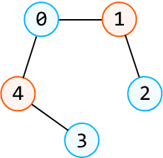

**Input:** `graph = [[1, 4], [0, 2], [1], [4], [0, 3]]`

**Output:** True

## Intuition

Before diving into a solution, let's first understand what makes a graph bipartite. If the nodes of a graph can be divided into two distinct sets, with the edges only running between nodes from different sets, then the graph is bipartite. We can visually rearrange the nodes of the following graph to demonstrate this:

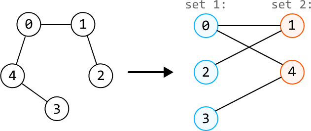

With a graph that isn't bipartite, it's impossible to arrange the nodes this way without an edge existing between two nodes of the same set:

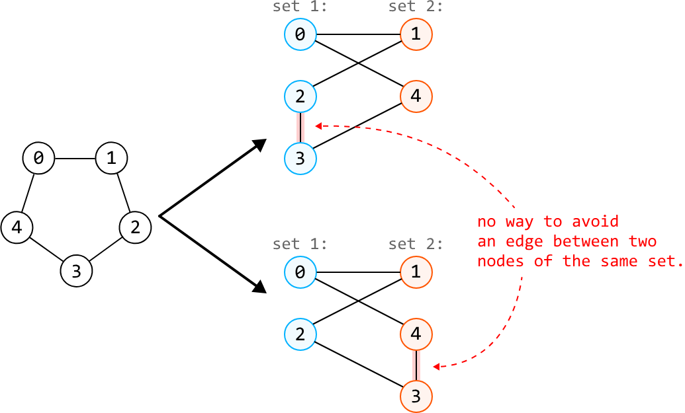

To determine if a graph is bipartite, we can use graph coloring, where we attempt to color one set of nodes with one color, and the other set of nodes with another color, while ensuring no adjacent nodes share the same color. Let's explore this idea.

### Graph coloring

Let's use blue and orange in our coloring process. One potential strategy is: for each node we color blue, color all of its neighbors orange, and vice versa. Most traversal algorithms allow us to color neighboring nodes in this way. In this explanation, we use DFS.

Let's try applying this coloring process to the example below and see how it works:

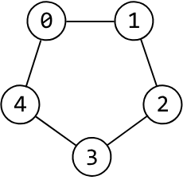

Start by coloring node 0 blue:

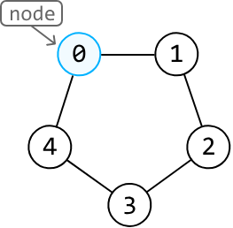

Using DFS, we explore the neighbors of node 0, starting with node 1. All of its neighbors need to be colored orange, so let's make a DFS call to node 1 to color it orange:

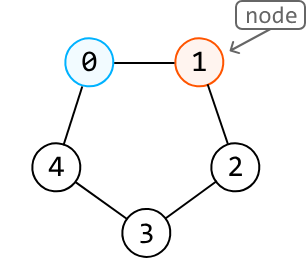

Let's continue doing this for the next few nodes in the DFS process:

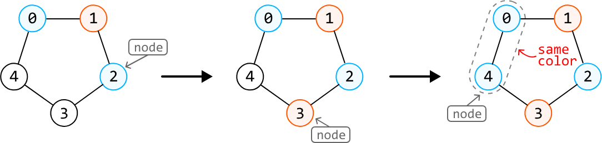

Above, we encountered an issue. We needed to color node 4 blue, but one of node 4's neighbors, node 0, is also colored blue. This means the graph cannot be colored using our graph coloring strategy. In other words, the graph is not bipartite.

We now have a strategy to confirm if a graph is bipartite using the two-coloring technique. But how can we be sure that it always works? We've been coloring adjacent nodes in alternating colors from the beginning of the DFS. This means if we encounter a situation where two adjacent nodes are the same color, it means there's no way to color the graph differently, since we've been following the rule of using different colors for neighboring nodes all along.

### Handling multiple components

Keep in mind the input isn't necessarily a graph that's fully connected. It could be a graph with multiple components, such as this:

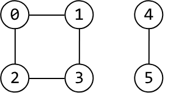

As such, we need to ensure we color all components of the graph by calling DFS on every uncolored node:

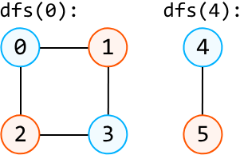

If we can confirm that all components can be colored using two colors, the graph is bipartite. However, if any of these components cannot be colored this way, the graph is not bipartite.

## Try it yourself

Write your solution to the problem before checking the reference implementation.

## Implementation

In this implementation, we color the nodes blue and orange using the numbers 1 and -1 to represent these colors, respectively. To keep track of each node's color, we use an array called `colors`, initialized with all 0s, where 0 represents an unvisited node. As we explore the graph using DFS, we update the `colors` array by setting each node to either 1 (blue) or -1 (orange).

### Python
```python
def bipartite_graph_validation(graph: List[List[int]]) -> bool:
    colors = [0] * len(graph)
    # Determine if each graph component is bipartite.
    for i in range(len(graph)):
        if colors[i] == 0 and not dfs(i, 1, graph, colors):
           return False
    return True
    
def dfs(node: int, color: int, graph: List[List[int]], colors: List[int]) -> bool:
    colors[node] = color
    for neighbor in graph[node]:
        # If the current neighbor has the same color as the current node, the graph is
        # not bipartite.
        if colors[neighbor] == color:
            return False
        # If the current neighbor is not colored, color it with the other color and
        # continue the DFS.
        if colors[neighbor] == 0 and not dfs(neighbor, -color, graph, colors):
            return False
    return True
```
### JavaScript
```javascript
export function bipartite_graph_validation(graph) {
  const colors = new Array(graph.length).fill(0)
  // Determine if each component is bipartite
  for (let i = 0; i < graph.length; i++) {
    if (colors[i] === 0 && !dfs(i, 1, graph, colors)) {
      return false
    }
  }
  return true
}

function dfs(node, color, graph, colors) {
  colors[node] = color
  for (const neighbor of graph[node]) {
    // If the current neighbor has the same color as the current node, the graph is
    // not bipartite.
    if (colors[neighbor] === color) {
      return false
    }
    // If the current neighbor is not colored, color it with the other color and
    // continue the DFS.
    if (colors[neighbor] === 0 && !dfs(neighbor, -color, graph, colors)) {
      return false
    }
  }
  return true
}
```
### Java
```java
import java.util.ArrayList;

public class Main {
    public boolean bipartite_graph_validation(ArrayList<ArrayList<Integer>> graph) {
        int[] colors = new int[graph.size()];
        // Determine if each graph component is bipartite.
        for (int i = 0; i < graph.size(); i++) {
            if (colors[i] == 0 && !dfs(i, 1, graph, colors)) {
                return false;
            }
        }
        return true;
    }

    private boolean dfs(int node, int color, ArrayList<ArrayList<Integer>> graph, int[] colors) {
        colors[node] = color;
        for (int neighbor : graph.get(node)) {
            // If the current neighbor has the same color as the current node, the graph is
            // not bipartite.
            if (colors[neighbor] == color) {
                return false;
            }
            // If the current neighbor is not colored, color it with the other color and
            // continue the DFS.
            if (colors[neighbor] == 0 && !dfs(neighbor, -color, graph, colors)) {
                return false;
            }
        }
        return true;
    }
}
```
## Complexity Analysis

**Time complexity:** The time complexity of `bipartite_graph_validation` is O(n+e) where n denotes the number of nodes and e denotes the number of edges. This is because we explore all nodes in the graph and traverse across e edges during DFS.

**Space complexity:** The space complexity is O(n) due to the space taken up by the recursive call stack, which can grow as large as n. In addition, the `colors` array also contributes O(n) space.


---


# Longest Increasing Path

Find the longest strictly increasing path in a matrix of positive integers. A path is a sequence of cells where each one is 4-directionally adjacent (up, down, left, or right) to the previous one.

**Example:**

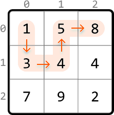

**Output:** 5

## Intuition

In this problem, we're tasked with finding the longest strictly increasing path. Note, "strictly" means the path cannot include any two cells of equal value.

From any cell, we can move to a neighboring cell if that neighbor has a larger value than the current cell. We can map this relationship between cells as nodes in a graph, with edges representing moves from one cell to a higher-value neighboring cell:

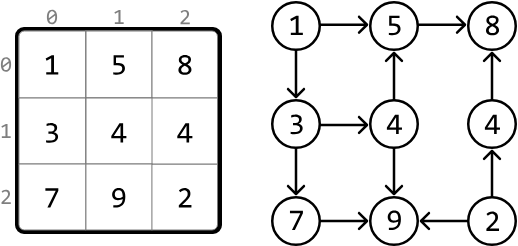

Upon closer inspection, we notice this is a directed acyclic graph (DAG). Let's break down what this means:

- The graph is directed because we can go from a smaller cell to a larger one, but not the other way around.

- The graph is acyclic because it's not possible to return to a smaller, previous value in the path because the path only extends to larger cells.

This highlights that finding the longest increasing path in a matrix is effectively the same as finding the longest path in a DAG.

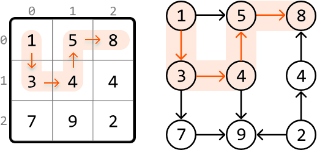

With this in mind, let's figure out how to traverse the matrix.

### Traversing the matrix

One strategy is to find the length of the longest path that starts at each cell and return the maximum of these lengths. To do this, we need a way to explore all paths which extend from each cell, and return the longest one. Many traversal algorithms allow us to do this. In this explanation, we use DFS since it has a slightly simpler implementation for finding the longest path.

Let's see how this works over an example. Start by performing DFS at the first cell, (0, 0):


To determine the longest path starting from this cell, we need to explore its higher-value neighboring cells. By making a DFS call to each of these larger neighbors, we can find the lengths of the paths that start from them:


The largest path starting at cell (0, 0) will be equal to whichever of these DFS calls returns a larger path, plus 1 to include cell (0, 0) itself.

Note that since this matrix resembles a DAG, we don't need to mark cells as visited, since it's not possible to cycle back to previously visited cells.

The pseudocode for finding the length of the longest path starting at a given cell is provided below:

```
def dfs(cell):
    max_path = 1
    for each neighbor of the current cell:
        if value of neighbor > value of cell:
            max_path = max(max_path, dfs(neighbor) + 1)
    return max_path
```

To get the final result, we just need to call DFS for every cell in the matrix, ensuring we find the lengths of the longest paths starting from each cell. The maximum of these lengths is equal to the length of the longest increasing path.

An important thing to notice is that it's possible for DFS to be called on the same cell multiple times. We can see this below, where we call DFS on cell (2, 1) on three different occasions:


After we first calculate the longest path starting at a certain cell, we don't need to calculate it again for that cell. This suggests we should use memoization: by storing the DFS result of each cell, we can just return the saved result whenever a DFS call is made to that cell again.

## Try it yourself

Write your solution to the problem before checking the reference implementation.

## Implementation

### Python
```python
from typing import List
    
def longest_increasing_path(matrix: List[List[int]]) -> int:
    if not matrix:
        return 0
    res = 0
    m, n = len(matrix), len(matrix[0])
    memo = [[0] * n for _ in range(m)]
    # Find the longest increasing path starting at each cell. The maximum of these is
    # equal to the overall longest increasing path.
    for r in range(m):
        for c in range(n):
            res = max(res, dfs(r, c, matrix, memo))
    return res
    
def dfs(r: int, c: int, matrix: List[List[int]], memo: List[List[int]]):
    if memo[r][c] != 0:
        return memo[r][c]
    max_path = 1
    dirs = [(-1, 0), (1, 0), (0, -1), (0, 1)]
    # The longest path starting at the current cell is equal to the longest path of
    # its larger neighboring cells, plus 1.
    for d in dirs:
        next_r, next_c = r + d[0], c + d[1]
        if is_within_bounds(next_r, next_c, matrix) and matrix[next_r][next_c] > matrix[r][c]:
            max_path = max(max_path, 1 + dfs(next_r, next_c, matrix, memo))
    memo[r][c] = max_path
    return max_path
    
def is_within_bounds(r: int, c: int, matrix: List[List[int]]) -> bool:
    return 0 <= r < len(matrix) and 0 <= c < len(matrix[0])
```
### JavaScript
```javascript
export function longest_increasing_path(matrix) {
  if (!matrix || matrix.length === 0) return 0
  const m = matrix.length
  const n = matrix[0].length
  const memo = Array.from({ length: m }, () => Array(n).fill(0))
  let res = 0
  // Find the longest increasing path starting at each cell. The maximum of these is
  // equal to the overall longest increasing path.
  for (let r = 0; r < m; r++) {
    for (let c = 0; c < n; c++) {
      res = Math.max(res, dfs(r, c, matrix, memo))
    }
  }
  return res
}

function dfs(r, c, matrix, memo) {
  if (memo[r][c] !== 0) return memo[r][c]
  let maxPath = 1
  const dirs = [
    [-1, 0],
    [1, 0],
    [0, -1],
    [0, 1],
  ]
  // The longest path starting at the current cell is equal to the longest path of
  // its larger neighboring cells, plus 1.
  for (const [dr, dc] of dirs) {
    const nextR = r + dr
    const nextC = c + dc
    if (
      isWithinBounds(nextR, nextC, matrix) &&
      matrix[nextR][nextC] > matrix[r][c]
    ) {
      maxPath = Math.max(maxPath, 1 + dfs(nextR, nextC, matrix, memo))
    }
  }
  memo[r][c] = maxPath
  return maxPath
}

function isWithinBounds(r, c, matrix) {
  return r >= 0 && r < matrix.length && c >= 0 && c < matrix[0].length
}
```
### Java
```java
import java.util.ArrayList;

public class Main {
    public int longest_increasing_path(ArrayList<ArrayList<Integer>> matrix) {
        if (matrix == null || matrix.isEmpty()) return 0;
        int m = matrix.size();
        int n = matrix.get(0).size();
        int res = 0;
        int[][] memo = new int[m][n];
        // Find the longest increasing path starting at each cell. The maximum of these is
        // equal to the overall longest increasing path.
        for (int r = 0; r < m; r++) {
            for (int c = 0; c < n; c++) {
                res = Math.max(res, dfs(r, c, matrix, memo));
            }
        }
        return res;
    }

    private int dfs(int r, int c, ArrayList<ArrayList<Integer>> matrix, int[][] memo) {
        if (memo[r][c] != 0) return memo[r][c];
        int maxPath = 1;
        int[][] dirs = { {-1, 0}, {1, 0}, {0, -1}, {0, 1} };
        // The longest path starting at the current cell is equal to the longest path of
        // its larger neighboring cells, plus 1.
        for (int[] dir : dirs) {
            int nextR = r + dir[0];
            int nextC = c + dir[1];
            if (isWithinBounds(nextR, nextC, matrix) &&
                matrix.get(nextR).get(nextC) > matrix.get(r).get(c)) {
                maxPath = Math.max(maxPath, 1 + dfs(nextR, nextC, matrix, memo));
            }
        }
        memo[r][c] = maxPath;
        return maxPath;
    }

    private boolean isWithinBounds(int r, int c, ArrayList<ArrayList<Integer>> matrix) {
        return r >= 0 && r < matrix.size() && c >= 0 && c < matrix.get(0).size();
    }
}
```
## Complexity Analysis

**Time complexity:** The time complexity of `longest_increasing_path` is O(m⋅n) where m denotes the number of rows, and n denotes the number of columns. This is because each cell of the matrix is visited at most twice: once in the `longest_increasing_path` function, and during DFS where each cell is visited at most once due to memoization.

**Space complexity:** The space complexity is O(m⋅n) primarily due to the recursive call stack during DFS, and the memoization table, both of which can grow to m⋅n in size.


---


# Shortest Transformation Sequence

Given two words, start and end, and a dictionary containing an array of words, return the length of the shortest transformation sequence to transform start to end. A transformation sequence is a series of words in which:

- Each word differs from the preceding word by exactly one letter.
- Each word in the sequence exists in the dictionary.

If no such transformation sequence exists, return 0.

**Example:**

**Input:** start = 'red', end = 'hit',
       dictionary = [
            'red', 'bed', 'hat', 'rod', 'rad', 'rat', 'hit', 'bad', 'bat'
       ]

**Output:** 5

**Constraints:**

- All words are the same length.
- All words contain only lowercase English letters.
- The dictionary contains no duplicate words.

## Intuition

In a transformation sequence, each transformation involves changing one letter of a word to get another word. Consider the following example:


We know our transformation sequence should start with the word "red", but how can we identify subsequent words in the sequence? The words that could immediately follow "red" are "bed", "rad", or "rod", since each differs from "red" by one letter:


Similarly, we can make a direct connection between each word and its one-letter-off neighbors:


This structure resembles a graph, indicating that finding the shortest transformation sequence involves finding the shortest path in this graph from the start node ("red") to the end node ("hit"):


### Finding the shortest path

When tasked with a graph problem that involves finding the shortest path between two nodes, BFS should come to mind. From the start node, BFS works by exploring all neighbors at a distance of 1 from the start node, followed by exploring nodes at a distance of 2, and so on. This means that once we find the end node, we've reached it via the shortest possible distance.

So, let's use level-order traversal, a variant of BFS, to find the shortest path in this graph, where each level we traverse represents nodes that are a specific distance from the start node:


As we can see, we managed to find the end node via the shortest path. To return the length of this path, we return dist, plus 1, to include the start node. If you're unfamiliar with how level-order traversal works, review the Matrix Infection problem in this chapter.

Note that during traversal, we need to ensure we don't revisit previously traversed strings. By storing the visited strings in a hash set, we can quickly check if a string was already visited.

Now, let's figure out how to build the above graph.

### Building the graph

We can represent the graph as an adjacency list, where each word has a list of all of its neighboring words:


The challenge here is finding each word's neighbors. Consider the word "red". One way we can identify all words that are one letter different from "red" is to generate all possible words by changing each letter in "red" to every other letter in the alphabet. For each of these generated words, we check if it exists in the dictionary. If it does, it's a neighbor of "red":


To make checking the dictionary more efficient, we can store the words from the dictionary in a hash set, enabling us to verify the existence of a word in constant time.

Note that before we build the graph, it's important to check if start or end exists in the dictionary. If either is missing, we can immediately return 0, since each word in the sequence needs to be in the dictionary.

### Space optimization

The purpose of the above adjacency list is to facilitate graph traversal. However, we can avoid building it altogether by leveraging the fact that each word in the dictionary is only visited once during the BFS traversal, indicating we only ever need access to the neighbors of each word once.

If we had a way to generate each word's neighbors when needed during BFS traversal, we could avoid creating the adjacency list, and save some space that would otherwise be taken up by it.

## Try it yourself

Write your solution to the problem before checking the reference implementation.

## Implementation

### Python
```python
def shortest_transformation_sequence(start: str, end: str, dictionary: List[str]) -> int:
    dictionary_set = set(dictionary)
    if start not in dictionary_set or end not in dictionary_set:
        return 0
    if start == end:
        return 1
    lower_case_alphabet = 'abcdefghijklmnopqrstuvwxyz'
    queue = deque([start])
    visited = set([start])
    dist = 0
    # Use level-order traversal to find the shortest path from the start word to the
    # end word.
    while queue:
        for _ in range(len(queue)):
            curr_word = queue.popleft()
            # If we found the end word, we've reached it via the shortest path.
            if curr_word == end:
                return dist + 1
            # Generate all possible words that have a one-letter difference to the
            # current word.
            for i in range(len(curr_word)):
                for c in lower_case_alphabet:
                    next_word = curr_word[:i] + c + curr_word[i+1:]
                    # If 'next_word' exists in the dictionary, it's a neighbor of the
                    # current word. If it's unvisited, add it to the queue to be
                    # processed in the next level.
                    if next_word in dictionary_set and next_word not in visited:
                        visited.add(next_word)
                        queue.append(next_word)
        dist += 1
    # If there is no way to reach the end node, then no path exists.
    return 0
```
### JavaScript
```javascript
export function shortest_transformation_sequence(start, end, dictionary) {
  const dictionarySet = new Set(dictionary)
  if (!dictionarySet.has(start) || !dictionarySet.has(end)) return 0
  if (start === end) return 1
  const lowerCaseAlphabet = 'abcdefghijklmnopqrstuvwxyz'
  const queue = [start]
  const visited = new Set([start])
  let dist = 0
  // Use level-order traversal to find the shortest path from the start word to the
  // end word.
  while (queue.length > 0) {
    const levelSize = queue.length
    for (let i = 0; i < levelSize; i++) {
      const currWord = queue.shift()
      // If we found the end word, we've reached it via the shortest path.
      if (currWord === end) {
        return dist + 1
      }
      // Generate all possible words that have a one-letter difference to the
      // current word.
      for (let j = 0; j < currWord.length; j++) {
        for (const c of lowerCaseAlphabet) {
          const nextWord = currWord.slice(0, j) + c + currWord.slice(j + 1)
          // If 'next_word' exists in the dictionary, it's a neighbor of the
          // current word. If it's unvisited, add it to the queue to be
          // processed in the next level.
          if (dictionarySet.has(nextWord) && !visited.has(nextWord)) {
            visited.add(nextWord)
            queue.push(nextWord)
          }
        }
      }
    }
    dist++
  }
  // If there is no way to reach the end node, then no path exists.
  return 0
}
```
### Java
```java
import java.util.ArrayList;
import java.util.HashSet;
import java.util.LinkedList;
import java.util.Queue;
import java.util.Set;

public class Main {
    public static int shortest_transformation_sequence(String start, String end, ArrayList<String> dictionary) {
        Set<String> dictionarySet = new HashSet<>(dictionary);
        if (!dictionarySet.contains(start) || !dictionarySet.contains(end)) {
            return 0;
        }
        if (start.equals(end)) {
            return 1;
        }
        String lowerCaseAlphabet = "abcdefghijklmnopqrstuvwxyz";
        Queue<String> queue = new LinkedList<>();
        Set<String> visited = new HashSet<>();
        int dist = 0;
        queue.offer(start);
        visited.add(start);
        // Use level-order traversal to find the shortest path from the start word to the
        // end word.
        while (!queue.isEmpty()) {
            int size = queue.size();
            for (int i = 0; i < size; i++) {
                String currWord = queue.poll();
                // If we found the end word, we've reached it via the shortest path.
                if (currWord.equals(end)) {
                    return dist + 1;
                }
                // Generate all possible words that have a one-letter difference to the
                // current word.
                for (int j = 0; j < currWord.length(); j++) {
                    for (char c : lowerCaseAlphabet.toCharArray()) {
                        String nextWord = currWord.substring(0, j) + c + currWord.substring(j + 1);

                        // If 'next_word' exists in the dictionary, it's a neighbor of the
                        // current word. If it's unvisited, add it to the queue to be
                        // processed in the next level.
                        if (dictionarySet.contains(nextWord) && !visited.contains(nextWord)) {
                            visited.add(nextWord);
                            queue.offer(nextWord);
                        }
                    }
                }
            }
            dist++;
        }
        // If there is no way to reach the end node, then no path exists.
        return 0;
    }
}
```
## Complexity Analysis

**Time complexity:** The time complexity of `shortest_transformation_sequence` is O(n⋅L²), where n denotes the number of words in the dictionary, and L denotes the length of a word. Here's why:

- Creating a hash set containing all the words in the dictionary takes O(n⋅L) time, because hashing each of the n words takes O(L) time.

- Level-order traversal processes at most n words from the dictionary. At each of these words, we generate up to 26L transformations, and it takes O(L) time to check if a transformation exists in the visited and dictionary_set hash sets, and to enqueue it. This means level-order traversal takes approximately O(n⋅26L⋅L) = O(n⋅L²) time.

Therefore, the overall time complexity is O(n⋅L) + O(n⋅L²) = O(n⋅L²).

**Space complexity:** The space complexity is O(n⋅L), taken up by the dictionary_set hash set, the visited hash set, and the queue.

## Optimization - Bidirectional Traversal

An important observation is that we don't necessarily need to begin level-order traversal at the start word: we can also start a search at the end word. In fact, we can combine these by performing them simultaneously to find the shortest path. This is known as bidirectional BFS, or in this case, bidirectional level-order traversal.

When we perform two searches, one from start and one from end, the idea is that they will meet in the middle if a path between these two words exists. If a path doesn't exist, the searches will never meet, indicating that a transformation sequence does not exist.

This optimization allows us to identify the shortest distance more quickly. We can see in the example below that regular level-order traversal ends up traversing through more nodes than in the bidirectional traversal, while also requiring 4 iterations instead of 2.


To simulate this process, we alternate between the two level-order traversals and progress through each search one level at a time:

- **Start traversal:** progress one level in the traversal that started from the start node
- **End traversal:** progress one level in the traversal that started from the end node

We alternate between these two steps until a node visited in one search has already been visited in the other search, indicating that the traversals have met. Here's what this alternating process looks like:


To check if a node has already been visited by the other traversal, we can query the visited hash set used by the other traversal. If a word exists in the visited hash set of the other traversal, we know the searches have met.

## Try it yourself

Write your solution to the problem before checking the reference implementation.

## Implementation - Bidirectional Traversal

### Python
```python
from typing import List
from collections import deque
    
def shortest_transformation_sequence_optimized(start: str, end: str, dictionary: List[str]) -> int:
    dictionary_set = set(dictionary)
    if start not in dictionary_set or end not in dictionary_set:
        return 0
    if start == end:
        return 1
    start_queue = deque([start])
    start_visited = {start}
    end_queue = deque([end])
    end_visited = {end}
    level_start = level_end = 0
    # Perform a level-order traversal from the start word and another from the end
    # word.
    while start_queue and end_queue:
        # Explore the next level of the traversal that starts from the start word. If
        # it meets the other traversal, the shortest path between 'start' and 'end'
        # has been found.
        level_start += 1
        if explore_level(start_queue, start_visited, end_visited, dictionary_set):
            return level_start + level_end + 1
        # Explore the next level of the traversal that starts from the end word.
        level_end += 1
        if explore_level(end_queue, end_visited, start_visited, dictionary_set):
            return level_start + level_end + 1
    # If the traversals never met, then no path exists.
    return 0
    
# This function explores the next level in the level-order traversal and checks if
# two searches meet.
def explore_level(queue, visited, other_visited, dictionary_set) -> bool:
    lower_case_alphabet = 'abcdefghijklmnopqrstuvwxyz'
    for _ in range(len(queue)):
        current_word = queue.popleft()
        for i in range(len(current_word)):
            for c in lower_case_alphabet:
                next_word = current_word[:i] + c + current_word[i+1:]
                # If 'next_word' has been visited during the other traversal, it means
                # both searches have met.
                if next_word in other_visited:
                    return True
                if next_word in dictionary_set and next_word not in visited:
                    visited.add(next_word)
                    queue.append(next_word)
    # If no word has been visited by the other traversal, the searches have not met
    # yet.
    return False
```
### JavaScript
```javascript
export function shortest_transformation_sequence_optimized(
  start,
  end,
  dictionary
) {
  const dictionarySet = new Set(dictionary)
  if (!dictionarySet.has(start) || !dictionarySet.has(end)) return 0
  if (start === end) return 1
  const startQueue = [start]
  const endQueue = [end]
  const startVisited = new Set([start])
  const endVisited = new Set([end])
  let levelStart = 0
  let levelEnd = 0
  while (startQueue.length && endQueue.length) {
    levelStart++
    if (exploreLevel(startQueue, startVisited, endVisited, dictionarySet)) {
      return levelStart + levelEnd + 1
    }
    levelEnd++
    if (exploreLevel(endQueue, endVisited, startVisited, dictionarySet)) {
      return levelStart + levelEnd + 1
    }
  }
  return 0
}

function exploreLevel(queue, visited, otherVisited, dictionarySet) {
  const lowerCaseAlphabet = 'abcdefghijklmnopqrstuvwxyz'
  const levelSize = queue.length
  for (let i = 0; i < levelSize; i++) {
    const currentWord = queue.shift()
    for (let j = 0; j < currentWord.length; j++) {
      for (const c of lowerCaseAlphabet) {
        const nextWord = currentWord.slice(0, j) + c + currentWord.slice(j + 1)
        if (otherVisited.has(nextWord)) {
          return true
        }
        if (dictionarySet.has(nextWord) && !visited.has(nextWord)) {
          visited.add(nextWord)
          queue.push(nextWord)
        }
      }
    }
  }
  return false
}
```
### Java
```java
import java.util.*;

public class Main {
    public static int shortest_transformation_sequence(String start, String end, ArrayList<String> dictionary) {
        Set<String> dictionarySet = new HashSet<>(dictionary);
        if (!dictionarySet.contains(start) || !dictionarySet.contains(end)) {
            return 0;
        }
        if (start.equals(end)) {
            return 1;
        }
        Queue<String> startQueue = new LinkedList<>();
        Set<String> startVisited = new HashSet<>();
        startQueue.add(start);
        startVisited.add(start);
        Queue<String> endQueue = new LinkedList<>();
        Set<String> endVisited = new HashSet<>();
        endQueue.add(end);
        endVisited.add(end);
        int levelStart = 0;
        int levelEnd = 0;
        // Perform a level-order traversal from the start word and another from the end word.
        while (!startQueue.isEmpty() && !endQueue.isEmpty()) {
            // Explore the next level of the traversal that starts from the start word.
            // If it meets the other traversal, the shortest path between 'start' and 'end' has been found.
            levelStart++;
            if (exploreLevel(startQueue, startVisited, endVisited, dictionarySet)) {
                return levelStart + levelEnd + 1;
            }
            // Explore the next level of the traversal that starts from the end word.
            levelEnd++;
            if (exploreLevel(endQueue, endVisited, startVisited, dictionarySet)) {
                return levelStart + levelEnd + 1;
            }
        }
        // If the traversals never met, then no path exists.
        return 0;
    }

    // This function explores the next level in the level-order traversal and checks if two searches meet.
    private static boolean exploreLevel(Queue<String> queue, Set<String> visited, Set<String> otherVisited, Set<String> dictionarySet) {
        String lowerCaseAlphabet = "abcdefghijklmnopqrstuvwxyz";
        int size = queue.size();
        for (int i = 0; i < size; i++) {
            String currentWord = queue.poll();
            for (int j = 0; j < currentWord.length(); j++) {
                for (int k = 0; k < lowerCaseAlphabet.length(); k++) {
                    char c = lowerCaseAlphabet.charAt(k);
                    String nextWord = currentWord.substring(0, j) + c + currentWord.substring(j + 1);
                    // If 'nextWord' has been visited during the other traversal, it means both searches have met.
                    if (otherVisited.contains(nextWord)) {
                        return true;
                    }
                    if (dictionarySet.contains(nextWord) && !visited.contains(nextWord)) {
                        visited.add(nextWord);
                        queue.add(nextWord);
                    }
                }
            }
        }
        // If no word has been visited by the other traversal, the searches have not met yet.
        return false;
    }
}
```
## Complexity Analysis

**Time complexity:** The time complexity of `shortest_transformation_sequence_optimized` is O(n⋅L²), since we're performing two level-order traversals. Note that this is more efficient in practice since there are potentially fewer nodes to traverse when using bidirectional traversal.

**Space complexity:** The space complexity is O(n⋅L), taken up by the dictionary_set hash set, the visited hash sets, and both queues.


---


# Merging Communities

There are n people numbered from 0 to n - 1, with each person initially belonging to a separate community. When two people from different communities connect, their communities merge into a single community.

Your goal is to write two functions:

- `connect(x: int, y: int) -> None`: Connects person x with person y and merges their communities.
- `get_community_size(x: int) -> int`: Returns the size of the community which person x belongs to.

**Example:**


**Input:** n = 5,
       [
         connect(0, 1),
         connect(1, 2),
         get_community_size(3),
         get_community_size(0),
         connect(3, 4),
         get_community_size(4),
       ]

**Output:** [1, 3, 2]

## Intuition

In this problem, we start with n individuals, each in their own separate community. As we connect pairs of individuals, their respective communities merge. The challenge is to efficiently manage these connections and quickly determine the size of the community for any given individual.

This is where the Union-Find data structure, also known as the Disjoint Set Union (DSU) data structure, comes in. Union-Find consists of two operations:

- **Union:** takes two elements from different sets and makes them part of the same set.
- **Find:** determines what set an element belongs to.

In the context of this problem, the union operation can be used to merge the communities of two people, while the find operation can be used to determine which community a person belongs to. To make this work, we need a way to represent each community. For example, let's say there are 5 people, with persons 0 and 1 in one community, and persons 2, 3, and 4 in another:


One way to distinguish between them is to designate a representative for each community. Let's assign person 0 as the representative of the left community, and person 2 as the representative of the right community. We can represent these communities as a graph, where each community is a connected component, and each person in a community points to their representative:


This can be reflected using a parent array, where `parent[i]` stores the parent of person i. This parent array is discussed later.

Now that we have a way to represent communities, let's discuss how the union and find functions would work in more detail.

## Union

Consider the previous example of 5 people. Let's say we want to connect persons 1 and 4 (i.e., `union(1, 4)`):


We first need to identify their representatives so we know which communities these two people belong to. We can use the find function for this, which will be discussed later:


Before merging these communities, we need to pick one of the two current representatives as the representative of the merged community. For now, let's just pick person 0.

From here, one strategy is to connect everyone in the second community directly to person 0:


This would require individually setting the parent of all these people to person 0, which can be quite expensive if the community has many people. A more efficient strategy is to just connect the representative of this community, person 2, to person 0.

In code, this is done by setting the parent of `rep_y` to be `rep_x` (`parent[rep_y] = rep_x`):


This way, everyone originally in the second community is indirectly connected to person 0, making person 0 the representative of all nodes.

Note that if `rep_x` and `rep_y` are the same person, then they belong to the same community, in which case we don't need to merge anything.

## Find

The find function should return the representative of the community a person is in:


At this point, it's important to note the difference between a parent and a representative:

- A **representative** is the person who represents the community. This is effectively the "root" node of the community.

- A **parent** of a person is the node that person is pointing to.

For example, in the community below, we see that person 0's parent is person 1, whereas person 0's representative is person 2:


We can implement the `find(x)` function by traversing x's parent chain until we reach the representative. The representative is the person whose parent is themselves, so we can identify them by checking if the current person is their own parent. The code snippet for this is provided below.

### Python
```python
def find(x: int) -> int:
    # If x is equal to its parent, we found the representative.
    if x == parent[x]:
        return x
    # Otherwise, continue traversing through x's parent chain.
    return find(parent[x])
```
### JavaScript
```javascript
function find(x) {
  // If x is equal to its parent, we found the representative.
  if (parent[x] === x) {
    return x
  }
  // Otherwise, continue traversing through x's parent chain.
  return find(parent[x])
}
```
### Java
```java
public int find(int x) {
   // If x is equal to its parent, we found the representative.
   if (x == parent[x]) {
       return x;
   }
   // Otherwise, continue traversing through x's parent chain.
   return find(parent[x]);
}
```
Now we've discussed both the union and the find function, let's discuss what optimizations can be made to them.

## Union by size

Recall that before merging two communities, we need to pick someone to represent the merged community. Our choice is between `rep_x` and `rep_y`. Is one a better choice than the other? Consider the following two communities:


Let's see what the difference is when we pick `rep_x` to be the representative versus picking `rep_y`:


As we can see, when we choose a representative from one of two communities, the people in the other community have a longer distance to their new representative, with the distance increased by 1. Therefore, it's better to pick the representative from the larger community, so that only the people from the smaller community are impacted by this adjusted distance.

This optimization requires a way to determine the size of a community. We can do this using a size array, where `size[i]` is the size of the community represented by person i. The code for this can be seen below:

### Python
```python
def union(x: int, y: int) -> None:
   rep_x, rep_y = find(x), find(y)
   if rep_x != rep_y:
       # If 'rep_x' represents a larger community, connect 'rep_y's community to it.
       if size[rep_x] > size[rep_y]:
           parent[rep_y] = rep_x
           size[rep_x] += size[rep_y]
       # If 'rep_y' represents a larger community, or both communities are of the same
       # size, connect 'rep_x's community to it.
       else:
           parent[rep_x] = rep_y
           size[rep_y] += size[rep_x]
```
### JavaScript
```javascript
function union(x, y) {
  const repX = find(x)
  const repY = find(y)
  if (repX !== repY) {
    // If 'repX' represents a larger community, connect 'repY's community to it.
    if (size[repX] > size[repY]) {
      parent[repY] = repX
      size[repX] += size[repY]
    }
    // If 'repY' represents a larger community, or both are the same size,
    // connect 'repX's community to it.
    else {
      parent[repX] = repY
      size[repY] += size[repX]
    }
  }
}
```
### Java
```java
public void union(int x, int y) {
    int repX = find(x);
    int repY = find(y);
    if (repX != repY) {
        // If 'repX' represents a larger community, connect 'repY's community to it.
        if (size[repX] > size[repY]) {
            parent[repY] = repX;
            size[repX] += size[repY];
        }
        // If 'repY' represents a larger community, or both are the same size,
        // connect 'repX's community to it.
        else {
            parent[repX] = repY;
            size[repY] += size[repX];
        }
    }
}
```
A similar optimization to union by size is union by rank, which optimizes the union function in a very similar way [1].

Note that the size array makes the implementation of `get_community_size(x)` quite straightforward: we just return the size of x's representative (i.e., `return size[find(x)]`).

## Path compression

There's another major optimization that can be made. Consider the following community, with person 0 as the representative. The further down we go in this diagram, the further away the people are from the representative. We can see this for persons 3 and 6, for example:


What's important to realize is that performing `find(3)` and `find(6)` will not only return the representative to persons 3 and 6, but it will also cause it to be returned by all the other nodes in their parent chains because this is a recursive function:


This means every person in their parent chains also knows their representative is person 0. So, if we update the parent of each of these people to person 0 in the find function, all the nodes in this chain will connect to the representative. This technique is known as path compression, and it allows us to flatten the graph:


The code for this optimization is provided below:

### Python
```python
def find(x: int) -> int:
    if x == parent[x]:
        return x
    # Path compression: updates the representative of x, flattening the structure of
    # the community as we go.
    parent[x] = find(parent[x])
    return parent[x]
```
### JavaScript
```javascript
function find(x) {
  if (x === parent[x]) {
    return x
  }
  // Path compression: updates the representative of x, flattening the structure of
  // the community as we go.
  parent[x] = find(parent[x])
  return parent[x]
}
```
### Java
```java
public int find(int x) {
   if (x == parent[x]) {
       return x;
   }
   // Path compression: updates the representative of x, flattening the structure of
   // the community as we go.
   parent[x] = find(parent[x]);
   return parent[x];
}
```
This path compression optimization allows us to restructure the graph at every find call, effectively reducing the distance between people and their representative, and making future find calls more efficient.

## Try it yourself

Write your solution to the problem before checking the reference implementation.

## Implementation

Below is the implementation of the Union-Find data structure.

### Python
```python
class UnionFind:
    def __init__(self, size: int):
        self.parent = [i for i in range(size)]
        self.size = [1] * size
   
    def union(self, x: int, y: int) -> None:
        rep_x, rep_y = self.find(x), self.find(y)
        if rep_x != rep_y:
            # If 'rep_x' represents a larger community, connect 'rep_y's community to
            # it.
            if self.size[rep_x] > self.size[rep_y]:
                self.parent[rep_y] = rep_x
                self.size[rep_x] += self.size[rep_y]
            # Otherwise, connect 'rep_x's community to 'rep_y'.
            else:
                self.parent[rep_x] = rep_y
                self.size[rep_y] += self.size[rep_x]
   
    def find(self, x: int) -> int:
        if x == self.parent[x]:
            return x
        self.parent[x] = self.find(self.parent[x]) # Path compression.
        return self.parent[x]
   
    def get_size(self, x: int) -> int:
        return self.size[self.find(x)]
```
### JavaScript
```javascript
class UnionFind {
  constructor(size) {
    this.parent = Array.from({ length: size }, (_, i) => i)
    this.size = Array(size).fill(1)
  }

  union(x, y) {
    const repX = this.find(x)
    const repY = this.find(y)

    if (repX !== repY) {
      // If 'repX' represents a larger community, connect 'repY's community to it.
      if (this.size[repX] > this.size[repY]) {
        this.parent[repY] = repX
        this.size[repX] += this.size[repY]
      }
      // Otherwise, connect 'repX's community to 'repY'.
      else {
        this.parent[repX] = repY
        this.size[repY] += this.size[repX]
      }
    }
  }

  find(x) {
    if (x === this.parent[x]) {
      return x
    }
    // Path compression: flatten the structure as we go.
    this.parent[x] = this.find(this.parent[x])
    return this.parent[x]
  }

  getSize(x) {
    return this.size[this.find(x)]
  }
}
```
### Java
```java
class UnionFind {
    private int[] parent;
    private int[] size;

    public UnionFind(int n) {
        parent = new int[n];
        size = new int[n];
        // Initialize each element to be its own parent and size to 1.
        for (int i = 0; i < n; i++) {
            parent[i] = i;
            size[i] = 1;
        }
    }

    public void union(int x, int y) {
        int repX = find(x);
        int repY = find(y);
        if (repX != repY) {
            // If 'repX' represents a larger community, connect 'repY's community to it.
            if (size[repX] > size[repY]) {
                parent[repY] = repX;
                size[repX] += size[repY];
            }
            // Otherwise, connect 'repX's community to 'repY'.
            else {
                parent[repX] = repY;
                size[repY] += size[repX];
            }
        }
    }

    public int find(int x) {
        if (x == parent[x]) {
            return x;
        }
        // Path compression.
        parent[x] = find(parent[x]);
        return parent[x];
    }

    public int getSize(int x) {
        return size[find(x)];
    }
}
```
Below is the implementation of the main problem using the above Union-Find data structure:

### Python
```python
class MergingCommunities:
    def __init__(self, n: int):
        self.uf = UnionFind(n)
   
    def connect(self, x: int, y: int) -> None:
        self.uf.union(x, y)
   
    def get_community_size(self, x: int) -> int:
        return self.uf.get_size(x)
```
### JavaScript
```javascript
export class MergingCommunities {
  constructor(n) {
    this.uf = new UnionFind(n)
  }

  connect(x, y) {
    this.uf.union(x, y)
  }

  get_community_size(x) {
    return this.uf.getSize(x)
  }
}
```
### Java
```java
class MergingCommunities {
    private UnionFind uf;

    public MergingCommunities(int n) {
        uf = new UnionFind(n);
    }

    public void connect(Integer x, Integer y) {
        uf.union(x, y);
    }

    public Integer getCommunitySize(Integer x) {
        return uf.getSize(x);
    }
}
```
## Complexity Analysis

**Time complexity:** Let's break down the time complexity of the Union-Find functions:

- With the path compression and union by size optimizations, `find` has a time complexity of amortized O(1)[^1] because the branches of the graph become very short over time, making the function effectively constant-time in most cases.

- Since `union` just uses the `find` function twice, it also has a time complexity of amortized O(1).

- Since `get_size` just uses the `find` function once, it also has a time complexity of amortized O(1).

Therefore, the time complexities of `connect` and `get_community_size` are both amortized O(1). The time complexity of the constructor is O(n) because we initialize two arrays of size n when creating the UnionFind object.

**Space complexity:** The space complexity is O(n) because the Union-Find data structure has two arrays of size n: `parent` and `size`. The space taken up by the recursive call stack is amortized O(1) since the branches of the graph become very short over time, resulting in fewer recursive calls made to the `find` function.

## Footnotes

[^1]: We can also write the time complexity here as O(α(n)), where α(n) is the inverse Ackermann function, which grows extremely slowly but is not constant.


---


# Prerequisites

Given an integer n representing the number of courses labeled from 0 to n - 1, and an array of prerequisite pairs, determine if it's possible to enroll in all courses.

Each prerequisite is represented as a pair [a, b], indicating that course a must be taken before course b.

**Example:**


**Input:** n = 3, prerequisites = [[0, 1], [1, 2], [2, 1]]

**Output:** False

**Explanation:** Course 1 cannot be taken without first completing course 2 and, and vice versa.

**Constraints:**

- For any prerequisite [a, b], a will not equal b.

## Intuition

Our goal is to check if enrollment into all courses is possible. Let's start by identifying which situations make enrollment impossible.

Consider a simple case where there are just two courses. A scenario where enrollment into all courses is impossible occurs when each course is a prerequisite to the other, as graphically represented below:


Here are a couple of impossible enrollment scenarios that could occur with prerequisites for three courses:


What do we notice about these cases and their graphical representations? They both have a circular relationship: a cycle. This highlights that it's impossible to enroll in all courses if there exists a circular dependency between courses. In other words, there must not be a cycle in the graphical representation of the courses for complete enrollment to be possible.

Another thing to note is that the first courses which can be completed are those without prerequisites. In the graphical representation, such a course would have no directed arrows pointing at them. Let's refer to the number of directed edges incoming to a node as the in-degree of that node.

In the example below, each node's in-degree is displayed at the top right:


Courses 0 and 3 have an in-degree of 0. So, let's complete them first and remove them from the graph. By doing this, we reduce the number of prerequisites for courses 1 and 2. Course 1's indegree then decreases by 1, and course 2's indegree decreases by 2:


Now, courses 1 and 2 have an in-degree of 0, which means we can enroll in them and remove them from the graph. Observe what happens when we continue the process of removing courses with an in-degree of 0 from the graph:


By the end of this process, no courses remain, indicating it's possible to enroll in all courses.

Now, consider an example with a cyclic dependency:


Let's follow the same steps of removing courses with an in-degree of 0:


Here, there is no way to progress because there aren't any courses with an in-degree of 0. When this happens, and there are still unvisited courses, a cyclic dependency exists, meaning enrolment is impossible.

Now, let's identify a way to simulate the above process algorithmically.

## Topological sort

The process we described above is essentially topological sorting, where vertices of a graph are sorted in such a way that for every directed edge u → v, node u comes before node v in the ordering of the topological sort.

An algorithm designed to perform topological sort is Kahn's algorithm. Let's see how we can use it to solve this problem.

The first step of Kahn's algorithm is to determine the in-degree of each course. This can be achieved by counting the number of times each course appears as a dependent in the prerequisite pairs: for a pair [a, b], course b depends on course a, so course b's in-degree is incremented by one:


Now, we want to process all the courses with an in-degree of 0 first. We can add these courses to a queue to be processed:


To begin processing, pop the first course from the queue: course 0. Then, for each course that has course 0 as a prerequisite (i.e., courses pointed to by course 0), reduce their in-degree by one:


If any of the courses have an in-degree of 0 after being decremented, add them to the queue. Course 1 now has an in-degree of 0, so we add it to the queue:


We can continue the above process until the queue is empty, indicating that there aren't any more courses with an in-degree of 0.

- If we've processed all n courses, enrollment to all courses is possible.
- If we couldn't process all n courses, a cycle was found, indicating enrollment to all courses is impossible.

## Try it yourself

Write your solution to the problem before checking the reference implementation.

## Implementation

### Python
```python
from typing import List
from collections import defaultdict, deque
    
def prerequisites(n: int, prerequisites: List[List[int]]) -> bool:
    graph = defaultdict(list)
    in_degrees = [0] * n
    # Represent the graph as an adjacency list and record the in-degree of each
    # course.
    for prerequisite, course in prerequisites:
        graph[prerequisite].append(course)
        in_degrees[course] += 1
    queue = deque()
    # Add all courses with an in-degree of 0 to the queue.
    for i in range(n):
        if in_degrees[i] == 0:
            queue.append(i)
    enrolled_courses = 0
    # Perform topological sort.
    while queue:
        node = queue.popleft()
        enrolled_courses += 1
        for neighbor in graph[node]:
            in_degrees[neighbor] -= 1
            # If the in-degree of a neighboring course becomes 0, add it to the queue.
            if in_degrees[neighbor] == 0:
                queue.append(neighbor)
    # Return true if we've successfully enrolled in all courses.
    return enrolled_courses == n
```
### JavaScript
```javascript
export function prerequisites(n, prerequisites) {
  const graph = new Map()
  const inDegrees = Array(n).fill(0)
  // Represent the graph as an adjacency list and record the in-degree of each course.
  for (const [prerequisite, course] of prerequisites) {
    if (!graph.has(prerequisite)) {
      graph.set(prerequisite, [])
    }
    graph.get(prerequisite).push(course)
    inDegrees[course]++
  }
  const queue = []
  // Add all courses with an in-degree of 0 to the queue.
  for (let i = 0; i < n; i++) {
    if (inDegrees[i] === 0) {
      queue.push(i)
    }
  }
  let enrolledCourses = 0
  // Perform topological sort.
  while (queue.length > 0) {
    const node = queue.shift()
    enrolledCourses++
    const neighbors = graph.get(node) || []
    for (const neighbor of neighbors) {
      inDegrees[neighbor]--
      // If the in-degree of a neighboring course becomes 0, add it to the queue.
      if (inDegrees[neighbor] === 0) {
        queue.push(neighbor)
      }
    }
  }
  // Return true if we've successfully enrolled in all courses.
  return enrolledCourses === n
}
```
### Java
```java
import java.util.ArrayList;
import java.util.Deque;
import java.util.HashMap;
import java.util.LinkedList;
import java.util.List;
import java.util.Map;

public class Main {
    public static boolean prerequisites(int n, ArrayList<ArrayList<Integer>> prerequisites) {
        Map<Integer, List<Integer>> graph = new HashMap<>();
        int[] inDegrees = new int[n];
        // Represent the graph as an adjacency list and record the in-degree of each course.
        for (ArrayList<Integer> pair : prerequisites) {
            int prerequisite = pair.get(0);
            int course = pair.get(1);
            graph.computeIfAbsent(prerequisite, k -> new ArrayList<>()).add(course);
            inDegrees[course]++;
        }
        Deque<Integer> queue = new LinkedList<>();
        // Add all courses with an in-degree of 0 to the queue.
        for (int i = 0; i < n; i++) {
            if (inDegrees[i] == 0) {
                queue.add(i);
            }
        }
        int enrolledCourses = 0;
        // Perform topological sort.
        while (!queue.isEmpty()) {
            int node = queue.poll();
            enrolledCourses++;

            if (graph.containsKey(node)) {
                for (int neighbor : graph.get(node)) {
                    inDegrees[neighbor]--;
                    // If the in-degree of a neighboring course becomes 0, add it to the queue.
                    if (inDegrees[neighbor] == 0) {
                        queue.add(neighbor);
                    }
                }
            }
        }
        // Return true if we've successfully enrolled in all courses.
        return enrolledCourses == n;
    }
}
```
## Complexity Analysis

**Time complexity:** The time complexity of `prerequisites` is O(n+e) where e denotes the number of edges derived from the prerequisites array. Here's why:

- Creating the adjacency list and recording the in-degrees takes O(e) time because we iterate through each prerequisite once.

- Adding all courses with in-degree 0 to the queue takes O(n) time because we check the in-degree of each course once.

- Performing Kahn's algorithm takes O(n+e) time because each course and prerequisite is processed at most once during the traversal.

**Space complexity:** The space complexity is O(n+e), since the adjacency list takes up O(n+e) space, while the `in_degrees` array and queue each take up O(n) space.


---


# Shortest Path

Given an integer n representing nodes labeled from 0 to n - 1 in an undirected graph, and an array of non-negative weighted edges, return an array where each index i contains the shortest path length from a specified start node to node i. If a node is unreachable, set its distance to -1.

Each edge is represented by a triplet of positive integers: the start node, the end node, and the weight of the edge.

**Example:**


**Input:** n = 6,
       edges = [
         [0, 1, 5],
         [0, 2, 3],
         [1, 2, 1],
         [1, 3, 4],
         [2, 3, 4],
         [2, 4, 5],
       ],
       start = 0

**Output:** [0, 4, 3, 7, 8, -1]

## Intuition

There are a few algorithms that can be employed to find the shortest path in a graph. Let's consider some of our options:

- **BFS** works well for finding the shortest path when the graph has edges with no weight, or uniform weight across the edges, as BFS doesn't take weight into account in its traversal strategy.

- **Dijkstra's algorithm** works well for graphs with non-negative weights, as it efficiently finds the shortest path from a single source to all other nodes.

- **The Bellman-Ford algorithm** works well for graphs with edges that may have negative weights [1].

- **The Floyd-Warshall algorithm** works well when we need to find the shortest paths between all pairs of nodes in a graph [2].

Among these options, Dijkstra's algorithm suits this problem the most since we're dealing with a graph with non-negative weighted edges, and we need to find the shortest path from a start node to all other nodes. This algorithm uses a greedy strategy, which we'll explore during this explanation.

Consider the undirected weighted graph below, with node 0 as the starting node.


Initially, since we don't know any of the distances between node 0 and the other nodes, we'll set them to infinity. The only distance we do know is from the start node to itself, which is just 0:


Let's begin with the start node. Consider its immediate neighbors, nodes 1 and 2. The distances from node 0 to these nodes are 5 and 3, respectively. We don't know if these are the shortest distances from 0 to them, but they're definitely shorter than infinity. So, let's update the distances to those nodes from node 0:


Right now, the closest node to the start node is node 2, with a distance of 3. This confirms that the shortest distance to node 2 from node 0 is 3, as the alternative route through node 1 has a longer distance. Thus, we can be certain that node 2 is reached through the shortest possible path, so let's move to it:


The current node is now node 2. Keep in mind that, so far, we've traversed a distance of `distance[2] = 3` from node 0 to reach node 2.

The immediate unvisited neighbors of the current node are nodes 1, 3, and 4. The distances to them from the start node are 1 + 3, 4 + 3, and 5 + 3 (where the +3 accounts for the distance traveled so far). Let's update the distance array with these distances since they are smaller than the distances currently set for them:


Right now, among the unvisited nodes, the node with the shortest distance from the start node is node 1, with a distance of 4. This means the shortest distance to node 1 from the start node is 4, since all other paths to node 1 involve traversing through distances larger than 4. So, let's move to node 4:


The greedy choice made is now becoming clearer:

> At each step, we move to the unvisited node with the shortest known distance from the start node.

Applying this greedy choice for the rest of the graph completes Dijkstra's algorithm, giving us an array populated with the shortest path lengths from the start node to each node:


The final step is to convert all infinity values in this array to -1, indicating we weren't able to reach that node:


To implement the above strategy, we'd like an efficient way to access the unvisited node with the shortest known distance at any point in the process. We can use a min-heap for this, allowing us logarithmic access to the node with the minimum distance.

### Using the min-heap

To understand how we use the min-heap in Dijkstra's algorithm, consider the following example with the start node, node 0, initially in the min-heap with its corresponding distance of 0:


Begin by popping the start node from the top of the heap and setting it to the current node. Then, add the current node's neighbors to the min-heap with their corresponding distances from the start node, and update the distances of these neighbors:


Repeat these two steps for each node at the top of the heap until the heap is empty:


As we can see, we encounter an issue: we're revisiting node 1. The only difference is that this time, we're visiting it at a larger distance (`curr_dist = 6`) from the start than the recorded distance (4). We can avoid this situation with the following if-statement:

```
if curr_dist > distances[curr_node]: continue
```

This check allows us to avoid using an additional data structure to keep track of visited nodes.

### Why does the greedy approach work?

Before reading this section, it's worth reviewing the Greedy chapter if you aren't familiar with greedy algorithms.

Dijkstra's algorithm is considered greedy because, at each step, it selects the unvisited node with the shortest known distance from the start node, based on the assumption that this distance is the shortest possible path to that node. This choice is made as a local optimum, with the belief that it will lead to the global optima: the shortest path to all nodes. Can we always guarantee that this assumption is true? Consider the following graph, where the current node is node 0:


The node with the shortest known distance from the start node is node 2, with a distance of 3. We assume this is the shortest distance to node 2, and choose node 2 as the local optimum. Here's a question we could ask here regarding the validity of this choice: is it possible to find a path with a distance less than 3 to another neighboring node, making node 2 no longer the neighbor with the shortest distance from the start node?

The answer is no. This is because we have to pass through one of these neighboring nodes to find any other paths, which would require us to add a distance of at least 3 to our total distance traversed from the start node. To reduce this traversed distance, we would need to encounter negatively weighted edges in the graph, which we know isn't possible in this graph.

This analysis also demonstrates that Dijkstra's algorithm is only applicable when the graph has no edges with negative weights.

## Try it yourself

Write your solution to the problem before checking the reference implementation.

## Implementation

### Python
```python
from typing import List
from collections import defaultdict
import heapq
    
def shortest_path(n: int, edges: List[int], start: int) -> List[int]:
    graph = defaultdict(list)
    distances = [float('inf')] * n
    distances[start] = 0
    # Represent the graph as an adjacency list.
    for u, v, w in edges:
        graph[u].append((v, w))
        graph[v].append((u, w))
    min_heap = [(0, start)]  # (distance, node)
    # Use Dijkstra's algorithm to find the shortest path between the start node
    # and all other nodes.
    while min_heap:
        curr_dist, curr_node = heapq.heappop(min_heap)
        # If the current distance to this node is greater than the recorded
        # distance, we've already found the shortest distance to this node.
        if curr_dist > distances[curr_node]:
            continue
        # Update the distances of the neighboring nodes.
        for neighbor, weight in graph[curr_node]:
            neighbor_dist = curr_dist + weight
            # Only update the distance if we find a shorter path to this
            # neighbor.
            if neighbor_dist < distances[neighbor]:
                distances[neighbor] = neighbor_dist
                heapq.heappush(min_heap, (neighbor_dist, neighbor))
    # Convert all infinity values to -1, representing unreachable nodes.
    return [-1 if dist == float('inf') else dist for dist in distances]
```
### JavaScript
```javascript
import { MinPriorityQueue } from './helpers/heap/MinPriorityQueue.js'

export function shortest_path(n, edges, start) {
  const graph = new Map()
  const distances = new Array(n).fill(Infinity)
  distances[start] = 0
  // Represent the graph as an adjacency list.
  for (const [u, v, w] of edges) {
    if (!graph.has(u)) graph.set(u, [])
    if (!graph.has(v)) graph.set(v, [])
    graph.get(u).push([v, w])
    graph.get(v).push([u, w])
  }
  // Use Dijkstra's algorithm to find the shortest path between the start node and all other nodes.
  const minHeap = new MinPriorityQueue((item) => item[0]) // (distance, node)
  minHeap.enqueue([0, start])
  while (!minHeap.isEmpty()) {
    const [currDist, currNode] = minHeap.dequeue()
    // If the current distance to this node is greater than the recorded distance, skip.
    if (currDist > distances[currNode]) continue
    // Update the distances of the neighboring nodes.
    const neighbors = graph.get(currNode) || []
    for (const [neighbor, weight] of neighbors) {
      const neighborDist = currDist + weight
      // Only update if we find a shorter path to this neighbor.
      if (neighborDist < distances[neighbor]) {
        distances[neighbor] = neighborDist
        minHeap.enqueue([neighborDist, neighbor])
      }
    }
  }
  // Convert all infinity values to -1, representing unreachable nodes.
  return distances.map((d) => (d === Infinity ? -1 : d))
}
```
### Java
```java
import java.util.ArrayList;
import java.util.Arrays;
import java.util.HashMap;
import java.util.List;
import java.util.Map;
import java.util.PriorityQueue;

class Edge {
    int target;
    int weight;

    public Edge(int target, int weight) {
        this.target = target;
        this.weight = weight;
    }
}

class Pair {
    int dist;
    int node;

    public Pair(int dist, int node) {
        this.dist = dist;
        this.node = node;
    }
}

public class Main {
    public static ArrayList<Integer> shortest_path(int n, ArrayList<ArrayList<Integer>> edges, int start) {
        Map<Integer, List<Edge>> graph = new HashMap<>();
        int[] distances = new int[n];
        Arrays.fill(distances, Integer.MAX_VALUE);
        distances[start] = 0;
        // Represent the graph as an adjacency list.
        for (ArrayList<Integer> edge : edges) {
            int u = edge.get(0), v = edge.get(1), w = edge.get(2);
            graph.computeIfAbsent(u, k -> new ArrayList<>()).add(new Edge(v, w));
            graph.computeIfAbsent(v, k -> new ArrayList<>()).add(new Edge(u, w));
        }
        PriorityQueue<Pair> minHeap = new PriorityQueue<>((a, b) -> a.dist - b.dist);
        minHeap.add(new Pair(0, start));  // (distance, node)
        // Use Dijkstra's algorithm to find the shortest path between the start node
        // and all other nodes.
        while (!minHeap.isEmpty()) {
            Pair current = minHeap.poll();
            int currDist = current.dist;
            int currNode = current.node;
            // If the current distance to this node is greater than the recorded
            // distance, we've already found the shortest distance to this node.
            if (currDist > distances[currNode]) continue;
            // Update the distances of the neighboring nodes.
            if (graph.containsKey(currNode)) {
                for (Edge neighbor : graph.get(currNode)) {
                    int neighborDist = currDist + neighbor.weight;
                    // Only update the distance if we find a shorter path to this
                    // neighbor.
                    if (neighborDist < distances[neighbor.target]) {
                        distances[neighbor.target] = neighborDist;
                        minHeap.add(new Pair(neighborDist, neighbor.target));
                    }
                }
            }
        }
        // Convert all infinity values to -1, representing unreachable nodes.
        ArrayList<Integer> result = new ArrayList<>();
        for (int dist : distances) {
            result.add(dist == Integer.MAX_VALUE ? -1 : dist);
        }
        return result;
    }
}
```
## Complexity Analysis

**Time complexity:** The time complexity of the `shortest_path` is O((n+e)log(n)), where e represents the number of edges. Here's why:

- Creating the adjacency list takes O(e) time.

- Dijkstra's algorithm traverses up to all n nodes and explores each edge of the graph. To access each node, we pop it from the heap, and for each edge, up to one node is pushed to the heap (when we process each node's neighbors). Since each push and pop operation takes O(log(n)) time, the time complexity of Dijkstra's algorithm is O((n+e)log(n)).

Therefore, the overall time complexity is O(e) + O((n+e)log(n)) = O((n+e)log(n)).

**Space complexity:** The space complexity is O(n+e), since the adjacency list takes up O(n+e) space, whereas the `distances` array and `min_heap` take up O(n) space.


---


# Connect the Dots

Given a set of points on a plane, determine the minimum cost to connect all these points.

The cost of connecting two points is equal to the Manhattan distance between them, which is calculated as |x1 - x2| + |y1 - y2| for two points (x1, y1) and (x2, y2).

**Example:**


**Input:** points = [[1, 1], [2, 6], [3, 2], [4, 3], [7, 1]]

**Output:** 15

**Constraints:**

- There will be at least 2 points on the plane.

## Intuition

Let's treat this problem as a graph problem, imagining each point as a node, and the cost of connecting any two points as the weight of an edge between those nodes.

The goal is to connect all nodes (points) in such a way that the total cost is minimized. This is essentially the minimum spanning tree (MST) problem:

The MST of a weighted graph is a way to connect all points in the graph, ensuring each point is reachable from any other point while minimizing the total weight of the connections.

There are two main algorithms that are used to find the MST of a graph:

- Kruskal's algorithm
- Prim's algorithm

In this explanation, we'll break down Kruskal's algorithm since it uses a data structure we've already discussed in this chapter: Union-Find.

## Kruskal's algorithm

Kruskal's algorithm is a greedy method for finding the MST. It essentially builds the MST by connecting nodes with the lowest-weighted edges first while skipping any edges that could cause a cycle.

To do this, we first need to identify all the possible edges and sort them by their Manhattan distance:


Now, let's implement Kruskal's algorithm. Start by including the lowest weighted edge in the MST, which is the edge from (3, 2) to (4, 3):


Next, add the next lowest weighted edge, which is the edge from (1, 1) to (3, 2):


Notice that adding the next edge from (1, 1) to (4, 3) will cause a cycle. Edges that cause cycles are avoided in an MST because doing so implies we're connecting two points that are already connected. So, let's skip this edge:


Continuing this process until all points are connected gives us the MST:


We'll know that all points are connected once we've added a total of n - 1 edges to the MST, because this is the least number of edges needed to connect n points without any cycles. To attain the cost of this MST, we just need to keep track of the Manhattan cost of each edge we add to the MST.

Now that we have a strategy to find the MST of a set of points, we just need a way to determine when connecting two points leads to a cycle.

### Avoiding cycles

A cycle is formed when we add an edge to nodes that are already connected in some way. Consider the following set of points, where the group of points to the left are connected, and the group of points to the right are connected:


Connecting any two points in the same group causes a cycle, and connecting two points from two separate groups will result in both groups merging into one:


What would be useful here is a way to determine if two points belong to the same group, and a way to merge two groups together. The Union-Find data structure is perfect for this.

- We can use the union function to connect two points together.

- If the two points belong to two separate groups, union should merge those groups and return true.

- Otherwise, if they belong to the same group, union should return false.

This way, we can use this boolean return value as a way to determine if attempting to connect two points causes a cycle.

If you're not familiar with Union-Find, study the solution to the Merging Communities problem.

## Try it yourself

Write your solution to the problem before checking the reference implementation.

## Implementation

In this implementation, we'll identify each point using their index in the points array. This means that for n points, each point is represented by an index from 0 to n - 1. By doing this, we can set up a Union-Find data structure with a capacity of n so that there are n groups initially, with each group containing one of the n points.

### Python
```python
from typing import List
    
def connect_the_dots(points: List[List[int]]) -> int:
    n = len(points)
    # Create and populate a list of all possible edges.
    edges = []
    for i in range(n):
        for j in range(i + 1, n):
            # Manhattan distance.
            cost = (abs(points[i][0] - points[j][0]) +
                    abs(points[i][1] - points[j][1]))
            edges.append((cost, i, j))
    # Sort the edges by their cost in ascending order.
    edges.sort()
    uf = UnionFind(n)
    total_cost = edges_added = 0
    # Use Kruskal's algorithm to create the MST and identify its minimum cost.
    for cost, p1, p2 in edges:
        # If the points are not already connected (i.e. their representatives are
        # not the same), connect them, and add the cost to the total cost.
        if uf.union(p1, p2):
            total_cost += cost
            edges_added += 1
            # If n - 1 edges have been added to the MST, the MST is complete.
            if edges_added == n - 1:
                return total_cost
```
### JavaScript
```javascript
export function connect_the_dots(points) {
  const n = points.length
  const edges = []
  // Generate all edges and their Manhattan distances
  for (let i = 0; i < n; i++) {
    for (let j = i + 1; j < n; j++) {
      const cost =
        Math.abs(points[i][0] - points[j][0]) +
        Math.abs(points[i][1] - points[j][1])
      edges.push([cost, i, j])
    }
  }
  // Sort edges by their cost in ascending order
  edges.sort((a, b) => a[0] - b[0])
  const uf = new UnionFind(n)
  let totalCost = 0
  let edgesAdded = 0
  for (const [cost, p1, p2] of edges) {
    // If the points are not already connected (i.e. their representatives are
    // not the same), connect them, and add the cost to the total cost.
    if (uf.union(p1, p2)) {
      totalCost += cost
      edgesAdded++
      // If n - 1 edges have been added to the MST, the MST is complete.
      if (edgesAdded === n - 1) {
        return totalCost
      }
    }
  }
  return totalCost
}
```
### Java
```java
import java.util.ArrayList;
import java.util.Collections;
import java.util.Comparator;

class Pair {
    int cost, point1, point2;

    public Pair(int cost, int point1, int point2) {
        this.cost = cost;
        this.point1 = point1;
        this.point2 = point2;
    }
}

public class Main {
    public static int connect_the_dots(ArrayList<ArrayList<Integer>> points) {
        int n = points.size();
        // Create and populate a list of all possible edges.
        ArrayList<Pair> edges = new ArrayList<>();
        for (int i = 0; i < n; i++) {
            for (int j = i + 1; j < n; j++) {
                // Manhattan distance.
                int cost = Math.abs(points.get(i).get(0) - points.get(j).get(0)) +
                           Math.abs(points.get(i).get(1) - points.get(j).get(1));
                edges.add(new Pair(cost, i, j));
            }
        }
        // Sort the edges by their cost in ascending order.
        Collections.sort(edges, Comparator.comparingInt(a -> a.cost));
        UnionFind uf = new UnionFind(n);
        int total_cost = 0, edges_added = 0;
        // Use Kruskal's algorithm to create the MST and identify its minimum cost.
        for (Pair edge : edges) {
            // If the points are not already connected (i.e. their representatives are
            // not the same), connect them, and add the cost to the total cost.
            if (uf.union(edge.point1, edge.point2)) {
                total_cost += edge.cost;
                edges_added += 1;
                // If n - 1 edges have been added to the MST, the MST is complete.
                if (edges_added == n - 1) {
                    return total_cost;
                }
            }
        }
        return total_cost;
    }
}
```
The Union-Find data structure remains the same as the implementation provided in Merging Communities, with a slight modification made to the union function, adding a boolean return value to it.

### Python
```python
class UnionFind:
    def __init__(self, size):
        self.parent = [i for i in range(size)]
        self.size = [1] * size

    def union(self, x, y) -> bool:
        rep_x, rep_y = self.find(x), self.find(y)
        if rep_x != rep_y:
            if self.size[rep_x] > self.size[rep_y]:
                self.parent[rep_y] = rep_x
                self.size[rep_x] += self.size[rep_y]
            else:
                self.parent[rep_x] = rep_y
                self.size[rep_y] += self.size[rep_x]
            # Return True if both groups were merged.
            return True
        # Return False if the points belong to the same group.
        return False

    def find(self, x) -> int:
        if x == self.parent[x]:
            return x
        self.parent[x] = self.find(self.parent[x])
        return self.parent[x]
```
### JavaScript
```javascript
class UnionFind {
  constructor(size) {
    this.parent = Array.from({ length: size }, (_, i) => i)
    this.size = Array(size).fill(1)
  }
  find(x) {
    if (x === this.parent[x]) return x
    this.parent[x] = this.find(this.parent[x])
    return this.parent[x]
  }
  union(x, y) {
    const repX = this.find(x)
    const repY = this.find(y)
    if (repX !== repY) {
      if (this.size[repX] > this.size[repY]) {
        this.parent[repY] = repX
        this.size[repX] += this.size[repY]
      } else {
        this.parent[repX] = repY
        this.size[repY] += this.size[repX]
      }
      // Return True if both groups were merged.
      return true
    }
    // Return False if the points belong to the same group.
    return false
  }
}
```
### Java
```java
class UnionFind {
    private int[] parent;
    private int[] size;

    public UnionFind(int n) {
        parent = new int[n];
        size = new int[n];
        for (int i = 0; i < n; i++) {
            parent[i] = i;
            size[i] = 1;
        }
    }

    public boolean union(int x, int y) {
        int repX = find(x);
        int repY = find(y);
        if (repX != repY) {
            if (size[repX] > size[repY]) {
                parent[repY] = repX;
                size[repX] += size[repY];
            } else {
                parent[repX] = repY;
                size[repY] += size[repX];
            }
            // Return True if both groups were merged.
            return true;
        }
        // Return False if the points belong to the same group.
        return false;
    }

    public int find(int x) {
        if (x == parent[x]) return x;
        parent[x] = find(parent[x]);
        return parent[x];
    }
}
```
## Complexity Analysis

**Time complexity:** The time complexity of the `connect_the_dots` is O(n²log(n)), where n denotes the length of the points array, and n² is the number of edges in the edges array, since we consider all possible pairs of points to form edges. Here's why:

- Sorting n² edges takes O(n²log(n²)) time, which can be simplified to O(n²log(n)).

- We perform up to one union operation for each edge, with each union taking amortized O(1) time, resulting in the union operations contributing amortized O(n²) time.

Therefore, the overall time complexity is O(n² + n²log(n)) = O(n²log(n)).

**Space complexity:** The space complexity is O(n²) due to the space taken up by the edges list. In addition, the UnionFind data structure takes up O(n) space.