# 14. BackTracking

1. [Introduction to Backtracking](#introduction-to-backtracking)
2. [Find All Permutations](#find-all-permutations)
3. [Find All Subsets](#find-all-subsets)
4. [N Queens](#n-queens)
5. [Combinations of a Sum](#combinations-of-a-sum)
6. [Phone Keypad Combinations](#phone-keypad-combinations)

---

# Introduction to Backtracking

## Intuition

Imagine you're stuck at an intersection point in a maze, and you know one of the three routes ahead leads to the exit:

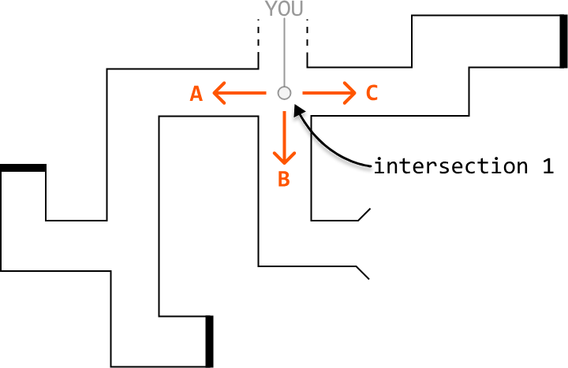

However, you're not sure which route to take. To find the exit, you decide to try each option one by one, starting with option A. As you walk through passage A, you encounter a new intersection containing two more routes, D and E:

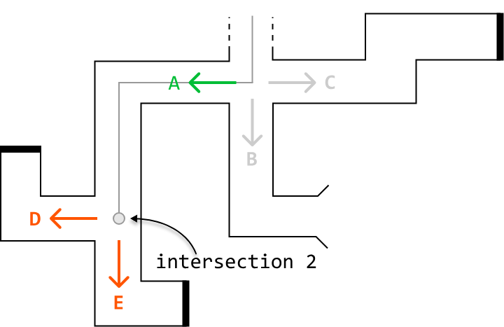

You try option D, but it leads to a dead end. So, you backtrack to the second intersection point:

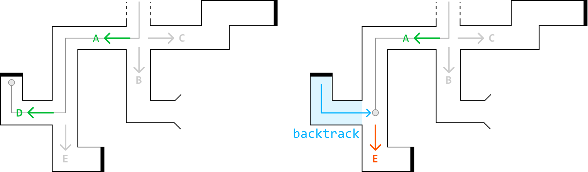

Next, you try option E, but it also leads to a dead end, so you backtrack to the second junction point. After concluding that neither path D nor E works, you backtrack again to the first intersection point:

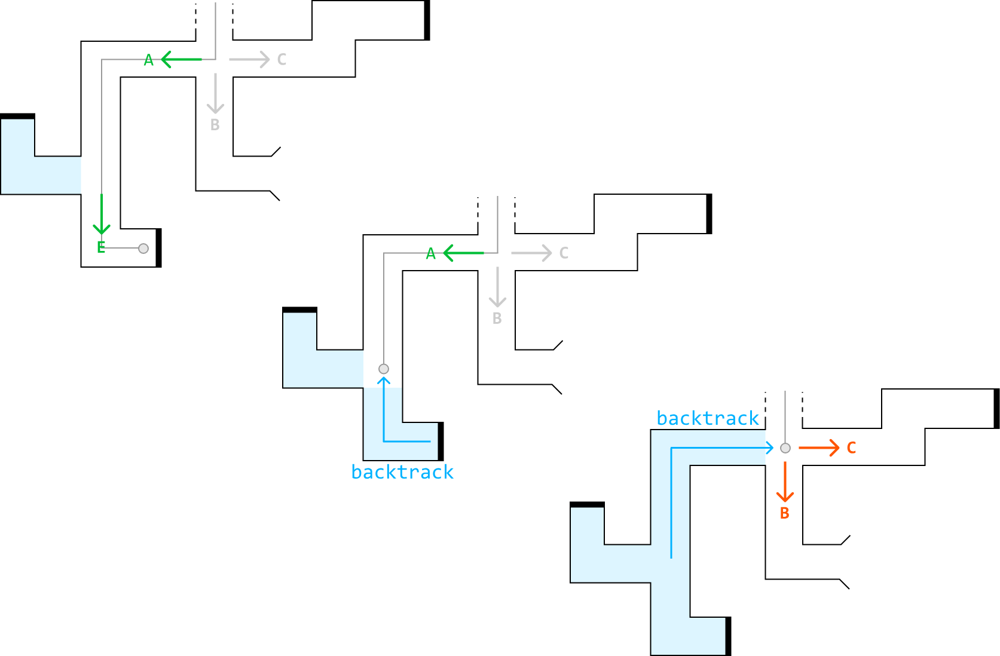

Having determined that path A doesn't lead to the exit, you move on to path B and discover that it leads to the exit:

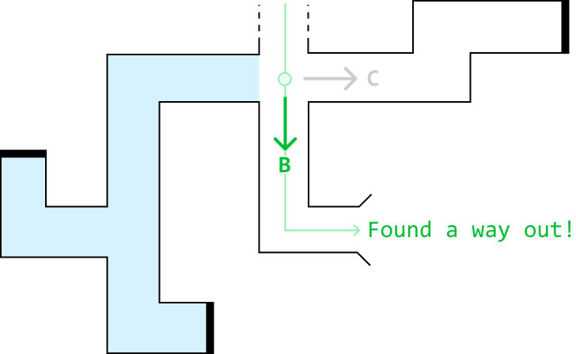

This brute force process of testing all possible paths and backtracking upon failure is called 'backtracking.'

## State space tree

In backtracking, the state space tree, also known as the decision tree, is a conceptual tree constructed by considering every possible decision that can be made at each point in a process.

For example, here's how we would represent the state space tree for the maze scenario:

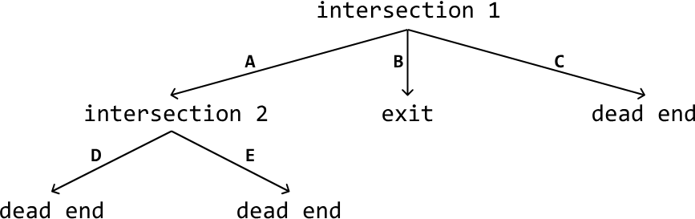

Here's a simplified explanation of a state space tree:

- **Edges:** Each edge represents a possible decision, move, or action.

- **Root node:** The root node represents the initial state or position before any decisions are made.

- **Intermediate nodes:** Nodes representing partially completed states or intermediate positions.

- **Leaf nodes:** The leaf nodes represent complete or invalid solutions.

- **Path:** A path from the root to any leaf node represents a sequence of decisions that lead to a complete or invalid solution.

Drawing out the state space tree for a problem helps to visualize the entire solution space, and all possible decisions. In addition, it's a great way to understand how the algorithm works. By figuring out how to traverse this tree, we essentially create the backtracking algorithm.

## Backtracking algorithm

Traversing the state space tree is typically done using recursive DFS. Let's discuss how it's implemented at a high level.

**Termination condition:** Define the condition that specifies when a path should end. This condition should define when we've found a valid and/or invalid solution.

**Iterate through decisions:** Iterate through every possible decision at the current node, which contains the current state of the problem. For each decision:

1. Make that decision and update the current state accordingly.

2. Recursively explore all paths that branch from this updated state by calling the DFS function on this state.

3. Backtrack by undoing the decision we made and reverting the state.

Below is a crude template for backtracking:

### Python
```python
def dfs(state):
    # Termination condition.
    if meets_termination_condition(state):
        process_solution(state)
        return
    # Explore each possible decision that can be made at the current state.
    for decision in possible_decisions(state):
        make_decision(state, decision)
        dfs(state)
        undo_decision(state, decision)  # Backtrack.
```
### JavaScript
```javascript
function dfs(state) {
  // Termination condition.
  if (meetsTerminationCondition(state)) {
    processSolution(state)
    return
  }
  // Explore each possible decision that can be made at the current state.
  for (const decision of possibleDecisions(state)) {
    makeDecision(state, decision)
    dfs(state)
    undoDecision(state, decision) // Backtrack.
  }
}
```
### Java
```java
public void dfs(State state) {
   // Termination condition.
   if (meetsTerminationCondition(state)) {
       processSolution(state);
       return;
   }
   // Explore each possible decision that can be made at the current state.
   for (Decision decision : possibleDecisions(state)) {
       makeDecision(state, decision);
       dfs(state);
       undoDecision(state, decision); // Backtrack.
   }
}
```
### Analyzing time complexity

Analyzing the time complexity of backtracking algorithms involves understanding the branching factor and the depth of the state space tree:

- **Branching factor:** The number of children each node has. It typically represents the maximum number of decisions that can be made for a given state.

- **Depth:** The length of the deepest path in the state space tree. It corresponds to the number of decisions or steps required to reach a complete solution.

The time complexity is often estimated as O(b⋅d), where b denotes the branching factor and d denotes the depth. This is because in the worst case, every node at each level of the tree needs to be explored during a typical backtracking algorithm.

## When to use backtracking

Backtracking is useful when we need to explore all possible solutions to a problem. For example, if we need to find all possible ways to arrange items, or generate all possible subsets, permutations, or combinations, backtracking can help to identify every possible solution.

**Real-world Example**

AI algorithms for games: backtracking is used in AI algorithms for games like chess and Go to explore possible moves and strategies. The programs examine each potential move, simulate the game's progression, and evaluate the outcome. If a move leads to an unfavorable position, the program will backtrack to the previous move and try alternative options, systematically exploring the game tree until it finds the optimal strategy.

## Chapter Outline

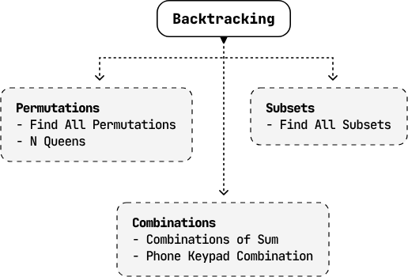


---


# Find All Permutations

Return all possible permutations of a given array of unique integers. They can be returned in any order.

**Example:**

**Input:** nums = [4, 5, 6]

**Output:** [[4, 5, 6], [4, 6, 5], [5, 4, 6], [5, 6, 4], [6, 4, 5], [6, 5, 4]]

## Intuition

Our task in this problem is quite straightforward: find all permutations of a given array. The key word here is "all". To achieve this, we need an algorithm that generates each possible permutation one at a time. The technique that naturally fits this requirement is backtracking. As with any backtracking solution, it's useful to first visualize the state space tree.

## State space tree

Let's figure out how to build just one permutation. Consider the array [4, 5, 6]. We can start by picking one number from this array for the first position of this permutation. For the second position, let's pick a different number. We can keep adding numbers like this until all the numbers from the array are used. To avoid reusing numbers, let's also keep track of the used numbers using a hash set.

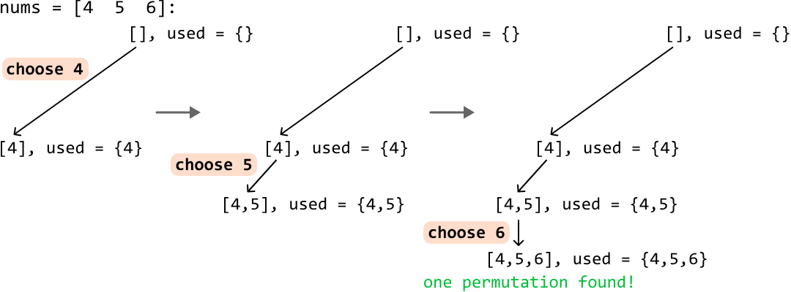

Now that we've found one permutation, let's backtrack to find others. Start by removing the most recently added number, 6, bringing us back to [4, 5]:

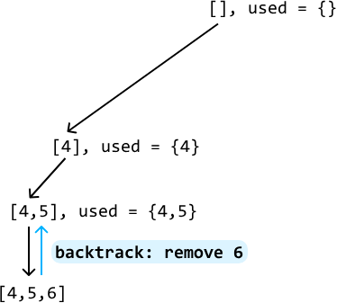

Are there any other numbers we can append to [4, 5]? Well, 6 is the only option at this point, which we already explored. So, let's backtrack again by removing 5, bringing us back to [4]:

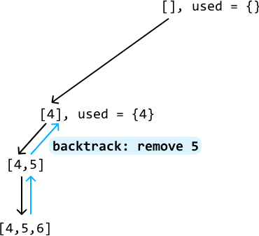

Are there any numbers other than 5 we can add to [4] at this point? Yes, we can use 6, so let's add it and continue searching:

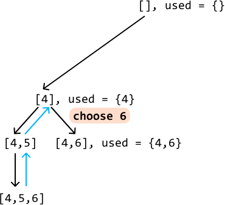

The only number we can use at this point is 5, so let's add it to [4, 6], giving us another permutation:

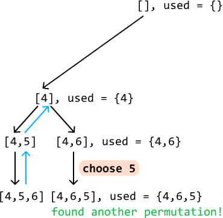

Following this backtracking process until we've explored all branches allows us to generate all permutations:

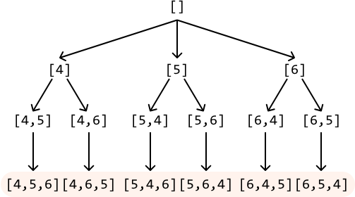

Every time we reach a permutation (i.e., when the permutation we're building reaches a size of n, where n denotes the length of the input array), add it to our output.

## Traversing the state space tree

Generating all permutations can be achieved by traversing the state space tree.

Each node in this tree, except leaf nodes, represents a permutation candidate: a partially completed permutation that we're building. The root node represents an empty permutation, and an element is added to each permutation candidate as we progress deeper into the tree. The leaf nodes represent completed permutations.

Starting from the root node, we can traverse this tree using backtracking:

1. Pick an unused number and add it to the current permutation candidate. Mark this number as used by adding it to the used hash set.

2. Make a recursive call with this updated permutation candidate to explore its branches.

3. Backtrack: remove the last number we added to the current candidate array, and the used hash set.

Whenever a permutation candidate reaches the length of n, add it to our output.

## Try it yourself

Write your solution to the problem before checking the reference implementation.

## Implementation

### Python
```python
from typing import List, Set
    
def find_all_permutations(nums: List[int]) -> List[List[int]]:
    res = []
    backtrack(nums, [], set(), res)
    return res
    
def backtrack(nums: List[int], candidate: List[int], used: Set[int], res: List[List[int]]) -> None:
    # If the current candidate is a complete permutation, add it to the result.
    if len(candidate) == len(nums):
        res.append(candidate[:])
        return
    for num in nums:
        if num not in used:
            # Add 'num' to the current permutation and mark it as used.
            candidate.append(num)
            used.add(num)
            # Recursively explore all branches using the updated permutation
            # candidate.
            backtrack(nums, candidate, used, res)
            # Backtrack by reversing the changes made.
            candidate.pop()
            used.remove(num)
```
### JavaScript
```javascript
export function find_all_permutations(nums) {
  const res = []
  backtrack(nums, [], new Set(), res)
  return res
}

function backtrack(nums, candidate, used, res) {
  // If the current candidate is a complete permutation, add it to the result.
  if (candidate.length === nums.length) {
    res.push([...candidate]) // Make a shallow copy
    return
  }
  for (const num of nums) {
    if (!used.has(num)) {
      // Add 'num' to the current permutation and mark it as used.
      candidate.push(num)
      used.add(num)
      // Recursively explore all branches using the updated permutation candidate.
      backtrack(nums, candidate, used, res)
      // Backtrack by reversing the changes made.
      candidate.pop()
      used.delete(num)
    }
  }
}
```
### Java
```java
import java.util.ArrayList;
import java.util.HashSet;

public class Main {
    public static ArrayList<ArrayList<Integer>> find_all_permutations(ArrayList<Integer> nums) {
        ArrayList<ArrayList<Integer>> res = new ArrayList<>();
        backtrack(nums, new ArrayList<>(), new HashSet<>(), res);
        return res;
    }

    public static void backtrack(ArrayList<Integer> nums, ArrayList<Integer> candidate,
                                 HashSet<Integer> used, ArrayList<ArrayList<Integer>> res) {
        // If the current candidate is a complete permutation, add it to the result.
        if (candidate.size() == nums.size()) {
            res.add(new ArrayList<>(candidate));
            return;
        }
        for (Integer num : nums) {
            if (!used.contains(num)) {
                // Add 'num' to the current permutation and mark it as used.
                candidate.add(num);
                used.add(num);
                // Recursively explore all branches using the updated permutation
                // candidate.
                backtrack(nums, candidate, used, res);
                // Backtrack by reversing the changes made.
                candidate.remove(candidate.size() - 1);
                used.remove(num);
            }
        }
    }
}
```
## Complexity Analysis

**Time complexity:** The time complexity of `find_all_permutations` is O(n⋅n!). Here's why:

- Starting from the root, we recursively explore n candidates.
- For each of these n candidates, we explore n−1 more candidates, then n−2 more candidates, etc, until we have explored all permutations. This results in a total of n⋅(n−1)⋅(n−2)…1 = n! permutations.
- For each of the n! permutations, we make a copy of it and add it to the output, which takes O(n) time.

This results in a total time complexity of O(n!) ⋅ O(n) = O(n⋅n!).

**Space complexity:** The space complexity is O(n) because the maximum depth of the recursion tree is n. The algorithm also maintains the `candidate` and `used` data structures, both of which also contribute O(n) space. Note, the `res` array does not contribute to space complexity.


---


# Find All Subsets

Return all possible subsets of a given set of unique integers. Each subset can be ordered in any way, and the subsets can be returned in any order.

**Example:**

**Input:** nums = [4, 5, 6]

**Output:** [[], [4], [4, 5], [4, 5, 6], [4, 6], [5], [5, 6], [6]]

## Intuition

The key intuition for solving this problem lies in understanding that each subset is formed by making a specific decision for every number in the input array: to include the number, or exclude it. For example, from the array [4, 5, 6], the subset [4, 6] is created by including 4, excluding 5, and including 6.

Let's have a look at what the state space tree looks like when making this decision for every element.

## State space tree

Consider the input array [4, 5, 6]. Let's start with the root node of the tree, which is an empty subset:


To figure out how we branch out from here, let's consider our decision of whether to include or exclude an element. Let's make this decision with the first element of the input array, 4:

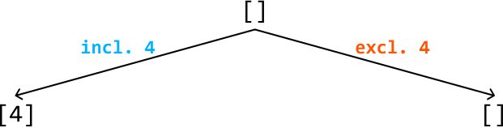

For each of these subsets, we repeat the process, branching out again based on the same choice for the second element: include or exclude it:

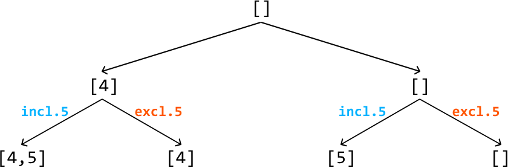

Finally, for the third element, we continue branching out for each existing subset based on whether we include or exclude this element:

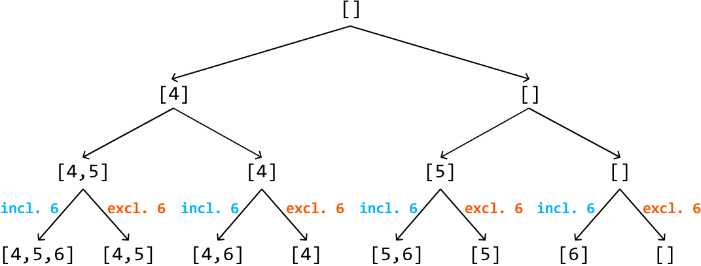

One important thing missing from this state space tree is a way to tell which element of the input array we're making a decision on at each node of the tree. We can use an index, i, for this:

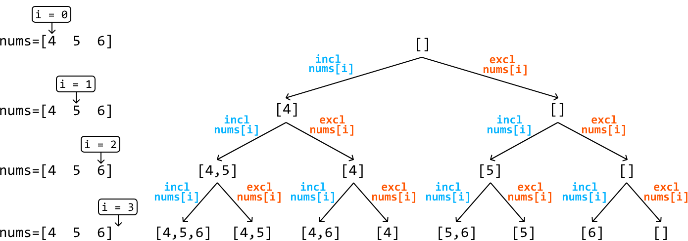

As shown, the final level of the tree (i.e., when i == n, where n denotes the length of the input array) contains all the subsets of the input array. We can add each of these subsets to our output. To get to these subsets, we need to traverse the tree, and backtracking is great for this.

## Try it yourself

Write your solution to the problem before checking the reference implementation.

## Implementation

### Python
```python
from typing import List
    
def find_all_subsets(nums: List[int]) -> List[List[int]]:
    res = []
    backtrack(0, [], nums, res)
    return res
    
def backtrack(i: int, curr_subset: List[int], nums: List[int], res: List[List[int]]) -> None:
    # Base case: if all elements have been considered, add the current subset to the
    # output.
    if i == len(nums):
        res.append(curr_subset[:])
        return
    # Include the current element and recursively explore all paths that branch from
    # this subset.
    curr_subset.append(nums[i])
    backtrack(i + 1, curr_subset, nums, res)
    # Exclude the current element and recursively explore all paths that branch from
    # this subset.
    curr_subset.pop()
    backtrack(i + 1, curr_subset, nums, res)
```
### JavaScript
```javascript
export function find_all_subsets(nums) {
  const res = []
  backtrack(0, [], nums, res)
  return res
}

function backtrack(i, curr_subset, nums, res) {
  // Base case: if all elements have been considered, add the current subset to
  // the output list.
  if (i === nums.length) {
    res.push([...curr_subset])
    return
  }
  // Include the current element and recursively explore all paths that branch from
  // this subset.
  curr_subset.push(nums[i])
  backtrack(i + 1, curr_subset, nums, res)
  // Exclude the current element and recursively explore all paths that branch from
  // this subset.
  curr_subset.pop()
  backtrack(i + 1, curr_subset, nums, res)
}
```
### Java
```java
import java.util.ArrayList;

public class Main {
    public static ArrayList<ArrayList<Integer>> find_all_subsets(ArrayList<Integer> nums) {
        ArrayList<ArrayList<Integer>> res = new ArrayList<>();
        backtrack(0, new ArrayList<>(), nums, res);
        return res;
    }

    public static void backtrack(int i, ArrayList<Integer> curr_subset,
                                 ArrayList<Integer> nums, ArrayList<ArrayList<Integer>> res) {
        // Base case: if all elements have been considered, add the current subset to the
        // output.
        if (i == nums.size()) {
            res.add(new ArrayList<>(curr_subset));
            return;
        }
        // Include the current element and recursively explore all paths that branch from
        // this subset.
        curr_subset.add(nums.get(i));
        backtrack(i + 1, curr_subset, nums, res);
        // Exclude the current element and recursively explore all paths that branch from
        // this subset.
        curr_subset.remove(curr_subset.size() - 1);
        backtrack(i + 1, curr_subset, nums, res);
    }
}
```
## Complexity Analysis

**Time complexity:** The time complexity of `find_all_subsets` is O(n2⋅n). This is because the state space tree has a depth of n and a branching factor of 2 since there are two decisions we make at each state. For each of the 2n subsets created, we make a copy of them and add the copy to the output, which takes O(n) time. This results in a total time complexity of O(n2⋅n).

**Space complexity:** The space complexity is O(n) because the maximum depth of the recursion tree is n. The algorithm also maintains the `curr_subset` data structure, which also contributes O(n) space. Note, the `res` array does not contribute to space complexity.


---


# N Queens

There is a chessboard of size n x n. Your goal is to place n queens on the board such that no two queens attack each other. Return the number of distinct configurations where this is possible.

**Example:**

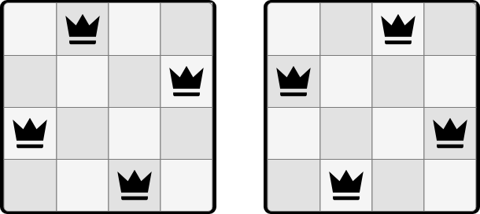

**Input:** n = 4

**Output:** 2

## Intuition

Queens can move vertically, horizontally, and diagonally:

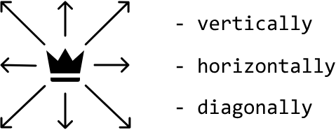

So, it's only possible to place a queen on a square of the board when:

- No other queen occupies the same row of that square.
- No other queen occupies the same column of that square.
- No other queen occupies either diagonal of that square.

Based on this, let's identify a method for placing the queens.

## Placing the queens - backtracking

A straightforward strategy is to place one queen on the board at a time, making sure each new queen is placed on a safe square where it can't be attacked. If we can no longer safely place a queen, it means one or more of the previously placed queens need to be repositioned. In this case, we backtrack by changing the position of the previous queen and trying again.

To make backtracking more efficient, we can place each queen on a new row. This way, we don't have to worry about conflicts between queens on the same row, and only need to check for an opposing queen on the same column and along the diagonals of the square where the new queen is placed. If a queen cannot be placed anywhere on this new row, we backtrack, reposition the previous row's queen, and then try again:

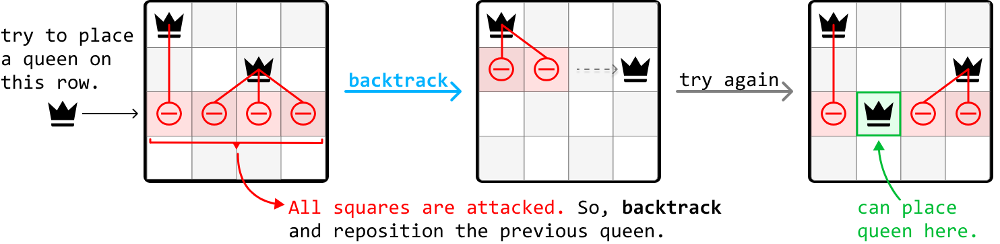

A partial state space tree for this backtracking process is visualized below for n = 4:

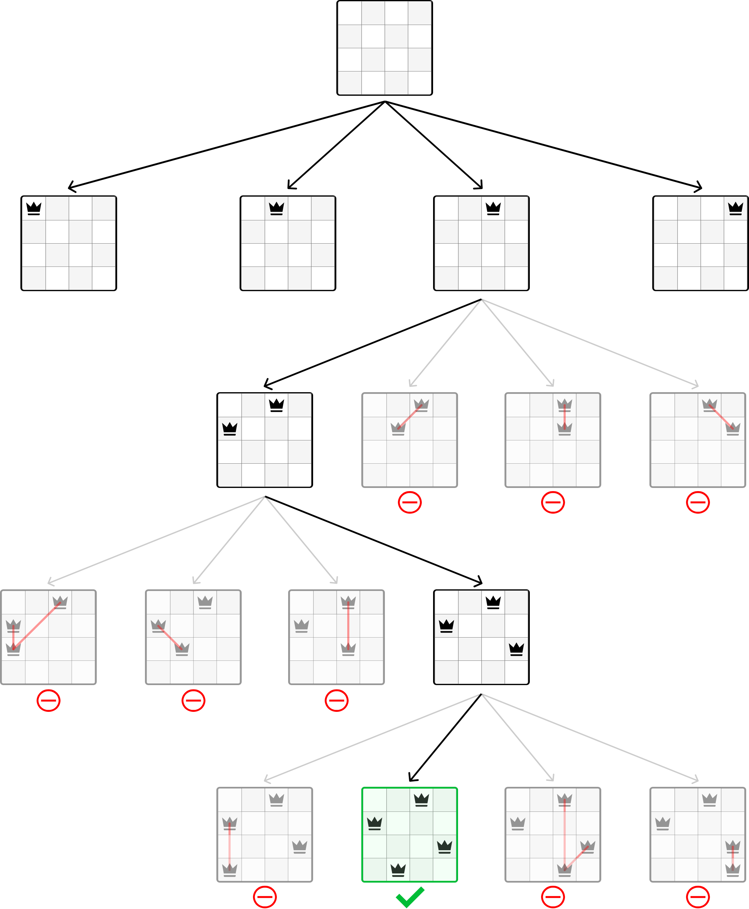

We're still left with some questions. In particular, how can we tell if a square is being attacked, and how exactly do we "place" or "remove" a queen?

## Detecting opposing queens

One challenge in this problem is determining if a square is attacked by another queen. We could do a linear search across the row, column, and diagonals every time we want to place a new queen, but this is quite inefficient. A key observation is that we don't necessarily need to know the exact positions of all the queens. We only need to know if there exists a queen in any given square's row, column, or diagonals. We can use hash sets to efficiently check for this.

Note that we don't need a hash set for rows because we always place each queen on a different row. For columns, whenever we place a new queen on a square (r, c), we can add that square's column id (c) to a column hash set.

What about diagonals? How can we determine which diagonal we're on? Since there are two types of diagonals, let's refer to the diagonal that goes from top-left to bottom-right as the "diagonal", and the one that goes from top-right to bottom-left as the "anti-diagonal". Consider the following diagrams:

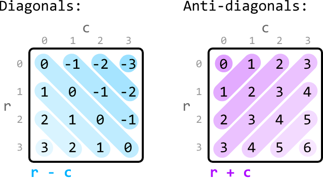

The key observation here is that, for any square (r, c), its diagonal can be identified using the id r - c, and its anti-diagonal is identified using the id r + c. Similarly to how we keep track of column ids, we can use a diagonal and an anti-diagonal hash set to keep track of diagonal and anti-diagonal ids, respectively.

## Placing and removing a queen

Now that we have a way to identify opposing queens, we know the action of "placing" a queen means adding its column, diagonal, and anti-diagonal ids to their respective hash sets. Inversely, to remove a queen, we just remove those exact ids from the hash sets.

## Try it yourself

Write your solution to the problem before checking the reference implementation.

## Implementation

Note, this implementation uses a global variable as it leads to a more readable solution. However, it's important to confirm with your interviewer whether global variables are acceptable.

### Python
```python
from typing import Set
    
res = 0
    
def n_queens(n: int) -> int:
   dfs(0, set(), set(), set(), n)
   return res
    
def dfs(r: int, diagonals_set: Set[int], anti_diagonals_set: Set[int], cols_set: Set[int], n: int) -> None:
    global res
    # Termination condition: If we have reached the end of the rows, we've placed all
    # 'n' queens.
    if r == n:
        res += 1
        return
    for c in range(n):
        curr_diagonal = r - c
        curr_anti_diagonal = r + c
        # If there are queens on the current column, diagonal or anti-diagonal, skip
        # this square.
        if (c in cols_set or curr_diagonal in diagonals_set or curr_anti_diagonal in anti_diagonals_set):
            continue
        # Place the queen by marking the current column, diagonal, and anti-diagonal
        # as occupied.
        cols_set.add(c)
        diagonals_set.add(curr_diagonal)
        anti_diagonals_set.add(curr_anti_diagonal)
        # Recursively move to the next row to continue placing queens.
        dfs(r + 1, diagonals_set, anti_diagonals_set, cols_set, n)
        # Backtrack by removing the current column, diagonal, and anti-diagonal from
        # the hash sets.
        cols_set.remove(c)
        diagonals_set.remove(curr_diagonal)
        anti_diagonals_set.remove(curr_anti_diagonal)
```
### JavaScript
```javascript
let res = 0

export function n_queens(n) {
  res = 0
  dfs(0, new Set(), new Set(), new Set(), n)
  return res
}

function dfs(r, diagonalsSet, antiDiagonalsSet, colsSet, n) {
  // Termination condition: If we have reached the end of the rows, we've placed all 'n' queens.
  if (r === n) {
    res += 1
    return
  }
  for (let c = 0; c < n; c++) {
    const currDiagonal = r - c
    const currAntiDiagonal = r + c
    // If there are queens on the current column, diagonal or anti-diagonal, skip this square.
    if (
      colsSet.has(c) ||
      diagonalsSet.has(currDiagonal) ||
      antiDiagonalsSet.has(currAntiDiagonal)
    ) {
      continue
    }
    // Place the queen by marking the current column, diagonal, and anti-diagonal as occupied.
    colsSet.add(c)
    diagonalsSet.add(currDiagonal)
    antiDiagonalsSet.add(currAntiDiagonal)
    // Recursively move to the next row to continue placing queens.
    dfs(r + 1, diagonalsSet, antiDiagonalsSet, colsSet, n)
    // Backtrack by removing the current column, diagonal, and anti-diagonal from the sets.
    colsSet.delete(c)
    diagonalsSet.delete(currDiagonal)
    antiDiagonalsSet.delete(currAntiDiagonal)
  }
}
```
### Java
```java
import java.util.HashSet;

public class Main {
    private static int res = 0;

    public static int n_queens(int n) {
        dfs(0, new HashSet<>(), new HashSet<>(), new HashSet<>(), n);
        return res;
    }

    public static void dfs(int r, HashSet<Integer> diagonals_set, HashSet<Integer> anti_diagonals_set,
                           HashSet<Integer> cols_set, int n) {
        // Termination condition: If we have reached the end of the rows, we've placed all
        // 'n' queens.
        if (r == n) {
            res += 1;
            return;
        }
        for (int c = 0; c < n; c++) {
            int curr_diagonal = r - c;
            int curr_anti_diagonal = r + c;
            // If there are queens on the current column, diagonal or anti-diagonal, skip
            // this square.
            if (cols_set.contains(c) || diagonals_set.contains(curr_diagonal) || anti_diagonals_set.contains(curr_anti_diagonal)) {
                continue;
            }
            // Place the queen by marking the current column, diagonal, and anti-diagonal
            // as occupied.
            cols_set.add(c);
            diagonals_set.add(curr_diagonal);
            anti_diagonals_set.add(curr_anti_diagonal);
            // Recursively move to the next row to continue placing queens.
            dfs(r + 1, diagonals_set, anti_diagonals_set, cols_set, n);
            // Backtrack by removing the current column, diagonal, and anti-diagonal from
            // the hash sets.
            cols_set.remove(c);
            diagonals_set.remove(curr_diagonal);
            anti_diagonals_set.remove(curr_anti_diagonal);
        }
    }
}
```
## Complexity Analysis

**Time complexity:** The time complexity of `n_queens` is O(n!). Here's why:

- For the first queen, there are n choices for its position.
- For the second queen, there are n−a choices for its position, where a denotes the number of squares on the second row attacked by the first queen.
- The third queen has n−b choices, where b denotes the number of squares on the third row attacked by the previous two queens, and b < a.
- This process continues for subsequent queens, resulting in a total of n⋅(n−a)⋅(n−b)…1 choices. Even though this doesn't exactly equate to n! (n⋅(n−1)⋅(n−2)…1), this trend approximately results in a factorial growth of the search space.

**Space complexity:** The space complexity is O(n) because the maximum depth of the recursion tree is n. The hash sets also contribute to this space complexity because they each store up to n values.


---


# Combinations of a Sum

Given an integer array and a target value, find all unique combinations in the array where the numbers in each combination sum to the target. Each number in the array may be used an unlimited number of times in the combination.

**Example:**

**Input:** nums = [1, 2, 3], target = 4

**Output:** [[1, 1, 1, 1], [1, 1, 2], [1, 3], [2, 2]]

**Constraints:**

- All integers in nums are positive and unique.
- The target value is positive.
- The output must not contain duplicate combinations. For example, [1, 1, 2] and [1, 2, 1] are considered the same combination.

## Intuition

Since we can use each integer in the input array as many times as we like, we can create an infinite number of combinations. We certainly cannot explore combinations infinitely. So, to manage this, we need to narrow our search.

An important point that will help us with this is that all values in the integer array are positive integers. This means that as we add more values to a combination, its sum will increase. Therefore, we should stop building a combination once its sum is equal to or exceeds the target value.

Another thing we should be mindful of is duplicate combinations. Consider the input array [1, 2, 3]. The combinations [1, 3, 2, 1] and [2, 1, 3, 1] represent the same combination. To ensure a universal representation, we can represent this combination as [1, 1, 2, 3], where the integers appear in the same order as in the original array. To ensure every combination has only one version, we need to build the combinations so that they are all ordered this way.

With those two things in mind, let's think about how we find all combinations that sum to the target value. Backtracking is ideal for exploring all possible combinations, so let's start by considering the state space tree for this problem.

## State space tree

The purpose of a state space tree is to show combinations getting built one number at a time. Consider the input array [1, 2, 3] and a target of 4. Let's start with the root node of the tree, which is an empty combination:

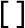

To figure out how to branch out from here, let's identify what decisions we can make. Each element can be included in a combination an unlimited number of times. So, this means we can make three decisions for an array of length 3: include each element from the array (remember that a branch in the state space tree represents a decision):

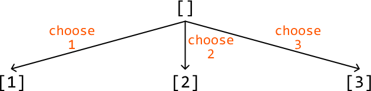

Let's make the same decisions for each of these combinations as well to continue extending the state space tree. Remember that if any combination has a sum equal to 4 or exceeding 4, we stop extending those combinations. These two conditions are effectively our termination conditions:

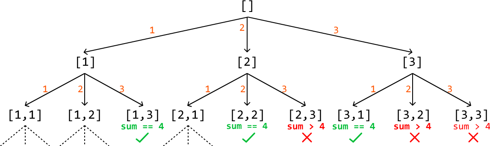

One issue with this approach is that it resulted in duplicate combinations in our tree:

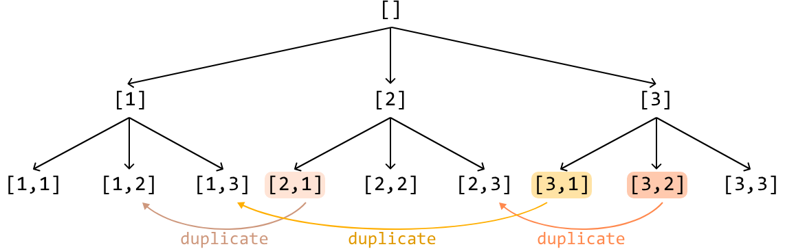

To avoid these duplicates, we should keep in mind our universal representation: each combination should be constructed such that its elements are listed in the same order as in the input array. We can enforce this by specifying an index 'start_index' for each combination we create. This start_index points to a value in the input array and ensures that we can only add elements from this value onward. This way, we maintain the correct order and avoid duplicates in our combinations:

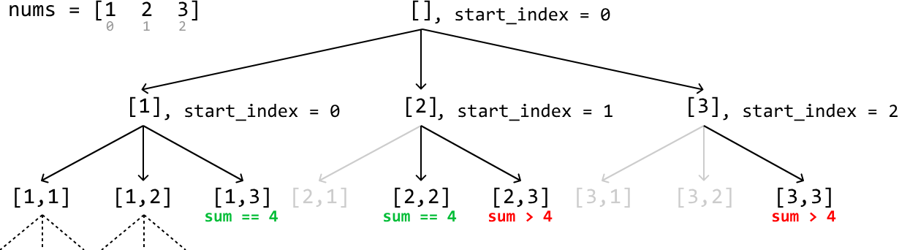

Initially, for the root combination, start_index is set to 0. As we recursively build each combination, start_index is updated to the index of the current element being added. By doing this, we ensure that in the next recursive call, we only consider elements from the updated index onward in the input array.

This maintains the required order and prevents duplicates because we never revisit previous elements. Since each combination is built by only adding elements that come after the current element in the input array, we avoid generating the same combination in a different order.

## Try it yourself

Write your solution to the problem before checking the reference implementation.

## Implementation

In our algorithm, the termination condition requires us to know the sum of the current combination. While we could use a separate variable to track the sum of each combination, this isn't necessary. Instead, we can repurpose our target value. When we choose a number to a combination, we reduce the target value by that number. This way, the target value dynamically tracks the remaining sum needed to reach the original target. We see how this works below, where the target gets reduced by the value we add to the combination:

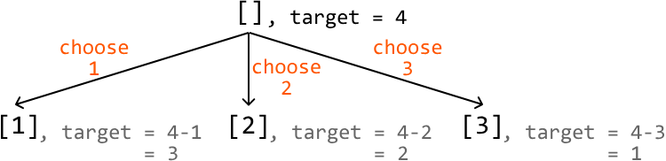

This means that when we reach a target of 0, we've found a valid combination. If the target becomes negative, we can terminate the current branch of the search:

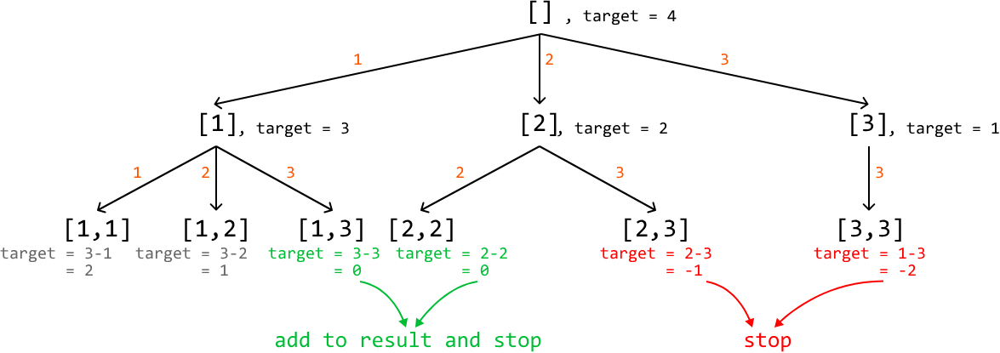

### Python
```python
from typing import List
    
def combinations_of_sum_k(nums: List[int], target: int) -> List[List[int]]:
    res = []
    dfs([], 0, nums, target, res)
    return res
    
def dfs(combination: List[int], start_index: int, nums: List[int], target: int,
        res: List[List[int]]) -> None:
    # Termination condition: If the target is equal to 0, we found a combination
    # that sums to 'k'.
    if target == 0:
        res.append(combination[:])
        return
    # Termination condition: If the target is less than 0, no more valid
    # combinations can be created by adding it to the current combination.
    if target < 0:
        return
    # Starting from start_index, explore all combinations after adding nums[i].
    for i in range(start_index, len(nums)):
        # Add the current number to create a new combination.
        combination.append(nums[i])
        # Recursively explore all paths that branch from this new combination.
        dfs(combination, i, nums, target - nums[i], res)
        # Backtrack by removing the number we just added.
        combination.pop()
```
### JavaScript
```javascript
export function combinations_of_sum_k(nums, target) {
  const res = []
  dfs([], 0, nums, target, res)
  return res
}

function dfs(combination, startIndex, nums, target, res) {
  // Termination condition: If the target is equal to 0, we found a combination
  // that sums to 'k'.
  if (target === 0) {
    res.push([...combination])
    return
  }
  // Termination condition: If the target is less than 0, no more valid
  // combinations can be created by adding it to the current combination.
  if (target < 0) {
    return
  }
  // Starting from startIndex, explore all combinations after adding nums[i].
  for (let i = startIndex; i < nums.length; i++) {
    // Add the current number to create a new combination.
    combination.push(nums[i])
    // Recursively explore all paths that branch from this new combination.
    dfs(combination, i, nums, target - nums[i], res)
    // Backtrack by removing the number we just added.
    combination.pop()
  }
}
```
### Java
```java
import java.util.ArrayList;

public class Main {
    public ArrayList<ArrayList<Integer>> combinations_of_sum_k(ArrayList<Integer> nums, int target) {
        ArrayList<ArrayList<Integer>> res = new ArrayList<>();
        dfs(new ArrayList<>(), 0, nums, target, res);
        return res;
    }

    public void dfs(ArrayList<Integer> combination, int start_index,
                           ArrayList<Integer> nums, int target,
                           ArrayList<ArrayList<Integer>> res) {
        // Termination condition: If the target is equal to 0, we found a combination
        // that sums to 'k'.
        if (target == 0) {
            res.add(new ArrayList<>(combination));
            return;
        }
        // Termination condition: If the target is less than 0, no more valid
        // combinations can be created by adding it to the current combination.
        if (target < 0) {
            return;
        }
        // Starting from start_index, explore all combinations after adding nums[i].
        for (int i = start_index; i < nums.size(); i++) {
            // Add the current number to create a new combination.
            combination.add(nums.get(i));
            // Recursively explore all paths that branch from this new combination.
            dfs(combination, i, nums, target - nums.get(i), res);
            // Backtrack by removing the number we just added.
            combination.remove(combination.size() - 1);
        }
    }
}
```
## Complexity Analysis

**Time complexity:** The time complexity of `combinations_of_sum_k` is O(n^(target/m)), where n denotes the length of the array, and m denotes the smallest candidate. This is because, in the worst case, we always add the smallest candidate m to our combination. The recursion tree will branch down until the sum of the smallest candidates reaches or exceeds the target. This results in a tree depth of target/m. Since the function makes a recursive call for up to n candidates at each level of the recursion, the branching factor is n, giving us the time complexity of O(n^(target/m)).

**Space complexity:** The space complexity is O(target/m), which includes:

- The recursive call stack depth, which is at most target/m in depth.

- The combination list can also require at most O(target/m) space since the longest combination would consist of the smallest element m repeated target/m times.


---


# Phone Keypad Combinations

You are given a string containing digits from 2 to 9 inclusive. Each digit maps to a set of letters as on a traditional phone keypad:

|   |   |   |
|---|---|---|
| 1 | 2  abc | 3  def |
| 4  ghi | 5  jkl | 6  mno |
| 7  pqrs | 8  tuv | 9  wxyz |
|   |   |   |

Return all possible letter combinations the input digits could represent.

**Example:**

**Input:** digits = '69'

**Output:** ['mw', 'mx', 'my', 'mz', 'nw', 'nx', 'ny', 'nz', 'ow', 'ox', 'oy', 'oz']

## Intuition

At each digit in the string, we have a decision to make: which letter will this digit represent? Based on this decision, let's illustrate the state space tree that represents the choices at each digit of the input string.

## State space tree

Consider the input string "69". Let's start with the root node of the tree, which is an empty string:


At the first digit, 6, we have the choice of starting our combination with 'm', 'n', or 'o':

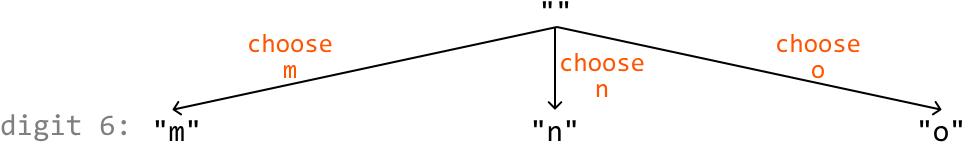

For each of these combinations we've created, we now have a new decision to make: which letter of digit 9 ('w', 'x', 'y', 'z') should we choose? These choices are illustrated below:

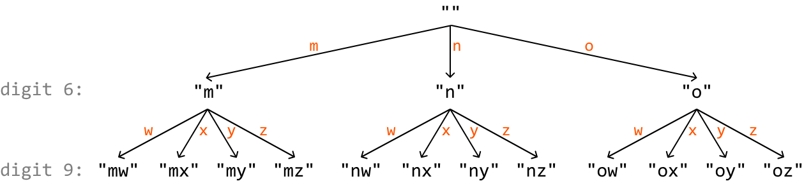

One important thing missing from this state space tree is information on which digit we're making a decision on at each node. We can use an index i to determine which digit we're considering at each node:

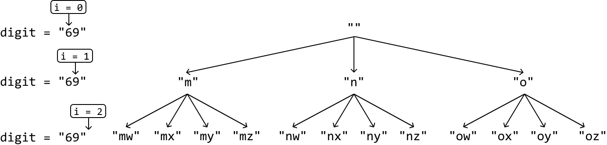

The final level of this decision tree (i.e., when i == n, where n denotes the length of the input string) represents all possible combinations that can be created from the provided string. Similar to our approach in Find All Subsets, let's use backtracking to obtain these keypad combinations.

## Mapping digits to letters

The final thing we need to figure out is a way to determine which letters correspond to which digits. A hash map is great for this purpose. In the hash map, digits are the keys, and the associated sets of letters are their values. This allows us to access the letters in constant time:

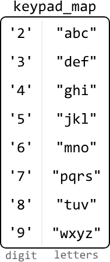

## Try it yourself

Write your solution to the problem before checking the reference implementation.

## Implementation

### Python
```python
def phone_keypad_combinations(digits: str) -> List[str]:
    keypad_map = {
        '2': 'abc', '3': 'def', '4': 'ghi', '5': 'jkl',
        '6': 'mno', '7': 'pqrs', '8': 'tuv', '9': 'wxyz'
    }
    res = []
    backtrack(0, [], digits, keypad_map, res)
    return res

def backtrack(i: int, curr_combination: List[str], digits: str,
             keypad_map: Dict[str, str], res: List[str]) -> None:
    # Termination condition: if all digits have been considered, add the
    # current combination to the output list.
    if len(curr_combination) == len(digits):
        res.append("".join(curr_combination))
        return
    for letter in keypad_map[digits[i]]:
       # Add the current letter.
        curr_combination.append(letter)
        # Recursively explore all paths that branch from this combination.
        backtrack(i + 1, curr_combination, digits, keypad_map, res)
        # Backtrack by removing the letter we just added.
        curr_combination.pop()
```
### JavaScript
```javascript
export function phone_keypad_combinations(digits) {
  const keypadMap = {
    2: 'abc',
    3: 'def',
    4: 'ghi',
    5: 'jkl',
    6: 'mno',
    7: 'pqrs',
    8: 'tuv',
    9: 'wxyz',
  }
  const res = []
  // Special case: digits = "" should return [""].
  if (digits.length === 0) {
    return ['']
  }
  if (!digits.length) return res
  backtrack(0, [], digits, keypadMap, res)
  return res
}

function backtrack(i, currCombination, digits, keypadMap, res) {
  // Termination condition: if all digits have been considered, add the
  // current combination to the output list.
  if (currCombination.length === digits.length) {
    res.push(currCombination.join(''))
    return
  }
  for (const letter of keypadMap[digits[i]]) {
    // Add the current letter.
    currCombination.push(letter)
    // Recursively explore all paths that branch from this combination.
    backtrack(i + 1, currCombination, digits, keypadMap, res)
    // Backtrack by removing the letter we just added.
    currCombination.pop()
  }
}
```
### Java
```java
import java.util.ArrayList;
import java.util.HashMap;

public class Main {
    public static ArrayList<String> phone_keypad_combinations(String digits) {
        HashMap<Character, String> keypad_map = new HashMap<>();
        keypad_map.put('2', "abc");
        keypad_map.put('3', "def");
        keypad_map.put('4', "ghi");
        keypad_map.put('5', "jkl");
        keypad_map.put('6', "mno");
        keypad_map.put('7', "pqrs");
        keypad_map.put('8', "tuv");
        keypad_map.put('9', "wxyz");
        ArrayList<String> res = new ArrayList<>();
        backtrack(0, new StringBuilder(), digits, keypad_map, res);
        return res;
    }

    public static void backtrack(int i, StringBuilder curr_combination, String digits,
                                 HashMap<Character, String> keypad_map, ArrayList<String> res) {
        // Termination condition: if all digits have been considered, add the
        // current combination to the output list.
        if (curr_combination.length() == digits.length()) {
            res.add(curr_combination.toString());
            return;
        }
        String letters = keypad_map.get(digits.charAt(i));
        for (int j = 0; j < letters.length(); j++) {
            char letter = letters.charAt(j);
            // Add the current letter.
            curr_combination.append(letter);
            // Recursively explore all paths that branch from this combination.
            backtrack(i + 1, curr_combination, digits, keypad_map, res);
            // Backtrack by removing the letter we just added.
            curr_combination.deleteCharAt(curr_combination.length() - 1);
        }
    }
}
```
## Complexity Analysis

**Time complexity:** The time complexity of `phone_keypad_combinations` is O(n⋅4^n). This is because the state space tree will branch down until a decision is made for all n elements. This results in a tree of height n with a branching factor of 4 since there are up to 4 decisions we can make at each digit. For each of the 4^n combinations created, we convert it into a string and add it to the output list, which takes O(n) time per combination. This results in a total time complexity of O(n⋅4^n).

**Space complexity:** The space complexity is O(n) due to the recursive call stack, which can grow up to a maximum depth of n. The `keypad_map` only takes constant space since there are only 8 key-value pairs.

## Interview Tip

> **Tip: Check if you can skip trivial implementations.**
>
> During an interview, it's crucial to manage your time effectively. If you encounter a trivial and time-consuming task, such as creating the `keypad_map` in this problem, it's possible the interviewer may allow you to skip it or implement it later if there's time left in the interview. Ensure you at least briefly mention how the implementation you're skipping would work before requesting to move on to the core logic of the problem.