# 15. Dynamic Programming

1. [Introduction to Dynamic Programming](#introduction-to-dynamic-programming)
2. [Climbing Stairs](#climbing-stairs)
3. [Minimum Coin Combination](#minimum-coin-combination)
4. [Matrix Pathways](#matrix-pathways)
5. [Neighborhood Burglary](#neighborhood-burglary)
6. [Longest Common Subsequence](#longest-common-subsequence)
7. [Longest Palindrome in a String](#longest-palindrome-in-a-string)
8. [Maximum Subarray Sum](#maximum-subarray-sum)
9. [0/1 Knapsack](#01-knapsack)
10. [Largest Square in Matrix](#largest-square-in-matrix)

---

# Introduction to Dynamic Programming

Dynamic programming (DP) may seem daunting at first, but we'll break it down into manageable concepts and techniques. First, let's get an idea of what DP aims to do by considering the bigger picture.

Some problems can be broken down into subproblems, where each subproblem is a smaller version of the main problem. These subproblems may themselves be broken down into more subproblems as well. This isn't a foreign concept to us. Recursion is often used to solve problems like these, where we make recursive calls to solve each subproblem.

However, in the recursive process, it's possible to generate and solve the same subproblem multiple times, which can be unnecessarily expensive.

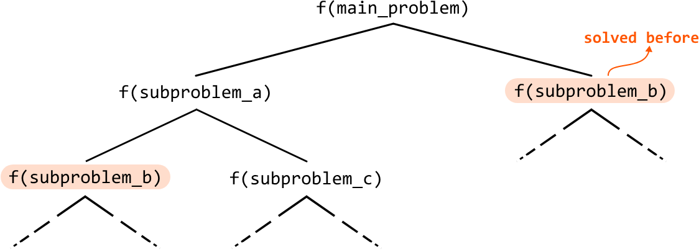

DP is the antidote to this. It's a technique that stores solutions to each subproblem, so they can be reused when they're needed again. In other words, it's an efficient tool that ensures each subproblem is solved at most one time. This can greatly increase the performance of an algorithm.

## The DP process

DP is often perceived as challenging, but it follows a pretty consistent problem-solving process, best demonstrated with an example. First, we'll briefly explain some key DP terms, and then dive into the Climbing Stairs problem to learn how to identify a DP problem and develop a DP solution.

- **Optimal substructure:** the optimal solution to a problem can be constructed from the optimal solutions to its subproblems.

- **Overlapping subproblems:** if the same subproblems are solved repeatedly during the problem-solving process.

- **Recurrence relation:** a formula that expresses the solution to the problem in terms of the solutions to its subproblems.

- **Base cases:** the simplest instances of the problem where the solution is already known, without needing to be decomposed into more subproblems.

The first two terms are essential attributes that a problem must have to be solvable using DP. The last two terms are essential components in every DP solution. These definitions may seem abstract now, but keep them in mind as they will become clearer in the context of a problem.

**Real-world Example**

Word segmentation: Search engines use DP in a process called "word segmentation." When users enter a search query without spaces, DP is employed to determine if white spaces can be added to form valid words. For example, given a query without spaces (like "bestrestaurants"), DP checks all possible ways to insert spaces ("best restaurants," "best rest aunts") by solving each segment (subproblem) separately, and storing their solutions to avoid recalculation.

## Chapter Outline

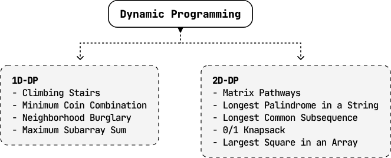

The nature of each DP problem in this chapter is quite unique, but for simplicity, we've grouped them into two categories: one-dimensional DP (1D-DP), and two-dimensional DP (2D-DP).


---


# Climbing Stairs

Determine the number of distinct ways to climb a staircase of n steps by taking either 1 or 2 steps at a time.

**Example:**

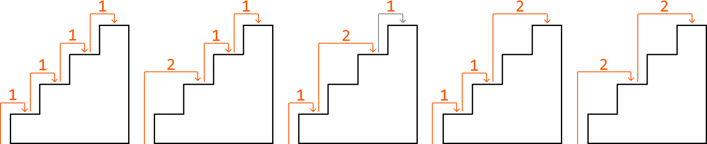

**Input:** n = 4

**Output:** 5

## Intuition - Top-Down

A brute force solution to this problem is to go through all possible combinations of moving 1 or 2 steps up the stairs until reaching the top. How would we do this? Think about how to get to stair i:

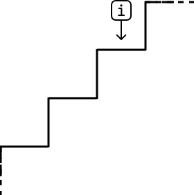

One thing we know for sure is that to reach step i, we need to reach it from either step i - 1, or step i - 2 since we can only climb 1 or 2 steps at a time:

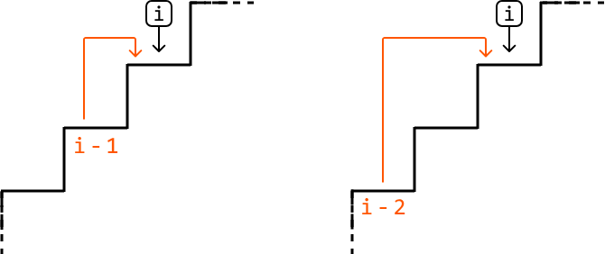

This is all the information we need. If we want to know all the different ways we can get to step i, we just need to know:

- The number of ways to get to step i - 1 (climbing_stairs(i - 1)).
- The number of ways to get to step i - 2 (climbing_stairs(i - 2)).

This highlights that this problem has an optimal substructure where, in order to solve climbing_stairs(n), we need the answers to two of its subproblems. We can translate this to a recurrence relation:

```
climbing_stairs(n) = climbing_stairs(n - 1) + climbing_stairs(n - 2)
```

Let's first implement this using recursion.

To do this, we'll need to identify the base cases, which handle the simplest subproblems. The simplest versions of this problem occur when the number of steps is 1 or 2. If n equals 1, we return 1 since the only way to reach step 1 is to climb 1 step. If n equals 2, return 2 since there are two ways to reach step 2.

If we apply this recursive logic to a staircase of 6 steps, this is what the recursion tree would look like:

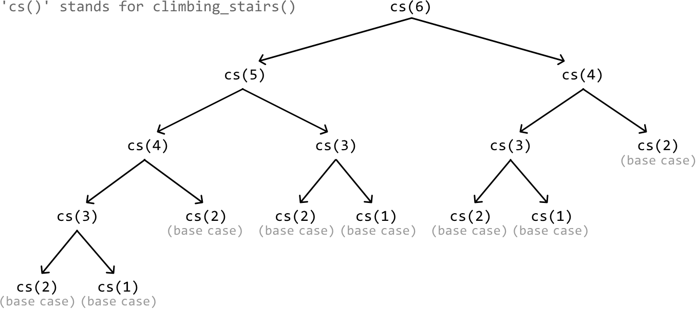

This solution is considered a top-down solution as it starts from the main problem, and recursively breaks it down into smaller subproblems as it progresses down the recursive tree.

You may have noticed in the recursion tree that we do some repeated work by calling the same subproblem multiple times (e.g., climbing_stairs(4) is called twice). This highlights the existence of overlapping subproblems. This isn't a big issue for short staircases, but for a taller one with more steps, it can result in a lot of repeated calculations of subproblems we've already solved. This is where memoization comes into play.

### Memoization

Storing the result of each subproblem the first time we solve it, then reusing these stored results when needed, is a technique known as memoization. For example, after we calculate the subproblem of n = 3 (climbing_stairs(3)) for the first time, we don't need to calculate it again; we can just fetch the already-calculated result for n = 3. The same applies to n = 4. This greatly reduces the size of the recursion tree:

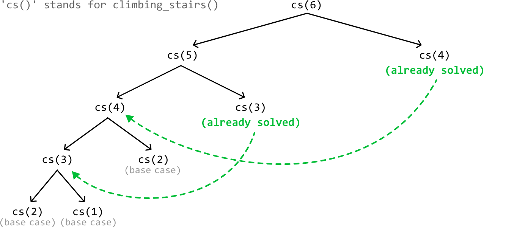

We use a hash map for memoization to store the results of subproblems for constant-time access. For example, after calculating the result for the subproblem n = 3, we store the result in the hash map as a value, where the key is 3.

As we can see, we've successfully implemented a DP solution using top-down memoization. We identified the subproblems, used them to create the recurrence relation, specified our base cases, and applied memoization to ensure each subproblem is solved only once.

## Try it yourself

Write your solution to the problem before checking the reference implementation.

## Implementation - Top-Down

### Python
```python
memo = {}
        
def climbing_stairs_top_down(n: int) -> int:
    # Base cases: With a 1-step staircase, there's only one way to climb it.
    # With a 2-step staircase, there are two ways to climb it.
    if n <= 2:
        return n
    if n in memo:
        return memo[n]
    # The number of ways to climb to the n-th step is equal to the sum of the number
    # of ways to climb to step n - 1 and to n - 2.
    memo[n] = climbing_stairs_top_down(n - 1) + climbing_stairs_top_down(n - 2)
    return memo[n]
```
### JavaScript
```javascript
const memo = {}

export function climbing_stairs_top_down(n) {
  // Base cases: With a 1-step staircase, there’s only one way to climb it.
  // With a 2-step staircase, there are two ways to climb it.
  if (n <= 2) {
    return n
  }
  if (memo[n] !== undefined) {
    return memo[n]
  }
  // The number of ways to climb to the n-th step is equal to the sum of the number
  // of ways to climb to step n - 1 and to n - 2.
  memo[n] = climbing_stairs_top_down(n - 1) + climbing_stairs_top_down(n - 2)
  return memo[n]
}
```
### Java
```java
import java.util.HashMap;

public class Main {
    private HashMap<Integer, Integer> memo = new HashMap<>();

    public int climbing_stairs_top_down(int n) {
        // Base cases: With a 1-step staircase, there’s only one way to climb it.
        // With a 2-step staircase, there are two ways to climb it.
        if (n <= 2) {
            return n;
        }
        if (memo.containsKey(n)) {
            return memo.get(n);
        }
        // The number of ways to climb to the n-th step is equal to the sum of the number
        // of ways to climb to step n - 1 and to n - 2.
        int result = climbing_stairs_top_down(n - 1) + climbing_stairs_top_down(n - 2);
        memo.put(n, result);
        return result;
    }
}
```
## Complexity Analysis

**Time complexity:**

- Without memoization, the time complexity of `climbing_stairs_top_down` is O(2^n) because the depth of the recursion tree is n, and its branching factor is 2 since we make 2 recursive calls at each point in the tree.
- With memoization, we ensure each subproblem is solved only once. Since there are n possible subproblems (one for each step from step 1 to step n), the time complexity is O(n).

**Space complexity:** The space complexity is O(n) due to the recursive call stack, which grows to a height of n. The memoization array also contributes to the space occupied by storing n key-value pairs.

## Intuition - Bottom-Up

Generally, any problem that can be solved using top-down memoization can also be solved using a bottom-up DP approach, where we translate the memoization array to a DP array. Let's explore how this works.

### Translating the memoization array to a DP array

Think about what each value in the DP array represents. We want this array to store the answers to our subproblems (i.e., `dp[i]` should store the number of ways we can reach step i). Now, remember that our memoization array stores the same thing. In other words, `dp[i]` and `memo[i]` store the same result.

In our top-down implementation, the memoization stores results like so:

```
memo[n] = climbing_stairs(n - 1) + climbing_stairs(n - 2)
```

However, if the results of `climbing_stairs(n - 1)` and `climbing_stairs(n - 2)` were already calculated and memoized, this is what would actually be going on:

```
memo[n] = memo[n - 1] + memo[n - 2]
```

Now that we have this tabular relationship for the memoization array, simply change "memo" to "dp" to get the DP relationship:

```
dp[n] = dp[n - 1] + dp[n - 2]
```

We call this a bottom-up solution because we need to calculate the solutions to smaller subproblems before we can solve the larger ones. In other words, we "build up" to the main solution as opposed to the top-down solution, where we start with the main problem, n, and work our way down.

### Base cases

Our base cases stay the same: the answers to `dp[1]` and `dp[2]` are 1 and 2, respectively.

### Return statement

In our top-down solution, we return `memo[n]`. Since there's a one-to-one relationship between the memoization array and the DP array, we can just return `dp[n]` in our bottom-up solution.

## Try it yourself

Write your solution to the problem before checking the reference implementation.

## Implementation - Bottom-Up

### Python
```python
def climbing_stairs_bottom_up(n: int) -> int:
    if n <= 2:
        return n
    dp = [0] * (n + 1)
    # Base cases.
    dp[1], dp[2] = 1, 2
    # Starting from step 3, calculate the number of ways to reach each step until the
    # n-th step.
    for i in range(3, n + 1):
        dp[i] = dp[i - 1] + dp[i - 2]
    return dp[n]
```
### JavaScript
```javascript
export function climbing_stairs_bottom_up(n) {
  if (n <= 2) {
    return n
  }
  const dp = new Array(n + 1).fill(0)
  // Base cases.
  dp[1] = 1
  dp[2] = 2
  // Starting from step 3, calculate the number of ways to reach each step until the n-th step.
  for (let i = 3; i <= n; i++) {
    dp[i] = dp[i - 1] + dp[i - 2]
  }
  return dp[n]
}
```
### Java
```java
public class Main {
    public int climbing_stairs_bottom_up(int n) {
        if (n <= 2) {
            return n;
        }
        int[] dp = new int[n + 1];
        // Base cases.
        dp[1] = 1;
        dp[2] = 2;
        // Starting from step 3, calculate the number of ways to reach each step until the
        // n-th step.
        for (int i = 3; i <= n; i++) {
            dp[i] = dp[i - 1] + dp[i - 2];
        }
        return dp[n];
    }
}
```
## Complexity Analysis

**Time complexity:** The time complexity of `climbing_stairs_bottom_up` is O(n) as we iterate through n elements of the DP array.

**Space complexity:** The space complexity is O(n) due to the space taken up by the DP array, which contains n+1 elements.

## Optimization - Bottom Up

An important thing to notice is that in the DP solution, we only ever need to access the previous two values of the DP array (at i - 1 and i - 2) to calculate the current value (at i). This means we don't need to store the entire DP array.

Instead, we can use two variables to keep track of the previous two values:

- `one_step_before`: to store the value of dp[i - 1].
- `two_steps_before`: to store the value of dp[i - 2].

As we iterate through the steps, we update these two variables to always hold the values for the previous two steps. This approach retains the time complexity of O(n), while reducing space complexity to O(1). The adjusted implementation is below:

### Python
```python
def climbing_stairs_bottom_up_optimized(n: int) -> int:
    if n <= 2:
        return n
    # Initialize 'one_step_before' and 'two_steps_before' with the base cases.
    one_step_before, two_steps_before = 2, 1
    for i in range(3, n + 1):
        # Calculate the number of ways to reach the current step.
        current = one_step_before + two_steps_before
        # Update the values for the next iteration.
        two_steps_before = one_step_before
        one_step_before = current
    return one_step_before
```
### JavaScript
```javascript
export function climbing_stairs(n) {
  if (n <= 2) {
    return n
  }
  // Initialize 'oneStepBefore' and 'twoStepsBefore' with the base cases.
  let oneStepBefore = 2
  let twoStepsBefore = 1
  for (let i = 3; i <= n; i++) {
    // Calculate the number of ways to reach the current step.
    const current = oneStepBefore + twoStepsBefore
    // Update the values for the next iteration.
    twoStepsBefore = oneStepBefore
    oneStepBefore = current
  }
  return oneStepBefore
}
```
### Java
```java
public class Main {
    public int climbing_stairs(int n) {
        if (n <= 2) {
            return n;
        }
        // Initialize 'one_step_before' and 'two_steps_before' with the base cases.
        int one_step_before = 2, two_steps_before = 1;
        for (int i = 3; i <= n; i++) {
            // Calculate the number of ways to reach the current step.
            int current = one_step_before + two_steps_before;
            // Update the values for the next iteration.
            two_steps_before = one_step_before;
            one_step_before = current;
        }
        return one_step_before;
    }
}
```
## Interview Tip

> **Tip: If you're having trouble coming up with the bottom-up solution, try starting with the top-down solution.**
>
> Designing a top-down solution first is often easier because we can first identify the recurrence relation, and then apply memoization to optimize it. The bottom-up solution, on the other hand, requires considering both steps at the same time. In addition, a bottom-up solution starts by solving subproblems first, which can be less intuitive, whereas a top-down solution starts with the main problem before working downward.
>
> Once you have a working top-down solution, you can translate it into a bottom-up solution as described in the intuition above. Over time, you'll get better at mapping a recurrence relation directly to a bottom-up tabular relation, allowing you to skip the top-down approach.


---


# Minimum Coin Combination

You are given an array of coin values and a target amount of money. Return the minimum number of coins needed to total the target amount. If this isn't possible, return ‐1. You may assume there's an unlimited supply of each coin.

**Example 1:**

Input: coins = [1, 2, 3], target = 5
Output: 2
Explanation: Use one 2-dollar coin and one 3-dollar coin to make 5 dollars.

**Example 2:**

Input: coins = [2, 4], target = 5
Output: -1

## Intuition - Top-Down

In this problem, there's no restriction on the number of coins we can use, which makes a brute force approach that tries every possible coin combination impossible, due to the infinite number of possible combinations. This indicates the need for a more efficient method.

Consider the example below:


If we use a 3-dollar coin from the array, then we'll only need 2 dollars more to make 5. This gives us a new target: find the fewest number of coins needed to make 2 dollars:

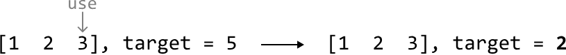

This indicates we've identified subproblems within the main problem, where each subproblem requires finding the fewest number of coins needed to make a smaller target.

Each coin we use creates a new subproblem. For example, using a 1-dollar coin changes our target from 5 to 4 dollars. Let's visualize how these smaller targets, representing new subproblems, are created after using each coin:

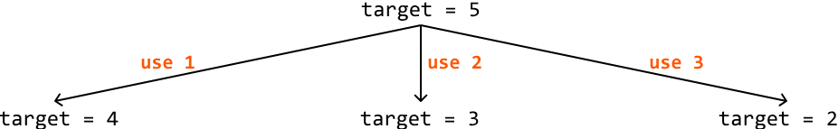

In extension, each of these subproblems can be solved by breaking them down into further subproblems:

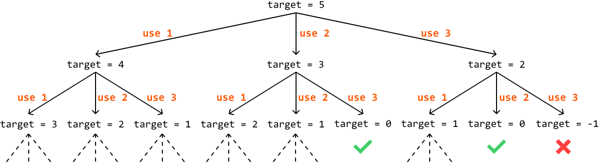

A path that ends with a target of 0 means the coins used in that path add up to 5. If the target becomes negative, it means the path is invalid, so we should stop extending the path.

We've observed how new subproblems are created, but haven't yet addressed how to attain the solutions to them. Remember, each subproblem needs to return the minimum number of coins needed to reach its target.

Consider the main problem with a target of 5. To solve this, we first need to find the minimum number of coins needed to reach each of its three subproblems. The solution to the main problem is the smallest result among these subproblems, plus 1, to account for the coin used to create the subproblem. This highlights an optimal substructure in the problem, allowing us to define the following recurrence relation:

```
min_coin_combination(target) = 1 + min(min_coin_combination(target - coin_i) | coin_i ∈ coins)
```

## Base case

Naturally, we need a base case for this formula. The base case occurs when the target equals 0, which is the simplest version of this problem, as no coins are needed to meet the target. In this case, we return 0.

## Memoization

An important thing to notice is that we might end up solving the same subproblem multiple times. For instance, we calculate the subproblem target = 3 two times in the previous example:

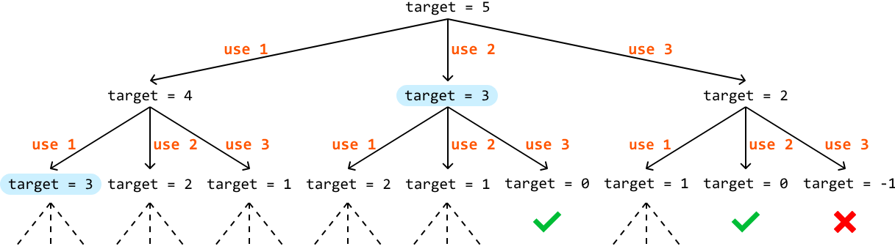

This highlights the existence of overlapping subproblems. Memoization improves our solution by storing the solutions to subproblems as they are computed, ensuring each subproblem is solved only once. This eliminates redundant calculations, and can significantly reduce the size of the recursion tree:

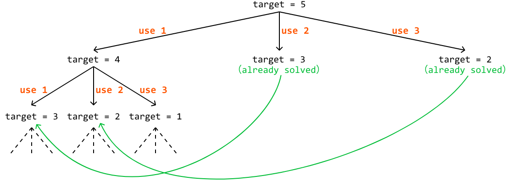

## Try it yourself

Write your solution to the problem before checking the reference implementation.

## Implementation - Top-Down

### Python
```python
def min_coin_combination_top_down(coins: List[int], target: int) -> int:
    res = top_down_dp(coins, target, {})
    return -1 if res == float('inf') else res
    
def top_down_dp(coins: List[int], target: int, memo: Dict[int, int]) -> int:
    # Base case: if the target is 0, then 0 coins are needed to reach it.
    if target == 0:
        return 0
    if target in memo:
        return memo[target]
    # Initialize 'min_coins' to a large number.
    min_coins = float('inf')
    for coin in coins:
        # Avoid negative targets.
        if coin <= target:
            # Calculate the minimum number of coins needed if we use the current coin.
            min_coins = min(min_coins, 1 + top_down_dp(coins, target - coin, memo))
    memo[target] = min_coins
    return memo[target]
```
### JavaScript
```javascript
export function min_coin_combination_top_down(coins, target) {
  const memo = {}
  const res = topDownDP(coins, target, memo)
  return res === Infinity ? -1 : res
}

function topDownDP(coins, target, memo) {
  // Base case: if the target is 0, then 0 coins are needed to reach it.
  if (target === 0) {
    return 0
  }
  if (target in memo) {
    return memo[target]
  }
  // Initialize 'minCoins' to a large number.
  let minCoins = Infinity
  for (const coin of coins) {
    // Avoid negative targets.
    if (coin <= target) {
      // Calculate the minimum number of coins needed if we use the current coin.
      const result = topDownDP(coins, target - coin, memo)
      if (result !== Infinity) {
        minCoins = Math.min(minCoins, 1 + result)
      }
    }
  }
  memo[target] = minCoins
  return minCoins
}
```
### Java
```java
import java.util.ArrayList;
import java.util.HashMap;
import java.util.Map;

public class Main {
    public int min_coin_combination_top_down(ArrayList<Integer> coins, int target) {
        int res = top_down_dp(coins, target, new HashMap<>());
        // Return -1 if the result is infinity.
        return res == Integer.MAX_VALUE ? -1 : res;
    }

    private int top_down_dp(ArrayList<Integer> coins, int target, Map<Integer, Integer> memo) {
        // Base case: if the target is 0, then 0 coins are needed to reach it.
        if (target == 0) {
            return 0;
        }
        if (memo.containsKey(target)) {
            return memo.get(target);
        }
        // Initialize 'min_coins' to a large number.
        int min_coins = Integer.MAX_VALUE;
        for (Integer coin : coins) {
            // Avoid negative targets.
            if (coin <= target) {
                // Calculate the minimum number of coins needed if we use the current coin.
                int sub_result = top_down_dp(coins, target - coin, memo);
                if (sub_result != Integer.MAX_VALUE) {
                    min_coins = Math.min(min_coins, 1 + sub_result);
                }
            }
        }
        memo.put(target, min_coins);
        return memo.get(target);
    }
}
```
## Complexity Analysis

**Time complexity:**

- Without memoization, the time complexity of `min_coin_combination_top_down` would be O(n^(target/m)), where n denotes the number of coins, and m denotes the smallest coin value. The recursion tree has a branch factor of n because we make a recursive call for up to n coins. The depth of the tree is target/m because in the worst case, we continually reduce the target value by the smallest coin.

- With memoization, each subproblem is solved only once. Since there are at most target subproblems, and we iterate through all n coins for each subproblem, the time complexity is O(target⋅n).

**Space complexity:** The space complexity is O(target) because, while the maximum depth of the recursive call stack is only target/m, the memoization array stores up to target key-value pairs.

## Intuition - Bottom-Up

Using the same technique discussed in the Climbing Stairs problem, we can convert our top-down solution to a bottom-up one by translating the memoization array to a DP array.

First, let's look at the value our memoization array stores, as shown in the following code snippet of the top-down implementation:

### Python 
```python
for coin in coins:
    if coin <= target:
        min_coins = min(min_coins, 1 + top_down_dp(coins, target - coin, memo))
memo[target] = min_coins
```
### JavaScript
```javascript
for (const coin of coins) {
  if (coin <= target) {
    minCoins = Math.min(minCoins, 1 + topDownDP(coins, target - coin, memo))
  }
}
memo[target] = minCoins
```
### Java
```java
for (int coin : coins) {
    if (coin <= target) {
        minCoins = Math.min(minCoins, 1 + topDownDP(coins, target - coin, memo));
    }
}
memo[target] = minCoins;
```
Translating this to a DP array provides the following code:

### Python 
```python
for coin in coins:
    if coin <= target:
        dp[target] = min(dp[target], 1 + dp[target - coin])
```
### JavaScript
```javascript
for (const coin of coins) {
  if (coin <= target) {
    dp[target] = Math.min(dp[target], 1 + dp[target - coin])
  }
}
```
### Java
```java
for (int coin : coins) {
    if (coin <= target) {
        dp[target] = Math.min(dp[target], 1 + dp[target - coin]);
    }
}
```
This code snippet only includes the calculation for one target value. In our top-down solution, this calculation is repeated for every target value from the initial target, down to the base case (target == 0).

In the bottom-up solution, we need to reverse this order by starting with the base case and working our way up to the initial target value (hence the name "bottom-up"). This is necessary because our DP array calculation depends on the DP values of smaller targets. So, we need to calculate the answers for smaller targets first. This can be done using a for-loop from 1 to the target (starting at 1 since the base case of 0 is already set):

### Python
```python
for t in range(1, target + 1):
    for coin in coins:
        if coin <= t:
            dp[t] = min(dp[t], 1 + dp[t - coin])
```
### JavaScript
```javascript
for (let t = 1; t <= target; t++) {
  for (const coin of coins) {
    if (coin <= t) {
      dp[t] = Math.min(dp[t], 1 + dp[t - coin])
    }
  }
}
```
### Java
```java
for (int t = 1; t <= target; t++) {
    for (int coin : coins) {
        if (coin <= t) {
            dp[t] = Math.min(dp[t], 1 + dp[t - coin]);
        }
    }
}
```
Once this is done, the answer to the problem will be stored in `dp[target]`.

## Try it yourself

Write your solution to the problem before checking the reference implementation.

## Implementation - Bottom-Up

### Python
```python
def min_coin_combination_bottom_up(coins: List[int], target: int) -> int:
    # The DP array will store the minimum number of coins needed for each amount. Set
    # each element to a large number initially.
    dp = [float('inf')] * (target + 1)
    # Base case: if the target is 0, then 0 coins are needed.
    dp[0] = 0
    # Update the DP array for all target amounts greater than 0.
    for t in range(1, target + 1):
        for coin in coins:
            if coin <= t:
                dp[t] = min(dp[t], 1 + dp[t - coin])
    return dp[target] if dp[target] != float('inf') else -1
```
### JavaScript
```javascript
export function min_coin_combination_bottom_up(coins, target) {
  // The DP array will store the minimum number of coins needed for each amount.
  // Set each element to a large number initially.
  const dp = new Array(target + 1).fill(Infinity)
  // Base case: if the target is 0, then 0 coins are needed.
  dp[0] = 0
  // Update the DP array for all target amounts greater than 0.
  for (let t = 1; t <= target; t++) {
    for (const coin of coins) {
      if (coin <= t) {
        dp[t] = Math.min(dp[t], 1 + dp[t - coin])
      }
    }
  }
  return dp[target] !== Infinity ? dp[target] : -1
}
```
### Java
```java
import java.util.ArrayList;

public class Main {
    public int min_coin_combination_bottom_up(ArrayList<Integer> coins, int target) {
        // The DP array will store the minimum number of coins needed for each amount. Set
        // each element to a large number initially.
        int[] dp = new int[target + 1];
        for (int i = 1; i <= target; i++) {
            dp[i] = Integer.MAX_VALUE;
        }
        // Base case: if the target is 0, then 0 coins are needed.
        dp[0] = 0;
        // Update the DP array for all target amounts greater than 0.
        for (int t = 1; t <= target; t++) {
            for (Integer coin : coins) {
                if (coin <= t && dp[t - coin] != Integer.MAX_VALUE) {
                    dp[t] = Math.min(dp[t], 1 + dp[t - coin]);
                }
            }
        }
        return dp[target] == Integer.MAX_VALUE ? -1 : dp[target];
    }
}
```
## Complexity Analysis

**Time complexity:** The time complexity of `min_coin_combination_bottom_up` is O(target⋅n) because we loop through all n coins for each value between 1 and target.

**Space complexity:** The space complexity is O(target) due to the space occupied by the DP array, which is of size target+1.

## Interview Tip

**Tip:** When a problem asks for the minimum or maximum of something, it might be a DP problem.
If you spot keywords like "minimum", "maximum", "longest", or "shortest", in the problem description, consider whether a DP approach might be appropriate, as many DP problems involve optimizing a certain value, such as finding the minimum cost, or longest sequence.


---


# Matrix Pathways

You are positioned at the top-left corner of a m × n matrix, and can only move downward or rightward through the matrix. Determine the number of unique pathways you can take to reach the bottom-right corner of the matrix.

**Example:**


**Input:** m = 3, n = 3

**Output:** 6

**Constraints:**

- m, n ≥ 1

## Intuition

At each cell, we can either move right or move down. No matter which direction we choose at any point, it will always move us closer to the destination. This means we just need to keep moving either right or down until we can no longer do so, at which point we've reached the bottom-right corner.

Let's think about this problem backward. Assume we have already reached the bottom-right corner. How did we get here? We know for certain we came from either the cell directly above, or the cell directly to the left of the current position.

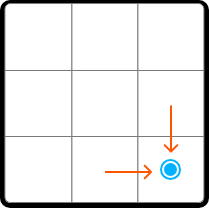

This is equally true for any cell on the matrix, which means a generalization can be made: the number of paths to any cell is equal to the sum of the number of paths to the cell above it and the cell to its left.

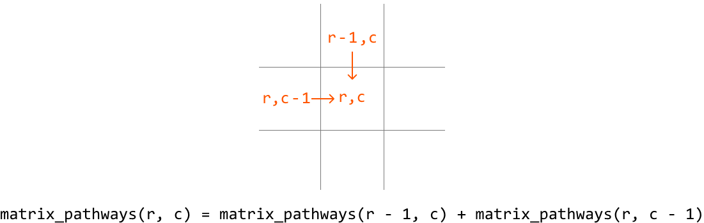

This demonstrates the existence of subproblems, and that this problem has an optimal substructure, where we need to solve two subproblems in order to solve the main problem. This makes this problem well-suited for DP. So, let's translate the above recurrence relation to a DP formula:

`dp[r][c] = dp[r - 1][c] + dp[r][c - 1]`, where `dp[r][c]` represents the total number of paths that lead to cell (r, c).

Before populating the DP table, we need to know our base cases.

## Base cases

We know `dp[0][0]` should be 1 because there's only one path leading to cell (0, 0).

What else do we know for certain? Since we can only move right or down, once we leave a row or column, we can never return to it because we can't move left or up. This means, for any cell in row 0 or column 0, there's only one path to those cells:

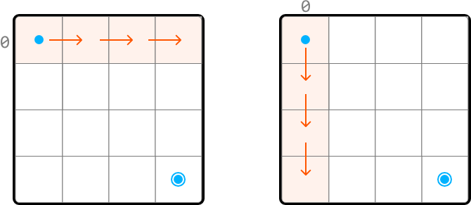

Therefore, we can set all cells in row 0 and column 0 to 1 as the base cases.

**Problem-solving tip:** another way to identify row 0 and column 0 as base cases is by examining the DP formula. Since we need the values from row r - 1 and column c - 1 to populate `dp[r][c]`, all values at r = 0 and c = 0 must be pre-populated before using the formula to avoid index out-of-bound errors.

## Populating the DP table

Once the base cases are set, we can populate the remaining DP table, starting from cell (1, 1), using our DP formula (`dp[r][c] = dp[r-1][c] + dp[r][c-1]`):

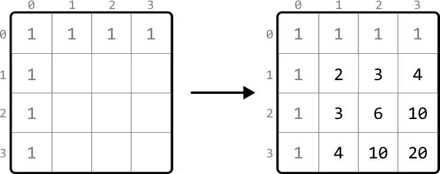

After we fill in the DP table, we can return `dp[m - 1][n - 1]`, which contains the number of paths to the bottom-right corner.

## Try it yourself

Write your solution to the problem before checking the reference implementation.

## Implementation

### Python
```python
def matrix_pathways(m: int, n: int) -> int:
    # Base cases: Set all cells in row 0 and column 0 to 1. We can do this by
    # initializing all cells in the DP table to 1.
    dp = [[1] * n for _ in range(m)]
    # Fill in the rest of the DP table.
    for r in range(1, m):
        for c in range(1, n):
            # Paths to current cell = paths from above + paths from left.
            dp[r][c] = dp[r - 1][c] + dp[r][c - 1]
    return dp[m - 1][n - 1]
```
### JavaScript
```javascript
export function matrix_pathways(m, n) {
  // Base cases: Set all cells in row 0 and column 0 to 1.
  const dp = Array.from({ length: m }, () => Array(n).fill(1))
  // Fill in the rest of the DP table.
  for (let r = 1; r < m; r++) {
    for (let c = 1; c < n; c++) {
      // Paths to current cell = paths from above + paths from left.
      dp[r][c] = dp[r - 1][c] + dp[r][c - 1]
    }
  }
  return dp[m - 1][n - 1]
}
```
### Java
```java
class Main {
    public static int matrix_pathways(int m, int n) {
        // Base cases: Set all cells in row 0 and column 0 to 1. We can do this by
        // initializing all cells in the DP table to 1.
        int[][] dp = new int[m][n];
        for (int r = 0; r < m; r++) {
            for (int c = 0; c < n; c++) {
                if (r == 0 || c == 0) {
                    dp[r][c] = 1;
                } else {
                    // Paths to current cell = paths from above + paths from left.
                    dp[r][c] = dp[r - 1][c] + dp[r][c - 1];
                }
            }
        }
        return dp[m - 1][n - 1];
    }
}
```
## Complexity Analysis

**Time complexity:** The time complexity of `matrix_pathways` is O(m⋅n) because each cell in the DP table is populated once.

**Space complexity:** The space complexity is O(m⋅n) due to the DP table, which contains m⋅n elements.

## Optimization

We can optimize our solution by understanding that, for each cell in the DP table, we only need to access the cells directly above it and to its left.

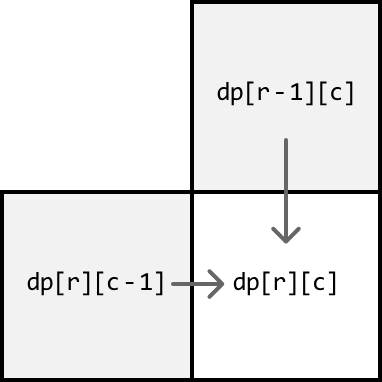

- To get the cell above it (`dp[r-1][c]`), we only need access to the previous row.
- To get the cell to its left (`dp[r][c-1]`), we just need to look at the cell to the left of the current cell, which is in the same row we're currently populating.

Therefore, we only need to maintain two rows:

- `prev_row`: the previous row.
- `curr_row`: the current row being populated.

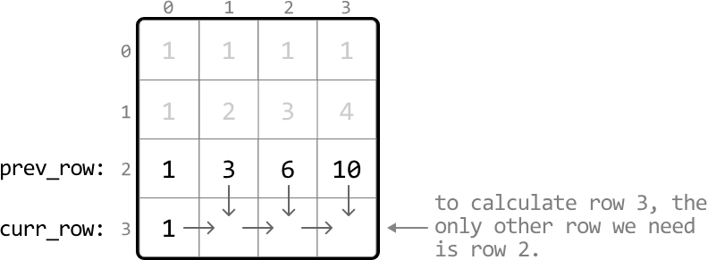

This effectively reduces the space complexity to O(n) because we now only need to maintain two arrays of size n. After populating the DP values for the current row, we'll need to make sure to update `prev_row` with the values from `curr_row` to prepare for the next iteration since the next row's previous row is the current row. Below is the optimized code:

### Python
```python
def matrix_pathways_optimized(m: int, n: int) -> int:
    # Initialize 'prev_row' as the DP values of row 0, which are all 1s.
    prev_row = [1] * n
    # Iterate through the matrix starting from row 1.
    for r in range(1, m):
        # Set the first cell of 'curr_row' to 1. This is done by
        # setting the entire row to 1.
        curr_row = [1] * n
        for c in range(1, n):
            # The number of unique paths to the current cell is the sum
            # of the paths from the cell above it ('prev_row[c]') and
            # the cell to the left ('curr_row[c - 1]').
            curr_row[c] = prev_row[c] + curr_row[c - 1]
        # Update 'prev_row' with 'curr_row' values for the next
        # iteration.
        prev_row = curr_row
    # The last element in 'prev_row' stores the result for the
    # bottom-right cell.
    return prev_row[n - 1]
```
### JavaScript
```javascript
export function matrix_pathways_optimized(m, n) {
  // Initialize 'prevRow' as the DP values of row 0, which are all 1s.
  let prevRow = Array(n).fill(1)
  // Iterate through the matrix starting from row 1.
  for (let r = 1; r < m; r++) {
    // Set the first cell of 'currRow' to 1.
    let currRow = Array(n).fill(1)
    for (let c = 1; c < n; c++) {
      // The number of unique paths to the current cell is the sum
      // of the paths from the cell above and the cell to the left.
      currRow[c] = prevRow[c] + currRow[c - 1]
    }
    // Update 'prevRow' with 'currRow' for the next iteration.
    prevRow = currRow
  }
  // The last element in 'prevRow' stores the result for the bottom-right cell.
  return prevRow[n - 1]
}
```
### Java
```java
import java.util.List;
import java.util.ArrayList;

class Main {
    public static int matrix_pathways_optimized(int m, int n) {
        // Initialize 'prev_row' as the DP values of row 0, which are all 1s.
        List<Integer> prevRow = new ArrayList<>();
        for (int i = 0; i < n; i++) {
            prevRow.add(1);
        }
        // Iterate through the matrix starting from row 1.
        for (int r = 1; r < m; r++) {
            // Set the first cell of 'curr_row' to 1. This is done by
            // setting the entire row to 1.
            List<Integer> currRow = new ArrayList<>();
            for (int i = 0; i < n; i++) {
                currRow.add(1);
            }
            for (int c = 1; c < n; c++) {
                // The number of unique paths to the current cell is the sum
                // of the paths from the cell above it ('prev_row[c]') and
                // the cell to the left ('curr_row[c - 1]').
                currRow.set(c, prevRow.get(c) + currRow.get(c - 1));
            }
            // Update 'prev_row' with 'curr_row' values for the next
            // iteration.
            prevRow = currRow;
        }
        // The last element in 'prev_row' stores the result for the
        // bottom-right cell.
        return prevRow.get(n - 1);
    }
}
```


---


# Neighborhood Burglary

You plan to rob houses in a street where each house stores a certain amount of money. The neighborhood has a security system that sets off an alarm when two adjacent houses are robbed. Return the maximum amount of cash that can be stolen without triggering the alarms.

**Example:**

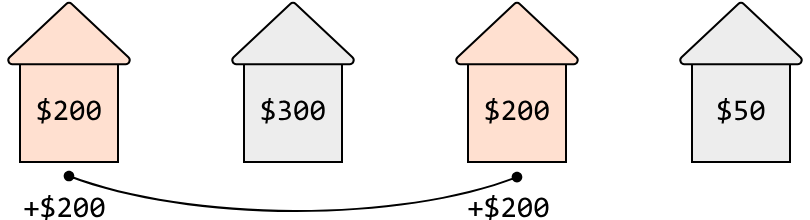

Input: houses = [200, 300, 200, 50]
Output: 400
Explanation: Stealing from the houses at indexes 0 and 2 yields 200 + 200 = 400 dollars.

## Intuition

Ideally, we would want to rob every house, and collect the total sum of all cash contained therein. However, with the alarm system in place, we need to be more strategic about which houses to rob and which to skip.

A simple, greedy approach of always robbing the house with the most money fails because it overlooks the long-term consequences of its choices, and doesn't always yield the highest total profit. This is visualized in the example below.

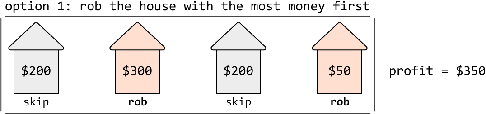

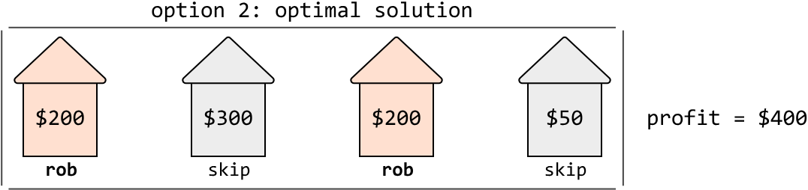

Let's approach this problem from a different angle. Imagine breaking into houses all along a street, and eventually reaching the last house, denoted as i below. How much money has been stolen up to this point?

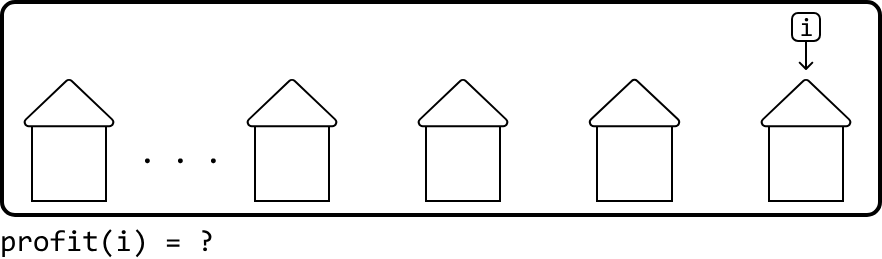

To answer this question, we need to consider the two choices that can be made at this last house: do we skip it or rob it?

If we skip it, we end our burglary with the total amount stolen up to the house at i - 1:

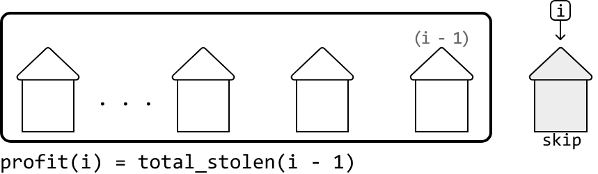

If we rob it, we couldn't have robbed the previous house at i - 1, so we end the burglary with the money stolen from this final house, plus the total amount stolen up to the house at i - 2, which is two houses back:

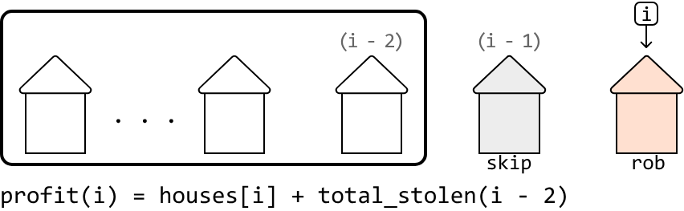

The optimal choice is whichever of these two options yields the largest amount of money.

Notice this discussion highlights the existence of subproblems, and an optimal substructure where we need to know the total amount stolen up to the two previous houses, before determining the total amount we can steal up to the current house.

This means we should try using DP to solve this problem. Let's say `dp[i]` represents the maximum amount we're able to steal by the time we reach house `i`. Based on our previous discussion, we know that:

```
dp[i] = max(profit if we skip house i, profit if we rob house i) = max(dp[i - 1], houses[i] + dp[i - 2])
```

Once the DP array is populated using the above formula, we can just return `dp[n - 1]`, which represents the maximum amount that can be stolen once we reach the end of the street. Now, let's think about what our base cases should be.

## Base cases

For starters, let's consider what to do if there's just one house. This is the simplest possible subproblem, where the total amount stolen is just the money in that house. So, one of our base cases is `dp[0] = houses[0]`.

Keep in mind that to use our DP formula (`dp[i] = max(dp[i - 1], houses[i] + dp[i - 2])`), we need to access values at indexes `i - 1` and `i - 2`. This means we must set initial values for index 0 and index 1. With these base cases, we can safely start using the formula from index 2 onward without causing any index out-of-bound errors. So, what's the most money that can be stolen at `i = 1` (i.e., when there are just two adjacent houses)? We can only steal from one of these houses, so `dp[1] = max(houses[0], houses[1])`.

## Try it yourself

Write your solution to the problem before checking the reference implementation.

## Implementation

### Python
```python
from typing import List
   
def neighborhood_burglary(houses: List[int]) -> int:
    # Handle the cases when the array is less than the size of 2 to avoid out-of-
    # bounds errors when assigning the base case values.
    if not houses:
        return 0
    if len(houses) == 1:
        return houses[0]
    dp = [0] * len(houses)
    # Base case: when there's only one house, rob that house.
    dp[0] = houses[0]
    # Base case: when there are two houses, rob the one with the most money.
    dp[1] = max(houses[0], houses[1])
    # Fill in the rest of the DP array.
    for i in range(2, len(houses)):
        # 'dp[i]' = max(profit if we skip house 'i', profit if we rob house 'i').
        dp[i] = max(dp[i - 1], houses[i] + dp[i - 2])
    return dp[len(houses) - 1]
```
### JavaScript
```javascript
export function neighborhood_burglary(houses) {
  // Handle the cases when the array is less than size 2
  if (!houses || houses.length === 0) {
    return 0
  }
  if (houses.length === 1) {
    return houses[0]
  }
  const dp = new Array(houses.length).fill(0)
  // Base cases
  dp[0] = houses[0]
  dp[1] = Math.max(houses[0], houses[1])
  // Fill in the rest of the DP array
  for (let i = 2; i < houses.length; i++) {
    dp[i] = Math.max(dp[i - 1], houses[i] + dp[i - 2])
  }
  return dp[houses.length - 1]
}
```
### Java
```java
import java.util.ArrayList;

public class Main {
    public static int neighborhood_burglary(ArrayList<Integer> houses) {
        // Handle the cases when the array is less than the size of 2 to avoid out-of-
        // bounds errors when assigning the base case values.
        if (houses == null || houses.isEmpty()) {
            return 0;
        }
        if (houses.size() == 1) {
            return houses.get(0);
        }
        int[] dp = new int[houses.size()];
        // Base case: when there's only one house, rob that house.
        dp[0] = houses.get(0);
        // Base case: when there are two houses, rob the one with the most money.
        dp[1] = Math.max(houses.get(0), houses.get(1));
        // Fill in the rest of the DP array.
        for (int i = 2; i < houses.size(); i++) {
            // 'dp[i]' = max(profit if we skip house 'i', profit if we rob house 'i').
            dp[i] = Math.max(dp[i - 1], houses.get(i) + dp[i - 2]);
        }
        return dp[houses.size() - 1];
    }
}
```
## Complexity Analysis

**Time complexity:** The time complexity of `neighborhood_burglary` is $O(n)$, where $n$ denotes the number of houses. This is because each index of the DP array is populated at most once.

**Space complexity:** The space complexity is $O(n)$ since we're maintaining a DP array that has $n$ elements.

## Optimization

From the DP array formula `dp[i] = max(dp[i - 1], houses[i] + dp[i - 2])`, an important observation is that we only need to access the previous two values of the DP array, index `i - 1` and index `i - 2`, to calculate the current value at index `i`. This means we don't need to store the entire DP array.

Instead, we can use two variables to keep track of the previous two values:

- `prev_max_profit`: stores the value of `dp[i - 1]`
- `prev_prev_max_profit`: stores the value of `dp[i - 2]`

This optimization reduces the space complexity to $O(1)$ since we're no longer maintaining any auxiliary data structures. The adjusted implementation can be seen below:

### Python
```python
from typing import List

def neighborhood_burglary_optimized(houses: List[int]) -> int:
    if not houses:
        return 0
    if len(houses) == 1:
        return houses[0]
    # Initialize the variables with the base cases.
    prev_max_profit = max(houses[0], houses[1])
    prev_prev_max_profit = houses[0]
    for i in range(2, len(houses)):
        curr_max_profit = max(prev_max_profit, houses[i] + prev_prev_max_profit)
        # Update the values for the next iteration.
        prev_prev_max_profit = prev_max_profit
        prev_max_profit = curr_max_profit
    return prev_max_profit
```

### JavaScript
```javascript
export function neighborhood_burglary_optimized(houses) {
  if (!houses || houses.length === 0) {
    return 0
  }
  if (houses.length === 1) {
    return houses[0]
  }
  // Initialize the variables with the base cases.
  let prevPrevMaxProfit = houses[0]
  let prevMaxProfit = Math.max(houses[0], houses[1])
  for (let i = 2; i < houses.length; i++) {
    const currMaxProfit = Math.max(prevMaxProfit, houses[i] + prevPrevMaxProfit)
    // Update the values for the next iteration.
    prevPrevMaxProfit = prevMaxProfit
    prevMaxProfit = currMaxProfit
  }
  return prevMaxProfit
}
```
### Java
```java
import java.util.ArrayList;
import java.util.List;

public class Main {
    public static int neighborhood_burglary_optimized(ArrayList<Integer> houses) {
        if (houses == null || houses.isEmpty()) {
            return 0;
        }
        if (houses.size() == 1) {
            return houses.get(0);
        }
        // Initialize the variables with the base cases.
        int prevMaxProfit = Math.max(houses.get(0), houses.get(1));
        int prevPrevMaxProfit = houses.get(0);
        for (int i = 2; i < houses.size(); i++) {
            int currMaxProfit = Math.max(prevMaxProfit, houses.get(i) + prevPrevMaxProfit);
            // Update the values for the next iteration.
            prevPrevMaxProfit = prevMaxProfit;
            prevMaxProfit = currMaxProfit;
        }
        return prevMaxProfit;
    }
}
```


---


# Longest Common Subsequence

Given two strings, find the length of their longest common subsequence (LCS). A subsequence is a sequence of characters that can be derived from a string by deleting zero or more elements, without changing the order of the remaining elements.

**Example:**

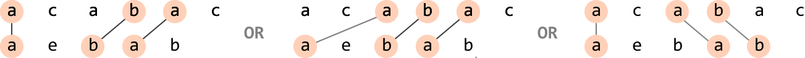

Input: s1 = 'acabac', s2 = 'aebab'
Output: 3

## Intuition

A naive approach to this problem is to generate every possible subsequence for both strings and identify the LCS among them. This is extremely inefficient, so we need to think of something better.

One way to think about this problem is to realize that for any character from either string, we have a choice to either include it in the LCS, or exclude it. This will help us figure out the next steps in finding the length of the LCS.

Let's start by considering the first character of each string and whether we should include or exclude them. There are two primary cases to discuss:

- Case 1: the characters are the same.
- Case 2: the characters are different.

## Case 1: equal characters

Consider the following two strings, where we're trying to find the length of their LCS, starting from index 0 of each string (LCS(0, 0)):

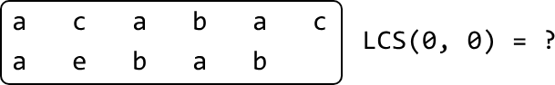

The first characters of these two strings are equal. What should we do about them? We should include these characters in the LCS as they form the beginning of a common subsequence. Including them also means our LCS will have a length of at least 1. But how do we find the length of the rest of the LCS? We can do this by computing the LCS of the remainder of both strings. That is, the LCS of their substrings starting at index 1 (LCS(1, 1)):

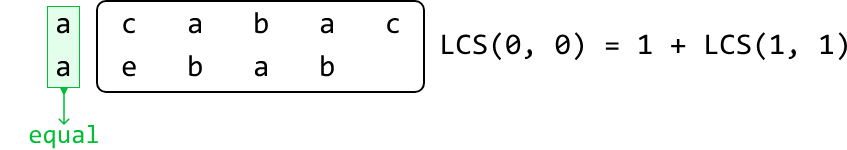

We've just identified that this case can be solved by solving a subproblem that also computes the LCS of two strings, indicating this problem has an optimal substructure.

Therefore, we can generalize a recurrence relation for this case. Below, index i and j represent the start of the substring of s1 and s2, respectively.

```
if s1[i] == s2[j]: LCS(i, j) = 1 + LCS(i + 1, j + 1)
```

## Case 2: different characters

Now, let's say the first characters of the two strings are different:

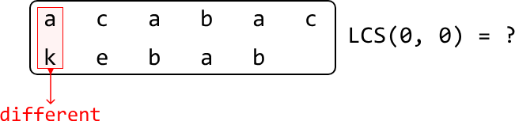

This means the LCS cannot include both of these characters. It could include one of them, but certainly not both. Therefore, we have two choices to find the LCS:

Exclude 'a' from the first string to find the LCS between the two strings after this exclusion:

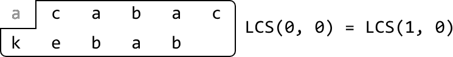

Exclude 'k' from the second string to find the LCS between the two strings after this exclusion:

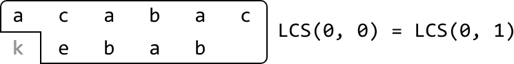

The length of the LCS will be the larger length between these two options. Again, here we see that we're dealing with a problem of optimal substructure. The recurrence relation for this case is:

```
if s1[i] != s2[j]: LCS(i, j) = max(LCS(i + 1, j), LCS(i, j + 1)) (i.e. max(LCS excluding s1[i], LCS excluding s2[j]))
```

## Dynamic programming

Since we're dealing with overlapping subproblems, where the solutions to a subproblem can be used multiple times, we can convert our recurrence relation to a DP formula. Let's say `dp[i][j]` represents LCS(i, j). Based on our previous discussion, we know that:

```
if s1[i] == s2[j]: dp[i][j] = 1 + dp[i + 1][j + 1]
else: dp[i][j] = max(dp[i + 1][j], dp[i][j + 1])
```

Now, we need to think about what the base cases should be.

## Base cases

The simplest version of our problem is when one or both strings are empty. In this case, their LCS has a length of 0. But which values of the DP table should we populate for these base cases?

We know that when i = len(s1) - 1, only one character of s1 is being considered:

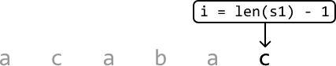

This implies that when i = len(s1), the substring of s1 contains no characters. The equivalent is true for s2 when j = len(s2). Therefore, we can populate the DP table with the base case values like so:

```
dp[len(s1)][j] = 0 for all j
dp[i][len(s2)] = 0 for all i
```

Let's draw the DP table with just these base cases to get a better idea of what this looks like:

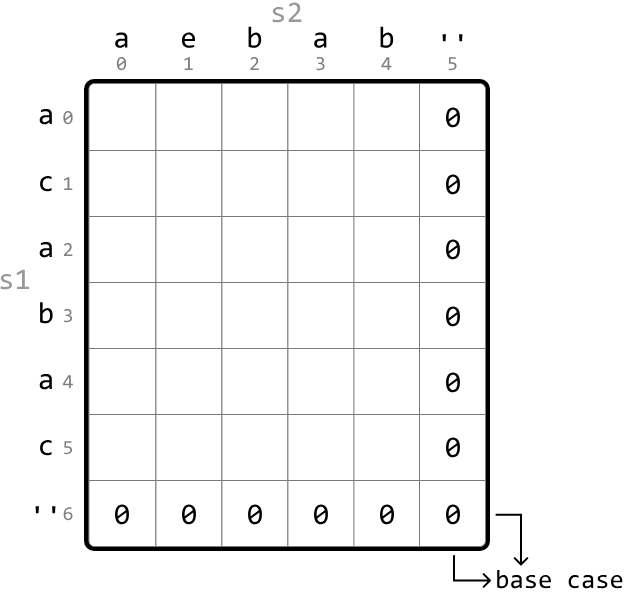

As we can see, the last row and last column are set to 0 for our base cases.

## Populating the DP table

We populate the DP table starting from the smallest subproblems (excluding the base cases). Specifically, we begin by populating `dp[len(s1) - 1][len(s2) - 1]`, which considers the LCS of only the last character of each string. From there, we iteratively populate the DP table in reverse order, moving backward through the table until we reach cell (0, 0).

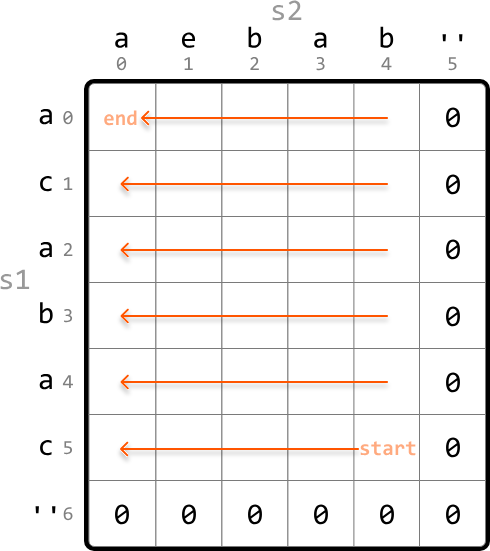

Once the DP table is populated, we return `dp[0][0]`, which stores the length of the LCS between the entire first string and the entire second string.

## Try it yourself

Write your solution to the problem before checking the reference implementation.

## Implementation

### Python 
```python
def longest_common_subsequence(s1: str, s2: str) -> int:
    # Base case: Set the last row and last column to 0 by initializing the entire DP
    # table with 0s.
    dp = [[0] * (len(s2) + 1) for _ in range(len(s1) + 1)]
    # Populate the DP table.
    for i in range(len(s1) - 1, -1, -1):
        for j in range(len(s2) - 1, -1, -1):
            # If the characters match, the length of the LCS at 'dp[i][j]' is
            # 1 + the LCS length of the remaining substrings.
            if s1[i] == s2[j]:
                dp[i][j] = 1 + dp[i + 1][j + 1]
            # If the characters don't match, the LCS length at 'dp[i][j]' can be found
            # by either:
            # 1. Excluding the current character of s1.
            # 2. Excluding the current character of s2.
            else:
                dp[i][j] = max(dp[i + 1][j], dp[i][j + 1])
    return dp[0][0]
```
### JavaScript
```javascript
export function longest_common_subsequence(s1, s2) {
  // Base case: Set the last row and last column to 0 by initializing the entire DP table with 0s.
  const dp = Array.from({ length: s1.length + 1 }, () =>
    Array(s2.length + 1).fill(0)
  )
  // Populate the DP table.
  for (let i = s1.length - 1; i >= 0; i--) {
    for (let j = s2.length - 1; j >= 0; j--) {
      // If the characters match, the length of the LCS at 'dp[i][j]' is
      // 1 + the LCS length of the remaining substrings.
      if (s1[i] === s2[j]) {
        dp[i][j] = 1 + dp[i + 1][j + 1]
      } else {
        // If the characters don't match, the LCS length at 'dp[i][j]' can be found
        // by either:
        // 1. Excluding the current character of s1.
        // 2. Excluding the current character of s2.
        dp[i][j] = Math.max(dp[i + 1][j], dp[i][j + 1])
      }
    }
  }
  return dp[0][0]
}
```
### Java
```java
public class Main {
    public int longest_common_subsequence(String s1, String s2) {
        // Base case: Set the last row and last column to 0 by initializing the entire DP
        // table with 0s.
        int[][] dp = new int[s1.length() + 1][s2.length() + 1];
        // Populate the DP table.
        for (int i = s1.length() - 1; i >= 0; i--) {
            for (int j = s2.length() - 1; j >= 0; j--) {
                // If the characters match, the length of the LCS at 'dp[i][j]' is
                // 1 + the LCS length of the remaining substrings.
                if (s1.charAt(i) == s2.charAt(j)) {
                    dp[i][j] = 1 + dp[i + 1][j + 1];
                }
                // If the characters don't match, the LCS length at 'dp[i][j]' can be found
                // by either:
                // 1. Excluding the current character of s1.
                // 2. Excluding the current character of s2.
                else {
                    dp[i][j] = Math.max(dp[i + 1][j], dp[i][j + 1]);
                }
            }
        }
        return dp[0][0];
    }
}
```
## Complexity Analysis

**Time complexity:** The time complexity of `longest_common_subsequence` is O(m⋅n), where m and n denote the lengths of s1 and s2, respectively. This is because each cell in the DP table is populated once.

**Space complexity:** The space complexity is O(m⋅n) since we're maintaining a 2D DP table that has (m+1)(n+1) elements.

## Optimization

We can optimize our solution by noticing that for each cell in the DP table, we only need to access the cell below it, the cell to its right, and the bottom-right diagonal cell.

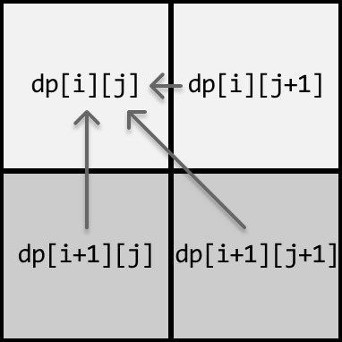

- To get the cell below it, we only need access to the row below.
- To get the cell to its right, we just need to look at the cell to the right of the current cell.
- To get the bottom-right diagonal cell, we also only need access to the row below.

Therefore, we only need to maintain two rows:

- `curr_row`: the current row being populated.
- `prev_row`: the row below the current row.

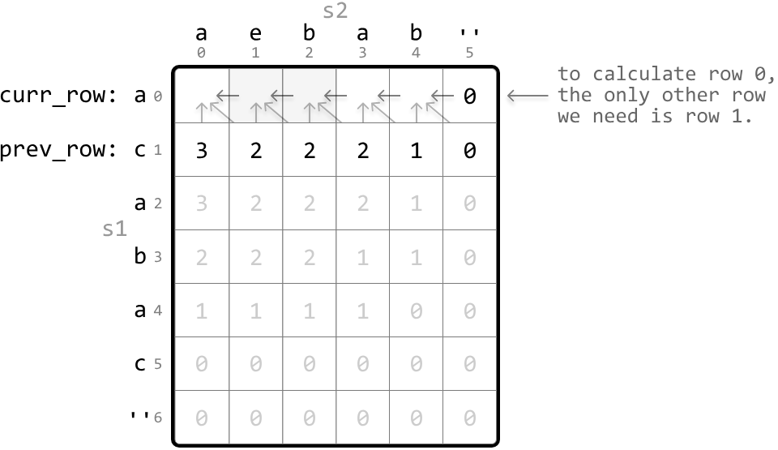

This effectively reduces the space complexity to O(n). Below is the optimized code:

### Python 
```python
def longest_common_subsequence_optimized(s1: str, s2: str) -> int:
    # Initialize 'prev_row' as the DP values of the last row.
    prev_row = [0] * (len(s2) + 1)
    for i in range(len(s1) - 1, -1, -1):
        # Set the last cell of 'curr_row' to 0 to set the base case for
        # this row. This is done by initializing the entire row to 0.
        curr_row = [0] * (len(s2) + 1)
        for j in range(len(s2) - 1, -1, -1):
            # If the characters match, the length of the LCS at
            # 'curr_row[j]' is 1 + the LCS length of the remaining
            # substrings ('prev_row[j + 1]').
            if s1[i] == s2[j]:
                curr_row[j] = 1 + prev_row[j + 1]
            # If the characters don't match, the LCS length at
            # 'curr_row[j]' can be found by either:
            # 1. Excluding the current character of s1 ('prev_row[j]').
            # 2. Excluding the current character of s2
            # ('curr_row[j + 1]').
            else:
                curr_row[j] = max(prev_row[j], curr_row[j + 1])
            # Update 'prev_row' with 'curr_row' values for the next
            # iteration.
        prev_row = curr_row
    return prev_row[0]
```
### JavaScript
```javascript
export function longest_common_subsequence_optimized(s1, s2) {
  // Initialize 'prevRow' as the DP values of the last row.
  let prevRow = new Array(s2.length + 1).fill(0)
  for (let i = s1.length - 1; i >= 0; i--) {
    // Set the last cell of 'currRow' to 0 for the base case of this row.
    let currRow = new Array(s2.length + 1).fill(0)
    for (let j = s2.length - 1; j >= 0; j--) {
      // If the characters match, add 1 to the LCS length from the diagonally next cell.
      if (s1[i] === s2[j]) {
        currRow[j] = 1 + prevRow[j + 1]
      } else {
        // Otherwise, take the max between excluding current char of s1 or s2.
        currRow[j] = Math.max(prevRow[j], currRow[j + 1])
      }
    }
    // Update 'prevRow' with the values from 'currRow' for the next iteration.
    prevRow = currRow
  }
  return prevRow[0]
}
```
### Java
```java
public class Main {
    public int longest_common_subsequence_optimized(String s1, String s2) {
        // Initialize 'prev_row' as the DP values of the last row.
        int[] prevRow = new int[s2.length() + 1];
        for (int i = s1.length() - 1; i >= 0; i--) {
            // Set the last cell of 'curr_row' to 0 to set the base case for
            // this row. This is done by initializing the entire row to 0.
            int[] currRow = new int[s2.length() + 1];
            for (int j = s2.length() - 1; j >= 0; j--) {
                // If the characters match, the length of the LCS at
                // 'curr_row[j]' is 1 + the LCS length of the remaining
                // substrings ('prev_row[j + 1]').
                if (s1.charAt(i) == s2.charAt(j)) {
                    currRow[j] = 1 + prevRow[j + 1];
                }
                // If the characters don't match, the LCS length at
                // 'curr_row[j]' can be found by either:
                // 1. Excluding the current character of s1 ('prev_row[j]').
                // 2. Excluding the current character of s2
                // ('curr_row[j + 1]').
                else {
                    currRow[j] = Math.max(prevRow[j], currRow[j + 1]);
                }
            }
            // Update 'prev_row' with 'curr_row' values for the next
            // iteration.
            prevRow = currRow;
        }
        return prevRow[0];
    }
}
```


---


# Longest Palindrome in a String

Return the longest palindromic substring within a given string.

**Example:**

Input: s = 'abccbaba'
Output: 'abccba'

## Intuition

A naive solution to this problem is to check every possible substring and save the longest palindrome found. It takes approximately O(n^2) time to generate all substrings for a string of length n, and for each of these substrings, it takes O(n) time to check if it's a palindrome. This results in an overall time complexity of O(n^3), which is expensive. So, we should consider a more efficient approach.

## Determining if a substring is a palindrome

An important observation is that palindromes contain shorter palindromes within them. We can observe this in the string "rotator", for example:

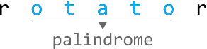

This highlights a subproblem: to identify if a string is a palindrome, we can check if its inner substring is also a palindrome.

More specifically, a substring from index i to j is a palindrome given two conditions:

1. Its first and last characters are the same (`s[i] == s[j]`).

2. The substring from index i + 1 to j - 1 (`s[i + 1 : j - 1]`) is also a palindrome.

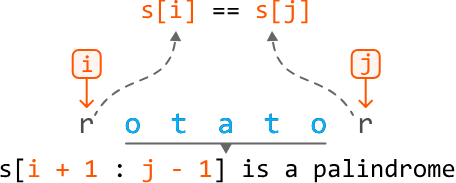

The only situation where this isn't true is when the substring is of length 0, 1, or 2, in which case there is no inner substring. We'll discuss these cases later.

This problem has an optimal substructure since we solve a subproblem to obtain the solution to the main problem. This indicates that DP is well-suited for solving this problem. Let's say that `dp[i][j]` tells us if the substring `s[i : j]` is a palindrome. Based on our earlier observations, we can say that:

```
dp[i][j] = True if s[i] == s[j] and dp[i + 1][j - 1]
```

Naturally, we need to specify the base cases for this formula.

## Base cases

We mentioned earlier that substrings of length 1 and 2 have no inner substrings. In other words, there are no further subproblems to solve when determining if they are palindromes. As such, these substrings define our base cases:

**Base case:** All substrings of length 1 are palindromes. So, set `dp[i][i]` to true for all values of i.

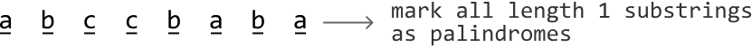

**Base case:** Substrings of length 2 are palindromes if both its characters are the same. So, set `dp[i][i + 1]` to true if `s[i] == s[i + 1]`.

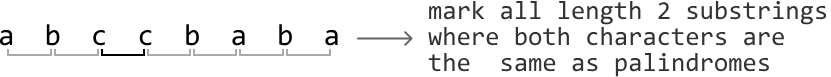

With the base cases set up, let's discuss how to populate the rest of the DP table.

## Populating the DP table

Determining if longer substrings are palindromes depends on the DP values of shorter substrings. Therefore, we should populate the DP table for the shortest substrings first, starting with checking all substrings of length 3 and working our way up to length n, where n denotes the length of the input string.

## Keeping track of the longest palindromic substring

As we populate the DP table, we also need to keep track of the longest palindromic substring encountered. We use two variables for this: `start_index` and `max_len`.

- `start_index`: stores the starting index of the longest palindromic substring found so far
- `max_len`: stores the length of the longest palindromic substring found so far

When we find a new, longer palindromic substring, we update these two variables. By the end, `start_index` and `max_len` will indicate the position and length of the longest palindrome.

Finally, return the substring using `s[start_index : start_index + max_len]`.

This solution is a classic example of "interval DP," which is used to solve optimization problems involving subproblems over intervals of data. In this case, the "intervals" are effectively the substrings between indexes i and j.

## Try it yourself

Write your solution to the problem before checking the reference implementation.

## Implementation

### Python 
```python
def longest_palindrome_in_a_string(s: str) -> str:
    n = len(s)
    if n == 0:
        return ""
    dp = [[False] * n for _ in range(n)]
    max_len = 1
    start_index = 0
    # Base case: a single character is always a palindrome.
    for i in range(n):
        dp[i][i] = True
    # Base case: a substring of length two is a palindrome if both characters are the
    # same.
    for i in range(n - 1):
        if s[i] == s[i + 1]:
            dp[i][i + 1] = True
            max_len = 2
            start_index = i
    # Find palindromic substrings of length 3 or greater.
    for substring_len in range(3, n + 1):
        # Iterate through each substring of length 'substring_len'.
        for i in range(n - substring_len + 1):
            j = i + substring_len - 1
            # If the first and last characters are the same, and the inner substring
            # is a palindrome, then the current substring is a palindrome.
            if s[i] == s[j] and dp[i + 1][j - 1]:
                dp[i][j] = True
                max_len = substring_len
                start_index = i
    return s[start_index : start_index + max_len]
```
### JavaScript
```javascript
export function longest_palindrome_in_a_string(s) {
  const n = s.length
  if (n === 0) return ''
  const dp = Array.from({ length: n }, () => Array(n).fill(false))
  let maxLen = 1
  let startIndex = 0
  // Base case: single characters are palindromes.
  for (let i = 0; i < n; i++) {
    dp[i][i] = true
  }
  // Base case: two-character substrings.
  for (let i = 0; i < n - 1; i++) {
    if (s[i] === s[i + 1]) {
      dp[i][i + 1] = true
      maxLen = 2
      startIndex = i
    }
  }
  // Check for substrings of length 3 or more.
  for (let len = 3; len <= n; len++) {
    for (let i = 0; i <= n - len; i++) {
      const j = i + len - 1
      if (s[i] === s[j] && dp[i + 1][j - 1]) {
        dp[i][j] = true
        maxLen = len
        startIndex = i
      }
    }
  }
  return s.slice(startIndex, startIndex + maxLen)
}
```
### Java
```java
public class Main {
    public String longest_palindrome_in_a_string(String s) {
        int n = s.length();
        if (n == 0) {
            return "";
        }
        boolean[][] dp = new boolean[n][n];
        int maxLen = 1;
        int startIndex = 0;
        // Base case: a single character is always a palindrome.
        for (int i = 0; i < n; i++) {
            dp[i][i] = true;
        }
        // Base case: a substring of length two is a palindrome if both characters are the
        // same.
        for (int i = 0; i < n - 1; i++) {
            if (s.charAt(i) == s.charAt(i + 1)) {
                dp[i][i + 1] = true;
                maxLen = 2;
                startIndex = i;
            }
        }
        // Find palindromic substrings of length 3 or greater.
        for (int substringLen = 3; substringLen <= n; substringLen++) {
            // Iterate through each substring of length 'substring_len'.
            for (int i = 0; i <= n - substringLen; i++) {
                int j = i + substringLen - 1;
                // If the first and last characters are the same, and the inner substring
                // is a palindrome, then the current substring is a palindrome.
                if (s.charAt(i) == s.charAt(j) && dp[i + 1][j - 1]) {
                    dp[i][j] = true;
                    maxLen = substringLen;
                    startIndex = i;
                }
            }
        }
        return s.substring(startIndex, startIndex + maxLen);
    }
}
```
## Complexity Analysis

**Time complexity:** The time complexity of `longest_palindrome_in_a_string` is O(n^2) because each cell of the n⋅n DP table is populated once.

**Space complexity:** The space complexity is O(n^2) because we're maintaining a DP table that has n^2 elements. Note, the output string is not considered in the space complexity.

## Optimized Approach

An important observation of the previous approach is that the base cases represent the centers of palindromes. Understanding this, another possible strategy is to expand outward from each base case to find the longest palindrome.

There are two types of base cases: single-character substrings and two-character substrings. We can treat each as the center of potential palindromes, and expand outward from each of them to find these palindromes.

We can do this by setting left and right pointers at the center, expanding them outward – as long as the characters at both pointers match – and stopping once they can no longer form a larger palindrome. Here are two examples of this:

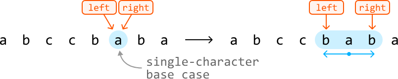

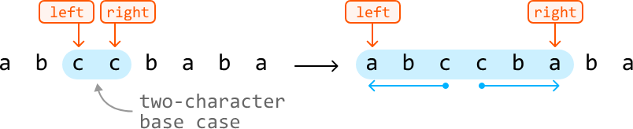

All we need to do is keep track of the start index and length of the longest palindromic we find, just as in the previous approach.

This approach makes use of some of the information from the previous DP approach, while solving the problem using constant space.

## Try it yourself

Write your solution to the problem before checking the reference implementation.

## Implementation - Optimized Approach

### Python 
```python
from typing import Tuple
    
def longest_palindrome_in_a_string_expanding(s: str) -> str:
    n = len(s)
    start, max_len = 0, 0
    for center in range(n):
        # Check for odd-length palindromes.
        odd_start, odd_length = expand_palindrome(center, center, s)
        if odd_length > max_len:
            start = odd_start
            max_len = odd_length
        # Check for even-length palindromes.
        if center < n - 1 and s[center] == s[center + 1]:
            even_start, even_length = expand_palindrome(center, center + 1, s)
            if even_length > max_len:
                start = even_start
                max_len = even_length
    return s[start : start + max_len]
    
# Expands outward from the center of a base case to identify the start index and
# length of the longest palindrome that extends from this base case.
def expand_palindrome(left: int, right: int, s: str) -> Tuple[int, int]:
    while left > 0 and right < len(s) - 1 and s[left - 1] == s[right + 1]:
        left -= 1
        right += 1
    return left, right - left + 1
```
### JavaScript
```javascript
export function longest_palindrome_in_a_string_expanding(s) {
  const n = s.length
  let start = 0
  let maxLen = 0
  for (let center = 0; center < n; center++) {
    // Check for odd-length palindromes
    const [oddStart, oddLength] = expand_palindrome(center, center, s)
    if (oddLength > maxLen) {
      start = oddStart
      maxLen = oddLength
    }
    // Check for even-length palindromes
    if (center < n - 1 && s[center] === s[center + 1]) {
      const [evenStart, evenLength] = expand_palindrome(center, center + 1, s)
      if (evenLength > maxLen) {
        start = evenStart
        maxLen = evenLength
      }
    }
  }
  return s.slice(start, start + maxLen)
}

function expand_palindrome(left, right, s) {
  while (left > 0 && right < s.length - 1 && s[left - 1] === s[right + 1]) {
    left--
    right++
  }
  return [left, right - left + 1]
}
```
### Java
```java
public class Main {
    public String longest_palindrome_in_a_string(String s) {
        int n = s.length();
        int start = 0, maxLen = 0;
        for (int center = 0; center < n; center++) {
            // Check for odd-length palindromes.
            int[] odd = expand_palindrome(center, center, s);
            int oddStart = odd[0], oddLength = odd[1];
            if (oddLength > maxLen) {
                start = oddStart;
                maxLen = oddLength;
            }
            // Check for even-length palindromes.
            if (center < n - 1 && s.charAt(center) == s.charAt(center + 1)) {
                int[] even = expand_palindrome(center, center + 1, s);
                int evenStart = even[0], evenLength = even[1];
                if (evenLength > maxLen) {
                    start = evenStart;
                    maxLen = evenLength;
                }
            }
        }
        return s.substring(start, start + maxLen);
    }

    // Expands outward from the center of a base case to identify the start index and
    // length of the longest palindrome that extends from this base case.
    private int[] expand_palindrome(int left, int right, String s) {
        while (left > 0 && right < s.length() - 1 && s.charAt(left - 1) == s.charAt(right + 1)) {
            left--;
            right++;
        }
        return new int[] { left, right - left + 1 };
    }
}
```
## Complexity Analysis

**Time complexity:** The time complexity of `longest_palindrome_in_a_string_expanding` is O(n^2) because expanding from the center of a base case takes up to O(n) time. Doing this for each base case takes O(n^2) time.

**Space complexity:** The space complexity is O(1) since we aren't maintaining any auxiliary data structures. The output string is not considered in the space complexity.

## Manacher's Algorithm

Aside from the above quadratic-time solutions, there's a more efficient algorithm for finding the longest palindromic substring: Manacher's Algorithm. This algorithm runs in O(n) time.

However, Manacher's Algorithm's specialized nature makes it less common in coding interviews. Most interviewers want to see solutions that show you deeply understand basic concepts and have strong problem-solving skills. They are less interested in tricky solutions that would be unlikely for candidates to come up with during interviews.

For those interested in learning more about Manacher's Algorithm, check out [1] and [2].


---


# Maximum Subarray Sum

Given an array of integers, return the sum of the subarray with the largest sum.

**Example:**

Input: nums = [3, 1, -6, 2, -1, 4, -9]
Output: 5
Explanation: subarray [2, -1, 4] has the largest sum of 5.

**Constraints:**

- The input array contains at least one element.

## Intuition

Brute force approaches to this problem involve calculating the sum of every possible subarray. This would take at least O(n^2) time, where n denotes the length of the array. So, let's consider alternative methods.

The challenge with this problem lies in the presence of negative numbers. If the array consisted entirely of non-negative numbers, the answer would simply be the sum of the entire array.

To find the maximum sum given the presence of negative numbers, let's try keeping track of the sum of a contiguous subarray, starting at index 0.

As this subarray expands and we add each number to the running sum, we'll need to decide whether to continue with the current subarray's sum, or start a new subarray beginning with the current element. To understand how we might make such a decision, let's dive into an example.

Consider the following input array:

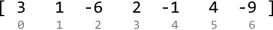

The first two values of the array are positive, so we can continue expanding the current subarray by adding these to our sum (`curr_sum`), initialized at 0:

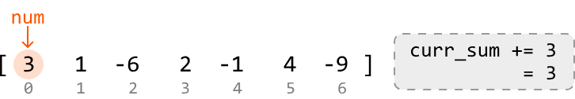

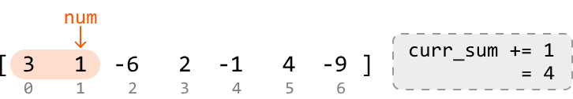

When we reach index 2, we land on the first negative number (-6). Adding it to the current sum gives us a negative sum of -2.

What should we do now? If we restart the subarray at this point, the new subarray will start with a sum of -6, which is less than the current sum of -2.

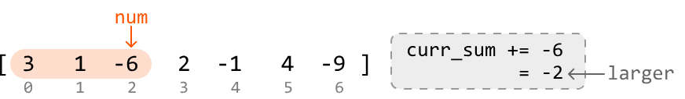

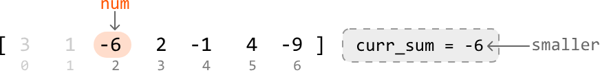

Therefore, it is better to continue with the current subarray for now.

At index 3, we reach another important decision point:

- If we include 2 in the current subarray, its sum increases to 0:

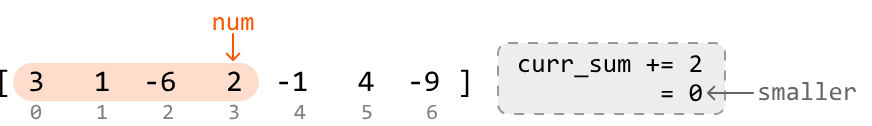

- If we restart the subarray at this index, we begin a new subarray of sum 2:

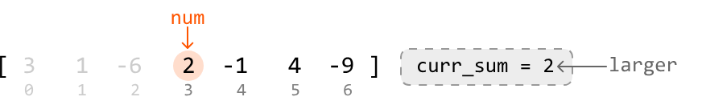

It's evident here that the better choice is to start tracking the sum of a new subarray, beginning at index 3.

As observed, for each number in the array during this process, there are two choices:

- **Continue:** Add the current number to the ongoing subarray sum (`curr_sum + num`).
- **Restart:** Begin keeping track of a new subarray starting with the current number, with an initial sum of `num`.

The best choice is the larger of the two: `max(curr_sum + num, num)`.

Let's apply this logic to the rest of the array:

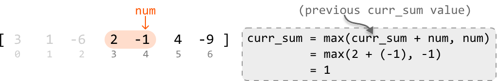

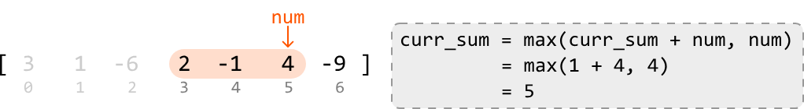


Now that we have a strategy to linearly track subarray sums, the only other thing to do is keep track of the largest value of `curr_sum` encountered. To do this, we can update a variable `max_sum` whenever we encounter a larger `curr_sum` value. Then, `max_sum` will be the answer to the problem.

## Kadane's algorithm

The algorithm described above is formally known as "Kadane's algorithm". Although it may not seem like it, Kadane's algorithm is actually a DP algorithm. What's interesting is that we didn't explicitly detect and solve subproblems to come up with this algorithm, like we typically do in DP. Instead, we solved it by linearly keeping track of a subarray sum and making decisions along the way.

So, to fully understand why this is a DP problem, let's explore how we would solve it using the traditional DP approach of breaking the problem into smaller subproblems, and solving them step-by-step. This is demonstrated in the next section of this explanation.

## Try it yourself

Write your solution to the problem before checking the reference implementation.

## Implementation

### Python 
```python
from typing import List
    
def maximum_subarray_sum(nums: List[int]) -> int:
    if not nums:
        return 0
    # Set the sum variables to negative infinity to ensure negative sums can be
    # considered.
    max_sum = current_sum = float('-inf')
    # Iterate through the array to find the maximum subarray sum.
    for num in nums:
        # Either add the current number to the existing running sum, or start a new
        # subarray at the current number.
        current_sum = max(current_sum + num, num)
        max_sum = max(max_sum, current_sum)
    return max_sum
```
### JavaScript
```javascript
export function maximum_subarray_sum(nums) {
  if (nums.length === 0) return 0
  let maxSum = -Infinity
  let currentSum = -Infinity
  for (const num of nums) {
    currentSum = Math.max(currentSum + num, num)
    maxSum = Math.max(maxSum, currentSum)
  }
  return maxSum
}
```
### Java
```java
import java.util.ArrayList;

public class Main {
    public int maximum_subarray_sum(ArrayList<Integer> nums) {
        if (nums == null || nums.isEmpty()) {
            return 0;
        }
        // Set the sum variables to negative infinity to ensure negative sums can be
        // considered.
        int maxSum = Integer.MIN_VALUE;
        int currentSum = Integer.MIN_VALUE;
        // Iterate through the array to find the maximum subarray sum.
        for (int num : nums) {
            // Either add the current number to the existing running sum, or start a new
            // subarray at the current number.
            currentSum = Math.max(currentSum + num, num);
            maxSum = Math.max(maxSum, currentSum);
        }
        return maxSum;
    }
}
```
## Complexity Analysis

**Time complexity:** The time complexity of `maximum_subarray_sum` is O(n) because we iterate through each element of the input array once.

**Space complexity:** The space complexity is O(1).

## Intuition - DP

Let's discuss how we would approach this problem as we did with other DP problems in this chapter.

An important observation is that every possible subarray ends at a certain index. This inversely means each index signifies the end of several subarrays, one of which will have the maximum subarray sum (shortened to "max subarray" moving forward) ending at that index.

For example, we can see the max subarray that ends at index 3 below by considering all subarrays ending at index 3:


So, how can we find the max subarray that ends at each index? Consider the last index of the array:


One thing we know for sure is the max subarray ending at this index will definitely include the value at this index. We just need to determine if there are any elements to the left that also contribute to this max subarray. In other words, we need to find the max subarray that ends right before the last index:


Another thing to consider is the possibility that `max_subarray(i - 1)` is negative. This would mean the max subarray should only consist of -9, as a further negative contribution will only decrease the sum. Therefore, the formula becomes:

```
max_subarray(i) = max(max_subarray(i - 1) + nums[i], nums[i])
```

As we see, this is a recurrence relation that takes advantage of an optimal substructure, where the max subarray at the current index depends on the max subarray at the previous index.

This indicates we can solve this problem using DP. Translating the above recurrence relation to a DP formula gives us:

```
dp[i] = max(dp[i - 1] + nums[i], nums[i])
```

Now, let's consider what the base case for this problem is.

## Base case

The simplest subproblem occurs when we consider only the first element of the array (i.e., when i = 0). When there's only one element, there's only one subarray. Therefore, we can set `dp[0]` to `nums[0]` as our base case.

## Populating the DP array

With the base case established, we can populate the rest of the DP array. Starting from index 1 and going up to index n - 1, we calculate the maximum subarray sum ending at each index using the aforementioned recurrence relation.

As we populate the DP array, we need to keep track of the maximum value in the DP array, `max_sum`, representing the largest sum of any subarray within the entire array. By the time we finish populating the DP array, we can just return `max_sum`.

## Try it yourself

Write your solution to the problem before checking the reference implementation.

## Implementation - DP

### Python 
```python
from typing import List
    
def maximum_subarray_sum_dp(nums: List[int]) -> int:
    n = len(nums)
    if n == 0:
        return 0
    dp = [0] * n
    # Base case: the maximum subarray sum of an array with just one element is that
    # element.
    dp[0] = nums[0]
    max_sum = dp[0]
    # Populate the rest of the DP array.
    for i in range(1, n):
        # Determine the maximum subarray sum ending at the current index.
        dp[i] = max(dp[i - 1] + nums[i], nums[i])
        max_sum = max(max_sum, dp[i])
    return max_sum
```
### JavaScript
```javascript
export function maximum_subarray_sum_dp(nums) {
  const n = nums.length
  if (n === 0) return 0
  const dp = new Array(n).fill(0)
  // Base case: the maximum subarray sum of an array with one element is that element.
  dp[0] = nums[0]
  let maxSum = dp[0]
  // Populate the rest of the DP array.
  for (let i = 1; i < n; i++) {
    // Determine the maximum subarray sum ending at the current index.
    dp[i] = Math.max(dp[i - 1] + nums[i], nums[i])
    maxSum = Math.max(maxSum, dp[i])
  }
  return maxSum
}
```
### Java
```java
import java.util.List;

public class Main {
    public int maximum_subarray_sum_dp(List<Integer> nums) {
        int n = nums.size();
        if (n == 0) {
            return 0;
        }
        int[] dp = new int[n];
        // Base case: the maximum subarray sum of an array with just one element is that
        // element.
        dp[0] = nums.get(0);
        int maxSum = dp[0];
        // Populate the rest of the DP array.
        for (int i = 1; i < n; i++) {
            // Determine the maximum subarray sum ending at the current index.
            dp[i] = Math.max(dp[i - 1] + nums.get(i), nums.get(i));
            maxSum = Math.max(maxSum, dp[i]);
        }
        return maxSum;
    }
}
```
## Complexity Analysis

**Time complexity:** The time complexity of `maximum_subarray_sum_dp` is O(n) since we iterate through n elements of the DP array.

**Space complexity:** The space complexity is O(n) because we're maintaining a DP array that contains n elements.

## Optimization

An important thing to note is that in the DP solution, we only ever need to access the previous value of the DP array (at i - 1) to calculate the current value (at i). This means we don't need to store the entire DP array.

Instead, we can use a single variable to keep track of the current subarray sum and update this value to calculate the next subarray sum.

This approach reduces the space complexity to O(1). The adjusted implementation of this can be seen below:

### Python 
```python
from typing import List
    
def maximum_subarray_sum_dp_optimized(nums: List[int]) -> int:
    n = len(nums)
    if n == 0:
        return 0
    current_sum = nums[0]
    max_sum = nums[0]
    for i in range(1, n):
        current_sum = max(nums[i], current_sum + nums[i])
        max_sum = max(max_sum, current_sum)
    return max_sum
```
### JavaScript
```javascript
export function maximum_subarray_sum_dp_optimized(nums) {
  const n = nums.length
  if (n === 0) return 0
  let currentSum = nums[0]
  let maxSum = nums[0]
  for (let i = 1; i < n; i++) {
    currentSum = Math.max(nums[i], currentSum + nums[i])
    maxSum = Math.max(maxSum, currentSum)
  }
  return maxSum
}
```
### Java
```java
import java.util.ArrayList;

public class Main {
    public int maximum_subarray_sum_dp_optimized(ArrayList<Integer> nums) {
        int n = nums.size();
        if (n == 0) {
            return 0;
        }
        int currentSum = nums.get(0);
        int maxSum = nums.get(0);
        for (int i = 1; i < n; i++) {
            currentSum = Math.max(nums.get(i), currentSum + nums.get(i));
            maxSum = Math.max(maxSum, currentSum);
        }
        return maxSum;
    }
}
```
As we can see, we've ended up with an optimized DP solution that's nearly identical to the solution we came up with in the first approach: Kadane's algorithm.


---


# 0/1 Knapsack

You are a thief planning to rob a store. However, you can only carry a knapsack with a maximum capacity of cap units. Each item (i) in the store has a weight (weights[i]) and a value (values[i]).

Find the maximum total value of items you can carry in your knapsack.

**Example:**


Input: cap = 7, weights = [5, 3, 4, 1], values = [70, 50, 40, 10]
Output: 90
Explanation: The most valuable combination of items that can fit in the knapsack together are items 1 and 2 . These items have a combined value of 50 + 40 = 90 and a total weight of 3 + 4 = 7 , which fits within the knapsack's capacity.

## Intuition

For each item, we have two choices: include it in the knapsack, or exclude it. This binary decision is why this classic problem is called "0/1 Knapsack."

The brute force approach involves making this decision for every item. Since two choices can be made for each item, this results in 2⋅2⋅2…2=2^n possible combinations of choices. As we can see, generating all possible combinations is inefficient.

A greedy solution that involves picking the most valuable items first isn't a good choice either, as it doesn't always lead to the optimal outcome, which we can see in the example below:


So, let's approach this problem from a different angle. Consider the first item from the above item list (i = 0). What's the most value we can attain with a knapsack of capacity 7, if we include this item? What about if we exclude this item? Let's define the function `knapsack(i, cap)` to represent the maximum value achievable with items starting from index i and a knapsack capacity of cap:


We explore the implications of including or excluding this item, separately.

## Including item i

Picking the first item gives a value of 70. This item weighs 5, so our knapsack now has a remaining capacity of 7 - 5 = 2. With an updated capacity of 2, what's the optimal combination possible with the remaining items in our selection?

This question leads us to realize that if we determine the maximum value that can be obtained from the remaining items (starting from index 1) with a knapsack capacity of 2, we can find the solution:


We've identified that this case can be solved by solving a subproblem, which means we're dealing with a problem that has an optimal substructure.

Therefore, we can generalize a recurrence relation for this case. Below, c denotes the remaining knapsack capacity we want to solve for (we give it a different name because it can be different to the initial value of cap):

If we include item i, the most value we can get is `values[i] + knapsack(i + 1, c - weights[i])`

## Excluding item i

Now, let's say we exclude item 0. This means our knapsack will maintain a capacity of 7. Here, the most value we can get is just from the maximum value from the rest of the items, with a knapsack of capacity 7:


Again, this case can be solved by solving a subproblem:

If we exclude item i, the most value we can get is `knapsack(i + 1, c)`.

Now that we've established the recurrence relations for both cases (including and excluding item i), we can combine them: the maximum value we can get from any selection of items is the larger value obtained from these two cases:

```
knapsack(i, c) = max(include item i, exclude item i) = max(values[i] + knapsack(i + 1, c - weights[i]), knapsack(i + 1, c))
```

One case we haven't covered yet is the possibility the item does not fit in the knapsack. In this case, we have no choice but to exclude the item, resulting in a maximum value of `knapsack(i + 1, c)`, as discussed earlier.

## Dynamic programming

Given this problem has an optimal substructure, we can translate our recurrence relations directly into DP formulas:

### Python 
```python
if weights[i] <= c: # If item i fits in a knapsack of capacity c.
    dp[i][c] = max(values[i] + dp[i + 1][c - weights[i]], dp[i + 1][c])
else: # If item i doesn't fit.
    dp[i][c] = dp[i + 1][c]
```
### JavaScript
```javascript
if (weights[i] <= c) {
  // If item i fits in a knapsack of capacity c.
  dp[i][c] = Math.max(values[i] + dp[i + 1][c - weights[i]], dp[i + 1][c])
} else {
  // If item i doesn't fit.
  dp[i][c] = dp[i + 1][c]
}
```
### Java
```java
if (weights[i] <= c) { // If item i fits in a knapsack of capacity c
    dp[i][c] = Math.max(values[i] + dp[i + 1][c - weights[i]], dp[i + 1][c]);
} else { // If item i doesn't fit
    dp[i][c] = dp[i + 1][c];
}
```
For clarity, there are two dimensions in our DP table:

- One for the current item, i, represented by the rows of the DP table.
- One for the current knapsack capacity, c, represented by the columns on the DP table.

With this in mind, let's think about what the base cases should be.

## Base cases

The simplest version of this problem is when there are no items in our selection, meaning the maximum value we can attain is 0. But which cells of the DP table represent this base case?

We know that when i = n - 1, only one item from the selection is being considered (where n denotes the total number of items):


This implies that when i = n, no items are being considered. Therefore, we can populate the DP table using `dp[n][c] = 0` for all c. The reason i = 0 isn't the base case is because i = 0 encapsulates all items starting from index 0.

Another subproblem we know the answer to is c = 0, since no items can fit in a knapsack of capacity 0. For this, we can populate the DP table using `dp[i][0] = 0` for all i.

Let's draw the DP table with just the base case values, to get a better idea of what this looks like:


As shown, the first column and last row are set to 0 for the base cases.

## Populating the DP table

We populate the DP table starting from the smallest subproblems (excluding base cases). Specifically, this means starting from row i = n - 1, where only the last item is considered, and ending at i = 0, where we consider all items. For each of these rows, we iterate through each possible knapsack capacity from c = 1 to c = cap.


Once the DP table is populated, we return `dp[0][cap]`, which stores the maximum value after all items and knapsack capacities are considered.

## Try it yourself

Write your solution to the problem before checking the reference implementation.

## Implementation

### Python 
```python
from typing import List
    
def knapsack(cap: int, weights: List[int], values: List[int]) -> int:
    n = len(values)
    # Base case: Set the first column and last row to 0 by initializing the entire DP
    # table to 0.
    dp = [[0 for x in range(cap + 1)] for x in range(n + 1)]
    # Populate the DP table.
    for i in range(n - 1, -1, -1):
        for c in range(1, cap + 1):
           # If the item 'i' fits in the current knapsack capacity, the maximum
           # value at 'dp[i][c]' is the largest of either:
            # 1. The maximum value if we include item 'i'.
            # 2. The maximum value if we exclude item 'i'.
            if weights[i] <= c:
                dp[i][c] = max(values[i] + dp[i + 1][c - weights[i]], dp[i + 1][c])
            # If it doesn't fit, we have to exclude it.
            else:
                dp[i][c] = dp[i + 1][c]
    return dp[0][cap]
```
### JavaScript
```javascript
export function knapsack(cap, weights, values) {
  const n = values.length
  // Base case: Initialize the DP table with 0s.
  const dp = Array.from({ length: n + 1 }, () => Array(cap + 1).fill(0))
  // Populate the DP table.
  for (let i = n - 1; i >= 0; i--) {
    for (let c = 1; c <= cap; c++) {
      // If the item 'i' fits in the current knapsack capacity, the maximum
      // value at 'dp[i][c]' is the largest of either:
      // 1. The maximum value if we include item 'i'.
      // 2. The maximum value if we exclude item 'i'.
      if (weights[i] <= c) {
        dp[i][c] = Math.max(values[i] + dp[i + 1][c - weights[i]], dp[i + 1][c])
      } else {
        // If it doesn't fit, we have to exclude it.
        dp[i][c] = dp[i + 1][c]
      }
    }
  }
  return dp[0][cap]
}
```
### Java
```java
import java.util.ArrayList;

public class Main {
    public int knapsack(int cap, ArrayList<Integer> weights, ArrayList<Integer> values) {
        int n = values.size();
        // Base case: Set the first column and last row to 0 by initializing the entire DP
        // table to 0.
        int[][] dp = new int[n + 1][cap + 1];
        // Populate the DP table.
        for (int i = n - 1; i >= 0; i--) {
            for (int c = 1; c <= cap; c++) {
                // If the item 'i' fits in the current knapsack capacity, the maximum
                // value at 'dp[i][c]' is the largest of either:
                // 1. The maximum value if we include item 'i'.
                // 2. The maximum value if we exclude item 'i'.
                if (weights.get(i) <= c) {
                    dp[i][c] = Math.max(values.get(i) + dp[i + 1][c - weights.get(i)], dp[i + 1][c]);
                }
                // If it doesn't fit, we have to exclude it.
                else {
                    dp[i][c] = dp[i + 1][c];
                }
            }
        }
        return dp[0][cap];
    }
}
```
## Complexity Analysis

**Time complexity:** The time complexity of `knapsack` is O(n⋅cap) because each cell of the DP table is populated once.

**Space complexity:** The space complexity is O(n⋅cap) because we're maintaining a DP table that stores (n+1)⋅(cap+1) elements.

## Optimization

We can optimize the solution by recognizing that, for each cell in the DP table, we only need access cells from the row below it.

Therefore, we only need to maintain two rows:

- `curr_row`: the current row being populated.
- `prev_row`: the row below the current row.

This effectively reduces the space complexity to O(cap). Below is the optimized code:

### Python 
```python
from typing import List
    
def knapsack_optimized(cap: int, weights: List[int], values: List[int]) -> int:
    n = len(values)
    # Initialize 'prev_row' as the DP values of the row below the
    # current row.
    prev_row = [0] * (cap + 1)
    for i in range(n - 1, -1, -1):
        # Set the first cell of the 'curr_row' to 0 to set the base
        # case for this row. This is done by initializing the entire
        # row to 0.
        curr_row = [0] * (cap + 1)
        for c in range(1, cap + 1):
            # If item 'i' fits in the current knapsack capacity, the
            # maximum value at 'curr_row[c]' is the largest of either:
            # 1. The maximum value if we include item 'i'.
            # 2. The maximum value if we exclude item 'i'.
            if weights[i] <= c:
                curr_row[c] = max(values[i] + prev_row[c - weights[i]],prev_row[c])
            # If item 'i' doesn't fit, we exclude it.
            else:
                curr_row[c] = prev_row[c]
        # Set 'prev_row' to 'curr_row' values for the next iteration.
        prev_row = curr_row
    return prev_row[cap]
```
### JavaScript
```javascript
export function knapsack_optimized(cap, weights, values) {
  const n = values.length
  // Initialize 'prevRow' as the DP values of the row below the current row.
  let prevRow = new Array(cap + 1).fill(0)
  for (let i = n - 1; i >= 0; i--) {
    // Set the first cell of the 'currRow' to 0 to set the base case for this row.
    let currRow = new Array(cap + 1).fill(0)
    for (let c = 1; c <= cap; c++) {
      // If item 'i' fits in the current knapsack capacity, the maximum value
      // at 'currRow[c]' is the largest of either:
      // 1. The maximum value if we include item 'i'.
      // 2. The maximum value if we exclude item 'i'.
      if (weights[i] <= c) {
        currRow[c] = Math.max(values[i] + prevRow[c - weights[i]], prevRow[c])
      } else {
        // If item 'i' doesn't fit, we exclude it.
        currRow[c] = prevRow[c]
      }
    }
    // Set 'prevRow' to 'currRow' values for the next iteration.
    prevRow = currRow
  }
  return prevRow[cap]
}
```
### Java
```java
import java.util.ArrayList;

public class Main {
    public int knapsack_optimized(int cap, ArrayList<Integer> weights, ArrayList<Integer> values) {
        int n = values.size();
        // Initialize 'prev_row' as the DP values of the row below the
        // current row.
        int[] prevRow = new int[cap + 1];
        for (int i = n - 1; i >= 0; i--) {
            // Set the first cell of the 'curr_row' to 0 to set the base
            // case for this row. This is done by initializing the entire
            // row to 0.
            int[] currRow = new int[cap + 1];
            for (int c = 1; c <= cap; c++) {
                // If item 'i' fits in the current knapsack capacity, the
                // maximum value at 'curr_row[c]' is the largest of either:
                // 1. The maximum value if we include item 'i'.
                // 2. The maximum value if we exclude item 'i'.
                if (weights.get(i) <= c) {
                    currRow[c] = Math.max(values.get(i) + prevRow[c - weights.get(i)], prevRow[c]);
                }
                // If item 'i' doesn't fit, we exclude it.
                else {
                    currRow[c] = prevRow[c];
                }
            }
            // Set 'prev_row' to 'curr_row' values for the next iteration.
            prevRow = currRow;
        }
        return prevRow[cap];
    }
}
```


---


# Largest Square in a Matrix

Determine the area of the largest square of 1's in a binary matrix.

**Example:**


**Output:** 9

## Intuition

The brute force solution to this problem involves examining every possible submatrix within the given matrix to determine if it forms a square of 1s. This can be done by treating each cell as a potential top-left corner of a square, and checking all possible squares that extend from that cell. For each of these squares, we'll need to verify that all cells within the square are 1's. Repeating this process for each cell allows us to find the largest square. This process is quite inefficient, so let's explore alternatives.

One important thing to understand is that squares contain smaller squares inside them. This indicates that subproblems might exist in this problem. Let's see if we can find what the subproblems are and how we can use them. Consider the following 6x6 matrix containing a 4×4 square of 1s:


Let's say we're at cell (4, 4). We know just by looking at the matrix that a square of length 4 with all 1s ends at this cell, but what information would we need algorithmically to determine that this 4x4 exists? A key observation here is that there are three 3×3 squares around this cell:

- one that ends directly to the left of the current cell (4, 3).
- one that ends at the top-left diagonal of the current cell (3, 3).
- one that ends directly above the current cell (3, 4).


This more clearly highlights the existence of subproblems: the length of a square that ends at the current cell depends on the lengths of the squares that end at its left, top, and top-left neighboring cells.

Let's consider a slightly different scenario, where this time, the input matrix contains one less 1, meaning there's no longer a 4×4 square of 1s:


Let's see if our strategy of checking the three neighboring squares around the current cell (4, 4) changes at all here. Keep in mind that this time, the square that ends directly to the left of the current cell only has a length of 2. This means the square that ends at the current cell can, at most, have a length of 3, with 1 unit from the current cell and 2 units from the smallest neighboring square:


This indicates that the length of the current square is restricted by the smallest of its three neighboring squares. We can express this as a recursive formula where `matrix[i][j]` represents the value of the current cell, (i, j):

```
if matrix[i][j] == 1: max_square(i, j) = 1 + min(max_square(i - 1, j), max_square(i - 1, j - 1), max_square(i, j - 1))
```

We now have all the information we need. Given this problem has an optimal substructure, we can translate the above recurrence relation directly into a DP formula.

```
if matrix[i][j] == 1: dp[i][j] = 1 + min(dp[i - 1][j], dp[i - 1][j - 1], dp[i][j - 1])
```

Now, let's think about what the base cases should be.

## Base cases

We know `dp[0][0]` should be 1 if `matrix[0][0]` is 1 since the top-left cell can only have a square of length 1.

What other base cases are there? Consider row 0 and column 0 of the matrix. These are special because the length of a square ending at any of these cells is at most 1.

So, for the base cases, we can set all cells in row 0 and column 0 to 1 in our DP table, provided those cells in the original matrix are also 1:


## Populating the DP table

We populate the DP table starting from the smallest subproblems (excluding the base cases). Specifically, with row 0 and column 0 populated, we begin by populating cell (1, 1) and work our way down to the last cell (m - 1, n - 1) row by row, where m and n are the dimensions of the matrix:


The largest value in the DP table represents the length of the largest square in our matrix. Therefore, we just need to track the maximum DP value (`max_len`) as we populate the table. Once done, we just return `max_len^2`, which represents the area of the largest square.

## Try it yourself

Write your solution to the problem before checking the reference implementation.

## Implementation

In this implementation, it's possible to merge the base case handling with the code which populates the DP table. However, in an interview setting, code is often easier to understand when the base cases are defined separately, which is why they are implemented separately here.

### Python
```python
def largest_square_in_a_matrix(matrix: List[List[int]]) -> int:
    if not matrix:
        return 0
    m, n = len(matrix), len(matrix[0])
    dp = [[0] * n for _ in range(m)]
    max_len = 0
    # Base case: If a cell in row 0 is 1, the largest square ending there has a
    # length of 1.
    for j in range(n):
        if matrix[0][j] == 1:
            dp[0][j] = 1
            max_len = 1
    # Base case: If a cell in column 0 is 1, the largest square ending there has
    # a length of 1.
    for i in range(m):
        if matrix[i][0] == 1:
            dp[i][0] = 1
            max_len = 1
    # Populate the rest of the DP table.
    for i in range(1, m):
        for j in range(1, n):
            if matrix[i][j] == 1:
                # The length of the largest square ending here is determined by
                # the smallest square ending at the neighboring cells (left,
                # top-left, top), plus 1 to include this cell.
                dp[i][j] = 1 + min(dp[i - 1][j], dp[i - 1][j - 1], dp[i][j - 1])
            max_len = max(max_len, dp[i][j])
    return max_len ** 2
```
### JavaScript
```javascript
export function largest_square_in_a_matrix(matrix) {
  if (!matrix || matrix.length === 0) return 0
  const m = matrix.length
  const n = matrix[0].length
  const dp = Array.from({ length: m }, () => Array(n).fill(0))
  let maxLen = 0
  // Base case: If a cell in row 0 is 1, the largest square ending there has a length of 1.
  for (let j = 0; j < n; j++) {
    if (matrix[0][j] === 1) {
      dp[0][j] = 1
      maxLen = 1
    }
  }
  // Base case: If a cell in column 0 is 1, the largest square ending there has a length of 1.
  for (let i = 0; i < m; i++) {
    if (matrix[i][0] === 1) {
      dp[i][0] = 1
      maxLen = 1
    }
  }
  // Populate the rest of the DP table.
  for (let i = 1; i < m; i++) {
    for (let j = 1; j < n; j++) {
      if (matrix[i][j] === 1) {
        // The length of the largest square ending here is determined by
        // the smallest square ending at the neighboring cells (left,
        // top-left, top), plus 1 to include this cell.
        dp[i][j] = 1 + Math.min(dp[i - 1][j], dp[i - 1][j - 1], dp[i][j - 1])
        maxLen = Math.max(maxLen, dp[i][j])
      }
    }
  }
  return maxLen * maxLen
}
```
### Java
```java
import java.util.ArrayList;

public class Main {
    public static int largest_square_in_a_matrix(ArrayList<ArrayList<Integer>> matrix) {
        if (matrix == null || matrix.isEmpty()) {
            return 0;
        }
        int m = matrix.size();
        int n = matrix.get(0).size();
        int[][] dp = new int[m][n];
        int maxLen = 0;
        // Base case: If a cell in row 0 is 1, the largest square ending there has a
        // length of 1.
        for (int j = 0; j < n; j++) {
            if (matrix.get(0).get(j) == 1) {
                dp[0][j] = 1;
                maxLen = 1;
            }
        }
        // Base case: If a cell in column 0 is 1, the largest square ending there has
        // a length of 1.
        for (int i = 0; i < m; i++) {
            if (matrix.get(i).get(0) == 1) {
                dp[i][0] = 1;
                maxLen = 1;
            }
        }
        // Populate the rest of the DP table.
        for (int i = 1; i < m; i++) {
            for (int j = 1; j < n; j++) {
                if (matrix.get(i).get(j) == 1) {
                    // The length of the largest square ending here is determined by
                    // the smallest square ending at the neighboring cells (left,
                    // top-left, top), plus 1 to include this cell.
                    dp[i][j] = 1 + Math.min(dp[i - 1][j], Math.min(dp[i - 1][j - 1], dp[i][j - 1]));
                }
                maxLen = Math.max(maxLen, dp[i][j]);
            }
        }
        return maxLen * maxLen;
    }
}
```
## Complexity Analysis

**Time complexity:** The time complexity of `largest_square_in_a_matrix` is O(m⋅n) because each cell of the DP table is populated once.

**Space complexity:** The space complexity is O(m⋅n) since we're maintaining a 2D DP table that has m⋅n elements.

## Optimization

We can optimize our solution by realizing that, for each cell in the DP table, we only need to access the cell directly above it, the cell to its left, and the top-left diagonal cell.

- To get the cell above it or the top-left diagonal cell, we only need access to the previous row.
- To get the cell to its left, we just need to look at the cell to the left of the current cell in the same row we're populating.

Therefore, we only need to maintain two rows:

- `prev_row`: the previous row.
- `curr_row`: the current row being populated.


This effectively reduces the space complexity to O(m). Below is the optimized code:

### Python 
```python
def largest_square_in_a_matrix_optimized(matrix: List[List[int]]) -> int:
    if not matrix:
        return 0
    m, n = len(matrix), len(matrix[0])
    prev_row = [0] * n
    max_len = 0
    # Iterate through the matrix.
    for i in range(m):
        curr_row = [0] * n
        for j in range(n):
            # Base cases: if we're in row 0 or column 0, the largest square ending
            # here has a length of 1. This can be set by using the value in the
            # input matrix.
            if i == 0 or j == 0:
                curr_row[j] = matrix[i][j]
            else:
                if matrix[i][j] == 1:
                      # curr_row[j] = 1 + min(left, top-left, top)
                    curr_row[j] = 1 + min(curr_row[j - 1], prev_row[j - 1], prev_row[j])
            max_len = max(max_len, curr_row[j])
        # Update 'prev_row' with 'curr_row' values for the next iteration.
        prev_row, curr_row = curr_row, [0] * n
    return max_len ** 2
```
### JavaScript
```javascript
export function largest_square_in_a_matrix_optimized(matrix) {
  if (!matrix || matrix.length === 0) return 0
  const m = matrix.length
  const n = matrix[0].length
  let prevRow = new Array(n).fill(0)
  let maxLen = 0
  // Iterate through the matrix.
  for (let i = 0; i < m; i++) {
    const currRow = new Array(n).fill(0)
    for (let j = 0; j < n; j++) {
      // Base cases: if we’re in row 0 or column 0, the largest square ending
      // here has a length of 1. This can be set by using the value in the
      // input matrix.
      if (i === 0 || j === 0) {
        currRow[j] = matrix[i][j]
      } else if (matrix[i][j] === 1) {
        // currRow[j] = 1 + min(left, top-left, top)
        currRow[j] = 1 + Math.min(currRow[j - 1], prevRow[j - 1], prevRow[j])
      }
      maxLen = Math.max(maxLen, currRow[j])
    }
    // Update 'prevRow' with 'currRow' values for the next iteration.
    prevRow = currRow
  }
  return maxLen * maxLen
}
```
### Java
```java
import java.util.ArrayList;

public class Main {
    public static int largest_square_in_a_matrix_optimized(ArrayList<ArrayList<Integer>> matrix) {
        if (matrix == null || matrix.isEmpty()) {
            return 0;
        }
        int m = matrix.size();
        int n = matrix.get(0).size();
        int[] prevRow = new int[n];
        int maxLen = 0;
        // Iterate through the matrix.
        for (int i = 0; i < m; i++) {
            int[] currRow = new int[n];
            for (int j = 0; j < n; j++) {
                // Base cases: if we're in row 0 or column 0, the largest square ending
                // here has a length of 1. This can be set by using the value in the
                // input matrix.
                if (i == 0 || j == 0) {
                    currRow[j] = matrix.get(i).get(j);
                } else {
                    if (matrix.get(i).get(j) == 1) {
                        // curr_row[j] = 1 + min(left, top-left, top)
                        currRow[j] = 1 + Math.min(currRow[j - 1], Math.min(prevRow[j - 1], prevRow[j]));
                    }
                }
                maxLen = Math.max(maxLen, currRow[j]);
            }
            // Update 'prev_row' with 'curr_row' values for the next iteration.
            prevRow = currRow;
        }
        return maxLen * maxLen;
    }
}
```