# 16. Greedy

1. [Introduction to Greedy Algorithms](#introduction-to-greedy-algorithms)
2. [Jump to the End](#jump-to-the-end)
3. [Gas Stations](#gas-stations)
4. [Candies](#candies)

---

# Introduction to Greedy Algorithms

## Intuition

Greedy algorithms are a class of algorithms that make a series of decisions, where each decision is the best immediate choice given the options available. To understand this, let's dive into an analogy.

Imagine you're planning a road trip from city A to city E, and you want to visit cities B, C, and D along the way:

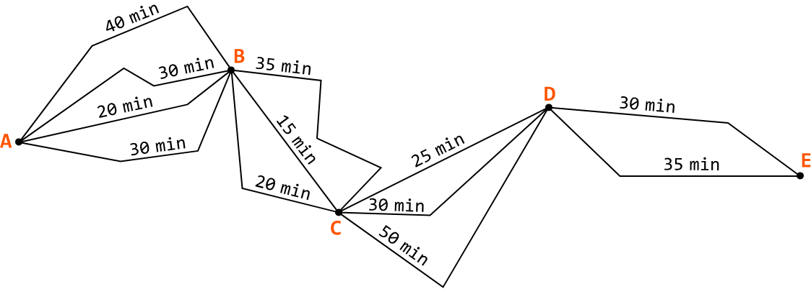

You want the fastest route for this journey, so you aim to optimize the route. One option is to check every possible route to see which one takes the least amount of time to drive through, but this approach is quite time consuming.

Instead, you decide to take the route with the shortest duration at each leg of the trip, understanding that it will result in the quickest journey:

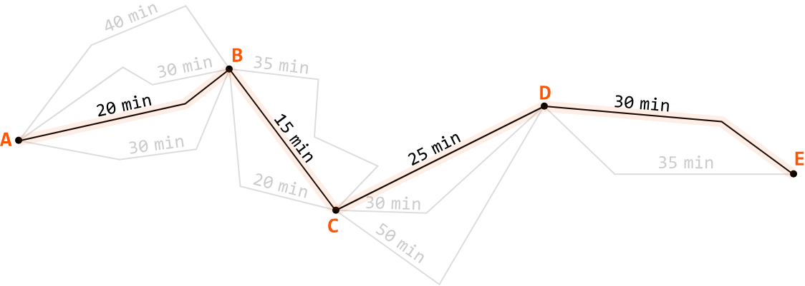

This is effectively a greedy approach to the problem, where you choose the best option at each step, aiming to find the best solution overall.

## How does a greedy algorithm work?

More formally, a greedy algorithm follows the greedy choice property, which states that the best overall solution to a problem (global optimum) can be arrived at by making the best possible decision at each step (local optimum).

Each decision is made based only on the current context, and ignores its impact on future steps. This process continues until the algorithm reaches a final solution.

## How to tell if a problem can be solved using a greedy approach

Greedy approaches are generally used for optimization problems, similar to DP. This means we check if the problem has an optimal substructure which can be broken down and solved by smaller subproblems.

The key difference between DP and greedy approaches is their decision-making strategies. Greedy algorithms follow the greedy choice property, while DP considers all possible solutions to find the global optimum. It's generally the case that all greedy problems can be solved using DP, but not all DP problems can be solved using a greedy approach.

## Real-world Example

**Huffman coding in data compression:** Huffman coding is an algorithm that assigns variable-length codes to input characters based on their frequencies, with the most frequent characters getting the shortest codes. The goal is to minimize the overall size of the encoded data. The greedy approach works by always combining the two least frequent characters first (local optimum), ensuring that each step reduces the size of the overall encoding (global optimum). This method is widely used in file compression formats like ZIP, and media compression standards like JPEG.

## Chapter Outline

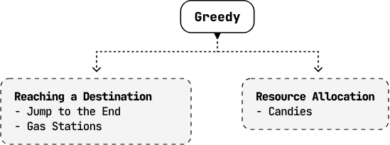

It's impractical to provide a one-size-fits-all framework for solving greedy problems because each one is unique. Instead, this chapter explores a variety of unique situations in which a problem can be solved using the greedy choice property to provide a general understanding of how this property works.


---


# Jump to the End

You are given an integer array in which you're originally positioned at index 0. Each number in the array represents the maximum jump distance from the current index. Determine if it's possible to reach the end of the array.

**Example 1:**

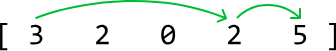

Input: nums = [3, 2, 0, 2, 5]
Output: True

**Example 2:**

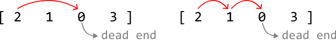

Input: nums = [2, 1, 0, 3]
Output: False

**Constraints:**
- There is at least one element in `nums`.
- All integers in `nums` are non-negative integers.

## Intuition

From any index `i` in the array, we can jump up to `nums[i]` positions to the right. This means the furthest index we can reach from any given index `i`, is `i + nums[i]`:

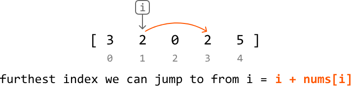

If the array consisted entirely of positive numbers, jumping from index 0 to the last index would be straightforward, as there would always be a way to progress forward toward the last index. The challenge arises when we encounter a 0 in the array, as a 0 is effectively a dead end, since landing on it disallows any further movement.

Consider the example below:

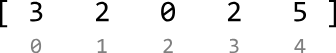

Let's think about this problem backward. Our destination is the last index, index 4, but let's say we've already made it there. How did we reach this index? In this example, it's possible to make it to index 4 from index 3:

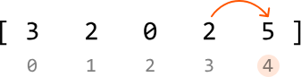

This means that if we find a way to reach index 3, we know for sure we can make it to index 4. The key observation here is that if we can reach the last index from any earlier index, this earlier index becomes our new destination.

With this in mind, let's go through this example in full, starting with the last index as our initial destination:

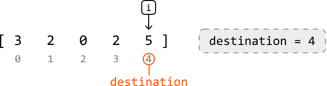

To find earlier indexes that can reach the destination, let's move backward through the array, starting at index 3. As we do this for each index, we check if we can reach the current destination from this index. If we can, this index becomes the new destination. We do this by checking if it's possible to jump to the destination from this index:

`if i + nums[i] ≥ destination, we can jump to destination from index i.`

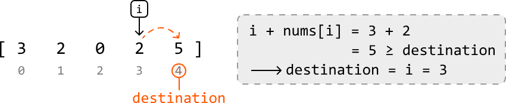

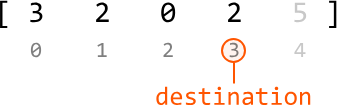

With the destination at index 3, let's continue moving backward through the array.

Now, we're at index 2. Below, we see we cannot reach the destination from index 2, so the destination is not updated.

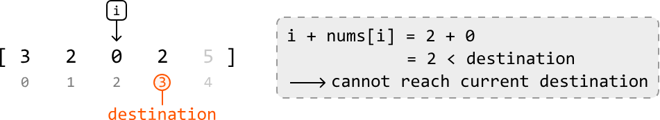

Continue with this logic for the remaining numbers in the array:

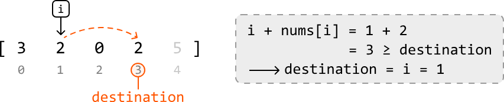

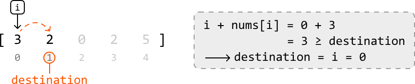

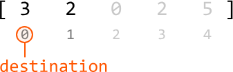

Finally, we see that once we've finished iterating through each index, the destination is set to index 0. This means we've successfully found a way to jump to the end from index 0.

Therefore, we return true when `destination == 0`. Otherwise, we cannot reach the destination from index 0, so we return false.

An interesting aspect of this approach is that as soon as we find an index `i` from where we can reach the destination, we update the destination to that index and assume that this is the correct decision:

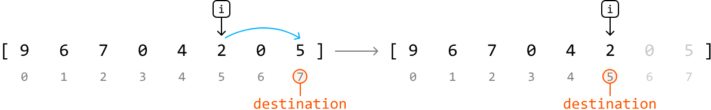

The thing is, there can sometimes be multiple indexes which can reach the destination. So, how do we know that choosing the first valid index we encounter from the right is the best choice?

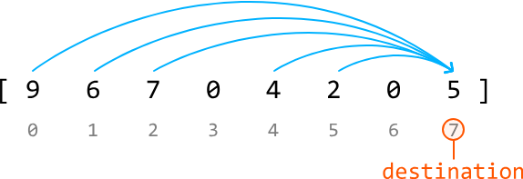

The key to understanding why is realizing that all the other indexes which can reach the destination can also reach this first valid index:

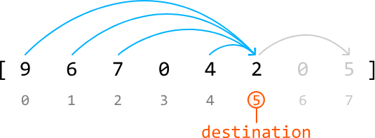

Therefore, by choosing the first valid index, we effectively simplify our problem without missing any potential solutions.

This is indicative of a greedy solution; since the greedy choice property is satisfied, we make the best immediate choice at each step as we move backward through the array (local optimums), hoping it leads to the overall solution (global optimum).

## Try it yourself

Write your solution to the problem before checking the reference implementation.

## Implementation

### Python 
```python
from typing import List
    
def jump_to_the_end(nums: List[int]) -> bool:
    # Set the initial destination to the last index in the array.
    destination = len(nums) - 1
    # Traverse the array in reverse to see if the destination can be reached by
    # earlier indexes.
    for i in range(len(nums) - 1, -1, -1):
        # If we can reach the destination from the current index, set this index as
        # the new destination.
        if i + nums[i] >= destination:
            destination = i
    # If the destination is index 0, we can jump to the end from index 0.
    return destination == 0
```
### JavaScript
```javascript
export function jump_to_the_end(nums) {
  // Set the initial destination to the last index in the array
  let destination = nums.length - 1
  // Traverse the array in reverse
  for (let i = nums.length - 1; i >= 0; i--) {
    // If we can reach the destination from the current index
    if (i + nums[i] >= destination) {
      destination = i
    }
  }
  // If the destination is 0, we can jump to the end from the start
  return destination === 0
}
```
### Java
```java
import java.util.ArrayList;

public class Main {
    public static boolean jump_to_the_end(ArrayList<Integer> nums) {
        // Set the initial destination to the last index in the array.
        int destination = nums.size() - 1;
        // Traverse the array in reverse to see if the destination can be reached by
        // earlier indexes.
        for (int i = nums.size() - 1; i >= 0; i--) {
            // If we can reach the destination from the current index, set this index as
            // the new destination.
            if (i + nums.get(i) >= destination) {
                destination = i;
            }
        }
        // If the destination is index 0, we can jump to the end from index 0.
        return destination == 0;
    }
}
```
## Complexity Analysis

**Time complexity:** The time complexity of `jump_to_the_end` is $O(n)$, where $n$ denotes the length of the array. This is because we iterate through each element of `nums` in reverse order.

**Space complexity:** The space complexity is $O(1)$.


---


# Gas Stations

There's a circular route which contains gas stations. At each station, you can fill your car with a certain amount of gas, and moving from that station to the next one consumes some fuel.

Find the index of the gas station you would need to start at, in order to complete the circuit without running out of gas. Assume your car starts with an empty tank. If it's not possible to complete the circuit, return `-1`. If it's possible, assume only one solution exists.

**Example:**
Input: gas = [2, 5, 1, 3], cost = [3, 2, 1, 4]
Output: 1
Explanation:

- Start at station 1: gain 5 gas (tank = 5), costs 2 gas to go to station 2 (tank = 3).
- At station 2: gain 1 gas (tank = 4), costs 1 gas to go to station 3 (tank = 3).
- At station 3: gain 3 gas (tank = 6), costs 4 gas to go to station 0 (tank = 2).
- At station 0: gain 2 gas (tank = 4), costs 3 gas to go to station 1 (tank = 1).
- We started and finished the circuit at station 1 without running out of gas.

## Intuition

Before deciding which gas station to start with, let's first determine if it's even possible to complete the circuit with the total amount of gas available.

### Total gas vs total cost

**Case 1: sum(gas) < sum(cost):**
The first thing to realize is if the total gas is less than the total cost, it's impossible to complete the circuit. No matter where we start, we'll run out of gas before completing the circuit. So, in this situation, we should return `-1`.

**Case 2: sum(gas) ≥ sum(cost):**
Now, let's consider the more interesting case where the total travel cost is less than or equal to the total amount of gas available.

Here's a potential hypothesis:

> Since there's enough total gas to cover the total cost of travel, there must be a start point in the circuit that allows us to complete it without ever running out of gas.

It's tough to confirm this hypothesis without examining an example, so let's dive into one.

### Finding a start point

Consider the following example where sum(gas) > sum(cost):

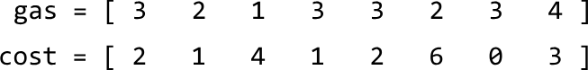

We don't necessarily need to consider the gas and cost separately. At any station `i`, we collect `gas[i]` and consume `cost[i]` to move to the next station. We can consider both at the same time by getting the difference between these values, which provides the net gas gained or lost at each station:

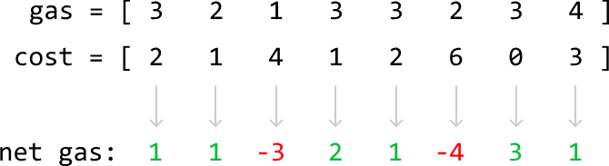

Let's start at station 0 with an empty gas tank and see how far we can go. The net gas at this station is positive (1), which means we have enough gas to reach the next station. Let's add 1 to our tank:

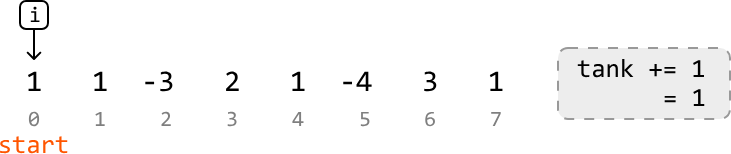

Note that index `i` refers to the current gas station, whereas `start` refers to the gas station we started from.

At station 1, we encounter the same situation:

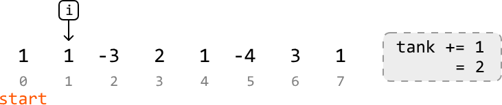

At station 2, our tank falls below 0, indicating we don't have enough gas to make it to the next station:

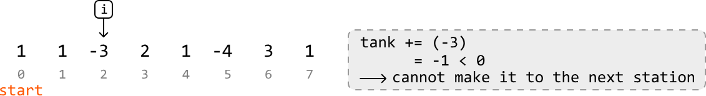

This means we cannot start our journey at station 0. Should we go back and try station 1? The key observation here is that if we didn't have enough gas to get from station 0 to station 3, we also wouldn't have enough if we started at any other station before station 3:

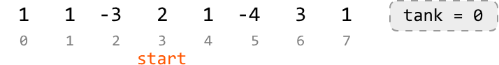

This is a general rule:

If we cannot make it to station b from station a, we cannot make it to station b from any of the stations in between, either:

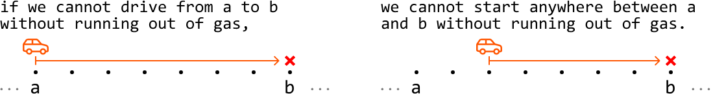

Let's try to understand why. If we only just ran out of gas right before reaching station b, this means our tank maintained a non-negative amount of gas until station b:

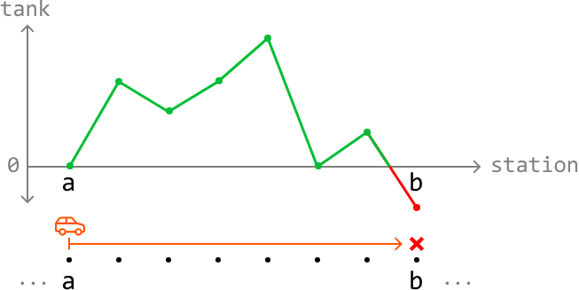

Consequently, starting anywhere else before station b will result in us missing a non-negative amount of gas from the previous stations. Therefore, starting at any of these in-between stations doesn't allow us to progress to station b.

Back to our example. Let's now try resetting our tank to 0 and restarting at station 3 (at i + 1), since we just discussed how starting at stations 0 to i doesn't work:

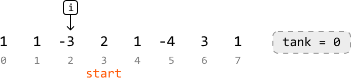

We continue until we reach a point where we cannot proceed to the next station:

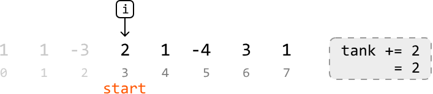

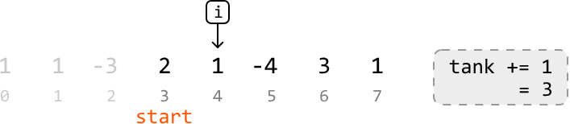

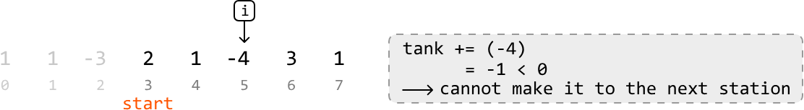

As we can see, we ran out of gas at station 5, which means we can't start from stations 3 to 5, either. So, let's try restarting at station 6.

After resetting the tank to 0, let's continue traveling through the stations:

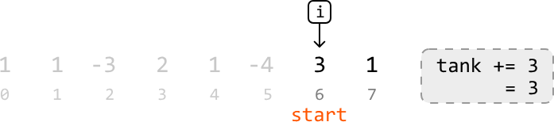

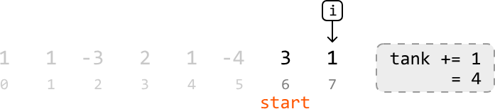

We've reached the end of the array. Should we go back to the start of the array to check if starting from station 6 allows us to complete the circuit? Or is reaching the end from station 6 enough to finish the circuit? Let's look into this.

### Proving we have enough gas to complete the circuit after reaching the end of the array

We can determine this via a proof by contradiction. If the gas we have by the end of the array is not enough, that means no solution exists: no station at which we could start in order to complete the circuit. This implies that no matter where we start, we will hit a deficit (i.e., a point where our tank falls below 0) before completing the circuit.

Consider a segment of the circuit where we run into a deficit:

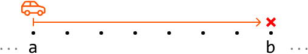

We learned earlier that we cannot start at any station between a and b (inclusive) without running into a deficit. So, we can characterize this entire segment as having less total gas than the total cost required to travel through it.

After concluding that we cannot start anywhere from stations a to b, we decide to restart at the next station after b, which represents the start of the next segment. Keep in mind that since there is no solution in this proof, every segment in the circuit will end with a deficit:

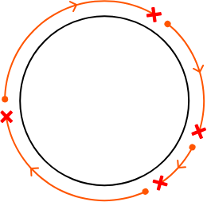

This means each of these segments has less total gas than total cost. Therefore, for there to be no starting point, `sum(gas)` would have to be less than `sum(cost)`.

However, we know that `sum(gas) ≥ sum(cost)`, confirming there must be a valid start point that allows us to complete the circuit.

Therefore, in our example, we can confirm that station 6 is the answer for the following reasons.

- `sum(gas) ≥ sum(cost)` implies that a solution must exist.
- We confirmed that starting anywhere before station 6 will result in us running into a deficit.
- We didn't encounter any deficit from station 6 to the last station in the array.

So, we just need to return `start`, which is station 6 in our example.

This is considered a greedy solution because we assume the first station we encounter that doesn't run into a deficit by the end of our array, is the start point that allows us to complete the circuit without testing every possible station in the array as the start point. The locally optimal choices (moving forward when possible, resetting when encountering a deficit) lead to the globally optimal solution (finding the correct starting point).

## Try it yourself

Write your solution to the problem before checking the reference implementation.

## Implementation

### Python 
```python
from typing import List
    
def gas_stations(gas: List[int], cost: List[int]) -> int:
    # If the total gas is less than the total cost, completing the circuit is
    # impossible.
    if sum(gas) < sum(cost):
        return -1
    start = tank = 0
    for i in range(len(gas)):
        tank += gas[i] - cost[i]
        # If our tank has negative gas, we cannot continue through the circuit from
        # the current start point, nor from any station before or including the
        # current station 'i'.
        if tank < 0:
            # Set the next station as the new start point and reset the tank.
            start, tank = i + 1, 0
    return start
```
### JavaScript
```javascript
export function gas_stations(gas, cost) {
  // If total gas is less than total cost, we can't complete the circuit
  if (gas.reduce((a, b) => a + b, 0) < cost.reduce((a, b) => a + b, 0)) {
    return -1
  }
  let start = 0
  let tank = 0
  for (let i = 0; i < gas.length; i++) {
    tank += gas[i] - cost[i]
    // If tank is negative, we can't reach the next station
    if (tank < 0) {
      start = i + 1
      tank = 0
    }
  }
  return start
}
```
### Java
```java
import java.util.ArrayList;

public class Main {
    public static int gas_stations(ArrayList<Integer> gas, ArrayList<Integer> cost) {
        // If the total gas is less than the total cost, completing the circuit is
        // impossible.
        int totalGas = 0;
        int totalCost = 0;
        for (int i = 0; i < gas.size(); i++) {
            totalGas += gas.get(i);
            totalCost += cost.get(i);
        }
        if (totalGas < totalCost) {
            return -1;
        }
        int start = 0;
        int tank = 0;
        for (int i = 0; i < gas.size(); i++) {
            tank += gas.get(i) - cost.get(i);
            // If our tank has negative gas, we cannot continue through the circuit from
            // the current start point, nor from any station before or including the
            // current station 'i'.
            if (tank < 0) {
                // Set the next station as the new start point and reset the tank.
                start = i + 1;
                tank = 0;
            }
        }
        return start;
    }
}
```
## Complexity Analysis

**Time complexity:** The time complexity of `gas_stations` is $O(n)$, where $n$ denotes the length of the input arrays. This is because we iterate through each element in the `gas` and `cost` arrays.

**Space complexity:** The space complexity is $O(1)$.

## Interview Tip

> **Tip: Demonstrate your greedy solution with examples if proving it formally is too difficult**
> In some problems, such as this one, proving that a greedy solution works might be complicated, especially in an interview setting. If you and the interviewer are on the same page about this, a good compromise is to demonstrate the solution's correctness with a few diverse examples. This approach allows both you and the interviewer to have confidence in your solution in the absence of a thorough proof.


---


# Candies

You teach a class of children sitting in a row, each of whom has a rating based on their performance. You want to distribute candies to the children while abiding by the following rules:

- Each child must receive at least one candy.
- If two children sit next to each other, the child with the higher rating must receive more candies.

Determine the minimum number of candies you need to distribute to satisfy these conditions.

**Example 1:**
Input: ratings = [4, 3, 2, 4, 5, 1]
Output: 12
Explanation: You can distribute candies to each child as follows: [3, 2, 1, 2, 3, 1].

**Example 2:**
Input: ratings = [1, 3, 3]
Output: 4
Explanation: You can distribute candies to each child as follows: [1, 2, 1].

## Intuition

For starters, we know we need to give at least 1 candy to each of the n children to satisfy the first requirement of this problem. As for the other requirement, let's start off by considering a few specific cases.

### Uniform ratings

Consider the situation where all children have the same rating. Since no child has a higher rating than another, we can give each child one candy to meet both requirements.

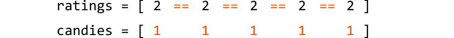

### Increasing ratings

Now, consider the case where the children's ratings are in strictly increasing order. Here, each child should receive one more candy than their left-side neighbor.

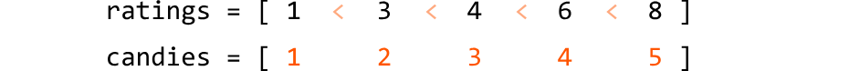

The first child gets one candy because they have no left-side neighbor, and a smaller rating than their right-side neighbor. Each subsequent child has a higher rating than their left-side neighbor, so gets one more candy than that neighbor.

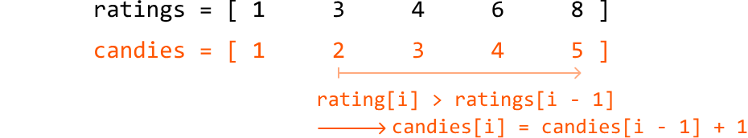

### Decreasing ratings

Here, each child needs to receive one more candy than their right-side neighbor.

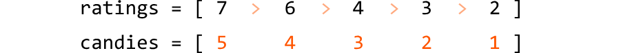

This is the same as the previous case, but in reverse. To populate the candies array in reverse, we start with the child furthest to the right, giving them one candy. Moving leftward, we give each child one more candy than their right-side neighbor:

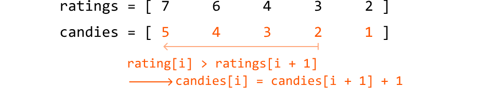

### Non-uniform ratings

Unlike previous cases, in a non-uniform distribution of ratings, children can have higher ratings than their left-side neighbor, right-side neighbor, both neighbors, or neither. This makes handling non-uniform ratings more complex.

What if we can handle these cases separately? Specifically, we could use:

- One pass to ensure children with a higher rating than their left-side neighbor get more candy (handle increasing ratings).
- A second pass to ensure children with a higher rating than their right-side neighbor get more candy (handle decreasing ratings).

This allows us to apply the logic we used for increasing and decreasing ratings in two separate passes. Let's see if this strategy works over the following example, starting with an initial distribution of 1 candy for each child to ensure we meet the first requirement of this problem:

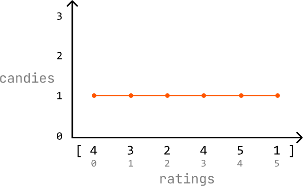

### First pass: handle increasing ratings

Iterate through the ratings array and, for each child, check if they have a higher rating than their left-side neighbor (if `ratings[i] > ratings[i - 1]`). Start from index 1 since the child at index 0 doesn't have a left-side neighbor.

If a child's rating is higher than their left-side neighbor's rating, make sure they have at least one more candy than their left-side neighbor (`candies[i] = candies[i - 1] + 1`).

Otherwise, just continue to the next child's rating.

We can see how this process updates the candy distribution below:

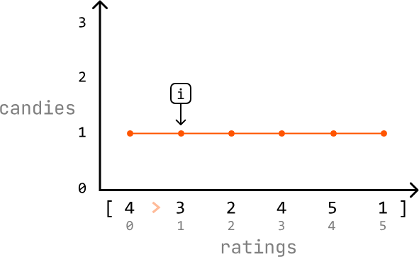

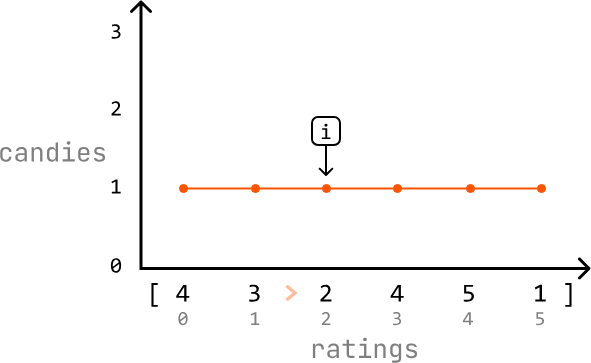

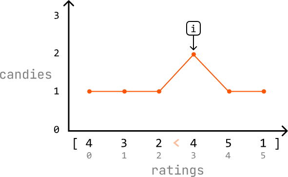

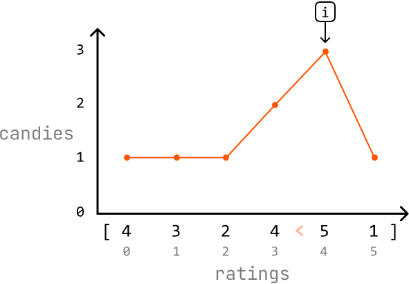

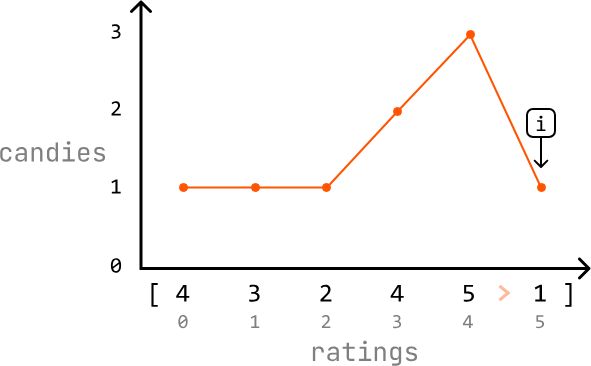

### Second pass: handle decreasing ratings

Iterate through the ratings array in reverse and, for each child, check if they have a higher rating than their right-side neighbor (if `ratings[i] > ratings[i + 1]`). Start at index 4 since the child at index 5 (the last child) doesn't have a right-side neighbor.

If a child's rating is higher than their right-side neighbor's rating, make sure they have one more candy than that neighbor. Note that because we already did one pass through the candies array, they might already have more candies than their right-side neighbor, in which case the current amount of candy they have is sufficient.

Otherwise, continue to the next child's rating.

We can see how this process updates the candy distribution below:

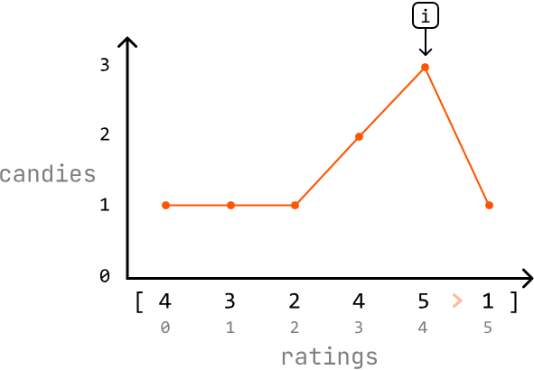

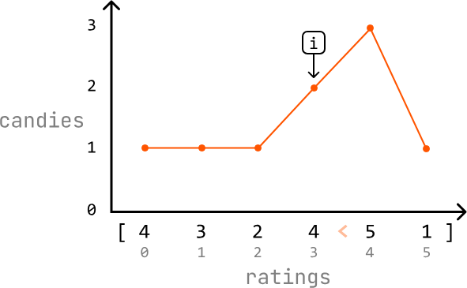

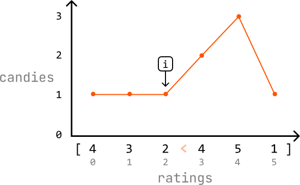

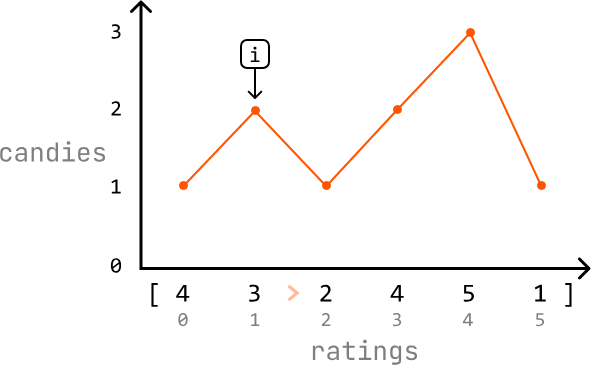

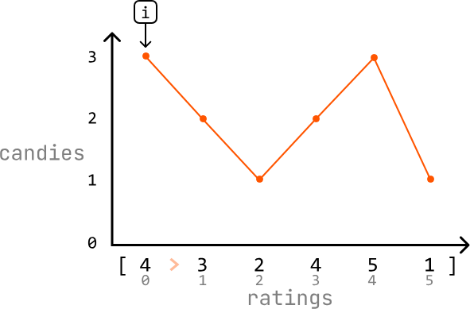

At the end of the second pass, each child should have the correct number of candies. Now, we just need to return the sum of all the candies in the `candies` array.

The solution we came up with is a greedy solution because it satisfies the greedy choice property: we make a locally optimal choice for the current child by only considering the ratings of their immediate neighbors, without worrying about the ratings of other children.

How can we be sure this strategy works? Over our two passes, we ensure both the left-side and right-side neighbors of each child are considered when distributing candies. This guarantees that the solution meets the problem's requirements.

## Try it yourself

Write your solution to the problem before checking the reference implementation.

## Implementation

### Python 
```python
from typing import List
    
def candies(ratings: List[int]) -> int:
    n = len(ratings)
    # Ensure each child starts with 1 candy.
    candies = [1] * n
    # First pass: for each child, ensure the child has more candies than their
    # left-side neighbor if the current child's rating is higher.
    for i in range(1, n):
        if ratings[i] > ratings[i - 1]:
            candies[i] = candies[i - 1] + 1
    # Second pass: for each child, ensure the child has more candies than their
    # right-side neighbor if the current child's rating is higher.
    for i in range(n - 2, -1, -1):
        if ratings[i] > ratings[i + 1]:
            # If the current child already has more candies than their right-side
            # neighbor, keep the higher amount.
            candies[i] = max(candies[i], candies[i + 1] + 1)
    return sum(candies)
```
### JavaScript
```javascript
export function candies(ratings) {
  const n = ratings.length
  const candies = new Array(n).fill(1)
  // First pass: left to right
  for (let i = 1; i < n; i++) {
    if (ratings[i] > ratings[i - 1]) {
      candies[i] = candies[i - 1] + 1
    }
  }
  // Second pass: right to left
  for (let i = n - 2; i >= 0; i--) {
    if (ratings[i] > ratings[i + 1]) {
      candies[i] = Math.max(candies[i], candies[i + 1] + 1)
    }
  }
  return candies.reduce((sum, c) => sum + c, 0)
}
```
### Java
```java
import java.util.ArrayList;

public class Main {
    public static int candies(ArrayList<Integer> ratings) {
        int n = ratings.size();
        // Ensure each child starts with 1 candy.
        int[] candies = new int[n];
        for (int i = 0; i < n; i++) {
            candies[i] = 1;
        }
        // First pass: for each child, ensure the child has more candies than their
        // left-side neighbor if the current child's rating is higher.
        for (int i = 1; i < n; i++) {
            if (ratings.get(i) > ratings.get(i - 1)) {
                candies[i] = candies[i - 1] + 1;
            }
        }
        // Second pass: for each child, ensure the child has more candies than their
        // right-side neighbor if the current child's rating is higher.
        for (int i = n - 2; i >= 0; i--) {
            if (ratings.get(i) > ratings.get(i + 1)) {
                // If the current child already has more candies than their right-side
                // neighbor, keep the higher amount.
                candies[i] = Math.max(candies[i], candies[i + 1] + 1);
            }
        }
        int total = 0;
        for (int c : candies) {
            total += c;
        }
        return total;
    }
}
```
## Complexity Analysis

**Time complexity:** The time complexity of `candies` is $O(n)$ because we perform two passes over the `nums` array.

**Space complexity:** The space complexity is $O(n)$ due to the space taken up by the `candies` array.