# 17. Sort And Search

1. [Introduction to Sort and Search](#introduction-to-sort-and-search)
2. [Sort Linked List](#sort-linked-list)
3. [Sort Array](#sort-array)
4. [Kth Largest Integer](#kth-largest-integer)
5. [Dutch National Flag](#dutch-national-flag)

---

# Introduction to Sort and Search

## Intuition

When sorting and searching items in data structures, efficiency is key. This chapter covers common sorting methods and their roles in efficient searching.

First, we present a comparison of the time and space complexities for various sorting algorithms. Below, $n$ denotes the number of elements in the data structure:

| Algorithm | Time complexity (Best case) | Time complexity (Average case) | Time complexity (Worst case) | Space complexity |
|---|---|---|---|---|
| Insertion sort [1] | $O(n)$ | $O(n^2)$ | $O(n^2)$ | $O(1)$ |
| Selection sort [2] | $O(n^2)$ | $O(n^2)$ | $O(n^2)$ | $O(1)$ |
| Bubble sort [3] | $O(n)$ | $O(n^2)$ | $O(n^2)$ | $O(1)$ |
| Merge sort | $O(n\log(n))$ | $O(n\log(n))$ | $O(n\log(n))$ | $O(n)$ |
| Quicksort | $O(n\log(n))$ | $O(n\log(n))$ | $O(n^2)$ | $O(\log(n))$ (average) $O(n)$ (worst) |
| Heapsort [4] | $O(n\log(n))$ | $O(n\log(n))$ | $O(n\log(n))$ | $O(1)$ |
| Counting sort¹ | $O(n+k)$ | $O(n+k)$ | $O(n+k)$ | $O(n+k)$ |
| Bucket sort² [5] | $O(n+k)$ | $O(n+k)$ | $O(n^2)$ | $O(n+k)$ |
| Radix sort³ [6] | $O(d(n+k))$ | $O(d(n+k))$ | $O(d(n+k))$ | $O(n+k)$ |

This chapter focuses on merge sort, quicksort, and counting sort. There is additional information on the other algorithms in the references provided, as well as a tool for visualizing how these algorithms work [7].

## Fundamental concepts for sorting algorithms

Here's a list of fundamental attributes of sorting algorithms you should be familiar with:

**Stability:** A sorting algorithm is considered stable if it preserves the relative order of equal elements in the sorted output. If two elements have equal values, their order in the sorted output is the same as in the input.

**In-place sorting:** An in-place sorting algorithm transforms the input using a constant amount of extra storage space. It involves sorting the elements within the original data structure.

**Comparison-based sorting:** Comparison-based sorting algorithms sort elements by comparing them pairwise. These algorithms typically have a lower bound of $O(n\log(n))$, whereas non-comparison-based sorting algorithms can achieve linear time complexity, but require specific assumptions about the input data.

These concepts are referenced throughout the problems in this chapter.

## Real-world Example

**Sorting products by category:** When users search for products, the platform often sorts the results based on various criteria such as lowest to highest price, highest to lowest rating, or even relevance to the search query. Efficient sorting algorithms ensure large datasets of products can be quickly arranged according to user preferences.

## Chapter Outline

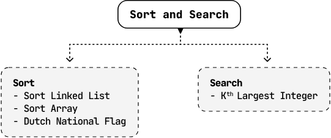

---

## Footnotes

¹ In counting sort, $k$ represents the range of the values in the input array.

² In bucket sort, $k$ represents the number of buckets used.

³ In radix sort, $k$ represents the range of the inputs and $d$ represents the number of digits in the maximum element.


---


# Sort Linked List

Given the head of a singly linked list, sort the linked list in ascending order.

## Example

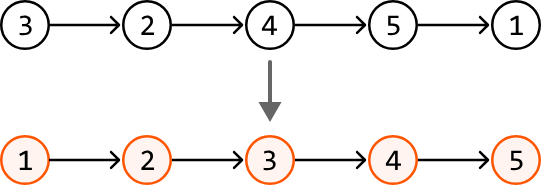

## Intuition

Let's start by finding a sorting algorithm that allows us to sort a linked list.

### Choosing a sorting algorithm

We're tasked with sorting a linked list, not an array. This distinction is crucial because algorithms like quicksort rely on random access through indexing, which linked lists don't support. Merge sort is a great $O(n\log(n))$ time option, where $n$ denotes the length of the linked list, because it does not require random access and works well with linked lists, as we'll see in this explanation.

### Merge sort

The merge sort algorithm uses a divide and conquer strategy. At a high level, it can be broken down into three steps:

1. **Split the linked list into two halves:**

   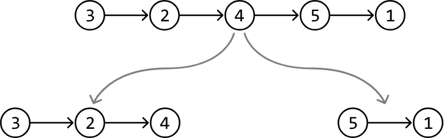

2. **Recursively sort both halves:**

   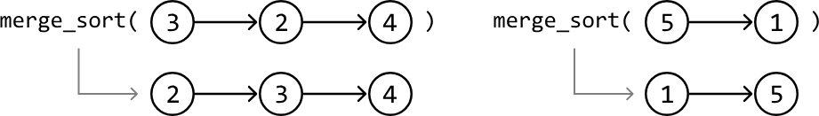

3. **Merge the halves back together in a sorted manner to form a single sorted list:**

   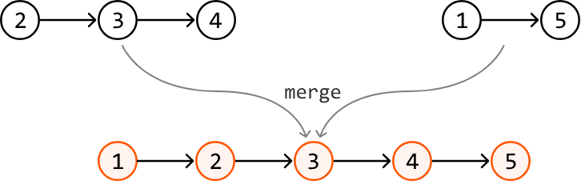

We can see what the entire process looks like in the diagram below:

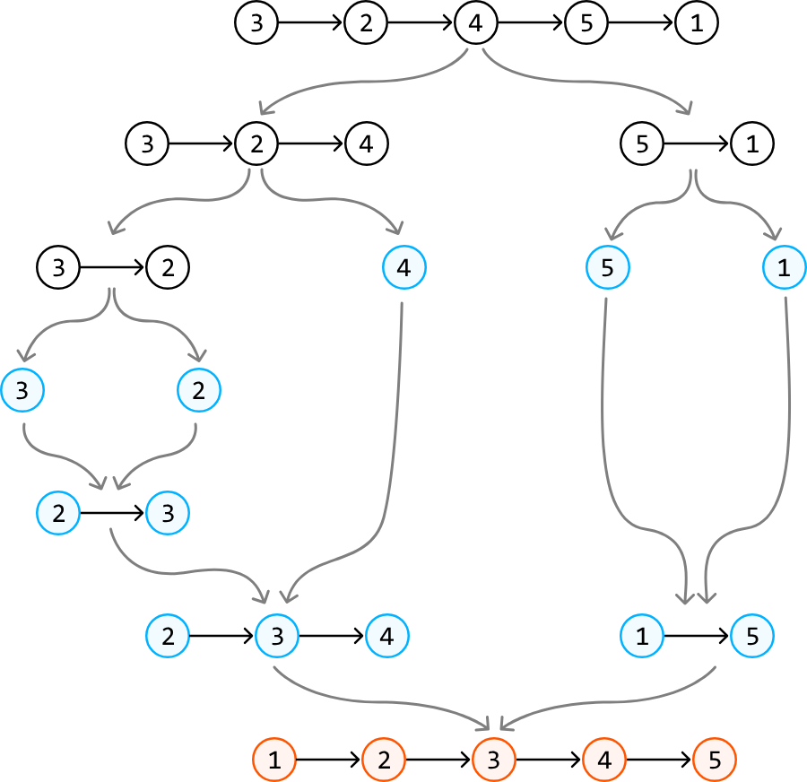

This is what this process looks like as pseudocode:
### Python
```python
def merge_sort(head):
    # Split the linked list into two halves.
    second_head = split_list(head)
    # Recursively sort both halves.
    first_half_sorted = merge_sort(head)
    second_half_sorted = merge_sort(second_head)
    # Merge the sorted sublists.
    return merge(first_half_sorted, second_half_sorted)
```

Let's discuss in more detail how to split a linked list, and how to merge two sorted linked lists.

### Splitting the linked list in half

To split a linked list in half, we need access to its middle node because the node next to the middle node can represent the head of the second linked list:

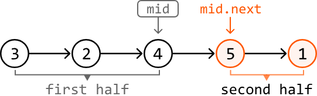

We can retrieve the middle node using the fast and slow pointer technique, as described in the Linked List Midpoint problem:

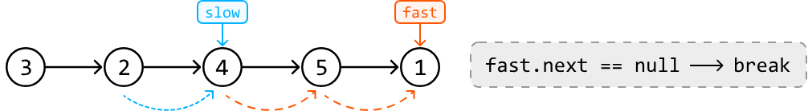

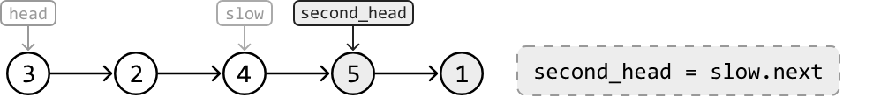

Then, we just need to disconnect the two halves by setting slow.next to null:

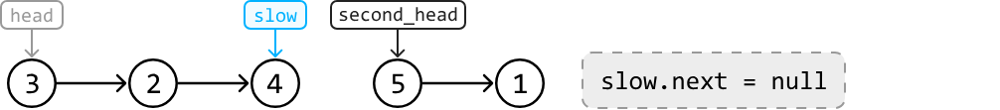

Note that when the linked list is of even length, there are two middle nodes. We want the slow pointer to stop at the first middle node so we can get the head of the second half more easily. As mentioned in Linked List Midpoint, we can achieve this by stopping the fast pointer when fast.next.next is null:

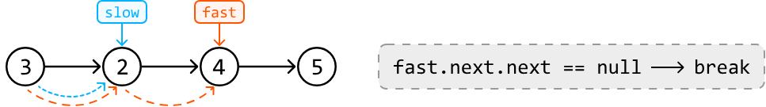

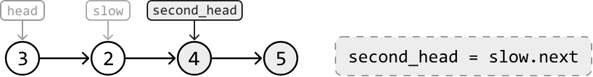

### Merging two sorted linked lists

First, let's consider merging two linked lists, each containing a single node, meaning they're both inherently sorted. We merge them by placing the smaller node first, followed by the other node:

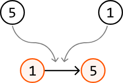

With that established, how would we merge two longer linked lists? To do this, we can set two pointers, one at the start of each linked list, then perform the following steps:

1. Compare the nodes at each pointer and add the node with the smaller value to the merged linked list.

2. Advance the pointer at that node with the smaller value to the next node in its linked list.

3. Repeat the above two steps until we can no longer advance either pointer.

Before discussing the final step, observe how these steps are applied to the following two sorted linked lists. We can use a dummy node to point to the head of the merged linked list:

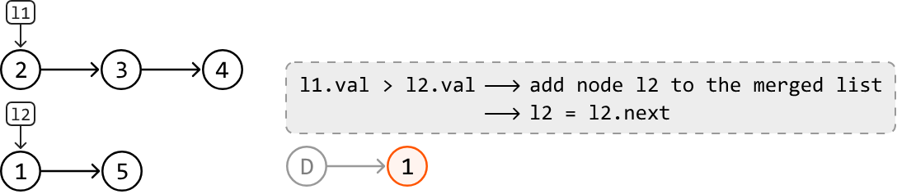

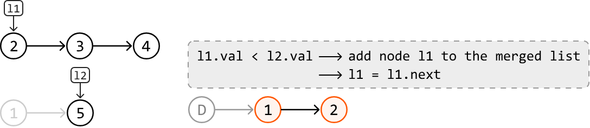

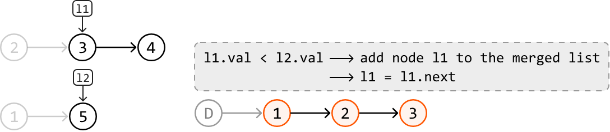

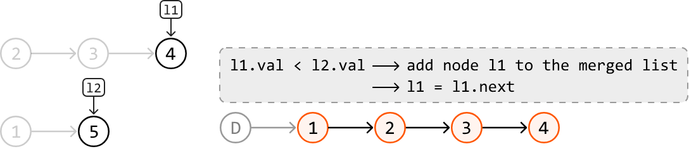

If one of the linked lists has been entirely added to the merged list, we can just add the rest of the other linked list to the merged list:

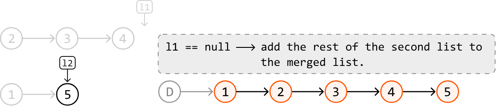

## Try it yourself

Write your solution to the problem before checking the reference implementation.

## Implementation

### Python 
```python
from typing import List
    
def sort_linked_list(head: ListNode) -> ListNode:
    # If the linked list is empty or has only one element, it's already sorted.
    if not head or not head.next:
        return head
    # Split the linked list into halves using the fast and slow pointer technique.
    second_head = split_list(head)
    # Recursively sort both halves.
    first_half_sorted = sort_linked_list(head)
    second_half_sorted = sort_linked_list(second_head)
    # Merge the sorted sublists.
    return merge(first_half_sorted, second_half_sorted)
    
def split_list(head: ListNode) -> ListNode:
    slow = fast = head
    while fast.next and fast.next.next:
        slow = slow.next
        fast = fast.next.next
    second_head = slow.next
    slow.next = None
    return second_head
    
def merge(l1: ListNode, l2: ListNode) -> ListNode:
    dummy = ListNode(0)
    # This pointer will be used to append nodes to the tail of the merged linked list.
    tail = dummy
    # Continually append the node with the smaller value from each linked list to the
    # merged linked list until one of the linked lists has no more nodes to merge.
    while l1 and l2:
        if l1.val < l2.val:
            tail.next = l1
            l1 = l1.next
        else:
            tail.next = l2
            l2 = l2.next
        tail = tail.next
    # One of the two linked lists could still have nodes remaining. Attach those nodes
    # to the end of the merged linked list.
    tail.next = l1 or l2
    return dummy.next
```
### JavaScript
```javascript
export function sort_linked_list(head) {
  // If the linked list is empty or has only one element, it's already sorted.
  if (!head || !head.next) return head
  // Split the linked list into halves using the fast and slow pointer technique.
  const secondHead = splitList(head)
  // Recursively sort both halves.
  const firstHalfSorted = sort_linked_list(head)
  const secondHalfSorted = sort_linked_list(secondHead)
  // Merge the sorted sublists.
  return merge(firstHalfSorted, secondHalfSorted)
}

function splitList(head) {
  let slow = head
  let fast = head
  while (fast.next && fast.next.next) {
    slow = slow.next
    fast = fast.next.next
  }
  const secondHead = slow.next
  slow.next = null
  return secondHead
}

function merge(l1, l2) {
  const dummy = new ListNode(0)
  let tail = dummy
  // Continually append the node with the smaller value from each linked list
  // to the merged linked list until one of them has no more nodes to merge.
  while (l1 && l2) {
    if (l1.val < l2.val) {
      tail.next = l1
      l1 = l1.next
    } else {
      tail.next = l2
      l2 = l2.next
    }
    tail = tail.next
  }
  // Attach remaining nodes, if any.
  tail.next = l1 || l2
  return dummy.next
}
```
### Java
```java
import core.LinkedList.ListNode;

public class Main {
    public static ListNode<Integer> sort_linked_list(ListNode<Integer> head) {
        // If the linked list is empty or has only one element, it's already sorted.
        if (head == null || head.next == null) {
            return head;
        }
        // Split the linked list into halves using the fast and slow pointer technique.
        ListNode<Integer> secondHead = splitList(head);
        // Recursively sort both halves.
        ListNode<Integer> firstHalfSorted = sort_linked_list(head);
        ListNode<Integer> secondHalfSorted = sort_linked_list(secondHead);
        // Merge the sorted sublists.
        return merge(firstHalfSorted, secondHalfSorted);
    }

    public static ListNode<Integer> splitList(ListNode<Integer> head) {
        ListNode<Integer> slow = head;
        ListNode<Integer> fast = head;
        while (fast.next != null && fast.next.next != null) {
            slow = slow.next;
            fast = fast.next.next;
        }
        ListNode<Integer> secondHead = slow.next;
        slow.next = null;
        return secondHead;
    }

    public static ListNode<Integer> merge(ListNode<Integer> l1, ListNode<Integer> l2) {
        ListNode<Integer> dummy = new ListNode<>(0);
        // This pointer will be used to append nodes to the tail of the merged linked list.
        ListNode<Integer> tail = dummy;
        // Continually append the node with the smaller value from each linked list to the
        // merged linked list until one of the linked lists has no more nodes to merge.
        while (l1 != null && l2 != null) {
            if (l1.val < l2.val) {
                tail.next = l1;
                l1 = l1.next;
            } else {
                tail.next = l2;
                l2 = l2.next;
            }
            tail = tail.next;
        }
        // One of the two linked lists could still have nodes remaining. Attach those nodes
        // to the end of the merged linked list.
        tail.next = (l1 != null) ? l1 : l2;
        return dummy.next;
    }
}
```
## Complexity Analysis

**Time complexity:** The time complexity of sort_linked_list is $O(n\log(n))$ because it uses merge sort. Here's the breakdown:

- The linked list is recursively split until each sublist contains only one node. This splitting process happens about $\log_2(n)$ times because each split reduces the size of the linked list by half.

- At each level, we merge the split linked lists. Merging all elements at one level takes about $n$ operations.

- Since there are $\log_2(n)$ levels of splitting and merging, and there are $n$ operations at each level, the time complexity is $O(n\log(n))$.

**Space complexity:** The space complexity is $O(\log(n))$ due to the recursive call stack, which can grow up to $\log_2(n)$ in height.

## Stable Sorting

Merge sort is a stable sorting algorithm. This is important in scenarios where the original order of equal elements must be preserved. For example, if we are sorting a list of nodes that share the same value, but have an additional attribute storing the time they were created, then it's important for the relative order of these nodes to stay the same. Stability can be important for database systems; for instance, where stable sorting is required to maintain data integrity and consistency across multiple operations.


---


# Sort Array

Given an integer array, sort the array in ascending order.

## Example

```
Input: nums = [6, 8, 4, 2, 7, 3, 1, 5]
Output: [1, 2, 3, 4, 5, 6, 7, 8]
```

## Intuition

This problem is quite open-ended because there are many sorting algorithms we could use to sort an array, each with its own pros and cons. In this explanation, we focus on the quicksort algorithm, which runs in $O(n\log(n))$ time on average, where $n$ denotes the length of the array.

## Quicksort

Conceptually, the goal of quicksort is to sort the array by placing each number in its sorted position one at a time. To correctly position a number, we move all numbers smaller than it to its left, and all numbers larger than it to its right. At each step, we call this number the pivot. We discuss how a pivot is selected later in the explanation.

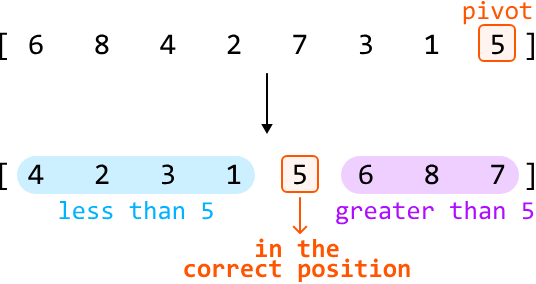

This process is called partitioning because we're dividing the array into two parts around the pivot:

- The left part with elements smaller than the pivot.
- The right part with elements larger than the pivot.

Note that neither the left nor the right part of the pivot value need to be sorted. All that matters is that the pivot is in the correct position.

After partitioning, we just need to sort the left and right parts. We can do this by recursively calling quicksort on both of them. This makes quicksort a divide and conquer strategy. The pseudocode for this is provided below:
### Python
```python
def quicksort(nums, left, right):
    # Partition the array and obtain the index of the pivot.
    pivot_index = partition(nums, left, right)
    # Sort the left and right parts.
    quicksort(nums, left, pivot_index - 1)
    quicksort(nums, pivot_index + 1, right)
```

Let's discuss the partitioning process in more detail.

## Partitioning

There are two primary steps to partitioning:

1. Selecting the pivot.
2. Rearranging the elements so elements smaller than the pivot are on its left, and elements larger than the pivot are on its right.

### Selecting the pivot

We can actually choose any number as the pivot. The method of selecting a pivot can be optimized, which is discussed later, but for simplicity, we can choose the rightmost number as the pivot:

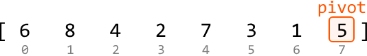

### Rearranging elements around the pivot

Let's see if we can do this in linear time without using extra space.

If we can ensure all numbers less than the pivot are placed to the left, then numbers greater than or equal to the pivot will consequently be placed to the right. This can be done using two pointers:

- One pointer at the left of the array (lo) to position the numbers less than the pivot.

- One pointer to iterate through the array (i), looking for numbers less than the pivot.

The main idea here is that whenever we encounter a number less than the pivot, swap it with nums[lo].

Let's look at the example below to understand how this works. First, keep advancing i until we find a number less than the pivot:

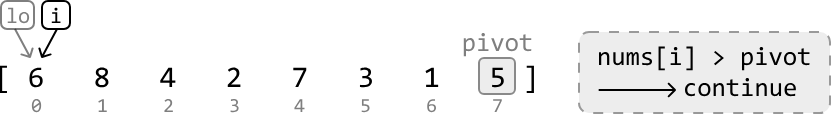

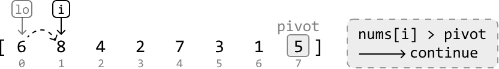

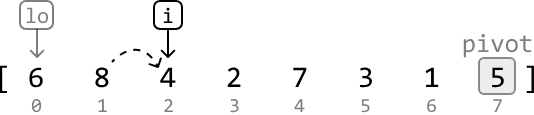

Once a number less than the pivot is found, move it to the left by swapping it with nums[lo]. Then, increment lo so it points to where the next number less than the pivot should be placed:

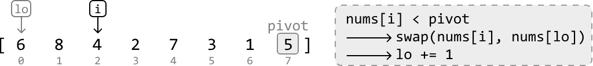

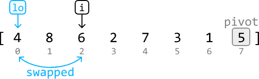

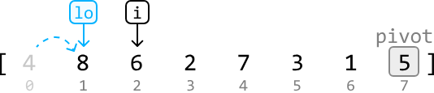

Continue this process until all numbers less than the pivot are on the left of the array:

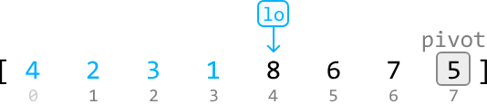

The last step is to move the pivot to the correct position by swapping the pivot with nums[lo]:

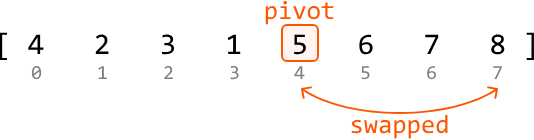

## Try it yourself

Write your solution to the problem before checking the reference implementation.

## Implementation

### Python 
```python
from typing import List
    
def sort_array(nums: List[int]) -> List[int]:
    quicksort(nums, 0, len(nums) - 1)
    return nums
    
def quicksort(nums: List[int], left: int, right: int) -> None:
    # Base case: if the subarray has 0 or 1 element, it's already sorted.
    if left >= right:
        return
    # Partition the array and retrieve the pivot index.
    pivot_index = partition(nums, left, right)
    # Call quicksort on the left and right parts to recursively sort them.
    quicksort(nums, left, pivot_index - 1)
    quicksort(nums, pivot_index + 1, right)
    
def partition(nums: List[int], left: int, right: int) -> int:
    pivot = nums[right]
    lo = left
    # Move all numbers less than the pivot to the left, which consequently positions
    # all numbers greater than or equal to the pivot to the right.
    for i in range(left, right):
        if nums[i] < pivot:
            nums[lo], nums[i] = nums[i], nums[lo]
            lo += 1
    # After partitioning, 'lo' will be positioned where the pivot should be. So, swap
    # the pivot number with the number at the 'lo' pointer.
    nums[lo], nums[right] = nums[right], nums[lo]
    return lo
```
### JavaScript
```javascript
export function sort_array(nums) {
  quicksort(nums, 0, nums.length - 1)
  return nums
}

function quicksort(nums, left, right) {
  // Base case: if the subarray has 0 or 1 element, it's already sorted.
  if (left >= right) return
  // Partition the array and retrieve the pivot index.
  const pivotIndex = partition(nums, left, right)
  // Call quicksort on the left and right parts to recursively sort them.
  quicksort(nums, left, pivotIndex - 1)
  quicksort(nums, pivotIndex + 1, right)
}

function partition(nums, left, right) {
  const pivot = nums[right]
  let lo = left
  // Move all numbers less than the pivot to the left, which consequently positions
  // all numbers greater than or equal to the pivot to the right.
  for (let i = left; i < right; i++) {
    if (nums[i] < pivot) {
      ;[nums[lo], nums[i]] = [nums[i], nums[lo]]
      lo++
    }
  }
  // After partitioning, 'lo' will be positioned where the pivot should be. So, swap
  // the pivot number with the number at the 'lo' pointer.
  ;[nums[lo], nums[right]] = [nums[right], nums[lo]]
  return lo
}
```
### Java
```java
import java.util.ArrayList;

public class Main {
    public static ArrayList<Integer> sort_array(ArrayList<Integer> nums) {
        quicksort(nums, 0, nums.size() - 1);
        return nums;
    }

    public static void quicksort(ArrayList<Integer> nums, int left, int right) {
        // Base case: if the subarray has 0 or 1 element, it's already sorted.
        if (left >= right) {
            return;
        }
        // Partition the array and retrieve the pivot index.
        int pivotIndex = partition(nums, left, right);
        // Call quicksort on the left and right parts to recursively sort them.
        quicksort(nums, left, pivotIndex - 1);
        quicksort(nums, pivotIndex + 1, right);
    }

    public static int partition(ArrayList<Integer> nums, int left, int right) {
        int pivot = nums.get(right);
        int lo = left;
        // Move all numbers less than the pivot to the left, which consequently positions
        // all numbers greater than or equal to the pivot to the right.
        for (int i = left; i < right; i++) {
            if (nums.get(i) < pivot) {
                int temp = nums.get(lo);
                nums.set(lo, nums.get(i));
                nums.set(i, temp);
                lo++;
            }
        }
        // After partitioning, 'lo' will be positioned where the pivot should be. So, swap
        // the pivot number with the number at the 'lo' pointer.
        int temp = nums.get(lo);
        nums.set(lo, nums.get(right));
        nums.set(right, temp);
        return lo;
    }
}
```
## Complexity Analysis

**Time complexity:** The time complexity of sort_array can be analyzed in terms of the average and worst cases:

- **Average case:** $O(n\log(n))$. In the average case, quicksort effectively divides the array into two roughly equal parts after each partition, leading to a recursive tree with a depth of approximately $\log_2(n)$. For each of these levels, we perform a partition which takes $O(n)$ time, resulting in a total time complexity of $O(n\log(n))$.

- **Worst case:** $O(n^2)$. The worst-case scenario occurs when the pivot selection consistently results in extremely unbalanced partitions, such as when the smallest or largest element is always chosen as a pivot, which is explained in more detail in the optimization. Uneven partitioning can result in a recursive depth as deep as $n$. For each of these $n$ levels of recursion, we perform a partition which takes $O(n)$ time, resulting in a total time complexity of $O(n^2)$.

**Space complexity:** The space complexity can also be analyzed in terms of the average and worst cases:

- **Average case:** $O(\log(n))$. In the average case, the depth of the recursive call stack is approximately $\log_2(n)$.

- **Worst case:** $O(n)$. In the worst case, the depth of the recursive call stack can be as deep as $n$.

## Optimization

As mentioned in the above complexity analysis, it's possible for a worst-case time complexity of $O(n^2)$ to occur. Let's dive into when this can happen. Consider the following array, which is already sorted:


If we perform quicksort on this array, we choose the rightmost element as the pivot and partition the other elements around this pivot. However, since this pivot is the largest element, there will be n-1 elements less than the pivot and 0 elements greater than or equal to it:

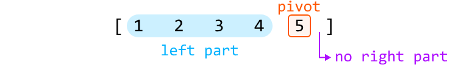

This creates quite an uneven partition. When we call quicksort on the left part, the same imbalance will occur, but with a left part consisting of n-2 elements:

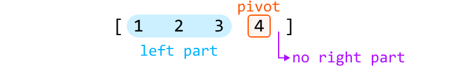

Continuing this until the quicksort process is complete results in a recursion depth of n.

An uneven partition occurs when we choose an extreme pivot: one that's larger or smaller than most other elements. Consistently picking an extreme pivot can occur when the array is sorted in increasing or decreasing order, or when there are many duplicates in the array.

To reduce the likelihood of choosing an extreme pivot, we can modify quicksort to choose a random pivot instead. There still remains a small chance of consistently picking an extreme pivot, but this outcome is no longer dependent on the order of the input array. A more detailed answer is discussed in the provided reference [1].

We can integrate this change into our current solution by randomly selecting an index and swapping its element with the rightmost element, before performing the partition. This way, we don't have to modify the partition function, as it uses the rightmost element:

### Python 
```python
def quicksort_optimized(nums: List[int], left: int, right: int) -> None:
    if left >= right:
        return
    # Choose a pivot at a random index.
    random_index = random.randint(left, right)
    # Swap the randomly chosen pivot with the rightmost element to position the pivot
    # at the rightmost index.
    nums[random_index], nums[right] = nums[right], nums[random_index]
    pivot_index = partition(nums, left, right)
    quicksort_optimized(nums, left, pivot_index - 1)
    quicksort_optimized(nums, pivot_index + 1, right)
```
### JavaScript
```javascript
function quicksort_optimized(nums, left, right) {
  if (left >= right) return
  // Choose a pivot at a random index.
  const randomIndex = Math.floor(Math.random() * (right - left + 1)) + left
  // Swap the randomly chosen pivot with the rightmost element to position the pivot
  // at the rightmost index.
  ;[nums[randomIndex], nums[right]] = [nums[right], nums[randomIndex]]
  const pivotIndex = partition(nums, left, right)
  quicksort_optimized(nums, left, pivotIndex - 1)
  quicksort_optimized(nums, pivotIndex + 1, right)
}
```
### Java
```java
public static void quicksort_optimized(ArrayList<Integer> nums, int left, int right) {
    if (left >= right) {
        return;
    }
    // Choose a pivot at a random index.
    Random rand = new Random();
    int randomIndex = rand.nextInt(right - left + 1) + left;
    // Swap the randomly chosen pivot with the rightmost element to position the pivot
    // at the rightmost index.
    int temp = nums.get(randomIndex);
    nums.set(randomIndex, nums.get(right));
    nums.set(right, temp);
    int pivotIndex = partition(nums, left, right);
    quicksort_optimized(nums, left, pivotIndex - 1);
    quicksort_optimized(nums, pivotIndex + 1, right);
}
```
## Interview Follow-Up

Let's say the interviewer introduces the following constraints to the initial sorting problem:

- The input array does not contain negative values.
- All values in the input array are less than or equal to $10^3$.

Does our approach to the problem change, and should we still use quicksort? Considering that all values in our array now fall within the limited range of $[0, 10^3]$, a counting sort approach becomes appropriate.

### Counting sort

Counting sort is a non-comparison-based sorting algorithm that works by counting the number of occurrences of each element in the array, then using these counts to place each element in its correct sorted position:

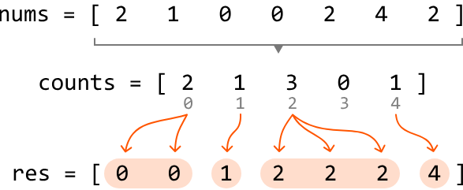

We can do this in two steps:

1. **Count occurrences:** create a counts array, where each of its indexes represents an element from the original array. Increment the value at each index based on how many times the corresponding element appears in the original array.

2. **Build sorted array (res):** iterate through each index of the counts array and add that index (i) to the sorted array as many times as its value (counts[i]) indicates.

Counting sort is efficient here because we know the largest possible number in the array is at most $10^3$, which means our counts array will have a maximum size of $10^3$ + 1. However, if this problem constraint is not specified and the maximum value in the array may be very large, then a counting sort solution might not be appropriate, due to the potentially large size of the counts array.

## Try it yourself

Write your solution to the problem before checking the reference implementation.

## Implementation

Note that there's another common method for implementing counting sort, which is detailed in the reference provided [2].

### Python
```python
from typing import List
    
def sort_array_counting_sort(nums: List[int]) -> List[int]:
    if not nums:
        return []
    res = []
    # Count occurrences of each element in 'nums'.
    counts = [0] * (max(nums) + 1)
    for num in nums:
        counts[num] += 1
    # Build the sorted array by appending each index 'i' to it a total of 'counts[i]'
    # times.
    for i, count in enumerate(counts):
        res.extend([i] * count)
    return res
```
### JavaScript
```javascript
export function sort_array_counting_sort(nums) {
  if (nums.length === 0) return []
  const res = []
  const maxVal = Math.max(...nums)
  const counts = new Array(maxVal + 1).fill(0)
  // Count occurrences of each element in 'nums'.
  for (const num of nums) {
    counts[num]++
  }
  // Build the sorted array.
  for (let i = 0; i < counts.length; i++) {
    for (let j = 0; j < counts[i]; j++) {
      res.push(i)
    }
  }
  return res
}
```
### Java
```java
import java.util.ArrayList;
import java.util.Collections;

public class Main {
    public static ArrayList<Integer> sort_array_counting_sort(ArrayList<Integer> nums) {
        if (nums == null || nums.isEmpty()) {
            return new ArrayList<>();
        }
        ArrayList<Integer> res = new ArrayList<>();
        // Count occurrences of each element in 'nums'.
        int max = Collections.max(nums);
        int[] counts = new int[max + 1];
        for (int num : nums) {
            counts[num]++;
        }
        // Build the sorted array by appending each index 'i' to it a total of 'counts[i]'
        // times.
        for (int i = 0; i < counts.length; i++) {
            for (int j = 0; j < counts[i]; j++) {
                res.add(i);
            }
        }
        return res;
    }
}
```
## Complexity Analysis

**Time complexity:** The time complexity of sort_array_counting_sort is $O(n+k)$, where $k$ denotes the maximum value of nums. This is because it takes $O(n)$ time to count the occurrences of each element and $O(k)$ time to build the sorted array.

**Space complexity:** The space complexity is $O(n+k)$, since the res array occupies $O(n)$ space, and the counts array takes up $O(k)$ space. Note that res is considered in the space complexity, as counting sort is not an in-place sorting algorithm requiring an additional array to store the sorted result.

## Interview Tip

> **Tip: Quicksort is useful for in-place sorting.**
> While quicksort isn't a stable sorting algorithm, it is an in-place sorting algorithm, meaning it requires less additional space compared to an algorithm such as merge sort, which takes $O(n)$ space when used to sort an array.


---


# Kth Largest Integer

Return the kth largest integer in an array.

## Example

```
Input: nums = [5, 2, 4, 3, 1, 6], k = 3
Output: 4
```

**Constraints:**
- The array contains no duplicates.
- The array contains at least one element.
- 1 ≤ k ≤ n, where n denotes the length of the array.

## Intuition - Min-Heap

A straightforward solution to this problem is to sort the array in reverse order and return the number at the (k - 1)th index:

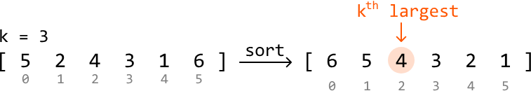

This solution takes $O(n\log(n))$ time, but as we only need the kth largest integer, sorting all the elements in the input array might not be necessary. Let's explore some solutions which take this into account.

An interesting thing to realize is that if we know what the top k largest integers are, we'd know that the smallest of these would be the kth largest integer:

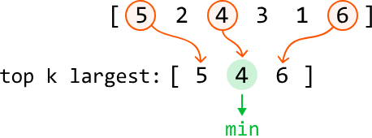

This leads to the idea that instead of sorting the entire array, we can keep track of the top k largest integers in the array. Is there a way to maintain the top k largest integers, while having access to the smallest of these integers?

A min-heap seems like it should work well for this purpose because it provides efficient access to the smallest element. Let's explore how to use it to maintain the top k integers in the array.

Consider the below example with k = 3. Let's begin by pushing the first k integers to the heap:

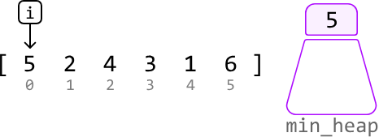

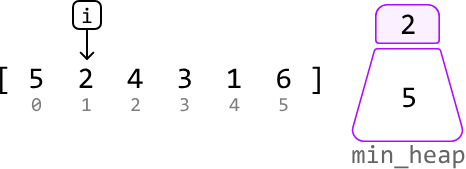

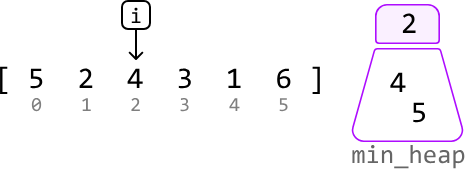

We shouldn't immediately push the next element, 3, in the heap because the heap already contains k integers. This gives us a choice:

- Skip 3, or:
- Remove an integer from the heap and push 3 in.

The smallest integer in the heap is 2. Integer 3 is more likely to belong in the top k integers than 2 is, so let's pop 2 from the heap and push 3 in:

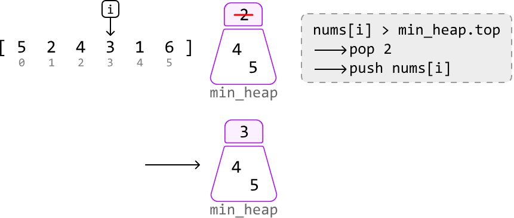

The next integer is 1, which is smaller than the smallest integer in the heap. So, we know it's not among the top k integers:

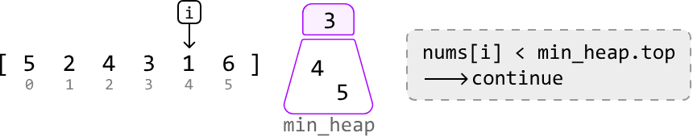

The final integer is 6. It's larger than the smallest integer in the heap. So, let's pop off the top of the heap and push in 6:

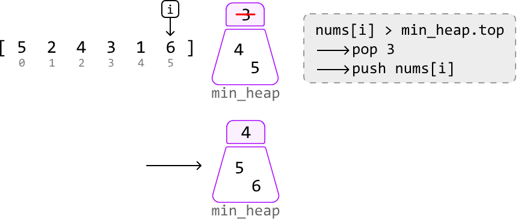

At this point, the k integers in the heap represent the top k largest integers from the array, with the smallest of these integers located at the top of the heap. This smallest value is the kth largest integer in the entire array, so we can just return this integer from the top of the heap:

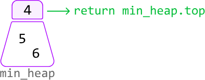

## Try it yourself

Write your solution to the problem before checking the reference implementation.

## Implementation - Min-Heap

### Python 
```python
from typing import List
import heapq
    
def kth_largest_integer_min_heap(nums: List[int], k: int) -> int:
    min_heap = []
    heapq.heapify(min_heap)
    for num in nums:
        # Ensure the heap has at least 'k' integers.
        if len(min_heap) < k:
            heapq.heappush(min_heap, num)
        # If 'num' is greater than the smallest integer in the heap, pop off this
        # smallest integer from the heap and push in 'num'.
        elif num > min_heap[0]:
            heapq.heappop(min_heap)
            heapq.heappush(min_heap, num)
    return min_heap[0]
```
### JavaScript
```javascript
import { MinPriorityQueue } from './helpers/heap/MinPriorityQueue.js'

export function kth_largest_integer_min_heap(nums, k) {
  // Create a min-heap with a simple comparator
  const minHeap = new MinPriorityQueue((n) => n)
  for (const num of nums) {
    // Ensure the heap has at least 'k' integers.
    if (minHeap.size() < k) {
      minHeap.enqueue(num)
    } else if (num > minHeap.front()) {
      // If 'num' is greater than the smallest integer in the heap,
      // replace the smallest with 'num'.
      minHeap.dequeue()
      minHeap.enqueue(num)
    }
  }
  // The kth largest element is the smallest in the heap now.
  return minHeap.front()
}
```
### Java
```java
import java.util.ArrayList;
import java.util.PriorityQueue;

public class Main {
    public Integer kth_largest_integer_min_heap(ArrayList<Integer> nums, int k) {
        PriorityQueue<Integer> minHeap = new PriorityQueue<>();
        for (int num : nums) {
            // Ensure the heap has at least 'k' integers.
            if (minHeap.size() < k) {
                minHeap.add(num);
            }
            // If 'num' is greater than the smallest integer in the heap, pop off this
            // smallest integer from the heap and push in 'num'.
            else if (num > minHeap.peek()) {
                minHeap.poll();
                minHeap.add(num);
            }
        }
        return minHeap.peek();
    }
}
```
## Complexity Analysis

**Time complexity:** The time complexity of kth_largest_integer_min_heap is $O(n\log(k))$ because for each integer, we perform at most one push and pop operation on the min-heap, which has a size no larger than $k$. Each heap operation takes $O(\log(k))$ time.

**Space complexity:** The space complexity is $O(k)$ because the heap can grow to a size of $k$.

## Intuition - Quickselect

The previous approach involved keeping track of the k largest integers to identify the kth largest integer. This effectively required us to keep these k values partially sorted through the use of a heap. But what if there's a way to position only the kth largest value in its expected sorted position, without sorting the other numbers?

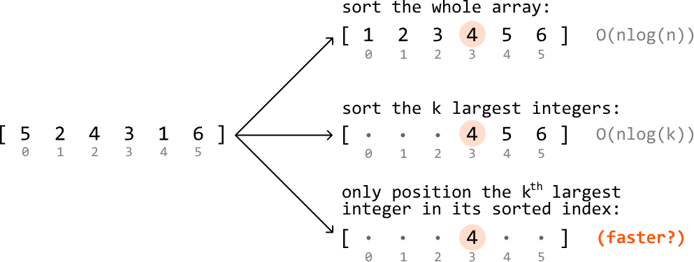

Quickselect can be used to achieve this.

Quickselect is an algorithm that leverages the partition step of quicksort, which positions a value in its sorted position. Quickselect is generally used to find the kth smallest element, whereas, in this problem, we're asked to find the kth largest element. To utilize quickselect for this purpose, we can instead find the (n - k)th smallest integer, which is equivalent to finding the kth largest element:

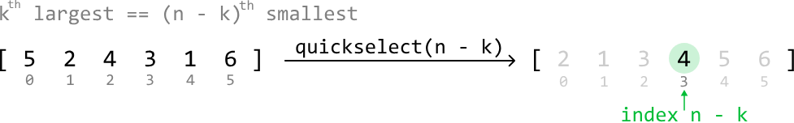

Now, let's dive into how quickselect works. To understand quickselect, we recommend you study the quicksort solution provided in the Sort Array problem.

Quickselect works identically to quicksort in that we:

1. Choose a pivot.
2. Partition the array into two parts by moving elements around the pivot so that:
   - Numbers less than the pivot are moved to its left.
   - Numbers greater than the pivot are moved to its right.

The primary difference between these two algorithms lies in the recursion step:

- In quicksort, we recursively process both the left and right parts.
- In quickselect, we only need to recursively process one of these parts.

Let's explore why only one part is chosen.

### Deciding which part of a partition to process

Suppose we pick a random number as a pivot. After performing a partition, this pivot will be positioned correctly. From here, there are three possibilities for the position of the (n - k)th smallest integer:

- If the pivot is positioned before index n - k, it means the (n - k)th smallest integer must be somewhere to the right of the pivot. So, perform quickselect on the right part:

  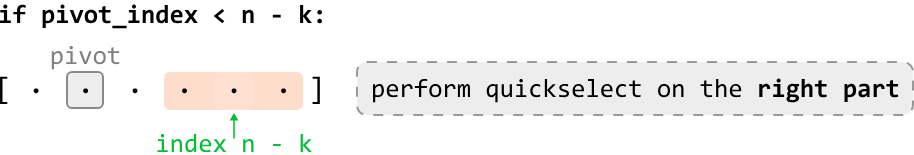

- If the pivot is positioned after index n - k, perform quickselect on the left part:

  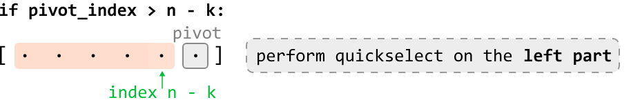

- If the pivot is positioned exactly at index n - k, the pivot itself is the (n - k)th smallest integer. So, we just return the pivot:

  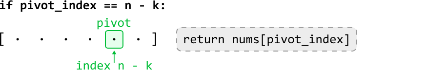

## Try it yourself

Write your solution to the problem before checking the reference implementation.

## Implementation - Quickselect

Note that the partition function in this implementation is identical to the partition function in Sort Array. Also, this implementation selects a random pivot, as per the optimization discussed in Sort Array.

### Python
```python
import random
from typing import List
    
def kth_largest_integer_quickselect(nums: List[int], k: int) -> int:
    return quickselect(nums, 0, len(nums) - 1, k)
    
def quickselect(nums: List[int], left: int, right: int, k: int) -> None:
    n = len(nums)
    if left >= right:
        return nums[left]
    random_index = random.randint(left, right)
    nums[random_index], nums[right] = nums[right], nums[random_index]
    pivot_index = partition(nums, left, right)
    # If the pivot comes before 'n - k', the ('n - k')th smallest integer is somewhere
    # to its right. Perform quickselect on the right part.
    if pivot_index < n - k:
        return quickselect(nums, pivot_index + 1, right, k)
    # If the pivot comes after 'n - k', the ('n - k')th smallest integer is somewhere
    # to its left. Perform quickselect on the left part.
    elif pivot_index > n - k:
        return quickselect(nums, left, pivot_index - 1, k)
    # If the pivot is at index 'n - k', it's the ('n - k')th smallest integer.
    else:
        return nums[pivot_index]
    
def partition(nums: List[int], left: int, right: int) -> int:
    pivot = nums[right]
    lo = left
    for i in range(left, right):
        if nums[i] < pivot:
            nums[lo], nums[i] = nums[i], nums[lo]
            lo += 1
    nums[lo], nums[right] = nums[right], nums[lo]
    return lo
```
### JavaScript
```javascript
/**
 * @param {number[]} nums - Array of integers
 * @param {number} k - The kth largest integer to find
 * @returns {number}
 */
export function kth_largest_integer(nums, k) {
  return quickselect(nums, 0, nums.length - 1, k)
}

function quickselect(nums, left, right, k) {
  const n = nums.length
  if (left >= right) {
    return nums[left]
  }
  const randomIndex = Math.floor(Math.random() * (right - left + 1)) + left
  ;[nums[randomIndex], nums[right]] = [nums[right], nums[randomIndex]]
  const pivotIndex = partition(nums, left, right)
  // If the pivot comes before 'n - k', the ('n - k')th smallest is to the right.
  if (pivotIndex < n - k) {
    return quickselect(nums, pivotIndex + 1, right, k)
  }
  // If the pivot comes after 'n - k', it's to the left.
  else if (pivotIndex > n - k) {
    return quickselect(nums, left, pivotIndex - 1, k)
  }
  // If the pivot is at 'n - k', it's the answer.
  else {
    return nums[pivotIndex]
  }
}

function partition(nums, left, right) {
  const pivot = nums[right]
  let lo = left
  for (let i = left; i < right; i++) {
    if (nums[i] < pivot) {
      ;[nums[i], nums[lo]] = [nums[lo], nums[i]]
      lo++
    }
  }
  ;[nums[lo], nums[right]] = [nums[right], nums[lo]]
  return lo
}
```
### Java
```java
import java.util.ArrayList;
import java.util.Random;

public class Main {
    public int kth_largest_integer_quickselect(ArrayList<Integer> nums, int k) {
        return quickselect(nums, 0, nums.size() - 1, k);
    }

    public int quickselect(ArrayList<Integer> nums, int left, int right, int k) {
        int n = nums.size();
        if (left >= right) {
            return nums.get(left);
        }
        Random rand = new Random();
        int randomIndex = rand.nextInt(right - left + 1) + left;
        int temp = nums.get(randomIndex);
        nums.set(randomIndex, nums.get(right));
        nums.set(right, temp);
        int pivotIndex = partition(nums, left, right);
        // If the pivot comes before 'n - k', the ('n - k')th smallest integer is somewhere
        // to its right. Perform quickselect on the right part.
        if (pivotIndex < n - k) {
            return quickselect(nums, pivotIndex + 1, right, k);
        }
        // If the pivot comes after 'n - k', the ('n - k')th smallest integer is somewhere
        // to its left. Perform quickselect on the left part.
        else if (pivotIndex > n - k) {
            return quickselect(nums, left, pivotIndex - 1, k);
        }
        // If the pivot is at index 'n - k', it's the ('n - k')th smallest integer.
        else {
            return nums.get(pivotIndex);
        }
    }

    public int partition(ArrayList<Integer> nums, int left, int right) {
        int pivot = nums.get(right);
        int lo = left;
        for (int i = left; i < right; i++) {
            if (nums.get(i) < pivot) {
                int temp = nums.get(lo);
                nums.set(lo, nums.get(i));
                nums.set(i, temp);
                lo++;
            }
        }
        int temp = nums.get(lo);
        nums.set(lo, nums.get(right));
        nums.set(right, temp);
        return lo;
    }
}
```
## Complexity Analysis

**Time complexity:** The time complexity of kth_largest_integer_quickselect can be analyzed in terms of the average and worst cases:

- **Average case:** $O(n)$. In the average case, quickselect partitions the array and reduces the problem size by approximately half each time by performing a recursive call on only one part of each partition. A linear partition is performed during each of these recursive calls. This results in a total time complexity of $O(n)+O(n/2)+O(n/4)+O(n/8)+\ldots$, which is a geometric series that sums to $O(n)$.

- **Worst case:** $O(n^2)$. The worst-case scenario occurs when the pivot selection consistently results in extremely unbalanced partitions. This can result in the problem size only being reduced by one element after each partition, leading to a total time complexity of $O(n)+O(n-1)+O(n-2)+\ldots$, which can be simplified to an $O(n^2)$ time complexity.

**Space complexity:** The space complexity can also be analyzed in terms of the average and worst cases:

- **Average Case:** $O(\log(n))$. In the average case, the depth of the recursive call stack is approximately $\log_2(n)$.

- **Worst Case:** $O(n)$. In the worst case, the depth of the recursive call stack can be as deep as $n$.


---


# Dutch National Flag

Given an array of 0s, 1s, and 2s representing red, white, and blue, respectively, sort the array in place so that it resembles the Dutch national flag, with all reds (0s) coming first, followed by whites (1s), and finally blues (2s).

## Example

```
Input: nums = [0, 1, 2, 0, 1, 2, 0]
Output: [0, 0, 0, 1, 1, 2, 2]
```

## Intuition

This problem is just asking us to sort three numbers in ascending order. A straightforward solution would be to use an in-built sorting function. However, this is an $O(n\log(n))$ approach, where $n$ denotes the length of the array. However, this isn't taking advantage of an important problem constraint: there are only three types of elements in the array.

To sort these numbers, we essentially want to position all 0s to the left, all 2s to the right, and any 1s in between. A key observation is that if we place the 0s and the 2s in their correct positions, the 1s will automatically be positioned correctly:

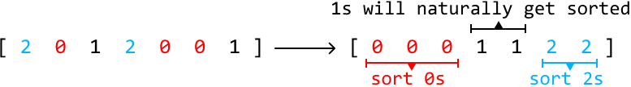

This allows us to focus on only positioning two numbers.

One strategy we could use is to iterate through the array and move any 0s we encounter to the left, and any 2s we encounter to the right.

We can set a left pointer to move any 0s we encounter to the left, and a right pointer to move any 2s to the right. To iterate through the array, we can use a separate pointer, i:

- When we encounter a 0 at index i, swap it with nums[left].

- When we encounter a 2 at index i, swap it with nums[right].

To understand how we should adjust these pointers after each swap, let's use the following example:

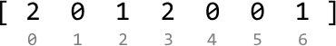

The first element is 2, so let's swap it with nums[right]. Then, let's move the right pointer inward so it points to where the next 2 should be placed:

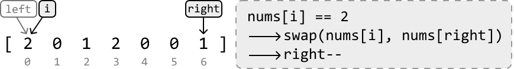

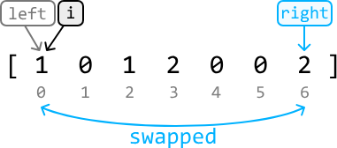

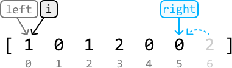

Notice that after this swap, there's now a new element at index i. So, we should not yet advance i, as we still need to decide whether this new element needs to be positioned elsewhere.

The pointer i is now pointing at a 1. We don't need to handle any 1s we encounter, so let's just advance the i pointer:


Now, pointer i is pointing at a 0, so let's swap it with nums[left]:


After this swap, there's a new element at index i. Since i is positioned after the left pointer, this element can only be a 1 for the following reasons:

- Before the swap, all 0s originally to the left of i would have already been positioned to the left of the left index.

- Before the swap, all 2s originally to the left of i would have already been positioned to the right of the right index.

Therefore, we can also advance the i pointer while advancing the left pointer.


We now know what to do whenever we encounter a 0, 1, or 2. We can continue applying this logic until the pointer i surpasses the right pointer, indicating all elements have been positioned correctly:


Note that we don't stop the process when i == right because the i pointer could still be pointing at a 0, which would need to be swapped.

### Why do we advance both i and left pointers when we encounter a 0?

A question we might have regarding the above process is why we advance the i pointer along with the left pointer when nums[i] == 0.

The reason becomes clear when we consider the following example:


Here, nums[i] == 0, so the first thing we do is swap nums[i] and nums[left], which doesn't change anything in this case since left and i point to the same element. Now, observe what happens if we only advance the left pointer:


As we can see, the left pointer will surpass the i pointer, which shouldn't happen since i needs to stay between left and right throughout the algorithm. To avoid this, we advance both the i and left pointers:


## Try it yourself

Write your solution to the problem before checking the reference implementation.

## Implementation

### Python
```python
from typing import List
    
def dutch_national_flag(nums: List[int]) -> None:
    i, left, right = 0, 0, len(nums) - 1
    while i <= right:
        # Swap 0s with the element at the left pointer.
        if nums[i] == 0:
            nums[i], nums[left] = nums[left], nums[i]
            left += 1
            i += 1
        # Swap 2s with the element at the right pointer.
        elif nums[i] == 2:
            nums[i], nums[right] = nums[right], nums[i]
            right -= 1
        else:
            i += 1
```
### JavaScript
```javascript
export function dutch_national_flag(nums) {
  let i = 0,
    left = 0,
    right = nums.length - 1
  while (i <= right) {
    if (nums[i] === 0) {
      // Swap 0s with the element at the left pointer.
      ;[nums[i], nums[left]] = [nums[left], nums[i]]
      left++
      i++
    } else if (nums[i] === 2) {
      // Swap 2s with the element at the right pointer.
      ;[nums[i], nums[right]] = [nums[right], nums[i]]
      right--
    } else {
      i++
    }
  }
}
```
### Java
```java
import java.util.ArrayList;

class UserCode {
    public static void dutchNationalFgilag(ArrayList<Integer> nums) {
        int i = 0;
        int left = 0;
        int right = nums.size() - 1;
        while (i <= right) {
            // Swap 0s with the element at the left pointer.
            if (nums.get(i) == 0) {
                int temp = nums.get(i);
                nums.set(i, nums.get(left));
                nums.set(left, temp);
                left++;
                i++;
            }
            // Swap 2s with the element at the right pointer.
            else if (nums.get(i) == 2) {
                int temp = nums.get(i);
                nums.set(i, nums.get(right));
                nums.set(right, temp);
                right--;
            } else {
                i++;
            }
        }
    }
}
```
## Complexity Analysis

**Time complexity:** The time complexity of dutch_national_flag is $O(n)$ because we iterate through each element of nums once.

**Space complexity:** The space complexity is $O(1)$.