# 18. Bit Manipulation

1. [Introduction to Bit Manipulation](#introduction-to-bit-manipulation)
2. [Hamming Weights of Integers](#hamming-weights-of-integers)
3. [Lonely Integer](#lonely-integer)
4. [Swap Odd and Even Bits](#swap-odd-and-even-bits)

---

# Introduction to Bit Manipulation

## Intuition

Bit manipulation is a technique used in programming to perform operations at the bit level, which can often lead to more efficient and faster algorithms.

## When is bit manipulation useful?

Bit manipulation allows us to work directly with the binary representation of numbers, making certain operations more efficient. Common tasks such as setting, clearing, toggling, and checking bits can be performed quickly using bitwise operators.

For example, one of the most common space optimization techniques involves using an unsigned 32-bit integer to represent a set of boolean values, where each bit in the integer corresponds to a different boolean value. This allows us to store and manipulate up to 32 states without using a boolean array or hash set.

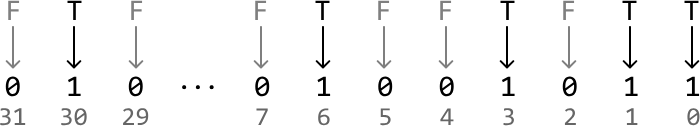

## Bitwise Operators

There are several fundamental bitwise operations, each serving a specific purpose. These are shown below, along with each operation's truth table:

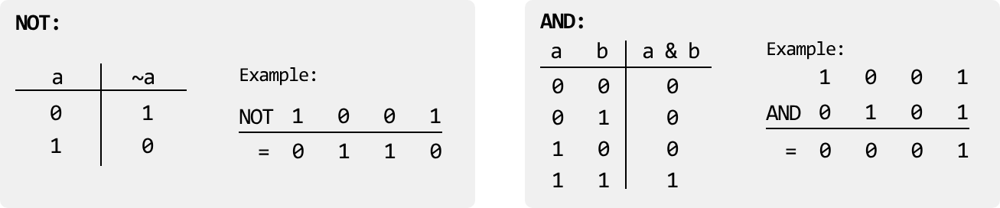

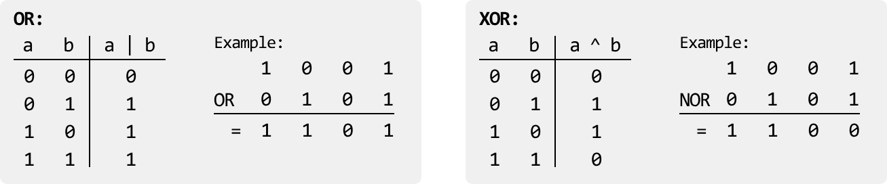

Some useful characteristics of the XOR operator are:

- `a ^ 0 = a`
- `a ^ a = 0`

In addition, it's also important to understand the fundamental shift operators:

**Left shift (`<< n`):** Shifts the bits of a number to the left by n positions, adding 0s on the right. This is equivalent to multiplying a number by 2^n.

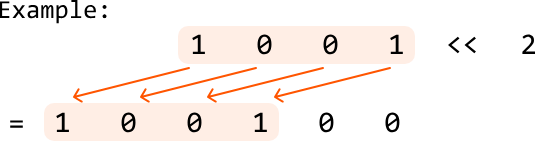

**Right shift (`>> n`):** Shifts the bits of a number to the right by n positions, discarding bits on the right. This is equivalent to dividing a number by 2^n (integer division).

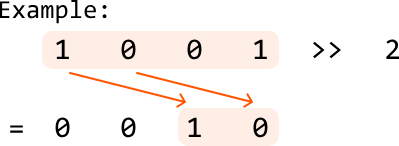

Using these operators, here are some useful bit manipulation techniques to be aware of:

- **Setting the ith bit of x to 1:** `x |= (1 << i)`
- **Clearing the ith bit of x:** `x &= ~(1 << i)`
- **Toggling the ith bit of x (from 0 to 1 or 1 to 0):** `x ^= (1 << i)`
- **Checking if the ith bit is set:** if `x & (1 << i) != 0`, the ith bit is set
- **Checking if a number x is even or odd:** if `x & 1 == 0`, x is even
- **Checking if a number is a power of 2:** if `x > 0` and `x & (x - 1) == 0`, x is a power of 2

## Real-world Example

**Data transmission in networks:** In many network protocols, bit manipulation is used to efficiently encode, compress, and transmit data for fast communication. For example, IP addresses and subnet masks use bitwise AND operations to determine whether two devices are on the same network. Similarly, in error detection and correction algorithms like checksums or parity bits, bit manipulation promotes data integrity during transmission by identifying and correcting errors in the binary data.

## Chapter Outline

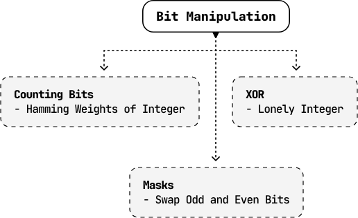

To best grasp the fundamentals of bit manipulation, this chapter explores a variety of problems that utilize a range of complex bit manipulation techniques, as well as how to identify the appropriate bitwise operator based on specific requirements.


---


# Hamming Weights of Integers

The Hamming weight of a number is the number of set bits (1-bits) in its binary representation. Given a positive integer n, return an array where the ith element is the Hamming weight of integer i for all integers from 0 to n.

**Example:**

Input: n = 7  
Output: [0, 1, 1, 2, 1, 2, 2, 3]  
Explanation:

| Number | Binary representation | Number of set bits |
|--------|----------------------|--------------------|
| 0      | 0                    | 0                  |
| 1      | 1                    | 1                  |
| 2      | 10                   | 1                  |
| 3      | 11                   | 2                  |
| 4      | 100                  | 1                  |
| 5      | 101                  | 2                  |
| 6      | 110                  | 2                  |
| 7      | 111                  | 3                  |

## Intuition - Count Bits For Each Number

The most straightforward strategy is to individually count the number of bits for each number from 0 to n.

Consider a number x = 25 and its binary representation:

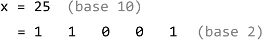

To count the number of set bits (1s) in a number, we can check each bit and increase a count whenever we find a set bit. Let's see how this works.

For starters, we can determine the least significant bit (LSB) of x by performing `x & 1`, which masks all bits of x except the LSB: if `x & 1 == 1`, the LSB is 1. Otherwise, it's 0. We can see this below for x = 25:

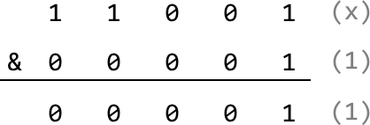

Now, how do we check the next bit? If we perform a bitwise right-shift operation on x, we shift all bits of x one position to the right. This effectively makes this next bit the new LSB:

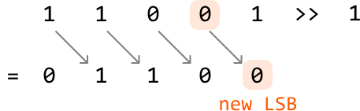

We now have a process we can repeat to count the number of set bits in a number:

1. If `x & 1 == 1`, increment our count. Otherwise, don't.
2. Right shift x.
3. Continue with the two steps above until x equals 0, indicating there are no more set bits to count. Doing this for every number from 0 to n provides the answer.

**Try it yourself**  
Write your solution to the problem before checking the reference implementation.

## Implementation - Count Bits For Each Number

### Python
```python
from typing import List
    
def hamming_weights_of_integers(n: int) -> List[int]:
    return [count_set_bits(x) for x in range(n + 1)]
    
def count_set_bits(x: int) -> int:
    count = 0
    # Count each set bit of 'x' until 'x' equals 0.
    while x > 0:
        # Increment the count if the LSB is 1.
        count += x & 1
        # Right shift 'x' to shift the next bit to the LSB position.
        x >>= 1
    return count
```
### JavaScript
```javascript
export function hamming_weights_of_integers(n) {
  const result = []
  for (let i = 0; i <= n; i++) {
    result.push(countSetBits(i))
  }
  return result
}

function countSetBits(x) {
  let count = 0
  // Count each set bit of 'x' until 'x' equals 0.
  while (x > 0) {
    count += x & 1
    // Right shift 'x' to shift the next bit to the LSB position.
    x >>= 1
  }
  return count
}
```
### Java
```java
import java.util.ArrayList;

public class Main {
    public ArrayList<Integer> hamming_weights_of_integers(int n) {
        ArrayList<Integer> result = new ArrayList<>();
        for (int x = 0; x <= n; x++) {
            result.add(count_set_bits(x));
        }
        return result;
    }

    public int count_set_bits(int x) {
        int count = 0;
        // Count each set bit of 'x' until 'x' equals 0.
        while (x > 0) {
            // Increment the count if the LSB is 1.
            count += x & 1;
            // Right shift 'x' to shift the next bit to the LSB position.
            x >>= 1;
        }
        return count;
    }
}
```
## Complexity Analysis

**Time complexity:** The time complexity of `hamming_weights_of_integers` is O(n log(n)) because for each integer x from 0 to n, counting the number of set bits takes logarithmic time, as there are approximately log₂(x) bits in that number. If we assume all integers have 32 bits, the time complexity simplifies to just O(n), since counting the set bits for a number will take at most 32 steps, which we do for n+1 numbers.

**Space complexity:** The space complexity is O(1) because no extra space is used except the space occupied by the output.

## Intuition - Dynamic Programming

In the previous approach, it's important to note that by the time we reach integer x, we have already computed the result for all integers from 0 to x - 1. If we find a way to leverage these previous results, we can improve the efficiency of constructing the output array.

It would be wise to find a way to take advantage of some optimal substructure by treating the results from integers 0 to x - 1 as potential subproblems of x. This is the beginning of a DP solution. Let `dp[x]` represent the number of set bits in integer x.

A predictable way to access a subproblem of `dp[x]` is to right-shift x by 1, effectively removing its LSB. This is the subproblem `dp[x >> 1]`, and the only difference between this and `dp[x]` is the LSB which was just removed.

As mentioned earlier, the LSB of x can be found using `x & 1`. Therefore:

If the LSB of x is 0, there is no difference in the number of bits between x and x >> 1:

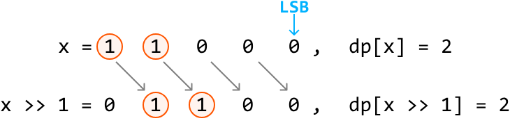

If the LSB of x is 1, the difference in the number of bits between x and x >> 1 is 1:

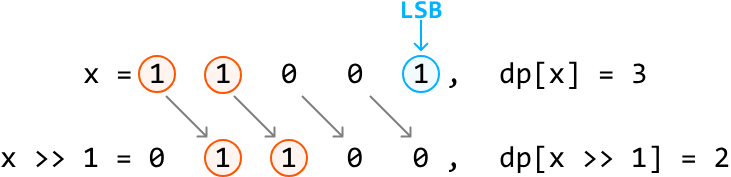

Therefore, we can obtain `dp[x]` by using the result of `dp[x >> 1]` and adding the LSB to it:

`dp[x] = dp[x >> 1] + (x & 1)`

Now, we just need to know what our base case is.

### Base case

The simplest version of this problem is when n is 0. In this case, there are no set bits, so the number of set bits is 0. We can apply this base case by setting `dp[0]` to 0.

After the base case is set, we populate the rest of the DP array by applying our formula from `dp[1]` to `dp[n]`. The answer to the problem is then just the values in the DP array, containing the number of set bits for each number from 0 to n.

**Try it yourself**  
Write your solution to the problem before checking the reference implementation.

## Implementation - Dynamic Programming

### Python
```python
from typing import List
    
def hamming_weights_of_integers_dp(n: int) -> List[int]:
    # Base case: the number of set bits in 0 is just 0. We set dp[0] to 0 by
    # initializing the entire DP array to 0.
    dp = [0] * (n + 1)
    for x in range(1, n + 1):
        # 'dp[x]' is obtained using the result of 'dp[x >> 1]', plus the LSB of 'x'.
        dp[x] = dp[x >> 1] + (x & 1)
    return dp
```
### JavaScript
```javascript
export function hamming_weights_of_integers_dp(n) {
  // Base case: the number of set bits in 0 is just 0. We set dp[0] to 0 by
  // initializing the entire DP array to 0.
  const dp = new Array(n + 1).fill(0)
  for (let x = 1; x <= n; x++) {
    // 'dp[x]' is obtained using the result of 'dp[x >> 1]', plus the LSB of 'x'.
    dp[x] = dp[x >> 1] + (x & 1)
  }
  return dp
}
```
### Java
```java
import java.util.ArrayList;

public class Main {
    public ArrayList<Integer> hamming_weights_of_integers(int n) {
        // Base case: the number of set bits in 0 is just 0. We set dp[0] to 0 by
        // initializing the entire DP array to 0.
        int[] dp = new int[n + 1];
        for (int x = 1; x <= n; x++) {
            // 'dp[x]' is obtained using the result of 'dp[x >> 1]', plus the LSB of 'x'.
            dp[x] = dp[x >> 1] + (x & 1);
        }
        ArrayList<Integer> result = new ArrayList<>();
        for (int count : dp) {
            result.add(count);
        }
        return result;
    }
}
```
## Complexity Analysis

**Time complexity:** The time complexity of `hamming_weights_of_integers_dp` is O(n) since we populate each element of the DP array once.

**Space complexity:** The space complexity is O(1) because no extra space is used, aside from the space taken up by the output, which is the DP array in this case.


---


# Lonely Integer

Given an integer array where each number occurs twice except for one of them, find the unique number.

**Example:**  
Input: nums = [1, 3, 3, 2, 1]  
Output: 2

**Constraints:**  
- nums contains at least one element.

## Intuition

### Hash map solution

A straightforward way to solve this problem is by using a hash map. The idea is to count the occurrences of each element in the array. We can do this by iterating through the array and increasing the frequency stored in the hash map of each element encountered in the array.

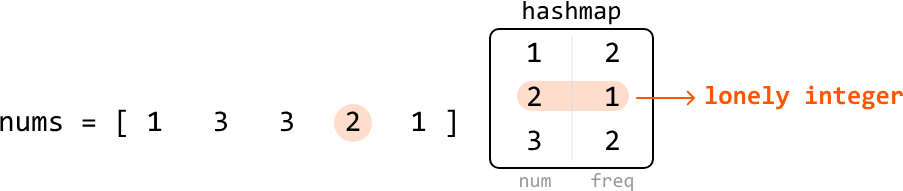

Once populated, we can iterate through the hash map to find the element with a frequency of 1, which is our lonely integer. This approach takes O(n) time, but comes at the cost of O(n) space, where n denotes the length of the input array. Let's see if there's a way to solve this without additional data structures like a hash map.

### Sorting solution

Another way to solve this problem is to sort the array first, then look for the lonely integer by iterating through the array, and comparing each element with its neighbors. The lonely integer will be the one that doesn't have a duplicate next to it.

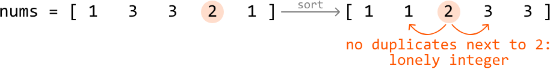

This method takes O(n log(n)) time due to sorting, but has the benefit of not requiring any additional data structures (aside from any used during sorting). Is there a way we can achieve a linear time complexity while also maintaining constant space?

### Bit manipulation

A way to avoid using additional space is with bit manipulation. The XOR operation in particular can be useful when handling duplicate integers. Recall the following two characteristics of the XOR operator:

- `a ^ a == 0`
- `a ^ 0 == a`

As we can see, when we XOR two identical numbers, the result is 0. As each number except the lonely integer appears twice in the array, if we XOR all the numbers together, all pairs of identical numbers will cancel out to 0. This isolates the lonely integer: once all duplicate elements cancel to 0, XORing 0 with the lonely integer gives us the lonely integer.

This works independently of where the numbers are located in the array, as XOR follows the commutative and associative properties:

- **Commutative property:** `a ^ b == b ^ a`
- **Associative property:** `(a ^ b) ^ c == a ^ (b ^ c)`

So, as long as two of the same numbers exist in the array, they will get canceled out when we XOR all the elements. An example of this is shown below:

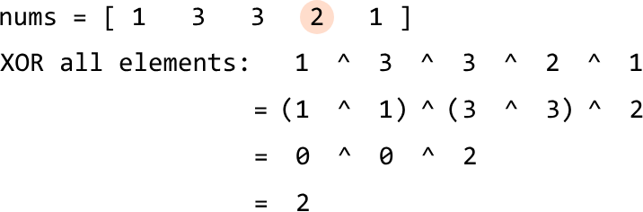

This allows us to identify the lonely integer in linear time without using extra space.

**Try it yourself**  
Write your solution to the problem before checking the reference implementation.

## Implementation

### Python
```python
from typing import List
    
def lonely_integer(nums: List[int]) -> int:
    res = 0
    # XOR each element of the array so that duplicate values will cancel each other
    # out (x ^ x == 0).
    for num in nums:
        res ^= num
    # 'res' will store the lonely integer because it would not have been canceled out
    # by any duplicate.
    return res
```
### JavaScript
```javascript
export function lonely_integer(nums) {
  let res = 0
  // XOR each element of the array so that duplicate values will cancel each other
  // out (x ^ x == 0).
  for (const num of nums) {
    res ^= num
  }
  return res
}
```
### Java
```java
import java.util.ArrayList;

public class Main {
    public Integer lonely_integer(ArrayList<Integer> nums) {
        int res = 0;
        // XOR each element of the array so that duplicate values will cancel each other
        // out (x ^ x == 0).
        for (int num : nums) {
            res ^= num;
        }
        // 'res' will store the lonely integer because it would not have been canceled out
        // by any duplicate.
        return res;
    }
}
```
## Complexity Analysis

**Time complexity:** The time complexity of `lonely_integer` is O(n) because we perform a constant-time XOR operation on each element in nums.

**Space complexity:** The space complexity is O(1).


---


# Swap Odd and Even Bits

Given an unsigned 32-bit integer n, return an integer where all of n's even bits are swapped with their adjacent odd bits.

**Example 1:**


Input: n = 41  
Output: 22

**Example 2:**


Input: n = 23  
Output: 43

## Intuition

Swapping even and odd bits means that each bit in an even position is swapped with the bit in the next odd position, and vice versa. Note that the positions start at position 0, which is the position of the least significant bit.

The key thing to notice is that, in order to perform the swap:

- All bits in the even positions need to be shifted one position to the left.
- All bits in the odd positions need to be shifted one position to the right.

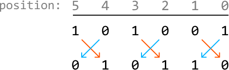

This suggests that if we had a way to extract all the even and odd-positioned bits separately, we could shift them accordingly and then merge them back together, so the odd-positioned bits are in the even positions, and vice versa.

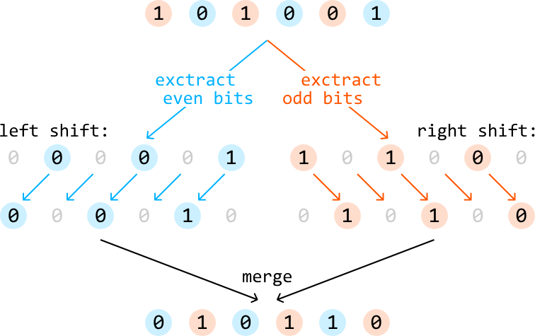

Let's start by figuring out how to obtain the even and odd bits of n.

### Obtaining all even bits

To obtain all even bits of n, we can use a mask which has all even bit positions set to 1:


Performing a bitwise-AND with this mask and n gives us an integer where all the bits at odd positions are set to 0, ensuring only the bits in even positions of n are preserved:

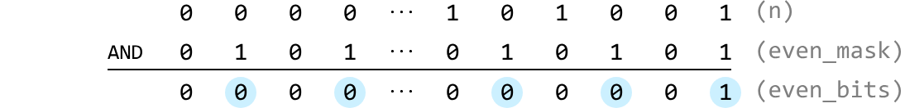

### Obtaining all odd bits

Similarly, to obtain all the odd bits of n, we can use a mask with all odd bit positions are set to 1:


Performing a bitwise-AND with this mask and n gives us an integer where all the bits at even positions are set to 0, ensuring only the bits at odd positions of n are preserved:

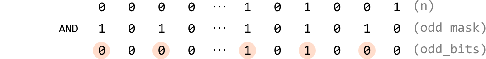

Now that we've extracted all the even bits and odd bits separately, let's use them to obtain the result, where the bits at odd and even positions are swapped.

### Shifting and merging the bits at odd and even positions

We can use the shift operator to shift the bits at even positions to the left once, and the bits at odd positions to the right once:

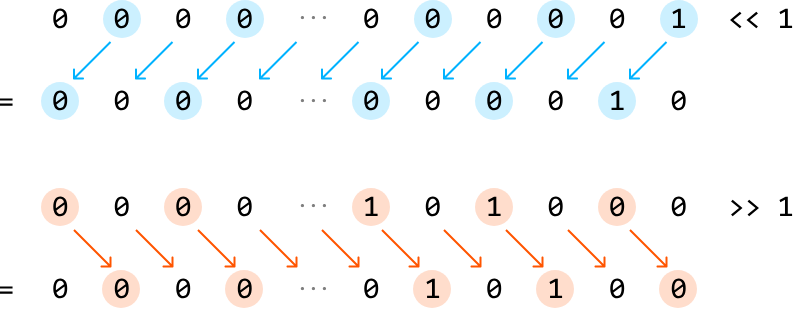

Then, to merge these together, we can use the bitwise-OR operator because it combines the two sets of bits into the final result.

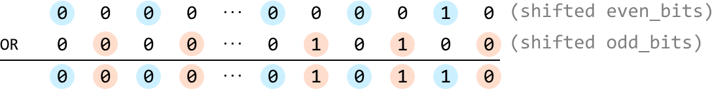

Now, the odd-positioned bits are in the even positions and vice versa.

**Try it yourself**  
Write your solution to the problem before checking the reference implementation.

## Implementation

### Python
```python
def swap_odd_and_even_bits(n: int) -> int:
    even_mask = 0x55555555   # 01010101010101010101010101010101
    odd_mask = 0xAAAAAAAA  # 10101010101010101010101010101010
    even_bits = n & even_mask
    odd_bits = n & odd_mask
    # Shift the even bits to the left, the odd bits to the right, and merge these
    # shifted values together.
    return (even_bits << 1) | (odd_bits >> 1)
```
### JavaScript
```javascript
export function swap_odd_and_even_bits(n) {
  const evenMask = 0x55555555 // 01010101010101010101010101010101
  const oddMask = 0xaaaaaaaa // 10101010101010101010101010101010
  const evenBits = n & evenMask
  const oddBits = n & oddMask
  // Shift the even bits to the left, the odd bits to the right, and merge these
  // shifted values together.
  return (evenBits << 1) | (oddBits >>> 1)
}
```
### Java
```java
public class Main {
    public Integer swap_odd_and_even_bits(int n) {
        int evenMask = 0x55555555;  // 01010101010101010101010101010101
        int oddMask = 0xAAAAAAAA;   // 10101010101010101010101010101010
        int evenBits = n & evenMask;
        int oddBits = n & oddMask;
        // Shift the even bits to the left, the odd bits to the right, and merge these
        // shifted values together.
        return (evenBits << 1) | (oddBits >>> 1);
    }
}
```
## Complexity Analysis

**Time complexity:** The time complexity of `swap_odd_and_even_bits` is O(1).

**Space complexity:** The space complexity is O(1).