# 19. Math and Geometry

1. [Introduction to Math and Geometry](#introduction-to-math-and-geometry)
2. [Spiral Traversal](#spiral-traversal)
3. [Reverse 32-Bit Integer](#reverse-32-bit-integer)
4. [Maximum Collinear Points](#maximum-collinear-points)
5. [The Josephus Problem](#the-josephus-problem)
6. [Triangle Numbers](#triangle-numbers)

---

# Introduction to Math and Geometry

## Intuition

This chapter tackles several problems relating to important math and geometry concepts in programming, which regularly appear in technical interviews.
We explore subjects such as:

* Greatest common divisor (GCD).
* Modular arithmetic.
* Handling floating-point precision.
* Handling integer overflow and underflow.
* Recognizing patterns.

## Real-world Example

**Computer graphics:** In 3D rendering, geometry is used to represent objects as shapes like polygons, and mathematical transformations such as rotation, scaling, and translation, are applied to these objects to animate them, or change their perspective. Algorithms that use trigonometry, vector math, and matrix operations, are critical for determining how objects move, interact with light, or cast shadows in virtual environments.

## Chapter Outline


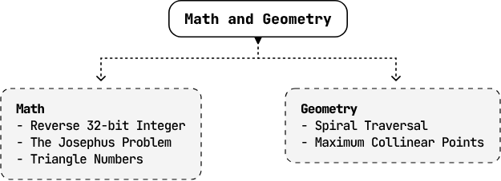


---


# Spiral Traversal

Return the elements of a matrix in clockwise spiral order.

**Example:**

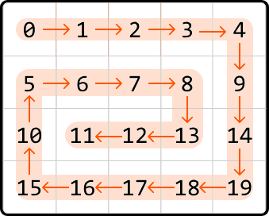

Output: [0, 1, 2, 3, 4, 9, 14, 19, 18, 17, 16, 15, 10, 5, 6, 7, 8, 13, 12, 11]

## Intuition

To create the expected output for this problem, let's try simulating exactly what the problem describes and traverse the matrix in spiral order, adding each value to the output as we go. How can we do this?

Spiral traversal involves moving through the matrix in one direction until we can't go any further, then changing direction and continuing. Specifically, the sequence of directions is right, down, left, and up, repeated until all elements are traversed. To achieve this, we need to determine the exact conditions for switching directions.

Initially, our approach may seem simple: we start by moving right until reaching the right-most column of the matrix, at which point we switch directions. We can move and switch directions like this three times without running into any problems:

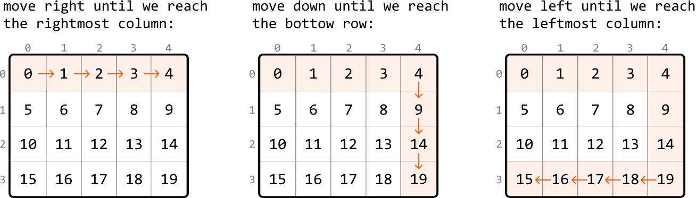

However, as shown below, if we move upward until we hit the top row of the matrix, we'll return to where we started, adding a value from a previously visited cell to the output:

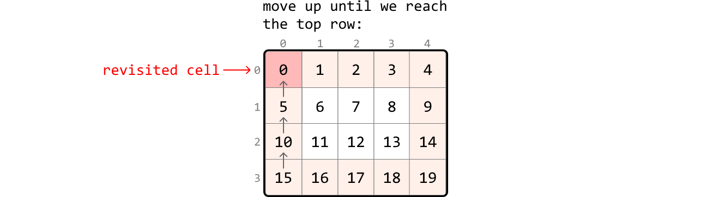

A potential solution to this is to keep track of all cells visited by using a hash set. This allows us to stop moving in a direction when we encounter a visited cell. While this approach is effective, it requires O(m⋅n) space, where m and n are the dimensions of the matrix. This is because we need to store every cell of the matrix in the hash set. Is there a way to avoid revisiting cells without using an additional data structure?

Notice in the above diagrams that when we move in a certain direction, we continue until we reach one of the boundary rows or columns (i.e., the top or bottom row, or the leftmost or rightmost column).

What if we adjust these boundaries as we traverse the matrix, to avoid revisiting previous cells?

### Adjusting boundaries

Let's initialize the four boundaries (top, bottom, left, right) with their initial positions:

```
top = 0
bottom = m - 1
left = 0
right = n - 1
```

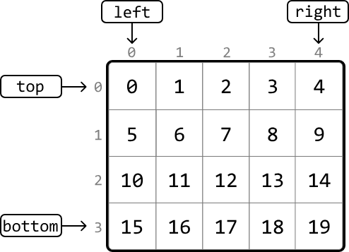

We begin traversal by moving right through the first row from the left boundary to the right. Since we've just visited all cells in the first row, we need to prevent future access to this row. This can be done by moving the top boundary down by 1 (top += 1), ensuring the top row can't be accessed:

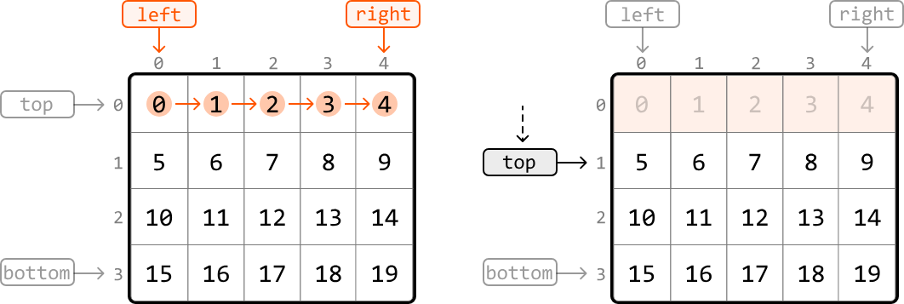

Next, we move down from the top boundary to the bottom boundary. To ensure this column is not revisited, update the right boundary (right -= 1):

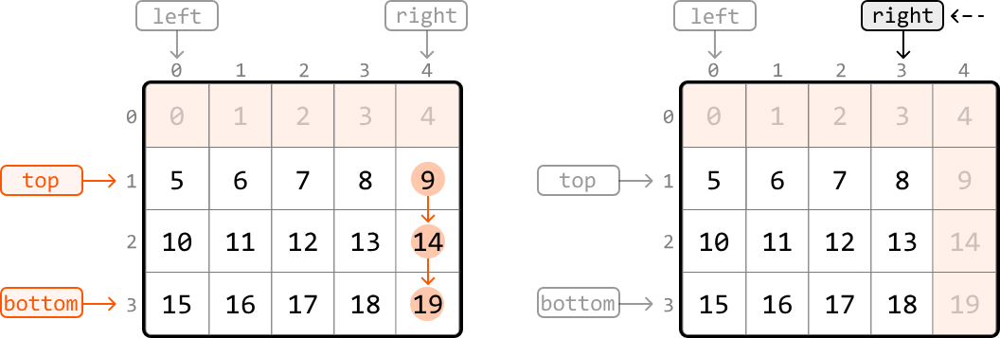

Next, we move left from the right boundary to the left. To ensure this row doesn't get revisited, update the bottom boundary (bottom -= 1):

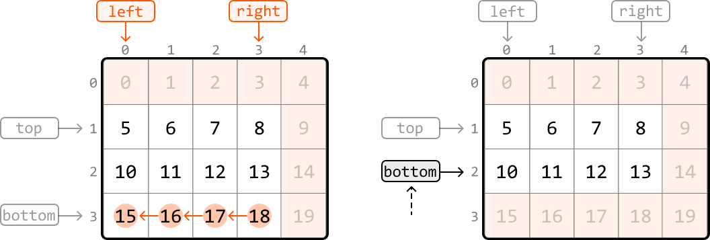

Next, we move up from the bottom boundary to the top boundary. To ensure this column isn't revisited, update the left boundary (left += 1):

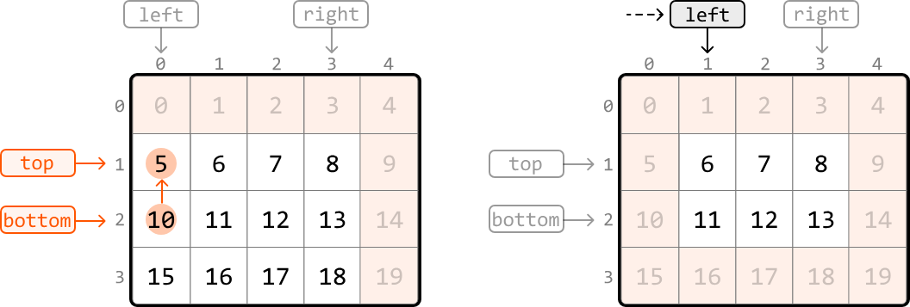

We've just discussed how to traverse in each of the four directions and update the corresponding boundaries. These traversals are repeated until either the top boundary surpasses the bottom boundary, or the left boundary surpasses the right boundary. Either of these indicate there are no more cells left to traverse.

In summary, we traverse the matrix in spiral order by repeating the following sequences of traversals:

1. Move from left to right along the top boundary, then update the top boundary (top += 1)

2. Move from top to bottom along the right boundary, then update the right boundary (right -= 1)

3. Move from right to left along the bottom boundary, then update the bottom boundary (bottom -= 1)

4. Move from bottom to top along the left boundary, then update the left boundary (left += 1)

This continues while top ≤ bottom and left ≤ right.

A crucial thing to keep in mind is that after updating the top boundary, the top boundary might pass the bottom boundary (top > bottom). So, we need to check that top ≤ bottom before traversing the bottom boundary. Similarly, we need to check that left ≤ right before traversing the left boundary to ensure the boundaries haven't crossed.

As we move through the matrix, we add each value we encounter to the output array. This way, the matrix values are recorded in a spiral order.

**Try it yourself**  
Write your solution to the problem before checking the reference implementation.

## Implementation

### Python
```python
from typing import List
    
def spiral_matrix(matrix: List[List[int]]) -> List[int]:
    if not matrix:
        return []
    result = []
    # Initialize the matrix boundaries.
    top, bottom = 0, len(matrix) - 1
    left, right = 0, len(matrix[0]) - 1
    # Traverse the matrix in spiral order.
    while top <= bottom and left <= right:
        # Move from left to right along the top boundary.
        for i in range(left, right + 1):
            result.append(matrix[top][i])
        top += 1
        # Move from top to bottom along the right boundary.
        for i in range(top, bottom + 1):
            result.append(matrix[i][right])
        right -= 1
        # Check that the bottom boundary hasn't passed the top boundary before
        # moving from right to left along the bottom boundary.
        if top <= bottom:
            for i in range(right, left - 1, -1):
                result.append(matrix[bottom][i])
            bottom -= 1
        # Check that the left boundary hasn't passed the right boundary before
        # moving from bottom to top along the left boundary.
        if left <= right:
            for i in range(bottom, top - 1, -1):
                result.append(matrix[i][left])
            left += 1
    return result
```
### JavaScript
```javascript
export function spiral_matrix(matrix) {
  if (!matrix || matrix.length === 0) return []
  const result = []
  let top = 0
  let bottom = matrix.length - 1
  let left = 0
  let right = matrix[0].length - 1
  while (top <= bottom && left <= right) {
    // Move from left to right along the top boundary.
    for (let i = left; i <= right; i++) {
      result.push(matrix[top][i])
    }
    top++
    // Move from top to bottom along the right boundary.
    for (let i = top; i <= bottom; i++) {
      result.push(matrix[i][right])
    }
    right--
    // Check that the bottom boundary hasn't passed the top boundary before
    // moving from right to left along the bottom boundary.
    if (top <= bottom) {
      for (let i = right; i >= left; i--) {
        result.push(matrix[bottom][i])
      }
      bottom--
    }
    // Check that the left boundary hasn't passed the right boundary before
    // moving from bottom to top along the left boundary.
    if (left <= right) {
      for (let i = bottom; i >= top; i--) {
        result.push(matrix[i][left])
      }
      left++
    }
  }

  return result
}
```
### Java
```java
import java.util.ArrayList;

public class Main {
    public static ArrayList<Integer> spiral_matrix(ArrayList<ArrayList<Integer>> matrix) {
        if (matrix == null || matrix.isEmpty()) {
            return new ArrayList<>();
        }
        ArrayList<Integer> result = new ArrayList<>();
        // Initialize the matrix boundaries.
        int top = 0;
        int bottom = matrix.size() - 1;
        int left = 0;
        int right = matrix.get(0).size() - 1;
        // Traverse the matrix in spiral order.
        while (top <= bottom && left <= right) {
            // Move from left to right along the top boundary.
            for (int i = left; i <= right; i++) {
                result.add(matrix.get(top).get(i));
            }
            top++;
            // Move from top to bottom along the right boundary.
            for (int i = top; i <= bottom; i++) {
                result.add(matrix.get(i).get(right));
            }
            right--;
            // Check that the bottom boundary hasn't passed the top boundary before
            // moving from right to left along the bottom boundary.
            if (top <= bottom) {
                for (int i = right; i >= left; i--) {
                    result.add(matrix.get(bottom).get(i));
                }
                bottom--;
            }
            // Check that the left boundary hasn't passed the right boundary before
            // moving from bottom to top along the left boundary.
            if (left <= right) {
                for (int i = bottom; i >= top; i--) {
                    result.add(matrix.get(i).get(left));
                }
                left++;
            }
        }
        return result;
    }
}
```
## Complexity Analysis

**Time complexity:** The time complexity of `spiral_matrix` is O(m⋅n) because we traverse each cell of the matrix once.

**Space complexity:** The space complexity is O(1). The res array is not included in the space complexity.


---


# Reverse 32-Bit Integer

Reverse the digits of a signed 32-bit integer. If the reversed integer overflows (i.e., is outside the range [−2³¹, 2³¹−1]), return 0. Assume the environment only allows you to store integers within the signed 32-bit integer range.

**Example 1:**  
Input: n = 420  
Output: 24

**Example 2:**  
Input: n = -15  
Output: -51

## Intuition

The primary challenge with this problem is in handling its edge cases. Before tackling these edge cases, let's first try handling the more basic cases and later see how we would need to modify our strategy.

### Reversing positive numbers

Consider n = 123. Let's try building the reversed integer one digit at a time. The first thing to figure out is how to iterate through the digits of n to build our reversed number (initially set to 0):

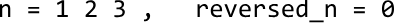

One way to do this is by starting at the last digit of n and appending each digit to reversed_n:

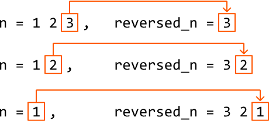

Let's explore how we can do this. To extract the last digit, we can use the modulus operator: `n % 10`. This operation effectively finds what the remainder of n would be if divided by 10:

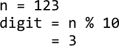

After extracting the last digit, we can remove it by dividing n by 10, which shifts the second-to-last digit to the last position, preparing it for the next iteration:

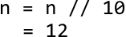

Once that's done, let's add the last digit extracted to our reversed number:

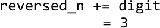

Below, we see the current states of n and reversed_n:

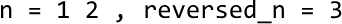

To process the next digit, let's extract it from n using the modulus operation, then remove it by dividing n by 10:

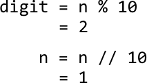

To append this digit to reversed_n, we can multiply reversed_n by 10 to shift its digits to the left, making space for the new digit. Then, we just add the new digit as before:

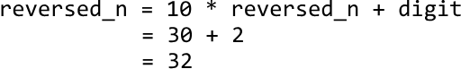

We can repeat the above process until all digits of n are appended to reversed_n (i.e., until n equals 0). Here's a breakdown of this process:

1. Extract the last digit: `digit = n % 10`.
2. Remove the last digit: `n = n // 10`.
3. Append the digit: `reversed_n = reversed_n * 10 + digit`.

### Reversing negative numbers

Before considering a separate strategy to handle negative numbers, let's first check if the set of steps above also work for negative numbers. Applying these steps to n = -15 gives:

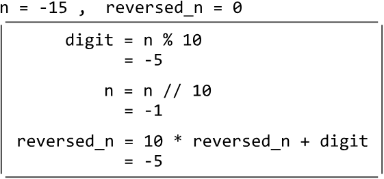

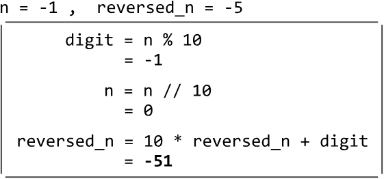

As we can see, it works for negative numbers. Now, let's tackle situations in which reversing a number could result in integer overflow or underflow.

### Detecting integer overflow

If the reverse of a positive number is larger than 2³¹−1, it will overflow, and we should return 0. Let's call this maximum value INT_MAX.

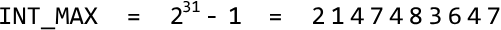

Initially, it might seem sufficient to reverse the number completely, check if it exceeds 2³¹−1, and return 0 if it does. However, in an environment where integers larger than 2³¹−1 cannot be stored, attempting to reverse such an integer would cause an overflow:

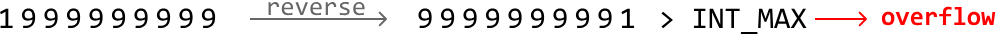

So, let's think of another way to detect overflow.

We're constructing the number reversed_n one digit at a time, which means we need to ensure not to cause the number to overflow with each new digit we add. Let's think about when adding a new digit might cause reversed_n to become too large. Here's how we can analyze this:

If reversed_n is equal to 214748364 (i.e., `INT_MAX // 10`), then the final digit we can add to it must be less than or equal to 7 to avoid an overflow (since 214748364**7** == INT_MAX):

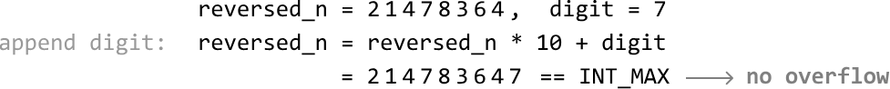

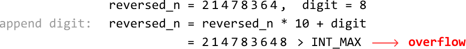

Now, keep in mind that when `reversed_n == INT_MAX // 10`, only one more digit can be added to it. The key observation here is that this digit can only ever be 1 because a larger final digit would be impossible, as shown below:

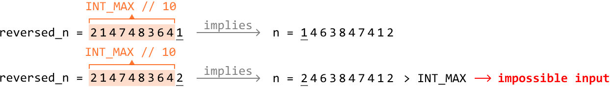

This means that when `reversed_n == INT_MAX // 10`, the last digit added to it won't cause an overflow, meaning we don't need to check the last digit in this case.

If reversed_n is already larger than `INT_MAX // 10`, adding any digit will cause it to overflow. We can handle this case with the following condition:

`if reversed_n > INT_MAX // 10: return 0`

### Detecting integer underflow

We can apply similar logic to the above for handling integer underflow. Here, we just need to check that reversed_n never falls below `INT_MIN // 10`:

`if reversed_n < INT_MIN // 10: return 0`

**Try it yourself**  
Write your solution to the problem before checking the reference implementation.

## Implementation

In Python, using the modulus operator (%) with a negative number gives a positive result. To avoid this, we can instead use `math.fmod` and cast its result to an integer to attain a negative modulus value.

For division, Python's `//` operator performs floor division, which can result in an undesired value when dealing with negative numbers (e.g., `-15 // 10` results in `-2`, instead of the desired `-1`). To achieve the desired behavior, use `/` for division and cast its result to an integer.

Python

```python
import math
    
def reverse_32_bit_integer(n: int) -> int:
    INT_MAX = 2**31 - 1
    INT_MIN = -2**31
    reversed_n = 0
    # Keep looping until we've added all digits of 'n' to 'reversed_n' in reverse
    # order.
    while n != 0:
        # digit = n % 10
        digit = int(math.fmod(n, 10))
        # n = n // 10
        n = int(n / 10)
        # Check for integer overflow or underflow.
        if reversed_n > int(INT_MAX / 10) or reversed_n < int(INT_MIN / 10):
            return 0
        # Add the current digit to 'reversed_n'.
        reversed_n = reversed_n * 10 + digit
    return reversed_n
```
### JavaScript
```javascript
export function reverse_32_bit_integer(n) {
  const INT_MAX = Math.pow(2, 31) - 1
  const INT_MIN = -Math.pow(2, 31)
  let reversed = 0
  // Keep looping until we've added all digits of 'n' to 'reversed_n' in reverse
  // order.
  while (n !== 0) {
    let digit = n % 10
    n = (n / 10) | 0 // Truncate towards zero
    // Check for integer overflow or underflow.
    if (
      reversed > Math.trunc(INT_MAX / 10) ||
      reversed < Math.trunc(INT_MIN / 10)
    ) {
      return 0
    }
    // Add the current digit to 'reversed_n'.
    reversed = reversed * 10 + digit
  }
  return reversed
}
```
### Java
```java
class Main {
    public Integer reverse_32_bit_integer(int n) {
        int INT_MAX = Integer.MAX_VALUE;
        int INT_MIN = Integer.MIN_VALUE;
        int reversedN = 0;
        // Keep looping until we've added all digits of 'n' to 'reversed_n' in reverse
        // order.
        while (n != 0) {
            // digit = n % 10
            int digit = n % 10;
            // n = n // 10
            n = n / 10;
            // Check for integer overflow or underflow.
            if (reversedN > INT_MAX / 10 || reversedN < INT_MIN / 10) {
                return 0;
            }
            // Add the current digit to 'reversed_n'.
            reversedN = reversedN * 10 + digit;
        }
        return reversedN;
    }
}
```
## Complexity Analysis

**Time complexity:** The time complexity of `reverse_32_bit_integer` is O(log(n)) because we loop through each digit of n, of which there are roughly log(n) digits. As this environment only supports 32-bit integers, the time complexity can also be considered O(1).

**Space complexity:** The space complexity is O(1).


---


# Maximum Collinear Points

Given a set of points in a two-dimensional plane, determine the maximum number of points that lie along the same straight line.

**Example:**

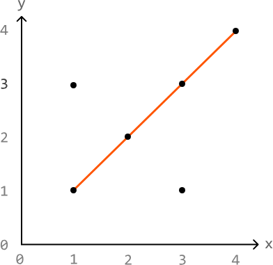

Input: points = [[1, 1], [1, 3], [2, 2], [3, 1], [3, 3], [4, 4]]  
Output: 4

**Constraints:**  
- The input won't contain duplicate points.

## Intuition

Two or more points are collinear if they lie on the same straight line. In other words, the slope between any pair of points among them will be equal:

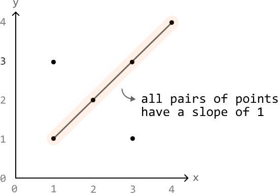

Let's remind ourselves how the slope of a line is calculated given two points (xₐ, yₐ) and (x_b, y_b):

`slope = rise/run = (y_b − yₐ) / (x_b − xₐ)`

Using this formula, we can calculate the slope between all pairs of points from the input, and determine the largest number of pairs that share the same slope. However, this approach is flawed because two pairs of points with the same slope value may not be collinear:

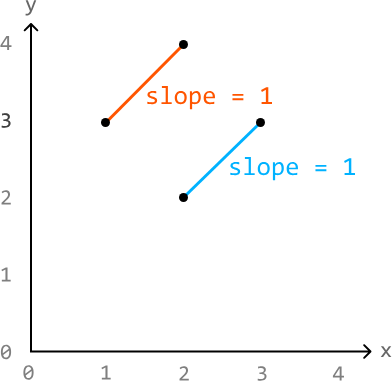

Let's think of a different way to find the answer. What if we try to find the maximum number of points collinear with a specific point? Let's call this point a focal point.

We can calculate the slope between the focal point and every other point in the input, using a hash map to count how many points correspond with each slope value. Note that the frequencies of points stored in the hash map do not include the focal point.

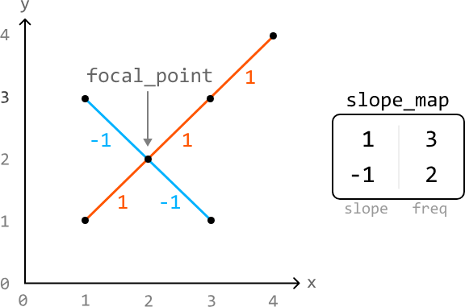

This allows us to find the maximum number of points collinear with this focal point:

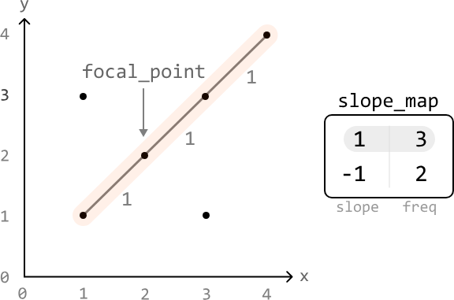

Here, the slope with the highest frequency is 3, which means the number of points on the line defined by that slope is 3 + 1 = 4, where +1 is used to account for the focal point itself.

By repeating the process for every point, we can determine the maximum number of points that are collinear with each focal point. Our final answer is equal to the largest of these maximums.

### Edge case: two points on the same x-axis

When two collinear points share the same x-axis, the denominator of the slope equation will equal 0 (i.e., run = x_b − xₐ = 0). This is problematic because dividing by 0 is undefined:

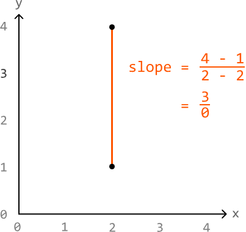

To handle this issue, we can check if our run value is equal to 0. If so, we can just use infinity (`float('inf')`) to represent the value of this slope.

### Avoiding precision issues

A crucial thing to be mindful of is the precision of slopes when storing them as floats or doubles. Consider the following slopes:

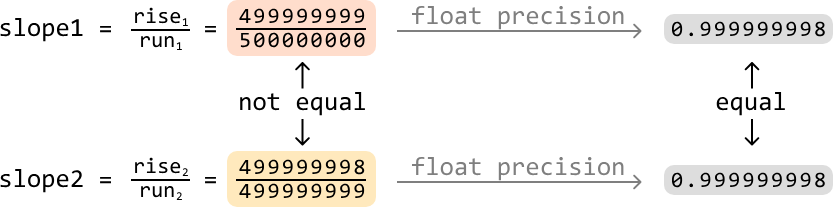

As we can see, despite the fractions themselves representing different slopes, presenting them as a float or double doesn't provide enough decimal-point precision to distinguish between them accurately. This can result in incorrectly identifying distinct slopes as the same.

To avoid this, we can represent a slope as a pair of integers, stored as a tuple: `(rise, run)`. For example, the slope with a rise of 1 and a run of 2 can be represented as `(1, 2)` instead of `1 / 2 = 0.5`.

### Ensuring consistent representation of slopes

There's just one more challenge to address: ensuring the representation of a slope is consistent for all equivalent slope fractions:

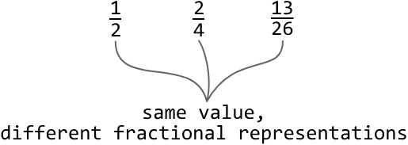

If we reduce fractions to their simplest forms, we can consistently represent equal fractions that have different initial representations.

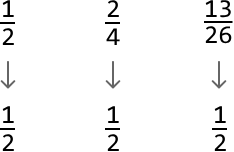

But how can we do this? We can reduce fractions by dividing both the rise and run by their greatest common divisor (GCD).

### Greatest common divisor

The GCD of two numbers is the largest number that divides both of them exactly. By dividing the rise and run by their GCD, we reduce the slope to its simplest form:

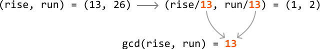

This ensures all equal fractions are represented in the same way.

**Try it yourself**  
Write your solution to the problem before checking the reference implementation.

## Implementation

### Python
```python
from typing import List, Tuple
from collections import defaultdict
    
def maximum_collinear_points(points: List[List[int]]) -> int:
    res = 0
    # Treat each point as a focal point, and determine the maximum number of points
    # that are collinear with each focal point. The largest of these maximums is the
    # answer.
    for i in range(len(points)):
        res = max(res, max_points_from_focal_point(i, points))
    return res
    
def max_points_from_focal_point(focal_point_index: int, points: List[List[int]]) -> int:
    slopes_map = defaultdict(int)
    max_points = 0
    # For the current focal point, calculate the slope between it and every other
    # point. This allows us to group points that share the same slope.
    for j in range(len(points)):
        if j != focal_point_index:
            curr_slope = get_slope(points[focal_point_index], points[j])
            slopes_map[curr_slope] += 1
            # Update the maximum count of collinear points for the current focal
            # point.
            max_points = max(max_points, slopes_map[curr_slope])
    # Add 1 to the maximum count to include the focal point itself.
    return max_points + 1
    
def get_slope(p1: List[int], p2: List[int]) -> Tuple[int, int]:
    rise = p2[1] - p1[1]
    run = p2[0] - p1[0]
    # Handle vertical lines separately to avoid dividing by 0.
    if run == 0:
        return (1, 0)
    # Simplify the slope to its reduced form.
    gcd_val = gcd(rise, run)
    return (rise // gcd_val, run // gcd_val)
```
### JavaScript
```javascript
export function maximum_collinear_points(points) {
  let res = 0
  // Treat each point as a focal point, and determine the maximum number of points
  // that are collinear with each focal point. The largest of these maximums is the
  // answer.
  for (let i = 0; i < points.length; i++) {
    res = Math.max(res, maxPointsFromFocalPoint(i, points))
  }
  return res
}

function maxPointsFromFocalPoint(focalIndex, points) {
  const slopesMap = new Map()
  let maxPoints = 0
  // For the current focal point, calculate the slope between it and every other
  // point. This allows us to group points that share the same slope.
  for (let j = 0; j < points.length; j++) {
    if (j !== focalIndex) {
      const currSlope = getSlope(points[focalIndex], points[j])
      slopesMap.set(currSlope, (slopesMap.get(currSlope) || 0) + 1)
      // Update the maximum count of collinear points for the current focal
      // point.
      maxPoints = Math.max(maxPoints, slopesMap.get(currSlope))
    }
  }
  // Add 1 to the maximum count to include the focal point itself.
  return maxPoints + 1
}

function getSlope(p1, p2) {
  const rise = p2[1] - p1[1]
  const run = p2[0] - p1[0]
  // Handle vertical lines separately to avoid dividing by 0.
  if (run === 0) {
    return '1/0'
  }
  // Simplify the slope to its reduced form.
  const gcdVal = gcd(rise, run)
  return `${rise / gcdVal}/${run / gcdVal}`
}

function gcd(a, b) {
  // The Euclidean algorithm.
  while (b !== 0) {
    ;[a, b] = [b, a % b]
  }
  return a
}
```
### Java
```java
import java.util.ArrayList;
import java.util.HashMap;
import java.util.Map;

public class Main {
    public int maximum_collinear_points(ArrayList<ArrayList<Integer>> points) {
        int res = 0;
        // Treat each point as a focal point, and determine the maximum number of points
        // that are collinear with each focal point. The largest of these maximums is the
        // answer.
        for (int i = 0; i < points.size(); i++) {
            res = Math.max(res, max_points_from_focal_point(i, points));
        }
        return res;
    }

    public int max_points_from_focal_point(int focalPointIndex, ArrayList<ArrayList<Integer>> points) {
        Map<String, Integer> slopesMap = new HashMap<>();
        int maxPoints = 0;
        // For the current focal point, calculate the slope between it and every other
        // point. This allows us to group points that share the same slope.
        for (int j = 0; j < points.size(); j++) {
            if (j != focalPointIndex) {
                String currSlope = get_slope(points.get(focalPointIndex), points.get(j));
                slopesMap.put(currSlope, slopesMap.getOrDefault(currSlope, 0) + 1);
                // Update the maximum count of collinear points for the current focal
                // point.
                maxPoints = Math.max(maxPoints, slopesMap.get(currSlope));
            }
        }
        // Add 1 to the maximum count to include the focal point itself.
        return maxPoints + 1;
    }

    public String get_slope(ArrayList<Integer> p1, ArrayList<Integer> p2) {
        int rise = p2.get(1) - p1.get(1);
        int run = p2.get(0) - p1.get(0);
        // Handle vertical lines separately to avoid dividing by 0.
        if (run == 0) {
            return "1/0";
        }
        // Simplify the slope to its reduced form.
        int gcdVal = gcd(rise, run);
        return (rise / gcdVal) + "/" + (run / gcdVal);
    }

    public int gcd(int a, int b) {
        if (b == 0) {
            return Math.abs(a);
        }
        return gcd(b, a % b);
    }
}
```
While some programming languages, Python included, have their own internal implementation of the GCD function, its implementation is provided below for your information. This implementation is commonly known as the Euclidean algorithm:

### Python
```python
# The Euclidean algorithm.
def gcd(a, b):
    while b != 0:
        a, b = b, a % b
    return a
```
### JavaScript
```javascript
export function gcd(a, b) {
  while (b !== 0) {
    ;[a, b] = [b, a % b]
  }
  return a
}
```
### Java
```java
public int gcd(int a, int b) {
    if (b == 0) {
        return Math.abs(a);
    }
    return gcd(b, a % b);
}
```
## Complexity Analysis

**Time complexity:** The time complexity of `maximum_collinear_points` is O(n² log(m)), where n denotes the number of points, and m denotes the largest value among the coordinates. Here's why:

- The time complexity of the `gcd(rise, run)` function is O(log(min(rise, run))), which is approximately equal to O(log(m)) in the worst case.

- The helper function `max_points_from_focal_point`, calls the `gcd` function a total of n-1 times: one for each point excluding the focal point, giving a time complexity of O(n log(m)).

- The `max_points_from_focal_point` function is called a total of n times, resulting in an overall time complexity of O(n² log(m)).

**Space complexity:** The space complexity is O(n) due to the hash map, which in the worst case, stores n−1 key-value pairs: one for each point excluding the focal point.


---


# The Josephus Problem

There are n people standing in a circle, numbered from 0 to n - 1. Starting from person 0, count k people clockwise and remove the kth person. After the removal, begin counting again from the next person still in the circle. Repeat this process until only one person remains, and return that person's position.

**Example:**

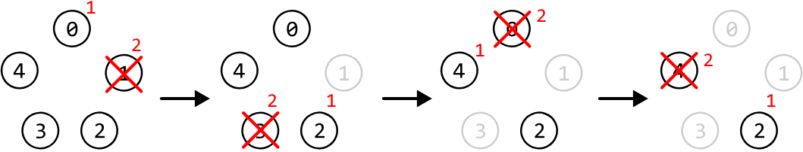

Input: n = 5, k = 2  
Output: 2

**Constraints:**
- There will be at least one person in the circle
- k will at least be equal to 1.

## Intuition

The naive approach to solving this problem is to simulate the removal of people step by step. We can create a circular linked list with n nodes. Starting from node 0, we iterate through the linked list, removing every kth person. The last node remaining after all removals will represent the last remaining person.

This approach takes O(n⋅k) time because, to remove a node, we must iterate through k nodes in the linked list. Therefore, for each of the n nodes, we perform k iterations. Let's see if we can find a faster solution.

Consider an example where n = 12 and k = 4. For the first removal, we start counting k nodes from node 0 and remove the person we end up on after counting.

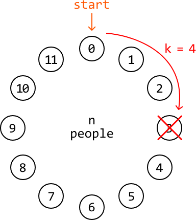

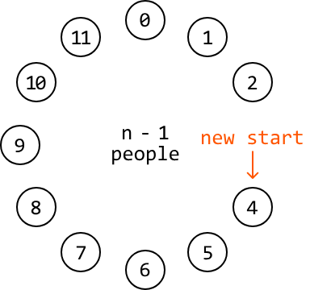

As we can see, after the first removal, there is one less person in the circle. Additionally, after the removal, our new start position is at the kth position (person 4).

Now, we effectively need to find the last person remaining in a circle of n - 1 people, where we start counting at person k. This indicates that solving the subproblem `josephus(n - 1, k)` will help us get the answer to the problem `josephus(n, k)`. Note that the answer to subproblem `josephus(i, k)` represents the last person standing in a circle of i people, where we start counting at person 0.

To account for the adjusted start position, we need to add k to the answer returned by `josephus(n - 1, k)`. This is because, in this subproblem, it won't know to start counting from position 4: it will, by default, count from position 0. So, adding k to this subproblem's result accounts for this difference in the starting position.

This can be expressed with the following recurrence relation:

`josephus(n, k) = josephus(n - 1, k) + k`

The final consideration is ensuring the value of `josephus(n - 1, k) + k` doesn't exceed n - 1, as this represents the position of the last person. We can achieve this by applying the modulus operator (`% n`) to `josephus(n - 1, k) + k`. This results in the following updated recurrence relation:

`josephus(n, k) = (josephus(n - 1, k) + k) % n`

Now, all we need is a base case.

### Base case

The simplest version of this problem is when the circle contains only one person: n = 1. In this case, the last person remaining is person 0, so we just return person 0 for this base case.

**Try it yourself**  
Write your solution to the problem before checking the reference implementation.

## Implementation

### Python
```python
def josephus(n: int, k: int) -> int:
    # Base case: If there's only one person, the last person is person 0.
    if n == 1:
        return 0
    # Calculate the position of the last person remaining in the reduced problem
    # with 'n - 1' people. We use modulo 'n' to ensure the answer doesn't exceed
    # 'n - 1'.
    return (josephus(n - 1, k) + k) % n
```
### JavaScript
```javascript
export function josephus(n, k) {
  // Base case: If there's only one person, the last person is person 0.
  if (n === 1) {
    return 0
  }
  // Calculate the position of the last person remaining in the reduced problem
  // with 'n - 1' people. We use modulo 'n' to ensure the answer doesn't exceed
  // 'n - 1'.
  return (josephus(n - 1, k) + k) % n
}
```
### Java
```java
public class Main {
    public Integer josephus(int n, int k) {
        // Base case: If there's only one person, the last person is person 0.
        if (n == 1) {
            return 0;
        }
        // Calculate the position of the last person remaining in the reduced problem
        // with 'n - 1' people. We use modulo 'n' to ensure the answer doesn't exceed
        // 'n - 1'.
        return (josephus(n - 1, k) + k) % n;
    }
}
```
## Complexity Analysis

**Time complexity:** The time complexity of `josephus` is O(n) because we make a total of n recursive calls to this function until we reach the base case.

**Space complexity:** The space complexity is O(n) due to the recursive call stack, which grows up to a depth of n.

## Optimization

We can implement the top-down recursive solution above using a bottom-up iterative approach. Let `res` represent an array that stores the solution to each subproblem, where `res[i]` contains the solution to the subproblem of an i-person circle. Using this array, our formula becomes:

`res[i] = (res[i - 1] + k) % i`

The key observation here is that we only ever need access to the previous element of the `res` array (at i - 1) to calculate the result of the current subproblem (at i). This means we don't need to store the entire array.

Instead, we can use a single variable to keep track of the solution to the previous subproblem. We can then update this variable to store the solution for the current subproblem:

`res = (res + k) % i`

Note that the 'res' value used on the right-hand side of the equation represents the previous subproblem's result.

**Try it yourself**  
Write your solution to the problem before checking the reference implementation.

## Implementation

### Python
```python
def josephus_optimized(n: int, k: int) -> int:
    res = 0
    for i in range(2, n + 1):
        # res[i] = (res[i - 1] + k) % i.
        res = (res + k) % i
    return res
```
### JavaScript
```javascript
export function josephus_optimized(n, k) {
  let res = 0
  for (let i = 2; i <= n; i++) {
    // res[i] = (res[i - 1] + k) % i.
    res = (res + k) % i
  }
  return res
}
```
### Java
```java
public class Main {
    public Integer josephus_optimized(int n, int k) {
        int res = 0;
        for (int i = 2; i <= n; i++) {
            // res[i] = (res[i - 1] + k) % i.
            res = (res + k) % i;
        }
        return res;
    }
}
```
## Complexity Analysis

**Time complexity:** The time complexity of `josephus_optimized` is O(n) because we iterate through n subproblems.

**Space complexity:** The space complexity is O(1).


---


# Triangle Numbers

Consider a triangle composed of numbers where the top of the triangle is 1. Each subsequent number in the triangle is equal to the sum of three numbers above it: its top-left number, its top number, and its top-right number. If any of these three numbers don't exist, assume they are equal to 0.

Given a value representing a row of this triangle, return the position of the first even number in this row. Assume that the first number in each row is at position 1.

**Example:**

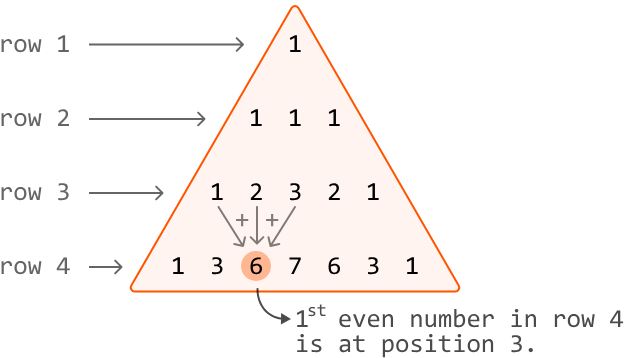

Input: n = 4  
Output: 3

**Constraints:**  
- n will be at least 3.

## Intuition

A naive solution to this problem is to generate the entire triangle and all of its values up to the nth row. Then, we can iterate through the nth row until we encounter the first even number. However, this approach is inefficient because it results in an excessive use of time and memory to build the entire triangle. To find a more optimal solution, let's consider how we can simplify the representation of our triangle.

### Simplifying the triangle

The first key observation is that the triangle is symmetric. This means we can exclude the right half of the triangle because if an even number exists in the right half, it definitely exists in the left half:

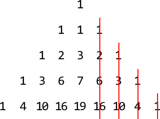

To more easily visualize the positions of the numbers in each row, let's draw it such that numbers belonging to the same position are aligned:

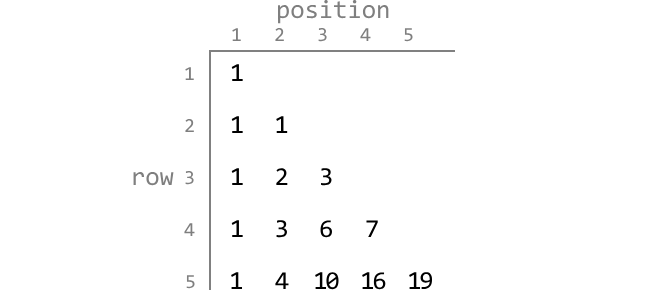

The next key observation is that we don't necessarily care about the values themselves: we only care about the parity of each number (i.e., if they're even or odd). Given this, we can simplify the triangle further by representing it as a binary triangle where 0 represents an even number and 1 represents an odd number:

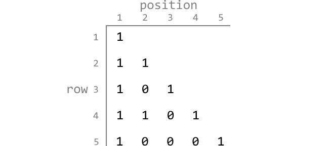

Now that we've simplified the triangle, it'll be easier to identify patterns in the positions of the first even number in each row. Let's explore this further.

### Identifying patterns

Let's ignore rows 1 and 2 since even numbers only begin appearing from row 3 onward. A good place to start looking for a pattern is to highlight the first even number at each row and observe their positions:

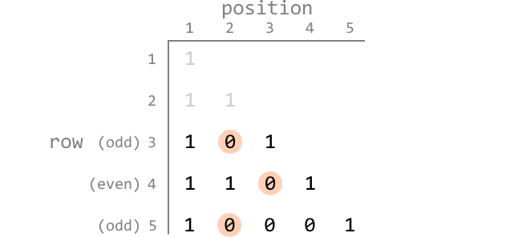

From rows 3 to 5, one possible pattern to observe is that odd-numbered rows have the first even number at position 2. We could also hypothesize that even-numbered rows have the first even at position 3.

To confirm if this observation is consistent, let's look at some more rows:

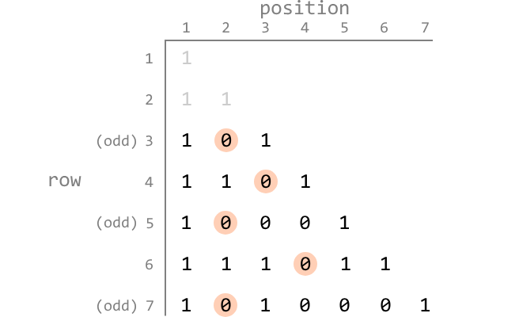

So far, our hypothesis for odd-numbered rows is still true, but even-numbered rows seem to be following a different pattern. It's still hard to pinpoint what it could be.

Let's continue by displaying a few more rows to figure out what this pattern is:

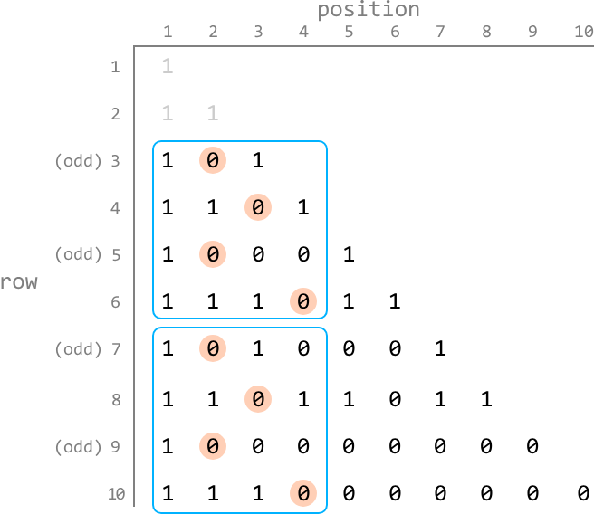

Now, we notice that the first four binary values from rows 3 to 6 repeat for rows 7 to 10. If we were to continue for future rows, we would notice that this pattern continues.

Essentially, the following pattern is consistently repeated, starting from row 3:

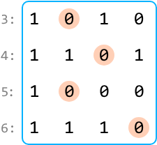

To understand why this pattern repeats, it's important to realize that the first four values of a row are calculated solely from the four values of the previous row. We can see this visualized below, using the initial representation of the triangle to make it clearer:

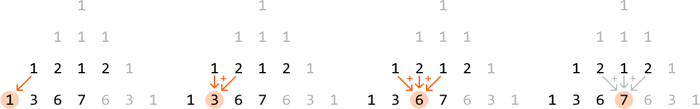

So, whenever a specific sequence of four numbers occurs at the beginning of a row, it will generate a predictable sequence of four numbers in the following row. Extending this observation to the entire pattern, we can conclude that since the pattern repeated once (from rows 3 to 6 to rows 7 to 10), it will continue to repeat indefinitely.

This gives us the below cyclic rationale:

- If n is odd (`n % 2 != 0`), return 2.
- If n is a multiple of 4 (`n % 4 == 0`), return 3.
- Else, return 4.

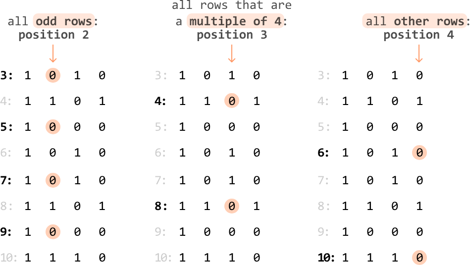

This problem demonstrates how recognizing patterns and simplifying the problem can turn a time-consuming solution into a quick, constant-time one.

**Try it yourself**  
Write your solution to the problem before checking the reference implementation.

## Implementation

### Python
```python
def triangle_numbers(n: int) -> int:
    # If n is an odd-numbered row, the first even number always starts at position
    # 2.
    if n % 2 != 0:
        return 2
    # If n is a multiple of 4, the first even number always starts at position 3.
    elif n % 4 == 0:
        return 3
    # For all other rows, the first even number always starts at position 4.
    return 4
```
### JavaScript
```javascript
export function triangle_numbers(n) {
  // If n is an odd-numbered row, the first even number always starts at position 2.
  if (n % 2 !== 0) {
    return 2
  }
  // If n is a multiple of 4, the first even number always starts at position 3.
  else if (n % 4 === 0) {
    return 3
  }
  // For all other rows, the first even number always starts at position 4.
  return 4
}
```
### Java
```java
public class Main {
    public Integer triangle_numbers(int n) {
        // If n is an odd-numbered row, the first even number always starts at position
        // 2.
        if (n % 2 != 0) {
            return 2;
        }
        // If n is a multiple of 4, the first even number always starts at position 3.
        else if (n % 4 == 0) {
            return 3;
        }
        // For all other rows, the first even number always starts at position 4.
        return 4;
    }
}
```
## Complexity Analysis

**Time complexity:** The time complexity of `triangle_numbers` is O(1).

**Space complexity:** The space complexity is O(1).