# 01. Introduction and Overview
This book is designed to help machine learning (ML) engineers and data scientists succeed in ML system design interviews, with a focus on generative AI (GenAI). It complements the earlier book, “ML System Design Interview” [1], which covers conventional yet fundamental topics, such as search and recommendation systems. This book, however, explores GenAI applications and the unique challenges of designing such systems. It’s also intended to serve as a guide for those who want to understand how GenAI is applied in practical scenarios.

This chapter explores two key topics. First, it provides an overview of GenAI, delving into its fundamental concepts and applications. Then, it introduces a comprehensive framework for building ML systems, which is essential for real-world applications and interview preparation. This framework will serve as the foundation for developing popular GenAI systems in the following chapters.

Let’s dive in.

## GenAI overview
### What are AI and ML?
AI is a branch of computer science focused on creating systems that can perform tasks that typically require human intelligence, such as reasoning, planning, and problem-solving. ML is a subset of AI that uses algorithms to learn from data rather than relying on predefined rules. These algorithms analyze data, identify patterns, and make predictions or generate new content based on the learned patterns. Applications such as recommendation systems, fraud detection, autonomous vehicles, and chatbots are generally powered by ML models.

ML models generally fall into two categories:

- Discriminative
- Generative

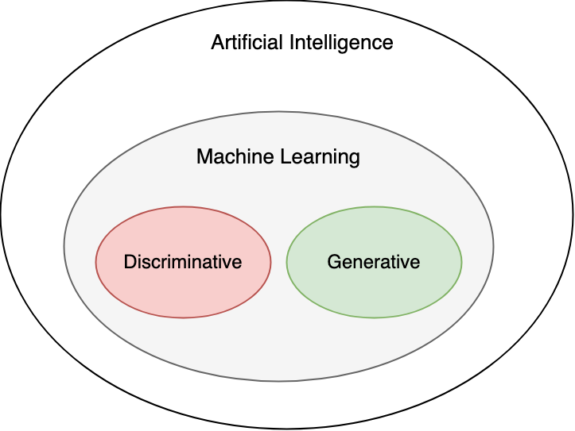

Figure 1: The relationship between AI and ML

### Discriminative
Discriminative models classify data by learning the differences between classes based on input features. Formally, they learn the conditional probabilities, P(Y|X), where Y represents the target variable and X represents the input features.

Discriminative models can be used for both classification, where the goal is to determine the class to which an input belongs, and regression, where the goal is to predict a continuous value. For example, in fraud detection, a discriminative model might classify transactions as either legitimate or fraudulent by analyzing features such as transaction amount and purchase history. Similarly, in movie recommendations, a model predicts a user's rating for a movie based on the user’s historical interactions.

Common algorithms for developing discriminative models include:

- **Logistic regression:** A linear model that predicts the probability of a binary outcome based on input features.
- **Support vector machines (SVMs):** SVMs find the hyperplanes that best separate classes in the feature space. They can be extended to learn non-linear boundaries using kernel functions [2].
- **Decision trees:** These models and their variations, such as random forests, recursively split the data into subgroups based on the target variable.
- **K-nearest neighbors (KNN):** A non-parametric method that classifies a sample based on the majority label among its nearest neighbors in the feature space.
- **Neural networks:** These models consist of layers of interconnected neurons. They use weighted inputs, activation functions, and backpropagation to learn and approximate complex functions for tasks such as classification and regression.

While these algorithms can predict a target variable from input features, most of them lack the capability to learn the underlying data distribution needed to generate new data instances. For that, we turn to generative models.

### Generative models
Generative models aim to understand and replicate the underlying distribution of data. Formally, they model the distribution P(X) when focusing solely on the input data (e.g., image generation), or the joint probability distribution P(X, Y) when considering both the input data and the target variable (e.g., text-to-image generation). This allows them to generate new data instances by sampling from these learned distributions.

Unlike discriminative models, which focus on distinguishing data instances, generative models can create new instances of data that closely resemble the original. For instance, a generative model trained on images of human faces can generate entirely new faces. These models are applied in various tasks such as text generation, image generation, and speech synthesis.

Generative algorithms can be divided into two categories: classical and modern. Classical algorithms are good at learning patterns from structured data. However, they can struggle to learn from more complex or unstructured data. Common classical generative algorithms include:

- **Naive Bayes:** A probabilistic model based on Bayes' theorem [3].
- **Gaussian mixture models (GMMs):** GMMs [4] represent data as a mixture of Gaussian distributions.
- **Hidden Markov models (HMMs):** HMMs [5] model the joint probability of observed sequences and the hidden states generating those sequences.
- **Boltzmann machines:** Energy-based models used for feature learning or dimensionality reduction [6].

On the other hand, modern generative algorithms learn from complex data distributions and are well suited for tasks such as generating realistic images and producing accurate textual outputs in response to queries. Common modern generative algorithms include:

- **Variational autoencoders (VAEs):** A type of autoencoder that models the distribution of data by encoding it to a latent space and then reconstructing the original data using a decoder.
- **Generative adversarial networks (GANs):** A class of neural networks in which a generator and discriminator are trained simultaneously. The generator creates realistic data, and the discriminator tries to distinguish between real and generated data.
- **Diffusion models:** Models that learn complex data distributions through a reverse diffusion process. They are commonly used for image and video generation.
- **Autoregressive models:** Models that generate data by predicting each element in a sequence based on the preceding elements. They are commonly used in text generation and time series forecasting.

Discriminative and generative models are used for different purposes. Discriminative models are typically used when the goal is to classify or predict; generative models are used to generate new samples. Figure 2 shows popular tasks powered by generative and discriminative models.

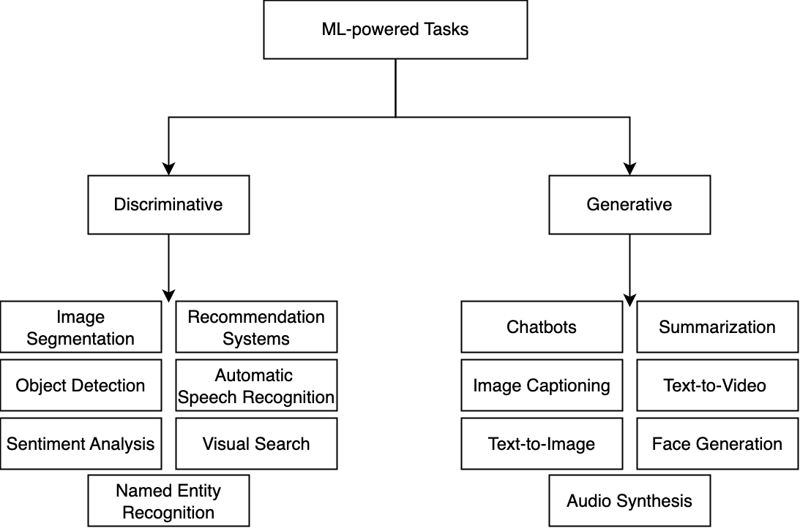

Figure 2: Popular ML-powered tasks

## What is GenAI and why is it gaining popularity?
GenAI involves using modern generative algorithms to train models capable of producing new data samples such as images, videos, text, and audio.

GenAI has gained a lot of popularity recently for two main reasons. First, these models can perform various tasks across different domains such as generating text, creating realistic images, and composing music. This multitasking capability makes them valuable across industries, from creative arts and entertainment to healthcare and software development.

Second, GenAI applications significantly enhance productivity. For instance, in content creation, these models can generate drafts, suggest improvements, or even produce final outputs, saving considerable time and resources. Another example is the use of large language models (LLMs) such as ChatGPT [7], which can assist in tasks like answering complex questions and engaging in meaningful conversations. In a recent report by McKinsey [8], GenAI is predicted to “enable labor productivity growth of 0.1 to 0.6 percent annually through 2040.”

## Why GenAI is becoming so powerful?
GenAI models have recently demonstrated impressive capability and are becoming very powerful. Three key factors driving this advancement are:

1. Data
2. Model capacity
3. Compute

## Data
An ML model's effectiveness depends on its training data. For example, if a model has not been trained on extensive medical data, it might struggle to diagnose diseases accurately. Improving a model for a specific task requires large datasets with labels, but collecting this data can be challenging and expensive.

One key driver behind the success of GenAI is self-supervised learning. Unlike classical models that typically work well when trained on labeled data, GenAI models can learn from unlabeled data. This approach lets them use vast datasets from the internet without the need for costly and time-consuming labeling processes.

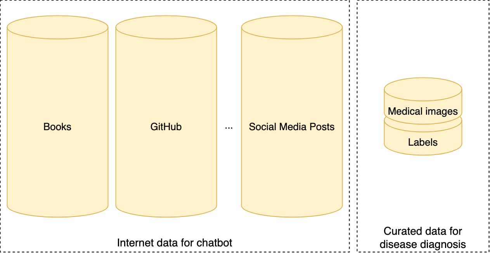

Figure 3: Data scale comparison between training a chatbot and disease diagnosis

Because of easy access to very large datasets from the internet, modern GenAI models can be trained on massive datasets, sometimes exceeding billions of text documents or images. For example, Meta’s Llama 3 model [9] was trained on 15 trillion tokens—roughly 50 terabytes of data; Google’s Flamingo model [10] was trained on 1.8 billion (image, text) pairs. Being trained on this massive amount of data helps these models learn complex patterns and nuances, resulting in high-quality outputs.

## Model capacity
Another key factor in the effectiveness of ML models is their capacity to learn. Model capacity is measured in two ways:

- Number of parameters
- FLOP count
## Number of parameters
Parameters are the values within a model that are learned during the training process. The number of parameters is a key indicator of a model's capacity to learn from data.

A model with more parameters generally has a greater capacity to learn the complex patterns and relationships that exist within the data. This often translates to better performance, assuming the model has been trained on a large dataset. Table 1 shows five popular models and their number of parameters.

| Model Name               | Parameters |
|--------------------------|------------|
| Google’s PaLM [11]       | 540B       |
| OpenAI’s GPT-3 [12]      | 175B       |
| Google’s Flamingo [10]   | 80B        |
| Meta’s Llama 3 [9]       | 405B       |
| Google’s Imagen [13]     | 2B         |

Table 1: Popular GenAI models and their number of parameters

## FLOP count
FLOP (Floating Point Operations) measures the computational complexity of a model by counting the floating-point operations required to complete a forward pass. This includes basic arithmetic operations like addition, multiplication, and others that happen as data moves through the model's layers.

To better understand FLOP count, let’s walk through a simple example.

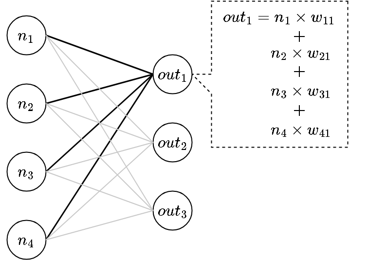

Figure 4: A simple fully connected layer and arithmetic calculations for a single output neuron

Consider a fully connected layer with 4 input neurons and 3 output neurons. Each output neuron is computed by multiplying the input neurons with their corresponding weight and summing them up. This results in 4 multiplications and 3 additions for each output neuron, as shown in Figure 4. Therefore, total FLOPs are 3 (4+3)=21.

While the number of parameters measures a model's size, FLOP indicates the number of arithmetic computations and provides insight into the model's computational complexity. Although a model with more parameters often has a higher FLOP count, this isn’t always the case. The architecture plays a crucial role—dense layers typically require more FLOPs than sparse connections, even if the parameter count is the same. Understanding this distinction is crucial when optimizing a model, as it requires balancing both parameters and FLOPs. Understanding these distinctions helps us design models that are both accurate and computationally efficient.

## Compute
As models increase in capacity, their performance tends to improve, but training these large models requires enormous amounts of computational resources. The compute required during model training is often measured in FLOP, representing the total number of operations performed. For example, Google's PaLM-2 model was trained using 1022 FLOPs [14].

Compute power is typically provided by hardware like CPUs, GPUs (Graphics Processing Units), and TPUs (Tensor Processing Units). Nvidia, for instance, offers advanced GPUs such as the H100, A100, and A10, each with different costs and processing capabilities. The performance of these machines is often measured in FLOP/S (Floating Point Operations Per Second). For example, Nvidia's H100 can deliver up to 60 teraflops per second (60 TFLOP/S) [15].

Training advanced GenAI models is expensive, requiring thousands of GPUs over weeks-long periods. To grasp the computational demands for models such as PaLM-2, let's calculate the required number of H100 GPUs. Assuming the H100 has a peak performance of 60 TFLOP/S, it can complete approximately 5.18 EFLOPs per day. Given that PaLM-2 required 1022 FLOPs, it would take around 5.5 years for a single H100 GPU to complete the necessary computations. Therefore, the cost of training large models is extremely high, often exceeding tens of millions of dollars. For example, Sam Altman, OpenAI’s CEO, has stated that the cost of training GPT-4 was more than $100 million [16].

Training a model with billions of parameters (e.g., GPT-4, Llama 3) was not possible just a few years ago. The shift in capability has been mainly due to hardware advancements, particularly with specialized chips like GPUs and TPUs, designed for deep learning tasks. Distributed training has also been crucial, allowing the workload to be shared across hundreds, or even thousands, of machines in parallel. This significantly speeds up the process, making it feasible to train very large models on huge datasets. These infrastructure improvements and training techniques have made it possible to train GenAI models at unprecedented scales.

## Scaling law
Within the constraints of a compute budget (measured in FLOPs), what is the optimal combination of model size and training data (measured by the number of tokens) that yields the lowest loss? This is the fundamental question researchers aim to answer through scaling laws.

In 2020, OpenAI researchers conducted extensive LLM training experiments, exploring various factors such as model sizes (N), dataset sizes (D), computational resources (C), model architectures, and context lengths [17]. Their findings revealed two key insights. First, the impact of scaling on model performance is significantly more pronounced than the influence of architectural variations. Second, as model size, dataset size, or computational resources are increased, there is a corresponding and predictable improvement in performance, which follows a power-law trend.

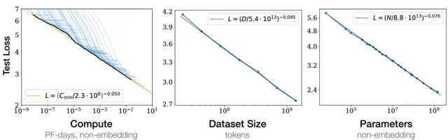

Figure 5: OpenAI’s scaling law (Credit: [17])

In 2022, DeepMind researchers extended this understanding by highlighting that many existing LLMs were undertrained, meaning the models were not large enough for the amount of data on which they were trained [18]. They found that the amount of data should scale linearly with model size to achieve optimal performance.

With the recent release of GPT o1 [19], researchers have begun to speculate about the existence of a scaling law during inference, as well [20].

## GenAI risks and limitations
GenAI has evolved quickly, driving advancements across many industries by creating realistic text, images, and videos. However, it also brings critical risks and limitations that need careful consideration. Addressing these issues is key to ensuring responsible and sustainable development. Common challenges include:

- Ethical concerns: Issues relating to bias, intellectual property (IP), misinformation, and misuse of generated content can have harmful societal impacts.
- Environmental impact: The high computational power required to train large models contributes to substantial energy consumption and carbon emissions.
- Model limitations: GenAI models often lack true understanding, leading to inaccuracies and limitations in complex reasoning tasks, and hallucination.
- Security risks: There are threats posed by the use of GenAI to create deepfakes used for blackmail, political manipulation, automated phishing attacks, and adversarial exploits that manipulate model outputs in critical systems such as healthcare and finance.

Each of these areas represents a significant challenge in the development of GenAI applications. Addressing these risks requires a multidisciplinary approach involving not just technical solutions but also ethical frameworks, legal regulations, and societal awareness.

## A framework for ML system design interviews
Many engineers think of ML algorithms—for instance, autoregressive Transformers or diffusion models—as the entirety of an ML system. However, building and deploying GenAI systems involves much more than just training a model. These systems are complex, with components such as data pipelines to handle and preprocess large datasets, evaluation mechanisms to assess output quality and safety, infrastructure to deliver AI-generated content at scale, and monitoring to ensure consistent performance over time.

In an ML system design interview, particularly those focused on GenAI, you’ll often face open-ended questions. For example, you might be asked to design a chatbot for customer service or an AI-powered image-editing tool for creatives. There isn’t a single "correct" answer. The interviewer is interested in how you approach complex problems, your understanding of GenAI concepts, your system design process, and the reasoning behind your design choices.

To succeed in a GenAI system design interview, it is crucial to follow a structured framework. Disorganized responses can obscure your thought process and reduce clarity. This book introduces a framework to guide you through GenAI system design challenges. The framework includes the following key steps:

1. Clarifying requirements
2. Framing the problem as an ML task
3. Data preparation
4. Model development
5. Evaluation
6. Overall ML system design
7. Deployment and monitoring

Figure 6: ML system design steps

Let's dive into each step to examine the key considerations and talking points when designing a GenAI system.

## Clarifying Requirements
When you start to develop an ML system to solve a particular task, you often have minimal information to begin with. Similarly, in interviews, ML system design questions are often vague, providing minimal details. For instance, an interview might ask you to "design an image generation system." The first step is to ask clarifying questions. But what questions should you ask?

Your questions should help in understanding the problem space and the specific goals the system needs to achieve. They fall into two types:

- Functional requirements
- Non-functional requirements
## Functional requirements
Functional requirements describe what the system should do—the core capabilities of the system. For example, “generate an image and customize its style based on the user’s prompt” is a functional requirement for a text-to-image system. In the context of designing a GenAI system, functional requirements are crucial because they shape the high-level architecture of the system. They guide the development of essential components and functionalities that the system needs to deliver to meet user needs.

## Non-functional requirements
Non-functional requirements focus on how the system performs, not what it does. These include performance metrics such as latency and throughput, along with considerations for fairness, security, and scalability. In an image generation system, for example, non-functional requirements might define the acceptable speed for generating images and the quality standards they must meet. While these requirements are usually advanced topics in GenAI system design and may not significantly alter the initial architecture, it's crucial to identify and understand them early, as they will often shape the later stages of design, especially during performance tuning and system improvements.

Here are some questions to help you get started:

- **Business objective:** What is the primary goal of this system? What specific purpose will it serve? For example, when designing an image captioning system, it’s essential to know if it will be used for generating detailed product descriptions on an e-commerce platform or for suggesting short captions for photos on social media.
- **System features:** What features should the system support that might influence the ML design? For instance, when designing an image generation system, it’s important to know if users can provide feedback or rate the generated images, as these interactions could enhance the model. Similarly, when designing an LLM, it’s crucial to know which languages should be supported.
- **Data:** What are the data sources? How large is the dataset? Is the data labeled? These questions are crucial because the quality and quantity of the data might influence the design.
- **Constraints:** What are the available computational resources? Will the system be cloud-based or designed to run on local devices?
- **System scale:** How many users are expected to use the system? How many images need to be generated, and what is the expected growth in demand? These questions are important to clarify because a system designed to generate images for a small group of users will not require the same level of scalability as one expected to serve millions of users.
- **Performance:** How quickly should the content be generated? Is real-time generation required? Is there a higher priority on content quality or generation speed?

This list isn't comprehensive, but it provides a good starting point. Other topics, such as privacy, ethics, and data security, can also be important.

By the end of this step, you should be aligned with the interviewer on the system's scope and requirements. It's generally a good idea to clarify these details to ensure you're addressing the interviewer's expectations.

## Framing the problem as an ML task
If an interviewer asks you to design a feature that automatically summarizes emails for users, you have a problem to solve. But you can't simply ask AI to summarize emails. Instead, you need to frame the problem so that AI techniques can address it. Framing a problem as an ML task is a key step in designing ML systems, as doing this shapes the rest of your design.

When tackling a problem, you first need to determine whether machine learning is even necessary. However, with GenAI systems, you can typically assume ML will be required since it's the main tool for developing these systems.

The following two steps are useful for framing your problem as an ML task:

- Specify the system’s input and output
- Choose a suitable ML approach
## Specify the system’s input and output
To frame the problem, you first define the system's input and output. This involves identifying the input data modality (text, image, audio, video) and the expected output. For instance, in a chatbot system, the input is the user's text query, and the output is the system's response.

Figure 7: Input and output of a chatbot

## Choose a suitable ML approach
After defining the input and output of the system, the next step is to choose the most suitable ML approach. This involves identifying key components of your system and selecting an algorithm that aligns with the specific needs of the problem. As illustrated in Figure 8, there are numerous ML algorithms to choose from, each with its own strengths and weaknesses. It is crucial to compare them, discuss the trade-offs, and choose the one that is most suitable for your task.

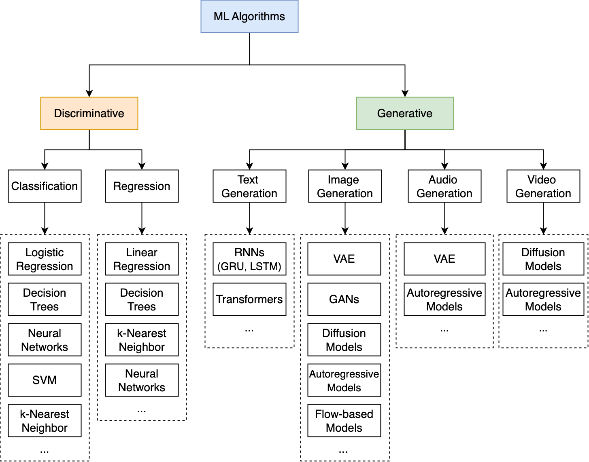

Figure 8: Common ML algorithms

There are different ways to select an appropriate ML algorithm, and the criteria for selection vary from application to application. The following steps can help you narrow down your options when choosing the most suitable algorithm:

1. **Discriminative vs. generative:** First, determine whether the problem requires a discriminative or generative model. This can be easily determined based on the system's output. For example, in an object detection problem, where the output is the class of the input image, the task is discriminative. In contrast, designing a chatbot that produces text as output is a generative task.

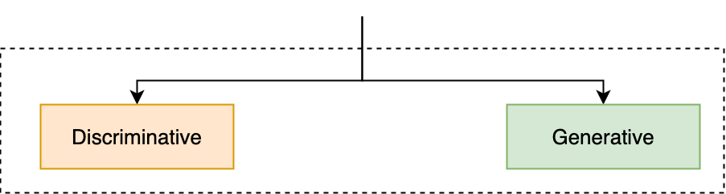

Figure 9: Step one for choosing a suitable ML approach

2. **Identify the task type:** Next, identify the specific task type to further narrow the choice of algorithms. The two most common tasks for discriminative models are classification and regression. Generative models commonly undertake tasks such as text, image, audio, and video generation. The system’s output can help identify the task type. For instance, an image captioning system generates text, making it a text generation task; a face generation system produces images, making it an image generation task; an object detection system that outputs an object class is a classification task.

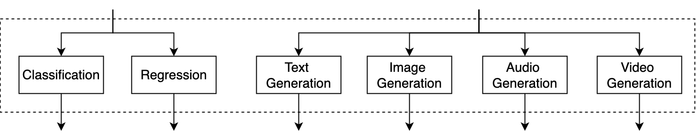

Figure 10: Step two for choosing a suitable ML approach

3. **Choose a suitable algorithm:** Finally, select an algorithm that is most suitable based on the requirements. Consider factors such as the ability to handle different input modalities, efficiency, and quality expectations. For example, in a text-to-image system, the algorithm must process text as input and generate an image as output; therefore, VAEs or GANs might not be ideal despite their abilities to generate images. This step is the ideal time to evaluate the various options and discuss their trade-offs. This step is the ideal time to evaluate various options and discuss their trade-offs.

In the upcoming chapters, we will examine various ML approaches used in popular GenAI applications.

## Talking points
- What are the system's inputs and outputs based on the requirements?
- Which data modalities (text, image, audio, video) does the model need to understand and process? How will the model handle different modalities?
- Should a single model handle all input modalities, or is it more effective to use multiple models for different modalities? What are the benefits and drawbacks of using a unified model versus specialized models for each modality?
- Which generative algorithm (e.g., diffusion models, VAEs, GANs) is best suited for the task at hand, and why? What are the specific trade-offs between different algorithms in terms of quality, efficiency, and ease of use?
- What are the performance, stability, and resource implications of choosing one algorithm over another?
- Is the chosen approach scalable and flexible enough to accommodate future changes or additions to the system's capabilities? How easily can the system adapt if new input modalities or outputs are introduced later?
## Data Preparation
ML models learn directly from data; therefore, high-quality data is crucial for effective training. This section explains different data types and key considerations when preparing them for ML models.

## Data types
In ML, data is generally categorized into two types: structured and unstructured.

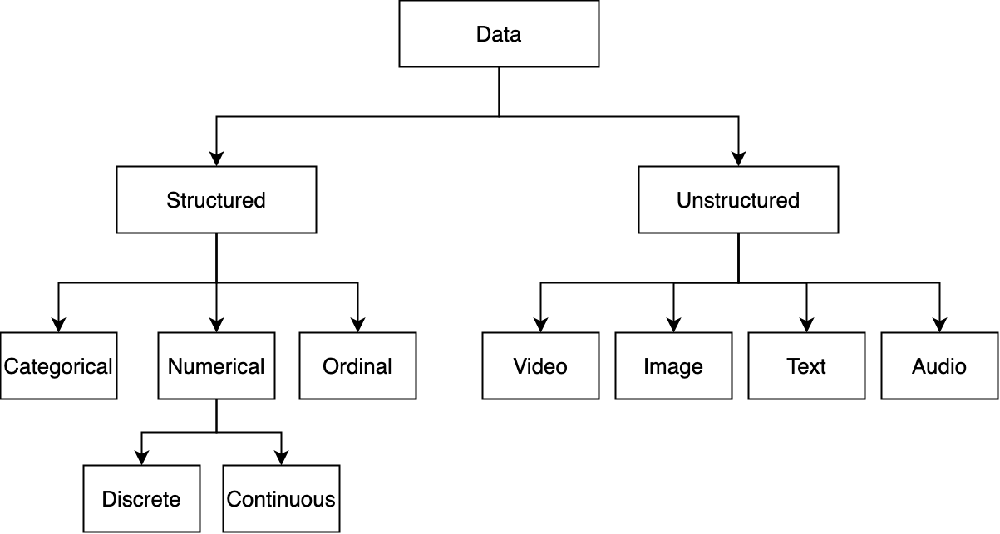

Figure 11: Data categories

**Structured data:** This type of data can be organized into tables with rows and columns, for example, a database or spreadsheet. Financial records and customer data are examples of structured data. Structured data can be further divided into the following categories:

- **Categorical data:** Data that represent distinct groups or categories (e.g., gender or color).
- **Numerical data:** Data that represent measurable quantities (e.g., number of items sold, house price).
- **Ordinal data:** Data with a predetermined order (e.g., satisfaction ratings).
**Unstructured data:** Unstructured data refers to data with no underlying data schema or structure, such as text, images, videos, audio files, or a combination of them. For example, social media posts or emails are examples of unstructured data.

Traditional ML models are typically trained on structured data. In contrast, models that power GenAI applications primarily deal with unstructured data like images, text, and videos. As a result, the focus of data preparation differs significantly between traditional models handling structured data and generative models working with unstructured data. Let’s explore each in more detail.

## Data preparation in traditional ML
Preparing structured data for traditional models typically involves two key steps: data engineering and feature engineering.

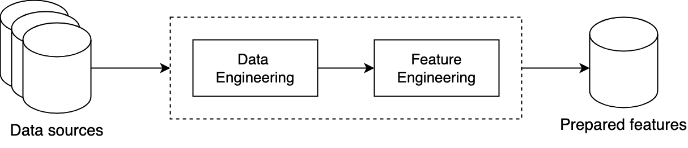

Figure 12: Data preparation process for structured data

## Data Engineering
Data engineering involves building and maintaining systems for collecting, storing, retrieving, and processing data. A core component of this is ETL (Extract, Transform, Load) [21], which refers to the process of extracting data from various sources, transforming it into a usable format, and loading it into a data warehouse or other storage system. Data engineering ensures that data is clean, reliable, and accessible.

## Feature Engineering
Feature engineering involves selecting and extracting predictive features from raw data and transforming them into a format usable by ML models. This process often utilizes feature stores, such as Tecton [22] or Amazon SageMaker [23], which offer a centralized platform for managing and serving features at scale.

Selecting the right features is crucial when developing and training ML models. It’s important to choose features that provide the most information. The feature engineering process requires subject matter expertise and is highly task-specific. It includes techniques such as handling missing values, representing categorical features, and bucketing.

Since this book focuses on GenAI, we concentrate primarily on data preparation specific to GenAI models. For a deeper dive into data engineering and feature engineering techniques, refer to [24].

## Data preparation in GenAI
When preparing unstructured data for generative models, the focus shifts from feature engineering to collecting vast amounts of data; ensuring the data is of high quality and safe; and utilizing tools to store and retrieve the data efficiently and at scale.

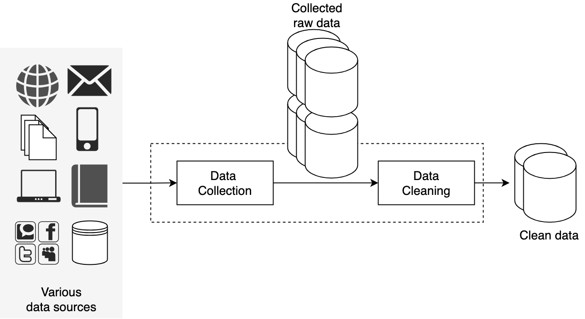

Figure 13: Data preparation process in GenAI

Let’s examine the following key steps in data preparation:

- Data collection
- Data cleaning
- Data efficiency
## Data collection
Advanced GenAI models have billions of parameters that enable them to learn and generalize from data. Due to their size, these models require vast amount of training data to capture complex patterns. For instance, Llama 3 was trained on 15 trillion tokens from various internet sources—equivalent to 50 terabytes of data. To put this into perspective, a person reading nonstop at the typical rate of 250 words per minute would take around 85,000 years to read that amount of text. The data collection process gathers large datasets by scraping text from different sources (e.g., websites, social media, and forums).

As models grow larger, there's a trend toward enhancing training datasets with AI-generated content. This involves using existing models to create synthetic data, which is then used to train another GenAI model.

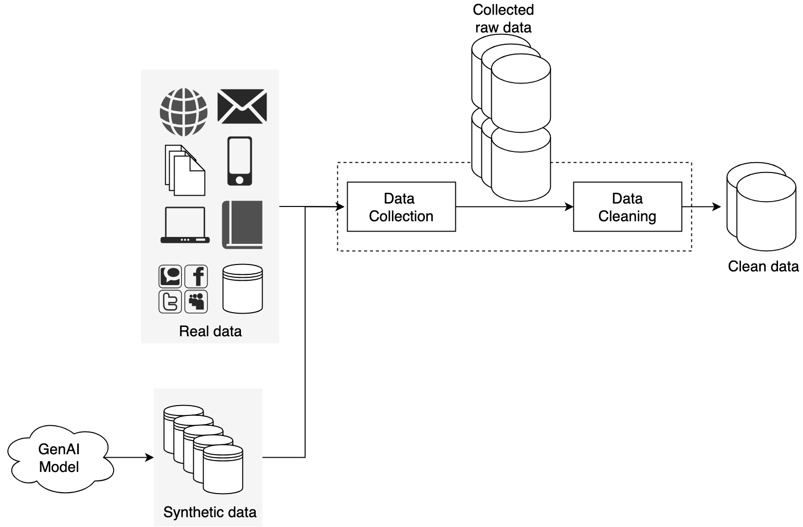

Figure 14: Augmenting training data with AI-generated data

Training GenAI models with AI-generated content has several pros and cons.

**Pros:**
- **Improving data diversity:** AI-generated content adds variety to existing data, thus enhancing the model's ability to generalize, especially when the original data is limited or imbalanced.
- **Scalability:** As demand for data grows, AI-generated content provides a scalable way to create large datasets that are difficult to gather manually.

**Cons:**
- **Quality concerns:** The quality of synthetic data depends on the original model. Poor-quality data can lead to the spread of biases or errors.
Representation issues: The synthetic data might not represent the original data well. Ensuring the synthetic data is diverse and representative can be challenging.
- **Real-world distribution gaps:** AI-generated data may not fully capture the complexity of real-world scenarios, thereby risking the omission of important details.

Using AI-generated data to train GenAI models is a rapidly evolving area of research. New techniques are constantly being developed to improve the quality and relevance of synthetic data. For more information, refer to [25].

## Data cleaning
Very large datasets from the internet are often noisy, and they may contain low-quality or inappropriate content. We must clean the data carefully to avoid introducing biases, misinformation, or harmful material into the model, which can affect its performance. In addition, it is crucial to have data that is representative. This requires removing duplicate content and ensuring it is diverse and balanced.

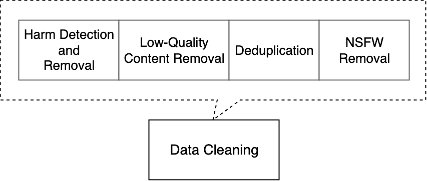

Figure 15: Common data cleaning steps

Throughout this book, we will explore key data-cleaning techniques including filtering harmful content, detecting NSFW (Not Safe For Work), assigning quality scores, and removing duplicates.

## Data efficiency
Managing large datasets requires efficient tools and techniques for storage and retrieval. Let's look at each in detail.

## Efficient storage
Storing massive amounts of data with traditional tools can be expensive and slow. Distributed storage systems such as Hadoop Distributed File System (HDFS) [26] and Amazon S3 [27] are built to store massive amounts of data across multiple machines. These systems are particularly suited for managing large volumes of unstructured data. In addition, columnar storage formats such as Parquet [28] and ORC [29] are ideal for structured data or unstructured data that has been converted to structured form. These formats, optimized for analytics, offer better compression and faster query performance.

## Efficient retrieval
Training an ML model requires fast data retrieval. Common techniques to retrieve data efficiently from large datasets include:

- **Sharding:** Splitting data across multiple devices allows parallel access and speeds up retrieval and processing.
- **Indexing:** Technologies such as Apache Lucene [30] or Elasticsearch [31] are used to index data, making it easy and quick to locate specific pieces of information.
- **Pre-loading or caching:** Frequently accessed data is pre-loaded into memory to reduce I/O delays during retrieval.
## Talking points
- **Data sources:** What data is available, and where do you collect it from? How diverse are they? How large is the dataset?
- **Data sensitivity:** How sensitive is the data (e.g., personal, financial, medical)? Is anonymization necessary to protect sensitive information?
- **Bias:** Are there inherent biases in the data (e.g., demographic, geographical)? How do you detect and mitigate these biases to ensure fair representation?
- **Data quality:** How do you filter low-quality, irrelevant, or noisy data? Are there any outliers or anomalies in the dataset? How do you handle them?
- **Inappropriate data:** Are there inappropriate, harmful, or NSFW content in the dataset? What processes are in place to detect and remove such data?
- **Data preprocessing:** How is the data represented in a format the model can understand? If using text data, how is it tokenized and transformed into numerical format (e.g., embeddings)? If dealing with multimodal data (e.g., images, text, audio), how do you preprocess them for the model to consume?
## Model development
Model development is a critical step in building ML systems. It involves selecting the appropriate architecture, training the model, and finally, generating new data from the trained model. Let’s dive into each of these components in more detail.

### Model architecture
In this step, you should talk about the architecture of the model in detail. There might be several viable architectures for different ML algorithms. For instance, diffusion models can be built using either the U-Net or DiT architectures. In an interview, it’s important to explore different architectural options and weigh their advantages and disadvantages.

Once an architecture is selected, it’s helpful to analyze its specific layers and examine how the input is transformed into the output. For example, in a U-Net architecture, the output should be the same size as the input image; therefore, reviewing the layers to ensure they meet this requirement is beneficial.

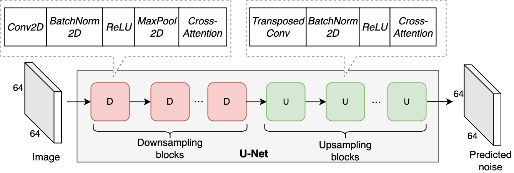

Figure 16: U-Net architecture

You might be asked follow-up questions and have to modify the architecture to support a new feature. For example, in an image generation model, you might need to modify the architecture to let users control the style of generated images. Similarly, in a text-to-video model, you might be asked to control the direction of motion (e.g., left to right) during generation. These features could require adding or modifying components in the architecture to integrate style vectors or motion information.

Let’s dive into a real example—the Transformer’s self-attention—to show what it means to discuss architecture in an interview.

## Transformer’s self-attention architecture
Transformers are a cornerstone of modern GenAI, especially in natural language processing and image generation. Since their introduction in 2017 [32], they have rapidly taken over the AI community, becoming the dominant architecture for a wide range of tasks across natural language processing (NLP) [33] [12], computer vision [34], and even multimodal learning [35] [36].

At the core of Transformers is the attention mechanism. Initially introduced in the context of machine translation [37], the attention mechanism has become a fundamental component of various neural network architectures, particularly in the Transformer model. It addresses the limitations of traditional sequence models such as RNNs and LSTMs by enabling the model to more effectively capture long-range dependencies and contextual information.

Self-attention, also known as scaled dot-product attention, is the most common form of the attention mechanism used in modern models. It enables each element in the input sequence to focus on every other element. This is done by converting the input embeddings for each token into three vectors: the query $(Q)$, key $(K)$, and value $(V)$ vectors. These vectors are computed using learnable weight matrices $W_Q$,$W_K$ and $W_V$ :
 

 $$
Q = XW_Q,\quad K = XW_K,\quad V = XW_V
$$

where $X$ represents the input sequence of embeddings.

The attention scores are computed by taking the dot product of the query vector, $Q$, with all the key vectors, $K$, followed by a scaling operation and a softmax function. This can be represented as:

$$
\text{Attention}(Q, K, V) = \text{softmax}\left(\frac{QK^T}{\sqrt{d_K}}\right)V
$$ 
​
  Here, $d_K$ is the dimension of the key vectors, and the scaling factor is $\frac{1}{\sqrt{d_K}}$ is used to prevent the dot-product values from becoming too large, which could result in extremely small gradients during backpropagation. The softmax function is applied to ensure that the attention scores are normalized, summing to 1. This produces a weighted sum of the value vectors,
$V$, where the weights are determined by the relevance of each input token as indicated by the attention scores.

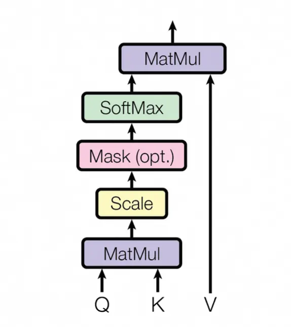

Figure 17: Scaled dot-product attention (Credit: [32])

## Multi-Head Attention

To capture different types of relationships and contextual dependencies, the self-attention mechanism is often extended to multi-head attention. Instead of computing a single set of $Q$, $K$, and $V$ vectors, the input is projected into multiple sets, or “heads,” each with its own learnable weight matrices:

$$
\text{MultiHead}(Q, K, V) = \text{Concat}(\text{head}_1, \text{head}_2, \cdots, \text{head}_h) W_O
$$

where each attention head is computed independently as:

$$
\text{head}_i = \text{Attention}(QW_Q^i, KW_K^i, VW_V^i)
$$

The results of the different heads are concatenated and then linearly transformed using the output weight matrix, $W_O$. This allows the model to jointly attend to information from different representation subspaces and capture richer dependencies.

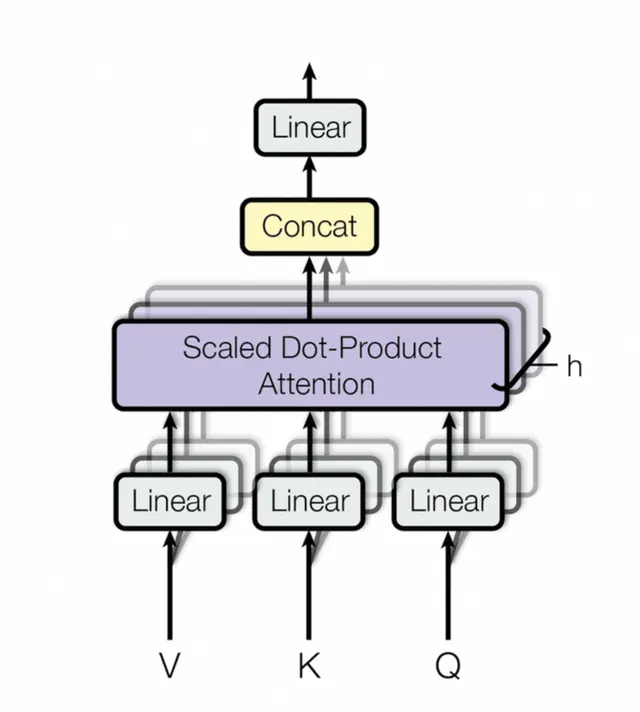

Figure 18: Multi-head attention (Credit: [32])

There is no one-size-fits-all architecture for every problem. Interviewers want to assess your understanding of different ML architectures, their strengths and weaknesses, and your ability to choose the right one based on specific requirements and constraints. In this book, we introduce various Transformer-based models through GenAI applications and explain their necessity.

---

## Model Training

Model training is the process of adjusting the model’s parameters (weights) to produce the desired output. Key aspects to discuss during model training include:

- **Training methodology**
- **Training data**
- **ML objective and loss function**
- **Task-specific challenges and mitigations**

Let’s examine each in more detail.

---

## Training Methodology

Each model follows a distinct training process suited to its architecture and purpose. For example, diffusion models gradually denoise data to generate high-quality samples from noise. In contrast, GANs rely on adversarial training, where a generator and a discriminator compete to improve over time.

Many models also undergo multi-stage training for better performance. LLMs, for instance, typically follow three stages: pretraining on large datasets to learn general patterns; supervised finetuning to adapt to the specific task; and an alignment stage to ensure outputs align with human values or intended behaviors. This approach helps models perform well across various applications.

Having an in-depth understanding of these training methodologies for different GenAI applications is crucial, especially when discussing them in an interview.

## Training Data

Understanding the training data is essential for successful model development. The data used can vary across different GenAI applications and may also differ in multi-stage training approaches. For instance, when training an LLM, publicly available datasets such as Common Crawl might be used during the pretraining stage, while expert-annotated, carefully curated data would be used for the alignment stage.

It's important to discuss the datasets, including how they are sourced, why they are valuable for model training, and an estimate of their size for effective training.

## ML Objective and Loss Function

ML objective is the goal of the ML task during training. For example, in an LLM, it might be to accurately predict the next token (e.g., next-token prediction). In contrast, in VAE, the ML objective is to reconstruct the original image.

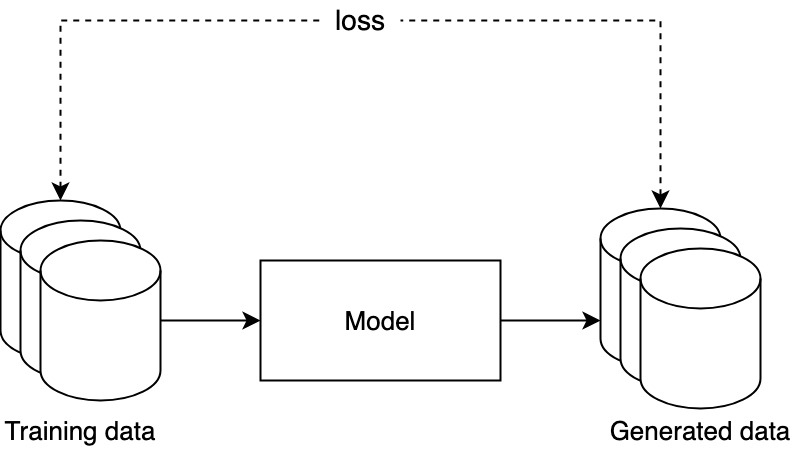

Figure 19: Loss computation between training data and generated data

The loss function measures how closely the model's predictions align with the desired outcomes. It guides the optimization process, where the goal is to minimize this loss. Choosing the right loss function is crucial during model training, as it quantifies prediction errors and helps the optimization algorithm adjust the model's parameters to improve performance.

Designing a new loss function can be complex. In most cases, you'll select one from existing options based on how you've framed the problem. Sometimes, minor adjustments to the loss function are required to tailor it to the specific task. We will explore several loss functions in later chapters.

## Task-Specific Challenges and Mitigations

Different tasks come with their own challenges that need specific solutions. For example, training large video generation models is very resource-heavy because it requires a lot of computing power and large amounts of data. This means it might not be feasible to train a video generation model without proper optimization techniques. This might include parallelization techniques, mixed precision training, and latent diffusion models. These approaches help scale video generation models while keeping resource use and costs manageable. While we will cover task-specific challenges and mitigations in future chapters, we'll now briefly examine efficiency and optimization techniques that apply to all large-scale model training.

Three of the most common techniques for training large-scale models are:

- Gradient checkpointing
- Mixed precision training
- Distributed training

### Gradient Checkpointing

Gradient checkpointing is a technique to reduce memory usage during model training by saving only a selected subset of activations. During the backward pass, the missing activations are recomputed. This reduces memory usage significantly, which is particularly useful for training large models with limited GPU memory.

### Mixed Precision Training

Mixed precision training is a technique that uses both 16-bit (half-precision) and 32-bit (single-precision) floating point numbers to speed up model training and reduce memory usage. It maintains the accuracy of training while improving efficiency by performing most calculations at lower precision; crucial operations are performed at higher precision when needed.

Automatic mixed precision (AMP) is a specific implementation of mixed precision training provided by frameworks such as PyTorch and TensorFlow. AMP automatically handles the transition between half and single precision, optimizing where to use each precision type and applying scaling techniques to maintain numerical stability during training.

### Distributed Training

As models grow in size and complexity, training on a single machine becomes infeasible. Distributed training techniques enable efficient training of large models by utilizing multiple machines or devices in parallel.

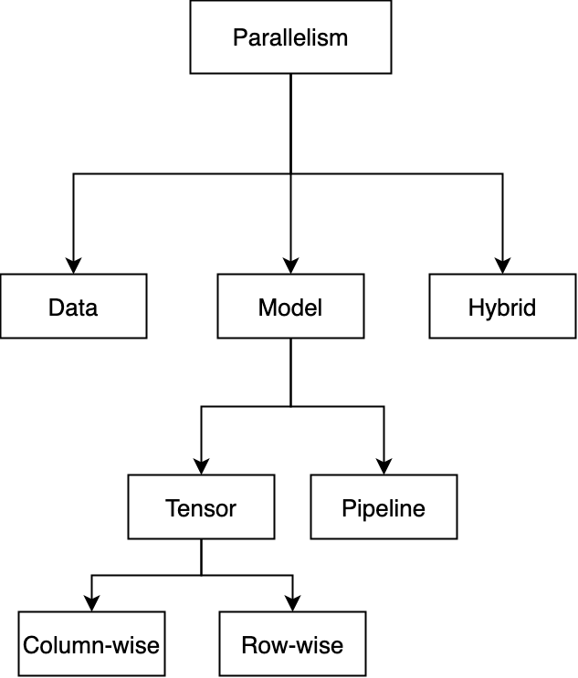

Figure 20: Parallelism techniques for distributed training

Common parallelism techniques are:

- Data parallelism
- Model parallelism
- Hybrid parallelism

### Data Parallelism

In data parallelism, the dataset is split across multiple devices (e.g., GPU), each of which holds a full copy of the model and processes a portion of the data in parallel. Each device trains on its subset of data, and the parameter server coordinates the updating and distributing of model parameters across all devices. This approach is helpful when the dataset is large, as processing the data in parallel is efficient and speeds up training.

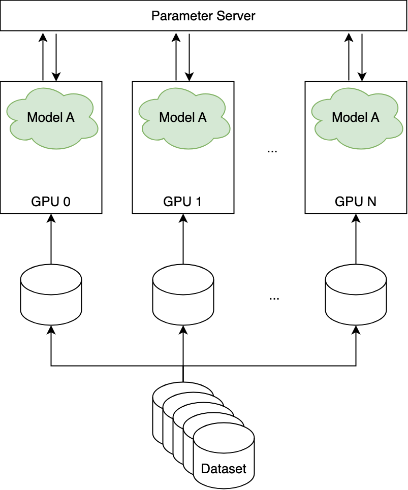

Figure 21: Data parallelism

There are two primary methods for updating model parameters across the devices:

- **Synchronous:** In this approach, all devices complete their computations and send gradients to the parameter server. The parameter server waits until it has received gradients from every device, and then it aggregates and updates the model before sending the updated parameters back to all devices. This ensures consistency, as the devices always work with the same version of the model. However, it can be slower because updating has to wait for the slowest device.
- **Asynchronous:** With asynchronous updating, each device sends its gradients to the parameter server as soon as it finishes processing its portion of data, and the parameter server updates the model immediately upon receiving gradients from any device and sends the new parameters to all devices. This approach can be faster since the devices are working independently, but it can lead to inconsistency as devices might be working with slightly different versions of the model at any given time.

To learn more about data parallelism, refer to [39].

### Model Parallelism

In model parallelism, a single model is split across multiple devices, and each device is responsible for computing only a portion of the model's operations. This approach is helpful when the model is too large to fit into the memory of a single device.

Model parallelism can be further divided into types:

- Pipeline parallelism (inter-layer)
- Tensor parallelism (intra-layer)

**Pipeline Parallelism (PP):** In PP, the model layers are split across multiple devices, and computations are performed in a pipelined manner. In the forward pass, each device forwards the intermediate activation to the next device in the pipeline, while in the backward pass, it sends the input tensor's gradient back to the preceding device.

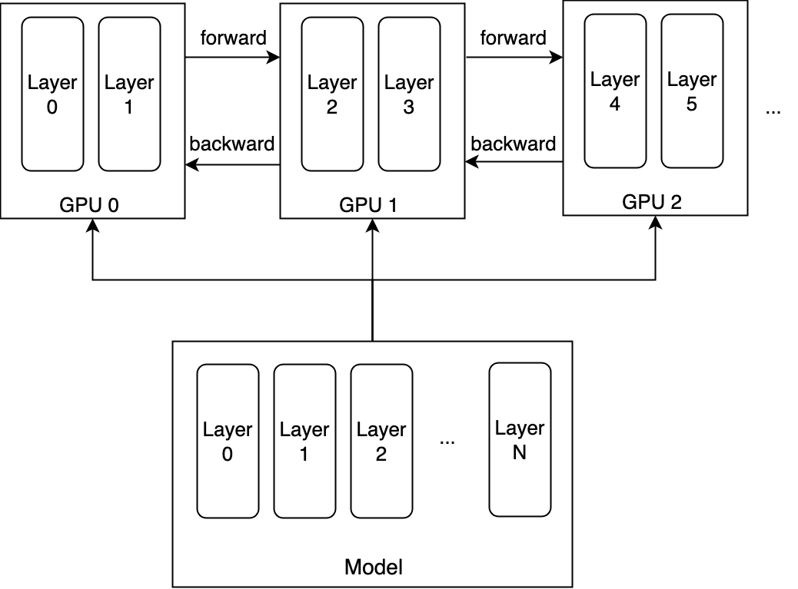

Figure 22: Splitting model layers across devices

PP is particularly useful when dealing with very deep models, as it allows multiple devices to work concurrently, reducing idle time and improving training efficiency. To learn more about PP, refer to [40] [41].

**Tensor parallelism (TP):** In TP, operations within a single layer of the model are split across multiple devices. Each device handles a portion of the computations for that layer, and the outputs are combined before moving to the next layer. For example, in a large matrix multiplication operation, different parts of the matrix can be processed in parallel across multiple devices. This can be done using both column-wise and row-wise splitting. For more information, refer to [46].

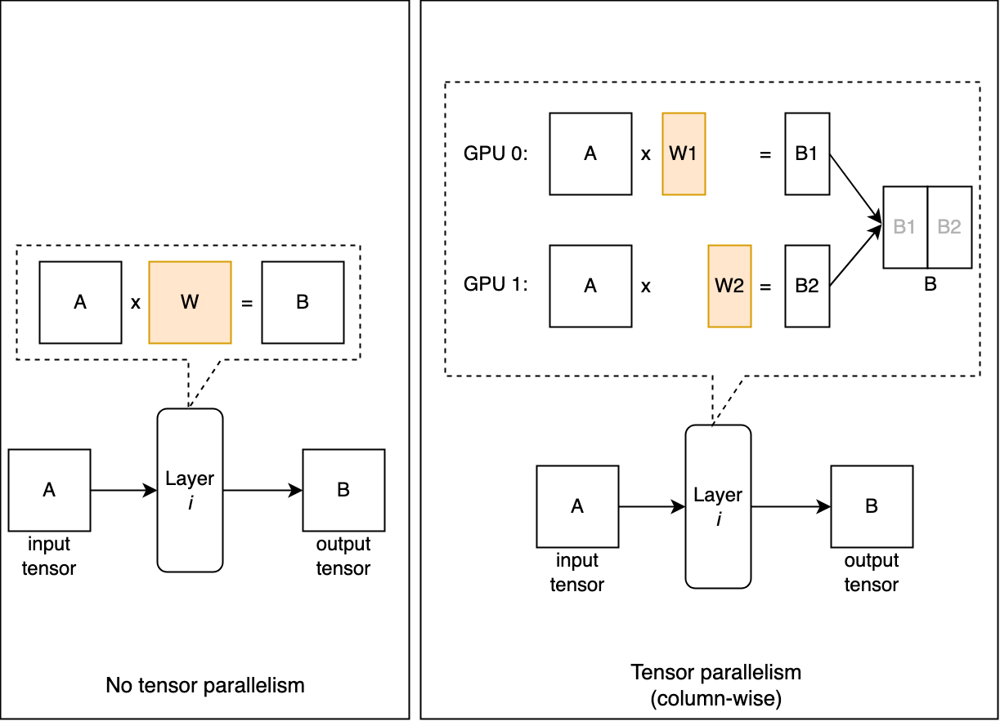

Figure 23: TP splitting tensor to chunks

TP is particularly useful when a single layer is too large to fit in memory. It helps in reducing memory usage by distributing the computational load across multiple devices. If you are interested to learn more about TP and its variants (e.g., sequence parallelism), refer to [47][48].

### Hybrid parallelism
Hybrid parallelism combines data and model parallelism to train large models more efficiently across multiple devices. This approach reduces memory usage by distributing both the model and data across devices. It also enables scaling to a larger number of devices, making it possible to train very large models that traditional parallelism methods cannot handle.

In addition to hybrid parallelism, techniques like **ZeRO** (Zero Redundancy Optimizer) [49] from Microsoft and **FSDP** (Fully Sharded Data Parallel) [50] from Meta further optimize resource utilization and communication efficiency. These methods reduce redundancy in memory and computation across devices, enabling more efficient training of massive models.

The techniques discussed in this section are essential components of modern ML system design and are widely used in practice. By combining parallelism techniques such as FSDP, memory-saving methods such as gradient checkpointing, and optimizations such as AMP, we can efficiently scale the training of large, complex models. A solid understanding of these techniques, and knowing when to apply them, is critical for building scalable and efficient AI systems. While this overview only touches on the basics, it is not the central focus of this book. For those interested in a more detailed exploration of distributed training, refer to the provided references.

### Model sampling
After training a model, the next step is sampling, which involves generating new data or outputs from the trained generative model. Various sampling methods exist for different GenAI applications. For example, in LLMs, methods such as greedy search, beam search [51], and top-k sampling [52] each have their strengths and weaknesses. Beam search, for instance, tends to produce coherent and relevant text, but it may limit diversity.

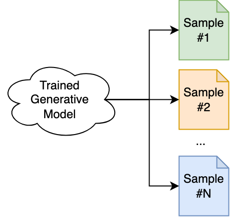

Figure 24: Sampling new data from a trained model

In an interview, it is crucial to discuss various sampling methods in depth, their pros and cons, and to choose the one that suits the system you are designing.

## Talking points

- **Model architectures:** What are the plausible model architectures for the chosen ML algorithm? What are the pros and cons of each? What are the specific layers in an architecture and why?
- **Training methodology:** What is the training methodology? How does the training process work (e.g., diffusion process, adversarial training)?
- **Training data:** Where is the training data sourced from? How large is the dataset? Do you use different data for various training stages (e.g., pretraining vs finetuning)?
- **ML objectives:** What are the plausible ML objectives for the task? What are the pros and cons of each objective, and how do they impact model performance?
- **Loss functions:** What is the loss function that aligns with the chosen ML objective? Do you use a single loss function or multiple ones? If multiple, how do you combine them to optimize the training process? What is the purpose of each loss function?
- **Training challenges and mitigations:** What are typical training challenges specific to the chosen ML algorithm? How can these challenges be mitigated to ensure effective training?
- **Training efficiency:** What are the main techniques to improve training efficiency? How does distributed training work, and what benefits does it bring? How does AMP enhance training speed and efficiency? How does data, tensor, and pipeline parallelism work?
- **Sampling:** How do different sampling methods (e.g., top-k, top-p) work? What are the pros and cons of each? How does the sampling process work? How do they affect the quality and creativity of the model's output? What methods can you use to make the sampling process faster without compromising quality?

---

## Evaluation

After developing a model, the next critical step is evaluation. This involves using various metrics to assess the performance of the ML model. In this section, we will explore two evaluation methods: offline and online evaluation.

### Offline Evaluation

Offline evaluation is the process of assessing the performance of a model or system using pre-collected data without deploying it in a real-time environment. This approach is critical to ensure the model is effective before it is used by the users.

Offline evaluation differs between discriminative and generative models. The goal of discriminative models is to make predictions on an evaluation set; the evaluation compares those predictions to the ground truth. Traditional metrics such as accuracy, precision, and recall are used to quantify how well the model performs based on these comparisons. Table 2 lists common metrics for different discriminative tasks, which are thoroughly explored in [1].

**Table 2: Popular metrics in discriminative tasks**

| Task | Metrics |
|------|---------|
| Classification | Precision, Recall, F1 score, Accuracy, Confusion matrix |
| Regression | MSE, MAE, RMSE |
| Ranking | Precision@k, Recall@k, MRR, mAP, nDCG |

In generative models, evaluation is more complex. Instead of comparing predictions to a fixed ground truth, these models generate new content, such as text or images. Assessing this content often requires subjective or human-in-the-loop methods to gauge how well it aligns with human expectations or benchmarks. Table 3 shows commonly used metrics for different generative tasks.

**Table 3: Popular metrics in generative tasks**

| Task | Metrics |
|------|---------|
| Text Generation | Perplexity, BLEU, METEOR, ROUGE, CIDEr |
| Image Generation | FID, IS, KID, SWD, PPL, LPIPS |
| Text-to-Video | FVD, CLIPScore, FID, LPIPS, KID |

In interviews, it's essential to assess the generated content from multiple angles. For example, in a text-to-image generation model, it's important to ensure the generated image is both high-quality and that it aligns with the given text prompt. Similarly, in a chatbot, the model's capability should be measured across different tasks such as mathematics, common-sense reasoning, and code generation. Throughout this book, we take a deep dive into the offline evaluation of various GenAI applications and explore most metrics listed in Table 3.

### Online Evaluation

The online evaluation assesses how the model performs in production (i.e., after deployment). Different metrics aligned with business objectives are used to evaluate the model's impact.

In practice, companies typically monitor multiple online metrics. During an interview, you should focus on selecting the most critical ones to gauge the system's impact. Unlike offline metrics, choosing online metrics is more subjective and often involves input from product owners and stakeholders. This step helps the interviewer assess your business sense. It is beneficial to articulate clearly your reasoning and thought process when selecting specific metrics. Table 4 lists some metrics commonly used in online evaluation.

**Table 4: Common metrics for online evaluation**

| Metric | Description |
|--------|-------------|
| Click-Through Rate (CTR) | Percentage of users who click on content or suggestions. |
| Conversion Rate | Percentage of users who complete a desired action (e.g., purchase, subscription) after interacting with the system. |
| Latency (Inference time) | Time taken by the model to generate content. |
| Engagement Rate | Measure of user interaction, such as time spent engaging with the system. |
| Revenue Per User | Average revenue generated per user. |
| Churn Rate | Percentage of users who stop using the system over a given period. |
| User Satisfaction | Direct feedback from users on their experience with AI-generated content. |
| User Retention | Percentage of users who continue to use the system over a specific period. |
| Completion Rate | Percentage of tasks (e.g., text completions, image generations) successfully completed by the model. |

### Talking points

- **Offline metrics:** Which offline metrics best evaluate the quality and accuracy of the generative model? How do these metrics measure the diversity, realism, and coherence of generated outputs?
- **Online metrics:** Which metrics are crucial for assessing the effectiveness of the generative model in a live production environment? How do these metrics align with the business goals, such as enhancing user creativity, boosting engagement, or driving product innovation?
- **Bias:** Generative models may unintentionally reflect societal biases in relation to sensitive attributes such as gender or race. How can you evaluate the model's bias?
- **Robustness and security:** How resilient is the generative model to adversarial attacks such as intentionally misleading inputs designed to exploit model weaknesses?
- **Human evaluation:** For generative models, especially in creative fields (e.g., text generation, image synthesis), human feedback is vital. How can human reviewers complement automatic evaluation? What methods (surveys, A/B testing, expert reviews) will best assess the model's performance? How can you mitigate the effects of subjectivity among different reviewers?

---

## Overall ML System Design

The next step of the framework is to propose an overall design for the GenAI system. These systems involve more than just training a model; they require multiple pipelines and components working together seamlessly. For instance, in a chatbot, beyond the core model, other components are needed to ensure safety, for example, filtering out harmful content. Similarly, for a video generation system, additional models may be needed to upscale video resolution to the desired quality. At this stage, it's crucial to integrate all components essential for the system to function as intended. We will explore several components commonly used along with the generative model throughout this book.

### Talking points

- **System components:** What are the different components of the system? What are the roles of each component—such as the core model, preprocessing, content filtering, post-processing, and any necessary upscaling or quality enhancement models?
- **Safety mechanisms:** How are safety and content moderation incorporated into the system? For instance, how does the system ensure that generated content is safe and appropriate for users? Describe components such as NSFW filters and harmful.
- **User feedback and continuous learning:** How does the system incorporate user feedback to continuously improve model performance? Discuss the feedback loop mechanisms that allow for finetuning the model. What systems are in place for retraining models with updated data to improve accuracy and relevance over time?
- **Scalability:** How does the system scale as demand increases? What cloud or hardware resources are utilized, and how is resource allocation managed efficiently? How do components such as load balancers, distributed inference, and model parallelism contribute to system scalability?
- **Security considerations:** How does the system ensure user privacy, especially when dealing with sensitive data or generating personalized content? What security protocols are implemented to protect against adversarial attacks, model tampering, or data leakage?
- **Bias:** Generative models may unintentionally reflect societal biases with respect to sensitive attributes like gender or race. Discuss strategies such as bias-detection algorithms, fairness auditing, and filtering of biased outputs. Additionally, how would you address ethical concerns if users attempt to misuse the generative model to produce harmful, biased, or inappropriate content?
- **Robustness and security:** How resilient is the generative model to adversarial attacks, such as intentionally misleading inputs designed to exploit model weaknesses? For example, can attackers generate harmful or nonsensical outputs? In production, how can we ensure that the model isn't being manipulated for malicious purposes, such as creating deepfakes, misinformation, or inappropriate content?

---

## Deployment and Monitoring

The final step is to deploy it to production and serve millions of users. Once the system is deployed, it can fail for many reasons. Monitoring refers to the task of tracking, measuring, and logging different metrics to detect system failures when they occur, so they can be fixed as quickly as possible. However, since this topic is broad and not specific to GenAI or any particular task, we won't go into detail in this book. We encourage readers to refer to [53] or the "ML System Design Interview" book [1] for a deeper exploration.

---

## Summary

In this chapter, we provided an overview of GenAI and introduced a framework for approaching a GenAI system design interview. While some details are specific to GenAI, many concepts apply broadly across AI system design. We focus on aspects unique to GenAI, avoiding general topics common to all AI systems such as deployment, infrastructure, and monitoring.

Finally, not every engineer is expected to be an expert in all areas of the GenAI life cycle. Different roles and companies may emphasize various aspects, such as infrastructure, monitoring, or LLM development. This framework helps candidates to understand the expectations and adjust their answers accordingly based on the interview's focus.

Now that you understand these fundamentals, we're ready to tackle some of the most common GenAI system design interview questions.

---

## References

- [1] Machine Learning System Design Interview. https://www.aliaminian.com/books.
- [2] Support Vector Machines. https://scikit-learn.org/stable/modules/svm.html.
- [3] Bayes' theorem. https://en.wikipedia.org/wiki/Bayes%27_theorem.
- [4] Gaussian mixture models. https://scikit-learn.org/1.5/modules/mixture.html.
- [5] Hidden Markov model. https://en.wikipedia.org/wiki/Hidden_Markov_model.
- [6] Boltzmann machine. https://en.wikipedia.org/wiki/Boltzmann_machine.
- [7] OpenAI's ChatGPT. https://openai.com/index/chatgpt/.
- [8] Economic Potential of Generative AI. https://www.mckinsey.com/capabilities/mckinsey-digital/our-insights/the-economic-potential-of-generative-ai-the-next-productivity-frontier.
- [9] The Llama 3 Herd of Models. https://arxiv.org/abs/2407.21783.
- [10] Flamingo: a Visual Language Model for Few-Shot Learning. https://arxiv.org/abs/2204.14198.
- [11] PaLM: Scaling Language Modeling with Pathways. https://arxiv.org/abs/2204.02311.
- [12] Language Models are Few-Shot Learners. https://arxiv.org/abs/2005.14165.
- [13] Photorealistic Text-to-Image Diffusion Models with Deep Language Understanding. https://arxiv.org/abs/2205.11487.
- [14] PaLM2 Technical Report. https://arxiv.org/abs/2305.10403.
- [15] H100 Tensor Core GPU. https://www.nvidia.com/en-us/data-center/h100/.
- [16] GPT-4 training cost. www.wired.com/story/openai-ceo-sam-altman-the-age-of-giant-ai-models-is-already-over/.
- [17] Scaling Laws for Neural Language Models. https://arxiv.org/abs/2001.08361.
- [18] Training Compute-Optimal Large Language Models. https://arxiv.org/abs/2203.15556.
- [19] Introducing OpenAI o1. https://openai.com/index/introducing-openai-o1-preview/.
- [20] Large Language Monkeys: Scaling Inference Compute with Repeated Sampling. https://arxiv.org/abs/2407.21787.
- [21] ETL. https://aws.amazon.com/what-is/etl/.
- [22] Tecton. https://www.tecton.ai/feature-store/.
- [23] Amazon SageMaker. https://aws.amazon.com/sagemaker/.
- [24] ML System Design Interview. https://www.amazon.com/gp/product/1736049127/.
- [25] Comprehensive Exploration of Synthetic Data Generation: A Survey. https://arxiv.org/abs/2401.02524.
- [26] HDFS Architecture Guide. https://hadoop.apache.org/docs/r1.2.1/hdfs_design.html.
- [27] Amazon S3. https://aws.amazon.com/s3/.
- [28] Apache Parquet. https://parquet.apache.org/.
- [29] Apache ORC. https://orc.apache.org/docs/.
- [30] Apache Lucene. https://lucene.apache.org/.
- [31] Elasticsearch. https://www.elastic.co/elasticsearch.
- [32] Attention Is All You Need. https://arxiv.org/abs/1706.03762.
- [33] BERT: Pre-training of Deep Bidirectional Transformers for Language Understanding. https://arxiv.org/abs/1810.04805.
- [34] An Image is Worth 16x16 Words: Transformers for Image Recognition at Scale. https://arxiv.org/abs/2010.11929.
- [35] Learning Transferable Visual Models From Natural Language Supervision. https://arxiv.org/abs/2103.00020.
- [36] Zero-Shot Text-to-Image Generation. https://arxiv.org/abs/2102.12092.
- [37] Neural Machine Translation by Jointly Learning to Align and Translate. https://arxiv.org/abs/1409.0473.
- [38] Common Crawl. https://commoncrawl.org/.
- [39] Data Parallelism. https://en.wikipedia.org/wiki/Data_parallelism.
- [40] Model Parallelism. https://huggingface.co/docs/transformers/v4.15.0/en/parallelism.
- [41] Pipeline Parallelism. https://pytorch.org/docs/stable/distributed.pipelining.html.
- [42] Mixed Precision Training. https://arxiv.org/abs/1710.03740.
- [43] High-Resolution Image Synthesis with Latent Diffusion Models. https://arxiv.org/abs/2112.10752.
- [44] Training Deep Nets with Sublinear Memory Cost. https://arxiv.org/abs/1604.06174.
- [45] Automatic Mixed Precision. https://pytorch.org/tutorials/recipes/recipes/amp_recipe.html.
- [46] Model parallelism. https://huggingface.co/docs/transformers/v4.17.0/en/parallelism.
- [47] Paradigms of Parallelism. https://colossalai.org/docs/concepts/paradigms_of_parallelism/.
- [48] Tensor Parallelism tutorial. https://pytorch.org/tutorials/intermediate/TP_tutorial.html.
- [49] ZeRO: Memory Optimizations Toward Training Trillion Parameter Models. https://arxiv.org/abs/1910.02054.
- [50] Introducing PyTorch Fully Sharded Data Parallel (FSDP) API. https://pytorch.org/blog/introducing-pytorch-fully-sharded-data-parallel-api/.
- [51] Beam search. https://en.wikipedia.org/wiki/Beam_search.
- [52] Top-k sampling. https://docs.cohere.com/docs/controlling-generation-with-top-k-top-p.
- [53] Model monitoring for ML in production. https://www.evidentlyai.com/ml-in-production/model-monitoring.