# 02 Gmail Smart Compose
## Introduction
# Gmail Smart Compose — ML System Design

Gmail's Smart Compose feature [1] assists users by suggesting the next few words as they write an email. This chapter explores this feature and examines the Transformer architecture that powers most generative systems.
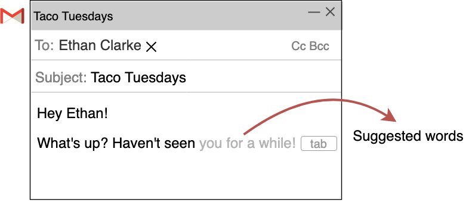

Figure 1: Gmail's Smart Compose feature

---

## Clarifying Requirements

Here is a typical interaction between a candidate and an interviewer:

**Candidate:** Different users might have different writing styles. Is the system expected to make personalized suggestions?  
**Interviewer:** For simplicity, let's not include personalization.

**Candidate:** Should the system suggest the next few words only when it is confident in its prediction?  
**Interviewer:** Yes.

**Candidate:** The email dataset must be sufficiently large to train a model. Do we know the approximate size of the data?  
**Interviewer:** Assume our dataset consists of around one billion email messages.

**Candidate:** There are different parts of data to utilize when making suggestions. For example, a user's past emails or the subject of the current email. To keep it simple, can I only utilize the email's body as the context?  
**Interviewer:** Good point. In practice, though, we use more than what the user has typed in the current email. Let's start by using the body of the email. If we have more time, we can expand the context to include other relevant information.

**Candidate:** What languages should the system support?  
**Interviewer:** Let's begin with English.

**Candidate:** Do we need to ensure the system is not biased?  
**Interviewer:** This is an important requirement for this system. The system should not make biased assumptions in providing its suggestions.

**Candidate:** How many active users does Gmail have? Is the computing cost a concern in this feature?  
**Interviewer:** Gmail has about 1.8 billion users, and a single user can send as many as 500 emails in a day. We do care about the computing costs, but let's focus on developing the system first. We can optimize for efficiency in future iterations.

**Candidate:** Should the system make real-time suggestions?  
**Interviewer:** Yes. The expected latency should be imperceptible; something around 100 milliseconds should be fine.

---

## Frame the Problem as an ML Task

In this section, we frame the Smart Compose feature as an ML task. This requires us to understand the system's inputs and outputs and choose a suitable ML approach for learning the task.

### Specifying the system's input and output

The input to the model is a sequence of words typed by the user. The output is a continuation of that sequence. The model generates the words that the user is likely to type next.

Figure 2: Input and output of the Smart Compose system

### Choosing a suitable ML approach

Smart Compose generates textual content, so we categorize it as a text generation task. Various ML architectures are designed to process sequential data, which is essential for text generation. Two popular architectures are recurrent neural networks (RNNs) [2] and Transformers [3].

Transformers provide several advantages over RNNs, with two main benefits being:

- **Parallelism:** In an RNN, computations from one time step are carried forward and used in the next, creating a time-dependent chain of operations. Transformers, on the other hand, can process all input tokens simultaneously through their self-attention mechanism.
- **Better handling of long sequences:** Transformers use self-attention mechanisms to focus on any part of a sequence, regardless of distance. In contrast, RNNs struggle with long-range dependencies because of their sequential structure and the vanishing gradient problem.

Due to these advantages, Transformers have shown outstanding performance in text generation tasks and are, thus, used in most generative systems nowadays. Therefore, we chose Transformers to build the Smart Compose feature.

| Feature | RNN (GRU [4], LSTM [5]) | Transformer |
|---|---|---|
| Architecture | Simple | Complex |
| Training efficiency | Inefficient due to sequential processing | Efficient due to parallel processing |
| Effectiveness | Low as it struggles with long sequences | High as it handles long sequences |
| Scalability | Limited scalability | Highly scalable |
| Applications | Simple tasks such as time series modeling | Complex tasks such as language completion or translation |

*Table 1: Comparison of RNN and Transformer architectures*

While Transformers are more parallelizable due to their lack of strict sequential dependencies, their self-attention mechanism has a computational complexity of O(n²), where n is the sequence length. This complexity arises because the self-attention mechanism requires the calculation of attention scores between every pair of tokens in the sequence. Various techniques are introduced to reduce the complexity of attention. To learn more, refer to Group Attention [6] and Flash Attention [7].

---

## Data Preparation

During the data preparation step, we convert raw data into the format expected by the ML model. First, let's briefly review the available data.

Two sources of data are available for training our model: general data and email data. General data includes publicly available text from sources such as books, websites, and social media posts. This data is important for training language models because it contains diverse vocabulary, syntax, and contexts.

Figure 3: Example of general data from Shakespeare

The email data, as specified in the requirements, consists of one billion email messages. This data is crucial for the model to learn email writing styles and common phrases used in emails. Table 2 shows a simplified example of email data. In practice, more metadata is stored for each email message.

| Email ID | Sender | Recipient | Subject | Body |
|---|---|---|---|---|
| 4953 | john@gmail.com | mike@yahoo.com | Catchup? | Hey Mike, let's catch up this Sat. … |
| 9356 | kkart@gmail.com | cs382@stanford.edu | Project Deadline | Hi TA, I hope you are well. I am writing to you to … |

*Table 2: Example of email data*

Raw text in both general data and email data is often noisy and inconsistent, which can degrade the model performance. Additionally, ML models require data to be in a numerical format. For these reasons, raw text has to be prepared using the following two key steps:

1. Text cleaning and normalization
2. Text tokenization and token indexing

### Text cleaning and normalization

#### Text cleaning

Text cleaning removes unnecessary or irrelevant information. Common methods include:

- **Remove non-English text:** Use language identification [8] methods such as [9] to identify and remove non-English text from general and email data.
- **Remove confidential information:** Emails may contain confidential information such as phone and credit card numbers. These details must be removed to prevent the model from learning or exposing them later. We replace personal names, URLs, email addresses, and phone numbers with placeholder characters. For example, replace "john@gmail.com" with "##@gmail.com."
- **Remove irrelevant characters or symbols:** Remove unnecessary or irrelevant characters and symbols that do not contribute to the meaning. For example, symbols such as "©," "™," or emojis are removed, as they do not typically change the meaning of text.
- **Remove duplicated data:** Duplicate data refers to identical text from different sources that appear multiple times in the dataset. We remove duplicates to prevent the model from becoming biased and skewing the model's learning process.

#### Text normalization

Text normalization transforms text into a consistent format. For example, it converts different ways of writing a phone number—such as "(123) 456-7890," "123.456.7890," and "123-456-7890"—into a standard format, for example, "1234567890." Text normalization ensures consistency and reduces complexity in text data.

Next, we convert the raw text into a sequence of numbers through text tokenization and token indexing.

### Text tokenization and token indexing

Text tokenization followed by token indexing converts the raw text into a format the Transformer model expects: a sequence of numbers.
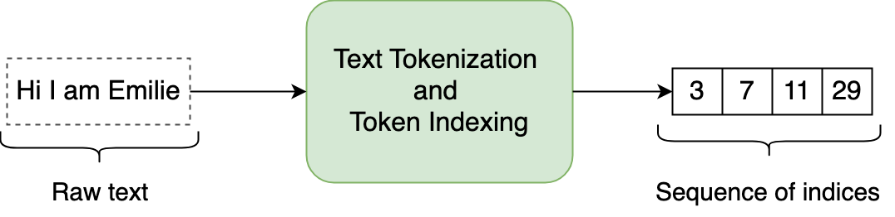

Figure 4: Converting raw text to a sequence of numbers

Let's examine each step in more detail.

#### Text tokenization

Text tokenization is the process of splitting text into smaller units called tokens. Figure 5 shows how OpenAI's GPT-4 tokenizes the sentence "Let's go to NYC".[^1]

Figure 5: Example of GPT-4 tokenization

Tokenization can be performed at different levels. For example, "Hello world" can be split into ["Hello", "world"] or ["H", "e", "l", "l", "o", " ", "w", "o", "r", "l", "d"]. Generally, tokenization algorithms are divided into three categories:

- Character-level tokenization
- Word-level tokenization
- Subword-level tokenization

Understanding each tokenization category and its pros and cons is crucial in most ML interviews. Let's delve into them.

#### Character-level tokenization

Character-level tokenization breaks text down into a set of characters. It is simple to implement, but difficult for the model to learn meaningful representations for each token. For example, it's harder to learn a meaningful representation for the letter "g" than for the word "go," because "go" has a clear meaning, whereas "g" does not. Because of this, character-level tokenization often results in a loss of performance.

Figure 6: Example of character-level tokenization

#### Word-level tokenization

Word-level tokenization breaks text into individual words. While there are different algorithms for word-level tokenization, a simple algorithm is to split the text using its whitespaces.

Figure 7: Example of word-level tokenization

The advantage of word-level tokenization is that it is simpler for the model to learn meaningful representations for each token. However, the main disadvantage of word-level tokenization is that it typically leads to a very large vocabulary size. For example, Transformer-XL [10] uses a word-level tokenizer, resulting in a vocabulary of 267,735 tokens. A large vocabulary size is problematic because the model has to learn representations for hundreds of thousands of tokens. This makes the training time-consuming and, therefore, more costly to train than character-level tokenization.

Let's examine subword-level tokenization which offers a balance between word-level and character-level tokenization.

#### Subword-level tokenization

Subword-level tokenization splits text into smaller units called subwords. It is based on the principle that a frequently used word should not be split into smaller subwords, but a rare word should be split into smaller meaningful subwords. For example, "unhappily" might be considered a rare word and thus be split into "unhappy" and "ly." Both "unhappy" and "ly" are more frequently used in text data, making it easier for the model to learn a meaningful representation for each.

Figure 8: Example of subword-level tokenization

While subword-level tokenization can be complex to implement, it has several benefits. First, it leads to a manageable vocabulary size, thus reducing the cost of the model learning representations for each subword. Second, subword-level tokenization allows the model to represent unfamiliar words by decomposing them into known subwords.

Table 3 below compares the characteristics of the three tokenization categories.

| Characteristics | Character-level | Word-level | Subword-level |
|---|---|---|---|
| Granularity | Individual characters | Individual words | Subwords |
| Vocabulary size | Small | Large | Moderate |
| Algorithm complexity | Simple | Simple | Complex |
| Handling unseen words | Decomposes unseen words into characters | Cannot easily handle unseen words | Decomposes unseen words into known subwords |
| Vocabulary size | ~100 | ~300,000+ | ~50,000–150,000 |
| Performance | Poor performance | High performance but not practical | High performance and practical |

*Table 3: Comparison between different tokenization categories*

#### Which tokenization is suitable for the Smart Compose feature?

Most state-of-the-art language models use subword-level tokenization algorithms such as Byte-Pair Encoding (BPE) [11] and SentencePiece [12]. These algorithms are more efficient and can effectively handle multiple languages. For example, OpenAI's GPT-4 uses a variant of BPE [13], and Google's Gemini uses SentencePiece [14].

Given the effectiveness of subword-level tokenization, we use it as the text tokenizer for the Smart Compose feature. We rely on popular Python libraries such as Tiktoken [13] by OpenAI or SentencePiece [15] by Google to perform text tokenization. These libraries are implemented reliably and they support various tokenization algorithms.

In Chapter 3, we will dive into BPE and explore its algorithms. To learn more about subword-level tokenization algorithms, refer to [16].

#### Token indexing

Token indexing is the process of converting textual tokens into integer numbers.

To prepare for token indexing, the tokenization algorithm first builds a vocabulary—a collection of all unique tokens—from the training text data and then stores it in a table. Figure 9 shows examples of vocabularies for different tokenization categories. The order and ID values are chosen arbitrarily for demonstration purposes.
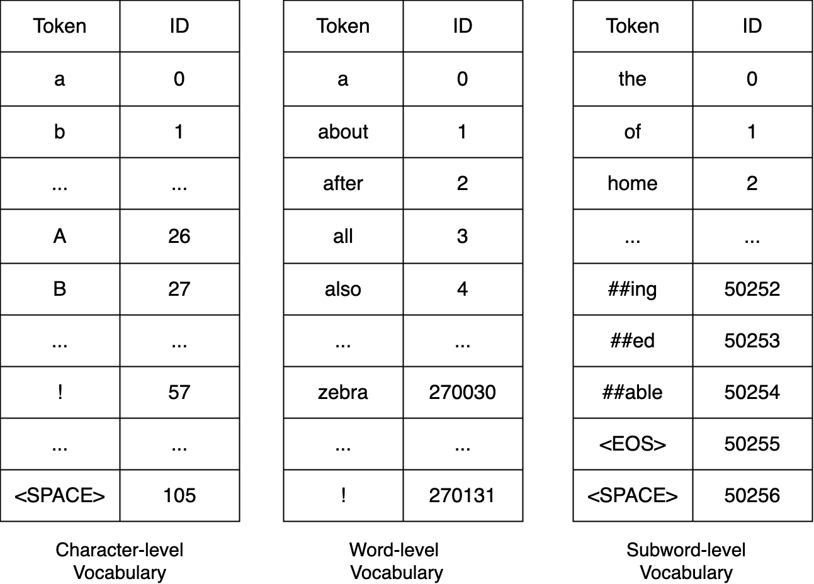

Figure 9: Examples of different vocabularies

Once the tokenization algorithm has built the vocabulary, we can convert any token into a number and any number back into a token. Figure 10 shows token indexing using the GPT-4 vocabulary [17].
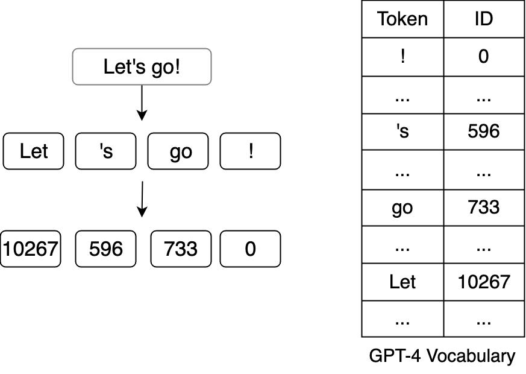

Figure 10: Example of token indexing

To summarize the data preparation step, we first clean and normalize the text data to ensure high-quality, consistent text in our training data. Next, we use a subword-level tokenization algorithm such as BPE to tokenize the text into textual tokens (subwords) and then replace each token with its numerical index. These steps ensure our training data is now represented in a numerical format that the ML model can use.

---

## Model Development

The Smart Compose feature is a text generation task in which a Transformer model predicts how email sentences are likely to be completed. In this section, we explore the details of the Transformer architecture, training strategies, and sampling methods to develop the text generation model.

### Architecture

The Transformer architecture, introduced in the paper "Attention Is All You Need" [3], is designed to process sequences. This makes it ideal for tasks that require understanding a text and the relationships between its words. For example, in the Smart Compose feature, the model processes the sequence of words already entered by the user so it can suggest the next words.

Transformers have three primary variations:

- Encoder-only
- Decoder-only
- Encoder-decoder

Each variation has minor architectural differences that make them suitable for specific tasks. Let's briefly explore each variation and its applications.

#### Encoder-only

An encoder-only Transformer is used for tasks that require understanding the overall meaning of a text. It processes the input sequence as a whole and makes predictions about it. For instance, in a sentiment analysis task, an encoder-only Transformer predicts the sentiment of the input sentence.
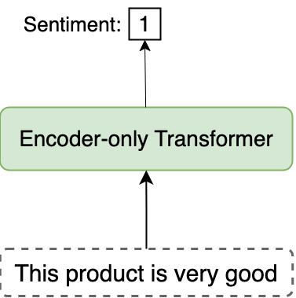

Figure 11: Encoder-only Transformer for sentiment analysis

Encoder-only Transformers are commonly used for tasks such as sentence classification and named entity recognition, which focus on understanding the input rather than generating new content. Google's BERT [18] is a well-known example of an encoder-only Transformer. However, these models are not typically used to generate new sequences. Decoder-only Transformers, on the other hand, are specifically designed for that purpose.

#### Decoder-only

A decoder-only Transformer processes the input sequence and generates a new sequence iteratively.
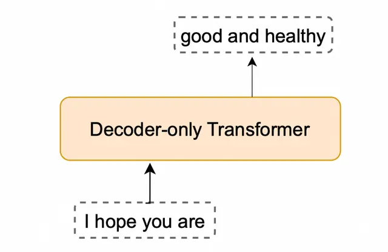

Figure 12: Decoder-only Transformer for text completion

Decoder-only Transformers are widely used in generative tasks including text generation, where the model generates a sequence one token at a time based on the previously generated tokens. Most large language models (LLMs), such as OpenAI's GPT-4 [19], Meta's LLaMA [20], and Google's Gemini [14], are based on a decoder-only Transformer.

#### Encoder-decoder

The encoder-decoder architecture utilizes both encoder-only and decoder-only Transformers. An encoder component processes the input sequence and a decoder uses that processed information to generate the output sequence.
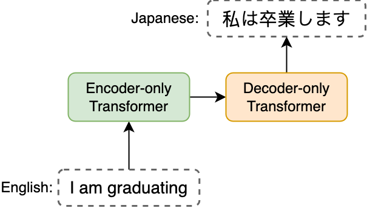

Figure 13: Encoder-decoder Transformer used for language translation

An encoder-decoder Transformer is particularly suited for tasks where the output is a transformation of the input. For example, in a language translation task, the input sentence in one language is transformed into an equivalent sentence in another language. We'll examine this architecture in Chapter 3.

Figure 14 below shows commonly used models that employ different variations of Transformers.

Figure 14: Popular models for each variation of Transformers

#### Which Transformer variation is suitable for the Smart Compose feature?

The choice between encoder-only, decoder-only, and encoder-decoder Transformer models depends on whether the nature of the task is generation or understanding. Smart Compose is a text generation task that aims to complete a partially written text. Therefore, a decoder-only Transformer is ideal for this task due to its ability to generate text based on a given sequence.

ML system design interviews typically focus on high-level concepts and component interactions rather than architectural details. We'll provide a brief overview of the Transformer architecture without going too deep. For a deeper understanding of Transformer architectures, refer to [21] and [22].

A decoder-only Transformer consists of the following components:

- Text embedding
- Positional encoding
- Transformer
- Prediction head

#### Text embedding

The text embedding component converts each token ID into a fixed-length vector called an "embedding." Embeddings are typically stored in a table, as shown in Figure 15, and learned during the training process.
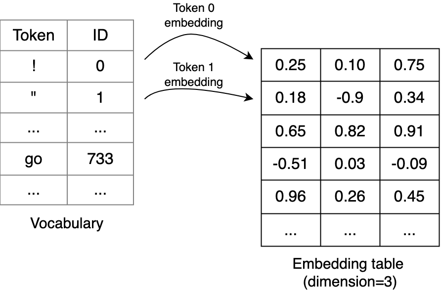

Figure 15: Embedding table representing tokens

The text embedding is crucial in a decoder-only Transformer. Let's understand why.

During data preparation, we tokenized the text and converted tokens to IDs. However, there are two significant limitations in how the text is represented:

- **Sparsity:** The vocabulary typically includes tens of thousands of token IDs. Representing these IDs using one-hot encoding results in sparse, high-dimensional data, which is inefficient.
- **Lack of semantic information:** Token IDs are arbitrary and do not capture any relationships between words. For example, the words "happy" and "joyful" might be close in meaning, but their token IDs may not reflect this similarity.

The text embedding component addresses both of these limitations by converting token IDs into learned embeddings. Since the embeddings are dense vectors in a lower-dimensional space, sparsity is no longer a concern.

In addition, since the embeddings are learned during model training, they capture semantic meanings. For example, the embeddings for "happy" and "joyful" will be closer together in the embedding space than those for "happy" and "sad," as shown in Figure 16.
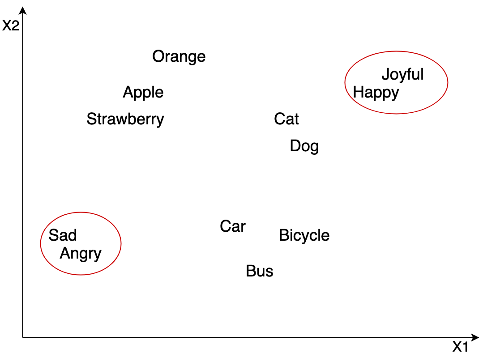

Figure 16: Word embedding similarities (visualized in 2D for simplicity)

#### Positional encoding

Transformers do not inherently consider the order of input tokens. If we look at the formula for attention,

$$a_{m,n} = \frac{\exp(q_m k_n^{\top} / \sqrt{d})}{\sum_{j=1}^{N} \exp(q_m k_j^{\top} / \sqrt{d})}$$

we see that it is permutation-invariant, meaning the attention mechanism doesn't account for token positions in the sequence. For instance, the Transformer cannot differentiate between "initialize the variable, then use it" and "use the variable, then initialize it." This impacts the model's ability to understand or generate coherent text.

To overcome this limitation, positional encoding provides the Transformer with position information for each token in the input sequence. Without positional encoding, the model treats the input sequence as a bag of words, which is problematic. With positional encoding, each token's position is encoded using a positional encoding function,

$$p_i = f(i)$$

where f(·) is the positional encoding function and i is the position of the token. This allows the model to distinguish between "use the variable, then initialize it" and "initialize the variable, then use it."
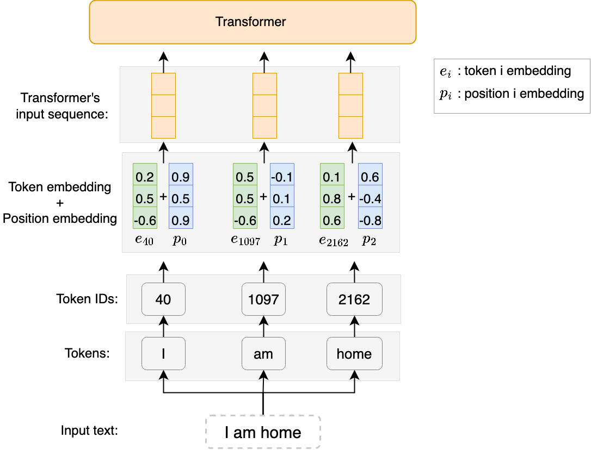

Figure 17: Adding positional information to the Transformer's input sequence

Positional encoding can be achieved through two common methods:

- Fixed positional encoding
- Learned positional encoding

##### Fixed positional encoding

This method uses a fixed function to map a position (an integer) to a fixed-size vector. The original Transformer paper introduced the sine-cosine function at different frequencies as its positional encoding function.

Figure 18: Sine-cosine positional encoding formula

Figure 19 illustrates an example of sine-cosine positional encoding, showing vector representations for four different positions. For simplicity, this example uses a vector dimension of four. In practice, this dimensionality typically matches that of the token embeddings so they can be added together (see Figure 17).
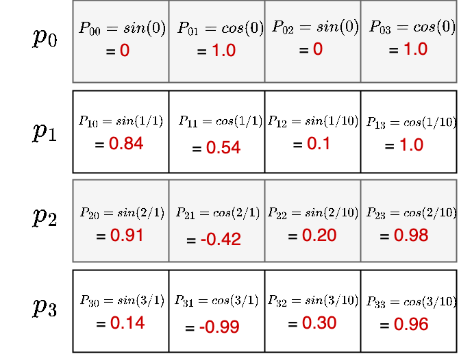

Figure 19: Example of sine-cosine positional encoding

Let's take a look at the pros and cons of fixed positional encoding.

**Pros:**
- **Efficiency:** Fixed encodings do not add extra trainable parameters to the model. This makes them computationally more efficient.
- **Support for long sequences:** Fixed methods can map any position into a representation. This flexibility allows the model to handle longer sequences beyond the model's training data.

**Cons:**
- **Predefined limits:** Some fixed encoding methods require a predefined maximum position, thus limiting their applicability to sequences below that maximum.
- **Suboptimal performance:** In certain tasks, fixed encodings may not capture the positional relationships as effectively as learned methods. This can lead to suboptimal performance.

##### Learned positional encoding

In this method, the positional representations are learned during the training process. Specifically, a weight matrix P ∈ R^(N×d) is initialized, where N is the maximum sequence length and d is the dimensionality of the embeddings. This matrix P is treated as a trainable parameter, and it is optimized alongside the model's other parameters.
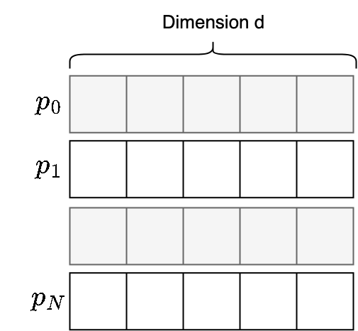

Figure 20: Trainable matrix representing positional encodings

Learned positional encoding has the following pros and cons.

**Pros:**
- **Optimal performance:** Since the embeddings are learned based on the training data, learned positional encoding can lead to optimal position representation for the specific task.

**Cons:**
- **Inefficiency:** Requires additional parameters to be learned during the training, which can increase the training time and computational cost.
- **Lack of generalization:** Learned embeddings may overfit to specific sequence lengths seen during training. If the model mainly sees sequences of a certain length during training, it may not effectively represent other positions. This affects the model's ability to generalize across diverse positions.

In summary, the choice between learned and fixed positional encodings depends on the constraints of the task, including the expected variability in sequence lengths. Some papers, including the original Transformer paper, employ fixed positional encoding due to its efficiency and better generalization. Following that, we employ fixed positional encoding, such as sine-cosine encoding, to train the Smart Compose feature.

#### Transformer

The Transformer component takes a sequence of embeddings as input and transforms them into an updated sequence of embeddings.
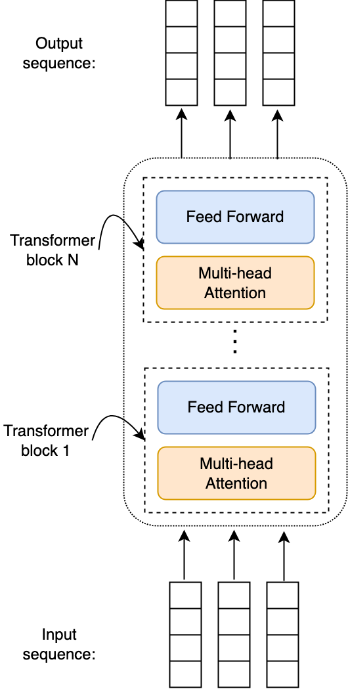

Figure 21: A simplified Transformer structure

The Transformer architecture consists of a stack of blocks. Each block contains the following:

- **Multi-head attention:** This layer updates each embedding by using the attention mechanism. The attention mechanism captures the relationships in the sequence by allowing each embedding to attend to its preceding embeddings. Due to the nature of its mechanism, multi-head attention is commonly known as self-attention, a term we'll use throughout the rest of this book.
- **Feed forward:** This layer applies two linear transformations, with a ReLU activation in between, to each embedding in the sequence independently.

Transformer architecture includes details such as residual connections, layer normalization, and dropout layers. For a deep understanding of these components, refer to the paper "Attention Is All You Need" [3] and [21].

#### Prediction head

The prediction head—the final component in a decoder-only Transformer—translates the Transformer's output into probabilities for every token in the vocabulary (Figure 22). These probabilities are used to choose the most likely next token.
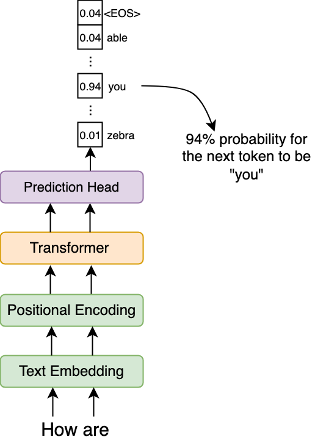

Figure 22: Prediction head output probabilities

---

### Training

Training adjusts the decoder-only Transformer's parameters using email data. Once the training process is complete, the model can suggest likely completions.

However, directly training the model on a task-specific dataset, such as email data, is not a good strategy. This direct training has several challenges:

- **Lack of large training data:** Task-specific datasets are usually limited in size. This limitation can hinder the model's ability to learn effectively.
- **Risk of overfitting:** When a model is trained on a task-specific dataset, it runs a high risk of overfitting. Overfitting occurs when a model memorizes the training data to the extent that it cannot generalize to unseen data.
- **Expensive and lengthy training:** Training a large model from scratch requires significant computational resources and time. This is because the model has to learn different aspects of language, which is a complex and resource-intensive process.

To address the above issues, a two-stage training strategy is commonly employed: pretraining, followed by finetuning. In the pretraining stage, the model is trained on a large amount of general data to learn the structure of the language. In the finetuning stage, the pretrained model is then finetuned on data specific to the task at hand (e.g., email completion).

This two-stage strategy harnesses a form of transfer learning, as the general knowledge gained during the pretraining stage is transferred to the finetuning stage. This transfer is beneficial because the model doesn't have to start from scratch when learning a new task. Instead, it adjusts its pretrained weights, which is more efficient.
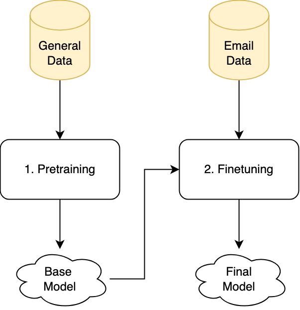

Figure 23: Two-stage training strategy

Let's take a closer look at each stage and examine the necessary training data, ML objectives, and loss functions for each.

#### 1. Pretraining

Pretraining involves training a model on a large volume of general text data. This data is usually diverse, covering a wide range of topics and language structures. The purpose of pretraining is to develop a model capable of understanding natural language, including syntax, common knowledge, and language structures.

##### Pretraining data

The pretraining data for this stage usually consists of a large volume of general text data from various sources on the web, such as web pages, books, and social media. For example, Common Crawl [23] is a publicly available dataset collected by crawling a large number of web pages on the Internet. It contains petabytes of data that have been regularly collected since 2008.

##### ML objective and loss function

An ML objective refers to the formalized goal that a training process aims to achieve. In the case of text generation, the most commonly used ML objective is "next-token prediction." In this ML objective, the model is tasked with predicting the next token given a sequence of previous tokens. For example, in the sentence "I hope you are __," the model should predict a high probability for "well" as the next token.
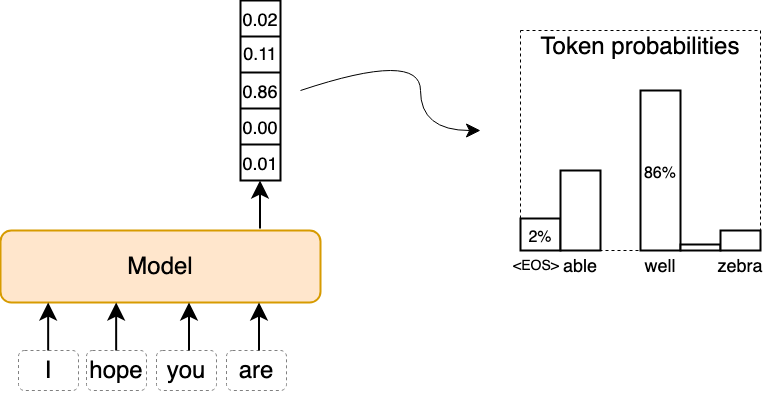

Figure 24: Probability distribution in next-token prediction

Next-token prediction is well suited for text generation tasks because, after the training process, the model can construct sentences incrementally. For example, given the input "I ordered food because I," the model might predict "was" as the next word. Subsequently, this process repeats with the new sequence "I ordered food because I was," leading to the next prediction, perhaps, "hungry." This iterative process continues until the model predicts "⟨EOS⟩," a special token that indicates the end of the sequence. Figure 25 shows the incremental process of generating text using next-token prediction.
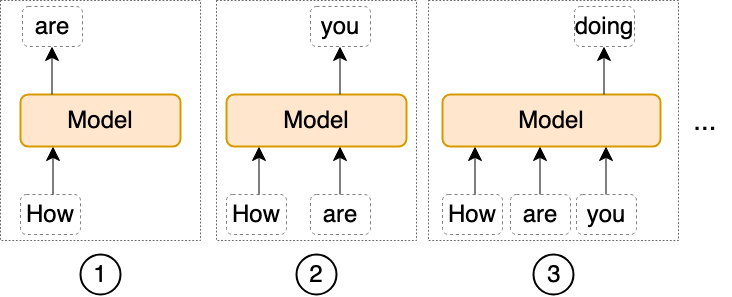

Figure 25: Incremental generation of text

To optimize the model for correctly predicting the next token, we define a loss function to guide the training process. Cross-entropy loss [24] is a commonly used loss function for the next-token prediction objective. This loss function measures the differences between the predicted probabilities and the correct token. This loss allows the optimizer to update the model's parameters to produce more accurate probabilities in the future.
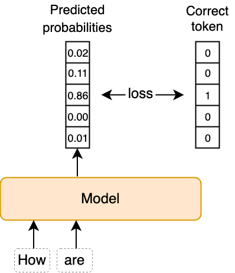

Figure 26: Loss calculation

In practice, the model processes all token lengths within a sequence in parallel. This allows it to compute the loss for each token position simultaneously. Parallelizing this step speeds up training by handling multiple tokens at once, instead of sequentially.
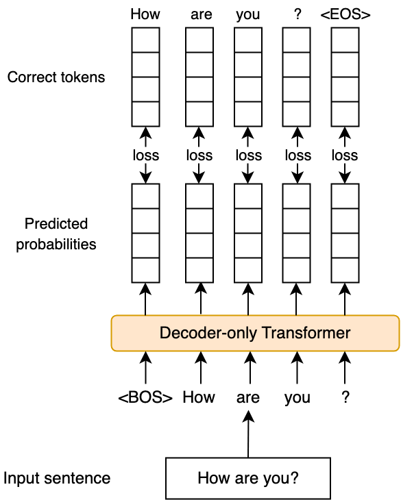

Figure 27: Parallelizing loss computations over different lengths

#### 2. Finetuning

Finetuning involves adapting the base model from the pretraining stage to a specific task such as email completion. This stage focuses on making the model proficient at a particular task by training it on a smaller, task-specific dataset. During finetuning, the model retains its language understanding from the pretraining stage but adapts to the nuances of the task.

##### Finetuning data

We use a dataset of approximately one billion email conversations, as specified in the requirements section. This data includes various email formats, both formal and informal tones, and specific vocabularies that are more common in email conversations.

##### ML objective and loss function

In the finetuning stage, both the ML objective and loss function remain unchanged. The ML objective is next-token prediction, and the cross-entropy loss function guides the training process. The only difference from the pretraining stage is that the loss is calculated based on email data, focusing on predicting the next token in an email context.
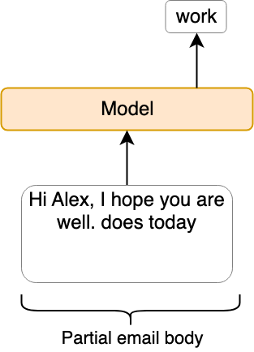

Figure 28: Example of email completion

However, relying on the email's body as the sole input is not very effective, because it is not always possible to predict the next token this way. Imagine a user who wants to reply to an email from John. When the user types "Dear," the model should, ideally, suggest "John." However, if that information is not provided as input, the model cannot predict "John" as the likely next token.

To address this limitation, we include more information in the input. For example, we can use the email's subject, the recipient, and previous emails, if available. This adds depth to the context and helps the model make more relevant predictions.
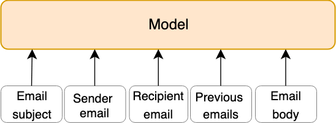

Figure 29: Providing more context as the input for improved model predictions

##### Combining various inputs

In traditional ML, the model's architecture typically depends on the type of data it processes. This requires customized preprocessing and feature engineering for different data types like text, images, or tables.

In the era of GenAI, however, the model architecture is often decoupled from the input structure. This decoupling increases flexibility, allowing the same model architecture to handle diverse inputs with a unified architecture, thus streamlining development and enhancing the versatility of GenAI systems. This decoupling is done through techniques like prompt engineering [25]. In Chapter 6, we examine prompt engineering in detail.
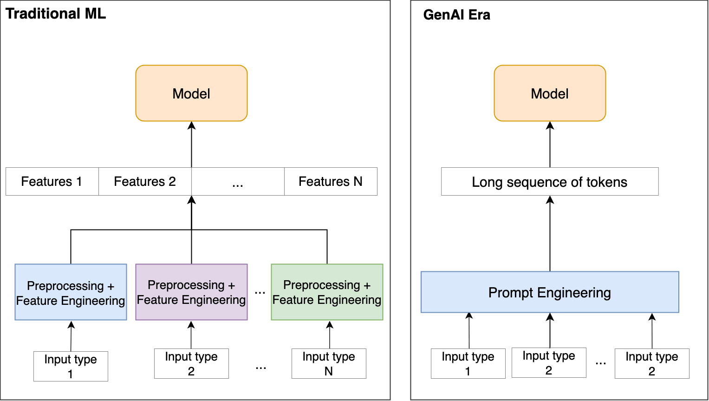

Figure 30: Combining various inputs in traditional ML vs. GenAI era

To combine various inputs in Gmail Smart Compose, as shown in Figure 31, we combine multiple text inputs into one sequence with tags using a prompt template. We don't need to worry about missing optional fields if our training set includes such examples. The model handles various input combinations regardless of whether they include all details or only partial information. This flexibility demonstrates the model's robust design, allowing it to generate contextually appropriate outputs even with incomplete inputs. By including diverse scenarios in the training data, we ensure the model generalizes well across different input structures and still produces reliable results.
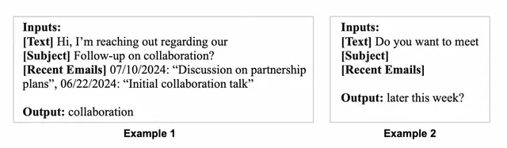

Figure 31: Examples of combining text inputs

#### The benefits of two-stage training

The two-stage training strategy has several benefits, including:

- **Adaptability:** The same base model obtained from the pretraining stage can be adapted for different tasks.
- **Improved generalization:** Pretraining on large and diverse text data enables the model to develop a broad understanding of language. This helps to generalize better to various tasks.
- **Fast finetuning:** The model learns general knowledge during the pretraining stage. This makes the subsequent finetuning process faster.
- **Handling data scarcity:** For tasks where large datasets are unavailable, the knowledge gained during pretraining can compensate for this lack of data. This allows the model to perform well even with limited task-specific data.
- **Mitigating overfitting:** If we train a model from scratch on a smaller, task-specific dataset, there is a risk it will overfit. In two-stage training, pretraining acts as regularization. The model first learns to understand language broadly before focusing on the specifics of a particular task.
- **Resource optimization:** By separating the training process into two stages, we perform the computationally expensive pretraining once and can reuse the same model to adapt to different tasks. This reduces computational costs since we do not need to repeat the pretraining stage for each task.

---

### Sampling

Generative models are trained to capture the underlying distribution of the training data. Once trained, these models can generate new samples that are similar to the data they were trained on. Sampling is the process of using a trained generative model to generate new data.

In the context of Smart Compose, sampling involves generating a likely email completion given the user's partial email body and other relevant information. As Figure 32 shows, sampling is achieved by generating tokens one at a time. For example, when "Hi Alex, does today" is given to the model, the "work" token is selected as the next token based on the predicted probabilities. Next, "Hi Alex, does today work" is provided to the model as input, and the "for" token is chosen as the next token. This process continues until the model predicts the ⟨EOS⟩ token.
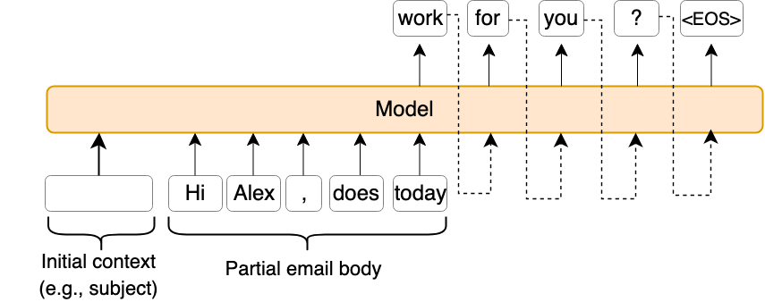

Figure 32: Sampling email completion token by token

There are primarily two types of strategies to generate new text in generative models: deterministic and stochastic. Let's have a look at each.

#### Deterministic

Deterministic methods generate text in a deterministic way, that is, without randomness or variability in the output. For example, at each step of token generation, the model selects the token with the highest probability from the predicted distribution. This method ensures that the generated text will always be the same for a given input, thus providing consistency and reproducibility. Figure 33 illustrates "greedy search," a simple deterministic method to generate text by iteratively choosing the next token based on the highest predicted probability.

Figure 33: Greedy search

**Pros:**
- **Consistency:** The generated text is always the same for the same input – a desirable property for systems requiring predictable results.
- **Predictable outputs:** Fewer surprising outputs are generated because it always chooses the most probable token at each iteration.

**Cons:**
- **Lack of diversity:** The model may miss less probable but more interesting tokens; thus, there will be less creativity in the generated text. For example, when generating a story, the model always chooses the most common phrases, resulting in a predictable but less interesting narrative.
- **Repetitive text:** The text may become repetitive, as the same high-probability token is always selected. For example, if the model generates a lengthy article, it might repeatedly use certain phrases. A real example of this is shown in Figure 34.
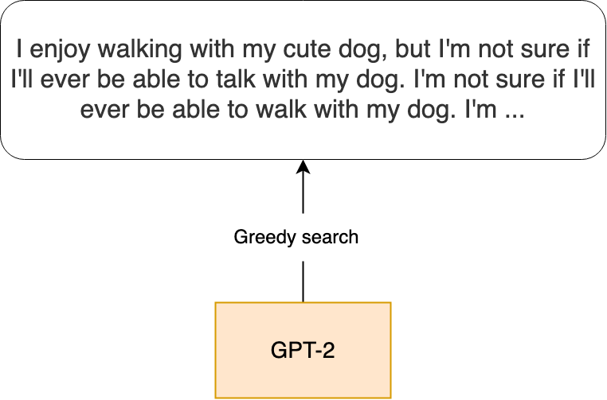

Figure 34: Text generated by GPT-2 language model using greedy search

#### Stochastic sampling

Stochastic sampling methods introduce randomness into the generation process. For example, at each step of token generation, the model samples from the predicted distribution based on the probabilities assigned to each token. This means that each time text is generated, even with the same initial inputs, the generated text may vary.

Figure 35 shows two instances of sampling using the same initial token "How." The first time, the sequence of generated tokens leads to "How are you,"; the second time, a different sequence is generated using the same initial token due to the randomness inherent in sampling.

Figure 35: Stochastic sampling randomness

**Pros:**
- **Diversity:** The presence of randomness allows for more varied outputs, which is particularly useful in applications such as dialogue generation.
- **Novelty:** By sampling from the distribution, the model can explore less probable but potentially more interesting tokens, thus resulting in creativity and novel outputs.

**Cons:**
- **Inconsistency:** The output may vary each time a text is generated. This is less suitable for applications that require precise, repeatable results.
- **Unexpected outputs:** The randomness can lead to unexpected variations in the generated text, which might be inappropriate.

#### Which generation method is suitable for the Smart Compose feature?

For Smart Compose, deterministic methods are preferred for several reasons:

- **Consistency:** Consistency in generated text is crucial for applications such as email completion, for which users expect predictable and reliable suggestions. Utilizing a deterministic method means that users won't see dramatically different suggestions each time they begin to type the same thing.
- **Better handling of common phrases:** Deterministic methods are typically preferred in an email context, as more likely completions are prioritized over the novelty that stochastic methods offer.
- **Reduced risk of inappropriate suggestions:** Stochastic methods might occasionally generate inappropriate suggestions due to their inherent randomness. This behavior is not desired in an email completion feature.

These reasons highlight why deterministic methods are preferred in applications requiring consistency such as email completion. Now that we have chosen deterministic text generation, let's examine two primary algorithms:

- Greedy search
- Beam search

#### Greedy search

Greedy search is the simplest deterministic algorithm. It always selects the token with the highest probability as the next token. As was shown in Figure 34, greedy search can lead to repetitive patterns in the generated text. This occurs because it follows a narrow path based on the highest probability tokens without considering alternative paths that might lead to more coherent sentences. Due to this limitation, greedy search is rarely used in practice.

#### Beam search

Beam search [26] is a popular deterministic algorithm for generating text from a trained model. The core idea is to track multiple potential sequences of tokens simultaneously. At each step, the model calculates the probabilities for the next possible tokens for each sequence and selects the "top-k" most probable sequences. The value of k, known as beam width, is configurable.

Figure 36: Beam search calculating the top three most probable sequences (beam width=3)

Here is a brief step-by-step process for generating text using beam search assuming a beam width of 3:

1. **Initialization:** Start with the user's partial email as the input to the trained model. The model predicts the probability distribution for the next token. Beam search selects the top three tokens with the highest probabilities.
2. **Expansion:** For each top three sequence, pass it to the model and obtain the probabilities of the next token.
3. **Pruning:** Select the top three sequences based on their cumulative probabilities.

Figure 37: First iteration of a beam search with beam width=3

The expansion and pruning steps are repeated until all three potential sentences reach the ⟨EOS⟩ token or a maximum length. Once the beam search algorithm has stopped, we select the sequence with the highest cumulative probability as the output.

Beam search is effective in practice since it tracks several potential sequences simultaneously instead of the most probable sequence. However, beam search has two main drawbacks:

- **Limited diversity:** Beam search often leads to similar outputs, which is not ideal for applications requiring diverse responses.
- **Struggle with long sequences:** Beam search struggles with longer sequences because tracking too many sequences simultaneously can become computationally expensive.

The suggestions made by the Smart Compose feature are typically short; hence, capturing long-range dependencies is less critical. In addition, diversity in the email completions is not desired. For these reasons, we choose beam search as the primary sampling algorithm for generating suggestions.

---

## Evaluation

Evaluation is essential in ML system design interviews. Interviewers will check if candidates can effectively test and validate the ML system they design. An ideal answer should cover both online and offline evaluations and discuss popular metrics for measuring a model's performance in each setting.

Let's explore some common metrics for evaluating the Smart Compose feature.

### Offline evaluation metrics

Offline evaluation uses pre-collected and historical data to evaluate a model's performance. Its purpose is to ensure the model's performance is acceptable before deploying it to production. For example, we test a recommendation system on historical user interaction data to see how well it predicts user preferences. Similarly, we evaluate the performance of our trained model for the Smart Compose feature using historical email data. Two commonly used metrics are:

- Perplexity
- ExactMatch@N

#### Perplexity

Perplexity [27] is a standard metric used extensively in the offline evaluation of language models. This metric measures how accurately the model predicts the exact sequence of tokens present in text data. In mathematical terms, perplexity is defined as the exponential of the average "negative log-likelihood" of the predicted probability given the previous tokens in a sequence:
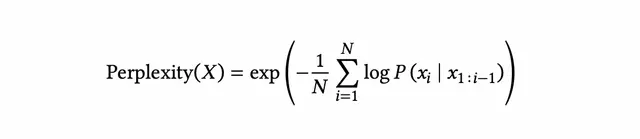
$$\text{Perplexity}(X) = \exp\left(-\frac{1}{N} \sum_{i=1}^{N} \log P(x_i \mid x_{1:i-1})\right)$$

In this equation:

- X is a tokenized sequence (x₁, x₂, ⋯, xₙ) in the text data that is used to evaluate how accurately the model predicts the sequence.
- N is the number of tokens in the sequence.
- P(xᵢ | x₁:ᵢ₋₁) is the conditional probability of the i-th token given the preceding tokens, x₁:ᵢ₋₁, that is, how likely the model is to predict the i-th token given the previous tokens.
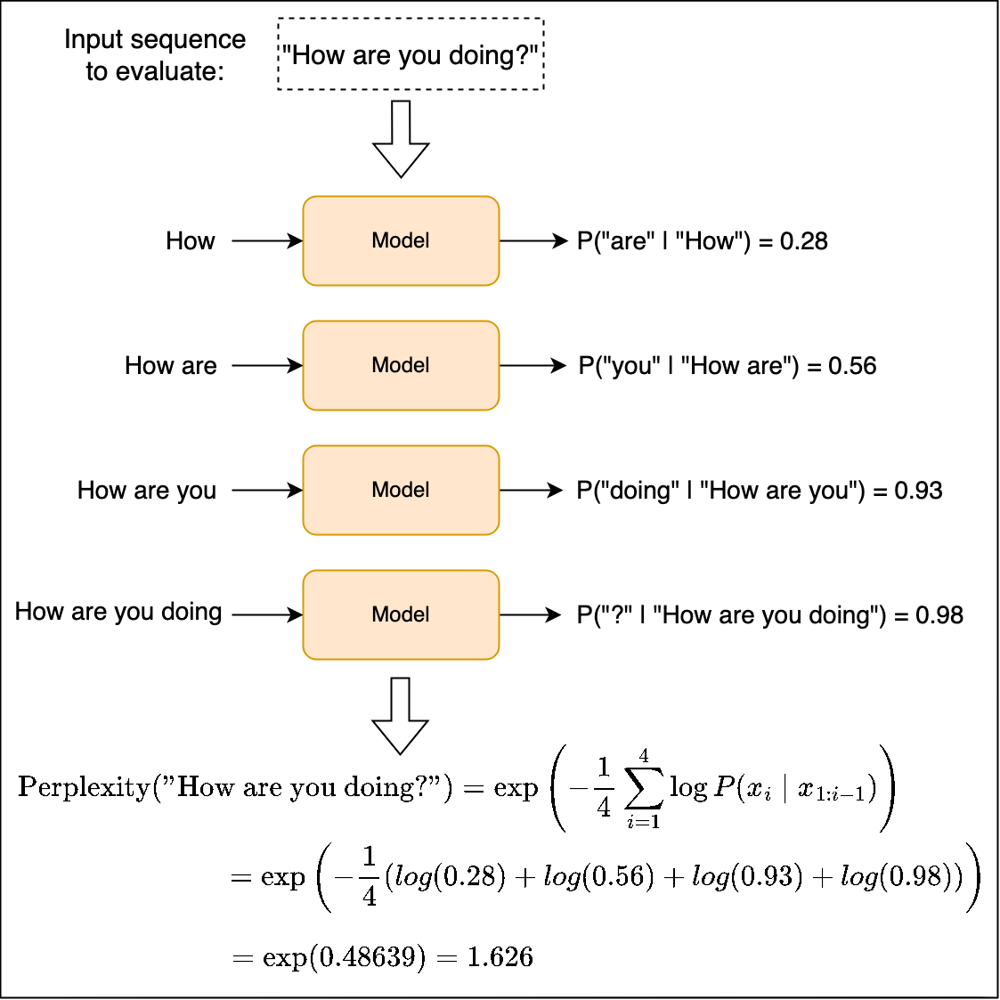

Figure 38: Example of perplexity calculation

A lower perplexity value indicates that the model has assigned higher probabilities, on average, to the tokens that appear in the text data. Therefore, a lower perplexity means the model is better at predicting the next tokens.

#### ExactMatch@N

ExactMatch@N measures the percentage of generated phrases that are exactly N words long and that match the first N words of the ground-truth text. Figure 39 shows ExactMatch@3 calculations for three generated sequences. In practice, there are usually more than three sequences to evaluate.
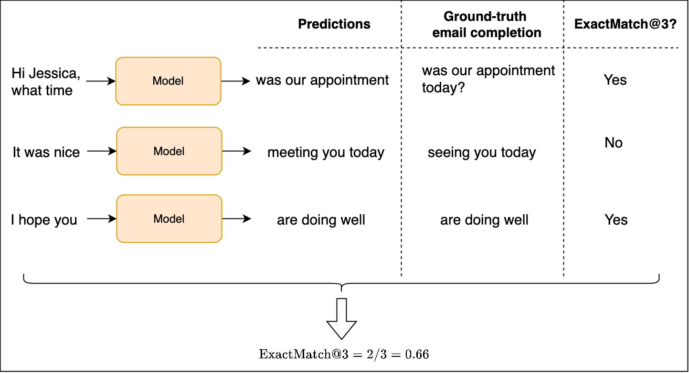

Figure 39: Example of calculating ExactMatch@3 for three sequences

Calculating ExactMatch@N for different values of N allows us to measure how the model performs at different suggestion lengths. To measure the overall performance of the model, we calculate the ExactMatch for all lengths up to a specific length and then take the average.

While Perplexity and ExactMatch@N have traditionally been used to evaluate Gmail Smart Compose, other metrics such as BLEU score and ROUGE-N, introduced more recently, have been found to be helpful. We examine these metrics in more detail in Chapter 3.

### Online evaluation metrics

Online evaluation measures how a model performs in real time as users interact with the system. To evaluate the Smart Compose feature in an online environment, we use additional metrics beyond Perplexity and ExactMatch@N. These online metrics measure user engagement, the model's latency, and the overall impact on user experience.

Unlike offline metrics, which are usually standard, online evaluation metrics are defined based on specific requirements and needs. Companies often use hundreds of metrics for online evaluation. However, in an interview setting, we typically discuss the most common ones. In this section, we focus on the following metrics:

- User engagement metrics
- Effectiveness metrics
- Latency metrics
- Quality metrics

#### User engagement metrics

- **Acceptance rate:** The percentage of suggestions made by the Smart Compose feature that are accepted by users. A higher acceptance rate indicates that the suggestions are relevant and useful to users.
- **Usage rate:** The percentage of all composed emails that have utilized the Smart Compose feature. High usage rates typically indicate that users trust the feature.

#### Effectiveness metrics

- **Average completion time:** Tracks the average time taken by users to compose emails with and without the aid of Smart Compose. A reduced average completion time using Smart Compose will indicate that the feature is speeding up the email writing process.

#### Latency metrics

- **System response time:** Measures the time it takes for the Smart Compose suggestions to appear after the user begins typing. It's important to ensure this metric stays below a certain threshold so the suggestions are made before the user types them.

#### Quality metrics

- **Feedback rate:** Measures the rate at which users provide feedback on the suggestions. Feedback is helpful for continuous improvement of the system.
- **Human evaluation:** Qualitative assessments through user studies are employed to evaluate the usefulness of suggestions. This metric reflects user satisfaction with the Smart Compose feature.

These online metrics are essential for evaluating how well Smart Compose feature works in production. By monitoring these metrics, the stakeholders can obtain a holistic view of feature's performance.

---

## Overall ML System Design

In this section, we propose a design for a simplified Smart Compose feature.

When designing such a feature, we should consider more than just the underlying model that predicts the next token. The system's effectiveness depends on various components working together to ensure the system is responsive, generates relevant suggestions, and maintains ethical standards. For the Smart Compose feature, we examine the following key components:

- Triggering service
- Phrase generator
- Post-processing service

Let's explore each in more detail.

### Triggering service

The triggering service activates the Smart Compose feature by monitoring user activity such as keystrokes. It decides when to activate the feature based on criteria such as the number of characters typed or the entering of specific keywords in the text. For example, if a user types "I," the service might not activate Smart Compose because it's too early to predict the user's intent. However, if the user types "I hope," the service will activate Smart Compose, as the additional context allows for more useful suggestions.

The triggering service ensures suggestions are not too frequent. Once the service determines that activating the Smart Compose feature will be useful, it triggers the phrase generator component, which we discuss next.

### Phrase generator

The phrase generator is the core of the Smart Compose feature. It generates the most likely completion based on the partial text the user has already typed.

To achieve this, the phrase generator interacts with the trained model and employs beam search to generate the top-k most probable completions. Each completion ends with the ⟨EOS⟩ token and an associated score that indicates how confident the model is about the completion.
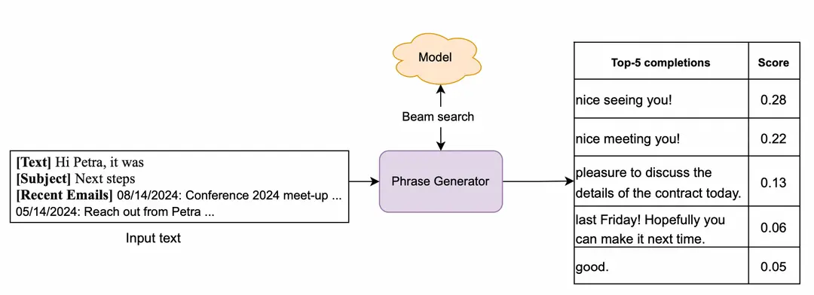

Figure 40: Beam search outputs top five potential completions (beam width = 5)

Given the possible completions, two critical considerations are necessary:

- Removing long suggestions
- Removing low-confidence suggestions

#### Removing long suggestions

As shorter suggestions are easier for the author to read as they are typing, we remove suggested phrases that are too long. For example, if a user types "Can you please," the phrase generator might suggest "help me with this?" Longer suggestions, such as "help me with this project that is due next week," will be too specific and, therefore, less likely to predict what the author intends to write.

Figure 41: Removing long suggestions

#### Removing low-confidence suggestions

We remove suggestions with confidence scores below a certain threshold. This ensures we do not present suggestions if the model is not confident enough about it.
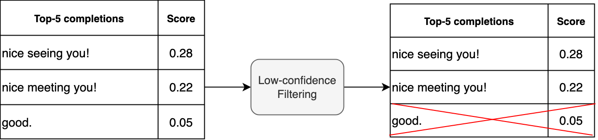

Figure 42: Removing low-confidence suggestions

Finally, if the final list of suggestions is not empty, the phrase generator will pass the one with the highest confidence score to the post-processing service.

### Post-processing service

The post-processing service addresses potential biases before suggestions are presented to the user. This component follows predefined rules to detect and correct bias efficiently. Common strategies to achieve this include:

- **Pronoun replacement:** Replace gender-specific pronouns to ensure neutrality. For example, "he" or "she" might be replaced with "they" in contexts where gender is not specified.
- **Gender-neutral word replacement:** Replace gendered words with gender-neutral alternatives where appropriate. This includes changing words like "chairman" to "chairperson" or "policeman" to "police officer."
- **Lexical analysis for sensitive terms:** Use a predefined list of flagged terms that, if identified, can be replaced with neutral alternatives. For example, terms that might imply age, race, or disability biases are adjusted to ensure the suggestions will be perceived as respectful and neutral.
- **NSFW (Not Safe For Work) content filtering:** Implement automated filters that scan for and flag explicit language. These filters use predefined lists of NSFW keywords, phrases, and patterns to detect and remove problematic content.

By implementing these rules, the post-processing service maintains ethical standards in the Smart Compose feature, thus ensuring that the suggestions provided are relevant, respectful, and inclusive.
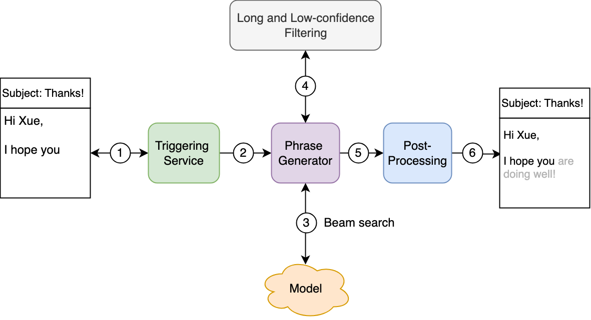

Figure 43: Smart Compose feature overall design

Here is a brief step-by-step workflow of the overall ML system employed by the Smart Compose feature:

1. **Monitoring:** The triggering service monitors the user's activity as they type.
2. **Triggering:** The service triggers the phrase generator once it identifies specific patterns.
3. **Beam search:** The phrase generator employs beam search to get top-k potential completions from the trained model.
4. **Filtering:** The phrase generator interacts with the filtering component to remove long suggestions and those with low confidence scores.
5. **Post-processing:** The completion with the highest score is picked and passed to the post-processing service. The service replaces gender-specific pronouns and adjusts sensitive terms.
6. **Display suggestion:** The suggestion is displayed to the user for their consideration.

---

## Other Talking Points

If there's extra time at the end of the interview, you may face follow-up questions or be asked to discuss advanced topics. This depends on factors such as the interviewer's preference, your expertise, and the requirements of the role. For senior roles, here are some topics you should prepare for:

- Supporting Smart Compose in multiple languages [28].
- Personalizing suggestions [28].
- Incorporating additional context for better predictions [28].
- Understanding how different tokenization algorithms work, such as BPE [11], SentencePiece [12], and WordPiece [29].
- Understanding different ML objectives such as masked language modeling (MLM) and its variations [18].
- The multi-token prediction objective and its pros and cons [30].
- Balancing quality and inference latency [28].

---

## Summary
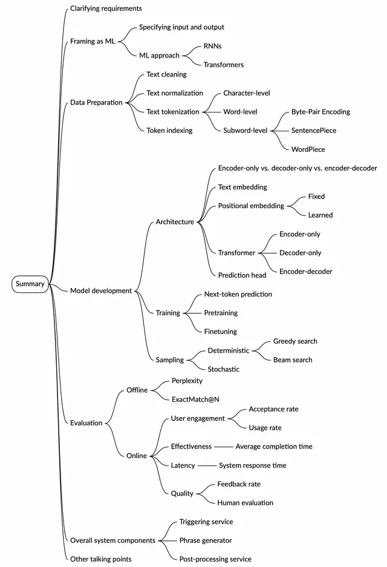

*Figure: Mind map summarizing the key aspects of generative AI system design*

---

## Reference Material

[1] Gmail's Smart Compose feature. https://research.google/pubs/gmail-smart-compose-real-time-assisted-writing/  
[2] Fundamentals of Recurrent Neural Network. https://arxiv.org/abs/1808.03314  
[3] Attention Is All You Need. https://arxiv.org/abs/1706.03762  
[4] Gated recurrent unit. https://en.wikipedia.org/wiki/Gated_recurrent_unit  
[5] Long Short-Term Memory. https://deeplearning.cs.cmu.edu/F23/document/readings/LSTM.pdf  
[6] RITA: Group Attention is All You Need for Timeseries Analytics. https://arxiv.org/abs/2306.01926  
[7] FlashAttention: Fast and Memory-Efficient Exact Attention with IO-Awareness. https://arxiv.org/abs/2205.14135  
[8] Language identification. https://en.wikipedia.org/wiki/Language_identification  
[9] FastText model for language identification. https://huggingface.co/facebook/fasttext-language-identification  
[10] Transformer-XL. https://arxiv.org/abs/1901.02860  
[11] Byte-Pair Encoding tokenization. https://huggingface.co/learn/nlp-course/en/chapter6/5  
[12] SentencePiece tokenization. https://arxiv.org/abs/1808.06226  
[13] Tiktoken library. https://github.com/openai/tiktoken  
[14] Google's Gemini. https://gemini.google.com/  
[15] SentencePiece library. https://github.com/google/sentencepiece  
[16] Summary of tokenizers. https://huggingface.co/docs/transformers/en/tokenizer_summary  
[17] OpenAI's tokenizers. https://tiktokenizer.vercel.app/?model=gpt-4-1106-preview  
[18] BERT. https://arxiv.org/abs/1810.04805  
[19] OpenAI's models. https://platform.openai.com/docs/models  
[20] Meta's LLaMA. https://llama.meta.com/  
[21] Introduction to Transformers by Andrej Karpathy. https://www.youtube.com/watch?v=XfpMkf4rD6E  
[22] Transformer visualized. https://jalammar.github.io/illustrated-transformer/  
[23] Common Crawl. https://commoncrawl.org/  
[24] Cross-entropy. https://en.wikipedia.org/wiki/Cross-entropy  
[25] Prompt engineering. https://platform.openai.com/docs/guides/prompt-engineering  
[26] Beam search. https://en.wikipedia.org/wiki/Beam_search  
[27] Perplexity. https://en.wikipedia.org/wiki/Perplexity  
[28] Gmail Smart Compose: Real-Time Assisted Writing. https://arxiv.org/abs/1906.00080  
[29] WordPiece tokenization. https://huggingface.co/learn/nlp-course/en/chapter6/6  
[30] Better & Faster Large Language Models via Multi-token Prediction. https://arxiv.org/abs/2404.19737  

---
### Footnotes

[^1]: Visit https://platform.openai.com/tokenizer to see examples of different tokenizers.