# 03. Google Translate
## Introduction

Google Translate is a widely used language translation service offered by Google. The service relies on machine learning (ML) models to understand and translate text between languages. As of 2024, the service supports over 130 different languages and has over a billion users [1]. This chapter explores the system design behind a language translation service.

Figure 1: Language translation service

---

## Clarifying Requirements

Here is a typical interaction between a candidate and an interviewer:

**Candidate:** Are there specific languages the system should support initially?  
**Interviewer:** Let's focus on four languages: English, Spanish, Korean, and French. We can expand to more languages in the future.

**Candidate:** Considering the diversity of languages, do we have access to a sufficiently large and varied dataset for training?  
**Interviewer:** Yes. We have access to a substantial multilingual corpus, including formal documents, web content, and conversational texts, in all four languages. The dataset contains 300 million examples, an example being defined as a pair of sentences in the source and target languages.

**Candidate:** Do we have access to general text data? This is important, as it would allow us to pretrain a model on general text data and, thus, allow it to gain general knowledge.  
**Interviewer:** Assume we have access to terabytes of general text data in each of the languages, obtained from various sources.

**Candidate:** Will users specify the input text language, or should the system detect it automatically?  
**Interviewer:** Users cannot always identify a text's language. Imagine a book title in a language with which the user is not familiar. Our system should detect the input language automatically.

**Candidate:** Is there a constraint on the length of the input text?  
**Interviewer:** Let's build the system in such a way that it can support inputs of up to 1,000 words.

**Candidate:** Should the system support translation when there is no internet connection? In other words, should the model work on-device?  
**Interviewer:** The focus of this interview is not efficiency and model optimization for on-device deployment. Let's assume an internet connection is required and that the model will be deployed on the cloud.

**Candidate:** Should the system support real-time translation?  
**Interviewer:** Not initially.

---

## Frame the Problem as an ML Task

In this section, we frame the problem of building a translation system as an ML task. This involves understanding the system's inputs and outputs and choosing a suitable ML approach.

### Specifying the system's input and output

The input to a translation system is a sequence of words in the source language and the target language provided by the user. The output is a sequence of words in the target language.
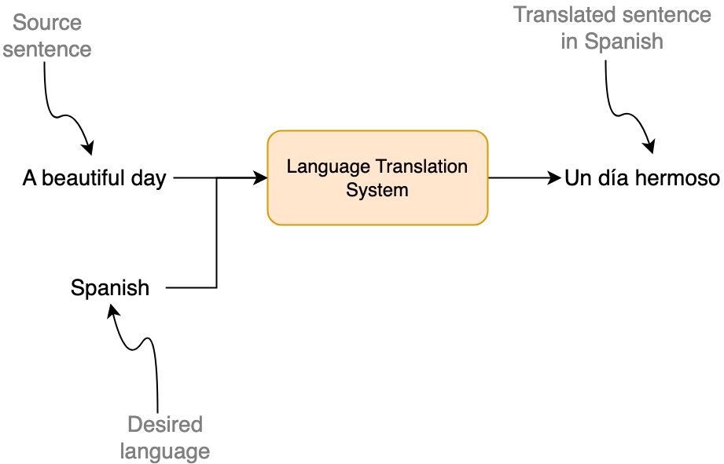

Figure 2: Input and output of a translation system

### Choosing a suitable ML approach

In language translation, a sequence of words in one language is transformed into a sequence of words in another language. This sequence-to-sequence (seq2seq) structure is also found in other tasks, such as text summarization and speech recognition.

Seq2seq models, a class of ML models, are specifically designed to handle such tasks. These models transform an input sequence into an output sequence, which can vary in length from the input. Seq2seq models follow an encoder-decoder architecture, which has two main components:

- **Encoder:** Processes the input sequence and transforms it into a sequence of context vectors, thus encoding the information in the input sequence.
- **Decoder:** Utilizes the encoder's context vectors to generate the output sequence one token at a time.
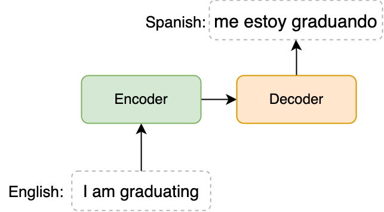

Figure 3: Encoder-decoder model for English-to-Spanish translation

There are several architectures available for the encoder and decoder components. In particular, architectures designed to process sequential data, such as LSTMs, GRUs, and Transformers, can be employed. Among those, Transformers have shown superior performance in translation tasks, outperforming earlier models such as GRUs and LSTMs, particularly in handling long-range dependencies. Notably, the attention mechanism was originally introduced in the context of language translation [2].

As described in Chapter 2, Transformers have three variations: encoder-only, decoder-only, and encoder-decoder architecture. Encoder-only models such as BERT [3] are good at understanding and processing the input sequence but typically require additional mechanisms to generate output. Decoder-only models, such as OpenAI's GPT [4] and Anthropic's Claude [5], are highly effective at generative tasks.

While all three architectures offer strong performance and can be adapted for language translation tasks through techniques like prompt engineering, encoder-decoder models are usually preferred for three main reasons. First, the encoder-decoder architecture separates the input understanding and output generation, which is ideal for seq2seq tasks such as language translation. It allows the encoder to specialize in the source language and fully understand the input sequence before the decoder generates the output. For example, encoders often use bidirectional mechanisms, such as bidirectional LSTMs [6] or Transformers, which enable them to understand the context from both directions.

Second, this architecture naturally handles variable-length sequences. Encoder-decoder models are designed to accommodate input/output sequences of varying lengths, making them highly versatile across different applications. This flexibility is crucial for tasks where inputs and outputs do not have a fixed length relationship.

Finally, the cross-attention mechanism present in encoder-decoder Transformers enables the decoder to focus dynamically on relevant parts of the input sequence during generation. This targeted attention ensures that the output sequence remains closely aligned with important elements of the source sequence, thus improving the accuracy and quality of the translation. We will explore cross-attention in greater detail in the architecture section.

---

## Data Preparation

In this section, we prepare raw textual data for the encoder-decoder Transformer. We have two types of data for training: general data and translation data. General data includes publicly available text from the Internet. Translation data comprises 300 million sentence pairs, each containing a source-language sentence and its corresponding translation in the target language.

Raw text in both general data and translation data is often noisy and not in the format the ML model expects. Since we covered preparing general data in Chapter 2, we will focus on preparing translation data. In particular, we focus on the following two steps:

1. Text preprocessing
2. Text tokenization

### Text preprocessing

We apply the following preprocessing techniques to raw text in translation data:

- **Remove missing data:** Remove pairs where either the source or target text is missing.
- **Remove noisy data:** Remove pairs with HTML tags or incorrect language pairings.
- **Deduplication:** Remove duplicate sentence pairs from the dataset to prevent the model from overfitting to certain examples.
- **Handle named entities:** Language translation models often struggle with named entities. We identify these entities in the text and replace them with placeholder tokens. After translation, we replace the tokens with the original entities. For example, consider the sentence: "The California city, Burlingame, is named after diplomat Anson Burlingame." First, we detect the named entities: "California (location name)," "Burlingame (location name)," and "Anson Burlingame (person's name)." Next, we replace these entities with placeholder tokens: "The ENTITY_1 city, ENTITY_2, is named after diplomat ENTITY_3." This approach helps the model focus on the sentence context during training without being confused by uncommon terms.

In modern language translation, particularly with models like Transformers, some traditional preprocessing steps have become less crucial or are handled differently. Here are a few preprocessing steps that were once essential in traditional translation models but are now unnecessary or less relevant:

- **Lowercasing:** Modern language translation models can handle case sensitivity as part of their training. They can learn to distinguish between different forms of words based on case (e.g., "Apple" as a company vs. "apple" as a fruit) without needing to convert everything to lowercase. Therefore, lowercasing is often skipped to preserve the original case information.
- **Stop word removal:** Stop words (e.g., "the," "and," "in") are essential for the grammatical structure of sentences. Removing them can disrupt the fluency and meaning of translations. Modern language translation models benefit from having complete sentences, including stop words, to understand the context fully and produce more natural translations.
- **Stemming and lemmatization:** Stemming (reducing words to their base or root forms) and lemmatization (reducing words to their dictionary forms) are not typically needed in modern language translation because these models are designed to handle morphological variations of words. The models learn to translate words into their correct forms based on context; therefore, reducing them to a base form could actually remove valuable information.
- **Punctuation removal:** Punctuation is important for understanding sentence structure and meaning. Modern language translation models are trained to handle punctuation naturally; thus, removing it can degrade translation quality. Punctuation is usually preserved to help the model maintain the grammatical integrity of sentences.

### Text tokenization

In the context of language translation in which we deal with several languages, the choice of text tokenization algorithm is important. For example, if we were to choose a word-level tokenizer, we would have hundreds of thousands of unique words across all languages in our vocabulary, which is huge and inefficient.
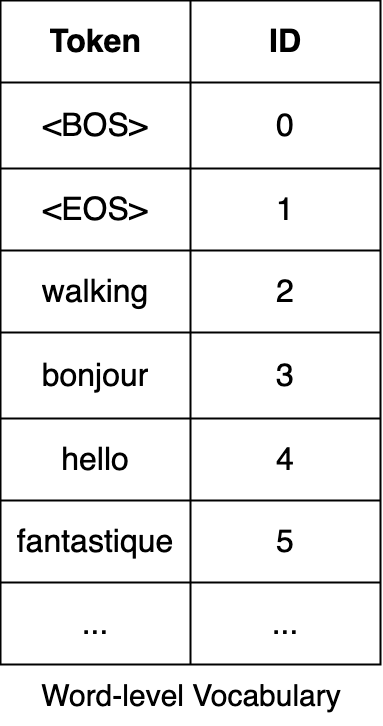

Figure 4: A huge vocabulary size due to word-level tokenization

In language translation, handling the diversity of words across languages is a key challenge. Traditional word-level tokenization models often struggle with out-of-vocabulary (OOV) words, while subword-level tokenization algorithms are more efficient and can effectively address the OOV problem. Due to their importance and widespread use, it is valuable to examine Byte-Pair Encoding (BPE) [7], a commonly used subword-level tokenization algorithm, in detail.

#### Byte-Pair Encoding (BPE)

BPE builds a subword-level vocabulary through iterative merging. It starts with characters and iteratively merges the most frequent combinations into new subwords. This allows the model to break down words, even rare or unseen ones, into known components, thus enabling accurate understanding and translation. Let's walk through a concrete example to better understand BPE.

##### Initial setup

Suppose we have a corpus with the following set of words: "cat," "cats," "dog," and "dogs."
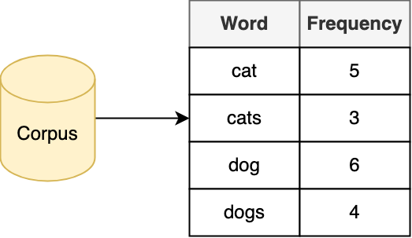

Figure 5: Frequency of words in our corpus

In the initial setup, our goal is to initialize a vocabulary consisting of different characters and their frequency of occurrence in the corpus. To achieve this, we follow these steps:

1. Add a special end token, "`</w>`," to the end of each word to mark its boundary. This special token helps the model know when a word has ended.
2. Tokenize the corpus by breaking down each word into individual characters.
3. Initialize the vocabulary with individual characters and their frequency of occurrence.
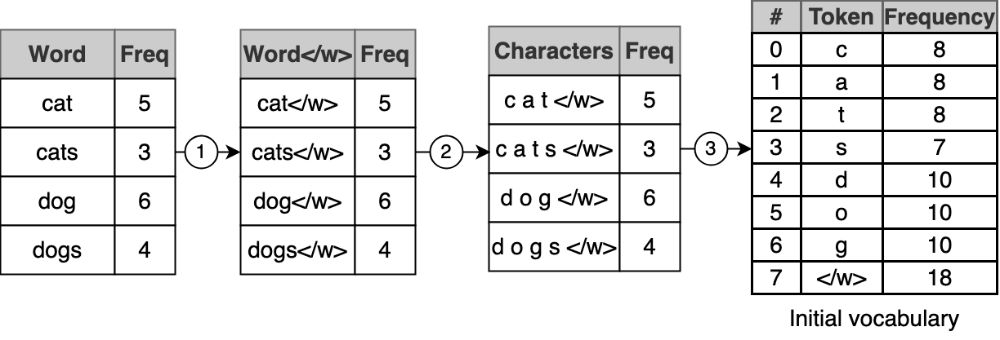

Figure 6: Initial setup steps

##### Iterative merging

Once the initial vocabulary has been created, BPE iteratively merges the most frequent character pairs into subwords. This continues until the vocabulary reaches a predefined size or meets the stopping criteria.

Following are the first five BPE iterations:

**Iteration 1:** We first identify the most frequent character pair, which is "d" and "o," appearing together 10 times (in "dog" and "dogs"). We merge them to create a new token, "do." Although "og" also appears 10 times, "do" comes first alphabetically. The token "do" is added to the vocabulary, and the frequency counts are updated. "do" now occurs 10 times, and the individual counts of "d" and "o" are reduced accordingly.
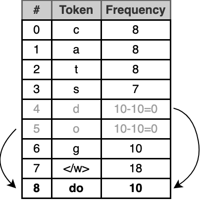

Figure 7: BPE iteration 1

**Iteration 2:** Now we look for the next most frequent pair, which is "do" and "g" (also from "dog" and "dogs"). These characters appear together 10 times, so we merge them to create the token "dog."
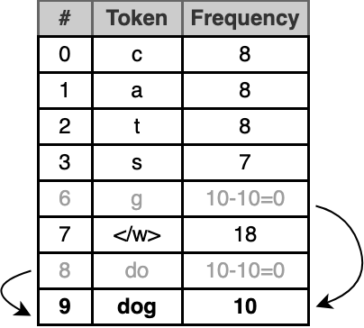

Figure 8: BPE iteration 2

**Iteration 3:** Moving forward, we notice that "c" and "a" (from "cat" and "cats") appear together 8 times. We merge these to create the token "ca." After merging, "cat" can be represented as "ca" and "t." The token "ca" now has a frequency of 8.

**Iteration 4:** We continue by merging "ca" and "t", which appear 8 times together (from "cat" and "cats"). We merge them to form the token "cat." Now, "cats" can be represented as "cat" and "s", and "dogs" as "dog" and "s." The frequency count for "cat" is updated to 8.

**Iteration 5:** Finally, the next most frequent pairing is "s" and "`</w>`" (from "dogs" and "cats"), which appears 7 times. We merge "s" and "`</w>`" to form the token "`s</w>`."
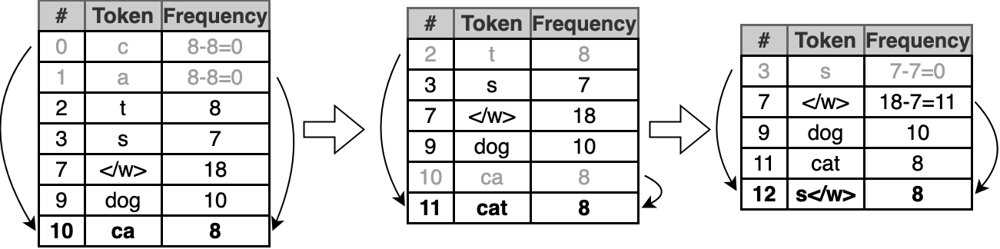

Figure 9: BPE iterations 3–5

BPE iteratively merges the most frequent character pairs, leading to a more compact representation of the corpus. The merging continues until we reach the desired number of tokens or iterations.
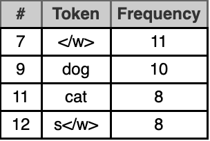

Figure 10: BPE vocabulary after 5 iterations

Note the special "`</w>`" token plays a key role in distinguishing between different word forms. For instance, the token "cat" followed by "`</w>`" indicates the end of the word "cat," whereas the token "cat" without `</w>` could also be part of another word. This distinction helps BPE represent and interpret words accurately during translation, allowing it to efficiently handle both familiar and unseen words.

Once the vocabulary has been created, we construct our training data by replacing each tokenized sentence with a sequence of integers. This leads to multiple tables, each for a specific language pair. Figure 11 shows the prepared translation data for the English–French and English–Korean language pairs.
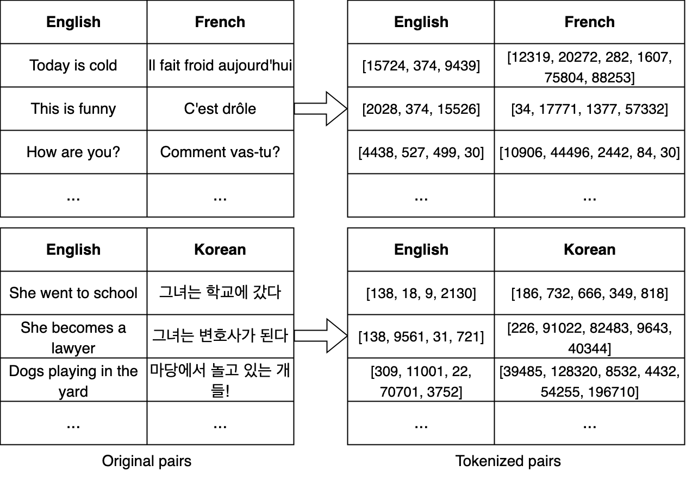

Figure 11: Constructed training data for English–Korean and English–French pairs

---

## Model Development

We utilized an encoder-decoder Transformer to train language translation. In this section, we explore the architecture of the encoder and decoder, training strategies, and sampling methods.

### Architecture

The key components in an encoder-decoder Transformer architecture are very similar to those of the decoder-only Transformer explained in Chapter 2. Let's examine the encoder and decoder separately and highlight their key differences.

#### Encoder

The encoder processes the input sequence and outputs a sequence of embedding for each input token.
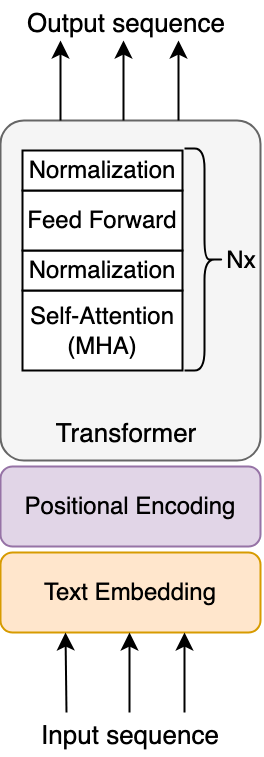

Figure 12: Encoder components

The encoder consists of the following components:

- Text embedding
- Positional encoding
- Transformer

**Text embedding:** This component converts each input token into an embedding vector. These embeddings capture the semantic information of each token.
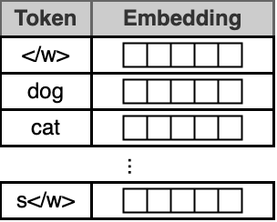

Figure 13: Token embedding table

**Positional encoding:** The positional encoding component injects information about the position of each token in the input sequence. As discussed in the previous chapter, both fixed and learned methods are effective in practice. For simplicity, we choose a fixed positional encoding method such as sine–cosine encoding.

**Transformer:** The Transformer processes a sequence of token embeddings through a stack of Transformer blocks. Each block contains a self-attention layer that uses the multi-head attention (MHA) mechanism on the input sequence and a feed-forward layer, with normalization layers in between to ensure stability during training. Since the requirement specifies support for a 1,000-word input sequence, we do not need to employ optimized attention mechanisms for efficiency, as the standard attention mechanism is sufficient to handle this sequence length without significant performance issues.

#### Decoder

The decoder generates the output sequence one token at a time using the encoder's output and the previously generated tokens. The decoder has the following components:

- **Text embedding:** Converts each token in the target sequence to an embedding
- **Positional encoding:** Injects information about the position of each token
- **Transformer:** Processes the target sequence and outputs an updated sequence of embeddings
- **Prediction head:** Utilizes the updated embeddings to predict the next token
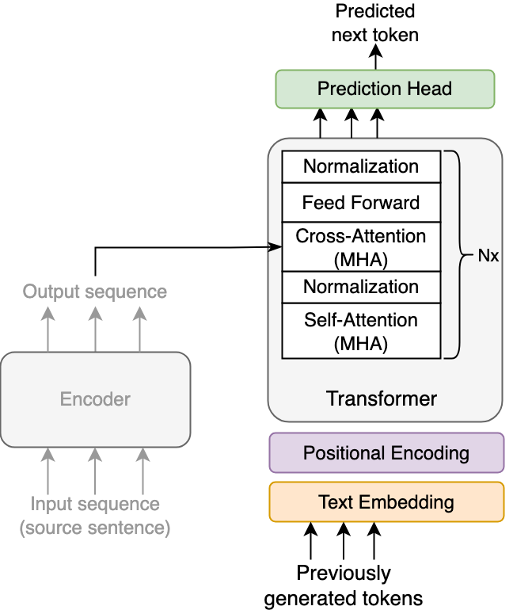

Figure 14: Decoder components

#### What are the key differences between the encoder and decoder?

There are three key differences between the encoder and decoder:

- Cross-attention layer
- Self-attention mechanism
- Prediction head

##### Cross-attention layer

The Transformer component in the decoder includes a cross-attention layer. This layer performs the MHA mechanism over the encoder's output. It enables each token in the decoder to attend to all embeddings in the encoder. This allows the cross-attention to effectively integrate information from the input sequence during the generation of the output sequence.
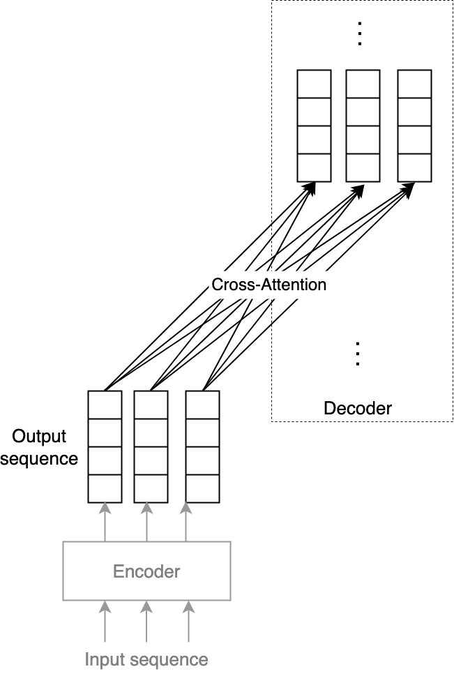

Figure 15: Cross-attention layer

##### Self-attention mechanism

The self-attention layer operates differently in the encoder and decoder. In the encoder, each token attends to all other tokens in the sequence. This helps the encoder understand the entire sequence comprehensively. In contrast, in the decoder, each token is restricted to attending to only those tokens that come before it by masking the future tokens in the sequence. This difference is important for generation tasks because the model should use only previously generated tokens, not future ones, to predict the next token.
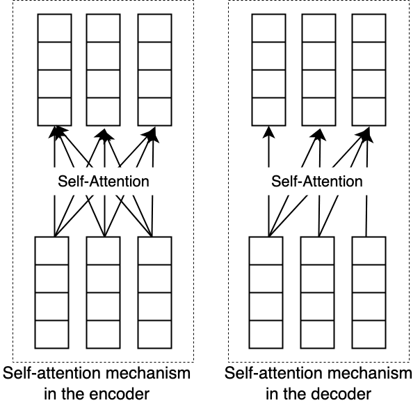

Figure 16: Different self-attention mechanisms in the encoder and decoder

##### Prediction head

The decoder has a prediction head on top of the Transformer component. The prediction head usually includes a linear layer followed by a softmax layer to convert the Transformer's output into probabilities over the vocabulary. These probabilities are used to determine the most likely next token.

---

### Training

We employ a two-stage strategy to train a language translation model:

1. Unsupervised pretraining
2. Supervised finetuning

#### 1. Unsupervised pretraining

In this stage, we train a base model using a large corpus of general data. This creates a base model capable of understanding language, grammar, and context.

Let's review the pretraining data, ML objective, and loss function for the pretraining stage.

##### Pretraining data

We utilize popular pretraining datasets such as C4 [8], Wikipedia [9], and StackExchange [10]. In contrast to Chapter 2, where we focused on pretraining a language model for English only, for language translation, we need a base model with a general understanding of multiple languages. Therefore, we do not remove non-English text data from these datasets. Instead, we keep the set of languages we expect the model to translate and remove any text data belonging to languages outside that set.

##### ML objective and loss function

In Chapter 2, we explored next-token prediction as the primary ML objective for language generation. Next-token prediction is not an ideal choice in encoder-decoder pretraining because the training is unsupervised. If we pass an entire sentence to the encoder, it will encode information in a way that allows the decoder to always predict the next word accurately, thus effectively "cheating." Instead, we use "masked language modeling," a common ML objective for pretraining an encoder-decoder Transformer. Let's examine it in more detail.

##### Masked language modeling (MLM)

In MLM, also known as masked token prediction, some of the input tokens are masked, and the model is trained to predict those masked tokens.
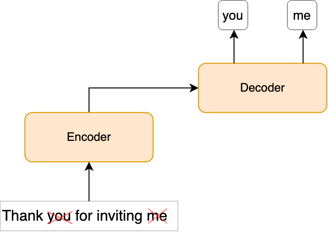

Figure 17: An overview of the MLM objective

MLM allows the encoder to process the input sentence and encode it so the decoder can predict the masked words. As the masked words are never visible during the encoding process, this prevents the model from cheating.

To measure the model's performance in predicting the masked tokens, we use cross-entropy loss. This commonly used loss function measures the discrepancies between the predicted probabilities and the ground-truth tokens, thus guiding the training process. Here is a step-by-step explanation of how loss is calculated using the MLM objective:

1. Randomly select a subset of tokens in the input sequence and replace them with a mask token ("[MASK]"). For example, the input sentence "Thank you for inviting me" might become "Thank [MASK] for inviting [MASK]".
2. Feed the masked sequence to the encoder so it can understand the context despite the missing tokens. The encoder outputs a sequence of new embeddings for each token.
3. Feed the decoder with the same input sequence, but, this time, none of the tokens are masked and the sequence has been shifted one position to the right by the insertion of a start token ("<BOS>"). Refer to Chapter 2 or [11] to understand why we shift the input sequence during training.
4. The decoder predicts the next token for each position in the sequence. Each prediction uses all previous input tokens and encoded information from the encoder.
5. Calculate the cross-entropy loss over the predicted probabilities and the ground-truth for the masked tokens only.
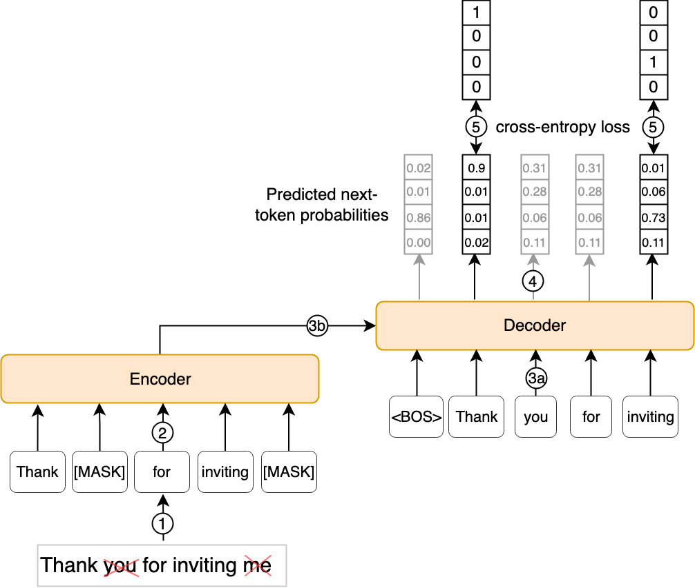

Figure 18: Cross-entropy loss calculation for MLM objective

In summary, we primarily use the MLM objective in pretraining encoder-decoder Transformers because it engages both the encoder and decoder. The encoder develops its understanding of the language by encoding the masked input text. The decoder learns to process this encoded information and predict the masked tokens. This objective prepares both the encoder and decoder for the supervised finetuning stage.

Before exploring the supervised finetuning stage, note that pretraining a base model is resource-intensive and, therefore, expensive. In practice, we often use publicly available encoder-decoder models such as Google's T5 [12] or Meta's BART [13], which have been pretrained on extensive datasets. This approach significantly reduces the cost and resources needed for pretraining.

#### 2. Supervised finetuning

Supervised finetuning, the second stage of our training process, adapts the base model to the specific task of language translation. It does this by finetuning the base model on translation data. To adapt the base model to language translation, we have two options:

- Bilingual approach
- Multilingual approach
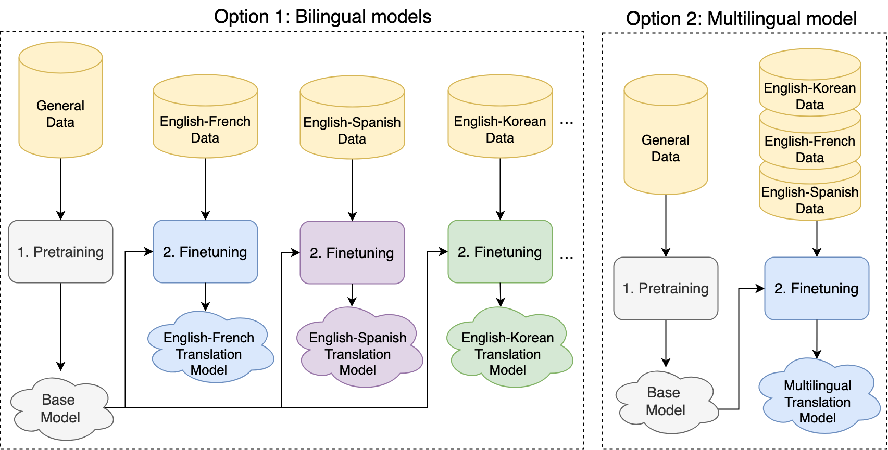

Figure 19: Bilingual vs multilingual models

##### Bilingual approach

In this approach, we train models specific to each language pair. Training language-specific models has several advantages. First, they capture the unique linguistic nuances of each language pair. Second, they usually demonstrate higher translation accuracy due to their specialized natures. Finally, improving performance is simpler with language-specific models because we can easily isolate and address specific issues that may arise for each language pair. However, training, deploying, and maintaining multiple models is resource-intensive and costly.

##### Multilingual approach

Here, a single model is trained to translate between multiple languages. Multilingual models are simpler, less expensive, and easier to deploy and maintain than bilingual models. Recent studies such as mT5 [14] and mBART [15] have highlighted the trend toward multilingual translation models that often match or exceed the performance of bilingual models.

For this chapter, we prioritize translation accuracy over simplicity and, therefore, choose a bilingual approach.

##### Training data

Figure 20 shows an example of prepared training data where each table represents a language pair. In each table, a row represents one example, containing a sequence of token IDs for the sentence in the source language and a sequence of token IDs for the translation in the target language.
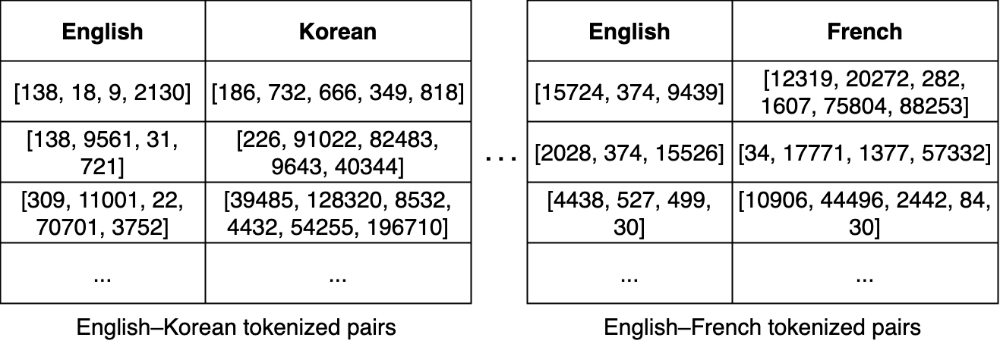

Figure 20: Example of prepared training data for different language pairs

##### ML objective and loss function

Whereas the pretraining stage was unsupervised, the finetuning stage is supervised. The encoder processes source sentence tokens for each training example, and the decoder generates the target sentence tokens. Since the decoder should generate tokens sequentially after training, we use next-token prediction as our ML objective. We use cross-entropy as our loss function to measure the accuracy of the predicted next token.
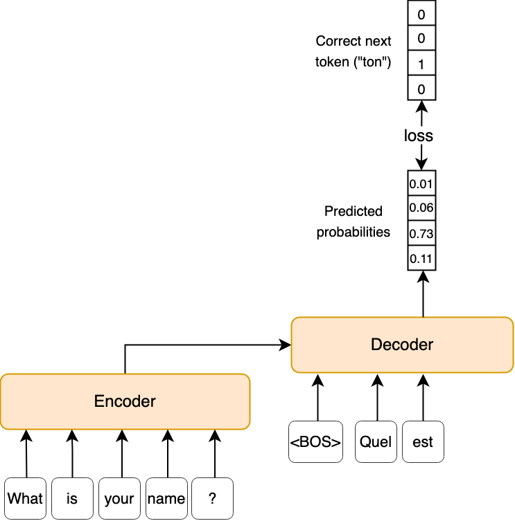

Figure 21: Loss calculation during the finetuning stage

Figure 21 shows loss calculation during the finetuning stage. For simplicity, it visualizes a single prediction. In practice, as we saw in Chapter 2, the decoder predicts the next token for all positions simultaneously, and the losses are calculated for all predictions.

---

### Sampling

During sampling, the trained model generates a potential translation by predicting each subsequent token based on the previously generated tokens and the context of the input sequence.
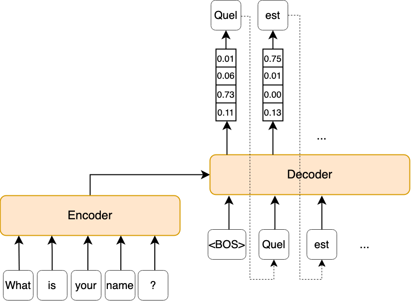

Figure 22: Generating translation

As discussed in Chapter 2, there are two main strategies for sampling text in generative models: deterministic methods (e.g., beam search) and stochastic sampling. Here, we choose beam search for two main reasons:

- **Translation accuracy:** Beam search usually leads to more accurate translations. This is because the algorithm evaluates multiple possible sequences and selects the most probable one.
- **Consistency:** Beam search is deterministic, meaning it always produces the same output given the same input. This consistency ensures that translations will provide few surprises, which is critical in most translation systems. While diversity can be beneficial, it is neither essential nor desirable for language translation systems.

Note that in applications where diversity and creativity are more valued, such as creative writing, stochastic sampling methods are usually preferred. In Chapter 4, we will examine stochastic methods such as top-k and top-p sampling in detail.

| Characteristic | Deterministic methods | Stochastic methods |
|---|---|---|
| Approach | Follow a predictable process to generate output | Generate output based on probability distribution |
| Efficiency | Typically less efficient due to tracking multiple paths | More efficient since randomness allows for quicker selections |
| Quality | Coherent and predictable | Diverse and creative |
| Risk | Usually lead to repetitive output for longer sequences | Might produce inappropriate output due to their creativeness |
| Use case | Suitable for tasks requiring consistency, such as language translation | Suitable for tasks requiring creativity, such as open-ended text generation |
| Methods | Greedy search, beam search | Multinomial, top-k, top-p |

Table 1: Comparison of deterministic and stochastic methods

---

## Evaluation

### Offline evaluation metrics

To thoroughly evaluate a language translation model, metrics should measure both translation accuracy and contextual appropriateness. The research community has proposed several metrics that, over the years, have become widely accepted as standards. Some commonly used metrics are:

- BLEU
- ROUGE
- METEOR

#### BLEU

BLEU (BiLingual Evaluation Understudy) [16] is a precision-based metric that compares n-grams (a sequence of "n" words) of the candidate translation with n-grams of the reference translations and counts the ratio of matches. It ranges from 0 to 1, where a higher value indicates a more precise translation.

The BLEU score is calculated using the following formula:

$$\text{BLEU} = BP \cdot \exp\left(\sum_{n=1}^{N} w_n \log p_n\right)$$

where:

- N is the maximum n-gram length considered for evaluation
- BP is the brevity penalty
- pₙ is the n-grams precision
- wₙ represents the weight for different n-gram precisions

Let's explore each of these terms in detail.

##### Brevity Penalty (BP)

BP is a constant term that penalizes translations shorter than the reference translation. The formula is:

$$BP = \begin{cases} 1 & \text{if } c > r \\ e^{(1 - r/c)} & \text{if } c \leq r \end{cases}$$

where:

- c is the translation length
- r is the reference translation length

If the candidate translation length, c, is greater than the reference translation length, r, the brevity penalty is 1 (i.e., there is no penalty). If the candidate translation length is less than or equal to the reference translation length, the brevity penalty is an exponential decay based on the ratio of the lengths.

##### Precision (pₙ)

Precision measures how many n-grams in the candidate translation are present in reference translations. It is calculated by dividing the number of matching n-grams by the total number of n-grams in the candidate translation. Figure 23 provides an example of calculating p2 for a candidate and one reference sentence.
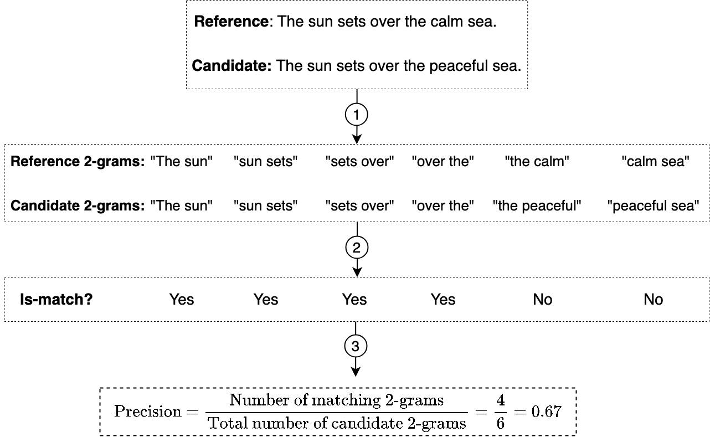

Figure 23: Example of calculating precision for 2-grams (p2)

##### Weights (wₙ)

These weights correspond to the precision of each n-gram size. Usually, we distribute them evenly, giving each n-gram precision the same importance. For instance, for n-grams up to 4-grams, each wₙ would be 1/4.

BLEU's main advantage is that it is simple and easy to compute. However, it has a major drawback: it can unfairly penalize translations that are correct but different from the reference translation. For example, if the reference translation is "The engineer discovered a new algorithm," and the generated translation is "The engineer found a new method," BLEU might penalize the generated translation even though it conveys the same meaning. Despite this limitation, BLEU remains insightful and widely used in practice to evaluate language translation models.

#### ROUGE

ROUGE (Recall-Oriented Understudy for Gisting Evaluation) [17] is a popular metric that complements BLEU by focusing on recall instead of precision. It measures the ratio of n-gram overlaps between the candidate and reference texts. For example, the ROUGE-N recall is defined as:

$$\text{Recall} = \frac{\text{Number of matching n-grams}}{\text{Total number of n-grams in the reference}}$$

If you are interested to learn more about ROUGE and its formula, refer to [17].

Similarly to BLEU, ROUGE is easy to implement and efficient at calculating. However, its main drawback is its lack of contextual understanding. A translation with different but semantically similar words might receive a low ROUGE score.

#### METEOR

METEOR (Metric for Evaluation of Translation with Explicit ORdering) [18] is a popular metric for evaluating language translation models. It calculates precision and recall and then combines these measurements using a weighted harmonic mean.

Unlike BLEU and ROUGE, which rely on exact n-gram matches, METEOR considers synonyms and the morphology of words. For example, if the reference translation uses "run" and the generated translation uses "running," METEOR recognizes these as related terms. These synonyms are found using linguistic resources such as synonym dictionaries or lexical databases. One commonly used resource is WordNet [19], which organizes words into synonyms of various types and shows the relationships between those synsets.
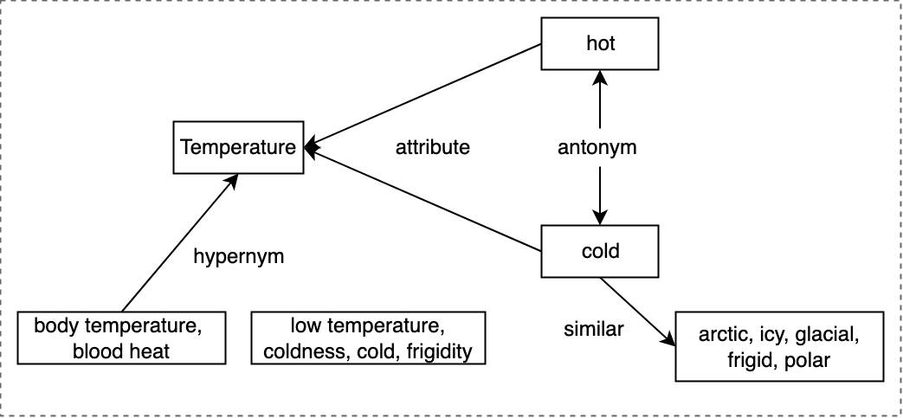

Figure 24: Example of relationships between words

While METEOR is a more comprehensive metric, it has some drawbacks. Let's take a look at its pros and cons.

**Pros:**
- **Semantic understanding:** METEOR evaluates translation quality more accurately when different wordings convey the same meaning. This is because it considers synonyms and stemming during the evaluation of translations.
- **Balanced evaluation:** METEOR provides a balanced evaluation because it combines precision and recall. This helps identify translations that are both accurate and complete.
- **Correlation with human judgments:** METEOR correlates better with human judgments than BLEU and ROUGE.

**Cons:**
- **Computational complexity:** METEOR is harder to implement and takes more time to calculate than BLEU and ROUGE. This is because it requires additional steps, such as synonym and stemming matching.
- **Resource dependence:** METEOR relies on linguistic resources such as synonym dictionaries and stemming algorithms, which may not be available for all languages.

To summarize, all three metrics offer insights into the model's performance and are commonly used in practice. Let's transition to online evaluation to understand how our model performs in real-world scenarios.

### Online evaluation metrics

During the online evaluation, we evaluate how well our language translation system works in production. We use the following two metrics to measure how satisfied and engaged our users are:

- **User feedback:** Collect ratings or feedback from users regarding the quality of translations. The metric is insightful since it directly reflects user satisfaction.

Figure 25: Collecting user feedback

- **User engagement:** Measure users' engagement by monitoring how often they use the translation feature, how long they interact with it, and how frequently they return. This helps us understand how valuable and effective the translation tool is in real-world use.

Combining offline and online evaluation metrics gives us a more complete view of the performance of the language translation. This thorough evaluation ensures models fulfill technical standards and satisfy user expectations.

---

## Overall ML System Design

In this section, we explore the ML design of a language translation system. In particular, we examine two key components:

- Language detector
- Translation service
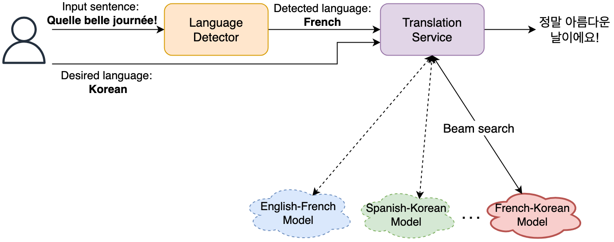

Figure 26: Language translation overall design

### Language detector

The language detector identifies the language of a given text, enabling us to use the model that has been trained specifically for that language. This task can be framed as a sequence classification task, and encoder-only architecture is a good candidate architecture for such a task. We can modify the encoder-only Transformer in two ways (Figure 27) to classify input sentences:

- **Average pooling:** Pass the Transformer's outputs to an average pooling layer, and then a prediction head to output language class probabilities.
- **Last token representation:** Use the last token representation from the Transformer's output and feed it to the prediction head for probability prediction.
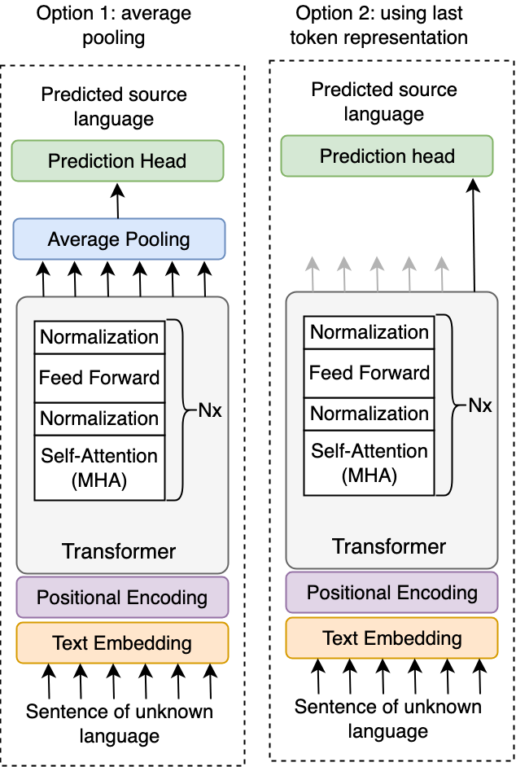

Figure 27: Two options for building a language detector using an encoder-only Transformer

### Translation service

The translation service interacts with the specific model based on the detected and desired languages. It then applies beam search to generate a sequence of tokens in the target language and converts the tokens back into text. The final translation is then shown to the user.

---

## Other Talking Points

If time permits at the end of the interview, consider discussing these additional topics:

- Supporting translation for languages with limited training data using transfer learning and multilingual models [20].
- Approaching language translation using a decoder-only Transformer [21].
- Continuously improving translation models through user feedback [22].
- Optimizing techniques for efficient inference and on-device translation [23].
- Developing a single multilingual model [24].
- Other automatic metrics such as WER and how they are calculated [25][26].
- How to build a language detection model [27].

---

## Summary
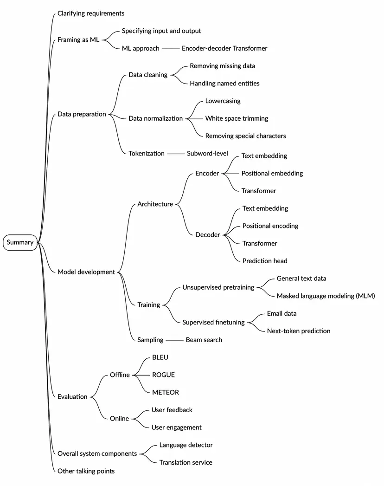

Figure: Mind map summarizing the key aspects of the language translation ML system design

---

## Reference Material

[1] Google Translate service. https://blog.google/products/translate/google-translate-new-languages-2024/  
[2] Neural Machine Translation by Jointly Learning to Align and Translate. https://arxiv.org/abs/1409.0473  
[3] BERT: Pre-training of Deep Bidirectional Transformers for Language Understanding. https://arxiv.org/abs/1810.04805  
[4] GPT models. https://platform.openai.com/docs/models  
[5] Claude models. https://www.anthropic.com/claude  
[6] Bidirectional Long Short-Term Memory (BLSTM) neural networks for reconstruction of top-quark pair decay kinematics. https://arxiv.org/abs/1909.01144  
[7] BPE tokenization. https://huggingface.co/learn/nlp-course/en/chapter6/5  
[8] C4 dataset. https://www.tensorflow.org/datasets/catalog/c4  
[9] Wikipedia dataset. https://www.tensorflow.org/datasets/catalog/wikipedia  
[10] Stack Exchange dataset. https://huggingface.co/datasets/HuggingFaceH4/stack-exchange-preferences  
[11] How Transformers work. https://huggingface.co/learn/nlp-course/en/chapter1/4  
[12] Exploring the Limits of Transfer Learning with a Unified Text-to-Text Transformer. https://arxiv.org/pdf/1910.10683.pdf  
[13] BART: Denoising Sequence-to-Sequence Pre-training for Natural Language Generation, Translation, and Comprehension. https://arxiv.org/abs/1910.13461  
[14] mT5: A massively multilingual pre-trained text-to-text transformer. https://arxiv.org/abs/2010.11934  
[15] Multilingual denoising pre-training for neural machine translation. https://arxiv.org/abs/2001.08210  
[16] BLEU metric. https://en.wikipedia.org/wiki/BLEU  
[17] ROUGE metric. https://en.wikipedia.org/wiki/ROUGE_(metric)  
[18] METEOR metric. https://www.cs.cmu.edu/~alavie/METEOR/pdf/Banerjee-Lavie-2005-METEOR.pdf  
[19] WordNet. https://wordnet.princeton.edu/  
[20] No Language Left Behind: Scaling Human-Centered Machine Translation. https://research.facebook.com/publications/no-language-left-behind/  
[21] Decoder-Only or Encoder-Decoder? Interpreting Language Model as a Regularized Encoder-Decoder. https://arxiv.org/abs/2304.04052  
[22] Towards Continual Learning for Multilingual Machine Translation via Vocabulary Substitution. https://arxiv.org/abs/2103.06799  
[23] Efficient Inference For Neural Machine Translation. https://arxiv.org/abs/2010.02416  
[24] Meta's multilingual model. https://ai.meta.com/blog/nllb-200-high-quality-machine-translation/  
[25] Machine translation evaluation. https://en.wikipedia.org/wiki/Evaluation_of_machine_translation  
[26] Word error rate (WER) metric. https://en.wikipedia.org/wiki/Word_error_rate  
[27] Automatic Language Identification using Deep Neural Networks. https://research.google.com/pubs/archive/42538.pdf