# 02. Visual Search System

A system helps users discover images that are visually similar to a selected image. In this chapter, we design a visual search system similar to Pinterest's [1] [2].

<p align="center">Figure 2.1: Retrieved images that are visually similar to the selected crop</p>

---

## Clarifying Requirements

Here's a typical interaction between a candidate and an interviewer.

**Candidate:** Should we rank the results from most similar to least similar?
**Interviewer:** Images that appear first in the list should be more similar to the query image.

**Candidate:** Should the system support videos, too?
**Interviewer:** Let's focus only on images.

**Candidate:** A platform like Pinterest allows users to select an image crop and retrieve similar images. Should we support that functionality?
**Interviewer:** Yes.

**Candidate:** Are the displayed images personalized to the user?
**Interviewer:** For simplicity, let's not focus on personalization. A query image yields the same results, regardless of who searches for it.

**Candidate:** Can the model use the metadata of the query image, such as image tags?
**Interviewer:** In practice, the model uses image metadata. But for simplicity, let's assume we don't rely on the metadata, but only on the image pixels.

**Candidate:** Can users perform other actions such as save, share, or like? These actions can help label training data.
**Interviewer:** Great point. For simplicity, let's assume the only supported action is image clicks.

**Candidate:** Should we moderate the images?
**Interviewer:** It's important to keep the platform safe, but content moderation is out of scope.

**Candidate:** We can construct training data online and label them based on user interactions. Is this the expected way to construct training data?
**Interviewer:** Yes, that sounds reasonable.

**Candidate:** How fast should the search be? Assuming we have 100-200 billion images on the platform, the system should be able to retrieve similar images quickly. Is that a reasonable assumption?
**Interviewer:** Yes, that is a reasonable assumption.

Let's summarize the problem statement. We are asked to design a visual search system. The system retrieves images similar to the query image provided by the user, ranks them based on their similarities to the query image, and then displays them to the user. The platform only supports images, with no video or text queries allowed. For simplicity, no personalization is required.

---

## Frame the Problem as an ML Task

In this section, we choose a well-defined ML objective and frame the visual search problem as an ML task.

### Defining the ML objective

In order to solve this problem using an ML model, we need to create a well-defined ML objective. A potential ML objective is to accurately retrieve images that are visually similar to the image the user is searching for.

### Specifying the system's input and output

The input of a visual search system is a query image provided by the user. The system outputs images that are visually similar to the query image, and the output images are ranked by similarities. Figure 2.2 shows the input and output of a visual search system.
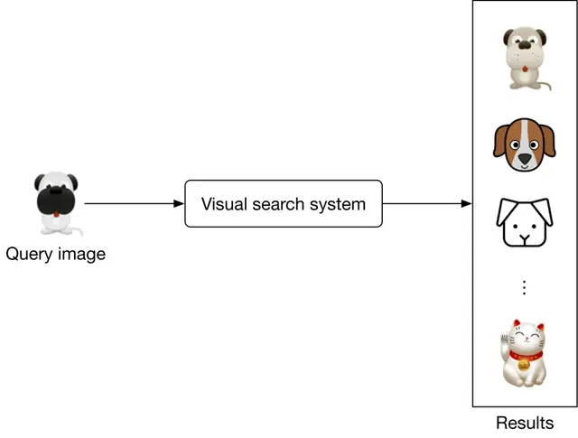
<p align="center">Figure 2.2: A visual search system's input-output</p>

### Choosing the right ML category

The output of the model is a set of ranked images that are similar to the query image. As a result, visual search systems can be framed as a **ranking problem**. In general, the goal of ranking problems is to rank a collection of items, such as images, websites, products, etc., based on their relevance to a query, so that more relevant items appear higher in the search results. Many ML applications, such as recommendation systems, search engines, document retrieval, and online advertising, can be framed as ranking problems. In this chapter, we will use a widely-used approach called **representation learning**. Let's examine this in more detail.

**Representation learning.** In representation learning [3], a model is trained to transform input data, such as images, into representations called **embeddings**. Another way of describing this is that the model maps input images to points in an N-dimensional space called **embedding space**. These embeddings are learned so that similar images have embeddings that are in close proximity to each other, in the space. Figure 2.3 illustrates how two similar images are mapped onto two points in close proximity within the embedding space.
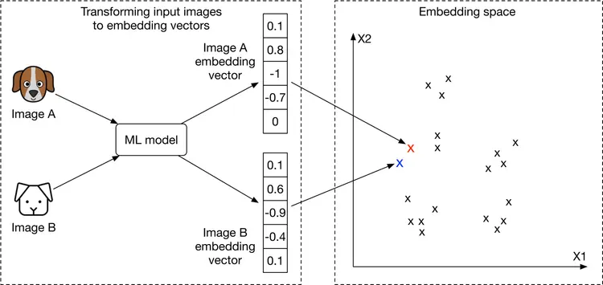
<p align="center">Figure 2.3: Similar images in the embedding space</p>

**How to rank images using representation learning?**

First, the input images are transformed into embedding vectors. Next, we calculate the similarity scores between the query image and other images on the platform by measuring their distances in the embedding space. The images are ranked by similarity scores, as shown in Figure 2.4.
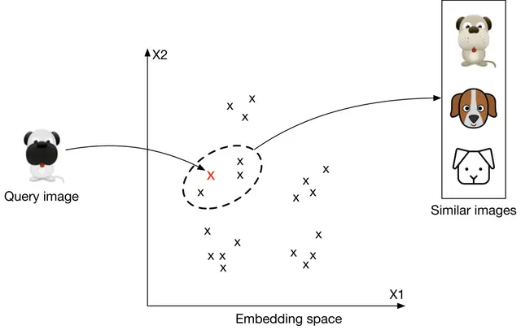
<p align="center">Figure 2.4: Top 3 images similar to the query image</p>

At this point, you may have many questions, including how to ensure similar images are placed close to each other in the embedding space, how to define the similarity, and how to train such a model. We will talk more about these in the model development section.

---

## Data Preparation

### Data engineering

Aside from generic data engineering fundamentals, it's important to understand what data is available. As a visual search system mainly focuses on users and images, we have the following data available: Images, Users, and User-image interactions.

#### Images

Creators upload images, and the system stores the images and their metadata, such as owner id, contextual information (e.g., upload time), tags, etc. Table 2.1 shows a simplified example of image metadata.

| ID | Owner ID | Upload time | Manual tags |
|---|---|---|---|
| 1 | 8 | 1658451341 | Zebra |
| 2 | 5 | 1658451841 | Pasta, Food, Kitchen |
| 3 | 19 | 1658821820 | Children, Family, Party |

*Table 2.1: Image metadata*

#### Users

User data contains demographic attributes associated with users, such as age, gender, etc. Table 2.2 shows an example of user data.

| ID | Username | Age | Gender | City | Country | Email |
|---|---|---|---|---|---|---|
| 1 | johnduo | 26 | M | San Jose | USA | john@gmail.com |
| 2 | hs2008 | 49 | M | Paris | France | hsieh@gmail.com |
| 3 | alexish | 16 | F | Rio | Brazil | alexh@yahoo.com |

*Table 2.2: User data*

#### User-image interactions

Interaction data contains different types of user interactions. Based on the requirements gathered, the primary types of interactions are impressions and clicks. Table 2.3 shows an overview of interaction data.

| User ID | Query image ID | Displayed image ID | Position in the displayed list | Interaction type | Location (lat, long) | Timestamp |
|---|---|---|---|---|---|---|
| 8 | 2 | 6 | 1 | Click | 38.8951 -77.0364 | 1658450539 |
| 6 | 3 | 9 | 2 | Click | 38.8951 -77.0364 | 1658451341 |
| 91 | 5 | 1 | 2 | Impression | 41.9241 -89.0389 | 1658451365 |

*Table 2.3: User-image interaction data*

### Feature engineering

In this section, you are expected to talk about engineering great features and preparing them as model inputs. In the earlier "Framing the problem as an ML task" section, we framed the visual search system as a ranking problem and used representation learning to solve it. In particular, we employed a model which expects an image as input. The image needs to be preprocessed before being passed to the model. Let's take a look at common image preprocessing operations:

- **Resizing:** Models usually require fixed image sizes (e.g., 224×224)
- **Scaling:** Scale pixel values of the image to the range of 0 and 1
- **Z-score normalization:** Scale pixel values to have a mean of 0 and variance of 1
- **Consistent color mode:** Ensuring images have a consistent color mode (e.g., RGB or CMYK)

---

## Model Development

### Model selection

We choose neural networks because:

- Neural networks are good at handling unstructured data, such as images and text.
- Unlike many traditional machine learning models, neural networks are able to produce the embeddings we need for representation learning.

What types of neural network architectures should we use? It is essential that the architecture works with images. CNN-based architectures such as ResNet [4] or more recent Transformer-based architectures [5] such as ViT [6] perform well with image inputs. Figure 2.5 shows a simplified model architecture that transforms the input image into an embedding vector. The number of convolution layers, the number of neurons in fully-connected layers, and the size of the embedding vector are hyperparameters typically chosen via experimentation.
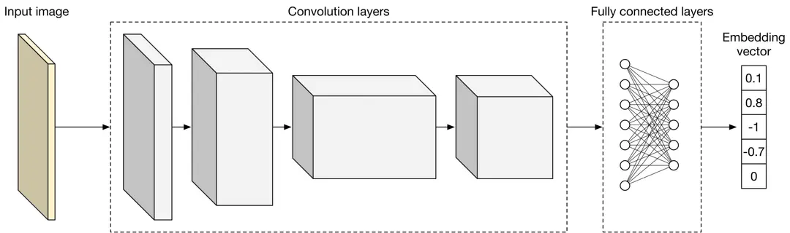
<p align="center">Figure 2.5: A simplified model architecture</p>

### Model training

In order to retrieve visually similar images, a model must learn representations (embeddings) during training. In this section, we discuss how to train a model to learn image representations.

A common technique for learning image representations is **contrastive training** [7]. With this technique, we train the model to distinguish similar and dissimilar images. As Figure 2.6 shows, we provide the model with a query image (left), one similar image to the query image (highlighted dog image on the right), and a few dissimilar images (also right.) During training, the model learns to produce representations in which the similar image more closely resembles the query image, than do other images on the right side of Figure 2.6.
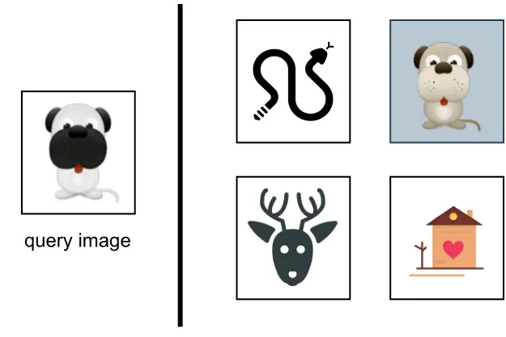
<p align="center">Figure 2.6: Contrastive training</p>

To train the model using the contrastive training technique, we first need to construct training data.

#### Constructing the dataset

As described earlier, each data point used for training contains a query image, a positive image that's similar to the query image, and n−1 negative images that are dissimilar to the query image. The ground truth label of the data point is the index of the positive image. As Figure 2.7 shows, along with the query image (q), we have n other images, of which one is similar to q, and the other n−1 images are dissimilar.
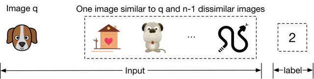
<p align="center">Figure 2.7: Training data point</p>

To construct a training data point, we randomly choose a query image and n−1 images as negative images. To select a positive image, we have the following three options:

- Use human judgment
- Use interactions such as user clicks as a proxy for similarity
- Artificially create a similar image from the query image, known as self-supervision

Let's evaluate each option.

**Use human judgments**

This approach relies on human contractors manually finding similar images. Human involvement produces accurate training data, but using human annotators is expensive and time-consuming.

**Use interactions such as user click as a proxy for similarity**

In this approach, we measure similarity based on interaction data. As an example, when a user clicks on an image, the clicked image is considered to be similar to the query image q.

This approach does not require manual work and can generate training data automatically. However, the click signal is usually very noisy. Users sometimes click on images even when the image is not similar to the query image. Additionally, this data is very sparse, and we may not have click data available for lots of the images. The use of noisy and sparse training data leads to poor performance.

**Artificially create a similar image from the query image**

In this approach, we artificially create a similar image from the query image. For example, we can augment the query image by rotating it and using the newly generated image as a similar image. Recently developed frameworks such as SimCLR [7] and MoCo [8] use the same approach.
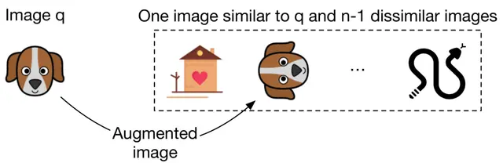
<p align="center">Figure 2.8: Use data augmentation to create a similar image</p>

An advantage of this method is that no manual work is required. We can implement simple data augmentation logic to create similar images. In addition, the constructed training data is not noisy, since augmenting an image always results in a similar image. The major drawback of this approach is that the constructed training data differs from the real data. In practice, similar images are not augmented versions of the query image; they are visually and semantically similar, but are distinct.

**Which approach works best in our case?**

In an interview setting, it's critical you propose various options and discuss their tradeoffs. Here, we use the self-supervision option for two reasons. Firstly, there is no upfront cost associated with it, since the process can be automated. Secondly, various frameworks such as SimCLR [7] have shown promising results when trained on a large dataset. Since we have access to billions of images on the platform, this approach might be a good fit.

We can always switch to other labeling methods if the experiment results are unsatisfactory. For example, we can start with the self-supervision option and later use click data for labeling. We can also combine the options. For example, we may use clicks to build our initial training data and rely on human annotators to identify and remove noisy data points. Discussing different options and trade-offs with the interviewer is critical to make good design decisions.

#### Choosing the loss function

As Figure 2.9 shows, the model takes images as input and produces an embedding for each input image. E_x denotes the embedding of the image x.
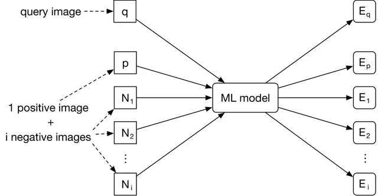
<p align="center">Figure 2.9: Model input-output</p>

The goal of the training is to optimize the model parameters so that similar images have embeddings close to each other in the embedding space. As Figure 2.10 shows, the positive image and the query image should become closer during training.
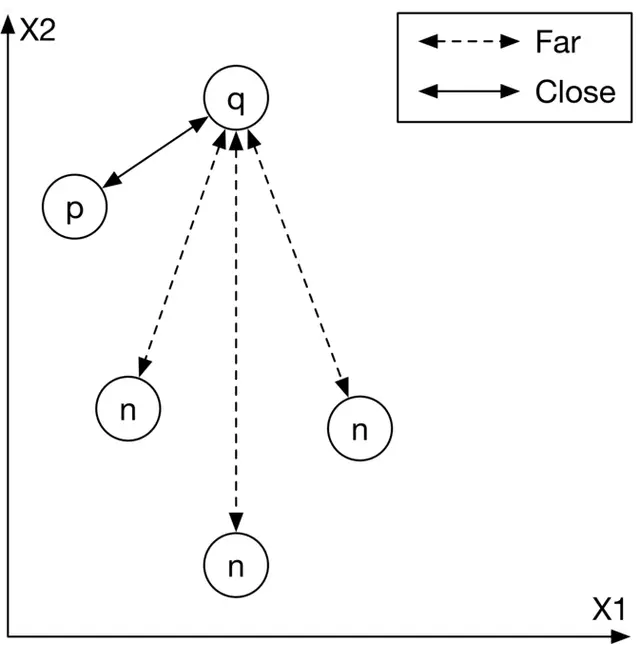
<p align="center">Figure 2.10: Input images mapped into the embedding space</p>

To achieve this goal, we need to use a loss function to measure the quality of the produced embeddings. We are going to briefly discuss how a simplified contrastive loss operates.
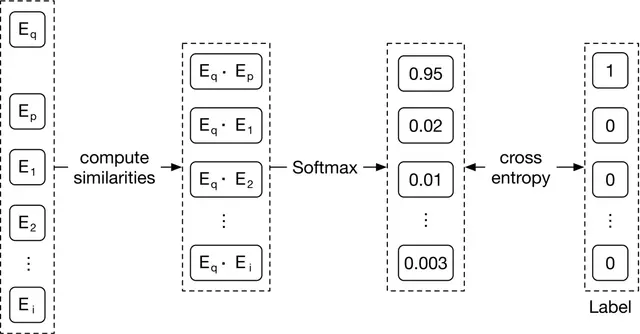
<p align="center">Figure 2.11: A simplified contrastive loss</p>

As Figure 2.11 shows, we compute the contrastive loss in three steps:

1. **Compute similarities.** First, we compute the similarities between the query image and the embeddings of other images. Dot product [10] and cosine similarity [11] are widely used to measure the similarity between points in the embedding space. Euclidean distance [12] can also measure the similarity. However, Euclidean distance usually performs poorly in high dimensions because of the curse of dimensionality [13].

2. **Softmax.** A softmax function is applied over the computed distances. This ensures the values sum up to one, which allows the values to be interpreted as probabilities.

3. **Cross-entropy.** Cross-entropy [15] measures how close the predicted probabilities are to the ground truth labels. When the predicted probabilities are close to the ground truth, it shows that the embeddings are good enough to distinguish the positive image from the negative ones.

In the interview, you can also discuss the possibility of using a pre-trained model. For example, we could leverage a pre-trained contrastive model and fine-tune it using the training data. These pre-trained models have already been trained on large datasets, and therefore they have learned good image representations. This significantly reduces the training time compared to training a model from scratch.

---

## Evaluation

After we develop the model, we can discuss the evaluation. In this section, we cover important metrics for offline and online evaluations.

### Offline metrics

Based on the given requirements, an evaluation dataset is available for offline evaluation. Let's assume each data point has a query image, a few candidate images, and a similarity score for each candidate image and the query image pair. A similarity score is an integer number between 0 to 5, where 0 indicates no similarity and 5 indicates two images are visually and semantically very similar.
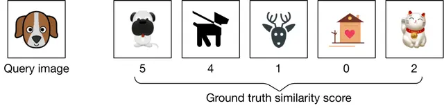
<p align="center">Figure 2.12: A data point from the evaluation dataset</p>

Now, let's examine offline metrics that are commonly used in search systems. Note that search, information retrieval, and recommendation systems usually share the same offline metrics: Mean reciprocal rank (MRR), Recall@k, Precision@k, Mean average precision (mAP), and Normalized discounted cumulative gain (nDCG).

#### MRR

This metric measures the quality of the model by considering the rank of the first relevant item in each output list produced by the model, and then averaging them. The formula is:

```
MRR = (1/m) * Σ(1/rank_i)  for i=1 to m
```

Where m is the total number of output lists and rank_i refers to the rank of the first relevant item in the ith output list.
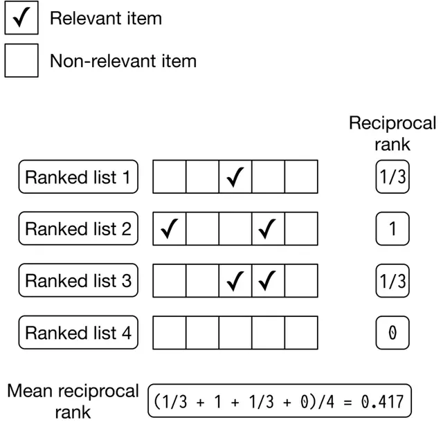
<p align="center"><p align="center">Figure 2.13: MRR calculation example</p></p>

Let's examine the shortcoming of this metric. Since MRR considers only the first relevant item and ignores other relevant items in the list, it does not measure the precision and ranking quality of a ranked list. Given this shortcoming, we will not use this metric.
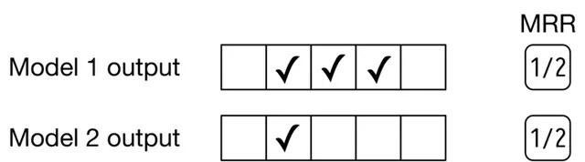
<p align="center"><p align="center">Figure 2.14: MRR of two different models</p></p>

#### Recall@k

This metric measures the ratio between the number of relevant items in the output list and the total number of relevant items available in the entire dataset. The formula is:

```
recall@k = (number of relevant items among the top k items) / (total relevant items)
```

Even though recall@k measures how many relevant items the model failed to include in the output list, this isn't always a good metric. In some systems, such as search engines, the total number of relevant items can be very high. This negatively affects the recall as the denominator is very large. Given recall@k doesn't measure the ranking quality of the model, we will not use it.

#### Precision@k

This metric measures the proportion of relevant items among the top k items in the output list. The formula is:

```
precision@k = (number of relevant items among the top k items) / k
```

This metric measures how precise the output lists are, but it doesn't consider the ranking quality. This metric is not ideal for our use case, since we need to measure both the precision and ranking quality of the results.
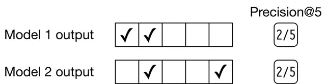
<p align="center"><p align="center">Figure 2.15: Precision@5 of two different models</p></p>

#### mAP

This metric first computes the average precision (AP) for each output list, and then averages AP values.

Let's first understand what AP is. It takes a list of k items, such as images, and averages the precision@k at different values of k. AP is high if more relevant items are located at the top of the list. For a list of size k, the AP formula is:

```
AP = Σ(Precision@i if i'th item is relevant) / total relevant items  for i=1 to k
```
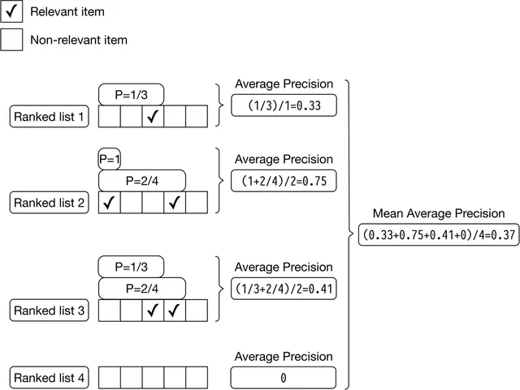
<p align="center"><p align="center">Figure 2.16: mAP calculations</p></p>

Since we average precisions, the overall ranking quality of the list is considered. However, mAP is designed for binary relevances; in other words, it works well when each item is either relevant or irrelevant. For continuous relevance scores, nDCG is a better choice.

#### nDCG

This metric measures the ranking quality of an output list and shows how good the ranking is, compared to the ideal ranking.

**What is DCG?**

DCG calculates the cumulative gain of items in a list by summing up the relevance score of each item. Then the score is accumulated from the top of the output list to the bottom, with the score of each result discounted at lower ranks. The formula is:

```
DCG_p = Σ(rel_i / log2(i+1))  for i=1 to p
```

Where rel_i is the ground truth relevance score of the image ranked at location i.

**What is nDCG?**

Because DCG sums up the relevance scores of items and discounts their positions, the result of DCG could be any value. In order to get a more meaningful score, we need to normalize DCG. For this, nDCG divides the DCG by the DCG of an ideal ranking. The formula is:

```
nDCG_p = DCG_p / IDCG_p
```

Where IDCG_p is the DCG of the ideal ranking (a ranking ordered by the relevance scores of items). Note that in a perfect ranking system, the DCG is equal to IDCG.

Let's use an example to better understand nDCG. In Figure 2.17, we can see a list of output images and their associated ground truth relevance scores produced by a search system.
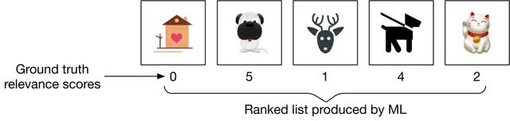
<p align="center"><p align="center">Figure 2.17: A ranked list produced by a search system</p></p>

We can compute nDCG in 3 steps:

**Compute DCG:** The DCG for the current ranking produced by the model is:

```
DCG_p = 0/log2(2) + 5/log2(3) + 1/log2(4) + 4/log2(5) + 2/log2(6) = 6.151
```

**Compute IDCG:** The ideal ranking calculation is the same as the DCG calculation, except that it recommends the most relevant items first (Figure 2.18).
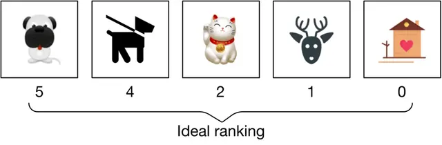
<p align="center"><p align="center">Figure 2.18: Ideal ranking list</p></p>

The IDCG for the ideal ranking is:

```
IDCG_p = 5/log2(2) + 4/log2(3) + 2/log2(4) + 1/log2(5) + 0/log2(6) = 8.9543
```

**Divide DCG by IDCG:**

```
nDCG_p = DCG_p / IDCG_p = 6.151 / 8.9543 = 0.6869
```

nDCG works well most times. Its primary shortcoming is that deriving ground truth relevance scores is not always possible. In our case, since the evaluation dataset contains similarity scores, we can use nDCG to measure the performance of the model during the offline evaluation.

### Online metrics

In this section, we explore a few commonly used online metrics for measuring how quickly users can discover images they like.

**Click-through rate (CTR).** This metric shows how often users click on the displayed items. CTR can be calculated using the following formula:

```
CTR = Number of clicked images / Total number of suggested images
```

A high CTR indicates that users click on the displayed items often. CTR is commonly used as an online metric in search and recommendation systems.

**Average daily, weekly, and monthly time spent on the suggested images.** This metric shows how engaged users are with the suggested images. When the search system is accurate, we expect this metric to increase.

---

## Serving

At serving time, the system returns a ranked list of similar images based on a query image. Figure 2.19 shows the prediction pipeline and an indexing pipeline.
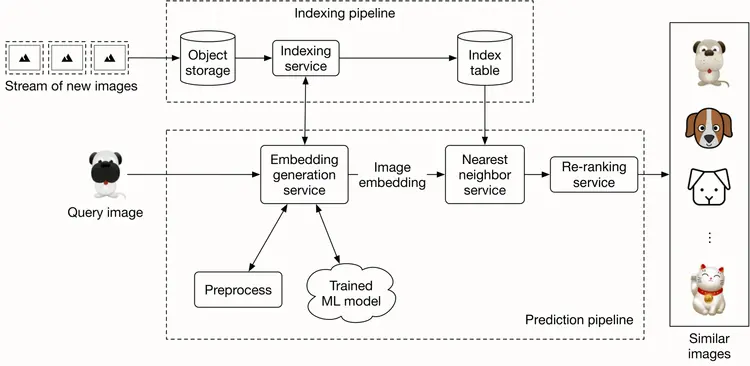
<p align="center"><p align="center">Figure 2.19: Prediction and indexing pipeline</p></p>

### Prediction pipeline

#### Embedding generation service

This service computes the embedding of the input query image. As Figure 2.20 shows, it preprocesses the image and uses the trained model to determine the embedding.
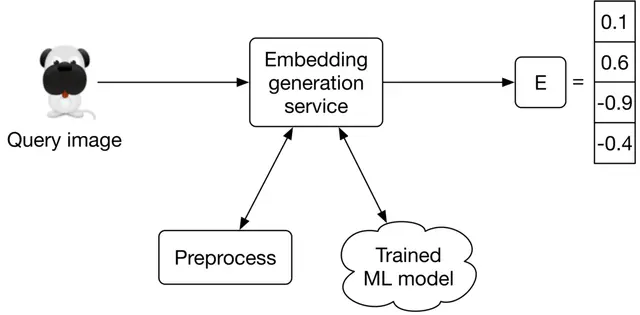
<p align="center"><p align="center">Figure 2.20: Embedding generation service</p></p>

#### Nearest neighbor service

Once we get the embedding of the query image, we need to retrieve similar images from the embedding space. The nearest neighbor service does this.

Let's define the nearest neighbor search more formally. Given a query point "q" and a set of other points S, it finds the closest points to "q" in set S. Note that an image embedding is a point in N-dimensional space, where N is the size of the embedding vector. Figure 2.21 shows the top 3 nearest neighbors of image q.
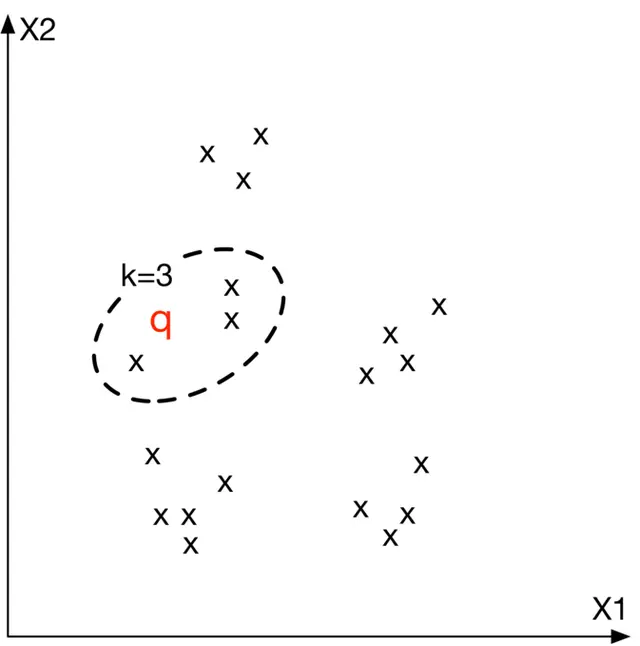
<p align="center"><p align="center">Figure 2.21: Top 3 nearest neighbors to image q in the embedding space</p></p>

#### Re-ranking service

This service incorporates business-level logic and policies. For example, it filters inappropriate results, ensures we don't include private images, removes duplicates or near-duplicate results, and enforces other similar logic before displaying the final results to the user.

### Indexing pipeline

#### Indexing service

All images on the platform are indexed by this service to improve search performance.

Another responsibility of the indexing service is to keep the index table updated. For example, when a creator adds a new image to the platform, the service indexes the embedding of the new image to make it discoverable by the nearest neighbor search.

Indexing increases memory usage because we store the embeddings of the entire images in an index table. Various optimizations are available to reduce memory usages, such as vector quantization [16] and product quantization [17].

### Performance of nearest neighbor (NN) algorithms

Nearest neighbor search is a core component of information retrieval, search, and recommendation systems. A slight improvement in its efficiency leads to significant overall performance improvement. Given how critical this component is, the interviewer may want you to deep dive into this topic.

NN algorithms can be divided into two categories: exact and approximate.

#### Exact nearest neighbor

Exact nearest neighbor, also called linear search, is the simplest form of NN. It works by searching the entire index table, calculating the distance of each point with the query point q, and retrieving the k nearest points. The time complexity is O(N×D), where N is the total number of points and D is the point dimension.

In a large-scale system in which N may easily run into the billions, the linear time complexity is too slow.

#### Approximate nearest neighbor (ANN)

In many applications, showing users similar enough items is sufficient, and there is no need to perform an exact nearest neighbor search.

In ANN algorithms, a particular data structure is used to reduce the time complexity of NN search to sublinear (e.g., O(D×logN)). They usually require up-front preprocessing or additional space.

ANN algorithms can be divided into the following three categories: Tree-based ANN, Locality-sensitive hashing (LSH)-based ANN, and Clustering-based ANN.

**Tree-based ANN**

Tree-based algorithms form a tree by splitting the space into multiple partitions. Then, they leverage the characteristics of the tree to perform a faster search.

We form the tree by iteratively adding new criteria to each node. In the tree, non-leaf nodes split the space into two partitions given the criterion. Leaf nodes indicate a particular region in space. Figure 2.22 shows a formed tree from the points.
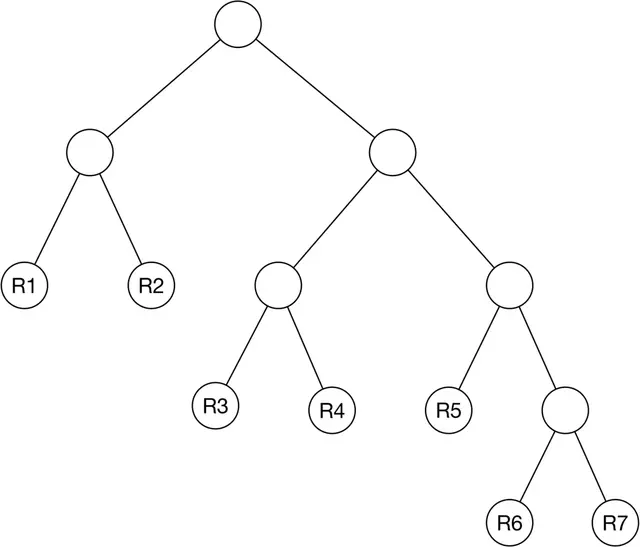
<p align="center">*Figure 2.22: A formed tree from the points*</p>

The algorithm only searches the partition that the query point belongs to. Figure 2.23 shows an example of the space divided into 7 regions.
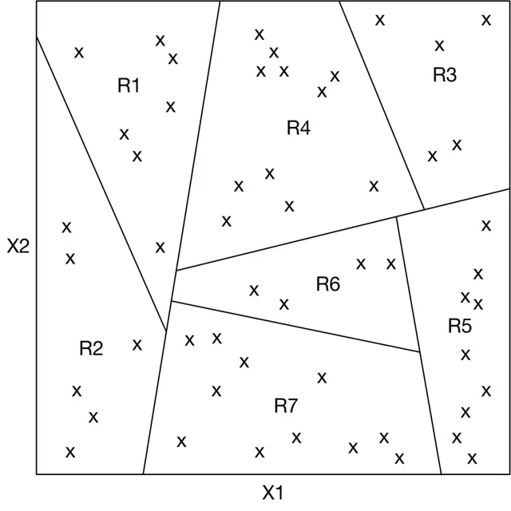
<p align="center">Figure 2.23: Partitioned space by the tree</p>

Typical tree-based methods are R-trees [18], Kd-trees [19], and Annoy (Approximate Nearest Neighbor Oh Yeah) [20].

**Locality sensitive hashing (LSH)**

LSH uses particular hash functions to reduce the dimensions of points and group them into buckets. These hash functions map points in close proximity to each other into the same bucket. LSH searches only those points belonging to the same bucket as the query point q.
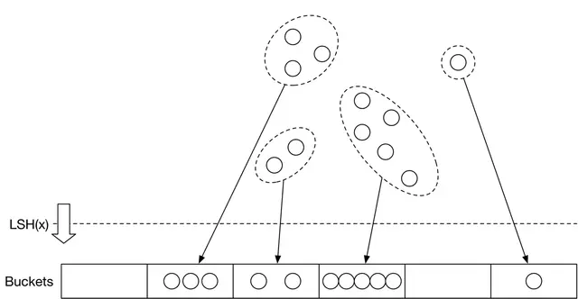
<p align="center">Figure 2.24: Use LSH to group the data points into buckets</p>

**Clustering-based ANN**

These algorithms form clusters by grouping the points based on similarities. Once the clusters are formed, the algorithms search only the subset of points in the cluster to which the query point belongs.

**Which algorithm should we use?**

Results from the exact nearest neighbor method are guaranteed to be accurate. This makes it a good option when we have limited data points, or if it's required to have the exact nearest neighbors. However, when there are a large number of points, it's impractical to run the algorithm efficiently. In this case, ANN methods are commonly used. While they may not return the exact points, they are more efficient in finding the nearest points.

Given the amount of data available in today's systems, the ANN method is a more pragmatic solution. In our visual search system, we use ANN to find similar image embeddings.

For an applied ML role, the interviewer may ask you to implement ANN. Two widely-used libraries are Faiss [22] (developed by Meta) and ScaNN [23] (developed by Google). Each supports the majority of methods we have described in this chapter.

---

## Other Talking Points

If there is extra time at the end of the interview, you might be asked follow-up questions or challenged to discuss advanced topics. Some topics to prepare for, especially for senior roles, are listed below.

- Moderate content in the system by identifying and blocking inappropriate images [24].
- Different biases present in the system, such as positional bias [25][26].
- How to use image metadata such as tags to improve search results. This is covered in Chapter 3 Google Street View Blurring System.
- Smart crop using object detection [27].
- How to use graph neural networks to learn better representations [28].
- Support the ability to search images by a textual query. We examine this in Chapter 4.
- How to use active learning [29] or human-in-the-loop [30] ML to annotate data more efficiently.

---

## References

[1] Visual search at Pinterest. https://arxiv.org/pdf/1505.07647.pdf

[2] Visual embeddings for search at Pinterest. https://medium.com/pinterest-engineering/unifying-visual-embeddings-for-visual-search-at-pinterest-74ea7ea103f0

[3] Representation learning. https://en.wikipedia.org/wiki/Feature_learning

[4] ResNet paper. https://arxiv.org/pdf/1512.03385.pdf

[5] Transformer paper. https://arxiv.org/pdf/1706.03762.pdf

[6] Vision Transformer paper. https://arxiv.org/pdf/2010.11929.pdf

[7] SimCLR paper. https://arxiv.org/pdf/2002.05709.pdf

[8] MoCo paper.

[9] Contrastive representation learning methods. https://lilianweng.github.io/posts/2019-11-10-self-supervised/

[10] Dot product. https://en.wikipedia.org/wiki/Dot_product

[11] Cosine similarity. https://en.wikipedia.org/wiki/Cosine_similarity

[12] Euclidean distance. https://en.wikipedia.org/wiki/Euclidean_distance

[13] Curse of dimensionality. https://en.wikipedia.org/wiki/Curse_of_dimensionality

[14] Curse of dimensionality issues in ML. https://www.mygreatlearning.com/blog/understanding-curse-of-dimensionality/

[15] Cross-entropy loss. https://en.wikipedia.org/wiki/Cross_entropy

[16] Vector quantization. http://ws.binghamton.edu/fowler/fowler%20personal%20page/EE523_files/Ch_10_1%20VQ%20Description%20(PPT).pdf

[17] Product quantization. https://towardsdatascience.com/product-quantization-for-similarity-search-2f1f67c5fddd

[18] R-Trees. https://en.wikipedia.org/wiki/R-tree

[19] KD-Tree. https://kanoki.org/2020/08/05/find-nearest-neighbor-using-kd-tree/

[20] Annoy. https://towardsdatascience.com/comprehensive-guide-to-approximate-nearest-neighbors-algorithms-8b94f057d6b6

[21] Locality-sensitive hashing. https://web.stanford.edu/class/cs246/slides/03-lsh.pdf

[22] Faiss library. https://github.com/facebookresearch/faiss/wiki

[23] ScaNN library. https://github.com/google-research/google-research/tree/master/scann

[24] Content moderation with ML. https://appen.com/blog/content-moderation/

[25] Bias in AI and recommendation systems. https://www.searchenginejournal.com/biases-search-recommender-systems/339319/#close

[26] Positional bias. https://eugeneyan.com/writing/position-bias/

[27] Smart crop. https://blog.twitter.com/engineering/en_us/topics/infrastructure/2018/Smart-Auto-Cropping-of-Images

[28] Better search with GNNs. https://arxiv.org/pdf/2010.01666.pdf

[29] Active learning. https://en.wikipedia.org/wiki/Active_learning_(machine_learning)

[30] Human-in-the-loop ML. https://arxiv.org/pdf/2108.00941.pdf