# 07. Event Recommendation System

In this chapter, we design an event recommendation system similar to Eventbrite's. Eventbrite is a popular event management and ticketing marketplace which allows users to create, browse, and register events. A recommendation system personalizes the experience and displays events relevant to users.
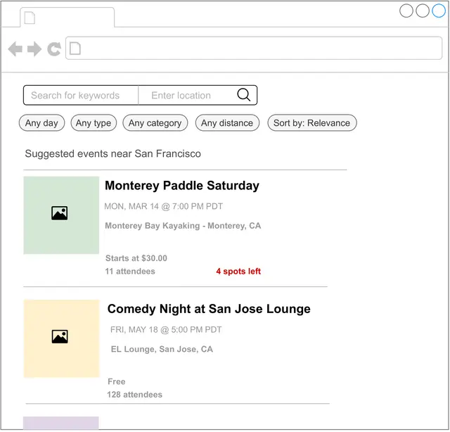
<p align="center">Figure 7.1: Recommended events</p>

---

## Clarifying Requirements

Here is a typical interaction between a candidate and an interviewer.

**Candidate:** What is the business objective? Can I assume the main business objective is to increase ticket sales?
**Interviewer:** Yes, that sounds good.

**Candidate:** Besides attending an event, can users book hotels or restaurants on the platform?
**Interviewer:** For simplicity, let's assume only events are supported.

**Candidate:** An event is considered an ephemeral one-time occurrence item that only happens once, and then expires. Is this assumption correct?
**Interviewer:** That's an excellent observation.

**Candidate:** What event attributes are available? Can I assume we have access to the textual description of the event, price range, location, date and time, etc.?
**Interviewer:** Sure, those are fair assumptions.

**Candidate:** Do we have any annotated data?
**Interviewer:** We don't have a hand-labeled dataset. You can use event and user interaction data to construct the training dataset.

**Candidate:** Do we have access to the user's current location?
**Interviewer:** Yes. Since this problem focuses on a location-based recommendation system, let's assume users agree to share their location data.

**Candidate:** Can users become friends on the platform? Friendship information is valuable for building a personalized event recommendation system.
**Interviewer:** Good question. Yes, let's assume users can form friendships on our platform. A friendship is bidirectional, meaning if A is a friend of B, then B is also a friend of A.

**Candidate:** Can users invite others to events?
**Interviewer:** Yes.

**Candidate:** Can a user RSVP to an event?
**Interviewer:** For simplicity, let's assume only a registration option is available for an event.

**Candidate:** Are the events free or paid?
**Interviewer:** We need to support both.

**Candidate:** How many users and events are available?
**Interviewer:** We host around 1 million total events every month.

**Candidate:** How many daily active users visit the website/app?
**Interviewer:** Assume we have one million unique users per day.

**Candidate:** Since we are building a location-based event recommendation system, it's important to calculate the distance and travel time between two locations efficiently. Can we assume external APIs such as Google Maps API or other map services can be used to obtain such data?
**Interviewer:** Good point. Assume we can use third-party services to obtain location data.

Let's summarize the problem statement. We are asked to design an event recommendation system, which displays a personalized list of events to users. When an event is finished, users can no longer register for it. In addition to registering for events, users can invite others to events and form friendships. The training data should be constructed online from user interactions. The primary goal of this system is to increase total ticket sales.

---

## Frame the Problem as an ML Task

### Defining the ML objective

Based on the requirements, the business objective is to increase ticket sales. One way to translate this into a well-defined ML objective is to **maximize the number of event registrations**.

### Specifying the system's input and output

The input to the system is a user, and the output is the top k events ranked by relevance to the user.

### Choosing the right ML category

There are different ways to solve a recommendation problem: Simple rules (such as recommending popular events), embedding-based models (which rely on content-based or collaborative filtering), and reformulating it into a ranking problem.

Rule-based methods are good starting points to form a baseline. However, ML-based approaches usually lead to better outcomes. In this chapter, we reformulate the task into a ranking problem and use **Learning to Rank (LTR)** to solve it.
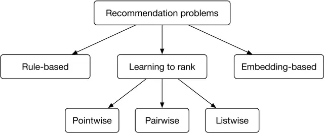
<p align="center">Figure 7.2: Different approaches to solving recommendation problems</p>

LTR is a class of algorithmic techniques that apply supervised machine learning to solve ranking problems. The ranking problem can be formally defined as: "having a query and a list of items, what is the optimal ordering of the items from most relevant to least relevant to the query?" There are generally three LTR approaches: pointwise, pairwise, and listwise.

#### Pointwise LTR

In this approach, we go over each item and predict the relevance between the query and the item, using classification or regression methods. Note that the score of one item is predicted independently of other items.
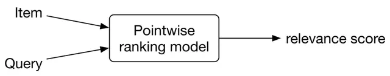
<p align="center">Figure 7.3: Pointwise ranking model</p>

The final ranking is achieved by sorting the predicted relevance scores.

#### Pairwise LTR

In this approach, the model takes two items and predicts which item is more relevant to the query.
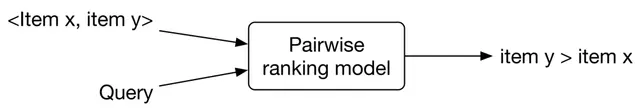
<p align="center">Figure 7.4: Pairwise ranking model</p>

Some of the most popular pairwise LTR algorithms are RankNet [2], LambdaRank [3], and LambdaMART [4].

#### Listwise LTR

Listwise approaches predict the optimal ordering of an entire list of items, given the query.
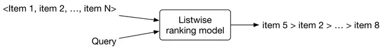
<p align="center">Figure 7.5: Listwise ranking model</p>

Some popular listwise LTR algorithms are SoftRank [5], ListNet [6], and AdaRank [7].

In general, pairwise and listwise approaches produce more accurate results, but they are more difficult to implement and train. For simplicity, we use the pointwise approach for this problem. In particular, we employ a **binary classification model** which takes a single event at a time and predicts the probability that the user will register for it.
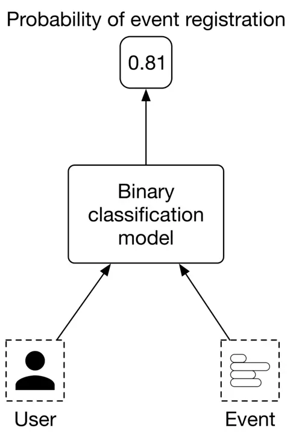
<p align="center">Figure 7.6: Binary classification model</p>

---

## Data Preparation

### Data engineering

To engineer good features, we need first to understand the raw data available in the system. Since an event management platform is mainly centered around users and events, we assume the following data are available: Users, Events, Friendship, and Interactions.

#### Users

| ID | Username | Age | Gender | City | Country | Language | Time zone |
|---|---|---|---|---|---|---|---|

*Table 7.1: User data schema*

#### Events

| ID | Host User ID | Category/Subcategory | Description | Price | Location | Date/Time |
|---|---|---|---|---|---|---|
| 1 | 5 | Music Concert | Dua Lipa Tour in Miami | 200-900 | American Airlines Arena Miami, FL | 09/18/2022 19:00-24:00 |
| 2 | 11 | Sports Basketball | Golden State Warriors vs. Milwaukee Bucks | 140-2500 | Chase Center SF, CA | 09/22/2022 17:00-19:00 |
| 3 | 7 | Art Theater | The Comedy and Magic of Robert Hall | Free | San Jose Improv San Jose, CA | 09/06/2022 18:00-19:30 |

*Table 7.2: Event data*

#### Friendship

| User ID 1 | User ID 2 | Timestamp when friendship was formed |
|---|---|---|
| 28 | 3 | 1658451341 |
| 7 | 39 | 1659281720 |
| 11 | 25 | 1659312942 |

*Table 7.3: Friendship data*

#### Interactions

| User ID | Event ID | Interaction type | Interaction value | Location (lat, long) | Timestamp |
|---|---|---|---|---|---|
| 4 | 18 | Impression | - | 38.8951 -77.0364 | 1658450539 |
| 4 | 18 | Register | Confirmation number | 38.8951 -77.0364 | 1658451341 |
| 4 | 18 | Invite | User 9 | 41.9241 -89.0389 | 1658451365 |

*Table 7.4: Interaction data*

### Feature engineering

Event-based recommendations are more challenging than traditional recommendations. An event is fundamentally different from a movie or a book, as there is no consumption after the event ends. Events are typically short-lived, meaning the time is short between event creation and when it finishes. As a result, there are not many historical interactions available for a given event. For this reason, event-based recommendations are intrinsically cold-start and suffer from a constant new-item problem.

To overcome those issues, we put more effort into feature engineering to create as many meaningful features as possible. In this section, we create features related to each of the following categories: Location-related, Time-related, Social-related, User-related, and Event-related.

#### Location-related features

**How accessible is the event's location?**

- **Walk score:** Walk score is a number between 0 and 100, which measures how walkable an address is, based on the distance to nearby amenities.

| Category | Walk score | Description |
|---|---|---|
| 1 | 90-100 | No car needed |
| 2 | 70-89 | Very walkable |
| 3 | 50-69 | Somewhat walkable |
| 4 | 25-49 | Car-dependent |
| 5 | 0-24 | Requires a car |

*Table 7.5: Walk score categories*

- **Walk score similarity:** The difference between the event's walk score and the user's average walk score of previous events registered by the user.
- Transit score, transit score similarity, bike score, bike score similarity.

**Is the event in the same country and city as the user?**

- If the user's country is the same as the event's country, this feature is 1, otherwise 0.
- If the user's city is the same as the event's city, this feature is 1, otherwise 0.

**Is the user comfortable with the distance?**

The distance between the user's location and the event's location can be bucketized into categories:
- 0: less than a mile
- 1: 1-5 miles
- 2: 5-20 miles
- 3: 20-50 miles
- 4: 50-100 miles
- 5: +100 miles

**Distance similarity:** Difference between the distance to an event and the average distance to events previously registered by the user.
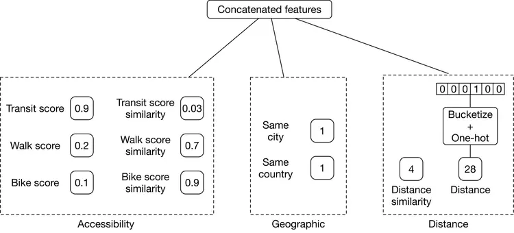
<p align="center">Figure 7.7: Location-related features</p>

#### Time-related features

**How convenient is the time remaining until an event?**

The remaining time until the event begins can be bucketized:
- 0: less than 1 hour left until the event starts
- 1: 1-2 hours
- 2: 2-4 hours
- 3: 4-6 hours
- 4: 6-12 hours
- 5: 12-24 hours
- 6: 1-3 days
- 7: 3-7 days
- 8: +7 days

Additional features include remaining time similarity, estimated travel time from the user's location to the event's location, and estimated travel time similarity.

**Are the date and time convenient for the user?**

Some users may prefer events that occur at weekends, while others prefer weekdays. We use a user profile vector of size 7, where each value counts the number of events the user attended on a particular day. By dividing these values by the total number of attended events, we get the historical rate of event attendance for each day of the week.
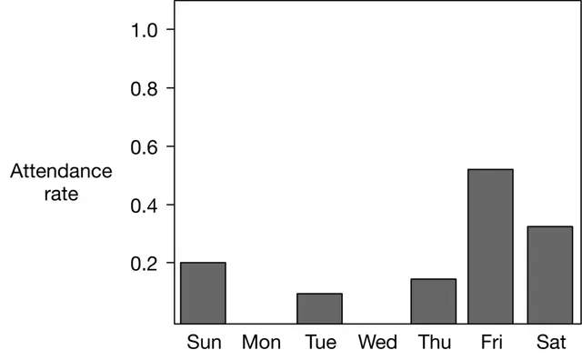
<p align="center">Figure 7.8: Per-day distribution of the event data</p>

Similarly, we add day similarity and hour similarity features.
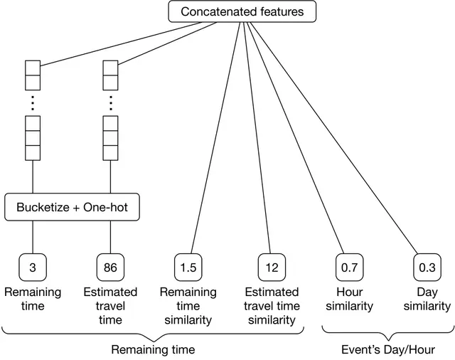
<p align="center">Figure 7.9: Time-related features overview</p>

#### Social-related features

**How many people are attending this event?**

- Number of users registered for this event
- The ratio of the total number of registered users to the number of impressions
- Registered user similarity: The difference between the number of registered users for the event in question and previously registered events

**Features related to attendance by friends**

A user is more likely to register for an event if their friends are attending it:
- Number of the user's friends who registered for this event
- The ratio of the number of registered friends to the total number of friends
- Registered friend similarity

**Is the user invited to this event by others?**

- The number of friends who invited this user to the event
- The number of fellow users who invited this person to the event

**Is the event's host a friend of the user?**

Binary feature: if the event's host is the user's friend, this value is 1, otherwise 0.

**How often has the user attended previous events created by this host?**

This captures whether users follow a particular host's events.

#### User-related features

**Age and gender**

- User's gender, encoded with one-hot encoding
- User's age, bucketized into multiple categories and encoded with one-hot encoding

#### Event-related features

**Price of event:**

Event's price, bucketized into categories:
- 0: Free
- 1: $1-$99
- 2: $100-$499
- 3: $500-$1,999
- 4: +$2,000

**Price similarity:** Difference between the price of the event in question and the average price of events previously registered for by the user.

**How similar is this event's description to previously registered descriptions?**

A feature representing the similarity between the event's description and the descriptions of previously registered events by the user. The description is converted into a numerical vector using TF-IDF, and similarity is calculated using cosine distance.
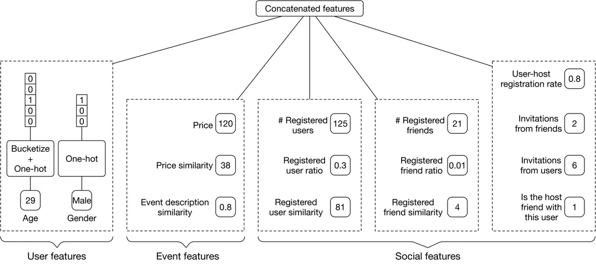
<p align="center">Figure 7.10: User, event, and social features</p>

The features listed above are not exhaustive. Here are some potential talking points worth elaborating on:

- **Batch vs. streaming features:** Batch (static) features change less frequently (e.g., age, gender, event description) and can be computed periodically. Streaming (dynamic) features change quickly (e.g., number of users registered for an event, remaining time until an event).
- **Feature computation efficiency:** Instead of computing the distance as a feature, we can pass both locations to the model and rely on the model to implicitly compute useful information.
- **Using a decay factor** for features that rely on the user's last X interactions to give more weight to recent behaviors.
- **Using embedding learning** to convert each event and user into an embedding vector.
- **Creating features from users' attributes may create bias,** such as relying on age or gender to make recommendations.

---

## Model Development

### Model selection

Binary classification problems can be solved by various ML methods. Let's take a look at the following: Logistic regression, Decision tree, Gradient-boosted decision tree (GBDT), and Neural network.

#### Logistic regression (LR)

LR models the probability of a binary outcome by using a linear combination of one or multiple features.
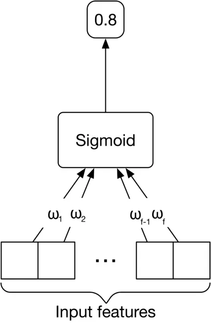
<p align="center">Figure 7.11: Logistic regression</p>

**Pros:**
- Fast inference speed.
- Efficient training.
- Works well when the data is linearly separable.
- Interpretable and easy to understand.

**Cons:**
- Non-linear problems can't be solved with LR.
- Multicollinearity (when two or more features are highly correlated) limits LR's performance.
- The number of input features can be very large with complex non-linear relations, which LR may struggle to learn.
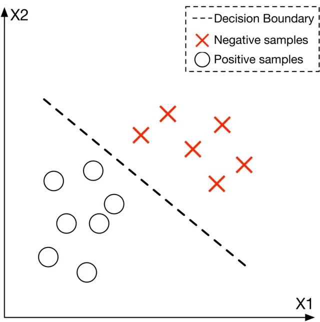
<p align="center">Figure 7.12: A linearly separable data with LR's decision boundary</p>

#### Decision tree

Decision trees use a tree-like model of decisions and their possible consequences to make predictions.
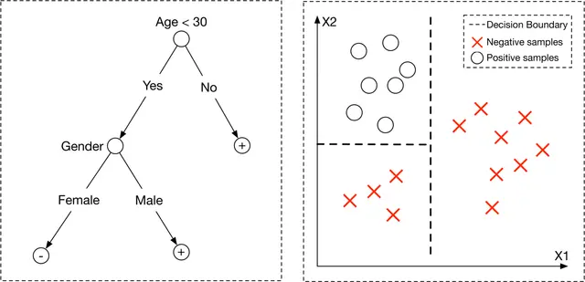
<p align="center">Figure 7.13: Decision tree (left) and the learned decision boundary (right)</p>

**Pros:**
- Fast training and inference.
- Little to no data preparation required.
- Interpretable and easy to understand.

**Cons:**
- Non-optimal decision boundary: produces decision boundaries that are parallel to the axes in the feature space.
- Overfitting: very sensitive to small variations in data.

To reduce the sensitivity of decision trees, two techniques are commonly used: Bootstrap aggregation (Bagging) and Boosting.

**Bagging**

Bagging is the ensemble learning method that trains a set of ML models in parallel, on multiple subsets of the training data. One example of bagging is the commonly used "random forest" model [12]. Random forest builds multiple decision trees in parallel during training and uses a voting mechanism to combine predictions.
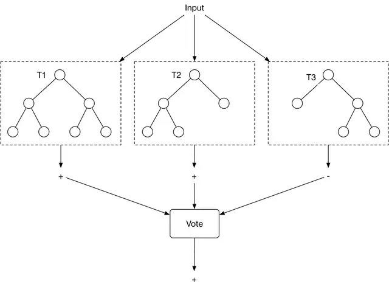
<p align="center">Figure 7.14: Random forest</p>

Bagging reduces the effect of overfitting (high variance) and does not significantly increase training or inference time because decision trees can be processed in parallel. However, bagging is not helpful when the model faces underfitting (high bias).

**Boosting**

In ML, boosting involves training several weak classifiers sequentially to reduce prediction errors. Multiple weak classifiers are converted into a single strong learning model.
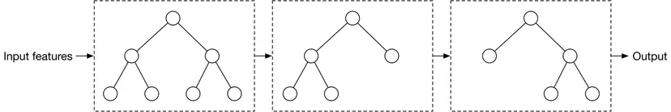
<p align="center">Figure 7.15: A boosting example</p>

**Pros:**
- Boosting reduces both bias and variance.

**Cons:**
- Slower training and inference due to the sequential nature of boosting.

Typical boosting-based decision trees are Adaboost [14], XGBoost [15], and Gradient boost [16].

#### GBDT

GBDT is a commonly used tree-based model, utilizing GradientBoost to improve decision trees. Some variants of GBDT, such as XGBoost [15], have demonstrated strong performance in various ML competitions [17].
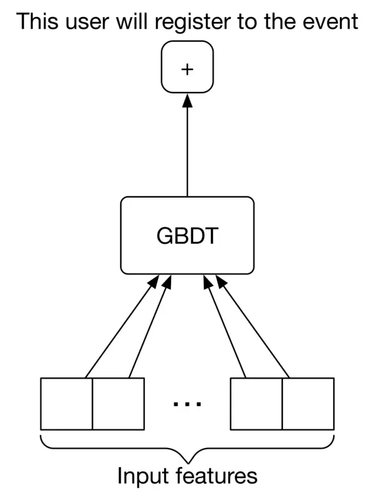
<p align="center">Figure 7.16: A GBDT model with a binary output</p>

**Pros:**
- Easy data preparation.
- Reduces both variance and bias.
- Works well with structured data.

**Cons:**
- Lots of hyperparameters to tune.
- Does not work well on unstructured data such as images, videos, audio, etc.
- Unsuitable for continual learning from streaming data.

A major drawback of GBDT is that it is unsuitable for continual learning. In an event recommendation system, new data continuously becomes available (recent user interactions, registrations, new events, new users). Without continual learning, it is very costly to retrain GBDT from scratch regularly.

#### Neural network (NN)

NNs are capable of learning complex tasks with non-linear decision boundaries and can be fine-tuned on new data very easily, making them ideal for continual learning.
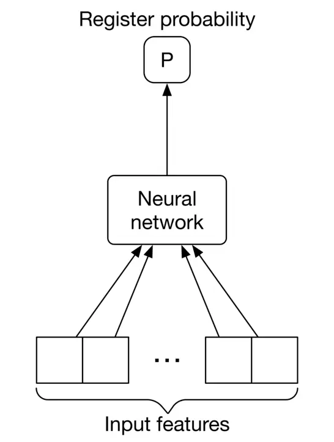
<p align="center">Figure 7.17: Neural network input-output</p>

**Pros:**
- Continual learning.
- Works well with unstructured data.
- High expressiveness due to many learning parameters.

**Cons:**
- Computationally expensive to train.
- Sensitive to input data quality.
- Large training data required.
- Black-box nature: not interpretable.

**Which model should we select?**

In this problem, both GBDTs and NNs are good candidates for experimentation. We start with the GBDT variant, XGBoost, since it is fast to implement and train. The result can be used as an initial baseline.

Once we have a baseline, we explore the possibility of building a better model with NNs. Neural networks are expected to work well here because massive training data is available (users continuously interact with the system) and the data may not be linearly separable.

### Model training

#### Constructing the dataset

To construct a single data point, we extract a ⟨user, event⟩ pair from the interaction data and compute the input features. We then label the data point with 1 if the user has registered for the event, and 0 if not.
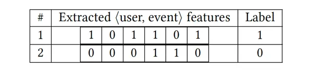
<p align="center">Figure 7.18: Constructed dataset</p>

One issue we may face is **class imbalance**. The reason is that users may explore tens or hundreds of events before registering for one. Therefore, the number of negative ⟨user, event⟩ pairs is significantly higher than positive data points. We can use one of the following techniques to address this:

- Use focal loss or class-balanced loss to train the classifier
- Undersample the majority class

#### Choosing the loss function

Since the model is a binary classification model, we use **binary cross-entropy** to optimize the neural network model.
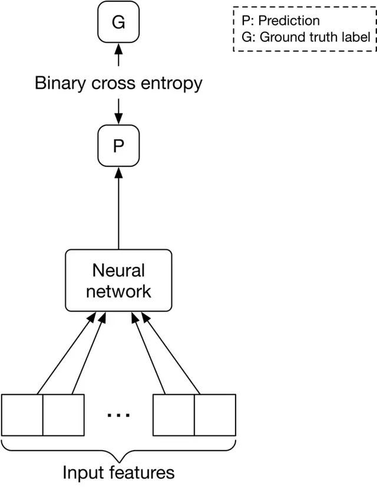
<p align="center">Figure 7.19: Loss between the prediction and the label</p>

---

## Evaluation

### Offline metrics

To evaluate the ranking system, we consider the following options.

**Recall@k or Precision@k** are not good fits because they do not consider the ranking quality of the output.

**MRR, nDCG, or mAP** are commonly used to measure ranking quality:

- **MRR** focuses on the rank of the first relevant item, suitable when only one relevant item is expected. In an event recommendation system, several recommended events may be relevant to the user, so MRR is not a good fit.
- **nDCG** works well when the relevance score between a user and an item is non-binary.
- **mAP** works only when the relevance scores are binary. Since events are either relevant (a user registered for it) or irrelevant (a user saw the event but did not register), **mAP is a better fit**.

### Online metrics

The business objective is to increase revenue by increasing ticket sales. To measure the impact of the system on revenue:

**Click-through rate (CTR):** A ratio showing how often users who see recommended events go on to click on an event.

```
CTR = total number of clicked events / total number of impressions
```

A high CTR shows our system is good at recommending events that users click on. However, relying only on CTR may be insufficient as some events are clickbait.

**Conversion rate:** A ratio showing how often users who see recommended events go on to register for them.

```
Conversion rate = total number of event registrations / total number of impressions
```

A high conversion rate indicates users register for recommended events more often. For example, a conversion rate of 0.3 means that users, on average, register for 3 events out of every 10 recommended events.

**Bookmark rate:** A ratio showing how often users bookmark recommended events.

**Revenue lift:** The increase in revenue as a result of event recommendations.

---

## Serving

There are two main pipelines in the design: an online learning pipeline and a prediction pipeline.
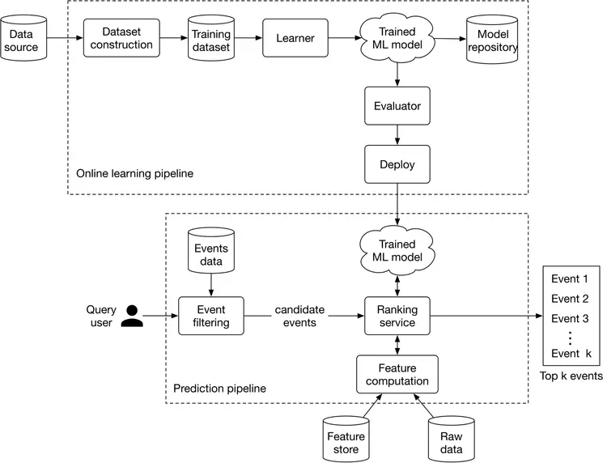
<p align="center">Figure 7.20: ML system design</p>

### Online learning pipeline

As described earlier, event recommendations are intrinsically cold-start and suffer from a constant new-item problem. Consequently, the model must be continuously fine-tuned to adapt to new data. This pipeline is responsible for continuously training new models by incorporating new data, evaluating the trained models, and deploying them.

### Prediction pipeline

The prediction pipeline is responsible for predicting the top k most relevant events to a given user.

#### Event filtering

The event filtering component takes the query user as input and narrows down the events from 1 million to a small subset of events. This is based upon simple rules, such as event locations, or other types of user filters. For example, if a user adds a "concerts only" filter, the component quickly narrows down the list to a subset of candidate events.
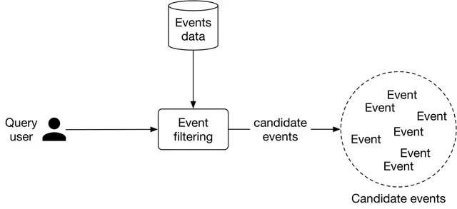
<p align="center">Figure 7.21: Event filtering input-output</p>

#### Ranking service

This service takes the user and candidate events produced by the filtering component as input, computes features for each ⟨user, event⟩ pair, sorts the events based on the probabilities predicted by the model, and outputs a ranked list of top k most relevant events to the user.
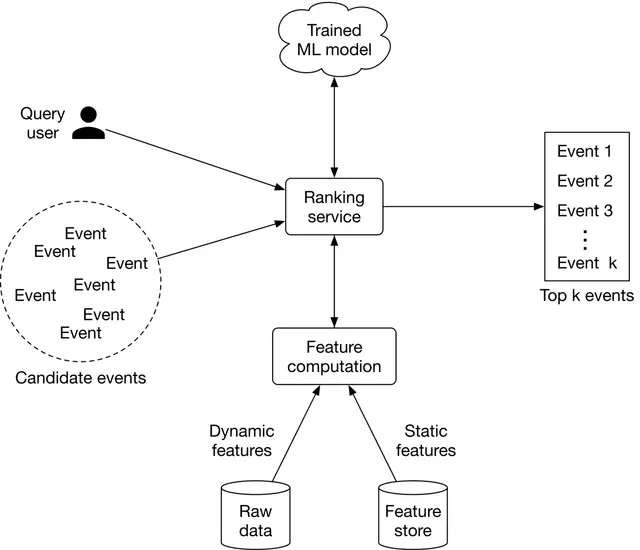
<p align="center">Figure 7.22: Ranking service workflow</p>

Ranking service interacts with the feature computation component responsible for computing features that the model expects. Static features are obtained from a feature store, while dynamic features are computed in real-time from the raw data.

---

## Other Talking Points

If there is extra time at the end of the interview, here are some additional talking points:

- What are the different types of bias we may observe in this system [21].
- How to utilize feature crossing to achieve more expressiveness [22].
- Some users like to see a diverse list of events. How to ensure the recommended events are diverse and fresh [23]?
- We utilize the user's attributes to train a model and rely on users' live locations. What are additional considerations related to privacy and security [24]?
- Event management platforms are usually two-sided marketplaces, where event hosts are the suppliers and users fulfill the demand side. How to ensure the system is not optimized for one side only [25]?
- How to avoid data leakage when constructing the dataset [26].
- How to determine the right frequency to update the models [27].

---

## References

[1] Learning to rank methods. https://livebook.manning.com/book/practical-recommender-systems/chapter-13/53

[2] RankNet paper. https://icml.cc/2015/wp-content/uploads/2015/06/icml_ranking.pdf

[3] LambdaRank paper. https://www.microsoft.com/en-us/research/wp-content/uploads/2016/02/lambdarank.pdf

[4] LambdaMART paper. https://www.microsoft.com/en-us/research/wp-content/uploads/2016/02/MSR-TR-2010-82.pdf

[5] SoftRank paper. https://www.microsoft.com/en-us/research/wp-content/uploads/2016/02/SoftRankWsdm08Submitted.pdf

[6] ListNet paper. https://www.microsoft.com/en-us/research/wp-content/uploads/2016/02/tr-2007-40.pdf

[7] AdaRank paper. https://dl.acm.org/doi/10.1145/1277741.1277809

[8] Batch processing vs stream processing. https://www.confluent.io/learn/batch-vs-real-time-data-processing/

[9] Leveraging location data in ML systems. https://towardsdatascience.com/leveraging-geolocation-data-for-machine-learning-essential-techniques-192ce3a969bc

[10] Logistic regression. https://www.youtube.com/watch?v=yIYKR4sgzI8

[11] Decision tree. https://careerfoundry.com/en/blog/data-analytics/what-is-a-decision-tree/

[12] Random forests. https://en.wikipedia.org/wiki/Random_forest

[13] Bias/variance trade-off. http://www.cs.cornell.edu/courses/cs578/2005fa/CS578.bagging.boosting.lecture.pdf

[14] AdaBoost. https://en.wikipedia.org/wiki/AdaBoost

[15] XGBoost. https://xgboost.readthedocs.io/en/stable/

[16] Gradient boosting. https://machinelearningmastery.com/gentle-introduction-gradient-boosting-algorithm-machine-learning/

[17] XGBoost in Kaggle competitions. https://www.kaggle.com/getting-started/145362

[18] GBDT. https://blog.paperspace.com/gradient-boosting-for-classification/

[19] An introduction to GBDT. https://www.machinelearningplus.com/machine-learning/an-introduction-to-gradient-boosting-decision-trees/

[20] Introduction to neural networks. https://www.youtube.com/watch?v=i2fmaabIs5w

[21] Bias issues and solutions in recommendation systems. https://www.youtube.com/watch?v=pPq9iyGIZZ8

[22] Feature crossing to encode non-linearity. https://developers.google.com/machine-learning/crash-course/feature-crosses/encoding-nonlinearity

[23] Freshness and diversity in recommendation systems. https://developers.google.com/machine-learning/recommendation/dnn/re-ranking

[24] Privacy and security in ML. https://www.microsoft.com/en-us/research/blog/privacy-preserving-machine-learning-maintaining-confidentiality-and-preserving-trust/

[25] Two-sided marketplace unique challenges. https://www.uber.com/blog/uber-eats-recommending-marketplace/

[26] Data leakage. https://machinelearningmastery.com/data-leakage-machine-learning/

[27] Online training frequency. https://huyenchip.com/2022/01/02/real-time-machine-learning-challenges-and-solutions.html#towards-continual-learning