# 10. Personalized News Feed

## Introduction

A news feed is a feature of social network platforms that keeps users engaged by showing friends' recent activities on their timelines. Most social networks such as Facebook [1], Twitter [2], and LinkedIn [3] personalize news feed to maintain user engagement.
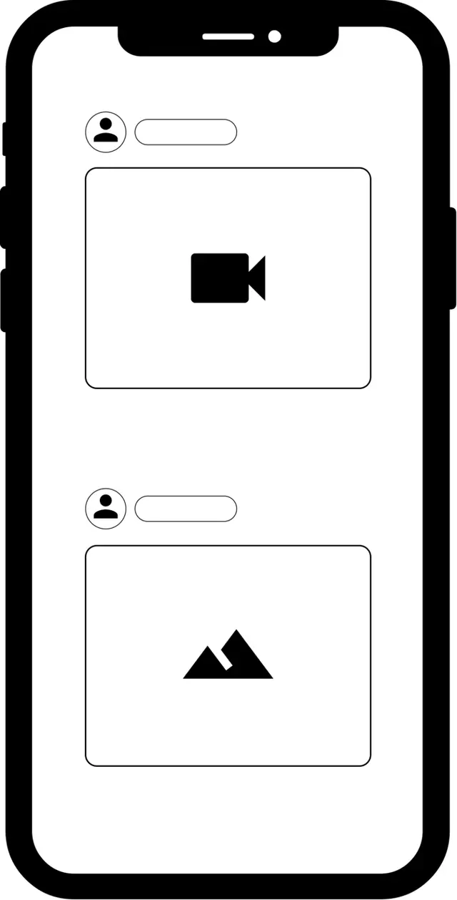

Figure 10.1: User timeline with personalized feeds

In this chapter, we are asked to design a personalized news feed system.

---

## Clarifying Requirements

Here is a typical interaction between a candidate and an interviewer.

**Candidate:** Can I assume the motivation for a personalized news feed is to keep users engaged with the platform?
**Interviewer:** Yes, we display sponsored ads between posts, and more engagement leads to increased revenue.

**Candidate:** When a user refreshes their timeline, we display posts with new activities to the user. Can I assume this activity consists of both unseen posts and posts with unseen comments?
**Interviewer:** That is a fair assumption.

**Candidate:** Can a post contain textual content, images, video, or any combination?
**Interviewer:** It can be any combination.

**Candidate:** To keep users engaged, the system should place the most engaging content at the top of timelines, as people are more likely to interact with the first few posts. Does that sound right?
**Interviewer:** Yes, that's correct.

**Candidate:** Is there a specific type of engagement we are optimizing for? I assume there are different types of engagement, such as clicks, likes, and shares.
**Interviewer:** Great question. Different reactions have different values on our platform. For example, liking a post is more valuable than only clicking it. Ideally, our system should consider major reactions when ranking posts. With that, I'll leave you to define "engagement" and choose what your model should optimize for.

**Candidate:** What are the major reactions available on the platform? I assume users can click, like, share, comment, hide, block another user, and send connection requests. Are there other reactions we should consider?
**Interviewer:** You mentioned the major ones. Let's keep our focus on those.

**Candidate:** How fast is the system supposed to work?
**Interviewer:** We expect the system to display the ranked posts quickly after users refresh their timelines or open the application. If it takes too long, users will get bored and leave. Let's assume the system should display the ranked posts in less than 200 milliseconds (ms).

**Candidate:** How many daily active users do we have? How many timeline updates do we expect each day?
**Interviewer:** We have almost 3 billion users in total. Around 2 billion are daily active users who check their feeds twice a day.

Let's summarize the problem statement. We are asked to design a personalized news feed system. The system retrieves unseen posts or posts with unseen comments, and ranks them based on how engaging they are to the user. This should take no longer than 200 ms. The objective of the system is to increase user engagement.

---

## Frame the problem as an ML task

### Defining the ML objective

Let's examine the following three possible ML objectives:

1. Maximize the number of specific implicit reactions, such as dwell time or user clicks
2. Maximize the number of specific explicit reactions, such as likes or shares
3. Maximize a weighted score based on both implicit and explicit reactions

Let's discuss each option in more detail.

**Option 1: Maximize the number of specific implicit reactions, such as dwell time or user clicks**

In this option, we choose implicit signals as a proxy for user engagement. For example, we optimize the ML system to maximize user clicks.

The advantage is that we have more data about implicit reactions than explicit ones. More training data usually leads to more accurate models.

The disadvantage is that implicit reactions do not always reflect a user's true opinion about a post. For example, a user may click on a post, but find it is not worth reading.

**Option 2: Maximize the number of specific explicit reactions, such as likes, shares, and hides**

With this option, we choose explicit reactions as a proxy for user opinions about a post.

The advantage of this approach is that explicit signals usually carry more weight than implicit signals. For example, a user liking a post sends a stronger engagement signal than if they simply click it.

The main disadvantage is that very few users actually express their opinions with explicit reactions. For example, a user may find a post engaging but not react to it. In this scenario, it's hard for the model to make an accurate prediction given the limited training data.

**Option 3: Maximize a weighted score based on both implicit and explicit reactions**

In this option, we use both implicit and explicit reactions to determine how engaged a user is with a post. In particular, we assign a weight to each reaction, based on how valuable the reaction is to us. We then optimize the ML system to maximize the weighted score of reactions.

Table 10.1 shows the mapping between different reactions and weights. As you can see, pressing the "like" button has more weight than a click, while a share is more valuable than a like. In addition, negative reactions such as hide and block have a negative weight. Note that these weights can be chosen based on business needs.

| Reaction | Click | Like | Comment | Share | Friendship request | Hide | Block |
|---|---|---|---|---|---|---|---|
| Weight | 1 | 5 | 10 | 20 | 30 | -20 | -50 |

*Table 10.1: Weights of different reactions*

**Which option to choose?**

We choose the final blended option because it allows us to assign different weights to different reactions. This is important because we can optimize the system based on what's important to the business.

### Specifying the system's input and output

As Figure 10.2 shows, the personalized news feed system takes a user as input and outputs a ranked list of unseen posts or posts with unseen comments sorted by engagement score.
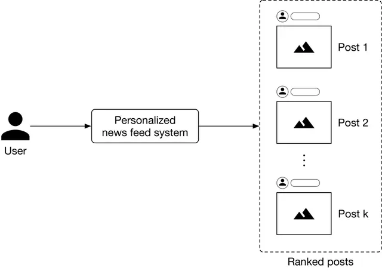

Figure 10.2: A personalized news feed system's input-output

### Choosing the right ML category

A personalized news feed system produces a ranked list of posts based on how engaging the posts are to a user. Pointwise Learning to Rank (LTR) is a simple yet effective approach that personalizes news feeds by ranking posts based on engagement scores. To understand how to compute engagement scores between users and posts, let's examine a concrete example.

As Figure 10.3 shows, we employ several binary classifiers to predict the probabilities of various implicit and explicit reactions for a ⟨user, post⟩ pair.
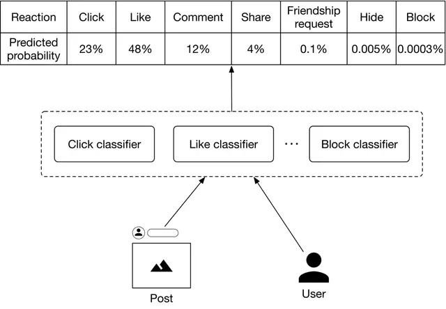

Figure 10.3: Predicted probabilities of various reactions

Once these probabilities are predicted, we compute the engagement score. Figure 10.4 shows an example of how the engagement score is calculated.

| Reaction | Click | Like | Comment | Share | Friendship request | Hide | Block |
|---|---|---|---|---|---|---|---|
| Predicted probability | 23% | 48% | 12% | 4% | 0.1% | 0.005% | 0.0003% |
| Value | 1 | 5 | 10 | 20 | 30 | -20 | -50 |
| Score | 0.23 | 2.4 | 1.2 | 0.8 | 0.03 | -0.001 | -0.00015 |

**Engagement score = 4.65885**

Figure 10.4: Calculate the engagement score

---

## Data Preparation

### Data engineering

It is generally helpful to understand what raw data is available before going on to engineer predictive features. Here, we assume the following types of raw data are available:

- Users
- Posts
- User-post interactions
- Friendship

#### Users

The user data schema is shown below.

| ID | Username | Age | Gender | City | Country | Language | Time zone |
|---|---|---|---|---|---|---|---|

*Table 10.2: User data schema*

#### Posts

Table 10.3 shows post data.

| Author ID | Textual Content | Hashtags | Mentions | Images or videos | Timestamp |
|---|---|---|---|---|---|
| 5 | Today at our fav place with my best friend | life_is_good, happy | hs2008 | - | 1658450539 |
| 1 | It was the best trip we ever had | Travel, Maldives | Alexish, shan.tony | htcdn.mysite.com/maldives.jpg | 1658451341 |
| 29 | Today I had a bad experience I would like to tell you about. I went... | - | - | - | 1658451365 |

*Table 10.3: Post data*

#### User-post interactions

Table 10.4 shows user-post interaction data.

| User ID | Post ID | Interaction type | Interaction value | Location (lat, long) | Timestamp |
|---|---|---|---|---|---|
| 4 | 18 | Like | - | 38.8951, -77.0364 | 1658450539 |
| 4 | 18 | Share | User 9 | 41.9241, -89.0389 | 1658451365 |
| 9 | 18 | Comment | You look amazing | 22.7531, 47.9642 | 1658435948 |
| 9 | 18 | Block | - | 22.7531, 47.9642 | 1658451849 |
| 6 | 9 | Impression | | 37.5189, 122.6405 | 1658821820 |

*Table 10.4: User-post interaction data*

#### Friendship

The friendship table stores data of connections between users. We assume users can specify their close friends and family members. Table 10.5 shows examples of friendship data.

| User ID 1 | User ID 2 | Time when friendship was formed | Close friend | Family member |
|---|---|---|---|---|
| 28 | 3 | 1558451341 | True | False |
| 7 | 39 | 1559281720 | False | True |
| 11 | 25 | 1559312942 | False | False |

*Table 10.5: Friendship data*

### Feature engineering

In this section, we engineer predictive features and prepare them for the model. In particular, we engineer features from each of the following categories:

- Post features
- User features
- User-author affinities

#### Post features

In practice, each post has many attributes. We cannot cover everything, so only discuss the most important ones: textual content, images or videos, reactions, hashtags, and post's age.

**Textual content**

- *What is it?* This is the textual content — the main body — of a post.
- *Why is it important?* Textual content helps determine what the post is about.
- *How to prepare it?* We preprocess textual content and use a pre-trained language model to convert the text into a numerical vector. Since the textual content is usually in the form of sentences and not a single word, we use a context-aware language model such as BERT [4].

**Images or videos**

- *What is it?* A post may contain images or videos.
- *Why is it important?* We can extract important signals from images. For example, an image of a gun may indicate that a post is unsafe for children.
- *How to prepare it?* First, preprocess the images or videos. Next, use a pre-trained model to convert the unstructured image/video data into an embedding vector. For example, we can use ResNet [5], or the recently introduced CLIP model [6] as the pre-trained model.

**Reactions**

- *What is it?* This refers to the number of likes, shares, replies, etc., of a post.
- *Why is it important?* The number of likes, shares, hides, etc., indicates how engaging users find a post to be. A user is more likely to engage with a post with thousands of likes than a post with ten likes.
- *How to prepare it?* These values are represented by numerical values. We scale these numerical values to bring them into a similar range.

**Hashtags**

- *Why is it important?* Users use hashtags to group content around a certain topic. These hashtags represent the topics to which a post relates. For example, a post with the hashtag "#women_in_tech" indicates the content relates to technology and females, so the model may decide to rank it higher for people who are interested in technology.
- *How to prepare it?* The detailed steps to preprocess text are already explained in Chapter 4, YouTube Video Search, so we will only focus on the unique steps for preparing hashtags.
  - **Tokenization:** Hashtags like "lifeisgood" or "programmer_lifestyle" contain multiple words. We use algorithms such as Viterbi [7] to tokenize the hashtags. For instance, "lifeisgood" becomes 3 words: "life" "is" "good".
  - **Tokens to IDs:** Hashtags evolve quickly on social media platforms and change as trends come and go. A feature hashing technique is a good fit because it is capable of assigning indexes to unseen hashtags.
  - **Vectorization:** We use simple text representation methods such as TF-IDF [8] or word2vec [9], instead of Transformer-based models, to vectorize hashtags. Let's take a look at why. Transformer-based models are useful when the context of the data is essential. In the case of hashtags, each one is usually a single word or a phrase, and often no context is necessary to understand what the hashtag means. Therefore, faster and lighter text representation methods are preferred.

**Post's age**

- *What is it?* This feature shows how much time has passed since the author posted the content.
- *Why is it important?* Users tend to engage with newer content.
- *How to prepare it?* We bucketize the post's age into a few categories and use one-hot encoding to represent it. For example, we use the following buckets:
  - 0: less than 1 hour
  - 1: between 1 to 5 hours
  - 2: between 5 to 24 hours
  - 3: between 1-7 days
  - 4: between 7-30 days
  - 5: more than a month

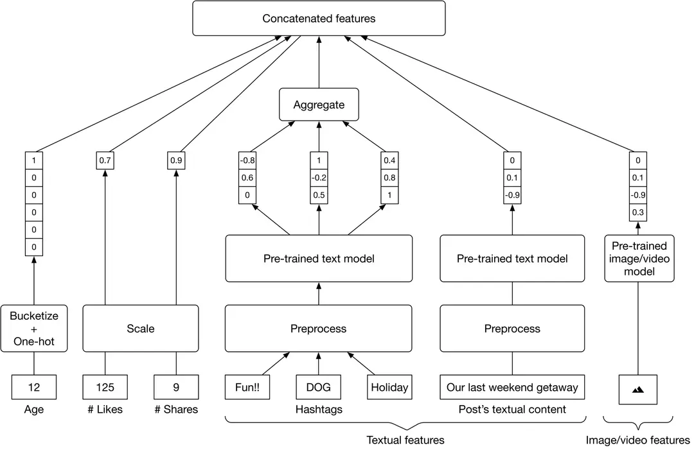

Figure 10.5: Post-related feature preparation

#### User features

Some of the most important user-related features are: demographics (age, gender, country, etc.), contextual information (device, time of the day, etc.), user-post historical interactions, and being mentioned in the post.

Since we have already discussed user demographic and contextual information in previous chapters, here we only examine the remaining two features.

**User-post historical interactions**

All posts liked by a user are represented by a list of post IDs. The same logic applies to shares and comments.

- *Why is it important?* Users' previous engagements are usually helpful in determining their future engagements.
- *How to prepare it?* Extract features from each post that the user interacted with.

**Being mentioned in a post**

- *What is it?* This means whether or not the user is mentioned in a post.
- *Why is it important?* Users usually pay more attention to posts that mention them.
- *How to prepare it?* This feature is represented by a binary value. If a user is mentioned in the post, this feature is 1, otherwise 0.
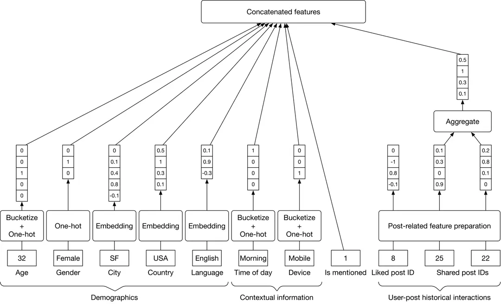

Figure 10.6: Feature preparation for user-related data

#### User-author affinities

According to studies, affinity features, such as the connection between the user and the author, are among the most important factors in predicting a user's engagement on Facebook [10]. Let's engineer some features to capture user-author affinities.

**Like/click/comment/share rate**

This is the rate at which a user reacted to previous posts by an author. For example, a like rate of 0.95 indicates that a user liked the posts from that author 95 percent of the time.

**Length of friendship**

The number of days the user and the author have been friends on the platform. This feature can be obtained from the friendship data.

- *Why is it important?* Users tend to engage more with their friends.

**Close friends and family**

A binary value representing whether the user and the author have included each other in their close friends and family list.

- *Why is it important?* Users pay more attention to posts by close friends and family members.
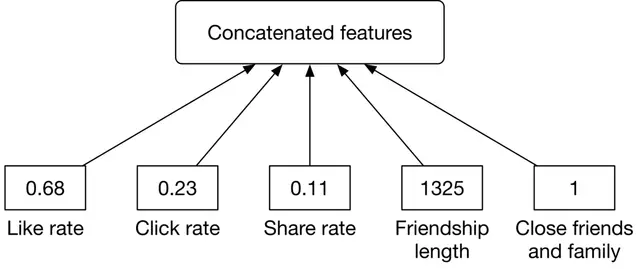

Figure 10.7: User-author affinity features

---

## Model Development

### Model selection

We choose neural networks for the following reasons:

- Neural networks work well with unstructured data, such as text and images.
- Neural networks allow us to use embedding layers to represent categorical features.
- With a neural network architecture, we can fine-tune pre-trained models employed during feature engineering. This is not possible with other models.

Before training a neural network, we need to choose its architecture. There are two architectural options for building and training our neural networks: N independent DNNs and a multi-task DNN.

#### Option 1: N independent DNNs

In this option, we use N independent deep neural networks (DNN), one for each reaction. This is shown in Figure 10.8.
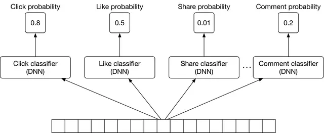

Figure 10.8: Using independent DNNs

This option has two drawbacks:

- **Expensive to train.** Training several independent DNNs is compute-intensive and time-consuming.
- **For less frequent reactions, there might not be enough training data.** This means our system is not able to predict the probabilities of infrequent reactions accurately.

#### Option 2: Multi-task DNN

To overcome these issues, we use a multi-task learning approach (Figure 10.9).
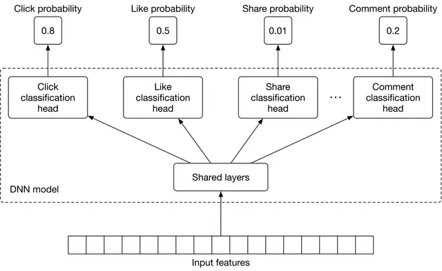

Figure 10.9: Multi-task DNN

We explained multi-task learning in Chapter 5, Harmful Content Detection, so we only briefly discuss it here. In summary, multi-task learning refers to the process of learning multiple tasks simultaneously. This allows the model to learn the similarities between tasks and avoid unnecessary computations. For a multi-task neural network model, it's essential to choose an appropriate architecture. The choice of architecture and the associated hyperparameters are usually determined by running experiments. That means training and evaluating the model on different architectures and choosing the one which leads to the best result.

#### Improving the DNN architecture for passive users

So far, we have employed a DNN to predict reactions such as shares, likes, clicks, and comments. However, many users use the platform passively, meaning they do not interact much with the content on their timelines. For such users, the current DNN model will predict very low probabilities for all reactions, since they rarely react to posts. Therefore, we need to change the DNN architecture to consider passive users.

For this to work, we add two implicit reactions to the list of tasks:

- **Dwell-time:** the time a user spends on a post.
- **Skip:** if a user spends less than $t$ seconds (e.g., 0.5 seconds) on a post, then that post can be assumed to have been skipped by the user.

Figure 10.10 shows the multi-task DNN model with the additional tasks.
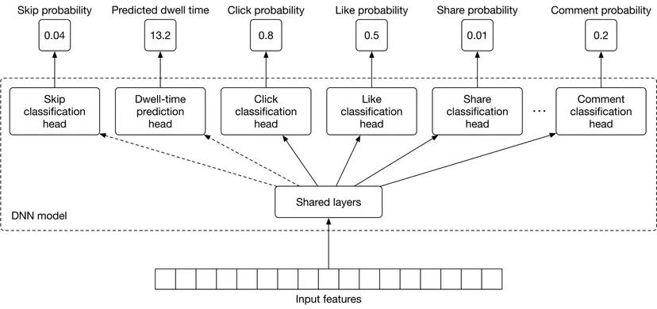

Figure 10.10: Multi-task DNN model with two new tasks

### Model training

#### Constructing the dataset

In this step, we construct the dataset from raw data. Since the DNN model needs to learn multiple tasks, positive and negative data points are created for each (e.g., click, like, etc.)

We will use the reaction type of "like" as an example to explain how to create positive/negative data points. Each time a user likes a post, we add a data point to our dataset, compute ⟨user, post⟩ features, and then label it as positive.

To create negative data points, we chose impressions that didn't lead to a "like" reaction. Note that the number of negative data points is usually much higher than positive data points. To avoid having an imbalanced dataset, we create negative data points to equal the number of positive data points. Figure 10.11 shows positive and negative data points for the "like" reaction.

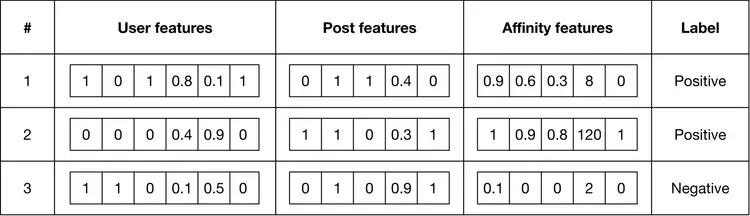

Figure 10.11: Training data for like classification task

This same process can be used to create positive and negative labels for other reactions. However, because dwell-time is a regression task, we construct it differently. As shown in Figure 10.12, the ground truth label is the dwell-time of the impression.

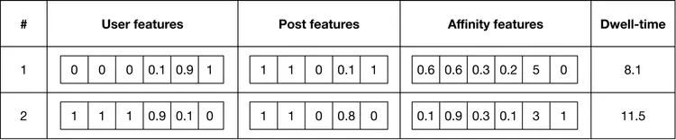

Figure 10.12: Training data for dwell-time task

#### Choosing the loss function

Multi-task models are trained to learn multiple tasks simultaneously. This means we need to compute the loss for each task separately and then combine them to get an overall loss. Typically, we define a loss function for each task depending on the ML category of the task. In our case, we use a binary cross-entropy loss for each binary classification task, and a regression loss such as MAE [11], MSE [12], or Huber loss [13] for the regression task (dwell-time prediction). The overall loss is computed by combining task-specific losses, as shown in Figure 10.13.

$$\text{Loss} = \lambda L_{\text{dwell}} + L_{\text{skip}} + L_{\text{like}} + \ldots + L_{\text{share}}$$

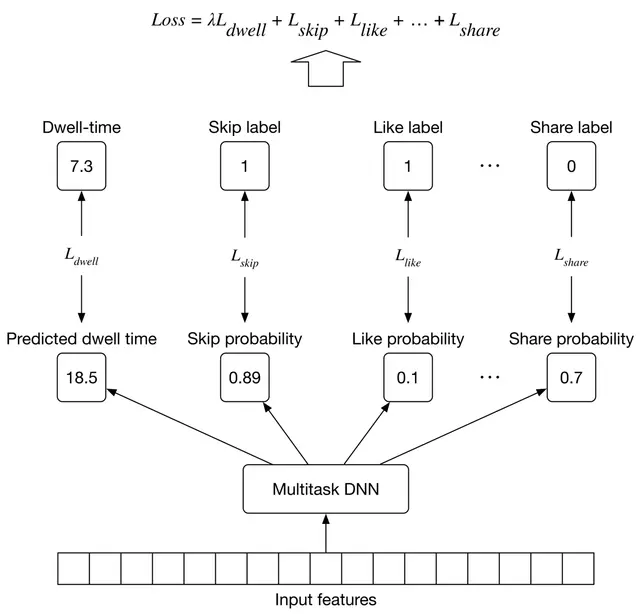

Figure 10.13: Training workflow

---

## Evaluation

### Offline metrics

During the offline evaluation, we measure the performance of our model in predicting different reactions. To evaluate the performance of an individual type of reaction, we can use binary classification metrics, such as precision and recall. However, these metrics alone may not be sufficient to understand the overall performance of a binary classification model. So, we use the ROC curve to understand the trade-off between the true positive rate and false positive rate. In addition, we compute the area under the ROC curve (ROC-AUC) to summarize the performance of the binary classification with a numerical value.

### Online metrics

We use the following metrics to measure user engagement from various angles:

- Click-through rate (CTR)
- Reaction rate
- Total time spent
- User satisfaction rate found in a user survey

**CTR.** The ratio between the number of clicks and impressions.

$$CTR = \frac{\text{number of clicked posts}}{\text{number of impressions}}$$

A high CTR does not always indicate more user engagement. For example, users may click on a low-value clickbait post, and quickly realize it is not worth reading. Despite this limitation, it is an important metric to track.

**Reaction rates.** These are a set of metrics that reflect user reactions. For example, a like rate measures the ratio between posts liked and the total number of posts displayed in users' feeds.

$$\text{Like rate} = \frac{\text{number of liked posts}}{\text{number of impressions}}$$

Similarly, we track other reactions such as "share rate", "comment rate", "hide rate", "block rate", and "skip rate". These are stronger signals than CTR, as users have explicitly expressed a preference.

The metrics we discussed so far are based on user reactions. But what about passive users? These are users who tend not to react at all to the majority of posts. To capture the effectiveness of our personalized news feed system for passive users, we add the following two metrics.

**Total time spent.** This is the total time users spend on the timeline during a fixed period, such as 1 week. This metric measures the overall engagement of both passive and active users.

**User satisfaction rate found in a user survey.** Another way to measure the effectiveness of our personalized news feed system is to explicitly ask users for their opinion about the feed, or how engaging they find the posts. Since we seek explicit feedback, this is an accurate way to measure the system's effectiveness.

---

## Serving

At serving time, the system serves requests by outputting a ranked list of posts. Figure 10.14 shows the architectural diagram of the personalized news feed system. The system comprises the following pipelines:

- Data preparation pipeline
- Prediction pipeline

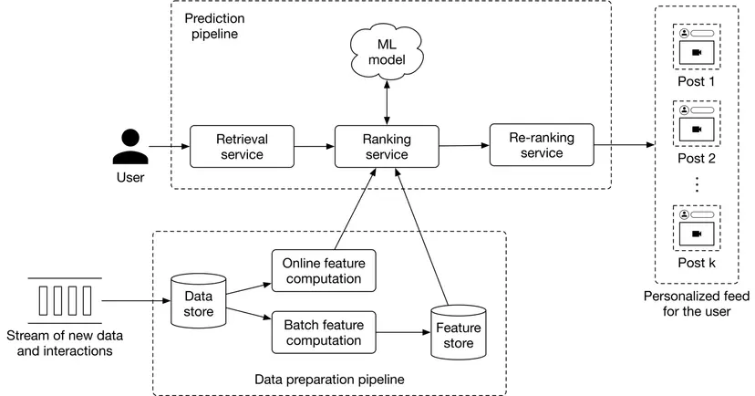

Figure 10.14: ML system design of a personalized news feed system

We do not go into detail about the data preparation pipeline because it is very similar to that described in Chapter 8, Ad Click Prediction in Social Platforms. Let's examine the prediction pipeline.

### Prediction pipeline

The prediction pipeline consists of the following components: retrieval service, ranking service, and re-ranking service.

**Retrieval service**

This component retrieves posts that a user has not seen, or which have comments also unseen by them. To learn more about efficiently fetching unseen posts, read [14].

**Ranking service**

This component ranks the retrieved posts by assigning an engagement score to each one.

**Re-ranking service**

This service modifies the list of posts by incorporating additional logic and user filters. For example, if a user has explicitly expressed interest in a certain topic, such as soccer, this service assigns a higher rank to the post.

---

## Other Talking Points

If there is time left at the end of the interview, here are some additional talking points:

- How to handle posts that are going viral [15].
- How to personalize the news feed for new users [16].
- How to mitigate the positional bias present in the system [17].
- How to determine a proper retraining frequency [18].

---

## References

[1] News Feed ranking in Facebook. https://engineering.fb.com/2021/01/26/ml-applications/news-feed-ranking/.

[2] Twitter's news feed system. https://blog.twitter.com/engineering/en_us/topics/insights/2017/using-deep-learning-at-scale-in-twitters-timelines.

[3] LinkedIn's News Feed system LinkedIn. https://engineering.linkedin.com/blog/2020/understanding-feed-dwell-time.

[4] BERT paper. https://arxiv.org/pdf/1810.04805.pdf.

[5] ResNet model. https://arxiv.org/pdf/1512.03385.pdf.

[6] CLIP model. https://openai.com/blog/clip/.

[7] Viterbi algorithm. https://en.wikipedia.org/wiki/Viterbi_algorithm.

[8] TF-IDF. https://en.wikipedia.org/wiki/Tf%E2%80%93idf.

[9] Word2vec. https://en.wikipedia.org/wiki/Word2vec.

[10] Serving a billion personalized news feed. https://www.youtube.com/watch?v=Xpx5RYNTQvg.

[11] Mean absolute error loss. https://en.wikipedia.org/wiki/Mean_absolute_error.

[12] Means squared error loss. https://en.wikipedia.org/wiki/Mean_squared_error.

[13] Huber loss. https://en.wikipedia.org/wiki/Huber_loss.

[14] A news feed system design. https://liuzhenglaichn.gitbook.io/system-design/news-feed/design-a-news-feed-system.

[15] Predict viral tweets. https://towardsdatascience.com/using-data-science-to-predict-viral-tweets-615b0acc2e1e.

[16] Cold start problem in recommendation systems. https://en.wikipedia.org/wiki/Cold_start_(recommender_systems).

[17] Positional bias. https://eugeneyan.com/writing/position-bias/.

[18] Determine retraining frequency. https://huyenchip.com/2022/01/02/real-time-machine-learning-challenges-and-solutions.html#towards-continual-learning.