# 04. Chat App

In this chapter, we'll tackle the design of a chat app. Chat apps are so common that designing one has become a very common question in mobile system design interviews. Figure 1 showcases some of the most popular chat applications currently in the market.
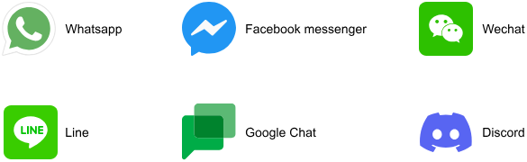
<p align="center">Figure 1: Most popular chat apps</p>

Chat apps have evolved to meet a wide range of communication needs. They serve as platforms to host one-on-one conversations, help friend groups stay connected, allow families to share life updates and photos, and even enable gamers to strategize during online matches. With such a diversity of potential functions, it's crucial to define clearly the specific requirements for the chat app we're designing.

---

## Step 1: Understand the problem and establish design scope

When tackling the design of a chat app, it's essential to first get on the same page as your interviewer. Here's how that conversation might play out:

**Interviewer:** Welcome to today's session! We'll be designing the mobile client app architecture and backend communication for a chat application.

**Candidate:** Thanks, I'm looking forward to this! Before we dive in, I'd like to clarify a few points about the app's functionality. Typically, chat apps allow users to send and receive messages in real time, view their conversation list, and access chat history offline. Are we focusing on one-on-one chats, group chats, or both? This could significantly impact our design approach.

**Interviewer:** Let's keep it simple and focus solely on one-on-one conversations. We'll leave group chats out of scope for now.

**Candidate:** Understood. Now, about the backend's role, some chat systems, such as WhatsApp [1], use the backend as a temporary message relay, holding messages until they're delivered to clients, without permanent storage. Is this the approach we're taking?

**Interviewer:** Yes, that's exactly the approach we'll use for this design.

**Candidate:** I see. Are we supporting only text messages, or should we consider attachments and reactions, as well?

**Interviewer:** Let's keep it simple and focus on text messages only for now.

**Candidate:** Alright. What about common chat features such as push notifications for new messages, typing indicators, and online status updates? Should we include these in our design?

**Interviewer:** Yes, let's incorporate those features.

**Candidate:** Great. Now, can you give me an idea of the app's scale? Are we designing for a startup or a large-scale, global application?

**Interviewer:** We're thinking big here. We're looking at about 30 million daily active users worldwide.

**Candidate:** That's a significant user base. For user registration and authentication, can we assume users are already authenticated when they access these features, and that their contact lists are pre-loaded when they open the app?

**Interviewer:** Yes, those are safe assumptions.

**Candidate:** Got it. And lastly, about security, we'll obviously secure the client–backend connection, but should we also consider encrypting messages stored on the device to protect against potential security breaches?

**Interviewer:** For now, let's keep message encryption on the device out of scope.

This back-and-forth helps us build a comprehensive picture of our design requirements. Let's take a moment to summarize what we've established so far.

> 💡 **Pro tip!**
>
> When addressing a familiar interview question, take the lead by proposing both functional and non-functional requirements upfront. This proactive approach not only showcases your leadership skills but also helps your interview stand out.

### Requirements

Based on our discussions, we're designing a chat system with the following functional requirements:

- Users can view their recent conversations, organized by the timestamp of the latest message.
- Users can chat in real time, including both sending and receiving text messages.
- During conversations, users can monitor their contacts' online status, typing indicators, message delivery status, and read receipts.
- Users can browse their chat history without an internet connection. The conversation history loads efficiently through pagination.
- The app supports push notifications to alert users of new messages.

For our non-functional requirements, we need to build a system that ensures:

- **Scalability:** Our system must handle 30 million daily active users worldwide and deliver reliable performance across various network conditions.
- **Data integrity:** The app should maintain consistency during offline use, especially when storing messages that will be delivered once connectivity returns.
- **Durability:** Client-side data must remain reliable since it serves as the source of truth for messages.

> 💡 **Pro tip!**
>
> When asking about Daily Active Users (DAU), you're doing more than just getting a number. The scale and geographic distribution of users directly influence your technical decisions. High DAU numbers often signal a need to focus more on topics such as performance optimization, resource efficiency, scalable architecture patterns, and the right network protocol choice.
>
> Always connect scale requirements to your technical choices during the interview. This demonstrates thoughtful system design and shows you understand how business requirements shape architecture decisions.

To keep our design focused, we'll consider the following features out of scope:

- User authentication and registration.
- Group chats and media file sharing.
- Message encryption.

As we move forward, it's important to remember that the scale of our system will significantly influence our design decisions. We'll need to consider carefully how each choice affects our ability to efficiently manage a large user base and high message volume.

### UI sketch

Figure 2 shows the basic layout of our chat app. On the left, the Chat List screen displays recent conversations and a button to start a new chat. Tapping a conversation opens the Conversation screen, which shows recent messages, the other user's online and typing statuses, and a text field to send new messages.
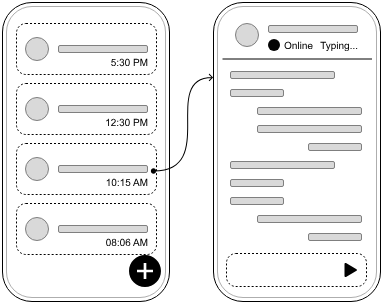
<p align="center">Figure 2: Basic sketch of the chat mobile app</p>

---

## Step 2: API design

Now that we've established our requirements, let's dive into the API design. This step is crucial for understanding how the client and backend will communicate. In this section, we'll look at:

- Client and backend expectations.
- Server-initiated connections.
- Network protocols in the chat app.
- Endpoints and data models.

### Client and backend expectations

In a chat system, clients don't communicate directly with each other. Instead, they connect to a backend that acts as a mediator. When a client sends a message, it goes to the backend. The backend then identifies the intended recipient and forwards the message. If the recipient isn't online, the backend holds on to the message until they connect.

Figure 3 illustrates the interactions between clients and the chat backend service, showing how messages flow through the system.
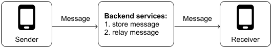
<p align="center">Figure 3: Client and server interactions in a chat system</p>

Let's examine how our client app and backend need to communicate. There are two distinct types of interactions we need to handle:

- When clients initiate contact with the backend, such as sending messages or syncing pending ones, HTTP works well for these scenarios since these client-initiated requests follow a simple request-response pattern.
- When the backend needs to reach clients for real-time features, such as message delivery or online status updates, the recipient's app needs to know about these events immediately, but HTTP only allows clients to make requests, not the other way around.

While push notifications can help inform users about new messages or events when the app isn't active, they aren't enough for an active chat session. Real-time features like message delivery, read receipts, and online status updates require something more immediate and reliable than push notifications, which can be slow and inconsistent. Given how sensitive chat apps are to latency, we need a more robust solution that can deliver a seamless, real-time experience.

### Server-initiated connections

Over time, developers have created several techniques to support server-initiated connections. These include polling, long polling, Server-Sent Events (SSE), WebSockets, and other solutions built on top of HTTP/2 such as gRPC.

These approaches frequently come up in mobile system design interviews, so it's important to understand them. Let's explore the key methods that have shaped how mobile apps communicate with servers.

#### Polling

Polling (or short polling) is a basic technique whereby the client repeatedly asks the server, "Do you have any new messages for me?". As shown in Figure 4, the process works like this: The client asks for new data; the server responds with or without new information; the client waits briefly, then asks again.

While easy to implement, polling can be wasteful. It often leads to many unnecessary requests, especially when there's no new data to report. This constant back-and-forth can burden both the client and the server, consuming extra network resources and processing power.
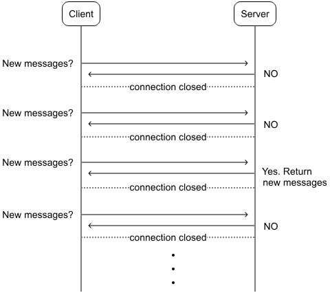
<p align="center">Figure 4: Polling strategy</p>

#### Long polling

Long polling emerged as an improvement by addressing some of the inefficiencies of traditional polling. Let's take a closer look at how it works in Figure 5.
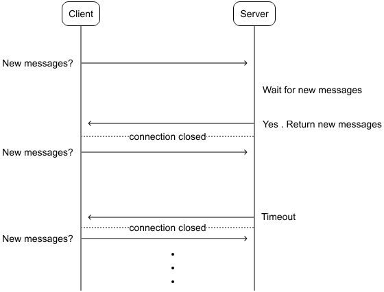
<p align="center">Figure 5: Long polling strategy</p>

With HTTP long polling, the client asks the server for updates and waits. Unlike short polling, the server holds the connection open until there's new data or a timeout occurs. Once the client gets a response, it immediately asks again.

While better than short polling, long polling has some issues too:

- It's still inefficient for infrequent chatters, as most requests will just time out.
- In multi-server setups, the server with the new message might not be the one connected to the recipient.
- Servers can't easily tell if a client has disconnected.

#### Server-Sent Events

Server-Sent Events (SSE) offer a way for servers to push updates to clients over a single HTTP connection. This approach, illustrated in Figure 6, differs from traditional request–response models.
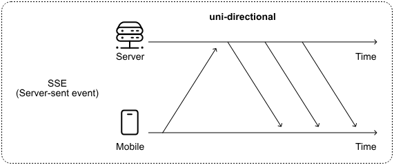
<p align="center">Figure 6: Server-Sent Events strategy</p>

At its core, SSE maintains an open HTTP connection between the client and server. To prevent the connection from timing out due to inactivity, the server may periodically send a colon-prefixed comment line. This simple technique keeps the connection alive, even when there's no actual data to transmit.

> 📝 **Note!** This is how SSE works under the hood:
>
> 1. The client sends an HTTP GET request to the SSE server endpoint, setting the `Accept` header to `text/event-stream`.
> 2. The server replies with a `200 OK` status and sets the `Content-Type` to `text/event-stream`. It then keeps the connection open, ready to push updates.
> 3. The server sends events in a simple text format, continuously updating the client.
> 4. If the connection drops, the client typically reconnects automatically. To avoid missing events, it can include a `Last-Event-ID` header in its reconnection request, allowing the server to send only the events that occurred since the last received event.

SSE is far more efficient than polling methods. By establishing a single, persistent connection and pushing updates only when necessary, SSE significantly reduces network traffic and server load. This makes it a more resource-friendly option for real-time communication.

In the context of our chat app, we could leverage SSE for server-initiated events while using standard HTTP requests for client-initiated actions. This hybrid approach would allow us to receive messages and other events through the SSE connection, while sending user messages via separate HTTP requests.

Although SSE presents a viable solution, there's another alternative to consider: WebSockets.

#### WebSocket protocol

The WebSocket (WS) protocol has one of the most common solutions for real-time, bidirectional communication between clients and servers. Figure 7 shows how it works.
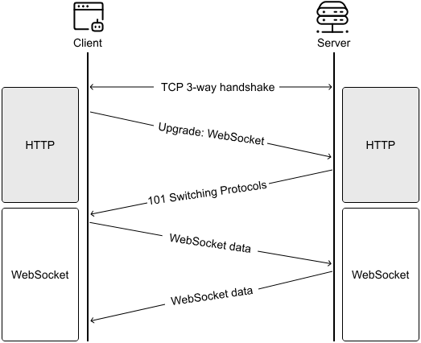
<p align="center">Figure 7: WebSocket protocol in action</p>

WebSocket connections begin their life as standard HTTP connections that are then "upgraded" to WebSocket connections through a well-defined protocol. This approach allows WebSockets to operate seamlessly even in the presence of firewalls, as they utilize the same ports (80 and 443) as HTTP and HTTPS traffic.

Once established, this two-way channel enables both client and server to freely exchange messages. WebSockets don't impose restrictions on data formats; they accommodate everything from plain text to binary data. This flexibility has contributed to their widespread adoption.

#### Messaging protocols used in real-world apps

WebSockets are built on top of TCP (Transmission Control Protocol) and provide a reliable connection for data transfer. TCP establishes and maintains a connection throughout the session, ensuring data packets are delivered in order and without errors. It handles error-checking, acknowledges received packets, and resends lost ones.

In contrast, UDP (User Datagram Protocol) doesn't establish a connection first before sending data. It sends each packet independently, which means it can't guarantee delivery, order, or error-free transmission. While this approach lacks TCP's reliability, it has less overhead, making it faster for certain applications.

Over the years, developers have created various real-time messaging protocols designed for specific use cases. These protocols are typically built on either TCP or UDP, depending on their needs. Some notable examples include:

- **WebSocket:** This full-duplex protocol enables communication over a single TCP connection. Slack uses WebSockets for real-time communication [2] [3], and Uber used it as well in the past [4] [5].
- **XMPP (Extensible Messaging and Presence Protocol):** An XML-based protocol supporting real-time messaging and presence information. WhatsApp historically used XMPP as the backbone of its messaging system [6], and Kik Messenger also used it [7].
- **MQTT (Message Queuing Telemetry Transport):** A lightweight publish/subscribe messaging protocol that operates over TCP. Facebook Messenger's initial implementation used MQTT [8].
- **WebRTC (Web Real-Time Communication):** This protocol primarily uses UDP (with TCP fallback) to support peer-to-peer audio, video, and data streams. Discord [9] uses WebRTC for voice and video functionalities.
- **IRC (Internet Relay Chat):** Operating on TCP, IRC is used mainly for group communication in channels, but it also supports private messaging. Mozilla used IRC as the primary tool for community communication [10].

### Network protocols in the chat app

In summary, Table 1 compares the network protocols that can be used for server-initiated connections to meet the system's real-time requirements.

| Option | Advantages | Disadvantages |
|---|---|---|
| Short polling | Simple implementation. Works with standard HTTP infrastructure and wide compatibility across platforms. | Inefficient with excessive requests. High bandwidth usage occurs when many requests return no new data. |
| Long polling | Near real-time updates with fewer requests than short polling. Good for non-critical updates. | Complex timeout handling. Doesn't scale well with many clients as it's resource-intensive on servers. |
| Server-Sent Events (SSE) | Single open HTTP connection for server-to-client messages. Built-in reconnection support and works well over HTTP/2. | Unidirectional (server to client only) so it requires a separate mechanism for client-to-server communication. Resource-intensive with many connections. |
| WebSocket | True bidirectional communication. Low-latency message delivery and reduced overhead without repeated request/response cycles. | More complex to implement as it requires more infrastructure support (e.g., load balancers). Scaling persistent connections is challenging. |

<p align="center">Table 1: Trade-offs for choosing the network protocol for real-time features</p>

After evaluating the different options, we chose a hybrid approach for the chat app:

- HTTP with REST APIs for client-initiated operations such as sending messages.
- WebSocket for receiving real-time messages from the server.

While implementing two protocols adds some complexity, this creates a more maintainable system as the app grows. By using WebSocket only for real-time features rather than all communication, including sending messages, we avoid common scaling issues that typically emerge in production environments.

> ⚠️ **Careful!**
>
> Scaling WebSocket services in production requires careful consideration. Some key challenges include:
>
> - Managing persistent connections consumes significant server resources.
> - Load balancing WebSocket connections is more complex than standard HTTP traffic.
> - Connection recovery and state management need thorough handling.
> - Monitoring and debugging WebSocket services require specialized tooling.
>
> By limiting WebSocket usage to just real-time features rather than all communication, we can better manage these scaling challenges.

We chose WebSockets over SSE for our chat application primarily because they offer better performance in chat scenarios. WebSockets provide lower latency and reduced header overhead, which is crucial when sending frequent small messages such as typing indicators and read receipts. While SSE could handle one-way server updates, WebSockets have more consistent support across mobile platforms and come with mature tooling for managing connections. This includes built-in capabilities for reconnection strategies and keep-alive mechanisms.

This hybrid approach, which combines HTTP and WebSockets, has been widely adopted in the industry. For example, Slack uses HTTP for most write operations through their Web API [11], while leveraging WebSocket for real-time events through their Real-Time Messaging (RTM) API [12]. Discord follows a similar pattern [13], demonstrating how well this architecture works at scale.

The client establishes the WebSocket connection for real-time updates when the app starts, and it remains active until either the client or server terminates it. Figure 8 demonstrates how clients and servers would interact with HTTP for client-initiated requests and WebSockets for real-time updates in our system.
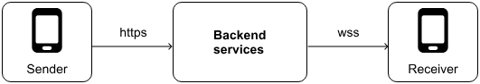
<p align="center">Figure 8: Client and server interactions in the chat system</p>

> ✅ **Decisions made!**
> - HTTP with REST APIs for sending messages and other client-initiated operations.
> - WebSocket for real-time features, where the server needs to push updates to clients.
> - Careful scope limitation of WebSocket usage to manage scaling complexity.

### Endpoints and data models

Now that we've chosen our communication protocol and data format, let's dive into the specific endpoints and data models we'll need.

#### Client-initiated requests

For sending messages, we can define the following endpoint:

```
Authentication: Bearer <token>
POST /v1/messages
  Body: NewMessageRequest
  Response: 201 Created. Payload of type NewMessageResponse
```

**Kotlin**
```kotlin
data class NewMessageRequest
    requestId: Long
    toUserId: Long
    content: String
    createdAt: String

data class NewMessageResponse
    message: Message
    fromMessageRequestId: Long?
```

**Swift**
```swift
struct NewMessageRequest
    requestId: Int64
    toUserId: Int64
    content: String
    createdAt: String

struct NewMessageResponse
    message: Message
    fromMessageRequestId: Int64?
```

The `requestId` field in `NewMessageRequest` acts as an idempotency key to allow the backend to de-duplicate requests when the same request is accidentally sent multiple times, and the optional `fromMessageRequestId` field in `NewMessageResponse` helps match a `Message` with the corresponding `NewMessageRequest`.

We could also define another endpoint for syncing new messages when the app initializes:

```
Authentication: Bearer <token>
GET /v1/messages?lastSyncedMessage={messageId}&limit={limit}
  Body: empty
  Response: 200 OK. Payload of type SyncMessagesResponse
```

#### Data models

The main application data model in our system is the `Message`. Here's what it looks like:

**Kotlin**
```kotlin
data class Message
    messageId: Long
    fromUserId: Long
    toUserId: Long
    content: String
    status: MessageStatus
    createdAt: String

enum class MessageStatus PENDING, SYNCED, DELIVERED, READ
```

**Swift**
```swift
struct Message
    messageId: Int64
    fromUserId: Int64
    toUserId: Int64
    content: String
    status: MessageStatus
    createdAt: String

enum MessageStatus case pending, synced, delivered, read
```

The `status` field drives what message indicator the UI displays on the screen and contains the following values:

- **PENDING:** The backend hasn't received the message yet.
- **SYNCED:** The backend has received the message.
- **DELIVERED:** The backend has delivered the message to the recipient.
- **READ:** The recipient has read the message.

Another key data model is the `ConversationPreview`, which represents what users see in the Chat list screen. It's worth noting that the following data models related to client app screens are private to the client. The backend doesn't concern itself with how the client displays messages.

**Kotlin**
```kotlin
data class ConversationPreview
    contact: User
    lastMessageSummary: String
    lastMessageTimestamp: String
    unreadCount: Int

data class User
    id: Long
    name: String
    avatarUrl: String
    lastConnectedAt: String
```

**Swift**
```swift
struct ConversationPreview
    contact: User
    lastMessageSummary: String
    lastMessageTimestamp: String
    unreadCount: Int

struct User
    id: Int64
    name: String
    avatarUrl: String
    lastConnectedAt: String
```

The `ConversationPreview` is a lightweight model containing just enough information to display a conversation in the Chats list. When a user taps on one of these items, it opens the Conversation screen with that user. Since we can only have one conversation per user, the User's `id` serves as a unique identifier for each conversation.

When the user opens the Conversation screen, the app loads the full `Conversation` data type, which contains more detailed information about the chat:

**Kotlin**
```kotlin
data class Conversation
    contact: User
    contactInfo: ContactInfo?
    unreadCount: Int
    messages: List<Message>

data class ContactInfo
    onlineStatus: String
    typing: Boolean
```

**Swift**
```swift
struct Conversation
    contact: User
    contactInfo: ContactInfo?
    unreadCount: Int
    messages: [Message]

struct ContactInfo
    onlineStatus: String
    typing: Bool
```

#### Real-time features

For the real-time features powered by WebSocket, we use a Uniform Resource Identifier (URI) format similar to HTTP URLs. While HTTP URLs begin with `http://` or `https://`, WebSocket URIs start with `ws://` for standard connections or `wss://` for secure, encrypted ones. For our chat backend service, we'll use the following URI: `wss://my-api.chat.com/v1/socket/updates`.

> 📌 **Remember!**
>
> We include versions in our API endpoints for good reasons. This practice gives us the flexibility to introduce breaking changes or major new features in newer versions while keeping older versions stable. It also allows us to deprecate outdated APIs in a controlled manner. For a deeper dive into API versioning, refer back to Chapter 10: Mobile System Design Building Blocks.

When sending data over the WebSocket, we use JSON in the following format:

```json
{
  "type": "message_type",
  "payload": {}
}
```

Each event consists of two main parts: a `type` field that specifies the event type (as defined earlier), and a `payload` field containing the actual event data as a JSON object. The content of the payload varies depending on the message type.

Once the WebSocket connection is established, the backend can send real-time updates like the following:

- `new_message`: New message for the client.
- `message_read`: A message has been read by the recipient.
- `contact_status_update`: Update on the contact's status, including online status, typing indicators, or other relevant information.

---

## Step 3: High-level client architecture

Now that we've established the API design, let's explore the high-level client architecture. We'll focus on:

- External server-side components.
- Client architecture components for UI and data layers.
- Data storage.

Figure 9 shows the high-level architecture of the chat system.
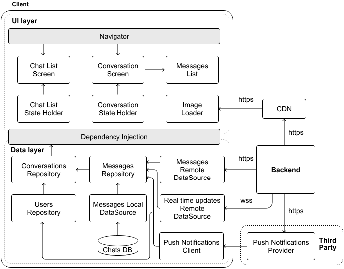
<p align="center">Figure 9: High-level mobile architecture of our chat system</p>

> 📝 **Note:** The components identified in the chat system don't differ much from those identified in the previous chapter when designing a News Feed. Thus, we'll go through this section quickly. If you have questions, revisit Chapter 3: Design a News Feed App.

### External server-side components

Our system relies on the Backend, CDN, and the Push Notifications Provider components.

The third-party Push Notifications Provider allows us to reach users even when they're not actively using the app, handling the complex infrastructure needed for reliable notification delivery. We'll explore push notifications in more depth during our deep dive section.

### Client architecture

Building on the foundation laid in previous chapters, we choose a layered architecture that follows Unidirectional Data Flow (UDF), reactive programming, and other key principles, such as separation of concerns, to ensure our app is robust, performant, and scalable.

#### Data layer

The `Message` is the central type of application data in the chat app. To handle this effectively, we've incorporated various data layer components, with the Messages Repository at the core, managing all read and write operations. Similarly, we've included a Users Repository to handle user-related information such as names and profile images.

The Messages Repository works with both local and remote data sources. While client-initiated requests flow through traditional HTTP endpoints via the Messages Local DataSource component, the dedicated **Real time updates Remote DataSource** component maintains a persistent WebSocket connection to receive real-time updates from the backend. This dual approach ensures that the system stays responsive to both user actions and server events.

The **Push Notifications Client** component serves as a listener for notifications from the external provider.

#### UI layer

The UI layer is built around the app's main screens: the Chat List and Conversation. To optimize performance, we have centralized image loading into a single **Image Loader** component, which fetches data from the content delivery network (CDN).

The **Message List** is a key component. It displays all messages of a conversation in chronological order, including those that failed to send or are still pending. Failed messages are indicated on the UI, and a resend option is provided for each message.

### Data storage

Let's explore the best way to store messages in the chat app. While mobile platforms offer simple storage options such as SharedPreferences on Android and UserDefaults on iOS, these key-value stores aren't the right fit for our needs. They work well for small pieces of data such as user preferences, but they weren't designed to handle growing message histories or the complex relationships between messages, conversations, and users. As message volume increases, these simple storage solutions would slow down and make it difficult to search through conversations effectively.

A relational database is a good choice for our chat app. Messages are naturally structured data: each message belongs to a conversation, has an author, and follows a clear format.

> 📝 **Note:** For a deeper dive into comparing different storage alternatives, refer to the Data Storage section in Chapter 10: Mobile System Design Building Blocks.

Relational databases excel at managing these relationships while providing three crucial benefits:

1. They handle complex queries efficiently. When users search their message history or filter conversations, the database can quickly find and return the right messages, even as the history grows large.
2. They ensure data consistency and provide ACID properties (Atomicity, Consistency, Isolation, and Durability). When multiple messages are being sent and received simultaneously, the database maintains data integrity and prevents conflicts. This reliability is essential for a chat application.
3. They support future growth. As we add features such as message reactions or thread replies, we can extend our database schema without disrupting existing messages. This flexibility lets our app evolve while keeping all message history intact.

These capabilities make relational databases ideal for handling the complex, growing, and interconnected nature of chat message data. While they may require more initial setup than simpler solutions, they provide the robust foundation we need for a reliable chat application.

### Eviction policy

Managing local storage is crucial for our chat app since all conversations are stored on the device. While we could automatically manage storage through eviction policies or time-based deletion, putting users in control often provides a better experience. Popular messaging apps take different approaches: WhatsApp alerts users when storage runs low and guides them through freeing up space [14], while Slack automatically removes messages older than 90 days or a year for their free tier [15].

Similarly, we could implement one of the following options:

- Implement eviction policies that remove messages and files based on specific criteria such as message date or attachment size.
- Set up automatic deletion after a defined time period.
- Let users manage their own storage by showing them usage stats and cleanup options.

> 💡 **Pro tip!**
>
> When designing mobile systems, certain decisions, such as how to handle message storage under memory constraints, often involve product teams. While you can propose different approaches and analyze their trade-offs during the interview, it's wise to first check with your interviewer on whether these product-level decisions are within scope before diving into implementation details.

For our chat app, we can suggest a user-centric storage management strategy if the interviewer is okay with that decision. Our strategy works as follows:

- Monitor available device storage through periodic checks.
- Proactively alert users when space runs low, offering clear options to delete older messages, remove entire conversations, or clean up other app data.

By giving users visibility and control over storage management, we help them make informed decisions about their chat history while preventing the app from consuming too much space.

> ✅ **Decisions made!**
> - We choose a relational database to persist message data on disk.
> - We alert users when storage runs low.

---

## Step 4: Design deep dive

Now that we've established the client-backend communication protocol and outlined the client architecture, it's time to dive deeper into some key areas. We'll concentrate on the following five critical areas:

- Message ordering on the screen.
- Sending messages.
- DB implementation details.
- Push notifications.

### Message ordering on the screen

Message ordering is fundamental to chat apps. It's what makes conversations feel natural and easy to follow. When messages appear in the wrong order, users can quickly become confused and frustrated. What seems like a simple requirement, showing messages in chronological order, actually involves several challenging edge cases on mobile devices:

- Network delays can cause messages to arrive out of sequence.
- Offline messages need to be integrated once users reconnect.
- Different devices may have mismatched system clocks.
- Both past messages and new updates must maintain consistent ordering.

#### Message lifecycle

Let's explore how messages flow through our system to make a better decision on screen message ordering. Figure 10 illustrates this process:

1. The Messages repository immediately creates and stores new messages, and the UI displays them on screen right away to provide instant feedback.
2. Behind the scenes, the repository forwards this message to the Messages remote data source, which packages it as a `NewMessageRequest` and sends it to the backend via HTTP.
3. The backend processes this request, generating a unique `messageId` for the message.
4. The backend then takes two parallel actions: (step 4.1) sends a 201 response back to the sender with a `NewMessageResponse` object, and (step 4.2) notifies the recipient, either through a WebSocket if they are active, or a push notification if they are inactive.
5. Once the sender's client receives the HTTP response, it updates the message in local storage with the new `messageId`. Lastly, the UI refreshes to show successful delivery.
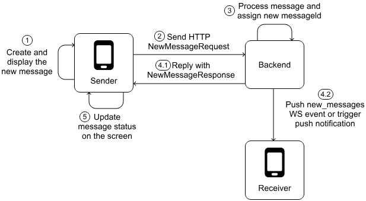
<p align="center">Figure 10: Message lifecycle in the chat system</p>

#### Message ordering

In steps 1 and 5 of Figure 10, the client needs to display the message on the screen. To implement reliable message ordering in our client app, we need to make a key design decision: what field should we use to sort messages on the conversation screen?

The `Message` data model provides two potential fields for ordering: the `messageId` assigned by the server when the message is processed and the `createdAt` timestamp set by the client when the message is created. Table 2 explores trade-offs between different approaches.

| Order by | Advantages | Disadvantages |
|---|---|---|
| `messageId` | A server-generated ID ensures consistent ordering across clients. Backend remains the source of truth. | The client doesn't have the `messageId` until the backend generates it. Doesn't support offline messaging effectively. |
| `createdAt` timestamp | Low latency. Immediate message display without waiting for the backend. Supports offline messaging. | Vulnerable to inconsistencies from device clock differences. Susceptible to client-side manipulation. |
| `createdAt` timestamp with client-backend clock synchronization | Combines timestamp benefits with improved reliability. Reduces ordering issues through synchronization, for example, via WebSocket events or Meta's Simple Precision Time Protocol [16]. | Clock drift between devices can still cause problems. Complex to implement accurately across diverse networks. |

<p align="center">Table 2: Trade-offs for ordering messages in the client</p>

While synchronizing client and backend clocks could work, it would add significant complexity and cost to our system. Instead, we can mitigate the downsides of `messageId` and `createdAt` approaches by combining them:

- Messages that have been successfully sent to and acknowledged by the server are ordered by `messageId`.
- Messages that are still waiting to be sent or are in the process of being sent are ordered by `createdAt` timestamp and always appear at the end of the message list.

Most popular chat apps use a server-assigned ID to sort messages on the client side. While some apps publish detailed documentation about it, such as Discord's Snowflake [17] id approach [18], others, such as WhatsApp with its `id` field [19], Facebook Messenger with `mid` [20] or Slack with `ts` [21], are more opaque about their specifics. How to order pending messages is a product decision, and apps might decide to implement it in different ways.

> ✅ **Decisions made!**
>
> The Conversation screen uses a hybrid approach to order messages on the screen:
>
> - Messages that have been successfully sent to and acknowledged by the server are ordered based on a server-generated `messageId`.
> - Messages that are still waiting to be sent or are in progress are ordered based on the client-generated `createdAt` timestamp and always appear at the end of the message list.

#### messageId responsibilities

In our system, the `messageId` plays a crucial role in maintaining the correct order of messages. They're designed to be sortable by time, ensuring that newer messages always have higher IDs than older ones. The backend is the source of truth for generating these IDs to ensure data integrity, reliable delivery, and consistent message ordering.

While this might seem straightforward, creating these IDs correctly can be tricky, especially for a large-scale system. That's why we typically delegate this responsibility to the backend. Servers are better suited to quickly and accurately generate unique, time-ordered IDs for millions of messages.

### Sending messages

Sending messages reliably in a mobile app isn't always straightforward. Network issues can prevent messages from reaching their destination. To handle this challenge, we need a way of tracking different message states: messages not yet sent, messages in transit, and messages that failed to send.

The data layer can model those states with the following `MessageRequest` data model. Just before sending the message, the remote data source maps this into a `NewMessageRequest` object. This approach helps us handle various message scenarios and implement retry mechanisms if needed.

**Kotlin**
```kotlin
data class MessageRequest
    requestId: Long
    toUserId: Long
    content: String
    status: MessageRequestStatus
    lastModifiedAt: String
    lastSentAt: String?
    failCount: Int?

enum class MessageRequestStatus
    DRAFT, PENDING, SENT, FAILED
```

**Swift**
```swift
struct MessageRequest
    requestId: Int64
    toUserId: Int64
    content: String
    status: MessageRequestStatus
    lastModifiedAt: String
    lastSentAt: String?
    failCount: Int?

enum MessageRequestStatus
    case draft, pending, sent, failed
```

The `status` field tracks the message's current state:

- **DRAFT:** The message is created but not yet sent by the client.
- **PENDING:** The message is queued and ready to be sent to the backend.
- **SENT:** The client has delivered the message to the backend via a `send_messages` event, but it hasn't received a delivery acknowledgment as part of the `messages` event.
- **FAILED:** Either the server reported a failure for this message or the request timed out.

> 📝 **Note:** You might notice there's no `SUCCEEDED` status in our `MessageRequest` model. This is by design. When the server acknowledges a message's delivery, we don't simply update the status. Instead, we remove the `MessageRequest` entirely and create a new `Message` object with a `RECEIVED` status. The `NewMessageResponse` model contains the information we need for this conversion, including the backend-generated `messageId` and the `fromMessageRequestId`.
>
> Similarly, you'll never see a `Message` with a `PENDING` status in our local data source. The `PENDING` state is exclusive to message requests. When displaying messages in the UI, we combine both message requests and processed messages.

#### Sending messages data flow

Let's explore how data flows through the system when a message is sent successfully. We already saw Figure 10 with the high-level process; Figure 11 illustrates the detailed data flow when the backend confirms message delivery:

1. The Messages Remote DataSource gets a success response from the backend.
2. The Remote DataSource passes this information to the Messages Repository.
3. The Messages Repository then performs two database operations: removes the temporary message request from storage, and creates a new `Message` entry with the confirmed ID from the backend.
4. These database changes automatically trigger updates that flow through the app, showing the user their message was delivered successfully (steps 4-7).
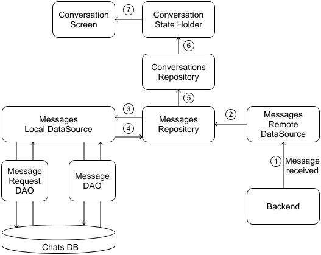
<p align="center">Figure 11: Client receiving message confirmation data flow</p>

The process works similarly for read receipts. When someone reads a message:

1. The backend sends a `read_messages` event through the WebSocket connection.
2. The client's Real-time Updates Remote DataSource receives the event.
3. It notifies the Messages Repository about the read status change.
4. The Repository updates the message status in the local database.
5. This change then flows through to the UI, updating the read status indicators.

#### Message delivery failures

While our previous example showed a successful message delivery, real-world scenarios aren't always smooth. Sometimes, we might never receive a response for a particular `NewMessageRequest`. This can happen due to unstable network connections or other unforeseen issues.

When a request fails or times out, we don't give up immediately. Instead, we update the `MessageRequest` status to `FAILED` and increment its `failCount`. This tracking allows us to decide whether to keep retrying with exponential backoff or stop retrying completely after a certain number of failed attempts.

> 📌 **Remember!**
>
> Exponential backoff is a retry strategy whereby the delay between attempts is progressively increased. For instance, if we start with a one-second delay, the next retry might wait two seconds, then four seconds, and so on. This approach avoids overwhelming our system with rapid-fire retries and gives the network a chance to recover.

We don't want to retry forever, so we set a maximum retry limit. If a message fails too many times, we automatically stop trying, mark it as permanently failed, and notify the user, offering them options to retry manually or delete the message.

> ✅ **Decision made!** We use an exponential backoff algorithm to retry failed messages.

#### Data layer design update

The new functionality we've introduced to handle failures, reconnections, and message requests has significantly impacted our client architecture. Figure 12 illustrates these changes in the updated data layer.
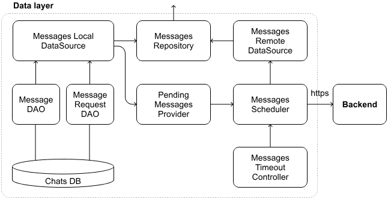
<p align="center">Figure 12: Data layer design update</p>

To streamline the Messages remote data source and prevent it from becoming overburdened, we've introduced several new components, each with specific responsibilities:

- The **Messages Scheduler** component orchestrates message sending from a background thread. It batches messages when appropriate and manages retries for failed messages, working in tandem with the Messages Timeout Controller.
- The **Message Timeout Controller** component monitors timeouts for messages awaiting backend confirmation.
- The **Pending Messages Provider** component retrieves message requests that are either pending or failed to send from the local data source. Following dependency injection best practices, the actual implementation would rely on the Messages Local Data Source.

By introducing more components and reducing the complexity of the Messages Remote Data Source, we enhance the overall readability and maintainability of the system.

> 🔍 **Industry insights:**
>
> Airbnb developed a message synchronization mechanism to reduce network requests and data inconsistencies, resulting in faster inbox loading and an improved user experience, particularly in areas with slow network connections [22].
>
> Facebook Messenger's clients handle offline messaging through an orchestrated sync service. In the Messenger "Lightspeed" rebuild, Facebook introduced a module called MSYS (Messenger SYnc System) to manage local data and tasks [23].

### DB implementation details

When it comes to implementing our database, SQLite stands out as an excellent choice for mobile devices. It's a lightweight yet powerful relational database system that can be easily embedded into mobile operating systems. SQLite's support for complex queries and transactions makes it well-suited for our chat application's needs.

> 🛠️ **Platform implementation details**
>
> Apple's CoreData can use SQLite as its underlying storage mechanism. You might also want to consider other open source alternatives such as SQLite.swift [24] or FMDB [25]. On Android, the most popular choices are Google's Jetpack Room [26] and Square's SQLDelight [27].

To maximize performance, we'll need to carefully structure our data models. This means optimizing our entity-relationship models to better align with how SQLite operates. We'll store regular messages in the `Messages` table and unsynced message requests in the `MessageRequests` table. This separation is important because unsynced requests don't have a `Message` id yet.

#### SQLite statements

Here are the instructions to define the tables in SQLite:

```sql
CREATE TABLE Users (
  id INTEGER PRIMARY KEY,
  name TEXT NOT NULL,
  avatar_url TEXT,
  last_connected_at TEXT,
)

CREATE TABLE Messages (
  id INTEGER PRIMARY KEY,
  from_user_id INTEGER NOT NULL,
  to_user_id INTEGER NOT NULL,
  content TEXT NOT NULL,
  status TEXT NOT NULL,
  created_at TEXT NOT NULL,
  FOREIGN KEY (from_user_id) REFERENCES Users(id),
  FOREIGN KEY (to_user_id) REFERENCES Users(id)
);

CREATE TABLE MessageRequests (
  request_id INTEGER PRIMARY KEY,
  to_user_id INTEGER NOT NULL,
  content TEXT NOT NULL,
  status TEXT NOT NULL,
  last_modified_at TEXT NOT NULL,
  last_sent_at TEXT,
  fail_count INTEGER,
  FOREIGN KEY (to_user_id) REFERENCES Users(id)
)
```

> 📝 **Note:** For the data model's IDs, we use an `INTEGER` in the SQLite statement even if that's represented as a `Long` in Kotlin or `Int64` in Swift.
>
> SQLite uses a dynamic type system based on type affinity, which means it associates storage classes with columns based on the declared data type. `INTEGER` is a type representing a signed integer, stored in 1, 2, 3, 4, 6, or 8 bytes. Any type name that contains the string "INT" (e.g., INT, INTEGER, BIGINT, SMALLINT) will have an INTEGER affinity.

#### Data layer updates

Figure 13 illustrates the updates to our data layer design. We've represented the three newly created tables as distinct Data Access Object (DAO) components. To separate concerns, we split the different types of application data (messages and user information) into their own repositories.
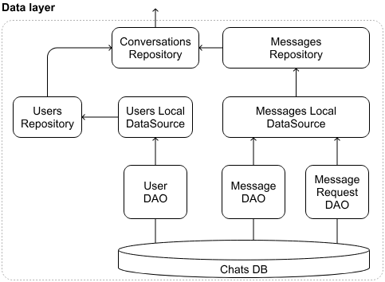
<p align="center">Figure 13: Data layer design update—this only shows repositories and local data sources-related components</p>

It's important to note that while we've split our message storage across different tables, this shouldn't impact the overall data flow of the application. We hide the fact that messages are split across two tables behind the data layer. The repository merges data from `Messages` and `MessageRequests`, so higher layers of the app see a unified conversation list and don't need to know about the split.

#### Challenges

Storing messages locally on a device for a chat application sounds straightforward, but it comes with its own set of hurdles. Let's explore these challenges and discuss practical solutions:

**Managing table dependencies and schema initialization**

When working with multiple SQL statements, whether they're included in the same or different SQL script files, the execution order matters. The `Users` table must be created before other tables since they depend on it. Keeping all these `CREATE TABLE` statements in a single SQL script file helps prevent execution order issues and makes the database setup more reliable.

For simplicity, consistency, and data integrity, we've chosen to consolidate all three tables (`Users`, `Messages`, and `MessageRequests`) within a single SQLite database file named `chats.db`.

While separating `Users` into its own database may promote modularity or support future cross-app reuse, this approach introduces several complications:

- Foreign key constraints across separate database files are not enforceable, so referential integrity must be maintained manually in the application layer.
- Managing multiple databases in the same app requires careful orchestration, especially when setting up the database in different environments (development, testing, production).
- Separate databases increase the likelihood of incorrect execution order, which can result in schema setup failures. Debugging these issues can be time-consuming and frustrating.

By keeping all tables in a single `chats.db` database file, we've opted for simplicity and reliability in our current scenario. This choice allows us to focus on other aspects of the system design without introducing unnecessary complexity in our database setup.

> ✅ **Decisions made!**
> - The `Users`, `Messages`, and `MessageRequests` tables are kept in the same `chats.db` database.
> - `CREATE TABLE` statements are part of the same SQL script file.

**Size and performance**

As your chat app grows, the database can become large and slow down app performance. Both Android and iOS have limits on efficient data storage and access.

To address these performance challenges, we could:

- Split large tables into smaller ones. For example, divide the `Messages` and `MessageRequests` table by user IDs, where each logged-in user's messages are stored in their own database file (e.g., `chats-currentUserId.db`). This helps manage database size and improve query performance for the current user's data.
- Add indexes to frequently searched columns, such as `to_user_id`. But be careful, while indexing speeds up searches, it can slow down adding new data.
- Batch transactions by grouping multiple database writes into a single transaction instead of performing them individually. This reduces disk I/O operations and enhances throughput.
- Set up proper error handling with retry mechanisms for temporary failures, especially during high load periods.
- Use a connection pool to manage concurrent database access efficiently in case multiple threads access the database simultaneously. This prevents bottlenecks and ensures efficient resource usage.

> 📌 **Remember!** Mobile clients should perform all database operations on a background thread to prevent blocking the UI thread and ensure a responsive user experience.

### Push notifications

Our design requirements include implementing push notifications to alert users about new messages when they are offline. We've already outlined the key components for push notifications in our high-level architecture diagram. Figure 14 illustrates the various elements involved in the push notification system. Let's dive deeper into how these components interact and explore the platform-specific approaches for Android and iOS.
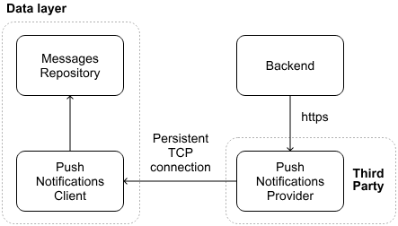
<p align="center">Figure 14: Push notifications–related components in the chat system design</p>

#### Sending push notifications from the backend

The backend triggers a push notification when a message is sent to an inactive user, that is, one without an active WebSocket connection to our servers. To deliver these notifications, the backend sends HTTPS requests to an external Push Notifications Provider. This provider is Firebase Cloud Messaging (FCM) for Android devices and Apple Push Notification Service (APNs) for iOS.

To correctly route notifications, the backend maintains a mapping between users and their devices. This mapping is created during the app installation process, where each device registers for push notifications in the background. The backend then stores a unique token for each user's device, allowing for targeted notification delivery.

> 📌 **Remember!**
>
> There are many types of push notifications you can send from the backend, for example, alert notifications that immediately alert users; silent notifications that are processed in the background without letting the user know; and rich media notifications that can include images, videos, or other media.
>
> In our case, we send alert notifications to keep the user informed regarding how many unread messages they have and the message content.

#### Receiving push notifications

Android and iOS devices maintain a low-power, persistent TLS-encrypted TCP connection to FCM and APNS servers, respectively. This approach eliminates the need for individual apps to manage their own connections, which would be resource-intensive. When a notification arrives, the device either wakes up the relevant app or displays the notification if the app isn't running.

> 🛠️ **Platform implementation details**
>
> On Android and iOS, the system maintains a persistent connection to handle push notifications efficiently. Android uses Google Play Services for this purpose, while iOS relies on a background service called the push notification daemon.
>
> For Android developers, implementing push notifications involves creating a service that extends `FirebaseMessagingService`. iOS developers, on the other hand, work with the `UNUserNotificationCenterDelegate` protocol, typically integrating it into the app's `UIApplicationDelegate`.

The handling of notifications differs based on the app's state:

- If the app is **in the foreground**, the Push Notifications Client processes the notification directly and calls the Messages Repository to sync messages.
- If the app is **in the background or terminated**, the device shows the notification in the system tray. When the user taps on it, the system brings the app to the foreground, allowing the Push Notifications Client to access the notification payload.

#### Challenges with push notifications

While push notifications are a powerful feature, they come with several challenges that developers need to navigate:

- FCM, APNs, or even the device itself might throttle notifications, especially in power-saving modes where the system may delay delivery, limit network access, or batch requests to conserve battery.
- Apps must obtain user consent to send notifications. If users decline or later opt out through device or app settings, your app loses this communication channel.
- Android and iOS use distinct APIs and workflows for push notifications. This necessitates platform-specific code and can result in inconsistent user experiences due to varying feature support and behaviors.
- Push notifications often need to direct users to specific screens within the app. This requires implementing URL schemes or universal links. Restoring the appropriate app state based on these deep links can be tricky, particularly if the app wasn't already running.
- Ensuring compatibility across various devices and OS versions is crucial but challenging. The asynchronous nature of push notifications can make debugging delivery issues particularly complex.

Given these potential pitfalls in message delivery, order, and overall complexity, our chat app uses push notifications primarily as a lightweight alert mechanism to notify users of new messages.

> 🔍 **Industry insights:**
>
> Slack's server-side infrastructure decides when and what to push. Every message posted in Slack goes through Slack's event pipeline, and a background job is enqueued to handle potential notifications. Slack's job queue system processes over a billion jobs per day, including the fan-out of push notifications [28].

---

## Step 5: Wrap-up

In this chapter, we've designed a chat system. We used HTTP for client-initiated requests and WebSockets for real-time updates, including read receipts and users' online statuses.

We outlined the client architecture, defined the backend HTTP and WebSocket endpoints, and created the necessary data models. We also took a closer look at message ordering on the screen, how the client sends messages, the database implementation, and push notifications.

If you have extra time in your interview or want to challenge yourself with different requirements, consider these additional topics:

- **Online status or Presence information [29]:** How WebSocket disconnections affect the user's online status and what role TCP half-open state [30] plays in this.
- **Group chat functionality:** Design message creation and delivery for group settings. Think about implementing role-based permissions for group management [31] and adding user mention capabilities within group conversations.
- **Enhanced security:** Implement database encryption to protect conversations from unauthorized access. You could also explore end-to-end encryption to ensure only senders and recipients can read messages [32].
- **Rich media support:** Extend conversations with attachments such as images, videos, and location data. Address the challenges of larger file sizes through compression techniques and implement thumbnail generation for efficient media previews.
- **Message management:** Design systems for editing and deleting messages. Consider how to track and display edit history for transparency, and implement selective message deletion (for sender only or all participants).
- **Search capabilities:** Develop search functionality within individual conversations and create a global search feature across all chats [33].

---

## References

[1] WhatsApp's message storage policy: https://www.whatsapp.com/legal/privacy-policy-eea

[2] WebSockets at Slack: https://api.slack.com/apis/connections/socket

[3] WebSockets at Slack: https://slack.engineering/rebuilding-slack-on-the-desktop/

[4] WebSockets at Uber: https://blog.bytebytego.com/p/how-uber-built-real-time-chat-to

[5] WebSockets at Uber: https://www.uber.com/blog/building-scalable-real-time-chat/

[6] WhatsApp uses a customized version of XMPP: https://en.wikipedia.org/wiki/WhatsApp

[7] Products using XMPP: https://xmpp.org/uses/instant-messaging/

[8] Facebook Messenger uses MQTT: https://engineering.fb.com/2011/08/12/android/building-facebook-messenger/

[9] Discord uses WebRTC: https://discord.com/blog/how-discord-handles-two-and-half-million-concurrent-voice-users-using-webrtc

[10] Mozilla uses IRC: https://developer.mozilla.org/en-US/docs/Glossary/IRC

[11] Slack Web API: https://api.slack.com/web

[12] Slack Socket Mode APIs: https://api.slack.com/apis/socket-mode

[13] Discord API: https://discord.com/developers/docs/events/gateway

[14] Whatsapp's policy on full device memory: https://faq.whatsapp.com/5503646096388294

[15] Slack's free version message storage policy: https://slack.com/trust/privacy/privacy-faq

[16] Simple Precision Time Protocol at Meta: https://engineering.fb.com/2024/02/07/production-engineering/simple-precision-time-protocol-sptp-meta/

[17] Snowflake ID: https://en.wikipedia.org/wiki/Snowflake\_ID

[18] Discord's message API: https://discord.com/developers/docs/resources/message

[19] WhatsApp message API: https://developers.facebook.com/docs/whatsapp/cloud-api/reference/messages

[20] Facebook Messenger message API: https://developers.facebook.com/docs/messenger-platform/reference/webhook-events/messages\#messaging

[21] Slack message API: https://api.slack.com/events/message

[22] Messaging Sync — Scaling Mobile Messaging at Airbnb: https://medium.com/airbnb-engineering/messaging-sync-scaling-mobile-messaging-at-airbnb-659142036f06

[23] Facebook's Project LightSpeed: Rewriting the Messenger codebase: https://engineering.fb.com/2020/03/02/data-infrastructure/messenger

[24] SQLite.swift docs: https://github.com/stephencelis/SQLite.swift

[25] FMDB docs: https://github.com/ccgus/fmdb

[26] Google's Jetpack Room docs: https://developer.android.com/training/data-storage/room

[27] SQLDelight docs: https://github.com/sqldelight/sqldelight

[28] Scaling Slack's Job Queue: https://slack.engineering/scaling-slacks-job-queue

[29] Online status or Presence information: https://en.wikipedia.org/wiki/Presence\_information

[30] TCP half-open: https://en.wikipedia.org/wiki/TCP\_half-open

[31] Role-based access control: https://en.wikipedia.org/wiki/Role-based\_access\_control

[32] End-to-end encryption: https://faq.whatsapp.com/820124435853543

[33] Full-text search: https://en.wikipedia.org/wiki/Full-text\_search