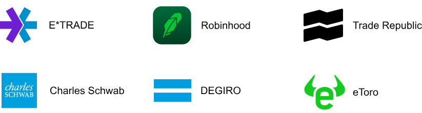
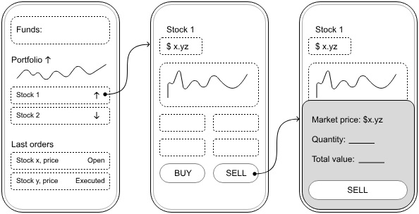
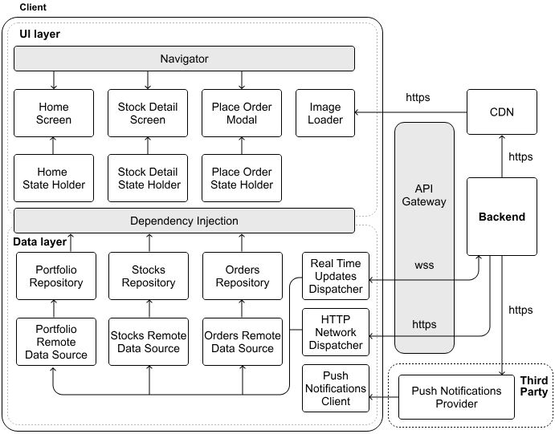
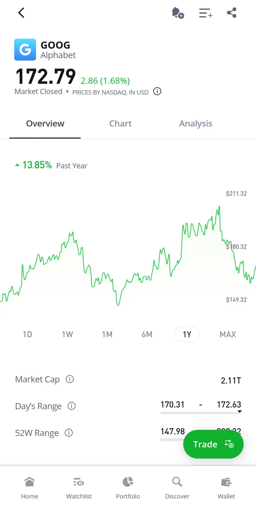
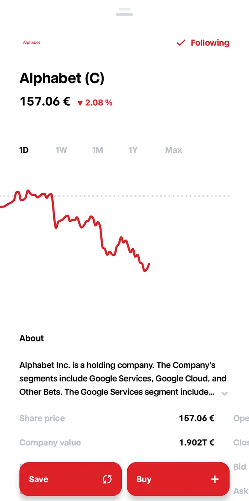
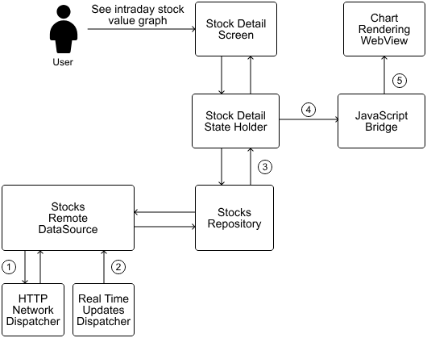

# 05. Stock Trading App

Stock trading apps tackle some unique technical challenges. They're not just another app. They're fast-moving platforms where timing is everything, and getting accurate, real-time information to users immediately can make a huge difference in their financial decisions. Figure 1 shows some of the most popular stock trading apps in the industry.

<p align="center">Figure 1: Popular stock trading apps</p>

The core challenge lies in managing high-frequency data streams. Every price change and market shift needs to reach users with minimal delay, as even a few seconds of latency could mean missed opportunities.

And it's not just about being fast. These apps handle real money and sensitive financial information, so security and reliability must be robust. We need to build in strong security, dependable APIs, and make sure we're following financial regulations to keep things running smoothly and safely.

---

## Step 1: Understand the problem and establish design scope

To figure out what we're building, let's picture a quick conversation with an interviewer. This back-and-forth helps us define the app's main features and set some clear boundaries.

**Candidate:** Before we dive in, I'd like to understand the scope of the trading functionality we're building. What's our stock trading app focusing on? Just stocks, or are we considering other instruments, such as options and futures too?

**Interviewer:** Let's keep it straightforward for now and focus on stocks.

**Candidate:** Sounds good. I'm thinking of key features such as placing and canceling orders, viewing portfolio details, showing real-time prices, and historical data. Does that cover it?

**Interviewer:** Pretty much! Let's also add a simple chart for historical stock trends. It'll give users a better sense of what's happening.

**Candidate:** How about push notifications for price alerts? And what kind of scale are we looking at? Big user base across multiple markets?

**Interviewer:** Definitely add notifications. For scale, we're looking at around 500k daily active users across different markets. The app needs to handle market data for thousands of stocks with real-time price updates.

**Candidate:** Given the focus on security and compliance, I propose minimizing sensitive data storage on the device and implementing robust security measures. Should we include authentication in the scope?

**Interviewer:** Good call. Let's assume users are already authenticated. Tech-wise, consider this a greenfield project.

### Requirements

Based on that discussion, here's what our stock trading app needs to deliver:

- Users can see their portfolio with live prices of stocks.
- Users can buy and sell stocks by placing and canceling orders.
- Users can see historical stock data in charts.
- The system sends price alert notifications.

As for non-functional requirements, we need to build a system that ensures:

- **Real-time data:** Our system must push market updates to users with minimal delay, ensuring they have the most current information when making trading decisions.
- **Performance:** The UI must remain smooth even while handling streaming data and complex visualizations, and trades need to execute quickly and reliably.
- **Security:** Financial data must be protected at all times, with strong authentication mechanisms and full compliance with financial regulatory standards.

Features that are out of scope for this exercise:

- Options and futures trading.
- User registration.

### UI sketch

Let's think about how the app will look. Figure 2 lays out the main screens:

- The **Home screen** (left) shows users their financial snapshot, portfolio, and recent orders at a glance.
- The **Stock Detail screen** (center) digs into a specific stock, with historical data and trading options.
- The **Place Order modal** (right) provides a streamlined experience for users to buy or sell.

<p align="center">Figure 2: Basic sketch of the stock trading mobile app</p>

---

## Step 2: API design

Now we'll establish how our client and backend will communicate. We'll focus on the communication protocol, client-backend interactions, and core data models.

### Choosing the right communication protocol

The stock trading app requires two primary forms of interaction: standard client-server exchanges, such as submitting orders or retrieving portfolio details, and real-time updates, such as live stock price feeds. To meet these demands efficiently, we adopt a hybrid protocol strategy:

- **HTTP with REST APIs** is ideal for client-initiated actions, such as placing orders, querying accounts, and retrieving historical data. REST offers a robust, scalable framework widely utilized in mobile development due to its structured request-response model.
- **WebSockets** are a great option for delivering real-time data, including stock price changes and order status notifications. By maintaining a persistent, bidirectional connection, WebSockets enable the server to push updates to the client instantly, ensuring low-latency delivery of time-sensitive market information.

This combination provides a good balance between standard request-response patterns and continuous data streaming. Many trading platforms such as TradeRepublic [1] use this tech stack, confirming its effectiveness at scale.

### Endpoints and data models

With the communication protocols established, let's dive into the specific endpoints and data models we'll need.

#### Stocks

These endpoints provide access to stock information and historical trends:

`GET /v1/stocks/{symbol}` — retrieves detailed data for a specified stock, including current price, daily high/low, and percentage change.

`GET /v1/stocks/{symbol}/history?interval={interval}&period={period}` — supplies historical price data, with parameters allowing customization of time intervals (e.g., `1m` for one minute, `1d` for one day) and periods (e.g., `1wk` for one week, `3mo` for three months).

The corresponding data model is:

**Kotlin**
```kotlin
data class Stock
    id: String
    symbol: String
    name: String
    currentPrice: BigDecimal
    changePercent: BigDecimal
    highPrice: BigDecimal
    ...
```

**Swift**
```swift
struct Stock
    id: String
    symbol: String
    name: String
    currentPrice: Decimal
    changePercent: Decimal
    highPrice: Decimal
    ...
```

> 📌 **Remember:**
>
> For financial apps such as stock trading platforms, always use `BigDecimal` in Kotlin or `Decimal` in Swift instead of `Float` or `Double` types.
>
> Floating-point types (`Float`/`Double`) can introduce subtle rounding errors that are unacceptable in financial contexts. `BigDecimal` provides exact decimal representation and precise arithmetic operations. While those operations are somewhat slower than primitive types, the guaranteed precision is essential for maintaining data integrity.

#### Portfolio and orders

These endpoints facilitate portfolio management and trading:

- `GET /v1/portfolio` — provides the user's current portfolio, detailing owned stocks and quantities.
- `GET /v1/orders?status={status}&page={page}&limit={limit}` — returns a paginated list of orders, filterable by status (e.g., open, executed, canceled).
- `POST /v1/orders` — creates a new buy or sell order.
- `DELETE /v1/orders/{orderId}` — cancels an existing order.

For order history, we implement offset pagination. This approach works well for this use case because:

- Orders rarely change after creation.
- Users typically focus on recent trading activity, and offset pagination provides efficient access to recent orders.

The data models are defined as:

**Kotlin**
```kotlin
data class Portfolio
    stocks: List<PortfolioStock>

data class PortfolioStock
    stock: Stock
    quantity: BigDecimal
    averagePrice: BigDecimal

data class Order
    id: String
    stockSymbol: String
    quantity: BigDecimal
    status: OrderStatus
    createdAt: String
    ...

enum class OrderStatus
    OPEN, EXECUTED, CANCELED
```

**Swift**
```swift
struct Portfolio
    stocks: [PortfolioStock]

struct PortfolioStock
    stock: Stock
    quantity: Decimal
    averagePrice: Decimal

struct Order
    id: String
    stockSymbol: String
    quantity: Decimal
    status: OrderStatus
    createdAt: String
    ...

enum OrderStatus
    case open, executed, canceled
```

#### Notifications

To support price alerts, we include:

- `GET /v1/notifications` — gets all created alerts.
- `POST /v1/notifications` — establishes a new price alert for a stock.
- `DELETE /v1/notifications/{id}` — deletes an existing alert.

#### WebSocket connection

For real-time functionality, we establish a WebSocket connection at `wss://api.stocktrading.com/ws`. This supports message types such as:

- `stock-prices`: Streams live price updates for subscribed stocks.
- `order-updates`: Reports changes in order status.
- `portfolio-updates`: Reflects portfolio value shifts due to market fluctuations.

Clients subscribe to updates by sending events like:

```json
{
  "action": "subscribe",
  "channels": [
    {
      "name": "stock-prices",
      "symbols": ["AAPL", "GOOGL", "MSFT"]
    }
  ]
}
```

---

## Step 3: High-level client architecture

With our API design in place, let's develop the high-level mobile architecture. Figure 3 illustrates this architecture, with arrows showing the flow of data through the system.

<p align="center">Figure 3: Stock trading high-level mobile architecture</p>

Let's see how the key components of our architecture interact with each other.

### External server-side components

Before we get into the client itself, let's look at the external pieces it relies on:

- The **Backend** talks to the client through REST APIs and WebSockets, managing requests and keeping data consistent.
- The **CDN** speeds up access to static content such as historical data or chart assets by caching it near users.
- The **Push Notifications Provider** keeps users informed with timely alerts for price changes or order updates even when the app's in the background.
- The **API Gateway** is the gatekeeper that handles authentication and traffic, shielding the backend from overload or bad actors.

### API Gateway

In our stock trading app, security is non-negotiable. We need robust authentication, careful request monitoring, and strict policy enforcement—all while maintaining a seamless user experience. This is where the API Gateway [2] plays a crucial role.

Serving as our system's front door, the API Gateway validates and routes all incoming client requests to the appropriate backend services. It blocks any suspicious or unauthorized requests before they can reach our core systems.

The API Gateway handles several key responsibilities:

- **Security:** It manages user authentication and authorization, implements rate limiting, and detects suspicious clients to protect our system.
- **Traffic management:** It balances load across services and controls request volumes to prevent system overload during peak trading hours.
- **Request processing:** It validates all incoming requests, transforms data formats when needed, and manages request/response headers to ensure proper communication.
- **Monitoring:** It tracks API usage, performance metrics, and error rates to maintain system health and identify potential issues early.
- **Simplification:** It provides a clean, unified API that shields mobile clients from the complexity of our backend architecture.

### Client architecture

Our app follows a clean layered architecture that separates concerns between the UI and data layers, creating a more maintainable and testable codebase.

The UI layer consists of three primary screens, each backed by its own state holder to manage presentation logic:

- The **Home screen** serves as the app's central hub, displaying the user's portfolio overview and recent trading activity.
- The **Stock Detail screen** provides comprehensive information about individual stocks, including price charts and key metrics.
- The **Place Order modal** offers a streamlined interface for executing buy and sell transactions.

Behind the scenes, three specialized repositories handle the core business data in the data layer:

- The **Portfolio repository** serves as the single source of truth for the user's holdings, continuously synchronizing with real-time updates.
- The **Stocks repository** manages market data, ensuring users always see current pricing information.
- The **Orders repository** handles the creation, tracking, and execution status of all trading transactions.

Complementing these components, the **Push Notifications Client** component listens for important alerts from our backend, ensuring users receive timely updates about price movements, order completions, and other critical events.

### Data storage

In our stock trading app, data freshness requirements vary across different types of application data:

- For **real-time market data**, we'll implement in-memory caching only, avoiding disk storage. This approach ensures users see the most current pricing for trading decisions and maintains the data integrity expected in financial applications.
- For **less time-sensitive information**, such as historical charts and user preferences, we'll apply appropriate disk caching with clear expiration policies, balancing performance with accuracy.

This architecture provides a solid foundation for our stock trading app. Now let's dive deeper into some of the more complex aspects of our system.

---

## Step 4: Deep dives

There are some unique aspects of our app that deserve special attention. Let's take a closer look at creating historical stock price charts and real-time stock data.

### Creating historical stock price charts

Visualizing historical price data is essential in any stock trading app. Historical stock data typically comes in various time frame options such as daily, weekly, monthly, yearly, and max views; each offering different insights to traders as shown in Figure 4.

<p align="center">Figure 4: Screenshot of a historical stock price chart from the eToro Android app</p>

#### Data density considerations

Each time frame presents unique data handling challenges. For instance, a 1-day chart might require 390 individual data points (one per minute during a 6.5-hour trading day), while a 5-year chart could theoretically contain over 1,250 daily data points or more than 260 weekly points.

One key challenge when implementing historical charts is managing data density appropriately. More data points provide greater detail but come with performance costs:

- High-density data (e.g., minute-by-minute prices over a month) can create rendering performance issues and excessive memory usage.
- Too few data points might miss important price movements and lead to misleading visualizations.

> 🔍 **Industry insights:**
>
> Different stock trading apps provide different user experiences. Many of these product decisions influence how the charts are designed and displayed. If you're interested in this topic, here's more information on how charts work in the Robinhood app [3] and in eTrade [4].

#### Implementing the chart

Rendering historical stock charts on mobile devices presents unique challenges due to the combination of large datasets and limited screen space. Let's evaluate the different approaches available to us in Table 1:

| Option | Description | Advantages | Disadvantages |
|---|---|---|---|
| Native graphics rendering | Using platform graphics APIs (e.g., Android Canvas, iOS Core Graphics) to draw chart UI elements manually. | Full control over visuals and performance. Smallest memory footprint. Direct hardware acceleration. | Complex implementation requiring platform-specific expertise. Significant development time. Duplicate code across platforms. |
| Third-party libraries | Using established mobile charting libraries (e.g., MPAndroidChart [5] or ChartsOrg/Charts [6]) that provide ready-made components. | Quick implementation with built-in features like zooming and gestures. Well-documented and maintained. | Performance overhead compared to native solutions. Potential integration challenges with native components. |
| WebView-based rendering | Embedding web tools (e.g., D3.js, Chart.js) or professional offerings (e.g., TradingView [7]) in a WebView. | Rich feature set from the web charting ecosystem. Consistent implementation across platforms. | Performance overhead and higher memory usage. WebView/native integration challenges and less native feel. |
| Server-side rendering with Image API | Generating charts server-side and delivering images to the client. | Minimal client-side processing requirements. Works consistently across all devices. | Limited interactivity. Network dependent. Higher server costs and bandwidth usage. |

*Table 1: Trade-offs for presenting historical stock price charts on the client*

Given our business context with multiple clients sharing the backend, we'll implement charts using WebView-based rendering. This approach allows us to maintain consistent visualization across platforms while leveraging powerful web-based charting libraries optimized for financial data visualization.

#### Optimizing WebView-based historical chart implementation

Implementing charts through WebViews presents several important challenges we need to address.

**Performance impact**

While WebViews offer flexibility, using complex JavaScript charting libraries such as D3.js or ECharts can strain device resources. We can mitigate this by:

- Isolating charts from high-priority flows, such as order execution.
- Pre-processing data server-side to reduce client strain.
- Streamlining updates to avoid redundant redraws.
- Performing delta updates on the charts after the initial full load.

The historical stock data density also presents unique challenges. We should implement the following strategies:

- Pre-process historical data before passing it to the WebView to reduce JavaScript processing time, especially for longer time frames with more data points.
- Implement a phased loading approach for extended time periods, where lower-resolution data loads first, followed by higher-resolution details as needed.

**Interaction and responsiveness**

WebView-rendered charts may not match the smooth interactions of native implementations, particularly with complex user interactions. To ensure good performance, we:

- Offload computations to the backend or background threads where feasible.
- Validate performance across diverse devices.

**Visual integration**

WebView components can sometimes feel disconnected from the native UI. To create a cohesive experience, we'll bridge this gap by:

- Aligning chart styles with the app's design system.
- Tuning WebView properties for a cohesive look.
- Adhering to platform UI best practices for familiarity.

**Platform-specific challenges**

Each OS presents unique hurdles:

*Android:*
- WebView updates independently from the app.
- Behavior may vary across devices and Android versions.
- Requires testing across different WebView implementations.

*iOS:*
- WKWebView has specific performance characteristics.
- Local storage persistence needs careful handling.
- Memory management requires special attention.

By carefully considering these challenges during implementation, we can create chart experiences that balance functionality with performance while maintaining a native feel.

> 🔍 **Industry insights:**
>
> eToro opted to integrate the web-based TradingView [7] charting toolkit into their platform, delivering advanced interactive charts via a web component in their app.
>
> Robinhood uses native drawing APIs to maximize performance and control on Android. They open sourced a custom Android library called Spark [8] for their sparkline charts.

### Real-time stock data

Stock prices fluctuate rapidly during trading hours, often changing multiple times per second. To display these dynamic changes, stock trading apps typically use intraday charts such as the one shown in Figure 5.

<p align="center">Figure 5: Screenshot of an intraday stock price chart from the Trade Republic Android app</p>

To ensure consistency across our app, we'll use the same WebView-based approach for both historical and intraday real-time data visualization. This provides a unified visual experience while simplifying maintenance, as we only need to maintain expertise in one charting technology stack.

#### Design options for real-time chart updates

To integrate real-time data into our WebView chart implementation, we need a strategy for updating the chart efficiently. Each approach has different implications for device resources such as battery life, processing power, and memory usage. Table 2 shows multiple options with their trade-offs:

| Option | Description | Advantages | Disadvantages |
|---|---|---|---|
| Direct UI updates | Update the UI instantly with every new data point received from the WebSocket. | Simplest implementation. Ensures users see the most current data. Minimal latency between data receipt and display. | Can cause UI jank if updates are too frequent. High battery consumption. May overwhelm the main thread with excessive updates. |
| Buffered updates | Collect data changes in a buffer and update the UI at fixed intervals. | Reduces UI update frequency. More efficient for battery life. Smooths out frequent changes. | Introduces a small delay in displaying the latest data. May miss intermediate price points. Requires careful tuning of update intervals. |
| Priority-based updates | Assign different update priorities to different UI elements. | Focuses resources on the most important data. Allows critical information to update more frequently. Better overall user experience. | More complex implementation. Requires careful tuning of priorities. May cause user confusion if related data elements update at different rates. |

<p align="center">Table 2: Trade-offs for displaying real-time UI updates</p>

For our stock trading app's intraday chart, we'll implement the **buffered updates** approach. This strategy provides the best balance between responsiveness and resource efficiency for a single chart element.

> 📝 **Note:** This decision assumes we're displaying just one intraday chart with real-time updates at a time. If product requirements change to display multiple charts simultaneously, we would need to reconsider our strategy and implement a hybrid solution with priority-based updates.

#### Implementation strategy

Our buffered update implementation for the WebView-based intraday chart consists of several key components:

- The Stocks repository contains data buffering logic that collects price updates from the WebSocket connection and maintains them in a queue.
- A scheduled updater runs at fixed intervals (e.g., every 1-2 seconds) to transfer the buffered price data to the WebView chart.
- A JavaScript bridge between the native code and WebView that efficiently transfers market data updates.

#### Understanding the JavaScript bridge

The stock chart runs as JavaScript within a WebView. Since the chart rendering happens in this JavaScript environment, we need a way to send our processed data from the native app to the WebView. This is where the JavaScript bridge comes in.

The JavaScript bridge creates a communication channel between our native app code and the WebView chart. When real-time stock data arrives, it first comes to our native code through the WebSocket connection, not directly to the WebView. This approach has several benefits:

- Native code handles network connections and data processing more efficiently.
- We can format the data correctly before sending it for visualization.
- We can implement better buffering strategies at the native level.

This setup creates a clear separation of duties:

**Native code handles:** Managing the WebSocket connection, receiving and validating incoming data, buffering updates to reduce processing overhead, pre-processing data for display, and determining when to send updates to the chart.

**WebView code handles:** Rendering the chart visualization, managing user interactions (zoom, pan, tap), and handling chart animations and transitions.

The JavaScript bridge allows data to flow both ways:

- **Native to WebView:** Sending stock updates, configuration changes, and user preferences.
- **WebView to Native:** Communicating user interactions such as zooms, taps on data points, or feature toggles.

> 🛠️ **Platform implementation details**
>
> Buffered updates require efficient data stream management that needs to be sent through the JavaScript bridge to update the WebView.
>
> On Android, we can leverage:
> - The `JavascriptInterface` mechanism to establish reliable communication between native code and WebView charts.
> - Kotlin Flows with appropriate dispatchers to handle buffering and throttling off the main thread.
>
> On iOS, we can leverage:
> - `WKUserContentController` and `WKScriptMessageHandler` enable native-to-JavaScript communication.
> - Combine framework's `throttle` and `debounce` operators to control update frequency.

#### Real-time chart update data flow

Figure 6 maps the data journey when a user opens a stock's intraday chart, updating in real time:

1. The Stocks remote data source fetches the current day's historical data via a REST API call to establish the baseline chart data.
2. Simultaneously, the remote data source establishes a WebSocket connection for receiving real-time price updates.
3. The Stocks repository combines these two sources and implements the buffered updates strategy: the repository creates the data stream and emits the current day's historical data as the initial value. As WebSocket updates arrive, they're collected in a buffer within the repository. The repository doesn't send each update immediately to subscribers. Instead, it batches these updates and emits them at regular intervals.
4. The Stock detail state holder subscribes to this buffered data stream and is responsible for communicating with the JavaScript bridge to update the chart as new data arrives.
5. The WebView chart renders these updates, creating the appearance of smooth, real-time data visualization.

<p align="center">Figure 6: Intraday stock value chart data flow</p>

#### Common bottlenecks and optimizations

Several common issues can still affect real-time UI performance:

**WebView-related bottlenecks.** Frequent updates to the WebView can trigger expensive rendering operations. To minimize this impact, we:
- Configure the charting library to use partial redraws, which update only the changed elements.
- Disable animations during high-frequency updates to reduce rendering overhead.

**Data processing bottlenecks.** Processing incoming market data can sometimes become a bottleneck, especially when it involves complex calculations. To minimize this impact, we:
- Move all data transformations to native code and execute them in a background thread before passing the data to the WebView.
- Pre-compute derived values rather than calculating them in JavaScript.
- Implement caching for computed values to prevent redundant calculations.

**Bridge communication overhead.** Every call between native code and WebView has a cost. We optimize this by:
- Batching multiple price updates into a single bridge communication.
- Using compact data formats to reduce serialization/deserialization costs.
- Maintaining a consistent update interval that balances freshness with performance.

**Intermittent connectivity.** Mobile networks are inherently unreliable. When connectivity issues occur:
- Clearly indicate when the data is stale due to connection loss.
- Implement exponential backoff for reconnection attempts.

**Battery impact.** Real-time updates can significantly impact device battery life. We should:
- Stop real-time updates when the app is in the background.
- Implement adaptive throttling based on battery level.

As our app grows in complexity and user base, our real-time update system needs to scale accordingly. Several aspects of our design ensure this scalability:

- **WebSocket message filtering:** We implement server-side filtering to ensure clients only receive the specific data they need, reducing client-side processing as the app adds features.
- **Buffer size:** Our buffer needs to be large enough to accommodate all price updates between refresh intervals, even during periods of high market volatility. For most stocks, a buffer capacity of 10-20 price points should be sufficient.
- **Adaptive scheduling:** We can implement adaptive scheduling that adjusts update frequency based on market conditions, device state, and user engagement when the user is actively looking at their data and the app is in the foreground: increase frequency during market hours with high volatility, and allow users to adjust the frequency based on battery level and device performance.

> 🔍 **Industry insights:**
>
> Institutions such as J.P. Morgan or Commerzbank, and trading platforms like Binomo, use SciChart's [9] native engine to power real-time stock dashboards [10].
>
> Coinbase's exchange platform exposes a WebSocket feed to broadcast live market data for orders and trades [11].

---

## Step 5: Wrap-up

In this chapter, we've designed a mobile stock trading app that delivers core functionality for investment management. Our system supports viewing real-time stock prices, executing trades through placing and canceling orders, analyzing historical price data through charts, and receiving timely price alerts.

The architecture combines REST APIs for standard operations with WebSockets for real-time updates. We've implemented a layered client architecture that separates UI and data concerns, making the codebase both maintainable and testable. We also covered creating both historical and real-time intraday stock value charts.

For those preparing to discuss this in a Mobile System Design interview, consider exploring these extensions to deepen the conversation:

- **Offline functionality:** Designing a system for caching and local operation when network connectivity is limited.
- **Cross-platform considerations:** Discussing how the architecture would adapt to support web and other platforms.
- **Regulatory Compliance:** Address the specific compliance requirements and regulations that govern stock trading in different regions.
- **Personalized UI:** Offer customizable dashboards or watchlists, enhancing engagement through tailored experiences.

---

## References

[1] TradeRepublic's state of Android in 2024 with REST and WebSocket protocols: https://engineering.traderepublic.com/state-of-android-at-tr-2024-edition-bc032620b83e

[2] API Gateway: https://en.wikipedia.org/wiki/API\_management\#gateway

[3] Robinhood's charts: https://robinhood.com/us/en/support/articles/using-charts/

[4] ETrade's charts: https://us.etrade.com/knowledge/library/getting-started/power-etrade-charting-enhancements

[5] MPAndroidChart: https://github.com/PhilJay/MPAndroidChart

[6] iOS Charts library: https://github.com/ChartsOrg/Charts

[7] TradingView: https://www.tradingview.com/

[8] Robinhood's Spark Android library: https://github.com/robinhood/spark

[9] SciChart: https://www.scichart.com/

[10] SciChart usage in the industry: https://www.scichart.com/blog/ios-android-native-apps-vs-javascript

[11] Coinbase WebSocket approach for real-time updates: https://docs.cdp.coinbase.com/exchange/docs/websocket-overview