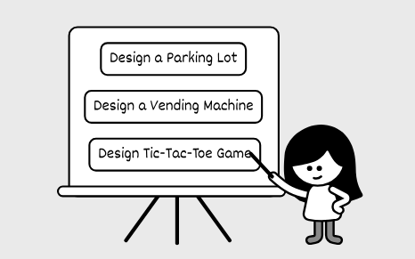
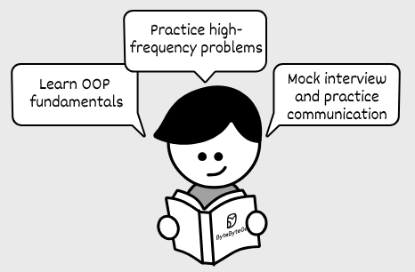

# 01. What is an Object-Oriented Design Interview
Object-oriented design interviews have become increasingly popular in technical hiring. This shift reflects companies’ growing emphasis on skills that align with real-world software development. OOD interviews are important at companies like Amazon, Bloomberg, and Uber, serving as a practical coding exercise. These interviews test your ability to build logical, maintainable systems and gauge how effectively you apply object-oriented design principles and patterns.

Unlike algorithm interviews, which demand a single, optimal solution, OOD interviews leave space for creativity. There’s no one-size-fits-all answer, as various approaches can produce a coherent and working design. For example, some questions focus on real-world systems like a Parking Lot or a Vending Machine, while others take a more abstract turn, such as a Unix File Search or a Tic-Tac-Toe game. Each question presents unique challenges to test your skills, but they all build on the same basic knowledge and follow a similar interview structure.

## How Is This Book Structured?
This brief chapter explains what OOD interview questions are. Next, we’ll present a framework for approaching OOD interviews and guide you through a complete end-to-end example. Then, we’ll cover common design principles and patterns used in OOD. After that, the rest of the book focuses on typical case study questions, tackling them one at a time.

## Why Do Companies Use OOD Interviews?
Companies use OOD interviews to hire skilled developers who can write effective code fast. They look for candidates who can define the problem scope, clarify requirements and edge cases, create practical, low-level designs, and build software that is easy to understand, maintain, and extend.

OOD interviews, along with System Design and Behavioral Questions, help companies decide a candidate’s level. Doing well in OOD often sets intermediate and senior engineers apart by showing deeper design skills.

Here’s what interviewers are typically looking for:

**Product Sense:** Translate real-world needs into software by applying domain knowledge and making user-centered decisions.

**Systems Thinking:** Break down a complex system into subsystems and components. Set clear roles for each and define how they work together.

**Decision Making:** See beyond immediate requirements, anticipate future needs, and design with flexibility in mind. Strike the right balance between making designs too complicated and keeping them too basic.

**Code Quality:** Write clean, logical, and maintainable code to implement your design. That’s why modern OOD questions focus on coding, not just diagrams.

**OOP Knowledge:** Use object-oriented techniques, SOLID principles, and design patterns to make software simple and production-ready.

**Communication:** Ask clear questions, guide the discussion, explain your ideas well, and stand by your solutions confidently.

## How Are OOD Interviews Different From Coding Interviews?
OOD interviews and algorithm coding interviews both involve writing code, but they focus on different goals. If you’re familiar with algorithm interviews, you’ll need to shift your mindset for OOD. Here’s how they differ:

### Focus on quality, not speed

Algorithm interviews want the fastest solution, focusing on time and space efficiency. OOD interviews value clean, maintainable software. You’ll use objects and create well-structured code with abstractions and decomposing logic, even if it takes a bit longer, which is fine in OOD interviews. Write clear, organized code with intuitive names so your ideas stand out without extra explanation.

### Design with objects, not steps

Algorithm interviews often push you to solve problems fast, so you might write all the logic in one function. OOD interviews, on the other hand, focus on objects, what they are, what they do, and how they interact with each other. Instead of listing steps, think about each object’s role and relationships.

### Demonstrate OOP skills, not just answers

In algorithm interviews, solving the problem matters most. OOD interviews also test your OOP skills. Use ideas like encapsulation, inheritance, and design patterns to build your solution. Demonstrating a strong grasp of SOLID principles shows that you can design clean, maintainable systems. They value your thinking process, not just the result.

### Plan extensible designs, not short-term fixes

Algorithm interviews keep you racing against the clock, leaving little time to plan for future changes. In OOD interviews, the best solution often requires less coding, and the pacing gives you time to discuss how your solution scales to future requirements. A good design adapts to updates with minimal rework.

## How To Prepare For An OOD Interview?
This book helps you prepare with the most up-to-date view on OOD interviews. It covers the basics, a complete walkthrough, and examples of common OOD problems with solutions. You can also try other resources to build your skills.

Here are a few ways to prepare:

**Learn OOP fundamentals:** Read articles, tutorials, or books on OOP. This strengthens your interview skills and your job performance later. Start with simple ideas like encapsulation, inheritance, polymorphism, and abstraction. Then, explore SOLID principles and design patterns using online guides.

**Practice high-frequency problems:** This book includes examples of typical OOD problems. Some, like Parking Lot, show how to model real-world systems. Others, like Elevator System, test complex logic, or like Linux File Search, check your abstraction skills. Code along with us, then try solving them on your own and review your work.

**Mock interview and practice communication:** OOD interviews value clear communication, not just coding. Our walkthrough chapter offers tips on key topics, but practice explaining your designs out loud. Work with a friend in a mock interview or record yourself when doing OOD and practice explaining your design decisions while you are coding.

## Run The Code
All the code included in this book is executable. We encourage you to download the repository, run the code, and experiment with the solutions to deepen your understanding of OOD principles. Instructions for setting up and running the code are provided in the repository’s README file.

**GitHub repo link:** [github.com/ByteByteGoHq/ood-interview](https://github.com/ByteByteGoHq/ood-interview)

