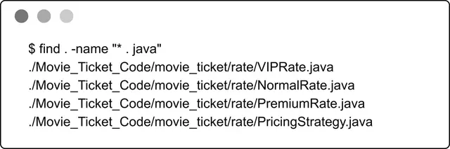
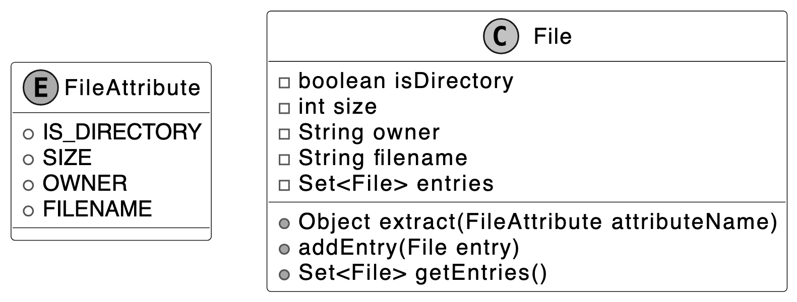
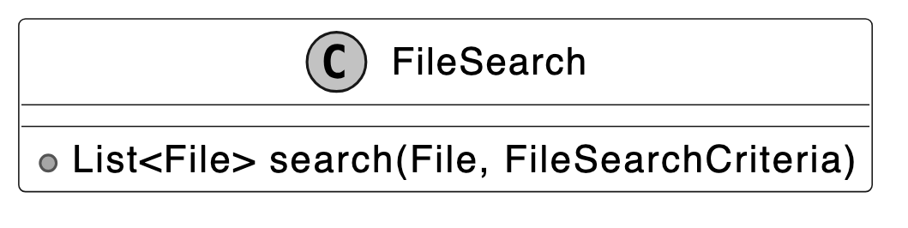
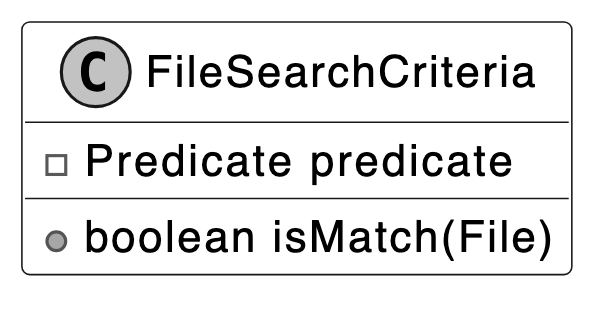
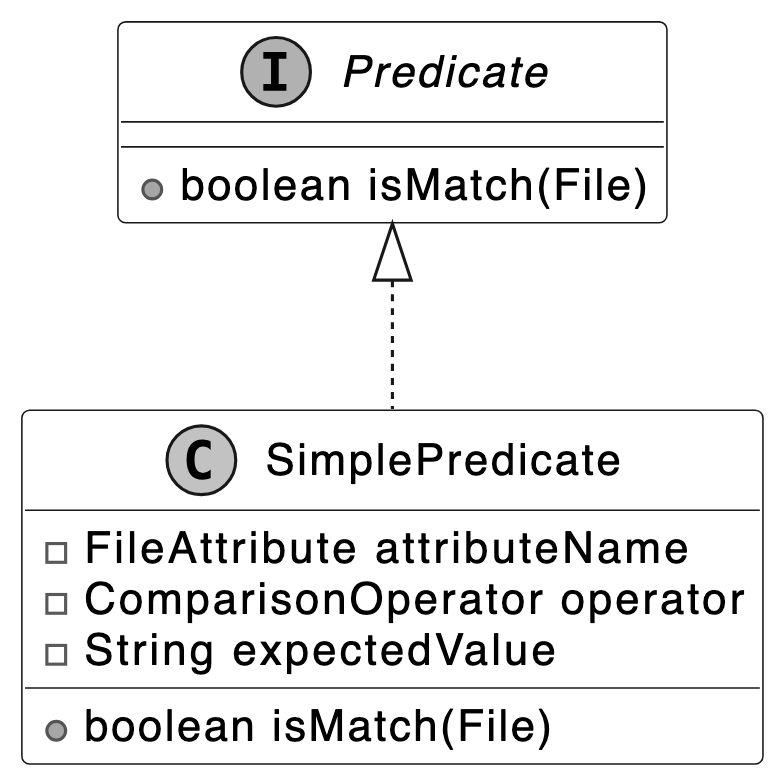
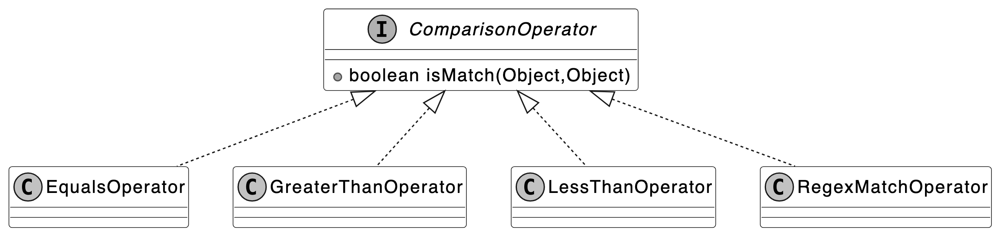
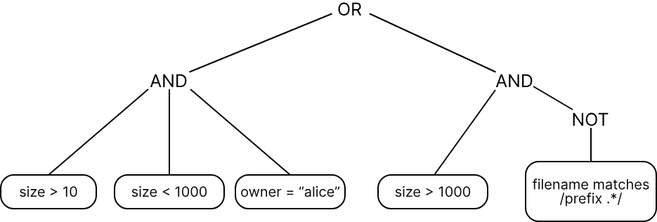
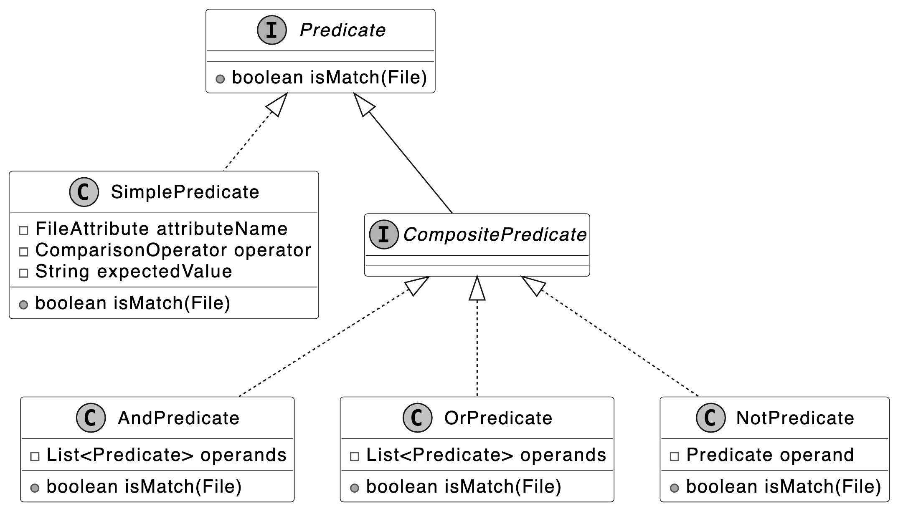
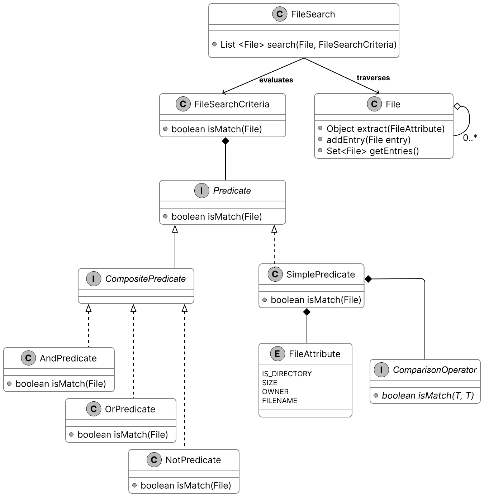
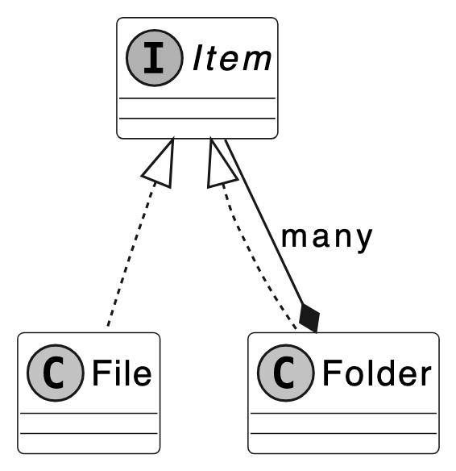

# 06. Design a Unix File Search System

In this chapter, we will explore the design of a Unix File Search system. The goal is to design classes that represent abstractions of the key entities in a file search system, such as directories, files, and filter criteria. We'll aim to create a clear and functional structure that captures the essential interactions between these components, ensuring the search system is intuitive and scalable.

<p align="center">Unix file search</p>

---

## Requirements Gathering

Here is an example of a typical prompt an interviewer might give:

> "Imagine you're a developer trying to find specific files on a Unix system, like files owned by a user, or text files matching a pattern, buried deep in a directory structure. You run a search command, specify your criteria, and the system returns matching files quickly. Behind the scenes, it's recursively traversing directories, evaluating file attributes, and applying your filters efficiently. Let's design a Unix File Search system that handles this process."

### Requirements clarification

Here is an example of how a conversation between a candidate and an interviewer might unfold:

**Candidate:** What attributes does the find command use to search for files?
**Interviewer:** It could be based on criteria like size, file type, filename, and owner.

**Candidate:** Does it need to handle directories?
**Interviewer:** Yes, directories are considered as files too, with a distinct file type.

**Candidate:** What types of comparisons does the command support?
**Interviewer:** That depends on the type of attribute. For strings, we support 'equals' and 'regex match'. For numbers, we support 'greater than', 'equals', and 'less than'.

**Candidate:** Can we combine multiple criteria, even on the same attribute?
**Interviewer:** Yes, with multiple criteria, using 'and', 'or', and 'not' conditions.

**Candidate:** I assume we're designing a system to search a directory and its sub-directories, returning files that match the given conditions.
**Interviewer:** Yes, that's a fair assumption.

### Constructing concrete examples

With the requirements for our Unix File Search system in hand, let's see them in action through some real-world command-line searches. These examples will show what the system needs to handle and set the stage for designing our classes:

- **Start with a Simple Search:** Find files recursively within `/` where `size > 10`.
- **Scale Up to a Complex Search:** Find files recursively within `/` where `((size > 10 and size < 1000 and owner = "alice") or (size > 1000 and !(filename matches /prefix.*/)))`.

### Requirements

Based on the questions and answers, the following functional requirements can be identified:

- The search system can search for files based on attributes such as size, type, filename, and owner.
- The search system supports comparison types depending on the attribute: 'equals' and 'regex match' for strings, and 'greater than', 'equals', and 'less than' for numbers.
- The system can combine multiple search criteria using logical operators (and, or, not).
- The file search system can perform recursive searches within directories.
- The search system can apply search criteria to directories as well as files.

Below are the non-functional requirements:

- **Scalability:** Efficiently handle large directory trees with thousands or millions of files using resource-efficient traversal strategies.
- **Extensibility:** Support adding new attributes (e.g., modification time) and comparison operators without altering core traversal or filtering logic.
- **Separation of concerns:** Keep traversal logic separate from filtering logic for a modular and maintainable design.

---

## Identify Core Objects

Now that we've seen how Unix file searches work, it's time to design a system that can handle them. Let's break it down into core objects, each with a clear role, to create a file search system that's both modular and easy to maintain. Here's what we'll need:

- **FileSearch:** The central entity managing the search process, serving as the entry point into our application logic. It recursively traverses the filesystem from a starting `File` (directory) and returns matches based on a `FileSearchCriteria` object.
- **File:** Models a file or directory in the filesystem, storing attributes like size, type, filename, and owner. It supports a hierarchical structure with entries for subdirectories or files.

> **Design Choice:** The `File` object represents files and directories as a single entity. This enables `FileSearch` to perform consistent traversal and evaluation. This design aligns with the Unix principle that treats everything as a file for uniform handling.

- **FileSearchCriteria:** Encapsulates a search condition and determines whether a given `File` matches it by delegating to a `Predicate`. This wrapper class decouples the search execution logic (`FileSearch`) from the condition evaluation logic (`Predicate`), promoting separation of concerns and greater flexibility.
- **Predicate:** An interface defining the contract for evaluating whether a `File` matches a condition, enabling both simple checks (e.g., "size > 10") and composite conditions (e.g., AND, OR, NOT). We separate `Predicate` from `FileSearchCriteria` to isolate comparisons and logical combinations from how `FileSearch` uses the criteria. This keeps `FileSearchCriteria` a lightweight wrapper, while `Predicate` manages the complex logic.
- **SimplePredicate:** Implements `Predicate` to compare one file attribute (e.g., "size > 10") against a value with an operator (e.g., equals, greater than).
- **CompositePredicate:** Extends `Predicate` for combining conditions (e.g., AND, OR, NOT) with implementations like `AndPredicate`, `OrPredicate`, and `NotPredicate`. It supports complex queries, such as "size > 10 AND owner = 'bob'".
- **ComparisonOperator:** An interface defining how attribute values are compared, with implementations like `EqualsOperator`, `RegexMatchOperator`, `GreaterThanOperator`, and `LessThanOperator`.

> **Alternative approach:** We could merge `FileSearchCriteria` and `Predicate` into a single class, embedding the matching logic directly in `FileSearch`. This simplifies the design by removing one layer but reduces modularity, as the search logic would be tightly coupled to condition evaluation, making it harder to swap criteria. For instance, switching the condition from "size > 10" to "owner = 'bob'" would require updating `FileSearch`.

---

## Design Class Diagram

We've mapped out the core objects, such as `File` and `FileSearch`, for our Unix File Search system. Now, let's define their classes, pinning down their roles and methods to keep everything clear and modular.

### File

To model a filesystem for searching, we need a way to represent files and directories. Rather than relying on a standard library like Java's `java.io.File`, we define a custom `File` class as the core entity, capturing key attributes and supporting hierarchical traversal. It's paired with a `FileAttribute` enum for attributes used in search conditions.

Below is the representation of this class and the enum.

<p align="center">File class</p>

> **Design Choice:** We define `FileAttribute` as an enum to provide a fixed, type-safe set of attributes (e.g., size, owner) for search conditions. This ensures that only valid, predefined attributes are used when evaluating files, preventing runtime errors from invalid attribute names. It also supports scalability: adding a new attribute, such as modification time, requires simply extending the enum, keeping the system extensible without altering existing logic.

### FileSearch

The `FileSearch` class is responsible for traversing the file system from a given `File`, using a `FileSearchCriteria` object to select matching files and return them. By separating traversal from filtering logic, the design remains modular, maintainable, and easy to extend. The UML diagram below illustrates this structure.

<p align="center">FileSearch class</p>

### FileSearchCriteria

The `FileSearchCriteria` class decides which files match our search by connecting `FileSearch` to `Predicate`. It tells `FileSearch` what qualifies as a match, using `Predicate` to check each `File` against the conditions.

Here is the representation of this class.

<p align="center">FileSearchCriteria class</p>

> **Design Choice:** We designed `FileSearchCriteria` to work alongside `Predicate`, allowing it to evaluate whether a file meets the search conditions without handling all the logic itself. This keeps responsibilities clean and modular. For example, `FileSearchCriteria` delegates to a `Predicate` to check if a file's size is greater than 10 or if the owner is "bob." This delegation enables flexibility. We can change or combine filtering logic (like checking different attributes or using complex conditions) without modifying either `FileSearch` or `FileSearchCriteria`. By decoupling the search traversal from condition evaluation, we preserve the separation of concerns and make the system easier to extend and maintain.

### Predicate and SimplePredicate

A key part of our design is the ability to define conditions that determine whether a file should be included in the search results. These conditions can range from simple to complex. For example, we might want files whose names follow a regular expression like `report.*`, or files with sizes exceeding 10 bytes. To manage this, we introduce the `Predicate` interface as the foundation for evaluating files. It defines a single method that takes a `File` object and returns a boolean: `true` if the file satisfies the condition, `false` otherwise.

For straightforward conditions, we implement the `SimplePredicate` class. This concrete class evaluates a single file attribute, such as size or owner, against a specified value using a comparison operator (like greater than or equal). For instance, it can check "is the size bigger than 10?" or "is the owner 'bob'?" by leveraging the `FileAttribute` enum and a `ComparisonOperator` instance. The UML diagram below illustrates how these pieces fit together.

<p align="center">Predicate interface and concrete class</p>

### ComparisonOperator

The `ComparisonOperator` interface defines a contract for comparing a file's attribute value (like size or name) to an expected value, answering questions like "is the size greater than 10?" or "does the filename match the pattern `log.*`?" It declares a method that takes two values (the attribute's actual value and the target value), and returns a boolean indicating whether the comparison holds. We implement this interface with concrete classes, such as:

- **`EqualsOperator`** confirms if two attribute values are the same, like "is the owner 'bob'?"
- **`GreaterThanOperator`** verifies if one attribute value is larger, like "is the size over 10?"
- **`LessThanOperator`** ensures one attribute value is smaller, like "is the size under 5?"
- **`RegexMatchOperator`** evaluates whether a string attribute value satisfies a regular expression pattern, such as checking if the filename matches `log.*` (e.g., `log.txt` or `logger` would return true).

This interface-based design allows `SimplePredicate` to delegate comparisons to specialized classes like `EqualsOperator` or `RegexMatchOperator`, each optimized for its operation, enabling precise and efficient file filtering in `FileSearchCriteria`.

The UML diagram below shows how this structure comes together.

<p align="center">ComparisonOperator interface and concrete classes</p>

> **Alternative approaches:** We could represent operations with strings such as "equals" or ">". This simplifies initial implementation but shifts validation to runtime. Each string must be parsed and mapped to a comparison function, which increases execution time and risks runtime exceptions if an invalid operator (e.g., "equals") is left unchecked.
>
> Another option is to use enums like `EQUALS` or `GREATER_THAN` to represent comparison operations. This makes the code safer and faster because the operations are checked at compile time, not at runtime. However, if you want to add a new operation, like case-insensitive equality for owner names, you would need to change the enum itself. In contrast, with the interface-based approach, you can just create a new class for the new operation without touching existing code.

### Composite Predicate

With `SimplePredicate` and its `ComparisonOperator` implementations in place, we can already test files against single conditions like `size > 10` or `owner = 'alice'`. But real-world searches often demand more, combining multiple conditions with logical operators. To tackle this, we use the Composite design pattern, enabling us to build complex predicates from simpler ones.

> **Note:** To learn more about the Composite Pattern and its common use cases, refer to the Further Reading section at the end of this chapter.

Consider a search like this:

> Find files where `((size > 10 and size < 1000 and owner = "alice") or (size > 1000 and !(filename matches /prefix.*/)))`.

If we label each simple condition:

- A for "size > 10"
- B for "size < 1000"
- C for "owner = 'alice'"
- D for "size > 1000"
- E for "filename matches 'prefix.*'"

It becomes: `((A and B and C) or (D and !(E)))`

This structure uses "and," "or," and "not" operators, with brackets indicating the order of nested evaluations. This tree-like hierarchy needs a systematic way to evaluate files.

<p align="center">Tree evaluation</p>

To handle this, we define the `CompositePredicate` interface, extending `Predicate`, with concrete implementations: `AndPredicate`, `OrPredicate`, and `NotPredicate`. These classes compose multiple predicates into a single unit, evaluated recursively:

- **`AndPredicate`** takes a list of predicates (e.g., A, B, C) and returns `true` only if all succeed for a given file.
- **`OrPredicate`** takes a list (e.g., the `AndPredicate` result and another group) and returns `true` if at least one succeeds.
- **`NotPredicate`** wraps a single predicate (e.g., E) and inverts its result.

In our example:

- `AndPredicate` combines "size > 10", "size < 1000", and "owner = 'alice'" into one check.
- Another `AndPredicate` pairs "size > 1000" with a `NotPredicate` that negates "filename matches 'prefix.*'".
- `OrPredicate` links these two groups, returning `true` if either holds.

This structure, rooted in `CompositePredicate`, delivers a boolean result to `FileSearchCriteria` efficiently by distributing evaluation across the tree, avoiding redundant checks.

The UML diagram below illustrates this recursive composition.

<p align="center">CompositePredicate interface and concrete classes</p>

---

## Complete Class Diagram

Having built our classes, from the hierarchical `File` structure to the intricate predicate logic, we're ready to see the complete system in a UML class diagram below. The detailed methods and attributes are skipped to make the diagram more readable.

<p align="center">Class Diagram of File Search</p>

---

## Code - Unix File Search

Now that the design is in place, we can move on to implementing the core components: defining files and their attributes, applying conditions to evaluate matches, and performing the actual file search across the directory structure.

### File

The `File` class models both files and directories in our search system, encapsulating attributes such as size, name, owner, and a boolean flag indicating directory status. It maintains a hierarchical structure through a set of child `File` objects, which represent the contents of subdirectories. Built for immutability, it offers no setters. Attributes are set at construction and remain unchanged, ensuring data consistency throughout the search process.

Tied to this, the `FileAttribute` enum defines the searchable properties, such as `SIZE` or `OWNER`, enabling `SimplePredicate` to extract the correct value (e.g., size for a "size > 10" condition) during evaluation.

Below is the code implementation:

```java
// Represents a file or directory in the file system
// Contains basic file attributes and supports hierarchical structure
public class File {
    private final boolean isDirectory;
    private final int size;
    private final String owner;
    private final String filename;
    // Set of directory entries (files and subdirectories)
    private final Set<File> entries = new HashSet<>();

    // Creates a new file with the specified attributes
    public File(
            final boolean isDirectory,
            final int size,
            final String owner,
            final String filename) {
        this.isDirectory = isDirectory;
        this.size = size;
        this.owner = owner;
        this.filename = filename;
    }

    // Extracts the value of a specified file attribute
    public Object extract(final FileAttribute attributeName) {
        switch (attributeName) {
            case SIZE -> {
                return size;
            }
            case OWNER -> {
                return owner;
            }
            case IS_DIRECTORY -> {
                return isDirectory;
            }
            case FILENAME -> {
                return filename;
            }
        }
        throw new IllegalArgumentException("invalid filter criteria type");
    }

    // Adds a file or directory entry to this directory
    public void addEntry(final File entry) {
        entries.add(entry);
    }

    // getter methods omitted for brevity
}

// Represents the different attributes that can be checked for a file
public enum FileAttribute {
    IS_DIRECTORY,
    SIZE,
    OWNER,
    FILENAME
}
```

- The `extract` method retrieves a specific attribute's value by mapping a `FileAttribute` enum constant (like `SIZE` or `OWNER`) to its corresponding field. This provides `SimplePredicate` with the value needed to evaluate a condition, such as size for "size > 10".
- Complementing this, the `addEntry` method builds the directory hierarchy by adding a `File` instance to the `entries` set, enabling the recursive structure essential for file system traversal.

### Predicate

The `Predicate` interface defines the contract for evaluating whether a `File` satisfies a search condition, serving as the cornerstone of our system's filtering logic. It declares a single method, `isMatch`, which accepts a `File` instance and returns a boolean: `true` if the file meets the condition, `false` otherwise. Here's its implementation:

```java
// Base interface for all file search predicates
public interface Predicate {
    // Checks if the given file matches the search condition
    boolean isMatch(final File inputFile);
}
```

This method powers `FileSearchCriteria` by providing the yes-or-no decision needed to filter files during traversal. Its abstract nature ensures flexibility, supporting everything from simple checks like "size > 10" to complex combinations, laying the groundwork for both `SimplePredicate` and `CompositePredicate` implementations.

### ComparisonOperator

The `ComparisonOperator` interface specifies a contract for comparing a file's attribute value to an expected value, enabling precise condition checks, such as "is the size greater than 10?" or "does the filename match `log.*`?". It defines an `isMatch` method that takes two parameters (the attribute's actual value and the target value) and returns a boolean indicating if the comparison holds.

We use generics (`<T>`) to enforce type safety, ensuring that numeric attributes (e.g., `Double` for size) are compared only with numbers, and string attributes (e.g., `String` for names) are compared only with strings.

Below is the implementation of this interface:

```java
// Base interface for all comparison operations in the file search system
public interface ComparisonOperator<T> {
    boolean isMatch(final T attributeValue, final T expectedValue);
}
```

Concrete implementations, such as `EqualsOperator`, `GreaterThanOperator`, `LessThanOperator`, and `RegexMatchOperator`, encapsulate the logic for equality, ordering, and pattern matching, each tailored to its respective type. These are shown below.

```java
// Implements exact equality comparison between values
public class EqualsOperator<T> implements ComparisonOperator<T> {
    @Override
    public boolean isMatch(final T attributeValue, final T expectedValue) {
        return Objects.equals(attributeValue, expectedValue);
    }
}

// Implements greater than comparison for numeric values
class GreaterThanOperator<T extends Number> implements ComparisonOperator<T> {
    @Override
    public boolean isMatch(final T attributeValue, final T expectedValue) {
        return Double.compare(attributeValue.doubleValue(), expectedValue.doubleValue()) > 0;
    }
}

// Implements less than comparison for numeric values
class LessThanOperator<T extends Number> implements ComparisonOperator<T> {
    @Override
    public boolean isMatch(final T attributeValue, final T expectedValue) {
        return Double.compare(attributeValue.doubleValue(), expectedValue.doubleValue()) < 0;
    }
}

// Implements regular expression pattern matching for string values
public class RegexMatchOperator<T extends String> implements ComparisonOperator<T> {
    @Override
    public boolean isMatch(final T attributeValue, final T expectedValue) {
        final Pattern p = Pattern.compile(expectedValue);
        return p.matcher(attributeValue).matches();
    }
}
```

The `isMatch` method takes an actual value (from a `File` attribute) and an expected value (set in `SimplePredicate`), and returns `true` if they satisfy the operator's rule.

> **Implementation choice:** We leverage generics (`<T>`) in this design to enforce type safety at compile time, ensuring that attribute values and expected values align in type, such as `Double` for size or `String` for filename, making the code robust and readable.

### SimplePredicate

The `SimplePredicate` class implements the `Predicate` interface to test a `File` against a single condition, such as whether its size exceeds 10 or its owner is "bob". Designed with generics (`<T>`), it pairs a `FileAttribute` enum value (e.g., `SIZE`, `OWNER`) with a `ComparisonOperator<T>` and an expected value of type `T` to define the check.

Here's how it's structured:

```java
// A basic predicate that compares a file attribute with an expected value
public class SimplePredicate<T> implements Predicate {
    // The name of the file attribute to check
    private final FileAttribute attributeName;
    // The operator to use for comparison (equals, contains, greater than, etc.)
    private final ComparisonOperator<T> operator;
    // The expected value to compare against
    T expectedValue;

    // Creates a new simple predicate with the specified attribute, operator, and
    // expected value
    public SimplePredicate(
            final FileAttribute attributeName,
            final ComparisonOperator<T> operator,
            final T expectedValue) {
        this.attributeName = attributeName;
        this.operator = operator;
        this.expectedValue = expectedValue;
    }

    @Override
    public boolean isMatch(final File inputFile) {
        // Extract the actual value of the attribute from the file
        Object actualValue = inputFile.extract(attributeName);
        // Check if the actual value is of the correct type
        if (expectedValue.getClass().isInstance(actualValue)) {
            // Perform the comparison using the specified operator
            return operator.isMatch((T) actualValue, expectedValue);
        } else {
            return false;
        }
    }
}
```

This implementation of `SimplePredicate` ensures type safety and modularity, allowing `FileSearchCriteria` to apply precise, single-attribute filters across the filesystem traversal.

### CompositePredicate

The `CompositePredicate` interface extends `Predicate` to combine multiple predicates into complex conditions, such as "size > 10 and owner = 'bob'". We follow the Composite design pattern, which organizes predicates into a tree where simple ones (like `SimplePredicate`) act as leaves and combinations (like `AndPredicate`) act as nodes, all sharing the `Predicate` interface. This lets us evaluate them recursively, treating single and combined conditions the same way.

Here's the code:

```java
public interface CompositePredicate extends Predicate {
    // This interface is intentionally empty as it serves as a marker
    // to identify predicates that combine multiple other predicates (AND, OR, NOT)
}

// Implements logical AND operation between multiple predicates
public class AndPredicate implements CompositePredicate {
    // List of predicates that must all match for this predicate to match
    private final List<Predicate> operands;

    // Creates a new AND predicate with the specified predicates
    public AndPredicate(final List<Predicate> operands) {
        this.operands = operands;
    }

    // Checks if the given file matches ALL predicates
    @Override
    public boolean isMatch(final File inputFile) {
        return operands.stream().allMatch(predicate -> predicate.isMatch(inputFile));
    }
}

// Implements logical OR operation between multiple predicates
public class OrPredicate implements CompositePredicate {
    // List of predicates, at least one of which must match
    private final List<Predicate> operands;

    // Creates a new OR predicate with the specified predicates
    public OrPredicate(final List<Predicate> operands) {
        this.operands = operands;
    }

    @Override
    public boolean isMatch(final File inputFile) {
        return operands.stream().anyMatch(predicate -> predicate.isMatch(inputFile));
    }
}

// Implements logical NOT operation on a predicate
public class NotPredicate implements CompositePredicate {
    // The predicate to negate
    private final Predicate operand;

    // Creates a new NOT predicate with the specified predicate to negate
    public NotPredicate(final Predicate operand) {
        this.operand = operand;
    }

    @Override
    public boolean isMatch(final File inputFile) {
        return !operand.isMatch(inputFile);
    }
}
```

- `AndPredicate` checks if all conditions pass (e.g., "size > 10 and owner = 'bob'").
- `OrPredicate` checks if any condition passes (e.g., "size > 10 or owner = 'bob'").
- `NotPredicate` takes a single predicate and flips its `isMatch` result (e.g., "filename not ending with '.txt'").
- `AndPredicate` and `OrPredicate` use `List<Predicate>` to support any number of conditions.
- `NotPredicate` takes just one condition.
- **Combined Impact:** Enables `FileSearchCriteria` to process nested logical conditions efficiently.

### FileSearchCriteria

The `FileSearchCriteria` class acts as a bridge between `FileSearch` and the predicate-based conditions that determine which files match, delegating the evaluation to a `Predicate`, whether a `SimplePredicate` or `CompositePredicate`. Here's its implementation:

```java
// Wrapper class that encapsulates a search condition for file matching
public class FileSearchCriteria {
    // The predicate that defines what makes a file match
    private final Predicate predicate;

    // Constructor that takes a predicate defining the criteria
    public FileSearchCriteria(final Predicate predicate) {
        this.predicate = predicate;
    }

    // Checks if the given file matches the search criteria
    public boolean isMatch(final File inputFile) {
        return predicate.isMatch(inputFile);
    }
}
```

This design centers on the `isMatch` method, which invokes the `Predicate`'s logic to assess a `File` and returns `true` for matches, such as "size > 10" with `SimplePredicate` or "size > 10 and owner = 'bob'" with `CompositePredicate`.

> **Implementation choice:** We chose to wrap the `Predicate` in `FileSearchCriteria` to keep `FileSearch` focused solely on filesystem traversal and isolate condition evaluation to a separate, reusable layer.
>
> **Alternate implementation:** Instead of using `FileSearchCriteria`, `FileSearch` could directly invoke the `Predicate`'s logic to evaluate files. However, this would tightly couple traversal and filtering logic, making it harder to modify or extend conditions independently.

### FileSearch

The `FileSearch` class orchestrates the search across the filesystem, starting from a root `File` and leveraging `FileSearchCriteria` to identify matching files through recursive traversal. It employs a stack-based approach to explore directories efficiently. Here's the implementation:

```java
// Main class responsible for performing file system searches
public class FileSearch {
    // Performs a recursive search through the file system starting from root
    // Returns a list of files that match the given criteria
    public List<File> search(final File root, final FileSearchCriteria criteria) {
        // List to store matching files
        final List<File> result = new ArrayList<>();
        // Stack to handle recursive traversal without actual recursion
        final ArrayDeque<File> recursionStack = new ArrayDeque<>();
        // Start with the root directory
        recursionStack.add(root);
        // Continue until we've processed all files
        while (!recursionStack.isEmpty()) {
            // Get the next file to process
            File next = recursionStack.pop();
            // Check if the file matches our criteria
            if (criteria.isMatch(next)) {
                result.add(next);
            }
            // Add all directory entries to the stack for processing
            for (File entry : next.getEntries()) {
                recursionStack.push(entry);
            }
        }
        return result;
    }
}
```

This `search` method begins by initializing a result list and an `ArrayDeque` stack with the root `File`. It then processes each file by popping it from the stack, evaluating it with `criteria.isMatch`, and adding matches to the result. For directories, it pushes all entries onto the stack, ensuring every file is visited in a depth-first manner. The returned `List<File>` contains all matches, mutable for flexibility in downstream use, by the client code.

> **Implementation choice:** We opted for a stack over recursive calls to prevent stack overflow in deep filesystems, balancing efficiency with robustness. Alternatively, a recursive method could work for smaller structures, but it risks failure on large or deeply nested directories.

---

## Deep Dive Topic

Now that the basic design is complete, the interviewer might ask you some deep dive questions. Let's check out some of these.

### File search test

After implementing our classes, it's a good idea to verify the end-to-end logic. The UNIX file search problem is abstract, so we create a test case to demonstrate how it works.

Here's a test case for the condition "non-directories owned by 'ge.*'":

```java
public class FileSearchTest {
    @Test
    public void testFileSearch() {
        // Create a root directory and two files with different owners
        final File root = new File(true, 0, "adam", "root");
        final File a = new File(false, 2000, "adam", "a");
        final File b = new File(false, 3000, "george", "b");

        // Add files to the root directory
        root.addEntry(a);
        root.addEntry(b);

        // Search criteria: Find non-directory files owned by users matching "ge.*"
        final FileSearchCriteria criteria =
                new FileSearchCriteria(
                        new AndPredicate(
                                List.of(
                                        new SimplePredicate<>(
                                                FileAttribute.IS_DIRECTORY,
                                                new EqualsOperator<>(),
                                                false),
                                        new SimplePredicate<>(
                                                FileAttribute.OWNER,
                                                new RegexMatchOperator<>(),
                                                "ge.*"))));

        // Execute the search and get results
        final FileSearch fileSearch = new FileSearch();
        final List<File> result = fileSearch.search(root, criteria);

        // Verify that only one file matches the criteria
        assertEquals(1, result.size());
        // Verify that the matching file is "b"
        assertEquals("b", result.get(0).getFilename());
    }
}
```

---

## Wrap Up

With the UNIX file search system fully implemented and tested, it's time to step back and consider what we've achieved. This chapter began by gathering requirements through a structured dialogue, then progressed to defining core objects, crafting their class structure, and coding the essential components.

The system's maintainability and extensibility are ensured by the clear division of responsibilities among the classes: `File`, `FileSearch`, `FileSearchCriteria`, and `Predicate`, which respectively represent files, traverse directories, evaluate conditions, and define match logic. Our choices, such as separating `FileSearch` from `FileSearchCriteria` and using generics in `ComparisonOperator`, improve scalability and maintain type safety throughout processes. We could have merged `FileSearchCriteria` with `Predicate` into one class for a tighter initial design, but this would blur their distinct roles, making it harder to update or swap condition logic without affecting traversal.

Congratulations on getting this far! Now give yourself a pat on the back. Good job!

---

## Further Reading: Composite Design Pattern

This section gives a quick overview of the design patterns used in this chapter. It's helpful if you're new to these patterns or need a refresher to better understand the design choices.

### Composite design pattern

Composite is a structural pattern that lets you organize objects into tree structures and then handle these structures as if they were individual objects.

**Problem**

Imagine you have two types of objects: Files and Folders. A Folder can contain several Files as well as many smaller Folders and so on. Say you decide to create a search system that uses these classes. Searches could involve simple Files on their own, as well as Folders packed with Files, and other Folders. How would you find all items matching a specific condition, like "size > 10," across this structure?

**Solution**

The Composite pattern suggests that we work with Files and Folders through a common interface that declares a method for checking conditions.

Here's how this method works:

- **For a File:** It checks if the File matches the condition, like "size > 10," and gives a yes or no answer.
- **For a Folder:**
  - It examines each item within, testing whether it meets the condition.
  - It recursively applies this process to any nested folders, traversing the entire tree until all items are evaluated.
  - It can also enforce its constraint, such as "not a directory," to refine the result.

Here's a simple diagram showing the Composite pattern for Files and Folders:

<p align="center">Item interface and concrete classes</p>

`Item` is the common interface that both `File` and `Folder` use. The advantage is that we can treat all objects, `File` or nested `Folder`, the same through the common interface, letting them pass the check down the tree without knowing their types.

**When to use**

The Composite design pattern is useful in scenarios where:

- You need to build a tree-like object structure.
- When you want the client code to handle both simple and complex elements uniformly.