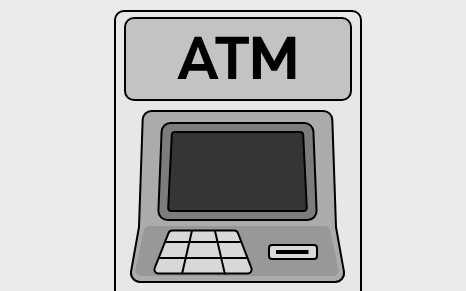
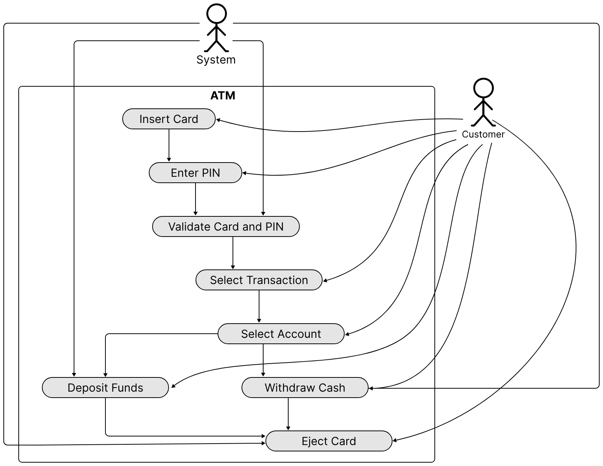
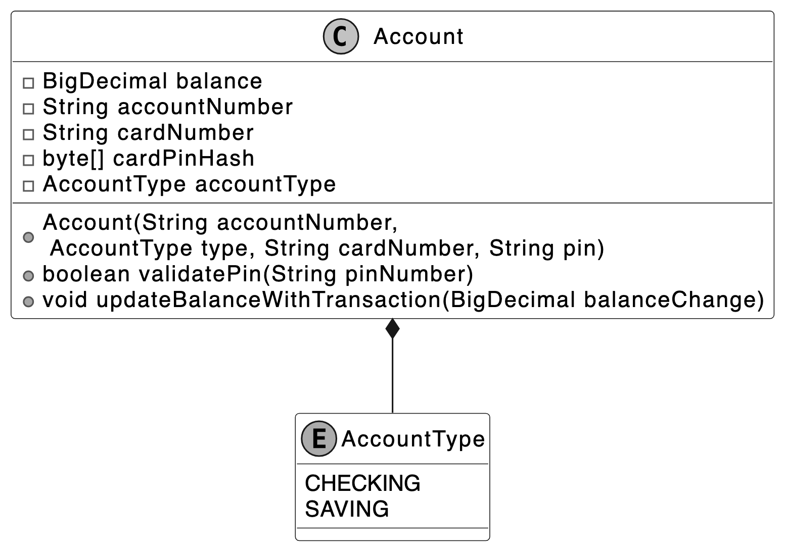
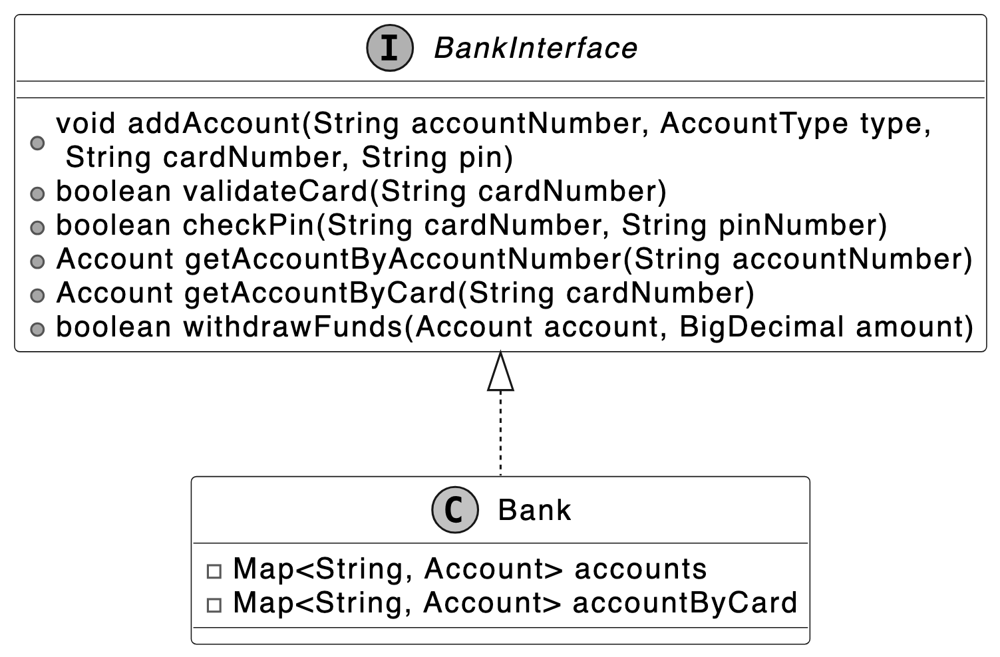
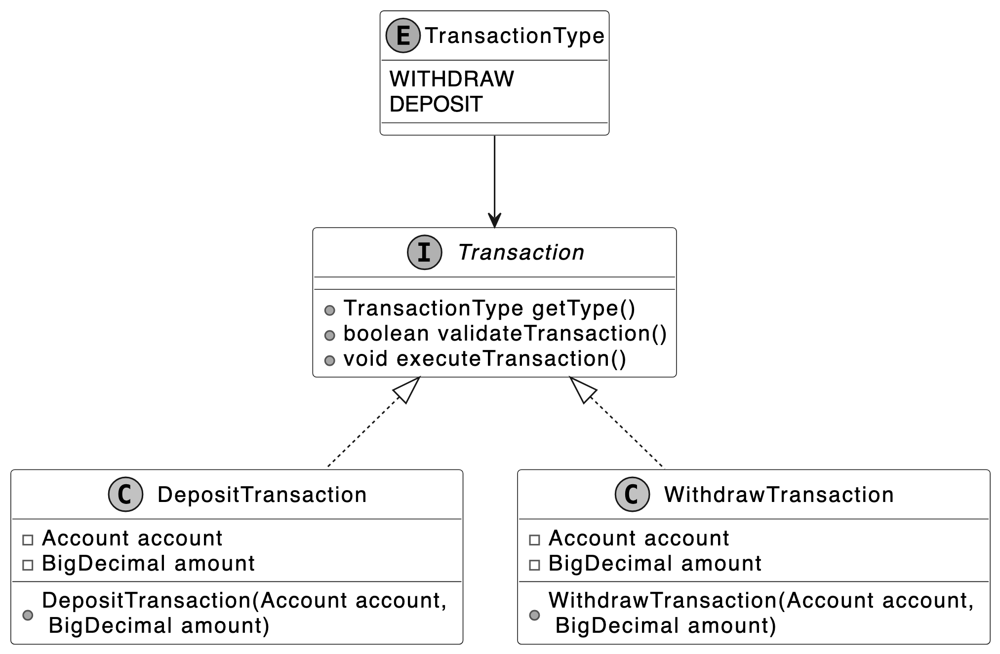
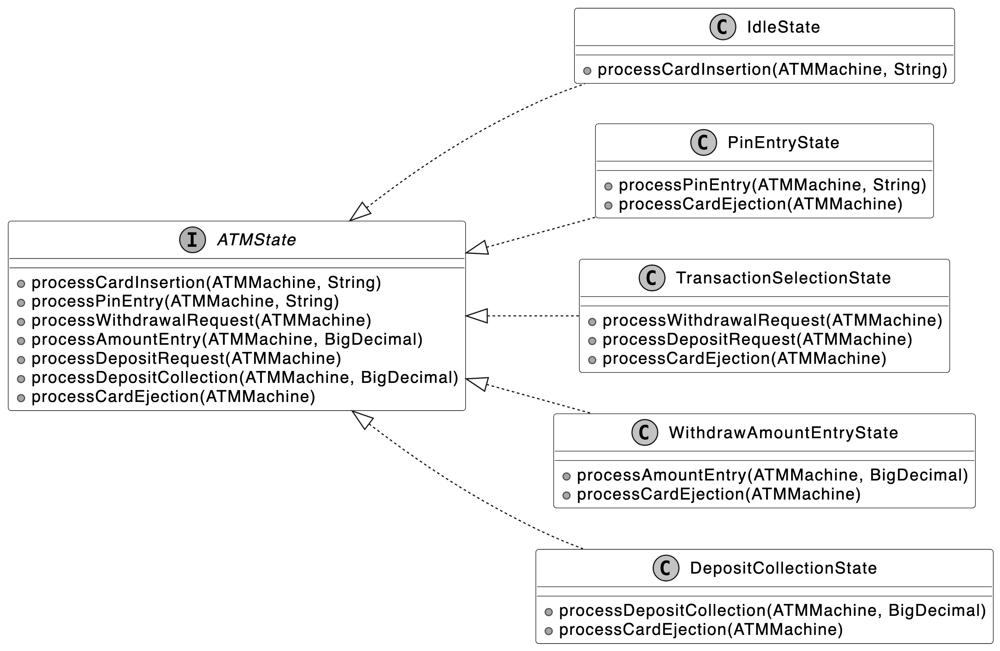
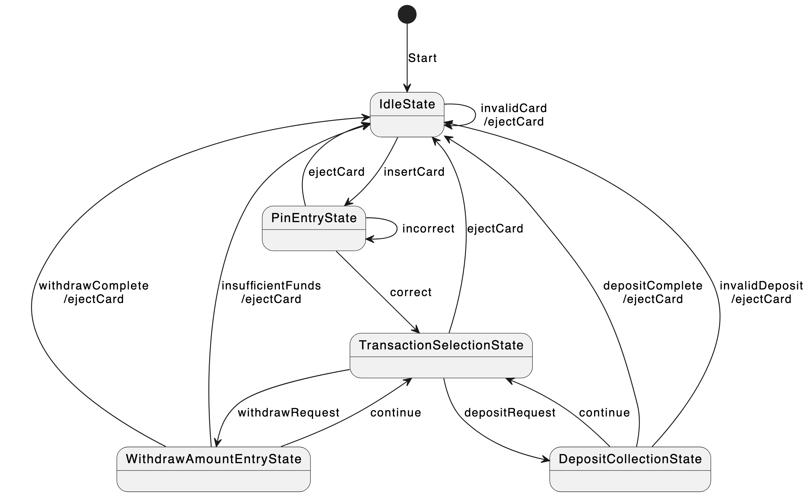
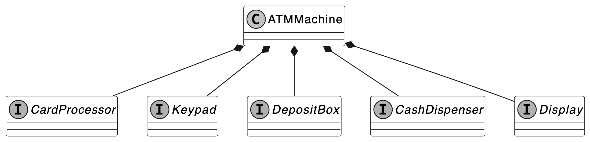
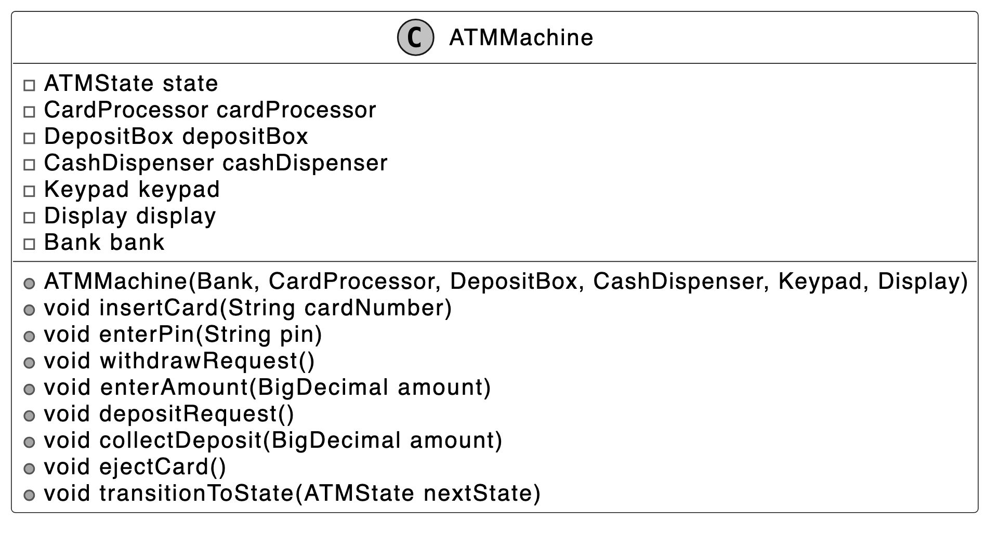
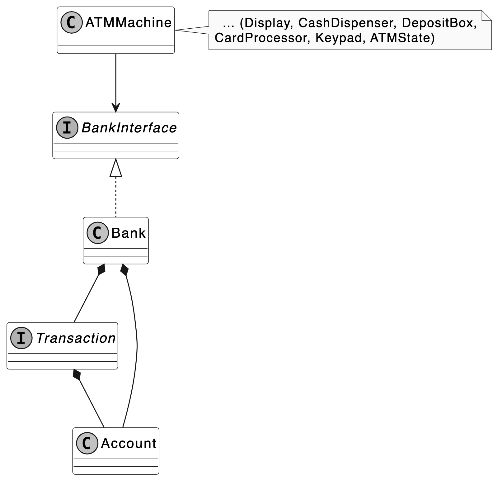

# 13. Design an ATM System

In this chapter, we will explore the object-oriented design of an ATM system. The primary purpose of an ATM is to automate banking tasks for users, allowing them to check balances, withdraw cash, and transfer funds. This design aims to make these operations seamless by designing classes that model key components, such as the ATM machine, bank accounts, hardware interfaces, and transaction states.

<p align="center">Automated Teller Machine (ATM)</p> 

Let's gather the specific requirements through a simulated interview scenario.

---

## Requirements Gathering

Here is an example of a typical prompt an interviewer might give:

*"Picture yourself approaching an ATM on a busy afternoon to manage your banking needs. You insert your card, enter your PIN, and then choose from options such as checking your balance, withdrawing cash, or depositing funds. Within seconds, the system verifies your credentials and processes your request. Behind the scenes, the ATM coordinates with the bank, manages account transactions, and interacts with hardware like the card reader and cash dispenser. Now, let's design an ATM system that handles these operations smoothly and reliably."*

### Requirements clarification

The first step in designing the ATM system is to understand precisely what the interviewer wants you to design. Here is an example of how a conversation between a candidate and an interviewer might unfold:

**Candidate:** For user interactions, I think the ATM should have a card reader to process debit cards, a keypad for entering the PIN and selecting options, a screen to display instructions and menus, a cash dispenser for withdrawals, and a deposit slot for accepting cash. Does this cover the main components, or are there additional ones I should consider?
**Interviewer:** That's a solid list.

**Candidate:** I envision the ATM guiding users through a clear flow: the user inserts their card, enters a PIN for authentication, and then sees a menu with options like checking balance, withdrawing cash, or depositing funds. After completing a task, the ATM offers the choice to continue or exit, ejecting the card at the end. Does this flow align with your vision, or should I adjust any steps?
**Interviewer:** Your flow is accurate. It starts with card insertion, PIN entry, and a menu for tasks. After each task, the user can continue or exit, with the card ejected at the end.

**Candidate:** For authentication, I assume the ATM validates the card and PIN combination. If either is invalid, it displays an error.
**Interviewer:** Yes, the ATM validates the card and PIN, showing an error for invalid inputs. Including a limit of three PIN attempts before locking the card is a good security measure. Let's keep that in scope.

**Candidate:** Regarding accounts, I propose that the ATM supports multiple accounts per user, such as Checking and Savings, linked to their card. Users can select an account for transactions. Does this match your requirements?
**Interviewer:** That's correct. The ATM should support Checking and Savings accounts, with users able to select one for transactions. No additional account types are needed for now.

**Candidate:** For transactions, I think the ATM should handle Withdraw and Deposit operations. For example, withdrawals check for sufficient funds, and deposits update the balance. Should we include other transactions like transfers, or focus on these two?
**Interviewer:** Let's focus on Withdraw and Deposit for simplicity. Transfers are out of scope for now. Ensure withdrawals validate funds and deposits process cash accurately.

**Candidate:** To handle errors, I suggest the ATM displays clear messages for issues like insufficient funds, invalid PINs, or hardware failures.
**Interviewer:** I agree that clear error messages are essential.

### Requirements

Based on the requirements gathering dialogue, the following functional requirements are identified for the ATM system:

- Authenticate users via a debit card and PIN.
- Support multiple accounts per user, including Checking and Savings account types, with the ability to select an account for transactions.
- The machine should include a Card Reader, Keypad, Screen, Cash Dispenser, Deposit Slot, and an optional Printer for receipts.
- Support Withdraw and Deposit transactions, ensuring withdrawals validate sufficient funds and deposits update the account balance.
- Handle exceptions, such as insufficient funds or incorrect inputs, by displaying clear error messages and retaining the card after repeated invalid attempts.

Below are the non-functional requirements:

- The ATM must protect user data with strong security measures and retain cards after repeated invalid PIN attempts to ensure user trust.
- The ATM must operate reliably, minimizing disruptions and safely ejecting cards during failures to maintain user confidence.

---

## Use Case Diagram

In the ATM system, a use case diagram illustrates how customers interact with the system to perform banking tasks, clarifying essential actions such as card insertion, PIN entry with up to three attempts, account selection, transaction processing, and error handling.

<p align="center">Use Case Diagram of ATM</p> 

The **Customer** actor has the following main use cases:

- **Insert Card:** The customer initiates a session by inserting their card into the ATM.
- **Enter PIN:** After inserting the card, the customer then enters their PIN for authentication.
- **Select Transaction:** The customer chooses a transaction type, such as withdrawing cash or depositing funds, from the menu.
- **Select Account:** The customer selects an account (e.g., Checking or Savings) for the transaction.
- **Withdraw Cash:** The customer requests a cash withdrawal and specifies the desired amount.
- **Deposit Funds:** The customer deposits cash into the ATM.
- **Eject Card:** The customer requests card ejection (e.g., by canceling or ending the session), the ATM ejects the card, and the session terminates.

The **System** actor's use cases are listed below. Note that actors may not always be human.

- **Validate Card and PIN:** The system verifies the customer's card and PIN to grant access to banking options.
- **Withdraw Cash:** The system processes the withdrawal request, confirms sufficient funds, and dispenses cash.
- **Deposit Funds:** The system accepts the deposited cash and updates the customer's account balance accordingly.
- **Eject Card:** The ATM ejects the card, and the session ends.

---

## Identify Core Objects

To design a modular and maintainable ATM system, we identify core objects that encapsulate distinct responsibilities, aligning with the functional requirements and user flow. These objects model the system's key entities and interactions, ensuring clear separation of concerns and extensibility.

- **Bank:** Stores and manages accounts.
- **Account:** Represents a customer's bank account. Manages a customer's account details, including balance, account number, card number, PIN (hashed for security), and account type (Checking or Savings).
- **ATMMachine:** Acts as the main coordinator, managing user interaction and connecting with hardware elements like the card reader, keypad, screen, cash dispenser, and deposit slot.

> **Design choice:** We consolidate hardware access and management within the ATMMachine object to ensure consistent behavior across components, enabling a seamless user flow from card insertion to transaction completion.

- **Transaction:** Manages financial transactions like cash withdrawals and deposits, including validation checks (e.g., sufficient balance for withdrawals) and transaction execution.

---

## Design Class Diagram

With the core objects and their roles defined, we now design their classes, attributes, and methods to construct a modular and extensible ATM system that meets the specified requirements.

### Account

This class represents a customer's bank account as a distinct entity within the ATM system, encapsulating the essential data and operations needed to support user authentication and financial transactions.

The `Account` class manages critical information, including the account balance, account number, associated card number, and PIN, while using an `AccountType` enum to distinguish between account types like Checking and Savings. It enables authentication by validating the PIN and supports transactions by updating the balance for withdrawals and deposits, ensuring the account's state reflects the user's financial activities accurately and efficiently.

<p align="center">Account class and AccountType enum</p> 

> **Important discussion:** Rather than maintaining a transaction ledger for auditability and deriving the balance from it, as is typical in real-world banking, we simplify the system by directly updating the account balance during each transaction. This approach prioritizes the ATM's core functionality and effective scope management.

### Bank

In object-oriented design questions, systems are usually self-contained and don't use real databases or web service API calls. The `Bank` class is designed to be a separate component that handles the main data and operations needed for the ATM to work.

The `Bank` class stores `Account` objects and links them to cards for fast retrieval, enabling efficient card and PIN validation for authentication, account access for transactions, and funds availability checks for withdrawals.

To ensure flexibility and scalability, we define a `BankInterface` to decouple the `Bank` implementation from the ATM. This allows the local `Bank` object to be easily replaced with a networked implementation, such as an API client adapter, if the system were to be extended for production use, without modifying the ATM's core logic.

<p align="center">BankInterface interface and concrete class</p> 

> **Alternative approach:** We could integrate the Bank's functionality directly into the `ATMMachine`. However, this would tightly couple account management with the ATM's operations, reducing modularity and making it harder to adapt the system for networked banking or other extensions in the future.

### Transaction

The purpose of designing the `Transaction` class is to provide a unified framework for handling financial operations in the ATM system, enabling the system to process withdrawals and deposits consistently and reliably.

The `Transaction` class, as an interface, defines a contract for all transaction types, supported by a `TransactionType` enum that specifies Withdraw and Deposit operations. It validates transactions, such as checking funds for withdrawals, and updates the account balance, using concrete classes like `WithdrawTransaction` and `DepositTransaction` for reliable processing.

> **Design choice:** By abstracting `Transaction` as a separate object, we can represent different transaction types (e.g., Withdraw, Deposit) with shared behavior, making it easier to introduce new types in the future without modifying the core logic.

<p align="center">Transaction interface and concrete classes</p> 

### ATMState

The purpose of designing the `ATMState` interface is to provide a framework for handling the distinct stages of the ATM's interaction process, ensuring the `ATMMachine` can manage each user step systematically.

The `ATMState` interface defines the operations for each stage of the ATM's flow, such as card insertion, PIN entry, transaction selection, and cash handling. Concrete state classes like `IdleState`, `PinEntryState`, `TransactionSelectionState`, `WithdrawAmountEntryState`, and `DepositCollectionState` implement the specific behavior for each stage.

<p align="center">ATMState interface and concrete classes</p> 

The following state transition diagram visualizes this design.

<p align="center">State transition diagram</p> 

- **IdleState:** Awaits card insertion, transitions to `PinEntryState` on valid card.
- **PinEntryState:** Processes PIN entry, transitions to `TransactionSelectionState` on valid PIN.
- **TransactionSelectionState:** Processes transaction selection, transitions to `WithdrawAmountEntryState` or `DepositCollectionState`.
- **WithdrawAmountEntryState:** Handles withdrawal amount entry, executes transaction, returns to `TransactionSelectionState` or `IdleState`.
- **DepositCollectionState:** Processes deposit amount, executes transaction, returns to `TransactionSelectionState` or `IdleState`.

> **Note:** To learn more about the State pattern and its everyday use cases, refer to the Vending Machine chapter of the book.

### Hardware component interfaces

The purpose of designing the hardware component interfaces is to provide a set of interfaces that handle user interactions and physical operations within the ATM system, ensuring the `ATMMachine` can operate independently of specific hardware implementations.

The hardware components, including `CardProcessor`, `Keypad`, `Display`, `CashDispenser`, and `DepositBox`, define the operations needed for interacting with the user and managing physical tasks, such as reading cards, accepting PIN entries, displaying messages, dispensing cash, and collecting deposits. They enable the `ATMMachine` to perform these tasks through well-defined interfaces, ensuring flexibility and ease of testing with simulated implementations.

- **CardProcessor:** The CardProcessor interface enables the ATMMachine to read a card during insertion and release it after the user's session, managing card-related operations for starting and ending transactions.
- **Keypad:** The Keypad interface captures user inputs such as PINs, transaction choices, and amounts.
- **DepositBox:** The DepositBox interface collects the deposited amount during a deposit transaction, enabling the ATMMachine to handle cash deposits from users.
- **CashDispenser:** The CashDispenser interface delivers the requested cash to the user during a withdrawal transaction.
- **Display:** The Display interface shows messages and prompts to guide the user.

<p align="center">Hardware component interfaces</p> 

### ATMMachine

The `ATMMachine` class acts as a facade for the ATM system, orchestrating user interactions, coordinating hardware components while relying on a `Bank` instance to access `Account` data and process `Transactions`. It uses the `ATMState` class to manage the sequence of steps in a user's session, ensuring a clear and reliable experience from card insertion to session end.

Below is the representation of this class.



> **Design choice:** We employ the State pattern with `ATMState` classes to manage the ATM's sequential workflow, such as transitioning from card insertion to PIN entry, ensuring each stage is encapsulated and clearly defined. Additionally, we use interface-based hardware components (e.g., `CardProcessor`, `Keypad`) to abstract physical interactions. This separation of concerns enhances modularity, simplifies maintenance, and enables testing with mock hardware implementations.

### Complete Class Diagram

Take a moment to review the complete class structure and the relationships between them. The detailed methods and attributes are skipped to make the diagram more readable.

<p align="center">Summarized Class Diagram of ATM System</p> 

---

## Code - ATM System

In this section, we will implement the core functionalities of the ATM System, focusing on key areas such as defining different account types and transactions, managing accounts and banking operations, handling user interactions through hardware components, and implementing the ATM's interaction flow using a state machine.

### Account

The `Account` class represents a bank account in our ATM system, encapsulating core banking attributes like balance, account number, card details, and account type. It maintains security through PIN hashing and is designed with a mix of immutable (`accountNumber`, `cardNumber`, `accountType`, and `cardPinHash`) and mutable (`balance`) fields. This ensures account identity remains constant while allowing balance updates for deposits and withdrawals.

Tied to this, the `AccountType` enum defines the type of account a customer can hold, currently supporting `CHECKING` and `SAVING` types. This simple enum design enables type-safe account categorization while allowing for future expansion of account types.

Below is the code implementation of the `Account` class and `AccountType` enum:

```java
// Represents a bank account with balance, card details, and PIN security
public class Account {

    private BigDecimal balance;
    private final String accountNumber;
    private final String cardNumber;
    private final byte[] cardPinHash;
    private final AccountType accountType;

    // Creates a new account with initial zero balance and hashed PIN
    public Account(
            final String accountNumber,
            final AccountType type,
            final String cardNumber,
            final String pin) {
        this.accountNumber = accountNumber;
        this.accountType = type;
        this.cardNumber = cardNumber;
        this.cardPinHash = calculateMd5(pin); // PIN is hashed for security
        this.balance = BigDecimal.ZERO;
    }

    // Validates the entered PIN against stored hash
    public boolean validatePin(String pinNumber) {
        byte[] entryPinHash = calculateMd5(pinNumber);
        return Arrays.equals(cardPinHash, entryPinHash);
    }

    // Updates account balance by adding the specified amount
    public void updateBalanceWithTransaction(final BigDecimal balanceChange) {
        this.balance = this.balance.add(balanceChange);
    }

    // getter methods omitted for brevity
}

// Defines the type of bank account
public enum AccountType {
    // Regular checking account for daily transactions
    CHECKING,
    // Interest-bearing savings account
    SAVING
}
```

- The `validatePin` method ensures secure authentication by comparing the hashed input PIN with the stored hash.
- The `updateBalanceWithTransaction` handles both deposits and withdrawals through a single method that adds the transaction amount (positive for deposits, negative for withdrawals) to the current balance.

> **Implementation choice:** We have used `BigDecimal` for balance to ensure precise financial calculations, while the immutable fields for account identity (`accountNumber`, `cardNumber`) maintain data consistency throughout the account's lifecycle.

### Bank

The `BankInterface` defines the contract for banking operations in the ATM system. Its concrete implementation, the `Bank` class, provides a local implementation to manage accounts and handle operations like card validation and fund withdrawals. This separation allows the system to remain flexible, supporting potential future extensions such as replacing the `Bank` with a networked implementation.

Here's how it's structured:

```java
public interface BankInterface {
    void addAccount(String accountNumber, AccountType type, String cardNumber, String pin);

    boolean validateCard(String cardNumber);

    boolean checkPin(String cardNumber, String pinNumber);

    Account getAccountByAccountNumber(String accountNumber);

    Account getAccountByCard(String cardNumber);

    boolean withdrawFunds(Account account, BigDecimal amount);
}

// Manages bank accounts and provides banking operations like validation and transactions
public class Bank implements BankInterface {
    private final Map<String, Account> accounts = new HashMap<>();
    private final Map<String, Account> accountByCard = new HashMap<>();

    // Creates a new account and stores it in both account and card maps
    @Override
    public void addAccount(
            final String accountNumber,
            final AccountType type,
            final String cardNumber,
            final String pin) {
        final Account newAccount = new Account(accountNumber, type, cardNumber, pin);
        accounts.put(newAccount.getAccountNumber(), newAccount);
        accountByCard.put(newAccount.getCardNumber(), newAccount);
    }

    // Checks if a card number exists in the bank's records
    @Override
    public boolean validateCard(final String cardNumber) {
        return getAccountByCard(cardNumber) != null;
    }

    // Verifies if the provided PIN matches the card's stored PIN
    @Override
    public boolean checkPin(String cardNumber, String pinNumber) {
        Account account = getAccountByCard(cardNumber);
        if (account != null) {
            return account.validatePin(pinNumber);
        }
        return false;
    }

    // Retrieves account by account number
    @Override
    public Account getAccountByAccountNumber(String accountNumber) {
        return accounts.get(accountNumber);
    }

    // Retrieves account by card number
    @Override
    public Account getAccountByCard(String cardNumber) {
        return accountByCard.get(cardNumber);
    }

    // Attempts to withdraw specified amount from account if sufficient funds exist
    @Override
    public boolean withdrawFunds(Account account, BigDecimal amount) {
        if (account.getBalance().compareTo(amount) >= 0) {
            account.updateBalanceWithTransaction(amount.negate());
            return true;
        }
        return false;
    }
}
```

The `Bank` class implements efficient account management through two HashMaps for O(1) lookup time: `accounts` (maps account numbers to Account objects) and `accountByCard` (maps card numbers to Account objects for quick access by card number during authentication and transactions), and account operations including `addAccount`, `validateCard`, `checkPin`, and `withdrawFunds`.

> **Implementation choice:** We chose `HashMap` for both `accounts` and `accountByCard` because it provides average-case O(1) time complexity for lookups, ensuring fast performance for real-time operations like card validation and account retrieval during a user session.

### Transaction

The `Transaction` interface establishes a consistent framework for handling all financial transactions within the ATM system. It ensures that different transaction types, such as withdrawals and deposits, adhere to a uniform process for validation and execution. The `WithdrawTransaction` and `DepositTransaction` classes implement this interface to manage their respective operations. This abstraction promotes extensibility, making it easy to introduce new transaction types, like transfers, without altering existing code.

Here is the implementation of the interface and its concrete classes.

```java
public interface Transaction {
    TransactionType getType();

    boolean validateTransaction();

    void executeTransaction();
}

// Handles the withdrawal transaction process for removing funds from an account
public class WithdrawTransaction implements Transaction {
    Account account;
    BigDecimal amount;

    // Returns the transaction type as WITHDRAW
    @Override
    public TransactionType getType() {
        return TransactionType.WITHDRAW;
    }

    // Validates if the account has sufficient funds for withdrawal
    @Override
    public boolean validateTransaction() {
        assert account != null;
        return account.getBalance().compareTo(amount) > 0;
    }

    // Creates a new withdrawal transaction, throws exception if validation fails
    public WithdrawTransaction(Account account, BigDecimal amount) {
        if (!validateTransaction()) {
            throw new IllegalStateException(
                    "Cannot complete withdrawal: Insufficient funds in account");
        }
        this.account = account;
        this.amount = amount;
    }

    // Executes the withdrawal by subtracting the amount from account balance
    @Override
    public void executeTransaction() {
        account.updateBalanceWithTransaction(amount.negate());
    }
}

// Handles the deposit transaction process for adding funds to an account
public class DepositTransaction implements Transaction {
    final Account account;
    final BigDecimal amount;

    // Returns the transaction type as DEPOSIT
    @Override
    public TransactionType getType() {
        return TransactionType.DEPOSIT;
    }

    // Deposit transactions are always valid
    @Override
    public boolean validateTransaction() {
        return true;
    }

    public DepositTransaction(Account account, BigDecimal amount) {
        this.account = account;
        this.amount = amount;
    }

    // Executes the deposit by adding the amount to the account balance
    @Override
    public void executeTransaction() {
        account.updateBalanceWithTransaction(amount);
    }
}
```

The `Transaction` interface includes essential methods to manage transactions: `getType()` returns the transaction type, `validateTransaction()` validates the transaction's feasibility, and `executeTransaction()` executes the transaction by updating the account balance.

### ATMState

The `ATMState` abstract class forms the foundation of our ATM's state machine, ensuring that each stage of the user flow, from card insertion to transaction completion, follows a consistent process. Its seven concrete implementations manage distinct stages, enabling the `ATMMachine` to execute the user flow by transitioning between states as the user progresses through their session.

The `ATMState` interface includes essential methods to manage each stage:

- `processCardInsertion(String cardNumber)`: Handles card insertion, used at the start of a session.
- `processCardEjection()`: Handles card ejection, which is used to end a session.
- `processPinEntry(String pinNumber)`: Processes PIN entry for authentication.
- `processWithdrawalRequest()`: Initiates a withdrawal transaction.
- `processDepositRequest()`: Initiates a deposit transaction.
- `processAmountEntry(BigDecimal amount)`: Processes the amount for withdrawals.
- `processDepositCollection(BigDecimal amount)`: Processes the amount for deposits.

Below is the implementation for the `ATMState` interface, showing its default behavior, followed by implementations of `IdleState` and `WithdrawAmountEntryState`:

```java
public class ATMState {
    // Displays an invalid action message on the ATM screen
    private static void renderDefaultAction(ATMMachine atmMachine) {
        atmMachine.getDisplay().showMessage("Invalid action, please try again.");
    }

    // Default implementation for card insertion
    public void processCardInsertion(ATMMachine atmMachine, String cardNumber) {
        renderDefaultAction(atmMachine);
    }

    // Default implementation for card ejection
    public void processCardEjection(ATMMachine atmMachine) {
        renderDefaultAction(atmMachine);
    }

    // Default implementation for PIN entry
    public void processPinEntry(ATMMachine atmMachine, String pin) {
        renderDefaultAction(atmMachine);
    }

    // Default implementation for withdrawal request
    public void processWithdrawalRequest(ATMMachine atmMachine) {
        renderDefaultAction(atmMachine);
    }

    // Default implementation for deposit request
    public void processDepositRequest(ATMMachine atmMachine) {
        renderDefaultAction(atmMachine);
    }

    // Default implementation for amount entry
    public void processAmountEntry(ATMMachine atmMachine, BigDecimal amount) {
        renderDefaultAction(atmMachine);
    }

    // Default implementation for deposit collection
    public void processDepositCollection(ATMMachine atmMachine, BigDecimal amount) {
        renderDefaultAction(atmMachine);
    }
}
```

The `IdleState` waits for the user to insert a card and start the session, supporting only card insertion. If the card is valid, it transitions to `PinEntryState`. Otherwise, it displays an error.

```java
public class IdleState extends ATMState {
    /**
     * This method is called when a card is inserted into the ATM. This transitions the ATM to the
     * PinEntryState if the card is valid.
     */
    @Override
    public void processCardInsertion(ATMMachine atmMachine, String cardNumber) {
        if (atmMachine.getBankInterface().validateCard(cardNumber)) {
            atmMachine.getDisplay().showMessage("Please enter your PIN");
            atmMachine.transitionToState(new PinEntryState());
        } else {
            atmMachine.getDisplay().showMessage("Invalid card. Please try again.");
        }
    }
}
```

The `WithdrawAmountEntryState` manages the step where the user enters a withdrawal amount, coordinating with the `ATMMachine` to execute the withdrawal via the `Bank`, using a `WithdrawTransaction` to validate funds and update the account balance.

```java
public class WithdrawAmountEntryState extends ATMState {
    // Handles card ejection by canceling transaction and returning to idle state
    @Override
    public void processCardEjection(ATMMachine atmMachine) {
        atmMachine.getDisplay().showMessage("Transaction cancelled, card ejected");
        atmMachine.transitionToState(new IdleState());
    }

    // Processes withdrawal request by checking balance and dispensing cash if sufficient funds
    @Override
    public void processAmountEntry(ATMMachine atmMachine, BigDecimal amount) {
        String cardNumber = atmMachine.getCardProcessor().getCardNumber();
        Account account = atmMachine.getBankInterface().getAccountByCard(cardNumber);
        boolean isSuccess = atmMachine.getBankInterface().withdrawFunds(account, amount);

        if (isSuccess) {
            atmMachine.getCashDispenser().dispenseCash(amount);
            atmMachine.getDisplay().showMessage("Please take your cash.");
        } else {
            atmMachine.getDisplay().showMessage("Insufficient funds, please try again.");
        }
        atmMachine.transitionToState(new TransactionSelectionState());
    }
}
```

For brevity, we have omitted the code for the `PinEntryState`, `TransactionSelectionState`, and `DepositCollectionState` classes. The complete code for all state classes is available in the accompanying materials of this book.

### ATMMachine

The `ATMMachine` class acts as the central controller of the ATM system, applying the Facade pattern to offer a simplified interface to the underlying complexities. It manages the ATM's hardware components, delegates state-specific behavior to corresponding `ATMState` classes such as `IdleState` and `DepositCollectionState`, and utilizes the `BankInterface` to perform banking operations.

Here is the implementation of this class.

```java
// Main ATM machine class that manages the state and hardware components of the ATM
public class ATMMachine {
    private ATMState state;

    private final CardProcessor cardProcessor;
    private final DepositBox depositBox;
    private final CashDispenser cashDispenser;
    private final Keypad keypad;
    private final Display display;

    private final Bank bank;

    // Initializes ATM with all required hardware components and bank interface
    public ATMMachine(
            Bank bank,
            CardProcessor cardProcessor,
            DepositBox depositBox,
            CashDispenser cashDispenser,
            Keypad keypad,
            Display display) {
        this.bank = bank;
        this.cardProcessor = cardProcessor;
        this.depositBox = depositBox;
        this.cashDispenser = cashDispenser;
        this.keypad = keypad;
        this.display = display;
        this.state = new IdleState();
    }

    // Forwards card insertion to current state for processing
    public void insertCard(String cardNumber) {
        state.processCardInsertion(this, cardNumber);
    }

    // Forwards card ejection to current state for processing
    public void ejectCard() {
        state.processCardEjection(this);
    }

    // Forwards PIN entry to current state for validation
    public void enterPin(String pin) {
        state.processPinEntry(this, pin);
    }

    // Forwards withdrawal request to current state for processing
    public void withdrawRequest() {
        state.processWithdrawalRequest(this);
    }

    // Forwards deposit request to current state for processing
    public void depositRequest() {
        state.processDepositRequest(this);
    }

    // Forwards amount entry to current state for processing
    public void enterAmount(BigDecimal amount) {
        state.processAmountEntry(this, amount);
    }

    // Forwards deposit collection to current state for processing
    public void collectDeposit(BigDecimal amount) {
        state.processDepositCollection(this, amount);
    }

    // Returns the display component for showing messages
    public Display getDisplay() {
        return display;
    }

    // Returns the cash dispenser component for handling withdrawals
    public CashDispenser getCashDispenser() {
        return cashDispenser;
    }

    // Returns the bank interface for account operations
    public BankInterface getBankInterface() {
        return bank;
    }

    // Returns the card processor component for handling card operations
    public CardProcessor getCardProcessor() {
        return cardProcessor;
    }

    // Returns the keypad component for user input
    public Keypad getKeypad() {
        return keypad;
    }

    // Updates the current state of the ATM
    public void transitionToState(ATMState nextState) {
        this.state = nextState;
    }

    // Returns the current state of the ATM
    public ATMState getCurrentState() {
        return state;
    }

    // Returns the deposit box component for handling deposits
    public DepositBox getDepositBox() {
        return depositBox;
    }
}
```

**Hardware Management:** The `ATMMachine` class manages all hardware components, including the card processor, cash dispenser, deposit box, keypad, and display, to enable user interactions. It provides access to these hardware components through getter methods like `getCardProcessor` and `getDisplay` for use by state classes.

**State Management:** The `ATMMachine` class maintains the current state of the ATM using a `state` field to track the active stage of the user flow. It provides state transition functionality through the `setState` method, allowing the ATM to move between stages like `IdleState` and `PinEntryState`.

---

## Wrap Up

With the ATM system fully implemented, it's time to step back and consider what we've achieved. This chapter began by gathering requirements through a structured dialogue, then progressed to defining core objects like accounts and transactions, designing their class structure, and coding the essential components, including the state machine and hardware interactions.

The system's maintainability and extensibility are ensured by the clear division of responsibilities among the classes: `Account` and `Bank` manage account data and banking operations, `Transaction` handles financial operations, `ATMState` and its state classes (`IdleState`, `PinEntryState`, etc.) manage the user flow stages, hardware interfaces (`Keypad`, `CardProcessor`, etc.) handle user interactions, and `ATMMachine` orchestrates the entire flow as a facade. Our choices, such as using the state pattern with `ATMState` and separating hardware interactions into interfaces, improve modularity and allow future extensions, like adding new transaction types or hardware components.

Congratulations on getting this far! Now give yourself a pat on the back. Good job!