# 17. Nearby Friends

In this chapter, we design a scalable backend system for a new mobile app feature called "Nearby Friends". For an opt-in user who grants permission to access their location, the mobile client presents a list of friends who are geographically nearby. If you are looking for a real-world example, please refer to this article [1] about a similar feature in the Facebook app.
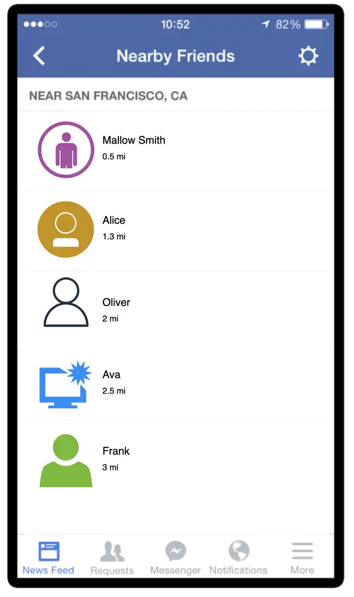
<p align="center">Figure 1: Facebook's nearby friends</p>

If you read the Proximity Service chapter, you may wonder why we need a separate chapter for designing "nearby friends" since it looks similar to proximity services. If you think carefully though, you will find major differences. In proximity services, the addresses for businesses are static as their locations do not change, while in "nearby friends", data is more dynamic because user locations change frequently.

---

## Step 1 - Understand the Problem and Establish Design Scope

**Candidate:** How geographically close is considered to be "nearby"?
**Interviewer:** 5 miles. This number should be configurable.

**Candidate:** Can I assume the distance is calculated as the straight-line distance between two users? In real life, there could be, for example, a river in between the users, resulting in a longer travel distance.
**Interviewer:** Yes, that's a reasonable assumption.

**Candidate:** How many users does the app have? Can I assume 1 billion users and 10% of them use the nearby friends feature?
**Interviewer:** Yes, that's a reasonable assumption.

**Candidate:** Do we need to store location history?
**Interviewer:** Yes, location history can be valuable for different purposes such as machine learning.

**Candidate:** Could we assume if a friend is inactive for more than 10 minutes, that friend will disappear from the nearby friend list? Or should we display the last known location?
**Interviewer:** We can assume inactive friends will no longer be shown.

**Candidate:** Do we need to worry about privacy and data laws such as GDPR or CCPA?
**Interviewer:** Good question. For simplicity, don't worry about it for now.

### Functional requirements

- Users should be able to see nearby friends on their mobile apps. Each entry in the nearby friend list has a distance and a timestamp indicating when the distance was last updated.
- Nearby friend lists should be updated every few seconds.

### Non-functional requirements

- **Low latency.** It's important to receive location updates from friends without too much delay.
- **Reliability.** The system needs to be reliable overall, but occasional data point loss is acceptable.
- **Eventual consistency.** The location data store doesn't need strong consistency. A few seconds delay in receiving location data in different replicas is acceptable.

### Back-of-the-envelope estimation

- Nearby friends are defined as friends whose locations are within a 5-mile radius.
- The location refresh interval is 30 seconds. The reason for this is that human walking speed is slow (average 3-4 miles per hour). The distance traveled in 30 seconds does not make a significant difference on the "nearby friends" feature.
- On average, 100 million users use the "nearby friends" feature every day.
- Assume the number of concurrent users is 10% of DAU, so the number of concurrent users is 10 million.
- On average, a user has 400 friends. Assume all of them use the "nearby friends" feature.
- The app displays 20 nearby friends per page and may load more nearby friends upon request.

**Calculate QPS:**

- 100 million DAU
- Concurrent users: 10% * 100 million = 10 million
- Users report their locations every 30 seconds.

```
Location update QPS = 10 million / 30 = ~334,000
```

---

## Step 2 - Propose High-Level Design and Get Buy-In

In this section, we will discuss the following: High-level design, API design, and Data model.

### High-level design

At a high level, this problem calls for a design with efficient message passing. Conceptually, a user would like to receive location updates from every active friend nearby. It could in theory be done purely peer-to-peer, that is, a user could maintain a persistent connection to every other active friend in the vicinity (Figure 2).
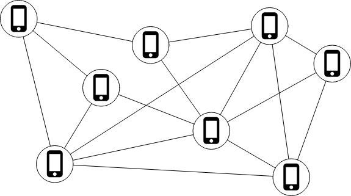
<p align="center">Figure 2: Peer-to-peer</p>

This solution is not practical for a mobile device with sometimes flaky connections and a tight power consumption budget, but the idea sheds some light on the general design direction.

A more practical design would have a shared backend (Figure 3).
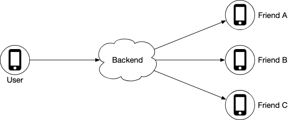
<p align="center">Figure 3: Shared backend</p>

What are the responsibilities of the backend in Figure 3?

- Receive location updates from all active users.
- For each location update, find all the active friends who should receive it and forward it to those users' devices.
- If the distance between two users is over a certain threshold, do not forward it to the recipient's device.

We have 10 million active users. With each user updating the location information every 30 seconds, there are 334K updates per second. If on average each user has 400 friends, and we further assume that roughly 10% of those friends are online and nearby, every second the backend forwards 334K * 400 * 10% = **14 million location updates per second**.

#### Proposed design

Figure 4 shows the basic design that should satisfy the functional requirements.
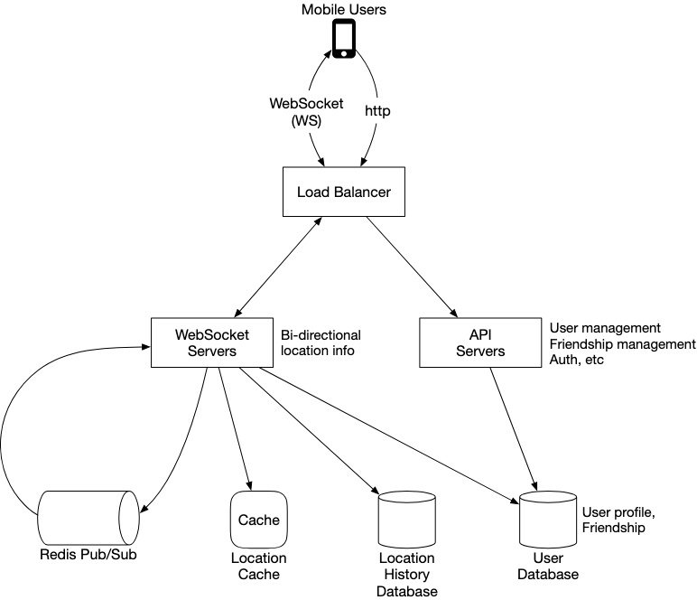
<p align="center">Figure 4: High-level design</p>

**Load balancer**

The load balancer sits in front of the RESTful API servers and the stateful, bi-directional WebSocket servers. It distributes traffic across those servers to spread out load evenly.

**RESTful API servers**

This is a cluster of stateless HTTP servers that handles the typical request/response traffic. This API layer handles auxiliary tasks like adding/removing friends, updating user profiles, etc.

<p align="center">Figure 5: RESTful API request flow</p>

**Websocket servers**

This is a cluster of stateful servers that handles the near real-time update of friends' locations. Each client maintains one persistent WebSocket connection to one of these servers. When there is a location update from a friend who is within the search radius, the update is sent on this connection to the client.

Another major responsibility of the WebSocket servers is to handle client initialization for the "nearby friends" feature. It seeds the mobile client with the locations of all nearby online friends.

**Redis location cache**

Redis is used to store the most recent location data for each active user. There is a Time to Live (TTL) set on each entry in the cache. When the TTL expires, the user is no longer active and the location data is expunged from the cache. Every update refreshes the TTL.

**User database**

The user database stores user data and user friendship data. Either a relational database or a NoSQL database can be used for this.

**Location history database**

This database stores users' historical location data. It is not directly related to the "nearby friends" feature.

**Redis pub/sub server**

Redis pub/sub [2] is a very lightweight message bus. Channels in Redis pub/sub are very cheap to create. A modern Redis server with GBs of memory could hold millions of channels (also called topics).
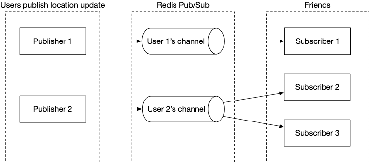
<p align="center">Figure 6: Redis Pub/Sub</p>

In this design, location updates received via the WebSocket server are published to the user's own channel in the Redis pub/sub server. A dedicated WebSocket connection handler for each active friend subscribes to the channel. When there is a location update, the WebSocket handler function gets invoked, and for each active friend, the function recomputes the distance. If the new distance is within the search radius, the new location and timestamp are sent via the WebSocket connection to the friend's client.

#### Periodic location update

The mobile client sends periodic location updates over the persistent WebSocket connection. The flow is shown in Figure 7.
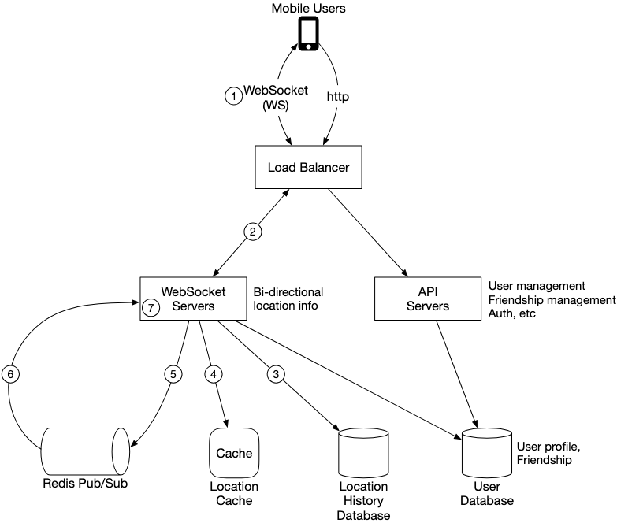
<p align="center">Figure 7: Periodic location update</p>

1. The mobile client sends a location update to the load balancer.
2. The load balancer forwards the location update to the persistent connection on the WebSocket server for that client.
3. The WebSocket server saves the location data to the location history database.
4. The WebSocket server updates the new location in the location cache. The update refreshes the TTL. The WebSocket server also saves the new location in a variable in the user's WebSocket connection handler for subsequent distance calculations.
5. The WebSocket server publishes the new location to the user's channel in the Redis pub/sub server. Steps 3 to 5 can be executed in parallel.
6. When Redis pub/sub receives a location update on a channel, it broadcasts the update to all the subscribers (WebSocket connection handlers). For each subscriber (i.e., for each of the user's friends), its WebSocket connection handler would receive the user location update.
7. On receiving the message, the WebSocket server computes the distance between the user sending the new location and the subscriber.
8. If the distance does not exceed the search radius, the new location and the last updated timestamp are sent to the subscriber's client. Otherwise, the update is dropped.
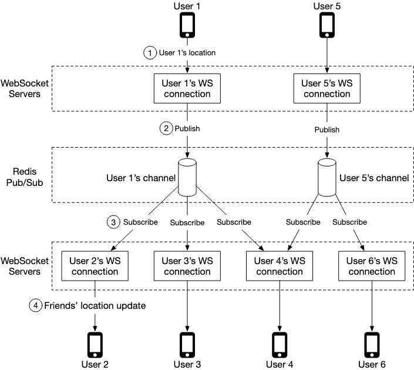
<p align="center">Figure 8: Send location update to friends</p>

When user 1's location changes, their location update is sent to the WebSocket server which holds user 1's connection. The location is published to user 1's channel in Redis pub/sub server. Redis pub/sub server broadcasts the location update to all subscribers. If the distance between the user sending the location (user 1) and the subscriber (user 2) doesn't exceed the search radius, the new location is sent to the client (user 2).

Since there are 400 friends on average, and we assume that 10% of those friends are online and nearby, there are about 40 location updates to forward for each user's location update.

### API design

**WebSocket:** Users send and receive location updates through the WebSocket protocol.

1. **Periodic location update** — Request: Client sends latitude, longitude, and timestamp. Response: Nothing.
2. **Client receives location updates** — Data sent: Friend location data and timestamp.
3. **WebSocket initialization** — Request: Client sends latitude, longitude, and timestamp. Response: Client receives friends' location data.
4. **Subscribe to a new friend** — Request: WebSocket server sends friend ID. Response: Friend's latest latitude, longitude, and timestamp.
5. **Unsubscribe a friend** — Request: WebSocket server sends friend ID. Response: Nothing.

**HTTP requests:** The API servers handle tasks like adding/removing friends, updating user profiles, etc.

### Data model

**Location cache**

The location cache stores the latest locations of all active users who have had the nearby friends feature turned on. We use Redis for this cache.

| key | value |
|---|---|
| user_id | {latitude, longitude, timestamp} |

<p align="center">Table 1: Location cache</p>

Why don't we use a database to store location data? The "nearby friends" feature only cares about the current location of a user. Therefore, we only need to store one location per user. Redis is an excellent choice because it provides super-fast read and write operations. It supports TTL, which we use to auto-purge users from the cache who are no longer active. The current locations do not need to be durably stored. If the Redis instance goes down, we could replace it with an empty new instance and let the cache be filled as new location updates stream in.

**Location history database**

The location history database stores users' historical location data and the schema looks like this:

| user_id | latitude | longitude | timestamp |
|---|---|---|---|

We need a database that handles the heavy-write workload well and can be horizontally scaled. Cassandra is a good candidate. We could also use a relational database sharded by user ID.

---

## Step 3 - Design Deep Dive

### How well does each component scale?

#### API servers

The methods to scale the RESTful API tiers are well understood. These are stateless servers, and there are many ways to auto-scale the clusters based on CPU usage, load, or I/O.

#### WebSocket servers

For the WebSocket cluster, it is not difficult to auto-scale based on usage. However, the WebSocket servers are stateful, so care must be taken when removing existing nodes. Before a node can be removed, all existing connections should be allowed to drain. To achieve that, we can mark a node as "draining" at the load balancer so that no new WebSocket connections will be routed to the draining server.

**Client initialization**

When a WebSocket connection is initialized, the client sends the initial location of the user, and the server performs the following tasks in the WebSocket connection handler:

1. It updates the user's location in the location cache.
2. It saves the location in a variable of the connection handler for subsequent calculations.
3. It loads all the user's friends from the user database.
4. It makes a batched request to the location cache to fetch the locations for all the friends.
5. For each location returned by the cache, the server computes the distance between the user and the friend at that location. If the distance is within the search radius, the friend's profile, location, and last updated timestamp are returned over the WebSocket connection to the client.
6. For each friend, the server subscribes to the friend's channel in the Redis pub/sub server. Creating a new channel is cheap, so the user subscribes to all active and inactive friends.
7. It sends the user's current location to the user's channel in the Redis pub/sub server.

#### User database

The user database holds two distinct sets of data: user profiles (user ID, username, profile URL, etc.) and friendships. These datasets at our design scale will likely not fit in a single relational database instance. The data is horizontally scalable by sharding based on user ID.

#### Location cache

We choose Redis to cache the most recent locations of all the active users. With 10 million active users at peak, and with each location taking no more than 100 bytes, a single modern Redis server with many GBs of memory should be able to easily hold the location information for all users.

However, with 10 million active users roughly updating every 30 seconds, the Redis server will have to handle 334K updates per second. This is likely too high, even for a modern high-end server. Luckily, this cache data is easy to shard. The location data for each user is independent, and we can evenly spread the load among several Redis servers by sharding the location data based on user ID.

To improve availability, we could replicate the location data on each shard to a standby node.

#### Redis pub/sub server

The pub/sub server is used as a routing layer to direct messages (location updates) from one user to all the online friends. We choose Redis pub/sub because it is very lightweight to create new channels. A new channel is created when someone subscribes to it. If a message is published to a channel that has no subscribers, the message is dropped.

Key design choices:

- We assign a unique channel to every user who uses the "nearby friends" feature. A user would, upon app initialization, subscribe to each friend's channel, whether the friend is online or not. This simplifies the design since the backend does not need to handle subscribing/unsubscribing as friends become active or inactive.
- The tradeoff is that the design would use more memory, but memory use is unlikely to be the bottleneck.

**How many Redis pub/sub servers do we need?**

*Memory usage:*

Assuming a channel is allocated for each user who uses the nearby friends feature, we need 100 million channels (1 billion * 10%). Assuming that on average a user has 100 active friends using this feature, and it takes about 20 bytes of pointers to track each subscriber:

```
100 million * 20 bytes * 100 friends / 10^9 = 200 GB
```

For a modern server with 100 GB of memory, we will need about 2 Redis pub/sub servers to hold all the channels.

*CPU usage:*

The pub/sub server pushes about 14 million updates per second to subscribers. Assuming a modern server can handle about 100,000 subscriber pushes per second:

```
14 million / 100,000 = 140 Redis servers
```

From the math, we conclude that the bottleneck of Redis pub/sub server is the CPU usage, not the memory usage. To support our scale, we need a **distributed Redis pub/sub cluster**.

#### Distributed Redis pub/sub server cluster

We introduce a service discovery component to our design. There are many service discovery packages available, with etcd [4] and Zookeeper [5] among the most popular ones. We need these two features:

1. The ability to keep a list of servers in the service discovery component, and a simple UI or API to update it. Using Figure 9 as an example, the key and value for the hash ring could look like this: `Key: /config/pub_sub_ring` / `Value: [ "p_1", "p_2", "p_3", "p_4"]`
2. The ability for clients (in this case, the WebSocket servers) to subscribe to any updates to the "Value" (Redis pub/sub servers).

Under the "Key" mentioned above, we store a hash ring of all the active Redis pub/sub servers in the service discovery component. The hash ring is used by the publishers and subscribers of the Redis pub/sub servers to determine the pub/sub server to talk to for each channel.
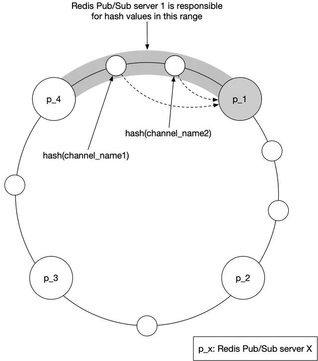
<p align="center">Figure 9: Consistent hashing</p>

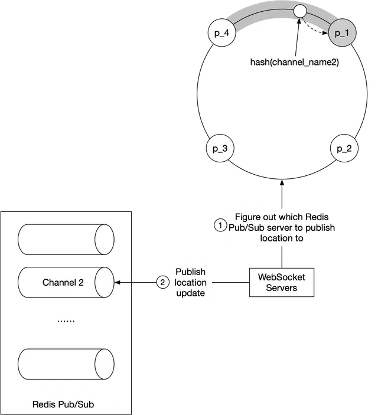
<p align="center">Figure 10: Figure out the correct Redis pub/sub server</p>

The WebSocket server consults the hash ring to determine the Redis pub/sub server to write to. For efficiency, a copy of the hash ring could be cached on each WebSocket server. The WebSocket server subscribes to any updates on the hash ring to keep its local in-memory copy up to date. Then it publishes the location update to the user's channel on that Redis pub/sub server.

**Scaling considerations for Redis pub/sub servers**

The messages sent on a pub/sub channel are not persisted in memory or on disk — they are sent to all subscribers and removed immediately. However, the subscriber list for each channel is a key piece of state tracked by the pub/sub servers. If a channel is moved, every subscriber must know about it, so they can unsubscribe from the channel on the old server and resubscribe to the replacement channel on the new server.

For these reasons, we should treat the Redis pub/sub cluster more like a stateful cluster. The cluster is normally over-provisioned to handle daily peak traffic. Resizing should be done when usage is at its lowest in the day.
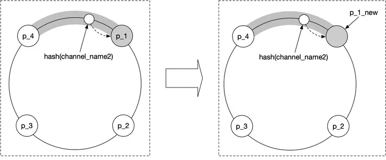
<p align="center">Figure 11: Replace pub/sub server</p>

**Adding/removing friends**

When a new friend is added, the client's WebSocket connection handler on the server needs to be notified, so it can subscribe to the new friend's pub/sub channel. When a friend is removed, the callback sends a message to the WebSocket server to unsubscribe from the friend's pub/sub channel. This subscribe/unsubscribe callback could also be used whenever a friend has opted in or out of the location update.

**Users with many friends**

With thousands of friends, the pub/sub subscribers will be scattered among the many WebSocket servers in the cluster. The update load would be spread among them and it's unlikely to cause any hotspots.

**Nearby random person**

What if the interviewer wants to update the design to show random people who opted-in to location-sharing?

One way to do this while leveraging our design is to add a pool of pub/sub channels by geohash. As shown in Figure 12, an area is divided into four geohash grids and a channel is created for each grid. Anyone within the grid subscribes to the same channel.
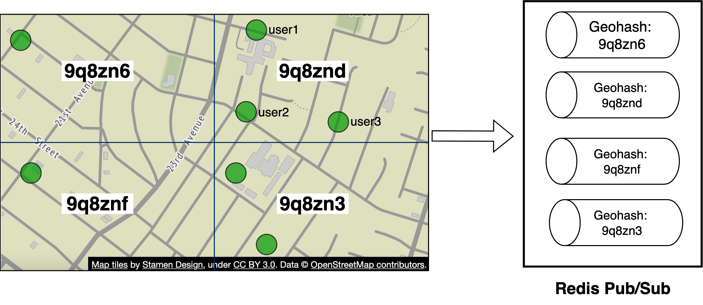
<p align="center">Figure 12: Redis pub/sub channels</p>

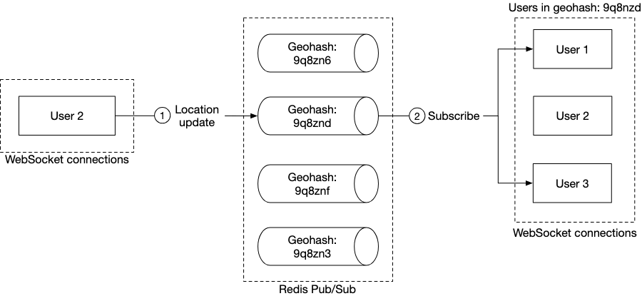
<p align="center">Figure 13: Publish location update to random nearby person</p>

When a user updates their location, the WebSocket connection handler computes the user's geohash ID and sends the location to the channel for that geohash. Anyone nearby who subscribes to the channel will receive a location update message.

To handle people who are close to the border of a geohash grid, every client could subscribe to the geohash the user is in and the eight surrounding geohash grids.
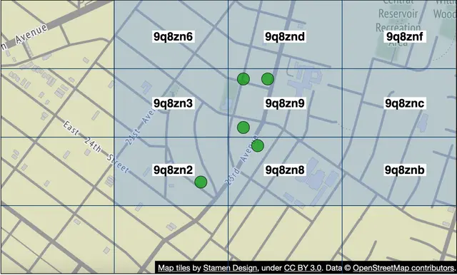
<p align="center">Figure 14: Nine geohash grids</p>

#### Alternative to Redis pub/sub

Erlang [8] is a great alternative solution for this particular problem. Erlang is a general programming language and runtime environment built for highly distributed and concurrent applications. The power of Erlang lies in its lightweight processes — a minimal Erlang process takes about 300 bytes, and we can have millions of these processes on a single modern server.

How would we use Erlang in our design? We would implement the WebSocket service in Erlang, and also replace the entire cluster of Redis pub/sub with a distributed Erlang application. In this application, each user is modeled as an Erlang process. The user process would receive updates from the WebSocket server when a user's location is updated by the client. The user process also subscribes to updates from the Erlang processes of the user's friends. This forms a mesh of connections that would efficiently route location updates from one user to many friends.

---

## Step 4 - Wrap Up

In this chapter, we presented a design that supports a nearby friends feature. Conceptually, we want to design a system that can efficiently pass location updates from one user to their friends.

Some of the core components include:

- **WebSocket:** real-time communication between clients and the server.
- **Redis:** fast read and write of location data.
- **Redis pub/sub:** routing layer to direct location updates from one user to all the online friends.

We first came up with a high-level design at a lower scale and then discussed challenges that arise as the scale increases. We explored how to scale the following: RESTful API servers, WebSocket servers, data layer, Redis pub/sub servers, and alternatives to Redis pub/sub.

Finally, we discussed potential bottlenecks when a user has many friends and we proposed a design for the "nearby random person" feature.

Congratulations on getting this far! Now give yourself a pat on the back. Good job!

---
### Chapter Summary

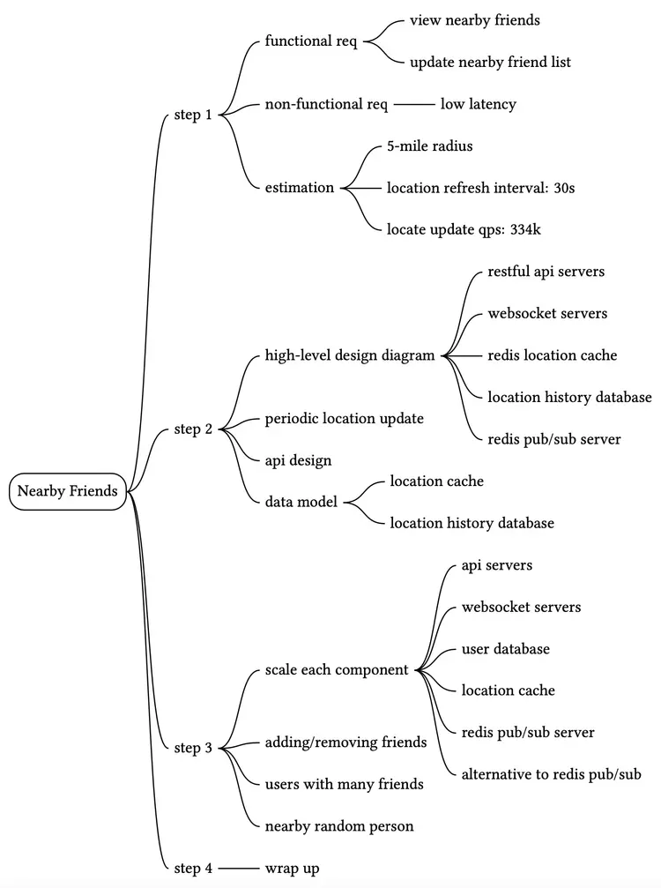

## Reference Materials

[1] Facebook Launches "Nearby Friends": https://techcrunch.com/2014/04/17/facebook-nearby-friends/

[2] Redis Pub/Sub: https://redis.io/topics/pubsub

[3] Redis Pub/Sub under the hood: https://jameshfisher.com/2017/03/01/redis-pubsub-under-the-hood/

[4] etcd: https://etcd.io/

[5] Zookeeper: https://zookeeper.apache.org/

[6] Consistent hashing: https://www.toptal.com/big-data/consistent-hashing

[7] OpenStreetMap: www.openstreetmap.org

[8] Erlang: https://www.erlang.org/

[9] Elixir: https://elixir-lang.org/

[10] A brief introduction to BEAM: https://www.erlang.org/blog/a-brief-beam-primer/

[11] OTP: https://www.erlang.org/doc/design_principles/des_princ.html